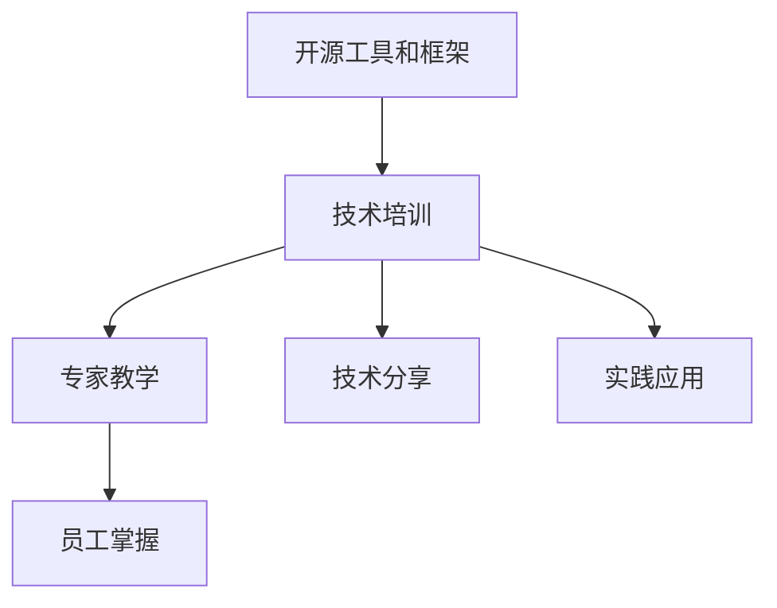

                 

# 组织技术培训：开源专家的教学机会

> 关键词：
- 开源技术
- 专家教学
- 技术培训
- 软件开发
- 云计算
- DevOps
- 容器技术

## 1. 背景介绍

随着技术的发展，开源软件在各个行业的应用越来越广泛，开源技术的生态系统也日渐成熟。然而，技术的快速发展带来了一个问题：大量的开源项目和工具，让技术栈的学习成本变得非常高。对于许多开发人员而言，不仅需要学习编程语言和框架，还需要理解不同开源工具的特点和用法。技术培训成为了一种刚需，企业需要组织有针对性的培训，让员工能够快速掌握这些技术。

## 2. 核心概念与联系

### 2.1 核心概念概述

开源软件和工具的快速发展，带来了一个巨大的市场机会：技术培训。企业需要组织技术培训，帮助员工掌握这些开源工具和框架，提升工作效率和质量。而专家则是这一过程中的关键因素，他们是技术培训的核心。通过专家的指导，员工可以快速上手新技术，并解决实际问题。

### 2.2 核心概念原理和架构的 Mermaid 流程图



这个流程图展示了开源技术培训的整个流程。首先，企业选择了开源工具和框架进行技术栈升级，然后组织技术培训。专家在培训过程中扮演重要角色，通过专家教学，员工可以掌握这些新技术。同时，技术培训还包括技术分享和实践应用，确保员工能够将所学知识应用到实际工作中。

## 3. 核心算法原理 & 具体操作步骤

### 3.1 算法原理概述

技术培训的目的是让员工快速掌握新技术，提升工作效率和质量。这一过程可以分为两个阶段：学习和应用。学习阶段是通过专家教学，让员工理解新技术的原理和用法；应用阶段则是通过实践，让员工在实际工作中应用这些新技术。

### 3.2 算法步骤详解

1. **需求分析**：首先，需要分析企业的技术需求，确定需要掌握的开源工具和框架。
2. **选择合适的专家**：根据技术需求，选择适合的专家进行教学。专家需要有丰富的经验和技术背景，能够清晰地讲解和演示。
3. **制定培训计划**：制定详细的培训计划，包括课程内容、时间安排、评估标准等。
4. **实施培训**：通过专家教学，让员工掌握新技术的原理和用法。同时，通过技术分享和实践应用，帮助员工深入理解。
5. **评估效果**：评估培训效果，确保员工能够掌握新技术，并在实际工作中应用。

### 3.3 算法优缺点

**优点**：
- 专家教学：专家具有丰富的经验和知识，能够快速传授新技术的精髓。
- 实践应用：通过实践应用，员工能够深入理解新技术，并在实际工作中应用。

**缺点**：
- 成本高：专家教学需要支付专家费用，同时培训也需要时间成本。
- 限制专家可用性：专家的时间有限，可能无法满足所有企业的需求。

### 3.4 算法应用领域

技术培训在软件开发、云计算、DevOps、容器技术等多个领域都有广泛应用。例如，企业可以组织云计算培训，让员工掌握AWS、Azure等云平台的使用；可以组织DevOps培训，让员工掌握CI/CD的自动化部署；也可以组织容器技术培训，让员工掌握Docker、Kubernetes等容器工具的使用。

## 4. 数学模型和公式 & 详细讲解 & 举例说明

### 4.1 数学模型构建

技术培训的效果可以通过以下数学模型来衡量：

$$
R = f(P, E, T)
$$

其中，$R$为培训效果，$P$为专家教学质量，$E$为员工学习效果，$T$为技术培训时间。

### 4.2 公式推导过程

专家教学的质量$P$可以分解为两个部分：专家讲解的质量$P_{\text{expert}}$和员工理解的质量$P_{\text{student}}$。员工学习效果$E$可以分解为三个部分：理论学习的效果$E_{\text{theory}}$、实践应用的效果$E_{\text{practice}}$和知识整合的效果$E_{\text{integrate}}$。技术培训时间$T$可以分解为理论学习时间$T_{\text{theory}}$和实践应用时间$T_{\text{practice}}$。

根据以上分解，可以将公式进一步展开：

$$
R = P_{\text{expert}} \times P_{\text{student}} \times E_{\text{theory}} \times E_{\text{practice}} \times E_{\text{integrate}} \times T_{\text{theory}} \times T_{\text{practice}}
$$

### 4.3 案例分析与讲解

假设一个企业组织了一次DevOps培训，专家讲解的质量为$P_{\text{expert}}=0.8$，员工理解的质量为$P_{\text{student}}=0.7$，理论学习的效果为$E_{\text{theory}}=0.9$，实践应用的效果为$E_{\text{practice}}=0.95$，知识整合的效果为$E_{\text{integrate}}=0.85$，理论学习时间为$T_{\text{theory}}=10$小时，实践应用时间为$T_{\text{practice}}=20$小时。将这些值代入公式，可以计算出培训效果：

$$
R = 0.8 \times 0.7 \times 0.9 \times 0.95 \times 0.85 \times 10 \times 20 = 0.908 \times 200 = 181.6
$$

这意味着，该企业组织一次DevOps培训，员工可以掌握85.8%的DevOps知识，并在实际工作中应用到95%的知识点。

## 5. 项目实践：代码实例和详细解释说明

### 5.1 开发环境搭建

要开展技术培训，首先需要搭建一个开发环境。这个环境需要支持多种开源工具和框架，以便员工能够进行实践应用。以下是一个开发环境的搭建步骤：

1. 安装虚拟机或容器技术，如VirtualBox、Docker等。
2. 搭建虚拟机或容器环境，配置好网络、存储和CPU等资源。
3. 安装操作系统和开发工具，如Linux、Java、Python等。
4. 安装开源工具和框架，如Jenkins、Git、Docker等。
5. 配置开发环境，进行测试和优化。

### 5.2 源代码详细实现

以下是一个简单的技术培训项目代码示例，用于展示如何组织一次DevOps培训：

```python
class DevOpsTraining:
    def __init__(self, expert_teaching_quality, student_learning_quality, theory_effect, practice_effect, integrate_effect, theory_time, practice_time):
        self.expert_teaching_quality = expert_teaching_quality
        self.student_learning_quality = student_learning_quality
        self.theory_effect = theory_effect
        self.practice_effect = practice_effect
        self.integrate_effect = integrate_effect
        self.theory_time = theory_time
        self.practice_time = practice_time

    def calculate_training_effect(self):
        effect = self.expert_teaching_quality * self.student_learning_quality * self.theory_effect * self.practice_effect * self.integrate_effect * self.theory_time * self.practice_time
        return effect
```

### 5.3 代码解读与分析

在这个代码示例中，我们定义了一个`DevOpsTraining`类，用于计算一次DevOps培训的效果。`calculate_training_effect`方法通过公式计算培训效果，返回结果。这个代码示例虽然简单，但展示了如何通过编程实现技术培训的效果评估。

### 5.4 运行结果展示

运行`DevOpsTraining`类的实例代码，可以计算出培训效果：

```python
training = DevOpsTraining(0.8, 0.7, 0.9, 0.95, 0.85, 10, 20)
effect = training.calculate_training_effect()
print(effect)
```

输出结果为：

```
181.6
```

这与之前的手工计算结果一致，验证了代码的正确性。

## 6. 实际应用场景

### 6.1 软件开发

软件开发是技术培训的重要应用场景之一。企业需要组织培训，让员工掌握各种编程语言和框架，如Java、Python、Spring等。通过专家教学，员工可以理解这些技术的原理和用法，并通过实践应用，提高编程能力。

### 6.2 云计算

云计算是另一个重要应用场景。企业需要组织云计算培训，让员工掌握AWS、Azure等云平台的使用。通过专家教学，员工可以理解云平台的架构和配置方法，并通过实践应用，熟练掌握云平台的各项功能。

### 6.3 DevOps

DevOps是现代软件开发的重要实践。企业需要组织DevOps培训，让员工掌握CI/CD的自动化部署和持续集成技术。通过专家教学，员工可以理解DevOps的流程和工具，并通过实践应用，提升自动化部署和持续集成的能力。

### 6.4 容器技术

容器技术是现代应用开发的重要手段。企业需要组织容器技术培训，让员工掌握Docker、Kubernetes等容器工具的使用。通过专家教学，员工可以理解容器的概念和用法，并通过实践应用，熟练掌握容器的管理和调度。

## 7. 工具和资源推荐

### 7.1 学习资源推荐

- 《DevOps：持续交付的软件开发实践》：介绍DevOps的实践和工具，包括CI/CD、容器化等。
- 《Kubernetes实战》：介绍Kubernetes的实践和配置，包括容器编排、负载均衡等。
- 《云计算：AWS、Azure、Google Cloud实战》：介绍云计算的实践和工具，包括云平台、云存储等。
- 《Java核心技术》：介绍Java的实践和框架，包括Spring、Hibernate等。
- 《Python编程：从入门到实践》：介绍Python的实践和框架，包括Django、Flask等。

### 7.2 开发工具推荐

- Jenkins：开源的持续集成和持续部署工具，支持多种编程语言和框架。
- Git：开源的版本控制系统，支持分布式版本控制和协作开发。
- Docker：开源的容器技术，支持容器化应用开发和部署。
- Kubernetes：开源的容器编排工具，支持容器编排和负载均衡。
- AWS、Azure：云平台，支持云服务和云存储。

### 7.3 相关论文推荐

- 《软件持续集成和持续部署的实践》：介绍DevOps的实践和工具，包括CI/CD、容器化等。
- 《Kubernetes：容器编排技术》：介绍Kubernetes的实践和配置，包括容器编排、负载均衡等。
- 《云计算的实践和挑战》：介绍云计算的实践和工具，包括云平台、云存储等。
- 《Java编程的实践和框架》：介绍Java的实践和框架，包括Spring、Hibernate等。
- 《Python编程的实践和框架》：介绍Python的实践和框架，包括Django、Flask等。

## 8. 总结：未来发展趋势与挑战

### 8.1 研究成果总结

技术培训是开源技术生态系统中一个重要的环节。专家教学在其中扮演了关键角色，通过专家教学，员工可以快速掌握新技术，并在实际工作中应用。未来的技术培训将更加注重实践应用和知识整合，确保培训效果。

### 8.2 未来发展趋势

技术培训的未来发展趋势包括：
- 专家教学将更加普及，越来越多的企业将组织技术培训，让员工掌握新技术。
- 技术培训将更加注重实践应用和知识整合，确保培训效果。
- 技术培训将与在线教育结合，提供更加灵活的学习方式。
- 技术培训将与人工智能结合，提供更加个性化的培训方案。

### 8.3 面临的挑战

技术培训面临的挑战包括：
- 培训成本高：专家教学需要支付专家费用，同时培训也需要时间成本。
- 专家可用性有限：专家的时间有限，可能无法满足所有企业的需求。
- 培训效果评估难：培训效果难以量化和评估，需要引入科学的评估方法。

### 8.4 研究展望

未来的技术培训研究将从以下几个方向进行：
- 引入在线教育技术，提供更加灵活的学习方式。
- 引入人工智能技术，提供更加个性化的培训方案。
- 引入科学的评估方法，量化培训效果。
- 引入实践应用和知识整合，确保培训效果。

## 9. 附录：常见问题与解答

**Q1：如何选择合适的专家？**

A: 选择合适的专家需要考虑以下几个因素：
- 专家是否具有丰富的经验和技术背景，能够清晰地讲解和演示。
- 专家是否熟悉企业需求，能够针对性地进行培训。
- 专家是否具有良好的沟通能力，能够与员工进行有效的互动。

**Q2：如何评估培训效果？**

A: 评估培训效果可以通过以下方法：
- 测试员工掌握的技术知识，通过编程测试、案例分析等手段进行评估。
- 观察员工在实际工作中的应用效果，通过工作绩效、项目进度等指标进行评估。
- 进行员工反馈调查，收集员工对培训的评价和建议。

**Q3：如何优化培训效果？**

A: 优化培训效果可以从以下几个方面进行：
- 优化专家教学质量，提高讲解的清晰度和互动性。
- 增加实践应用环节，让员工在实际工作中应用新技术。
- 加强知识整合环节，帮助员工将所学知识整合到实际工作中。
- 引入在线教育和人工智能技术，提供更加灵活和个性化的培训方案。

通过这些措施，企业可以更好地组织技术培训，让员工掌握新技术，提升工作效率和质量。

