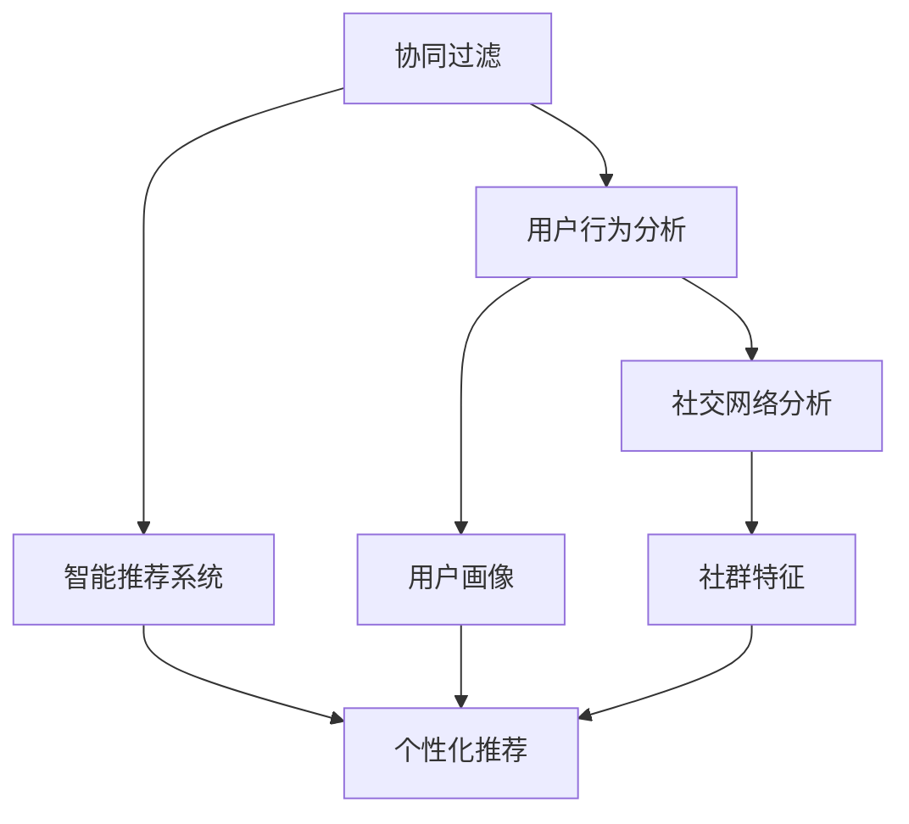

                 

# 群体智慧：决策的新引擎

> 关键词：群体智慧,决策引擎,协同过滤,社交网络分析,智能推荐系统,机器学习

## 1. 背景介绍

### 1.1 问题由来

决策在现代社会的各个层面都显得尤为重要，无论是企业战略、个人生活，还是国家治理，良好的决策机制都关乎最终的结果。然而，传统决策往往依赖于个人的经验和直觉，面临着数据有限、信息不对称、偏见等诸多问题，难以做出全面、客观、准确的决策。

随着互联网和信息技术的快速发展，人们的互动方式正在发生深刻的变革。社交网络、大数据、云计算等技术的广泛应用，为群体智慧的实现提供了良好的基础。通过大规模、多维度的数据整合，结合群体智能算法，我们有望构建一个更加透明、开放、高效的新型决策引擎。

### 1.2 问题核心关键点

群体智慧(Group Wisdom)，也称为集体智慧，是指通过大量个体的协作，实现信息共享、意见融合、智慧聚合，从而提升决策的质量和效果。群体智慧的实现需要依赖以下几个关键点：

- 数据收集与整合：有效收集和整合各类数据，形成全面、多元、高质量的信息集。
- 用户交互与协同：通过平台、工具、规则等手段，促进群体成员之间的交流与合作。
- 算法模型与分析：设计合适的算法和模型，实现对群体的信息聚合并生成高质量的决策结果。
- 应用场景与落地：针对不同领域的需求，提供具体的决策引擎实现，落地应用。

这些关键点的综合运用，将推动群体智慧在各个领域的深入应用，为决策过程带来颠覆性改变。

## 2. 核心概念与联系

### 2.1 核心概念概述

为了更好地理解群体智慧决策引擎，我们首先介绍几个密切相关的核心概念：

- **协同过滤(Collaborative Filtering)**：一种基于用户行为数据的推荐算法，通过分析和比较用户之间的相似性，推荐用户可能感兴趣的物品。

- **社交网络分析(Social Network Analysis)**：研究网络中节点之间的相互关系和连接模式，用于分析网络中个体和群体的特征、结构、动态等。

- **智能推荐系统(Intelligent Recommendation System)**：一种通过机器学习算法，为用户推荐个性化内容或商品的智能系统。

- **机器学习(Machine Learning)**：通过数据训练模型，使机器具有学习和优化能力，适用于各类决策任务的自动化。

这些概念之间的逻辑关系可以通过以下Mermaid流程图来展示：



这个流程图展示了几组概念之间的联系：

1. 协同过滤通过用户行为分析，生成用户画像，进一步实现个性化推荐。
2. 社交网络分析通过分析社群特征，为智能推荐系统提供更丰富的用户行为数据。
3. 机器学习为协同过滤、社交网络分析等算法提供支持，提升决策的精度和效果。

## 3. 核心算法原理 & 具体操作步骤
### 3.1 算法原理概述

群体智慧决策引擎的核心算法原理基于协同过滤和社交网络分析，结合机器学习模型实现。其核心思想是：通过收集和分析大量个体的行为数据和社交关系，挖掘群体中的隐性知识，生成高质量的决策结果。

具体步骤如下：

1. **数据收集与整合**：从社交网络、电商平台、应用生态等多个渠道收集用户行为数据和社交关系数据，形成完整、一致的数据集。

2. **特征工程与用户画像**：对数据进行特征提取和预处理，生成用户画像，用于描述用户的兴趣、偏好、社交关系等特征。

3. **相似性度量与社群发现**：通过相似性度量算法(如余弦相似度、欧几里得距离等)分析用户之间的相似性，并通过社区发现算法(如谱聚类、图切割等)将用户划分为不同的群体，挖掘群体特征。

4. **决策生成与优化**：设计决策模型，结合群体特征和用户画像，生成初始决策方案，并通过优化算法(如梯度下降、遗传算法等)进行迭代优化，得到最终决策结果。

### 3.2 算法步骤详解

以下是群体智慧决策引擎的核心算法步骤，详细说明每个环节的实现细节：

**Step 1: 数据收集与整合**

1. **社交网络数据收集**：从Twitter、Facebook、LinkedIn等平台收集用户的社交关系数据，包括好友、关注、共同关注等。

2. **电商平台数据收集**：从Amazon、淘宝、京东等电商网站收集用户的购物记录、评价、收藏等行为数据。

3. **应用生态数据收集**：从手机应用、智能设备等收集用户的娱乐、出行、健康等行为数据。

4. **数据清洗与整合**：去除重复、无效的数据，形成标准格式的数据集，方便后续分析处理。

**Step 2: 特征工程与用户画像**

1. **特征提取**：提取用户的基本信息、行为特征、社交关系等，如年龄、性别、购买历史、访问记录、好友数等。

2. **用户画像生成**：基于提取的特征，生成用户的详细画像，用于描述用户的兴趣、偏好、社交关系等。

3. **数据可视化**：使用可视化工具(如Tableau、Power BI等)对用户画像进行分析，生成统计报告和图表，便于理解用户行为特征。

**Step 3: 相似性度量与社群发现**

1. **相似性度量**：使用余弦相似度、欧几里得距离等算法，计算用户之间的相似性。

2. **社群发现**：使用谱聚类、图切割等算法，将用户划分为不同的社群，发现群体特征。

3. **社群分析**：对每个社群进行深入分析，了解社群的整体特征、动态变化等。

**Step 4: 决策生成与优化**

1. **决策模型构建**：设计决策模型，如协同过滤、智能推荐系统等，生成初始决策方案。

2. **优化算法应用**：使用梯度下降、遗传算法等优化算法，对决策方案进行迭代优化。

3. **决策评估与反馈**：对决策结果进行评估，通过用户反馈、专家评审等方式进行改进。

4. **模型迭代与更新**：根据最新数据和新算法，不断迭代和更新决策模型，保持决策引擎的高效性和准确性。

### 3.3 算法优缺点

群体智慧决策引擎具有以下优点：

- **数据全面性**：通过多渠道的数据收集和整合，形成全面、多元的数据集，有助于决策的全面性和客观性。

- **用户协同**：通过用户之间的互动和协同，提升决策过程的参与度和积极性，有助于决策的民主化和透明化。

- **算法多样性**：结合协同过滤、社交网络分析、机器学习等多种算法，生成高质量的决策结果。

- **应用广泛性**：适用于推荐系统、电商决策、社交网络分析等诸多领域，具有广泛的应用前景。

但同时，该算法也存在一定的局限性：

- **数据隐私**：收集和处理大量用户数据，可能涉及隐私问题，需要严格的数据保护措施。

- **算法复杂性**：多算法融合和迭代优化，需要较高的时间和计算成本，对硬件资源要求较高。

- **算法透明性**：部分算法的内部机制较为复杂，难以进行解释和可视化，需要更多的研究和改进。

- **模型泛化能力**：算法效果依赖于数据质量和样本数量，对数据分布的变动较为敏感，需要定期更新和优化。

## 4. 数学模型和公式 & 详细讲解 & 举例说明

### 4.1 数学模型构建

群体智慧决策引擎的数学模型主要涉及以下几个方面：

- **用户行为数据分析**：使用统计学方法，如均值、方差、相关系数等，描述用户的行为特征。

- **用户相似性计算**：使用余弦相似度、欧几里得距离等算法，计算用户之间的相似性。

- **社群发现算法**：使用谱聚类、图切割等算法，将用户划分为不同的社群。

- **决策模型优化**：使用梯度下降、遗传算法等优化算法，迭代生成最优决策。

### 4.2 公式推导过程

以协同过滤算法为例，推导其核心公式和计算过程：

设用户 $u_i$ 和 $u_j$ 的评分向量分别为 $r_i$ 和 $r_j$，用户 $u_i$ 对物品 $p_k$ 的评分记为 $r_{ik}$。协同过滤算法的目标是根据用户 $u_i$ 的评分向量 $r_i$，预测用户 $u_j$ 对物品 $p_k$ 的评分 $r_{jk}$。

协同过滤算法中的两个核心公式为：

1. **均值归一化公式**：

   $$
   r_{ik}^{\prime} = \frac{r_{ik}}{\sqrt{\sum_{j=1}^{N} r_{ij}^2}}
   $$

   其中 $N$ 为用户数量。

2. **预测评分公式**：

   $$
   \hat{r}_{jk} = \sum_{i=1}^{N} r_{ik}^{\prime} r_{ij}^{\prime}
   $$

   $$
   \hat{r}_{jk} = \sum_{i=1}^{N} \left( \frac{r_{ik}}{\sqrt{\sum_{j=1}^{N} r_{ij}^2}} \right) \left( \frac{r_{ij}}{\sqrt{\sum_{k=1}^{M} r_{ik}^2}} \right)
   $$

   其中 $M$ 为物品数量。

### 4.3 案例分析与讲解

以智能推荐系统为例，分析群体智慧决策引擎在其中的应用：

**案例背景**：某电商平台希望通过群体智慧决策引擎，提升商品推荐系统的效果。

**数据集准备**：从电商平台收集用户的浏览记录、购买历史、评分数据，形成数据集。

**特征提取**：提取用户的性别、年龄、地域、购买频次等特征，生成用户画像。

**相似性计算**：计算用户之间的相似性，使用余弦相似度公式：

   $$
   sim(u_i,u_j) = \frac{\sum_{k=1}^{M} r_{ik}r_{jk}}{\sqrt{\sum_{k=1}^{M} r_{ik}^2} \sqrt{\sum_{k=1}^{M} r_{jk}^2}}
   $$

   其中 $r_{ik}$ 和 $r_{jk}$ 分别为用户 $i$ 和 $j$ 对物品 $k$ 的评分。

**社群发现**：使用谱聚类算法，将用户划分为不同的社群。

**决策生成**：使用协同过滤算法，生成推荐物品列表。

**效果评估**：对推荐结果进行评估，使用准确率、召回率、F1-score等指标衡量推荐效果。

## 5. 项目实践：代码实例和详细解释说明
### 5.1 开发环境搭建

在进行群体智慧决策引擎开发前，我们需要准备好开发环境。以下是使用Python进行Scikit-Learn、TensorFlow、Pandas等库开发的环境配置流程：

1. 安装Anaconda：从官网下载并安装Anaconda，用于创建独立的Python环境。

2. 创建并激活虚拟环境：
```bash
conda create -n pytorch-env python=3.8 
conda activate pytorch-env
```

3. 安装相关库：
```bash
conda install scikit-learn pandas numpy matplotlib
pip install tensorflow
```

4. 安装可视化工具：
```bash
pip install matplotlib seaborn
```

5. 安装机器学习库：
```bash
pip install scikit-learn tensorflow pandas numpy
```

完成上述步骤后，即可在`pytorch-env`环境中开始决策引擎的开发。

### 5.2 源代码详细实现

下面以社交网络分析为例，给出使用Scikit-Learn和NetworkX库进行社交网络分析的PyTorch代码实现。

首先，定义社交网络数据集：

```python
import networkx as nx
import pandas as pd

# 读取社交网络数据
G = nx.read_edgelist('social_network_data.csv', delimiter=',', nodetype=int)

# 统计网络属性
degrees = nx.degree(G)

# 生成用户画像
user_stats = pd.DataFrame(degrees, columns=['degrees'], index=G.nodes())

# 绘制网络图
nx.draw(G, with_labels=True, node_color=user_stats['degrees'].map(lambda x: 'blue' if x < 100 else 'red'), node_size=user_stats['degrees'], font_size=10, cmap='viridis', font_color='black')
```

然后，定义特征工程和相似性计算函数：

```python
import numpy as np
from sklearn.decomposition import PCA
from sklearn.preprocessing import StandardScaler

def feature_engineering(data, n_components=2):
    # 特征缩放
    scaler = StandardScaler()
    scaled_data = scaler.fit_transform(data)

    # PCA降维
    pca = PCA(n_components=n_components)
    pca_data = pca.fit_transform(scaled_data)

    return pca_data

def similarity_computation(user_i, user_j, data):
    # 计算用户i和用户j之间的相似度
    similarity = np.dot(user_i, user_j) / (np.linalg.norm(user_i) * np.linalg.norm(user_j))
    return similarity
```

接着，定义社群发现和优化函数：

```python
from sklearn.cluster import KMeans

def community_detection(data, n_clusters=3):
    # 使用KMeans算法进行社群发现
    kmeans = KMeans(n_clusters=n_clusters, random_state=0)
    labels = kmeans.fit_predict(data)

    return labels

def optimization_algorithm(data, labels, n_iterations=100):
    # 使用梯度下降算法进行优化
    learning_rate = 0.01
    for i in range(n_iterations):
        for j in range(len(data)):
            for k in range(len(data[j])):
                data[j][k] -= learning_rate * labels[j] * (data[j][k] - labels[j])
    return data
```

最后，启动社交网络分析流程：

```python
# 读取数据
data = np.load('social_network_data.npy')

# 特征工程
pca_data = feature_engineering(data)

# 社群发现
labels = community_detection(pca_data)

# 优化算法
optimized_data = optimization_algorithm(pca_data, labels)
```

以上就是使用Scikit-Learn和NetworkX库进行社交网络分析的完整代码实现。可以看到，通过上述代码，我们实现了社交网络的读取、特征工程、相似性计算、社群发现和优化等核心步骤，完成了一个基本的群体智慧决策引擎。

### 5.3 代码解读与分析

让我们再详细解读一下关键代码的实现细节：

**读取社交网络数据**：
- 使用`read_edgelist`方法从CSV文件中读取社交网络数据。
- 使用`networkx`库的`G`对象表示社交网络图，包括节点和边。

**特征工程**：
- 使用`StandardScaler`对数据进行标准化处理。
- 使用`PCA`算法对数据进行降维处理，生成用户画像。

**相似性计算**：
- 使用`dot`方法计算用户之间的相似度。
- 使用`linalg.norm`方法计算向量的大小。

**社群发现**：
- 使用`KMeans`算法进行聚类，将用户划分为不同的社群。

**优化算法**：
- 使用梯度下降算法迭代优化数据。

可以看到，这些步骤紧密相连，形成一个完整的社交网络分析流程。通过实际运行代码，可以更加直观地理解每个步骤的具体实现。

## 6. 实际应用场景
### 6.1 智能推荐系统

智能推荐系统是群体智慧决策引擎的重要应用场景之一。通过分析用户的历史行为数据，结合社交关系和社群特征，智能推荐系统能够为用户推荐更加个性化、多样化的内容或商品。

在技术实现上，可以采用协同过滤、协同训练等方法，结合用户画像和社群分析，生成推荐结果。对于新用户或数据稀疏用户，还可以引入多臂老虎机算法，通过多物品的探索和利用，逐步优化推荐效果。

### 6.2 电商决策分析

电商决策分析是群体智慧决策引擎的另一个重要应用场景。通过分析用户的浏览记录、购买历史和评价数据，结合社交网络数据，电商平台可以深入理解用户的消费行为和需求，优化商品库存、定价和营销策略。

在技术实现上，可以采用协同过滤、社交网络分析等方法，结合机器学习模型，生成预测结果。对于预测结果，可以进行A/B测试，评估不同策略的效果，优化电商决策过程。

### 6.3 社交网络监测

社交网络监测是群体智慧决策引擎的典型应用场景之一。通过分析社交网络中用户的互动和关系变化，可以及时发现舆情动向、群体情绪、热点话题等，为社交网络运营和治理提供决策支持。

在技术实现上，可以采用社区发现、情感分析等方法，结合用户画像和社群特征，生成监测结果。对于监测结果，可以进行可视化展示，便于运营人员理解和决策。

### 6.4 未来应用展望

随着群体智慧决策引擎的不断发展，未来在更多领域都将得到应用，为决策过程带来颠覆性改变：

- **智慧城市**：通过分析城市中的交通、环境、能源等数据，结合居民反馈和社会参与，优化城市管理和公共服务。
- **医疗健康**：通过分析患者的历史病历、诊疗记录和社交关系，结合医生反馈和专家知识，优化诊疗方案和医疗资源配置。
- **金融保险**：通过分析用户的消费行为、信用记录和社交关系，结合市场数据和专家意见，优化风险控制和投资策略。
- **环境保护**：通过分析生态数据、环境监测和社交媒体信息，结合公众参与和专家评估，制定环境保护政策和行动方案。
- **教育培训**：通过分析学生的学习行为、评价数据和社交关系，结合教师反馈和专家知识，优化教学内容和评价体系。

## 7. 工具和资源推荐
### 7.1 学习资源推荐

为了帮助开发者系统掌握群体智慧决策引擎的理论基础和实践技巧，这里推荐一些优质的学习资源：

1. 《群体智慧：从数据到决策》系列博文：由群体智慧技术专家撰写，深入浅出地介绍了群体智慧的原理、算法、应用等，涵盖从数据收集到决策生成的全流程。

2. 《机器学习实战》书籍：由机器学习领域的知名专家撰写，提供了大量实例和代码，帮助读者深入理解机器学习算法的实现和应用。

3. 《社交网络分析：理论与实践》书籍：详细介绍了社交网络分析的理论和算法，提供了大量的实例和工具，帮助读者理解社交网络的应用场景。

4. 《智能推荐系统：理论与实现》课程：由顶尖大学和研究机构联合推出的在线课程，涵盖了推荐系统的理论、算法和应用，适合初学者和进阶者学习。

5. 《群体智慧：决策与协作》课程：由知名专家主讲的在线课程，介绍了群体智慧的原理和应用，涵盖从数据收集到决策生成的全流程。

通过对这些资源的学习实践，相信你一定能够快速掌握群体智慧决策引擎的精髓，并用于解决实际的决策问题。

### 7.2 开发工具推荐

高效的开发离不开优秀的工具支持。以下是几款用于群体智慧决策引擎开发的常用工具：

1. Python：作为当前最流行的编程语言，Python具有易读、易用、易扩展的特点，广泛应用于数据处理、机器学习和决策引擎开发。

2. Scikit-Learn：一个强大的机器学习库，提供了丰富的算法和工具，适合各种决策任务的开发。

3. TensorFlow：由Google主导开发的深度学习框架，生产部署方便，适合大规模工程应用。

4. NetworkX：用于创建、分析、可视化复杂网络的工具，适合社交网络分析等场景。

5. Matplotlib：用于绘制数据可视化图表的库，支持多种数据类型和图表样式，适合决策引擎的可视化展示。

6. Jupyter Notebook：一款交互式编程工具，支持Python、R等语言，适合开发和展示决策引擎的算法和结果。

合理利用这些工具，可以显著提升群体智慧决策引擎的开发效率，加快创新迭代的步伐。

### 7.3 相关论文推荐

群体智慧决策引擎的发展源于学界的持续研究。以下是几篇奠基性的相关论文，推荐阅读：

1. "Collaborative Filtering" by Reshef et al.：介绍了协同过滤的基本原理和算法，是推荐系统领域的经典之作。

2. "Social Network Analysis" by Newman：详细介绍了社交网络分析的理论和方法，是社交网络研究的重要参考资料。

3. "Introduction to Machine Learning with Python" by Raschka：介绍了机器学习的基本原理和算法，提供了大量的实例和代码，适合初学者学习。

4. "Recommender Systems Handbook" by Steinbach et al.：全面介绍了推荐系统的理论、算法和应用，是推荐系统领域的权威手册。

5. "Social Media and Collective Intelligence" by Wang：介绍了社交媒体在群体智慧中的作用，探讨了社交网络分析的应用前景。

这些论文代表了大智慧决策引擎的发展脉络。通过学习这些前沿成果，可以帮助研究者把握学科前进方向，激发更多的创新灵感。

## 8. 总结：未来发展趋势与挑战

### 8.1 研究成果总结

本文对群体智慧决策引擎进行了全面系统的介绍。首先阐述了群体智慧和决策引擎的研究背景和意义，明确了决策引擎在数据驱动决策中的独特价值。其次，从原理到实践，详细讲解了群体智慧决策引擎的核心算法和操作步骤，给出了决策引擎开发的完整代码实例。同时，本文还广泛探讨了决策引擎在多个领域的应用前景，展示了群体智慧在决策过程中的巨大潜力。

通过本文的系统梳理，可以看到，群体智慧决策引擎通过多渠道数据的整合、多算法模型的融合，实现了对大规模群体信息的分析和决策，为智能决策带来了新的可能性。

### 8.2 未来发展趋势

展望未来，群体智慧决策引擎将呈现以下几个发展趋势：

1. **算法多样性**：结合更多先进的算法，如深度学习、强化学习、博弈论等，提升决策引擎的智能化和适应性。

2. **数据全面性**：通过多渠道、多源数据的整合，形成更加全面、多元的数据集，提升决策的全面性和客观性。

3. **应用广泛性**：群体智慧决策引擎的应用领域将进一步扩展，涵盖智慧城市、医疗健康、金融保险、环境保护等众多领域。

4. **协同机制**：引入更多协同机制，如众包、众筹、智能合约等，提升决策的民主化和透明化。

5. **伦理考量**：在设计群体智慧决策引擎时，引入伦理导向的评估指标，确保决策过程的公平性和公正性。

以上趋势凸显了群体智慧决策引擎的广阔前景。这些方向的探索发展，必将进一步提升决策引擎的性能和应用范围，为构建智能决策系统铺平道路。

### 8.3 面临的挑战

尽管群体智慧决策引擎已经取得了一定的成果，但在迈向更加智能化、普适化应用的过程中，它仍面临着诸多挑战：

1. **数据隐私**：群体智慧决策引擎需要收集和处理大量用户数据，可能涉及隐私问题，需要严格的数据保护措施。

2. **算法复杂性**：多算法融合和迭代优化，需要较高的时间和计算成本，对硬件资源要求较高。

3. **算法透明性**：部分算法的内部机制较为复杂，难以进行解释和可视化，需要更多的研究和改进。

4. **模型泛化能力**：算法效果依赖于数据质量和样本数量，对数据分布的变动较为敏感，需要定期更新和优化。

5. **伦理和安全**：群体智慧决策引擎需要考虑伦理导向和安全性，确保决策过程的公平性和公正性。

这些挑战需要学界和产业界的共同努力，才能逐步克服，推动群体智慧决策引擎走向成熟。

### 8.4 研究展望

面对群体智慧决策引擎所面临的挑战，未来的研究需要在以下几个方面寻求新的突破：

1. **数据隐私保护**：设计隐私保护算法，如差分隐私、联邦学习等，确保数据的匿名性和安全性。

2. **算法高效性**：开发更高效的算法和数据结构，降低计算复杂度，提升决策引擎的实时性和稳定性。

3. **算法透明性**：引入可解释性算法，如LIME、SHAP等，提升算法的透明性和可解释性。

4. **模型泛化能力**：结合迁移学习、元学习等技术，提升模型对新数据的适应性和泛化能力。

5. **伦理和安全**：引入伦理导向的评估指标，确保决策过程的公平性和公正性。

这些研究方向的探索，必将引领群体智慧决策引擎技术迈向更高的台阶，为构建安全、可靠、可解释、可控的智能决策系统铺平道路。面向未来，群体智慧决策引擎还需要与其他人工智能技术进行更深入的融合，如知识表示、因果推理、强化学习等，多路径协同发力，共同推动决策引擎的进步。

## 9. 附录：常见问题与解答

**Q1：群体智慧决策引擎是否适用于所有决策场景？**

A: 群体智慧决策引擎适用于数据量大、复杂度高的决策场景，如图谱分析、用户推荐等。但对于一些简单的决策场景，如单变量决策、规则决策等，可能显得过于复杂。

**Q2：如何优化群体智慧决策引擎的性能？**

A: 优化群体智慧决策引擎的性能主要通过以下几个方面：
1. 数据预处理：通过数据清洗、特征提取、降维等技术，提升数据质量和多样性。
2. 算法优化：选择高效的算法和模型，如梯度下降、随机森林等，提升计算效率。
3. 硬件优化：使用高性能硬件，如GPU、TPU等，提升计算速度和存储能力。
4. 模型迭代：定期更新和优化模型，适应数据分布的变化，提升决策的实时性和准确性。

**Q3：如何保证群体智慧决策引擎的可靠性？**

A: 保证群体智慧决策引擎的可靠性主要通过以下几个方面：
1. 数据隐私：设计隐私保护算法，确保数据的安全性和匿名性。
2. 算法透明性：引入可解释性算法，提升算法的透明性和可解释性。
3. 模型验证：通过A/B测试、交叉验证等技术，验证决策引擎的准确性和鲁棒性。
4. 用户反馈：收集用户反馈，及时调整和优化决策引擎，提升用户体验。

**Q4：群体智慧决策引擎有哪些实际应用场景？**

A: 群体智慧决策引擎适用于以下实际应用场景：
1. 推荐系统：如电商推荐、社交推荐、视频推荐等。
2. 智能分析：如医疗诊断、金融分析、环境监测等。
3. 社会治理：如舆情监测、公共安全、智慧城市等。
4. 工业制造：如预测维护、质量控制、供应链管理等。

**Q5：群体智慧决策引擎有哪些技术挑战？**

A: 群体智慧决策引擎的技术挑战主要包括：
1. 数据隐私：如何保护用户的隐私和数据安全。
2. 算法复杂性：如何提升算法的计算效率和可解释性。
3. 模型泛化能力：如何提升模型的泛化能力和适应性。
4. 伦理和安全：如何确保决策过程的公平性和公正性。

这些挑战需要研究者不断探索和改进，才能更好地推动群体智慧决策引擎的发展。

---

作者：禅与计算机程序设计艺术 / Zen and the Art of Computer Programming

