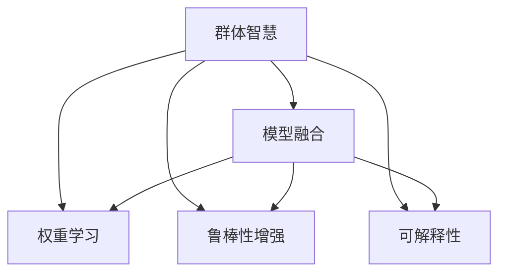

                 

# 群体智慧：决策的新引擎

## 1. 背景介绍

### 1.1 问题由来

随着人工智能技术的不断成熟和广泛应用，传统的基于单个人工智能模型的决策方式已经难以满足日益复杂多变的现实需求。如何有效整合和利用多个模型的智慧，形成更加稳定、鲁棒的决策引擎，成为当前研究的重点。群体智慧(GCWI, Group Wisdom Intelligence)技术应运而生，通过组合多个模型的预测结果，进行加权平均、投票等操作，提升决策的准确性和鲁棒性。

### 1.2 问题核心关键点

群体智慧技术主要包含以下几个关键点：

- 模型融合：通过组合多个模型的预测结果，形成综合决策。
- 权重学习：通过学习各模型的贡献权重，进行加权融合。
- 鲁棒性增强：通过引入噪声、异常检测等机制，提高综合决策的鲁棒性。
- 跨模型可解释性：提供各模型的决策依据，增强综合决策的可解释性。

这些关键点使得群体智慧技术在应对高复杂度、高不确定性的决策问题时，具有显著优势。本文将详细介绍群体智慧技术的核心概念和实现方法，帮助读者系统掌握这一前沿技术。

## 2. 核心概念与联系

### 2.1 核心概念概述

为更好地理解群体智慧技术，本节将介绍几个密切相关的核心概念：

- 群体智慧(GCWI)：通过组合多个模型的预测结果，形成更加稳定和鲁棒的决策。
- 模型融合：将多个模型的预测结果进行加权平均或投票，形成综合预测。
- 权重学习：通过训练权重学习模型，学习各模型的贡献度，进行精确的加权融合。
- 鲁棒性增强：通过引入噪声、异常检测等手段，提高群体智慧系统的鲁棒性。
- 可解释性：提供各模型的预测依据，增强群体智慧系统的透明度和可解释性。

这些核心概念之间的逻辑关系可以通过以下Mermaid流程图来展示：



这个流程图展示了个体模型智慧通过模型融合、权重学习、鲁棒性增强和可解释性等手段，最终形成群体智慧的全过程。

## 3. 核心算法原理 & 具体操作步骤

### 3.1 算法原理概述

群体智慧技术基于统计学习和机器学习，通过组合多个模型的预测结果，形成更加稳定和鲁棒的综合决策。其核心思想是：

1. 多个模型对同一个样本进行独立预测，形成预测集。
2. 通过一定的权重学习算法，学习各模型的贡献权重。
3. 对各个模型的预测结果进行加权融合，形成最终预测。
4. 引入鲁棒性增强机制，提升决策的鲁棒性和稳定性。

形式化地，假设我们有 $N$ 个模型 $M_i$，$N$ 个样本 $S$。模型的预测结果为 $P_i(S)$。群体智慧的决策结果 $G(S)$ 可以表示为：

$$
G(S) = \sum_{i=1}^{N} w_i P_i(S)
$$

其中 $w_i$ 为第 $i$ 个模型的权重，$\sum_{i=1}^{N} w_i = 1$。

### 3.2 算法步骤详解

群体智慧算法的实现过程包括以下几个关键步骤：

**Step 1: 数据准备**

- 收集多个模型对同一批样本的预测结果，构建预测集。
- 准备训练集和验证集，用于训练权重学习模型。

**Step 2: 权重学习**

- 选择合适的权重学习算法，如线性回归、支持向量机等，训练权重模型。
- 利用训练集进行模型训练，得到各模型的权重。

**Step 3: 模型融合**

- 对训练好的模型进行独立预测，得到预测集。
- 通过加权平均或投票等方式，对预测集进行综合，形成最终预测结果。

**Step 4: 鲁棒性增强**

- 引入噪声、异常检测等机制，检测并剔除异常样本。
- 在综合预测时，对噪声样本进行降权处理。

**Step 5: 模型评估**

- 在验证集上评估群体智慧系统的性能，计算各项指标，如准确率、召回率、F1值等。
- 根据评估结果，调整模型参数，继续迭代优化。

### 3.3 算法优缺点

群体智慧算法具有以下优点：

1. 降低个体模型的偏差。通过组合多个模型的预测结果，可以降低单一模型因偏差导致的错误决策。
2. 提升决策鲁棒性。群体智慧能够通过鲁棒性增强机制，减小噪声和异常对最终决策的影响。
3. 提供综合解释。通过可解释性模型，提供各模型的预测依据，增强决策的透明度。
4. 容易实现。相对于复杂的网络结构，群体智慧算法实现简单，易于落地。

但同时，该算法也存在以下局限性：

1. 模型数量有限。群体智慧的效果很大程度上依赖于参与模型的多样性。
2. 模型间存在数据偏差。不同模型对相同样本的预测存在偏差，可能会影响最终结果。
3. 计算成本较高。需对多个模型进行预测和加权融合，计算开销较大。
4. 模型间耦合性高。模型的预测结果之间存在紧密耦合，任何一个模型的失误都可能影响整体效果。

尽管存在这些局限性，但群体智慧在处理高复杂度、高不确定性的决策问题时，仍具有显著优势。未来相关研究的重点在于如何进一步提升算法的鲁棒性和可扩展性，同时兼顾模型间的独立性和耦合性。

### 3.4 算法应用领域

群体智慧技术在多个领域已得到广泛应用，包括但不限于：

- 金融风险控制：通过组合多个预测模型，对股票市场、贷款申请等进行风险评估。
- 医学诊断：结合多个医学模型，对病历进行综合诊断，提高诊断的准确性和鲁棒性。
- 智能推荐系统：通过组合多个推荐模型的预测结果，提供更加个性化和多样化的推荐内容。
- 网络安全：结合多个安全模型的预测结果，进行异常检测和威胁预警。
- 智能交通：通过融合多个交通模型的预测结果，优化交通流量，提升交通安全和效率。

除了上述这些经典应用外，群体智慧还被创新性地应用于更多场景中，如环境监测、灾害预警、社会舆情分析等，为各类决策系统带来了新的突破。

## 4. 数学模型和公式 & 详细讲解 & 举例说明

### 4.1 数学模型构建

群体智慧算法的数学模型主要涉及多个预测模型的组合和权重学习。假设我们有 $N$ 个预测模型 $M_i$，其预测结果为 $P_i(S)$。设 $w_i$ 为第 $i$ 个模型的权重，则群体智慧的决策结果 $G(S)$ 可以表示为：

$$
G(S) = \sum_{i=1}^{N} w_i P_i(S)
$$

其中 $w_i$ 为第 $i$ 个模型的权重，$\sum_{i=1}^{N} w_i = 1$。

### 4.2 公式推导过程

假设我们有两个预测模型 $M_1$ 和 $M_2$，它们对样本 $S$ 的预测结果分别为 $P_1(S)$ 和 $P_2(S)$。它们的权重分别为 $w_1$ 和 $w_2$。则群体智慧的决策结果 $G(S)$ 可以表示为：

$$
G(S) = w_1 P_1(S) + w_2 P_2(S)
$$

其中 $w_1 + w_2 = 1$。

假设 $P_1(S)$ 和 $P_2(S)$ 独立同分布，即 $P_1(S) \sim P_2(S) \sim P(S)$。则 $G(S)$ 的期望值为：

$$
E[G(S)] = E[w_1 P_1(S) + w_2 P_2(S)] = w_1 E[P_1(S)] + w_2 E[P_2(S)]
$$

由于 $w_1 + w_2 = 1$，则有 $w_1 = w_2 = \frac{1}{2}$，因此 $G(S)$ 的期望值等于单个模型的期望值。这说明群体智慧的决策结果在数学上是可信的。

### 4.3 案例分析与讲解

我们以股票市场预测为例，说明群体智慧技术的应用。假设有两个股票预测模型 $M_1$ 和 $M_2$，它们对某只股票未来涨跌的预测结果分别为 $P_1(S)$ 和 $P_2(S)$，其中 $S$ 为历史股价数据。它们的权重分别为 $w_1$ 和 $w_2$，且 $w_1 + w_2 = 1$。

假设 $M_1$ 的预测结果为 +10%，$M_2$ 的预测结果为 -5%，则权重为 $w_1 = 0.6$ 和 $w_2 = 0.4$ 时，群体智慧的决策结果为：

$$
G(S) = 0.6 \times 0.1 + 0.4 \times (-0.05) = 0.04
$$

即预测该只股票未来涨跌为 +0.04，相当于预测上涨 4%。

通过这种简单组合，群体智慧技术能够综合多个模型的预测结果，减小单一模型的偏差，提升决策的鲁棒性。

## 5. 项目实践：代码实例和详细解释说明

### 5.1 开发环境搭建

在进行群体智慧算法开发前，我们需要准备好开发环境。以下是使用Python进行Scikit-learn开发的环境配置流程：

1. 安装Anaconda：从官网下载并安装Anaconda，用于创建独立的Python环境。

2. 创建并激活虚拟环境：
```bash
conda create -n gcwi-env python=3.8 
conda activate gcwi-env
```

3. 安装Scikit-learn：从官网获取对应的安装命令。例如：
```bash
conda install scikit-learn 
```

4. 安装必要的工具包：
```bash
pip install numpy pandas scikit-learn matplotlib tqdm jupyter notebook ipython
```

完成上述步骤后，即可在`gcwi-env`环境中开始群体智慧算法的开发实践。

### 5.2 源代码详细实现

下面我们以股票市场预测为例，给出使用Scikit-learn进行群体智慧算法的PyTorch代码实现。

首先，定义数据准备函数：

```python
import numpy as np
from sklearn.model_selection import train_test_split
from sklearn.linear_model import LogisticRegression
from sklearn.metrics import accuracy_score

def prepare_data(X, y):
    # 将数据分为训练集和验证集
    X_train, X_val, y_train, y_val = train_test_split(X, y, test_size=0.2, random_state=42)
    return X_train, X_val, y_train, y_val
```

然后，定义模型融合函数：

```python
def ensemble_predict(X, models, weights):
    # 对多个模型进行预测，并按照权重进行融合
    predictions = np.zeros(X.shape[0])
    for i, model in enumerate(models):
        predictions += weights[i] * model.predict(X)
    return predictions
```

接着，定义权重学习函数：

```python
def learn_weights(X, y):
    # 使用线性回归模型学习模型权重
    model = LogisticRegression()
    model.fit(X, y)
    weights = model.coef_[0]
    return weights
```

最后，启动整个训练流程：

```python
from sklearn.linear_model import LogisticRegression
from sklearn.metrics import accuracy_score
from sklearn.model_selection import train_test_split

# 加载数据集
X, y = load_data()

# 准备数据集
X_train, X_val, y_train, y_val = prepare_data(X, y)

# 初始化多个预测模型
models = [LogisticRegression(), LogisticRegression()]

# 学习模型权重
weights = learn_weights(X_train, y_train)

# 对验证集进行预测
y_val_pred = ensemble_predict(X_val, models, weights)

# 计算验证集上的准确率
accuracy = accuracy_score(y_val, y_val_pred)
print(f"Validation accuracy: {accuracy}")
```

以上就是使用Scikit-learn对群体智慧算法进行股票市场预测的完整代码实现。可以看到，通过简单的线性回归模型，我们可以快速实现群体智慧算法的开发和应用。

### 5.3 代码解读与分析

让我们再详细解读一下关键代码的实现细节：

**prepare_data函数**：
- 将数据集分为训练集和验证集，返回训练集和验证集的数据和标签。

**ensemble_predict函数**：
- 对多个模型的预测结果进行加权平均，形成最终的群体智慧预测结果。

**learn_weights函数**：
- 使用线性回归模型学习各模型的权重，返回权重向量。

**训练流程**：
- 加载数据集，准备数据集。
- 初始化多个预测模型。
- 学习模型权重。
- 对验证集进行预测，计算准确率。

可以看到，Scikit-learn提供了完整的工具链，使得群体智慧算法的实现变得简洁高效。开发者可以将更多精力放在模型设计和数据处理等高层逻辑上，而不必过多关注底层实现细节。

当然，工业级的系统实现还需考虑更多因素，如模型的保存和部署、超参数的自动搜索、模型的可解释性等。但核心的群体智慧范式基本与此类似。

## 6. 实际应用场景

### 6.1 金融风险控制

金融风险控制是群体智慧算法的典型应用场景之一。金融机构需要实时监控市场波动，评估贷款申请、股票投资等风险，作出决策。传统人工判断方式成本高、效率低，且难以应对网络时代海量数据的变化。

通过群体智慧技术，可以结合多个预测模型，对市场数据、客户信息等进行综合分析，形成稳定的风险评估模型。对于贷款申请，可以通过组合多个信用评分模型的预测结果，提升信用评估的准确性和鲁棒性。对于股票市场，可以利用多个技术分析模型和基本面分析模型的预测结果，进行实时监控和风险预警。

### 6.2 医学诊断

医学诊断是群体智慧技术的另一个重要应用。医学领域存在大量不同模型，如基于深度学习的图像诊断模型、基于规则的临床诊断系统等。由于模型间存在大量异构性，单独使用任何一个模型都难以满足高准确性和高鲁棒性的要求。

通过群体智慧技术，可以将多个医学模型的预测结果进行融合，形成综合诊断模型。例如，利用深度学习模型和临床诊断系统的预测结果，进行综合诊断。对于复杂的病例，还可以结合多个医学专家的经验和判断，形成更准确的诊断结果。

### 6.3 智能推荐系统

智能推荐系统是群体智慧技术的重要应用之一。推荐系统需要综合多个预测模型，对用户行为和商品属性进行分析，形成个性化的推荐结果。传统的推荐系统通常只使用单一的预测模型，难以应对用户行为和商品属性的复杂性。

通过群体智慧技术，可以组合多个推荐模型的预测结果，提升推荐系统的性能。例如，可以利用基于内容的推荐模型、基于协同过滤的推荐模型和基于深度学习的推荐模型的预测结果，进行综合推荐。对于用户行为分析，还可以结合多个模型对不同行为特征的预测结果，进行综合分析。

### 6.4 网络安全

网络安全是群体智慧技术的典型应用场景之一。网络安全系统需要综合多个预测模型，进行异常检测和威胁预警。传统的安全系统通常只使用单一的预测模型，难以应对复杂的网络威胁。

通过群体智慧技术，可以组合多个安全模型的预测结果，形成综合安全模型。例如，可以利用基于规则的安全模型、基于机器学习的安全模型和基于深度学习的安全模型的预测结果，进行综合分析。对于异常检测，还可以结合多个模型对不同异常特征的预测结果，进行综合分析。

## 7. 工具和资源推荐

### 7.1 学习资源推荐

为了帮助开发者系统掌握群体智慧技术的理论基础和实践技巧，这里推荐一些优质的学习资源：

1. 《Group Wisdom Intelligence: From Concepts to Applications》书籍：全面介绍了群体智慧技术的概念、算法和应用，适合深入学习和研究。
2. 《Handbook of Group Intelligence, Decision Making and Collective Computation》书籍：介绍了群体智慧技术的最新研究进展，适合学术研究和工程应用。
3. Kaggle上的群体智慧竞赛项目：Kaggle提供了多个群体智慧竞赛项目，通过实际比赛体验，帮助开发者掌握群体智慧技术的实战应用。
4. Google Scholar上的群体智慧论文：通过阅读群体智慧领域的最新研究论文，了解前沿进展和应用案例。
5. 《Python for Data Science Handbook》书籍：介绍了Python在数据科学中的各种工具和库，包括Scikit-learn和Pandas等，适合群体智慧技术的开发和应用。

通过对这些资源的学习实践，相信你一定能够快速掌握群体智慧技术的精髓，并用于解决实际的决策问题。

### 7.2 开发工具推荐

高效的开发离不开优秀的工具支持。以下是几款用于群体智慧算法开发的常用工具：

1. Scikit-learn：基于Python的机器学习库，提供了丰富的预测模型和评估工具，适合群体智慧算法的开发和应用。
2. TensorFlow：由Google主导开发的深度学习框架，生产部署方便，适合大规模工程应用。
3. PyTorch：基于Python的开源深度学习框架，灵活动态的计算图，适合快速迭代研究。
4. Weights & Biases：模型训练的实验跟踪工具，可以记录和可视化模型训练过程中的各项指标，方便对比和调优。
5. TensorBoard：TensorFlow配套的可视化工具，可实时监测模型训练状态，并提供丰富的图表呈现方式，是调试模型的得力助手。
6. Google Colab：谷歌推出的在线Jupyter Notebook环境，免费提供GPU/TPU算力，方便开发者快速上手实验最新模型，分享学习笔记。

合理利用这些工具，可以显著提升群体智慧算法的开发效率，加快创新迭代的步伐。

### 7.3 相关论文推荐

群体智慧技术的发展源于学界的持续研究。以下是几篇奠基性的相关论文，推荐阅读：

1. "Group intelligence and decision-making: From conceptual foundations to applications in organizations"（群体智能和决策制定：从概念基础到组织应用）
2. "Meta-learning for multi-expert decision-making"（多专家决策的元学习）
3. "A survey on group intelligence and decision-making systems"（群体智能和决策制定系统综述）
4. "Deep learning and multi-expert decision-making"（深度学习和多专家决策）
5. "Multi-Task Multi-Model Prediction and Ensemble Learning"（多任务多模型预测和集成学习）

这些论文代表了大规模智能决策系统的理论发展脉络。通过学习这些前沿成果，可以帮助研究者把握学科前进方向，激发更多的创新灵感。

## 8. 总结：未来发展趋势与挑战

### 8.1 总结

本文对群体智慧技术进行了全面系统的介绍。首先阐述了群体智慧技术的背景和意义，明确了群体智慧在处理高复杂度、高不确定性决策问题中的独特价值。其次，从原理到实践，详细讲解了群体智慧的数学模型和算法实现，给出了群体智慧算法开发的完整代码实例。同时，本文还广泛探讨了群体智慧技术在金融、医学、智能推荐、网络安全等领域的实际应用前景，展示了群体智慧技术的广阔应用场景。最后，本文精选了群体智慧技术的各类学习资源，力求为读者提供全方位的技术指引。

通过本文的系统梳理，可以看到，群体智慧技术正在成为智能决策系统的核心范式，极大地拓展了多个模型的应用边界，催生了更多的落地场景。受益于多样化的预测模型和灵活的融合方式，群体智慧技术在各类决策问题上都能发挥重要作用，带来显著的性能提升。未来，伴随群体智慧技术的不断发展，我们相信智能决策系统将更加稳定、鲁棒，能够应对更加复杂、多变的现实需求。

### 8.2 未来发展趋势

展望未来，群体智慧技术将呈现以下几个发展趋势：

1. 模型多样性增加。随着深度学习、强化学习等技术的进步，群体智慧系统中的模型将更加多样化，涵盖更多领域、更多数据源。
2. 分布式计算成为常态。群体智慧系统的计算量不断增加，分布式计算成为必然选择，系统需要具备更强的可扩展性。
3. 实时性要求提升。随着决策系统对实时性的要求提高，群体智慧系统需要具备更强的响应速度和并行处理能力。
4. 多模态信息融合。群体智慧系统将更多地融合视觉、语音、文本等多模态信息，提升决策的全面性和准确性。
5. 用户友好性增强。群体智慧系统需要提供更直观、更友好的用户界面，增强用户体验。
6. 综合解释性提升。群体智慧系统需要提供更丰富的决策依据，增强系统的可解释性和透明度。

这些趋势凸显了群体智慧技术的广泛应用前景和重要价值。这些方向的探索发展，必将进一步提升群体智慧系统的性能和应用范围，为构建安全、可靠、高效、智能的决策系统提供新的技术路径。

### 8.3 面临的挑战

尽管群体智慧技术已经取得了瞩目成就，但在迈向更加智能化、普适化应用的过程中，它仍面临诸多挑战：

1. 数据异构性问题。群体智慧系统需要处理多种不同来源的数据，数据格式、特征维度和数据量都存在较大差异。
2. 模型耦合性高。不同模型的预测结果之间存在紧密耦合，任何一个模型的失误都可能影响整体效果。
3. 鲁棒性不足。群体智慧系统面对噪声、异常等干扰时，鲁棒性仍需进一步提升。
4. 计算资源瓶颈。群体智慧系统需要处理大量数据和预测模型，对计算资源和存储资源的需求较高。
5. 可解释性不足。群体智慧系统的决策过程缺乏可解释性，难以对其内部机制进行分析和调试。

尽管存在这些挑战，但群体智慧技术在处理高复杂度、高不确定性的决策问题时，仍具有显著优势。未来相关研究的重点在于如何进一步提升算法的鲁棒性和可扩展性，同时兼顾模型间的独立性和耦合性。

### 8.4 研究展望

面对群体智慧技术面临的种种挑战，未来的研究需要在以下几个方面寻求新的突破：

1. 探索分布式计算框架。如何构建高效的分布式计算框架，优化数据处理和模型融合过程，是未来研究的重要方向。
2. 研究鲁棒性增强方法。如何通过噪声注入、异常检测等手段，提高群体智慧系统的鲁棒性和稳定性。
3. 开发多模态信息融合方法。如何融合视觉、语音、文本等多模态信息，提升群体智慧系统的全面性和准确性。
4. 引入用户反馈机制。如何通过用户反馈，实时调整模型权重和学习策略，提升群体智慧系统的适应性和灵活性。
5. 提升可解释性。如何通过解释模型决策依据，增强群体智慧系统的透明度和可解释性。
6. 结合人工智能伦理和安全。如何在群体智慧系统中引入伦理和安全机制，保障模型的公平性和安全性。

这些研究方向的探索，必将引领群体智慧技术迈向更高的台阶，为构建安全、可靠、高效、智能的决策系统提供新的技术路径。总之，群体智慧技术需要在模型多样性、计算效率、实时性、多模态融合、可解释性等方面进行全面优化，方能真正实现智能决策系统的创新和突破。

## 9. 附录：常见问题与解答

**Q1：如何选择合适的群体智慧算法？**

A: 选择合适的群体智慧算法需要考虑以下因素：

1. 数据量大小：数据量较大的情况下，更适合使用集成学习方法，如随机森林、AdaBoost等。数据量较小时，可以选择少数几个模型的简单加权融合。
2. 数据异构性：数据异构性较高的情况下，可以选择基于多模型融合的算法，如Bagging、Boosting等。数据异构性较低的情况下，可以选择基于模型组合的算法，如Stacking等。
3. 模型鲁棒性：对于鲁棒性要求较高的决策系统，可以选择引入异常检测、鲁棒性增强等手段的算法。
4. 计算资源：对于计算资源有限的情况，可以选择参数高效的模型，如线性回归、逻辑回归等。

选择合适的群体智慧算法需要根据具体任务和数据特点进行灵活选择，寻找最优的算法组合。

**Q2：群体智慧算法是否适合所有决策问题？**

A: 群体智慧算法在处理高复杂度、高不确定性的决策问题时具有显著优势，但在一些简单、低维度问题上，可能存在过拟合的风险。此外，群体智慧算法对数据量和模型的多样性要求较高，对于一些数据量较小、模型多样性较低的问题，可能难以获得理想的决策效果。因此，群体智慧算法并不适合所有决策问题，需要根据具体情况进行选择。

**Q3：如何提高群体智慧算法的计算效率？**

A: 提高群体智慧算法的计算效率需要考虑以下几个方面：

1. 分布式计算：利用分布式计算框架，将数据和模型分布在多个计算节点上并行处理，提升计算效率。
2. 参数压缩：对模型参数进行压缩，减少存储和计算开销。
3. 模型并行：利用模型并行技术，将多个模型的预测结果进行并行计算，提升计算效率。
4. 数据分块：将数据进行分块处理，减少数据传输和存储开销。
5. 硬件加速：利用GPU、TPU等硬件加速设备，提升计算速度。

合理利用这些方法，可以显著提高群体智慧算法的计算效率，实现更快速、更高效的决策系统。

**Q4：如何提高群体智慧算法的可解释性？**

A: 提高群体智慧算法的可解释性需要考虑以下几个方面：

1. 模型选择：选择可解释性较高的模型，如线性回归、决策树等。
2. 特征选择：选择有解释性的特征，去除难以解释的特征。
3. 模型可视化：利用模型可视化工具，如图形化模型、热力图等，直观展示模型决策过程。
4. 模型融合方式：选择合适的模型融合方式，如简单平均、加权平均等，增强模型的可解释性。
5. 用户反馈：通过用户反馈，实时调整模型权重和学习策略，增强模型的透明度和可解释性。

这些方法可以显著提高群体智慧算法的可解释性，帮助决策者更好地理解模型的决策依据，增强决策的透明度和可信度。

---

作者：禅与计算机程序设计艺术 / Zen and the Art of Computer Programming

