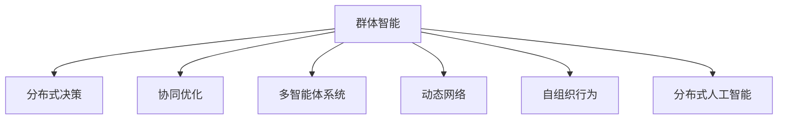

                 

# 群体智能：通向更智慧决策之路

> 关键词：群体智能, 分布式决策, 协同优化, 多智能体系统, 动态网络, 复杂系统, 自组织行为, 分布式人工智能

## 1. 背景介绍

### 1.1 问题由来

在现代社会，复杂系统中的决策问题变得越来越重要。这些系统可能是工业生产线、金融市场、交通网络、社交网络，或者任何其他形式的、需要协调大量参与者的系统。由于这些系统中的动态性质和复杂性，传统的集中式决策方法往往难以有效应对。在这种情况下，群体智能（Swarm Intelligence）方法应运而生，它们通过模仿自然界中生物群体的协作行为，来解决复杂的分布式决策问题。

### 1.2 问题核心关键点

群体智能的核心在于通过分布式协作，使得个体间的信息交换和知识共享，从而提高系统的整体性能。这种协作通常涉及自组织、自我调节、同步化、合作等原则。群体智能的典型应用场景包括蚁群算法、粒子群算法、遗传算法、蜂群算法等，它们都基于生物系统的行为，通过仿生学方法，开发了用于解决复杂优化问题的算法。

## 2. 核心概念与联系

### 2.1 核心概念概述

为更好地理解群体智能的原理和应用，本节将介绍几个关键概念：

- **群体智能(Swarm Intelligence)**：指在无需中央控制的情况下，个体通过简单的通信和协作，来实现系统整体性能提升的现象。群体智能通常用于解决复杂的多目标优化问题。
- **分布式决策**：指系统中的各个节点（如个体、群体）分散决策，通过本地计算和信息交换，共同达成系统目标的过程。
- **协同优化(Cooperative Optimization)**：指多个智能体通过合作和协调，共同优化一个共同的性能指标。
- **多智能体系统(Multi-agent System)**：由多个具有自主性、交互性和目标性的智能体组成的系统，这些智能体通过交互影响对方的行为和性能。
- **动态网络(Dynamic Network)**：指系统中智能体间的通信关系随时间变化而动态调整的网络结构。
- **自组织行为(Self-organization)**：指系统中的个体通过简单的局部规则和相互作用，自动产生协调一致的宏观行为。
- **分布式人工智能(Distributed Artificial Intelligence)**：指人工智能在分布式环境下的应用，强调多智能体系统间的通信和协作。

这些核心概念之间的逻辑关系可以通过以下Mermaid流程图来展示：



这个流程图展示了个体间协作和自组织过程，以及它们如何通过简单规则和相互作用，达到复杂系统的协调一致。

## 3. 核心算法原理 & 具体操作步骤
### 3.1 算法原理概述

群体智能的核心算法通常基于生物群体行为，模拟生物间的信息交换和协作机制。常见的算法包括蚁群算法、粒子群算法、遗传算法、蜂群算法等。这些算法通过个体之间的交互和协作，共同解决系统问题。

以蚁群算法为例，它的基本思想是：每一只蚂蚁（智能体）在移动时，会根据其它蚂蚁留下的信息素，以及自身的规则，来调整移动方向和速度。这种规则和信息素交换，使得蚂蚁群体能够找到最短路径或最优解。

### 3.2 算法步骤详解

以蚁群算法为例，具体步骤可以分为以下几个部分：

**Step 1: 初始化参数**
- 设置蚁群数量 $N$，每个蚂蚁的初始路径 $p_{ij}$
- 初始化信息素矩阵 $\tau_{ij}$，并设置信息素蒸发速率 $\alpha$
- 设置移动规则参数 $\beta$ 和启发式参数 $\delta$

**Step 2: 迭代更新路径**
- 对于每个蚂蚁 $i$，根据当前路径 $p_{ij}$ 和信息素 $\tau_{ij}$，更新路径 $p_{ij}$
- 计算当前路径的总代价 $C_{ij}$，并选择该路径上的下一个节点

**Step 3: 更新信息素**
- 根据路径代价和信息素更新规则，更新信息素 $\tau_{ij}$

**Step 4: 重复执行 Step 2 和 Step 3，直至收敛**
- 迭代多次，直到达到预设的迭代次数，或收敛标准

### 3.3 算法优缺点

群体智能算法的优点在于：

- **分布式计算**：由于算法是分布式执行的，能够有效利用多核处理器和大规模集群计算资源。
- **鲁棒性**：群体智能算法对初始参数的敏感度较低，能够适应不同规模和复杂性的问题。
- **自适应性**：算法能够自动适应问题的变化，无需人工干预。

但这些算法也存在一些缺点：

- **计算复杂度**：在规模较大时，算法的计算复杂度较高，需要较长的运行时间。
- **参数敏感**：不同的参数设置会影响算法的收敛速度和效果，需要进行多次实验调参。
- **局部最优**：群体智能算法可能陷入局部最优，无法找到全局最优解。
- **可解释性**：算法的内部工作机制通常不透明，难以解释其决策过程。

### 3.4 算法应用领域

群体智能算法在多个领域中得到了广泛的应用，例如：

- **物流规划**：用于货物配送路径规划，通过优化路径来减少运输时间和成本。
- **网络优化**：用于设计网络拓扑结构，优化数据传输路径。
- **机器人路径规划**：用于规划机器人在复杂环境中的移动路径，例如在仓库中定位和搬运物品。
- **供应链管理**：用于优化供应链中的物料调度和库存管理。
- **金融风险管理**：用于评估金融市场中的风险和不确定性，提供风险预测和决策支持。

除了这些典型的应用场景外，群体智能算法还在社交网络分析、城市交通控制、能源系统管理等多个领域，展现出了强大的应用潜力。

## 4. 数学模型和公式 & 详细讲解
### 4.1 数学模型构建

群体智能算法的数学模型通常包括个体、环境和目标函数三部分。以蚁群算法为例，其数学模型可以表示为：

- 个体（蚂蚁）：每个蚂蚁都有一定的初始路径 $p_{ij}$，路径上的每个节点 $j$ 都有信息素 $\tau_{ij}$ 和代价 $C_{ij}$。
- 环境（信息素矩阵）：信息素矩阵 $\tau$ 描述了不同路径上的信息素强度，直接影响蚂蚁的移动决策。
- 目标函数：最优路径的目标是总代价最小，即路径 $C$ 上的所有代价之和最小。

### 4.2 公式推导过程

蚁群算法的核心在于信息素的更新规则。信息素的更新基于路径的总代价和信息素强度，具体公式如下：

$$
\tau_{ij} \leftarrow \tau_{ij} + f(p_{ij}, C_{ij}, \Delta)
$$

其中，$f(p_{ij}, C_{ij}, \Delta)$ 是一个函数，用来更新信息素强度。常见的函数形式包括：

$$
f(p_{ij}, C_{ij}, \Delta) = \frac{\Delta}{C_{ij}} (1 - \frac{C_{ij}}{C_{ij_{max}}})
$$

$$
f(p_{ij}, C_{ij}, \Delta) = \alpha f_{ij} + \beta \frac{C_{ij}}{C_{ij_{max}}}
$$

其中，$\alpha$、$\beta$ 和 $\Delta$ 是常数，用于控制信息素的更新强度。

### 4.3 案例分析与讲解

以物流路径规划为例，蚁群算法可以通过优化路径来选择最佳配送路线，减少运输时间和成本。具体来说：

1. 初始化蚁群数量和路径。
2. 每个蚂蚁根据信息素强度选择路径，计算总代价。
3. 根据路径代价和信息素更新规则，更新信息素矩阵。
4. 重复执行路径选择和信息素更新，直至收敛。

最终得到的路径就是物流系统的最佳配送路线，能够有效提高配送效率和降低成本。

## 5. 项目实践：代码实例和详细解释说明
### 5.1 开发环境搭建

在进行群体智能算法的实践前，我们需要准备好开发环境。以下是使用Python进行蚁群算法开发的环境配置流程：

1. 安装Anaconda：从官网下载并安装Anaconda，用于创建独立的Python环境。

2. 创建并激活虚拟环境：
```bash
conda create -n antcolony python=3.8 
conda activate antcolony
```

3. 安装必要的库：
```bash
pip install numpy matplotlib scipy networkx
```

4. 安装蚁群算法库：
```bash
pip install antcolony
```

完成上述步骤后，即可在`antcolony-env`环境中开始蚁群算法的开发实践。

### 5.2 源代码详细实现

我们以蚁群算法为例，给出使用Python和NetworkX库对物流路径规划问题的求解代码实现。

```python
import networkx as nx
import numpy as np
from antcolony import AntSystem

# 定义一个物流网络
G = nx.DiGraph()
G.add_edges_from([(1, 2, {'cost': 3}), (1, 3, {'cost': 4}), (2, 4, {'cost': 5}), (2, 5, {'cost': 2}), (3, 4, {'cost': 6}), (3, 5, {'cost': 1})])

# 初始化蚁群算法
asys = AntSystem(G, num_ants=10, alpha=1, beta=2, delta=1, rho=0.5, q=1, max_iter=1000)

# 执行蚁群算法
paths = asys.run()

# 输出最佳路径
best_path = min(paths, key=lambda x: x['cost'])
print(best_path)
```

在这个代码中，我们首先定义了一个简单的物流网络，表示城市间的物流路径和距离。然后，我们使用AntSystem类初始化蚁群算法，并执行算法。最后，输出最佳路径和总代价。

### 5.3 代码解读与分析

让我们再详细解读一下关键代码的实现细节：

**定义物流网络**：
- 使用NetworkX库，定义一个有向图，表示物流网络中的城市及连接。

**初始化蚁群算法**：
- 通过AntSystem类初始化蚁群算法，设置相关参数，如蚁群数量、信息素蒸发率、信息素强度、信息素更新率、启发式因子、信息素强度衰减率等。

**执行蚁群算法**：
- 调用run方法执行蚁群算法，得到一组路径。

**输出最佳路径**：
- 从输出路径中选取总代价最小的路径，输出路径和总代价。

可以看到，蚁群算法的代码实现较为简洁，只需要定义好物流网络和相关参数，即可执行蚁群算法，输出最佳路径。

当然，工业级的系统实现还需考虑更多因素，如路径的可视化、路径优化参数的自动化调优等。但核心的蚁群算法基本与此类似。

## 6. 实际应用场景
### 6.1 供应链管理

在供应链管理中，蚁群算法可以用于优化库存管理、物料调度和运输路线。传统的集中式供应链管理方法，需要大量人工干预和复杂计算，效率低下且难以应对变化多端的市场环境。而使用蚁群算法，可以在分布式环境中，通过智能体间的协作和信息交换，自动调整供应链中的各个环节，实现库存和物流的优化。

在技术实现上，可以收集供应链中的历史数据和实时信息，构建蚁群算法的优化模型。蚁群算法在每个节点上执行路径选择和信息素更新，自动调整库存和物流计划。如此构建的智能供应链管理系统，能够显著提升供应链的响应速度和效率，降低成本，提升客户满意度。

### 6.2 金融风险管理

在金融市场中，风险管理是至关重要的任务。传统的风险评估方法依赖人工分析和历史数据，难以适应快速变化的市场环境。蚁群算法可以用于实时监控市场动态，预测金融风险和价格波动。

具体来说，蚁群算法可以收集金融市场中的各种数据，构建动态网络模型。通过模拟蚁群在网络中移动，算法可以预测价格波动，识别出潜在的市场风险。将蚁群算法集成到金融风险管理系统中，能够实现对市场风险的快速识别和预警，帮助金融机构及时采取措施，规避风险。

### 6.3 城市交通控制

在城市交通控制中，蚁群算法可以用于优化交通流和减少交通拥堵。传统的交通控制方法依赖于集中式调度，无法实时响应交通流量变化。而使用蚁群算法，可以在车辆间进行协作和信息交换，自动调整交通流，实现最优化的交通控制。

具体来说，蚁群算法可以收集交通流量和实时交通信息，构建交通网络模型。通过模拟蚁群在网络中移动，算法可以自动调整交通流向，优化交通信号控制。将蚁群算法集成到城市交通管理系统中，能够有效缓解交通拥堵，提高交通效率。

### 6.4 未来应用展望

随着群体智能算法的发展，其在更多领域的应用前景值得期待。

在智慧农业领域，蚁群算法可以用于农业机械的路径规划和资源调度，优化农作物的种植和收获。

在环境保护领域，蚁群算法可以用于优化资源配置，减少能源消耗和环境污染。

在航空航天领域，蚁群算法可以用于优化卫星轨道设计和飞行路径规划，提高卫星任务执行的效率和准确性。

此外，在智能制造、智能医疗、智能安全等领域，群体智能算法也将发挥重要作用。未来，随着算法技术的不断进步，群体智能必将在更多垂直行业中找到应用，为各行各业带来新的变革。

## 7. 工具和资源推荐
### 7.1 学习资源推荐

为了帮助开发者系统掌握群体智能的理论基础和实践技巧，这里推荐一些优质的学习资源：

1. 《蚁群算法原理与实践》：详细介绍蚁群算法的原理和应用，是学习群体智能算法的入门书籍。
2. 《群体智能：从理论到应用》：探讨群体智能的理论基础和应用场景，适合深入学习群体智能的读者。
3. 《分布式人工智能：理论、算法与应用》：介绍分布式人工智能的理论和算法，包括群体智能在内。
4. 《网络优化：基于蚁群算法的方法》：介绍蚁群算法在网络优化中的应用，包括物流路径规划、网络设计等。
5. 《智能优化：群体智能与分布式优化》：综合介绍群体智能和分布式优化，涵盖蚁群算法、粒子群算法、遗传算法等多种方法。
6. 《群体智能与多智能体系统》：探讨群体智能和多个智能体之间的协作关系，深入理解智能系统的运作机制。

通过对这些资源的学习实践，相信你一定能够快速掌握群体智能算法的精髓，并用于解决实际的优化问题。

### 7.2 开发工具推荐

高效的开发离不开优秀的工具支持。以下是几款用于群体智能算法开发的常用工具：

1. NetworkX：Python网络分析库，用于构建和分析网络模型，支持蚁群算法等。
2. Gurobi：高性能优化求解器，支持线性规划、整数规划等多种优化算法，能够处理大规模优化问题。
3. GloptiPoly：Gurobi的求解器，支持大规模线性规划和整数规划求解。
4. CPLEX：IBM开发的优化求解器，支持多种优化算法，适用于大规模数据处理。
5. Scikit-learn：Python机器学习库，支持蚁群算法等群体智能算法，方便数据预处理和特征工程。
6. TensorFlow和PyTorch：深度学习框架，支持分布式计算和优化算法，适用于复杂的多智能体系统建模。

合理利用这些工具，可以显著提升群体智能算法的开发效率，加快创新迭代的步伐。

### 7.3 相关论文推荐

群体智能算法的发展源于学界的持续研究。以下是几篇奠基性的相关论文，推荐阅读：

1. Dorigo M., Caro G., Stoica A. (2006) Ant Colony Optimization: A Survey. Math. Comput. Model., 49(11-12), 922-961.
2. Kennedy J., Eberhart R.C. (2001) Particle Swarm Optimization. IEEE Trans. Evol. Comput., 6(4), 102-110.
3. Goldberg D.E. (1995) Genetic Algorithms in Search, Optimization and Machine Learning. Addison-Wesley.
4. De Bourcy Y., He S. (2013) Swarm Intelligence. Springer.
5. March E. (2005) The ants Algorithm: Optimal Trade-Offs between Time and Quality in Multidimensional Combinatorial Optimization. Physica A, 352(1-2), 257-271.
6. Holley C. (2014) Swarm Intelligence: From Optimization to Collective Adaptive Behavior. CRC Press.

这些论文代表了大规模群体智能算法的发展脉络。通过学习这些前沿成果，可以帮助研究者把握学科前进方向，激发更多的创新灵感。

## 8. 总结：未来发展趋势与挑战
### 8.1 研究成果总结

群体智能算法在复杂系统优化和决策支持中表现出了巨大的潜力和优势，已经在多个领域得到了广泛应用。通过模拟自然界中的生物协作行为，群体智能算法能够高效地解决多目标优化问题，提升系统性能。

### 8.2 未来发展趋势

展望未来，群体智能算法的发展将呈现以下几个趋势：

1. **自适应学习**：未来的群体智能算法将更加注重自适应学习，通过在线学习机制，自动适应环境变化，提高算法的稳定性和鲁棒性。
2. **分布式计算**：随着云计算和大数据技术的发展，群体智能算法将在分布式环境中得到更广泛的应用，提升算法的计算效率和扩展性。
3. **跨领域应用**：群体智能算法将在更多领域中得到应用，如交通、物流、金融、医疗等，推动各行业的智能化升级。
4. **智能优化**：群体智能算法将与其他智能技术（如强化学习、深度学习等）结合，解决更复杂的优化问题，提升算法的性能和实用性。
5. **多智能体协作**：未来的群体智能算法将更加注重多智能体间的协作，通过智能体间的互动和信息交换，实现更高效的优化。
6. **实时优化**：群体智能算法将更加注重实时优化，通过在线学习机制，实时响应环境变化，提供实时的决策支持。

### 8.3 面临的挑战

尽管群体智能算法已经取得了显著的成果，但在实际应用中也面临一些挑战：

1. **计算复杂度**：群体智能算法通常具有较高的计算复杂度，需要消耗大量计算资源和时间。如何在保证算法效果的同时，优化算法性能和计算效率，仍是一个重要挑战。
2. **参数调优**：群体智能算法对参数设置敏感，不同问题需要不同的参数设置。如何在保证算法收敛性的同时，优化参数选择，仍然是一个难点。
3. **可解释性**：群体智能算法的内部工作机制通常不透明，难以解释其决策过程。如何在保证算法效果的同时，提高算法的可解释性，仍然是一个重要课题。
4. **鲁棒性**：群体智能算法对初始参数和环境变化的敏感性较高，容易出现局部最优和失效的情况。如何在保证算法稳定性的同时，提升算法的鲁棒性，仍然是一个挑战。
5. **实时性**：群体智能算法通常需要较长的计算时间，难以实时响应环境变化。如何在保证算法效果的同时，提高算法的实时性，仍然是一个难点。

### 8.4 研究展望

未来的研究需要在以下几个方面寻求新的突破：

1. **自适应学习机制**：探索更高效的自适应学习机制，通过在线学习机制，自动适应环境变化，提高算法的稳定性和鲁棒性。
2. **分布式计算框架**：研究和开发分布式计算框架，支持群体智能算法在分布式环境中的高效执行。
3. **跨领域应用**：研究和开发跨领域的群体智能算法，解决更多行业中的优化问题，推动各行业的智能化升级。
4. **智能优化融合**：研究和开发融合智能优化技术（如强化学习、深度学习等）的群体智能算法，解决更复杂的优化问题。
5. **多智能体协作**：研究和开发多智能体协作的群体智能算法，通过智能体间的互动和信息交换，实现更高效的优化。
6. **实时优化算法**：研究和开发实时优化的群体智能算法，通过在线学习机制，实时响应环境变化，提供实时的决策支持。

这些研究方向的探索，必将引领群体智能算法的发展，推动其应用范围和性能的不断提升，为复杂系统的优化和决策支持提供更加智能化的解决方案。

## 9. 附录：常见问题与解答

**Q1：群体智能算法是否适用于所有优化问题？**

A: 群体智能算法适用于求解大规模多目标优化问题，但并不适用于所有优化问题。其适用范围主要取决于问题的复杂性和规模，以及问题的结构特点。例如，群体智能算法在求解连续优化问题时表现良好，但在求解离散优化问题时可能需要其他算法。

**Q2：群体智能算法如何避免局部最优？**

A: 群体智能算法通常通过多样性和局部搜索机制来避免局部最优。具体来说，算法通过引入多个智能体，每个智能体探索不同的路径，从而增加路径多样性。同时，算法通过局部搜索机制，避免智能体陷入局部最优。

**Q3：如何选择合适的群体智能算法？**

A: 选择合适的群体智能算法取决于具体问题的性质和规模。例如，蚁群算法适用于求解路径优化问题，粒子群算法适用于求解高维空间优化问题，遗传算法适用于求解多目标优化问题。因此，在选择算法时需要根据问题的具体特点，进行算法选择和调优。

**Q4：群体智能算法在实际应用中需要注意哪些问题？**

A: 在实际应用中，群体智能算法需要注意以下几点：
1. 参数调优：选择合适参数是群体智能算法成功的关键。需要进行多次实验调参，找到最优参数组合。
2. 计算效率：群体智能算法通常计算复杂度较高，需要优化算法执行效率。
3. 可解释性：群体智能算法的内部工作机制通常不透明，难以解释其决策过程。需要在保证算法效果的同时，提高算法的可解释性。
4. 鲁棒性：群体智能算法对初始参数和环境变化的敏感性较高，容易出现局部最优和失效的情况。需要优化算法鲁棒性。
5. 实时性：群体智能算法通常需要较长的计算时间，难以实时响应环境变化。需要优化算法实时性。

这些问题是群体智能算法在实际应用中需要重点关注的问题。只有全面考虑这些问题，才能确保算法的有效性和实用性。

**Q5：群体智能算法在优化问题中的应用前景如何？**

A: 群体智能算法在优化问题中具有广泛的应用前景，尤其在复杂系统和分布式环境中，能够高效地解决多目标优化问题。例如，在物流路径规划、金融风险管理、城市交通控制等领域，群体智能算法已经取得了显著的成效。未来，随着算法的不断优化和扩展，其应用范围和性能将不断提升，推动更多领域的智能化升级。

---

作者：禅与计算机程序设计艺术 / Zen and the Art of Computer Programming

