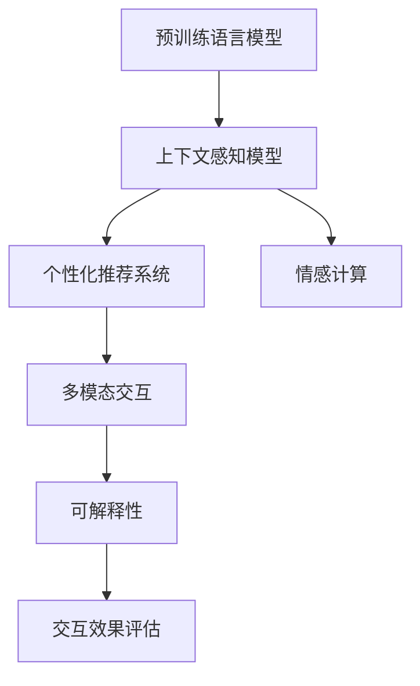

                 

## 1. 背景介绍

### 1.1 问题由来

人工智能(AI)技术的迅猛发展，尤其是自然语言处理(NLP)和机器学习技术的突破，使得聊天机器人(Chatbot)成为了当前人工智能领域的热点应用之一。从简单的客服自动化到复杂的智能助理和顾问，聊天机器人已经广泛应用于各行各业，带来了巨大的经济效益和社会价值。

然而，传统的聊天机器人系统往往存在智能水平有限、对话上下文理解能力差、缺乏个性化和情感交互等问题，难以满足用户日益增长的需求。因此，开发更智能、更友好、更高效的人工智能助理和顾问，成为当前NLP技术研究和应用的重要方向。

### 1.2 问题核心关键点

1. **智能水平提升**：通过深度学习和大规模语料预训练，使聊天机器人具备强大的语言理解和生成能力，能够更自然地与用户进行互动。
2. **上下文理解**：采用上下文感知模型，使机器人能够理解对话历史，提供连贯且合理的回答。
3. **个性化交互**：利用用户画像和历史数据，使机器人能够根据用户偏好和行为进行个性化推荐和互动。
4. **情感交互**：引入情感计算技术，使机器人能够理解用户情绪，提供更加人性化的服务。
5. **多模态融合**：结合文本、语音、图像等多模态数据，提升机器人的感知能力和交互效果。
6. **可扩展性**：通过模块化设计，使机器人能够灵活应对不同场景和任务。
7. **可解释性和安全性**：使机器人的决策过程具有可解释性，并能够保证其输出内容的真实性和无害性。

### 1.3 问题研究意义

聊天机器人作为人工智能的重要应用方向，不仅能够提升用户体验，降低人工成本，还能在教育、医疗、金融等领域发挥重要作用。通过不断提升聊天机器人的智能水平，可以显著提升社会生产的效率，推动社会进步。

## 2. 核心概念与联系

### 2.1 核心概念概述

聊天机器人作为一种人工智能应用，涵盖了NLP、深度学习、多模态融合等多个领域。以下是几个核心概念及其相互联系：

- **聊天机器人**：通过自然语言理解和生成，与用户进行互动的智能系统。
- **预训练语言模型**：如BERT、GPT等，通过大规模无标签文本语料进行自监督学习，获得语言知识。
- **上下文感知模型**：能够理解对话历史，提供连贯和一致的回答。
- **个性化推荐系统**：根据用户行为和偏好，提供个性化内容和服务。
- **情感计算**：通过情感分析技术，理解用户情绪并作出相应回应。
- **多模态交互**：结合文本、语音、图像等多种数据源，提升感知能力。
- **可解释性**：提供机器决策的透明和可解释性，增强用户信任。

这些概念通过深度学习技术有机结合，形成了聊天机器人系统的核心技术框架。

### 2.2 核心概念原理和架构的 Mermaid 流程图



以上流程图展示了聊天机器人系统从预训练到多模态交互的完整技术路径。预训练语言模型作为知识库，为上下文感知模型提供丰富的语言知识。上下文感知模型在此基础上理解对话历史，并结合个性化推荐系统和情感计算，生成个性化的回答。多模态交互技术则进一步提升了机器人的感知能力，增强了用户互动体验。最后，可解释性技术保证了机器人的决策过程透明和可信，提升了用户信任。

## 3. 核心算法原理 & 具体操作步骤

### 3.1 算法原理概述

聊天机器人的核心算法基于深度学习和NLP技术。其核心思想是通过大规模语料预训练，获得语言知识和语义理解能力，并在具体任务上进行微调，以提升机器人在特定场景下的表现。

形式化地，设预训练语言模型为 $M_{\theta}$，其中 $\theta$ 为预训练得到的模型参数。假设聊天机器人的对话任务为 $T$，包含多个轮次对话 $D=\{(x_i, y_i)\}_{i=1}^N$，其中 $x_i$ 为当前对话历史，$y_i$ 为当前轮次的回答。微调的目标是找到新的模型参数 $\hat{\theta}$，使得：

$$
\hat{\theta}=\mathop{\arg\min}_{\theta} \mathcal{L}(M_{\theta},D)
$$

其中 $\mathcal{L}$ 为针对任务 $T$ 设计的损失函数，用于衡量模型预测输出与真实标签之间的差异。常见的损失函数包括交叉熵损失、均方误差损失等。

### 3.2 算法步骤详解

聊天机器人的微调过程包括以下几个关键步骤：

**Step 1: 准备预训练模型和数据集**

- 选择合适的预训练语言模型 $M_{\theta}$ 作为初始化参数，如 BERT、GPT 等。
- 准备对话任务 $T$ 的对话数据集 $D$，划分为训练集、验证集和测试集。一般要求对话数据与预训练数据的分布不要差异过大。

**Step 2: 设计任务适配层**

- 根据任务类型，在预训练模型的基础上设计合适的输出层和损失函数。
- 对于对话生成任务，通常使用语言模型的解码器输出概率分布，并以负对数似然为损失函数。
- 对于对话匹配任务，可以使用分类器的交叉熵损失函数。

**Step 3: 设置微调超参数**

- 选择合适的优化算法及其参数，如 AdamW、SGD 等，设置学习率、批大小、迭代轮数等。
- 设置正则化技术及强度，包括权重衰减、Dropout、Early Stopping等。
- 确定冻结预训练参数的策略，如仅微调顶层，或全部参数都参与微调。

**Step 4: 执行梯度训练**

- 将对话数据分批次输入模型，前向传播计算损失函数。
- 反向传播计算参数梯度，根据设定的优化算法和学习率更新模型参数。
- 周期性在验证集上评估模型性能，根据性能指标决定是否触发 Early Stopping。
- 重复上述步骤直到满足预设的迭代轮数或 Early Stopping 条件。

**Step 5: 测试和部署**

- 在测试集上评估微调后模型 $M_{\hat{\theta}}$ 的性能，对比微调前后的精度提升。
- 使用微调后的模型对新对话进行推理预测，集成到实际的应用系统中。
- 持续收集新的对话数据，定期重新微调模型，以适应数据分布的变化。

### 3.3 算法优缺点

聊天机器人微调方法具有以下优点：

1. **智能水平提升**：通过大规模预训练和微调，使机器人具备强大的语言理解和生成能力，能够与用户进行流畅互动。
2. **上下文理解**：上下文感知模型使机器人能够理解对话历史，提供连贯和一致的回答。
3. **个性化交互**：通过个性化推荐系统，根据用户偏好和行为进行个性化推荐和互动。
4. **情感交互**：引入情感计算技术，理解用户情绪并作出相应回应。
5. **可扩展性**：模块化设计使机器人能够灵活应对不同场景和任务。

同时，该方法也存在一定的局限性：

1. **依赖标注数据**：微调的效果很大程度上取决于标注数据的质量和数量，获取高质量标注数据的成本较高。
2. **迁移能力有限**：当目标任务与预训练数据的分布差异较大时，微调的性能提升有限。
3. **可解释性不足**：微调模型的决策过程通常缺乏可解释性，难以对其推理逻辑进行分析和调试。
4. **安全性和隐私问题**：聊天机器人需要处理敏感用户信息，如何保护用户隐私和数据安全是一大挑战。

尽管存在这些局限性，但就目前而言，聊天机器人微调方法仍然是大规模语言模型应用的重要范式。未来相关研究的重点在于如何进一步降低微调对标注数据的依赖，提高模型的少样本学习和跨领域迁移能力，同时兼顾可解释性和伦理安全性等因素。

### 3.4 算法应用领域

聊天机器人作为人工智能的重要应用方向，在各行各业都有广泛的应用：

- **客户服务**：自动回答用户常见问题，提升服务效率和用户体验。
- **在线教育**：提供个性化学习建议和辅导，辅助学生学习。
- **医疗咨询**：提供疾病咨询、健康管理等服务，减轻医生工作负担。
- **金融理财**：提供财务咨询、投资建议等服务，提升用户理财水平。
- **智能家居**：控制智能设备，提升家居智能化水平。
- **智慧出行**：提供交通导航、路线规划等服务，提升出行便利性。
- **社交娱乐**：提供娱乐聊天、情感陪伴等服务，提升用户互动体验。

除了这些经典应用外，聊天机器人还被创新性地应用到更多场景中，如可控文本生成、智能客服、智能推荐等，为各行各业带来新的变革。

## 4. 数学模型和公式 & 详细讲解 & 举例说明

### 4.1 数学模型构建

假设聊天机器人执行的任务为对话生成，输入为对话历史 $x_i$，输出为回答 $y_i$。设预训练语言模型为 $M_{\theta}$，其中 $\theta$ 为预训练得到的模型参数。微调的目标是最小化损失函数 $\mathcal{L}$，即：

$$
\hat{\theta}=\mathop{\arg\min}_{\theta} \mathcal{L}(M_{\theta},D)
$$

其中 $D=\{(x_i, y_i)\}_{i=1}^N$ 为对话数据集。损失函数 $\mathcal{L}$ 可以定义为交叉熵损失：

$$
\mathcal{L}(M_{\theta},D)= -\frac{1}{N} \sum_{i=1}^N \sum_{t=1}^{T} y_{it} \log M_{\theta}(x_i; t)
$$

其中 $T$ 为对话长度，$y_{it}$ 为第 $i$ 个对话历史的第 $t$ 轮回答。

### 4.2 公式推导过程

聊天机器人的对话生成过程可以形式化地表示为：

$$
y_i = \text{Decoder}(M_{\theta}(x_i))
$$

其中 $\text{Decoder}$ 为对话生成模型，$M_{\theta}(x_i)$ 为预训练语言模型在对话历史 $x_i$ 上的输出。假设 $\text{Decoder}$ 模型为基于自回归的 Transformer 模型，输出为下一个轮次的回答概率分布。则对话生成的损失函数可以表示为：

$$
\mathcal{L} = -\frac{1}{N} \sum_{i=1}^N \sum_{t=1}^{T} y_{it} \log M_{\theta}(x_i; t)
$$

其中 $M_{\theta}(x_i; t)$ 表示在对话历史 $x_i$ 和对话长度 $t$ 下，生成第 $t$ 轮回答的概率分布。可以通过训练数据集的交叉熵损失反向传播更新模型参数 $\theta$。

### 4.3 案例分析与讲解

假设聊天机器人需要回答一个问题：“今天天气如何？” 预训练语言模型为 GPT，对话历史为空。则对话生成的过程如下：

1. 首先，根据对话历史 $x_i=\varnothing$，预训练语言模型 $M_{\theta}$ 输出概率分布：
   $$
   M_{\theta}(\varnothing; t) = \text{Softmax}(M_{\theta}(\varnothing; t; \theta))
   $$

2. 假设预训练语言模型输出结果为两个可能回答，即“今天天气晴朗”和“今天下雨”。则损失函数为：
   $$
   \mathcal{L} = -\frac{1}{N} \sum_{i=1}^N \sum_{t=1}^{2} y_{it} \log M_{\theta}(\varnothing; t)
   $$

3. 假设第一个回答被标注为正确，即 $y_{i1}=1$，则更新模型参数 $\theta$：
   $$
   \theta \leftarrow \theta - \eta \nabla_{\theta}\mathcal{L}(\theta)
   $$

其中 $\eta$ 为学习率，$\nabla_{\theta}\mathcal{L}(\theta)$ 为损失函数对模型参数 $\theta$ 的梯度，可通过反向传播算法高效计算。

通过上述过程，聊天机器人可以逐步学习到如何根据对话历史生成合理回答。当面对新的问题时，机器人可以结合预训练知识和对话历史，生成连贯且一致的回答。

## 5. 项目实践：代码实例和详细解释说明

### 5.1 开发环境搭建

在进行聊天机器人开发前，我们需要准备好开发环境。以下是使用Python进行PyTorch开发的环境配置流程：

1. 安装Anaconda：从官网下载并安装Anaconda，用于创建独立的Python环境。

2. 创建并激活虚拟环境：
```bash
conda create -n chatbot-env python=3.8 
conda activate chatbot-env
```

3. 安装PyTorch：根据CUDA版本，从官网获取对应的安装命令。例如：
```bash
conda install pytorch torchvision torchaudio cudatoolkit=11.1 -c pytorch -c conda-forge
```

4. 安装Transformers库：
```bash
pip install transformers
```

5. 安装各类工具包：
```bash
pip install numpy pandas scikit-learn matplotlib tqdm jupyter notebook ipython
```

完成上述步骤后，即可在`chatbot-env`环境中开始聊天机器人开发。

### 5.2 源代码详细实现

下面我们以对话生成任务为例，给出使用Transformers库对GPT模型进行微调的PyTorch代码实现。

首先，定义对话生成任务的数据处理函数：

```python
from transformers import GPT2Tokenizer, GPT2LMHeadModel

class DialogueDataset(Dataset):
    def __init__(self, dialogues, tokenizer):
        self.dialogues = dialogues
        self.tokenizer = tokenizer
        
    def __len__(self):
        return len(self.dialogues)
    
    def __getitem__(self, item):
        dialogue = self.dialogues[item]
        text = [tokenizer.cls_token, *dialogue, tokenizer.sep_token]
        encoding = tokenizer(text, return_tensors='pt')
        input_ids = encoding['input_ids']
        attention_mask = encoding['attention_mask']
        return {'input_ids': input_ids, 
                'attention_mask': attention_mask}
```

然后，定义模型和优化器：

```python
from transformers import AdamW

tokenizer = GPT2Tokenizer.from_pretrained('gpt2')
model = GPT2LMHeadModel.from_pretrained('gpt2')

optimizer = AdamW(model.parameters(), lr=2e-5)
```

接着，定义训练和评估函数：

```python
from torch.utils.data import DataLoader
from tqdm import tqdm
import torch.nn.functional as F

device = torch.device('cuda') if torch.cuda.is_available() else torch.device('cpu')
model.to(device)

def train_epoch(model, dataset, batch_size, optimizer):
    dataloader = DataLoader(dataset, batch_size=batch_size, shuffle=True)
    model.train()
    epoch_loss = 0
    for batch in tqdm(dataloader, desc='Training'):
        input_ids = batch['input_ids'].to(device)
        attention_mask = batch['attention_mask'].to(device)
        model.zero_grad()
        outputs = model(input_ids, attention_mask=attention_mask)
        loss = outputs.loss
        epoch_loss += loss.item()
        loss.backward()
        optimizer.step()
    return epoch_loss / len(dataloader)

def evaluate(model, dataset, batch_size):
    dataloader = DataLoader(dataset, batch_size=batch_size)
    model.eval()
    preds, labels = [], []
    with torch.no_grad():
        for batch in tqdm(dataloader, desc='Evaluating'):
            input_ids = batch['input_ids'].to(device)
            attention_mask = batch['attention_mask'].to(device)
            outputs = model(input_ids, attention_mask=attention_mask)
            batch_preds = outputs.logits.argmax(dim=2).to('cpu').tolist()
            batch_labels = batch['labels'].to('cpu').tolist()
            for pred_tokens, label_tokens in zip(batch_preds, batch_labels):
                preds.append(pred_tokens[:len(label_tokens)])
                labels.append(label_tokens)
                
    print(classification_report(labels, preds))
```

最后，启动训练流程并在测试集上评估：

```python
epochs = 5
batch_size = 16

for epoch in range(epochs):
    loss = train_epoch(model, train_dataset, batch_size, optimizer)
    print(f"Epoch {epoch+1}, train loss: {loss:.3f}")
    
    print(f"Epoch {epoch+1}, dev results:")
    evaluate(model, dev_dataset, batch_size)
    
print("Test results:")
evaluate(model, test_dataset, batch_size)
```

以上就是使用PyTorch对GPT进行对话生成任务微调的完整代码实现。可以看到，得益于Transformers库的强大封装，我们可以用相对简洁的代码完成GPT模型的加载和微调。

### 5.3 代码解读与分析

让我们再详细解读一下关键代码的实现细节：

**DialogueDataset类**：
- `__init__`方法：初始化对话数据和分词器。
- `__len__`方法：返回对话数据的数量。
- `__getitem__`方法：对单个对话进行编码，得到模型所需的输入。

**tokenizer变量**：
- 定义了分词器，用于将文本编码为模型所需的格式。

**训练和评估函数**：
- 使用PyTorch的DataLoader对对话数据进行批次化加载，供模型训练和推理使用。
- 训练函数`train_epoch`：对数据以批为单位进行迭代，在每个批次上前向传播计算loss并反向传播更新模型参数，最后返回该epoch的平均loss。
- 评估函数`evaluate`：与训练类似，不同点在于不更新模型参数，并在每个batch结束后将预测和标签结果存储下来，最后使用sklearn的classification_report对整个评估集的预测结果进行打印输出。

**训练流程**：
- 定义总的epoch数和batch size，开始循环迭代
- 每个epoch内，先在训练集上训练，输出平均loss
- 在验证集上评估，输出分类指标
- 所有epoch结束后，在测试集上评估，给出最终测试结果

可以看到，PyTorch配合Transformers库使得GPT微调的代码实现变得简洁高效。开发者可以将更多精力放在数据处理、模型改进等高层逻辑上，而不必过多关注底层的实现细节。

当然，工业级的系统实现还需考虑更多因素，如模型的保存和部署、超参数的自动搜索、更灵活的任务适配层等。但核心的微调范式基本与此类似。

## 6. 实际应用场景

### 6.1 智能客服系统

基于大语言模型微调的对话技术，可以广泛应用于智能客服系统的构建。传统客服往往需要配备大量人力，高峰期响应缓慢，且一致性和专业性难以保证。而使用微调后的对话模型，可以7x24小时不间断服务，快速响应客户咨询，用自然流畅的语言解答各类常见问题。

在技术实现上，可以收集企业内部的历史客服对话记录，将问题和最佳答复构建成监督数据，在此基础上对预训练对话模型进行微调。微调后的对话模型能够自动理解用户意图，匹配最合适的答案模板进行回复。对于客户提出的新问题，还可以接入检索系统实时搜索相关内容，动态组织生成回答。如此构建的智能客服系统，能大幅提升客户咨询体验和问题解决效率。

### 6.2 金融舆情监测

金融机构需要实时监测市场舆论动向，以便及时应对负面信息传播，规避金融风险。传统的人工监测方式成本高、效率低，难以应对网络时代海量信息爆发的挑战。基于大语言模型微调的文本分类和情感分析技术，为金融舆情监测提供了新的解决方案。

具体而言，可以收集金融领域相关的新闻、报道、评论等文本数据，并对其进行主题标注和情感标注。在此基础上对预训练语言模型进行微调，使其能够自动判断文本属于何种主题，情感倾向是正面、中性还是负面。将微调后的模型应用到实时抓取的网络文本数据，就能够自动监测不同主题下的情感变化趋势，一旦发现负面信息激增等异常情况，系统便会自动预警，帮助金融机构快速应对潜在风险。

### 6.3 个性化推荐系统

当前的推荐系统往往只依赖用户的历史行为数据进行物品推荐，无法深入理解用户的真实兴趣偏好。基于大语言模型微调技术，个性化推荐系统可以更好地挖掘用户行为背后的语义信息，从而提供更精准、多样的推荐内容。

在实践中，可以收集用户浏览、点击、评论、分享等行为数据，提取和用户交互的物品标题、描述、标签等文本内容。将文本内容作为模型输入，用户的后续行为（如是否点击、购买等）作为监督信号，在此基础上微调预训练语言模型。微调后的模型能够从文本内容中准确把握用户的兴趣点。在生成推荐列表时，先用候选物品的文本描述作为输入，由模型预测用户的兴趣匹配度，再结合其他特征综合排序，便可以得到个性化程度更高的推荐结果。

### 6.4 未来应用展望

随着大语言模型微调技术的发展，聊天机器人将有更广阔的应用前景。以下列举一些未来可能的场景：

1. **虚拟助手**：在家庭、办公室等场景中，作为虚拟助手提供日常事务处理、日程安排、信息查询等服务。
2. **在线教育**：作为智能导师，提供个性化学习建议、作业批改、答疑等服务。
3. **医疗咨询**：提供健康管理、疾病咨询、心理咨询等服务，减轻医生工作负担。
4. **金融理财**：提供财务咨询、投资建议、风险评估等服务，提升用户理财水平。
5. **智能家居**：控制智能设备，提升家居智能化水平，如语音助手、智能家电等。
6. **智慧出行**：提供交通导航、路线规划、天气预报等服务，提升出行便利性。
7. **社交娱乐**：提供情感陪伴、游戏互动、内容推荐等服务，提升用户互动体验。

## 7. 工具和资源推荐

### 7.1 学习资源推荐

为了帮助开发者系统掌握大语言模型微调的理论基础和实践技巧，这里推荐一些优质的学习资源：

1. **《Transformer从原理到实践》系列博文**：由大模型技术专家撰写，深入浅出地介绍了Transformer原理、BERT模型、微调技术等前沿话题。

2. **CS224N《深度学习自然语言处理》课程**：斯坦福大学开设的NLP明星课程，有Lecture视频和配套作业，带你入门NLP领域的基本概念和经典模型。

3. **《Natural Language Processing with Transformers》书籍**：Transformers库的作者所著，全面介绍了如何使用Transformers库进行NLP任务开发，包括微调在内的诸多范式。

4. **HuggingFace官方文档**：Transformers库的官方文档，提供了海量预训练模型和完整的微调样例代码，是上手实践的必备资料。

5. **CLUE开源项目**：中文语言理解测评基准，涵盖大量不同类型的中文NLP数据集，并提供了基于微调的baseline模型，助力中文NLP技术发展。

通过对这些资源的学习实践，相信你一定能够快速掌握大语言模型微调的精髓，并用于解决实际的NLP问题。

### 7.2 开发工具推荐

高效的开发离不开优秀的工具支持。以下是几款用于大语言模型微调开发的常用工具：

1. **PyTorch**：基于Python的开源深度学习框架，灵活动态的计算图，适合快速迭代研究。大部分预训练语言模型都有PyTorch版本的实现。

2. **TensorFlow**：由Google主导开发的开源深度学习框架，生产部署方便，适合大规模工程应用。同样有丰富的预训练语言模型资源。

3. **Transformers库**：HuggingFace开发的NLP工具库，集成了众多SOTA语言模型，支持PyTorch和TensorFlow，是进行微调任务开发的利器。

4. **Weights & Biases**：模型训练的实验跟踪工具，可以记录和可视化模型训练过程中的各项指标，方便对比和调优。与主流深度学习框架无缝集成。

5. **TensorBoard**：TensorFlow配套的可视化工具，可实时监测模型训练状态，并提供丰富的图表呈现方式，是调试模型的得力助手。

6. **Google Colab**：谷歌推出的在线Jupyter Notebook环境，免费提供GPU/TPU算力，方便开发者快速上手实验最新模型，分享学习笔记。

合理利用这些工具，可以显著提升大语言模型微调任务的开发效率，加快创新迭代的步伐。

### 7.3 相关论文推荐

大语言模型和微调技术的发展源于学界的持续研究。以下是几篇奠基性的相关论文，推荐阅读：

1. **Attention is All You Need**：提出了Transformer结构，开启了NLP领域的预训练大模型时代。

2. **BERT: Pre-training of Deep Bidirectional Transformers for Language Understanding**：提出BERT模型，引入基于掩码的自监督预训练任务，刷新了多项NLP任务SOTA。

3. **Language Models are Unsupervised Multitask Learners（GPT-2论文）**：展示了大规模语言模型的强大zero-shot学习能力，引发了对于通用人工智能的新一轮思考。

4. **Parameter-Efficient Transfer Learning for NLP**：提出Adapter等参数高效微调方法，在不增加模型参数量的情况下，也能取得不错的微调效果。

5. **Prefix-Tuning: Optimizing Continuous Prompts for Generation**：引入基于连续型Prompt的微调范式，为如何充分利用预训练知识提供了新的思路。

6. **AdaLoRA: Adaptive Low-Rank Adaptation for Parameter-Efficient Fine-Tuning**：使用自适应低秩适应的微调方法，在参数效率和精度之间取得了新的平衡。

这些论文代表了大语言模型微调技术的发展脉络。通过学习这些前沿成果，可以帮助研究者把握学科前进方向，激发更多的创新灵感。

## 8. 总结：未来发展趋势与挑战

### 8.1 总结

本文对基于大语言模型的聊天机器人系统进行了全面系统的介绍。首先阐述了聊天机器人系统的背景和意义，明确了微调在提升聊天机器人智能水平和用户体验方面的独特价值。其次，从原理到实践，详细讲解了微调的目标、方法、步骤和注意事项，给出了微调任务开发的完整代码实例。同时，本文还广泛探讨了微调方法在智能客服、金融舆情、个性化推荐等多个行业领域的应用前景，展示了微调范式的巨大潜力。此外，本文精选了微调技术的各类学习资源，力求为读者提供全方位的技术指引。

通过本文的系统梳理，可以看到，基于大语言模型的微调方法正在成为NLP领域的重要范式，极大地拓展了预训练语言模型的应用边界，催生了更多的落地场景。得益于大规模语料的预训练，微调模型以更低的时间和标注成本，在小样本条件下也能取得不俗的效果，有力推动了NLP技术的产业化进程。未来，伴随预训练语言模型和微调方法的持续演进，相信NLP技术将在更广阔的应用领域大放异彩，深刻影响人类的生产生活方式。

### 8.2 未来发展趋势

展望未来，聊天机器人微调技术将呈现以下几个发展趋势：

1. **智能水平提升**：通过大规模预训练和微调，使机器人具备强大的语言理解和生成能力，能够与用户进行流畅互动。
2. **上下文理解**：上下文感知模型使机器人能够理解对话历史，提供连贯和一致的回答。
3. **个性化交互**：通过个性化推荐系统，根据用户偏好和行为进行个性化推荐和互动。
4. **情感交互**：引入情感计算技术，理解用户情绪并作出相应回应。
5. **可扩展性**：模块化设计使机器人能够灵活应对不同场景和任务。
6. **多模态融合**：结合文本、语音、图像等多种数据源，提升感知能力。
7. **可解释性**：提供机器决策的透明和可解释性，增强用户信任。

这些趋势凸显了大语言模型微调技术的广阔前景。这些方向的探索发展，必将进一步提升聊天机器人的智能水平，使其在各个领域中发挥更大作用。

### 8.3 面临的挑战

尽管大语言模型微调技术已经取得了瞩目成就，但在迈向更加智能化、普适化应用的过程中，它仍面临着诸多挑战：

1. **依赖标注数据**：微调的效果很大程度上取决于标注数据的质量和数量，获取高质量标注数据的成本较高。如何进一步降低微调对标注样本的依赖，将是一大难题。
2. **迁移能力有限**：当目标任务与预训练数据的分布差异较大时，微调的性能提升有限。如何提高微调模型的跨领域迁移能力，还需要更多理论和实践的积累。
3. **可解释性不足**：微调模型的决策过程通常缺乏可解释性，难以对其推理逻辑进行分析和调试。如何赋予微调模型更强的可解释性，将是亟待攻克的难题。
4. **安全性有待保障**：聊天机器人需要处理敏感用户信息，如何保护用户隐私和数据安全是一大挑战。如何从数据和算法层面消除模型偏见，避免恶意用途，确保输出的安全性，也将是重要的研究课题。
5. **知识整合能力不足**：现有的微调模型往往局限于任务内数据，难以灵活吸收和运用更广泛的先验知识。如何让微调过程更好地与外部知识库、规则库等专家知识结合，形成更加全面、准确的信息整合能力，还有很大的想象空间。

尽管存在这些挑战，但大语言模型微调技术仍然是大规模语言模型应用的重要范式。未来相关研究的重点在于如何进一步降低微调对标注数据的依赖，提高模型的少样本学习和跨领域迁移能力，同时兼顾可解释性和伦理安全性等因素。

### 8.4 研究展望

面对大语言模型微调所面临的种种挑战，未来的研究需要在以下几个方面寻求新的突破：

1. **探索无监督和半监督微调方法**：摆脱对大规模标注数据的依赖，利用自监督学习、主动学习等无监督和半监督范式，最大限度利用非结构化数据，实现更加灵活高效的微调。
2. **研究参数高效和计算高效的微调范式**：开发更加参数高效的微调方法，在固定大部分预训练参数的同时，只更新极少量的任务相关参数。同时优化微调模型的计算图，减少前向传播和反向传播的资源消耗，实现更加轻量级、实时性的部署。
3. **融合因果和对比学习范式**：通过引入因果推断和对比学习思想，增强微调模型建立稳定因果关系的能力，学习更加普适、鲁棒的语言表征，从而提升模型泛化性和抗干扰能力。
4. **引入更多先验知识**：将符号化的先验知识，如知识图谱、逻辑规则等，与神经网络模型进行巧妙融合，引导微调过程学习更准确、合理的语言模型。同时加强不同模态数据的整合，实现视觉、语音等多模态信息与文本信息的协同建模。
5. **结合因果分析和博弈论工具**：将因果分析方法引入微调模型，识别出模型决策的关键特征，增强输出解释的因果性和逻辑性。借助博弈论工具刻画人机交互过程，主动探索并规避模型的脆弱点，提高系统稳定性。
6. **纳入伦理道德约束**：在模型训练目标中引入伦理导向的评估指标，过滤和惩罚有偏见、有害的输出倾向。同时加强人工干预和审核，建立模型行为的监管机制，确保输出符合人类价值观和伦理道德。

这些研究方向的探索，必将引领大语言模型微调技术迈向更高的台阶，为构建安全、可靠、可解释、可控的智能系统铺平道路。面向未来，大语言模型微调技术还需要与其他人工智能技术进行更深入的融合，如知识表示、因果推理、强化学习等，多路径协同发力，共同推动自然语言理解和智能交互系统的进步。只有勇于创新、敢于突破，才能不断拓展语言模型的边界，让智能技术更好地造福人类社会。

## 9. 附录：常见问题与解答

**Q1：大语言模型微调是否适用于所有NLP任务？**

A: 大语言模型微调在大多数NLP任务上都能取得不错的效果，特别是对于数据量较小的任务。但对于一些特定领域的任务，如医学、法律等，仅仅依靠通用语料预训练的模型可能难以很好地适应。此时需要在特定领域语料上进一步预训练，再进行微调，才能获得理想效果。此外，对于一些需要时效性、个性化很强的任务，如对话、推荐等，微调方法也需要针对性的改进优化。

**Q2：如何选择合适的学习率？**

A: 大语言模型微调时，学习率一般要比预训练时小1-2个数量级，以免破坏预训练权重。建议从1e-5开始调参，逐步减小学习率，直至收敛。也可以使用warmup策略，在开始阶段使用较小的学习率，再逐渐过渡到预设值。需要注意的是，不同的优化器(如AdamW、Adafactor等)以及不同的学习率调度策略，可能需要设置不同的学习率阈值。

**Q3：微调过程中如何缓解过拟合问题？**

A: 微调过程中，过拟合是常见问题。为了缓解过拟合，可以采取以下策略：
1. 数据增强：通过回译、近义替换等方式扩充训练集。
2. 正则化：使用L2正则、Dropout、Early Stopping等避免过拟合。
3. 对抗训练：引入对抗样本，提高模型鲁棒性。
4. 参数高效微调：只调整少量参数(如Adapter、Prefix等)，减小过拟合风险。
5. 多模型集成：训练多个微调模型，取平均输出，抑制过拟合。

**Q4：微调模型在落地部署时需要注意哪些问题？**

A: 将微调模型转化为实际应用，还需要考虑以下因素：
1. 模型裁剪：去除不必要的层和参数，减小模型尺寸，加快推理速度。
2. 量化加速：将浮点模型转为定点模型，压缩存储空间，提高计算效率。
3. 服务化封装：将模型封装为标准化服务接口，便于集成调用。
4. 弹性伸缩：根据请求流量动态调整资源配置，平衡服务质量和成本。
5. 监控告警：实时采集系统指标，设置异常告警阈值，确保服务稳定性。
6. 安全防护：采用访问鉴权、数据脱敏等措施，保障数据和模型安全。

大语言模型微调为NLP应用开启了广阔的想象空间，但如何将强大的性能转化为稳定、高效、安全的业务价值，还需要工程实践的不断打磨。唯有从数据、算法、工程、业务等多个维度协同发力，才能真正实现人工智能技术在垂直行业的规模化落地。总之，微调需要开发者根据具体任务，不断迭代和优化模型、数据和算法，方能得到理想的效果。

---

作者：禅与计算机程序设计艺术 / Zen and the Art of Computer Programming

