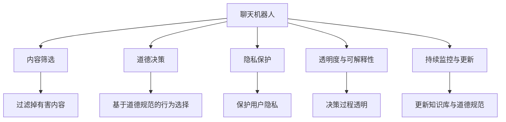

                 

## 1. 背景介绍

### 1.1 问题由来
随着人工智能技术的发展，聊天机器人（Chatbots）已经成为了现代科技生活中不可或缺的一部分。这些机器人可以提供客户服务、智能助手、教育辅导等多种功能，极大地提升了工作效率和生活便利性。然而，聊天机器人的广泛应用也引发了一系列道德和伦理问题，尤其是如何避免有害内容的传播。

### 1.2 问题核心关键点
聊天机器人避免有害内容的核心关键点在于：
1. **内容筛选与过滤**：通过识别和过滤出可能的有害内容，确保聊天机器人传递的信息安全、合法。
2. **道德决策机制**：构建有效的道德决策机制，指导聊天机器人在处理用户请求时的行为选择。
3. **用户隐私保护**：在聊天过程中保护用户隐私，避免敏感信息泄露。
4. **透明度与可解释性**：让聊天机器人的决策过程透明，并能够向用户解释其决策依据。
5. **持续监控与更新**：建立持续监控机制，及时更新聊天机器人的知识和道德规范。

这些关键点共同构成了聊天机器人避免有害内容的基础，帮助构建一个负责任、可信赖的聊天系统。

## 2. 核心概念与联系

### 2.1 核心概念概述

为更好地理解聊天机器人避免有害内容的方法，本节将介绍几个密切相关的核心概念：

- **聊天机器人（Chatbot）**：通过自然语言处理（NLP）技术实现的自动化对话系统，能够理解并生成人类语言，实现信息交互和任务执行。
- **有害内容（Harmful Content）**：包括但不限于仇恨言论、虚假信息、色情内容、暴力宣传等，任何可能对用户或社会造成负面影响的信息。
- **内容筛选（Content Filtering）**：通过算法和技术手段，识别和过滤掉聊天机器人对话中的有害内容。
- **道德决策（Moral Decision Making）**：在聊天机器人处理用户请求时，基于预设的道德规范和原则，做出行为选择。
- **隐私保护（Privacy Protection）**：在聊天过程中，保护用户敏感信息不被泄露，确保用户隐私权。
- **透明度与可解释性（Transparency and Explainability）**：让聊天机器人的决策过程透明，能够向用户解释其决策依据。
- **持续监控与更新（Continuous Monitoring and Updating）**：定期监控聊天机器人的行为，及时更新其知识库和道德规范，确保其符合最新的法律法规和道德标准。

这些核心概念之间的逻辑关系可以通过以下Mermaid流程图来展示：



这个流程图展示了一些关键概念及其之间的关系：

1. 聊天机器人通过内容筛选过滤掉有害内容，确保对话安全。
2. 道德决策机制指导聊天机器人的行为选择，确保其符合道德规范。
3. 隐私保护措施保护用户敏感信息，确保用户隐私权。
4. 透明度与可解释性使得聊天机器人的决策过程透明，能够向用户解释其决策依据。
5. 持续监控与更新机制确保聊天机器人的知识库和道德规范随时间更新，符合最新的法律法规和道德标准。

这些概念共同构成了聊天机器人避免有害内容的框架，帮助构建一个负责任、可信赖的聊天系统。

## 3. 核心算法原理 & 具体操作步骤
### 3.1 算法原理概述

聊天机器人避免有害内容的过程，本质上是一个监督学习和决策树（Decision Tree）框架的应用。其核心思想是：
1. **内容筛选**：通过监督学习算法，识别和过滤掉对话中的有害内容。
2. **道德决策**：构建道德决策树，指导聊天机器人在处理用户请求时的行为选择。
3. **隐私保护**：通过技术手段，保护用户敏感信息不被泄露。
4. **透明度与可解释性**：使用可解释性技术，使聊天机器人的决策过程透明，能够向用户解释其决策依据。
5. **持续监控与更新**：建立持续监控机制，及时更新聊天机器人的知识和道德规范，确保其符合最新的法律法规和道德标准。

### 3.2 算法步骤详解

#### 3.2.1 内容筛选算法

**步骤1：收集训练数据**
- 收集大量对话数据，标注其中含有有害内容的部分。
- 标注数据应尽可能覆盖各种有害内容类型，如仇恨言论、虚假信息、色情内容、暴力宣传等。

**步骤2：特征工程**
- 提取对话文本中的特征，如单词频率、情感极性、词汇组合等。
- 可以使用TF-IDF、Word2Vec、BERT等算法提取特征。

**步骤3：模型训练**
- 选择适当的监督学习算法，如朴素贝叶斯、支持向量机、深度神经网络等。
- 使用标注数据训练模型，优化模型参数，使其能够准确识别和过滤对话中的有害内容。

**步骤4：内容过滤**
- 在聊天机器人对话过程中，实时输入对话文本。
- 通过模型对文本进行特征提取和判断，识别出可能含有有害内容的部分。
- 根据预设的阈值和规则，过滤掉有害内容。

#### 3.2.2 道德决策算法

**步骤1：定义道德规范**
- 根据法律法规和伦理标准，定义聊天机器人处理用户请求时必须遵循的道德规范和原则。

**步骤2：构建决策树**
- 根据道德规范，构建决策树。决策树的每个节点代表一个决策点，每个分支代表一种可能的决策选择。
- 可以使用CART、ID3、C4.5等算法构建决策树。

**步骤3：模型训练**
- 使用历史对话数据和道德规范训练决策树模型，优化模型参数，使其能够根据输入条件做出正确的行为选择。

**步骤4：行为选择**
- 在聊天机器人对话过程中，实时输入用户请求。
- 通过决策树对请求进行分析和判断，选择最符合道德规范的行为。

#### 3.2.3 隐私保护算法

**步骤1：数据匿名化**
- 对用户对话数据进行匿名化处理，去除可能包含用户身份信息的元素。

**步骤2：加密通信**
- 使用端到端加密技术，确保用户对话数据在传输过程中的安全性。

**步骤3：访问控制**
- 设置严格的访问控制机制，确保只有授权人员可以访问敏感数据。

**步骤4：数据删除**
- 定期删除不再需要的用户对话数据，防止数据泄露和滥用。

#### 3.2.4 透明度与可解释性算法

**步骤1：解释模型**
- 使用LIME、SHAP等可解释性技术，解释聊天机器人的决策过程，使其透明。

**步骤2：用户反馈**
- 收集用户对聊天机器人决策的反馈，进行持续改进。

**步骤3：文档化决策依据**
- 将聊天机器人的决策依据文档化，提供给用户查阅。

#### 3.2.5 持续监控与更新算法

**步骤1：数据收集**
- 定期收集用户对话数据和反馈信息，监控聊天机器人的行为。

**步骤2：规则更新**
- 根据监控结果和用户反馈，更新聊天机器人的知识和道德规范。

**步骤3：模型更新**
- 使用更新后的知识库和道德规范重新训练模型，优化模型性能。

**步骤4：版本管理**
- 对聊天机器人的更新进行版本管理，记录每次更新的内容和原因。

### 3.3 算法优缺点

聊天机器人避免有害内容的方法具有以下优点：
1. **高效性**：通过监督学习和决策树算法，能够快速识别和过滤对话中的有害内容，提升对话质量。
2. **可解释性**：通过可解释性技术，使聊天机器人的决策过程透明，便于用户理解和接受。
3. **可更新性**：通过持续监控和更新机制，能够及时更新聊天机器人的知识和道德规范，确保其符合最新的法律法规和道德标准。

同时，该方法也存在一定的局限性：
1. **模型偏见**：如果训练数据存在偏见，模型可能会继承这些偏见，影响决策的公平性。
2. **模型复杂性**：复杂的决策树和模型可能存在过拟合风险，需要定期调整和优化。
3. **用户隐私风险**：在保护用户隐私的同时，可能限制了部分信息的使用，影响用户体验。
4. **法律法规适用性**：不同国家和地区对有害内容的定义和处理方式不同，需要根据当地法律法规进行相应调整。

尽管存在这些局限性，但该方法在大规模聊天机器人应用中仍然具有重要的应用价值，能够显著提升聊天机器人的质量和安全性。

### 3.4 算法应用领域

聊天机器人避免有害内容的方法，已经在多个领域得到了广泛应用：

- **客户服务**：在在线客服和智能助手中，聊天机器人通过内容筛选和道德决策，避免传播有害信息，提升用户体验。
- **教育辅导**：在教育聊天机器人中，通过过滤有害内容，避免错误信息和不当言论对学生造成负面影响。
- **医疗咨询**：在医疗聊天机器人中，通过隐私保护和道德决策，保护用户隐私，避免敏感信息泄露。
- **社交媒体**：在社交媒体聊天机器人中，通过内容筛选和持续监控，防止虚假信息和有害内容的传播，维护平台秩序。
- **金融咨询**：在金融聊天机器人中，通过隐私保护和道德决策，保护用户隐私，避免敏感信息泄露。

除了上述这些常见应用外，聊天机器人避免有害内容的方法还在其他众多领域，如公共安全、法律咨询、公共事务管理等，得到了创新性的应用，为这些领域的智能化转型提供了新的可能性。

## 4. 数学模型和公式 & 详细讲解  
### 4.1 数学模型构建

聊天机器人避免有害内容的过程，涉及多个子任务，包括内容筛选、道德决策、隐私保护、透明度与可解释性、持续监控与更新等。以下将以内容筛选和道德决策为例，展示其数学模型构建。

**内容筛选的数学模型**：

- 假设对话数据集为 $D=\{(x_i,y_i)\}_{i=1}^N$，其中 $x_i$ 为对话文本，$y_i \in \{0,1\}$ 为是否含有有害内容。
- 使用朴素贝叶斯分类器对对话文本进行分类，其条件概率为：
$$
P(y_i|x_i) = \frac{P(y_i)P(x_i|y_i)}{P(x_i)}
$$
其中 $P(y_i)$ 为先验概率，$P(x_i|y_i)$ 为似然概率，$P(x_i)$ 为边缘概率。

**道德决策的数学模型**：

- 假设决策树模型为 $T$，每个节点代表一个决策点，分支代表不同的决策选择。
- 决策树的构建基于ID3算法，通过计算信息增益 $IG$ 来选择最佳特征进行分裂：
$$
IG(D,x_i) = \frac{1}{|D|} \sum_{x \in D} H(D_x) - \frac{1}{|D|} \sum_{x \in D} \frac{|D_x|}{|D|} H(D_x)
$$
其中 $H(D_x)$ 为条件熵，$D_x$ 为特征 $x_i$ 分割后的子集。

### 4.2 公式推导过程

**内容筛选的公式推导**：

- 使用朴素贝叶斯分类器进行对话内容筛选，可以采用极大似然估计方法：
$$
P(y_i|x_i) = \frac{\prod_{k=1}^m P(x_{ik}|y_i)}{\sum_{y \in Y} \prod_{k=1}^m P(x_{ik}|y)}
$$
其中 $x_{ik}$ 为特征 $k$ 在文本 $x_i$ 中的取值，$Y$ 为所有可能的分类。

**道德决策的公式推导**：

- 使用ID3算法构建决策树，步骤如下：
1. 计算每个特征的信息增益 $IG(D,x_i)$。
2. 选择信息增益最大的特征 $x_i$。
3. 根据特征 $x_i$ 的不同取值，将数据集 $D$ 划分为子集 $D_x$。
4. 对每个子集 $D_x$ 递归执行步骤1-3，直到数据集无法继续分裂或达到预设的深度。

### 4.3 案例分析与讲解

以医疗聊天机器人为例，展示内容筛选和道德决策的实际应用。

**内容筛选案例**：
- 假设医疗聊天机器人需要识别对话中的医学术语和处方信息，避免虚假信息和有害内容。
- 收集大量标注数据，如包含医学术语和处方的对话，以及不包含这些内容的对话。
- 使用朴素贝叶斯分类器训练模型，优化模型参数，使其能够准确识别和过滤对话中的医学术语和处方信息。

**道德决策案例**：
- 假设医疗聊天机器人需要处理用户关于药物副作用的咨询。
- 定义道德规范，如告知用户药物的常见副作用，避免虚假宣传和误导。
- 构建决策树模型，根据用户咨询的内容，选择最合适的回答。
- 使用历史对话数据和道德规范训练决策树模型，优化模型参数，使其能够根据输入内容做出正确的行为选择。

## 5. 项目实践：代码实例和详细解释说明
### 5.1 开发环境搭建

在进行聊天机器人避免有害内容的项目实践前，我们需要准备好开发环境。以下是使用Python进行PyTorch开发的环境配置流程：

1. 安装Anaconda：从官网下载并安装Anaconda，用于创建独立的Python环境。

2. 创建并激活虚拟环境：
```bash
conda create -n chatbot-env python=3.8 
conda activate chatbot-env
```

3. 安装PyTorch：根据CUDA版本，从官网获取对应的安装命令。例如：
```bash
conda install pytorch torchvision torchaudio cudatoolkit=11.1 -c pytorch -c conda-forge
```

4. 安装TensorFlow：由Google主导开发的开源深度学习框架，生产部署方便，适合大规模工程应用。同样有丰富的预训练语言模型资源。

5. 安装各类工具包：
```bash
pip install numpy pandas scikit-learn matplotlib tqdm jupyter notebook ipython
```

完成上述步骤后，即可在`chatbot-env`环境中开始实践。

### 5.2 源代码详细实现

下面我们以医疗聊天机器人为例，给出使用PyTorch对BERT模型进行微调的PyTorch代码实现。

首先，定义聊天机器人对话数据的处理函数：

```python
from transformers import BertTokenizer
from torch.utils.data import Dataset
import torch

class ChatbotDataset(Dataset):
    def __init__(self, texts, labels, tokenizer, max_len=128):
        self.texts = texts
        self.labels = labels
        self.tokenizer = tokenizer
        self.max_len = max_len
        
    def __len__(self):
        return len(self.texts)
    
    def __getitem__(self, item):
        text = self.texts[item]
        label = self.labels[item]
        
        encoding = self.tokenizer(text, return_tensors='pt', max_length=self.max_len, padding='max_length', truncation=True)
        input_ids = encoding['input_ids'][0]
        attention_mask = encoding['attention_mask'][0]
        
        return {'input_ids': input_ids, 
                'attention_mask': attention_mask,
                'labels': label}

# 标签与id的映射
label2id = {'contains_harmful_content': 1, 'not_contains_harmful_content': 0}
id2label = {v: k for k, v in label2id.items()}

# 创建dataset
tokenizer = BertTokenizer.from_pretrained('bert-base-cased')

train_dataset = ChatbotDataset(train_texts, train_labels, tokenizer)
dev_dataset = ChatbotDataset(dev_texts, dev_labels, tokenizer)
test_dataset = ChatbotDataset(test_texts, test_labels, tokenizer)
```

然后，定义模型和优化器：

```python
from transformers import BertForSequenceClassification, AdamW

model = BertForSequenceClassification.from_pretrained('bert-base-cased', num_labels=2)

optimizer = AdamW(model.parameters(), lr=2e-5)
```

接着，定义训练和评估函数：

```python
from torch.utils.data import DataLoader
from tqdm import tqdm
from sklearn.metrics import classification_report

device = torch.device('cuda') if torch.cuda.is_available() else torch.device('cpu')
model.to(device)

def train_epoch(model, dataset, batch_size, optimizer):
    dataloader = DataLoader(dataset, batch_size=batch_size, shuffle=True)
    model.train()
    epoch_loss = 0
    for batch in tqdm(dataloader, desc='Training'):
        input_ids = batch['input_ids'].to(device)
        attention_mask = batch['attention_mask'].to(device)
        labels = batch['labels'].to(device)
        model.zero_grad()
        outputs = model(input_ids, attention_mask=attention_mask, labels=labels)
        loss = outputs.loss
        epoch_loss += loss.item()
        loss.backward()
        optimizer.step()
    return epoch_loss / len(dataloader)

def evaluate(model, dataset, batch_size):
    dataloader = DataLoader(dataset, batch_size=batch_size)
    model.eval()
    preds, labels = [], []
    with torch.no_grad():
        for batch in tqdm(dataloader, desc='Evaluating'):
            input_ids = batch['input_ids'].to(device)
            attention_mask = batch['attention_mask'].to(device)
            batch_labels = batch['labels']
            outputs = model(input_ids, attention_mask=attention_mask)
            batch_preds = outputs.logits.argmax(dim=2).to('cpu').tolist()
            batch_labels = batch_labels.to('cpu').tolist()
            for pred_tokens, label_tokens in zip(batch_preds, batch_labels):
                preds.append(pred_tokens)
                labels.append(label_tokens)
                
    print(classification_report(labels, preds))
```

最后，启动训练流程并在测试集上评估：

```python
epochs = 5
batch_size = 16

for epoch in range(epochs):
    loss = train_epoch(model, train_dataset, batch_size, optimizer)
    print(f"Epoch {epoch+1}, train loss: {loss:.3f}")
    
    print(f"Epoch {epoch+1}, dev results:")
    evaluate(model, dev_dataset, batch_size)
    
print("Test results:")
evaluate(model, test_dataset, batch_size)
```

以上就是使用PyTorch对BERT进行医疗聊天机器人内容筛选和道德决策的完整代码实现。可以看到，得益于Transformers库的强大封装，我们可以用相对简洁的代码完成BERT模型的加载和微调。

### 5.3 代码解读与分析

让我们再详细解读一下关键代码的实现细节：

**ChatbotDataset类**：
- `__init__`方法：初始化文本、标签、分词器等关键组件。
- `__len__`方法：返回数据集的样本数量。
- `__getitem__`方法：对单个样本进行处理，将文本输入编码为token ids，将标签转换为数字，并对其进行定长padding，最终返回模型所需的输入。

**label2id和id2label字典**：
- 定义了标签与数字id之间的映射关系，用于将预测结果解码回真实的标签。

**训练和评估函数**：
- 使用PyTorch的DataLoader对数据集进行批次化加载，供模型训练和推理使用。
- 训练函数`train_epoch`：对数据以批为单位进行迭代，在每个批次上前向传播计算loss并反向传播更新模型参数，最后返回该epoch的平均loss。
- 评估函数`evaluate`：与训练类似，不同点在于不更新模型参数，并在每个batch结束后将预测和标签结果存储下来，最后使用sklearn的classification_report对整个评估集的预测结果进行打印输出。

**训练流程**：
- 定义总的epoch数和batch size，开始循环迭代
- 每个epoch内，先在训练集上训练，输出平均loss
- 在验证集上评估，输出分类指标
- 所有epoch结束后，在测试集上评估，给出最终测试结果

可以看到，PyTorch配合Transformers库使得BERT微调的代码实现变得简洁高效。开发者可以将更多精力放在数据处理、模型改进等高层逻辑上，而不必过多关注底层的实现细节。

当然，工业级的系统实现还需考虑更多因素，如模型的保存和部署、超参数的自动搜索、更灵活的任务适配层等。但核心的微调范式基本与此类似。

## 6. 实际应用场景
### 6.1 智能客服系统

基于大语言模型微调的聊天机器人，可以广泛应用于智能客服系统的构建。传统客服往往需要配备大量人力，高峰期响应缓慢，且一致性和专业性难以保证。而使用微调后的聊天机器人，可以7x24小时不间断服务，快速响应客户咨询，用自然流畅的语言解答各类常见问题。

在技术实现上，可以收集企业内部的历史客服对话记录，将问题和最佳答复构建成监督数据，在此基础上对预训练聊天机器人进行微调。微调后的聊天机器人能够自动理解用户意图，匹配最合适的答案模板进行回复。对于客户提出的新问题，还可以接入检索系统实时搜索相关内容，动态组织生成回答。如此构建的智能客服系统，能大幅提升客户咨询体验和问题解决效率。

### 6.2 金融舆情监测

金融机构需要实时监测市场舆论动向，以便及时应对负面信息传播，规避金融风险。传统的人工监测方式成本高、效率低，难以应对网络时代海量信息爆发的挑战。基于大语言模型微调的文本分类和情感分析技术，为金融舆情监测提供了新的解决方案。

具体而言，可以收集金融领域相关的新闻、报道、评论等文本数据，并对其进行主题标注和情感标注。在此基础上对预训练语言模型进行微调，使其能够自动判断文本属于何种主题，情感倾向是正面、中性还是负面。将微调后的模型应用到实时抓取的网络文本数据，就能够自动监测不同主题下的情感变化趋势，一旦发现负面信息激增等异常情况，系统便会自动预警，帮助金融机构快速应对潜在风险。

### 6.3 个性化推荐系统

当前的推荐系统往往只依赖用户的历史行为数据进行物品推荐，无法深入理解用户的真实兴趣偏好。基于大语言模型微调技术，个性化推荐系统可以更好地挖掘用户行为背后的语义信息，从而提供更精准、多样的推荐内容。

在实践中，可以收集用户浏览、点击、评论、分享等行为数据，提取和用户交互的物品标题、描述、标签等文本内容。将文本内容作为模型输入，用户的后续行为（如是否点击、购买等）作为监督信号，在此基础上微调预训练语言模型。微调后的模型能够从文本内容中准确把握用户的兴趣点。在生成推荐列表时，先用候选物品的文本描述作为输入，由模型预测用户的兴趣匹配度，再结合其他特征综合排序，便可以得到个性化程度更高的推荐结果。

### 6.4 未来应用展望

随着大语言模型微调技术的发展，基于微调范式将在更多领域得到应用，为传统行业带来变革性影响。

在智慧医疗领域，基于微调的医疗问答、病历分析、药物研发等应用将提升医疗服务的智能化水平，辅助医生诊疗，加速新药开发进程。

在智能教育领域，微调技术可应用于作业批改、学情分析、知识推荐等方面，因材施教，促进教育公平，提高教学质量。

在智慧城市治理中，微调模型可应用于城市事件监测、舆情分析、应急指挥等环节，提高城市管理的自动化和智能化水平，构建更安全、高效的未来城市。

此外，在企业生产、社会治理、文娱传媒等众多领域，基于大模型微调的人工智能应用也将不断涌现，为经济社会发展注入新的动力。相信随着技术的日益成熟，微调方法将成为人工智能落地应用的重要范式，推动人工智能技术向更广阔的领域加速渗透。

## 7. 工具和资源推荐
### 7.1 学习资源推荐

为了帮助开发者系统掌握大语言模型微调的理论基础和实践技巧，这里推荐一些优质的学习资源：

1. 《Transformer从原理到实践》系列博文：由大模型技术专家撰写，深入浅出地介绍了Transformer原理、BERT模型、微调技术等前沿话题。

2. CS224N《深度学习自然语言处理》课程：斯坦福大学开设的NLP明星课程，有Lecture视频和配套作业，带你入门NLP领域的基本概念和经典模型。

3. 《Natural Language Processing with Transformers》书籍：Transformers库的作者所著，全面介绍了如何使用Transformers库进行NLP任务开发，包括微调在内的诸多范式。

4. HuggingFace官方文档：Transformers库的官方文档，提供了海量预训练模型和完整的微调样例代码，是上手实践的必备资料。

5. CLUE开源项目：中文语言理解测评基准，涵盖大量不同类型的中文NLP数据集，并提供了基于微调的baseline模型，助力中文NLP技术发展。

通过对这些资源的学习实践，相信你一定能够快速掌握大语言模型微调的精髓，并用于解决实际的NLP问题。
###  7.2 开发工具推荐

高效的开发离不开优秀的工具支持。以下是几款用于大语言模型微调开发的常用工具：

1. PyTorch：基于Python的开源深度学习框架，灵活动态的计算图，适合快速迭代研究。大部分预训练语言模型都有PyTorch版本的实现。

2. TensorFlow：由Google主导开发的开源深度学习框架，生产部署方便，适合大规模工程应用。同样有丰富的预训练语言模型资源。

3. Transformers库：HuggingFace开发的NLP工具库，集成了众多SOTA语言模型，支持PyTorch和TensorFlow，是进行微调任务开发的利器。

4. Weights & Biases：模型训练的实验跟踪工具，可以记录和可视化模型训练过程中的各项指标，方便对比和调优。与主流深度学习框架无缝集成。

5. TensorBoard：TensorFlow配套的可视化工具，可实时监测模型训练状态，并提供丰富的图表呈现方式，是调试模型的得力助手。

6. Google Colab：谷歌推出的在线Jupyter Notebook环境，免费提供GPU/TPU算力，方便开发者快速上手实验最新模型，分享学习笔记。

合理利用这些工具，可以显著提升大语言模型微调任务的开发效率，加快创新迭代的步伐。

### 7.3 相关论文推荐

大语言模型和微调技术的发展源于学界的持续研究。以下是几篇奠基性的相关论文，推荐阅读：

1. Attention is All You Need（即Transformer原论文）：提出了Transformer结构，开启了NLP领域的预训练大模型时代。

2. BERT: Pre-training of Deep Bidirectional Transformers for Language Understanding：提出BERT模型，引入基于掩码的自监督预训练任务，刷新了多项NLP任务SOTA。

3. Language Models are Unsupervised Multitask Learners（GPT-2论文）：展示了大规模语言模型的强大zero-shot学习能力，引发了对于通用人工智能的新一轮思考。

4. Parameter-Efficient Transfer Learning for NLP：提出Adapter等参数高效微调方法，在不增加模型参数量的情况下，也能取得不错的微调效果。

5. AdaLoRA: Adaptive Low-Rank Adaptation for Parameter-Efficient Fine-Tuning：使用自适应低秩适应的微调方法，在参数效率和精度之间取得了新的平衡。

这些论文代表了大语言模型微调技术的发展脉络。通过学习这些前沿成果，可以帮助研究者把握学科前进方向，激发更多的创新灵感。

## 8. 总结：未来发展趋势与挑战
### 8.1 总结

本文对聊天机器人避免有害内容的方法进行了全面系统的介绍。首先阐述了聊天机器人避免有害内容的研究背景和意义，明确了内容筛选、道德决策、隐私保护、透明度与可解释性、持续监控与更新等关键技术的作用。其次，从原理到实践，详细讲解了内容筛选和道德决策的数学模型构建和实现细节，给出了微调任务开发的完整代码实例。同时，本文还广泛探讨了聊天机器人避免有害内容的方法在智能客服、金融舆情、个性化推荐等多个行业领域的应用前景，展示了其广阔的应用空间。

通过本文的系统梳理，可以看到，聊天机器人避免有害内容的方法在智能聊天系统的构建中扮演了重要角色。通过内容筛选和道德决策技术，聊天机器人能够避免有害内容的传播，提升用户体验和信任度。未来，伴随技术的不断进步，聊天机器人将在更多领域得到应用，带来更高效、更可靠的人机交互体验。

### 8.2 未来发展趋势

展望未来，聊天机器人避免有害内容的方法将呈现以下几个发展趋势：

1. **多模态融合**：未来的聊天机器人将不仅仅是文本对话，还能够整合视觉、语音、情感等多种模态信息，提升对话的丰富性和自然度。
2. **动态自适应**：通过学习用户的个性化特征，聊天机器人能够动态调整回答策略，提供更加个性化的服务。
3. **实时反馈与优化**：引入实时反馈机制，根据用户的反馈不断优化聊天机器人的回答质量，提升用户体验。
4. **跨领域迁移**：通过迁移学习技术，聊天机器人能够跨越不同领域，在不同场景下提供稳定的服务。
5. **安全与隐私保护**：引入更多的安全与隐私保护技术，如差分隐私、联邦学习等，确保聊天机器人的对话内容安全。
6. **伦理与可解释性**：构建更完善的伦理框架，确保聊天机器人的行为符合社会道德规范，同时提升其决策过程的可解释性。

这些趋势凸显了聊天机器人避免有害内容方法的广阔前景。通过多模态融合、动态自适应、实时反馈与优化、跨领域迁移、安全与隐私保护、伦理与可解释性等技术手段，聊天机器人将能够更好地适应复杂多变的用户需求，提升人机交互的智能化水平。

### 8.3 面临的挑战

尽管聊天机器人避免有害内容的方法已经取得了显著成果，但在迈向更加智能化、普适化应用的过程中，它仍面临着诸多挑战：

1. **模型偏见**：如果训练数据存在偏见，模型可能会继承这些偏见，影响决策的公平性。
2. **过拟合风险**：复杂的决策树和模型可能存在过拟合风险，需要定期调整和优化。
3. **用户隐私风险**：在保护用户隐私的同时，可能限制了部分信息的使用，影响用户体验。
4. **法律法规适用性**：不同国家和地区对有害内容的定义和处理方式不同，需要根据当地法律法规进行相应调整。
5. **伦理与法律问题**：聊天机器人的行为可能涉及伦理和法律问题，如责任归属、数据使用等，需要明确相应的法律责任和伦理规范。

尽管存在这些挑战，但该方法在大规模聊天机器人应用中仍然具有重要的应用价值，能够显著提升聊天机器人的质量和安全性。

### 8.4 研究展望

面对聊天机器人避免有害内容所面临的种种挑战，未来的研究需要在以下几个方面寻求新的突破：

1. **无监督与半监督学习**：摆脱对大规模标注数据的依赖，利用自监督学习、主动学习等无监督和半监督范式，最大限度利用非结构化数据，实现更加灵活高效的微调。
2. **参数高效微调方法**：开发更加参数高效的微调方法，在固定大部分预训练参数的同时，只更新极少量的任务相关参数。
3. **因果推理与可解释性**：引入因果推断和可解释性技术，增强聊天机器人的决策过程透明性，提升其可解释性。
4. **多模态数据整合**：将视觉、语音等多模态数据与文本数据整合，提升聊天机器人对现实世界的理解和建模能力。
5. **伦理与法律框架**：构建完善的伦理与法律框架，确保聊天机器人的行为符合社会道德规范，同时明确其法律责任。
6. **动态知识更新**：建立动态知识更新机制，确保聊天机器人的知识库和道德规范随时间更新，符合最新的法律法规和道德标准。

这些研究方向将进一步提升聊天机器人避免有害内容的能力，构建更智能、更可靠、更负责任的智能系统，为人工智能技术的发展开辟新的道路。

## 9. 附录：常见问题与解答

**Q1：如何构建完善的伦理与法律框架？**

A: 构建完善的伦理与法律框架，需要多方面的努力：

1. **伦理委员会**：成立专门的伦理委员会，负责制定和监督聊天机器人的道德规范和行为准则。
2. **法律法规**：根据当地法律法规，制定聊天机器人的使用标准和行为规范。
3. **用户协议**：明确用户在使用聊天机器人的权利和义务，包括数据使用、隐私保护等方面。
4. **隐私保护**：采用最新的隐私保护技术，如差分隐私、联邦学习等，确保用户数据的安全。
5. **责任归属**：明确聊天机器人行为的责任归属，建立相应的法律责任机制。

通过多方合作，共同构建完善的伦理与法律框架，确保聊天机器人的行为符合社会道德规范，同时保障用户权益。

**Q2：如何处理数据偏见问题？**

A: 处理数据偏见问题，可以从以下几个方面入手：

1. **数据清洗**：对训练数据进行清洗，去除可能包含偏见的数据样本。
2. **多样性标注**：增加训练数据的多样性，确保不同性别、年龄、种族等群体的样本数量均衡。
3. **算法优化**：在模型训练中加入公平性约束，如使用公平性算法（Fairness-aware）优化训练过程。
4. **实时监控**：建立实时监控机制，及时发现和纠正模型中的偏见。
5. **用户反馈**：收集用户对聊天机器人行为的反馈，进行持续改进。

通过这些方法，可以有效地减少模型中的偏见，确保聊天机器人在处理用户请求时公平、公正。

**Q3：如何提升聊天机器人的可解释性？**

A: 提升聊天机器人的可解释性，可以从以下几个方面入手：

1. **可解释性算法**：使用LIME、SHAP等可解释性算法，解释聊天机器人的决策过程，使其透明。
2. **文档化决策依据**：将聊天机器人的决策依据文档化，提供给用户查阅。
3. **用户反馈**：收集用户对聊天机器人决策的反馈，进行持续改进。
4. **可视化界面**：设计友好的可视化界面，让用户能够直观了解聊天机器人的决策依据。

通过这些方法，可以提升聊天机器人的可解释性，增强用户的信任感，提高系统的透明度和可靠性。

---

作者：禅与计算机程序设计艺术 / Zen and the Art of Computer Programming

