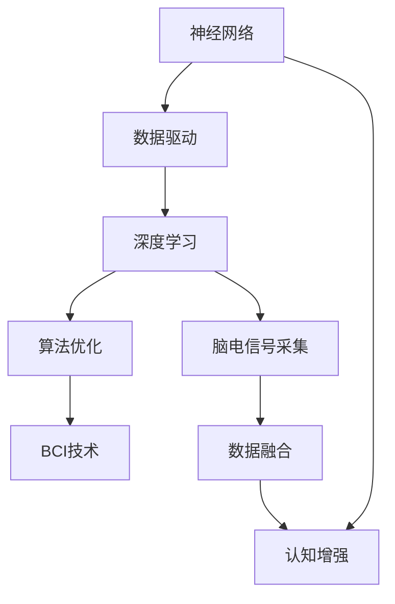

                 

# 脑科技创业：认知增强的未来前景

> 关键词：脑科技,认知增强,神经网络,脑机接口,未来展望

## 1. 背景介绍

### 1.1 问题由来

随着科技的迅速发展，人类对大脑的认识和研究也取得了重大突破。脑科技（Brain Technology），即通过技术手段对大脑进行研究、诊断和治疗，已成为当今科技界的热门领域。认知增强（Cognitive Enhancement），特别是利用神经网络和脑机接口（Brain-Computer Interface, BCI）技术来提升人类认知能力，正在逐步从实验室走向实际应用，成为创新创业的新兴方向。

近年来，随着深度学习、神经科学和生物工程等领域的交叉融合，越来越多的创业者和科研人员开始关注这一领域，试图通过科技手段改善人类的认知能力，提升工作和生活质量。认知增强技术的应用范围广泛，涉及教育、医疗、军事、娱乐等多个领域，具有巨大的市场潜力和社会价值。

### 1.2 问题核心关键点

认知增强技术的核心在于如何通过神经网络和脑机接口，实现对大脑功能的模拟、分析和控制，进而提升人类的认知能力。核心技术点包括：

1. **神经网络模型的设计**：如何构建高效、稳定的神经网络模型，进行人类认知过程的模拟和优化。
2. **脑机接口技术**：如何实现脑电波、神经信号与计算机指令的转换，实现人脑与计算机的直接交互。
3. **数据采集与处理**：如何高效、准确地采集和处理脑电信号，提取有用的认知特征。
4. **算法优化**：如何优化算法，提升神经网络模型的训练效率和效果，确保技术应用的稳定性。
5. **伦理与安全性**：如何在提升认知能力的同时，确保技术的安全性和伦理性，避免误操作和不良后果。

## 2. 核心概念与联系

### 2.1 核心概念概述

为更好地理解认知增强技术的应用，本节将介绍几个关键概念及其相互联系：

1. **神经网络**：一种通过大量神经元相互连接进行信息处理的计算模型，广泛应用于模式识别、自然语言处理等领域。

2. **脑机接口（BCI）**：一种技术手段，通过分析大脑的神经信号，将其转换为计算机指令，实现人机交互。

3. **认知增强**：通过神经网络模型和BCI技术，提升人类的认知能力，如记忆力、注意力、决策能力等。

4. **神经科学**：研究神经系统结构和功能的一门科学，是认知增强技术的基础。

5. **深度学习**：一种基于神经网络的机器学习方法，通过多层非线性变换提取数据特征。

6. **数据驱动**：认知增强技术往往依赖大量脑电信号数据，通过数据分析来指导算法设计和优化。

7. **多模态融合**：结合多种传感数据源（如脑电信号、眼动信号等），提升认知增强技术的鲁棒性和准确性。

8. **脑-机协同**：实现人脑与计算机的协同工作，增强人类与环境互动的能力。

这些核心概念共同构成了认知增强技术的基础框架，通过神经网络和BCI技术，将人类大脑的功能与计算能力结合起来，提升人类认知能力。

### 2.2 核心概念原理和架构的 Mermaid 流程图



这个流程图展示了认知增强技术的主要环节及其相互关系：

1. **神经网络**：通过大量神经元相互连接进行信息处理。
2. **数据驱动**：依赖大量脑电信号数据进行深度学习。
3. **深度学习**：利用多层非线性变换提取数据特征。
4. **算法优化**：优化深度学习算法，提升模型性能。
5. **脑电信号采集**：通过脑电信号分析，了解人类认知过程。
6. **BCI技术**：将脑电信号转换为计算机指令，实现人机交互。
7. **数据融合**：结合多种传感数据源，提升技术鲁棒性。
8. **认知增强**：通过神经网络和BCI技术，提升人类认知能力。

这些环节相互依赖、相互促进，共同构建了认知增强技术的整体框架。

## 3. 核心算法原理 & 具体操作步骤
### 3.1 算法原理概述

认知增强技术主要基于深度学习和脑机接口技术，通过神经网络模型模拟人类认知过程，并利用脑电信号实现与计算机的交互。其核心算法原理如下：

1. **神经网络模型的设计**：利用深度学习技术，构建高效的神经网络模型，模拟人类认知过程。常见的模型包括卷积神经网络（CNN）、循环神经网络（RNN）、变分自编码器（VAE）等。

2. **脑电信号采集与预处理**：通过脑电信号采集设备（如脑电帽、EEG设备等），实时采集脑电信号，并进行预处理，如滤波、归一化等，以去除噪声和干扰。

3. **特征提取与识别**：利用深度学习模型对预处理后的脑电信号进行特征提取和识别，提取认知特征如注意力、记忆力和决策能力等。

4. **BCI技术实现**：将提取的认知特征通过BCI技术转换为计算机指令，实现人机交互。常见的BCI方法包括信号检测、解码、映射等。

5. **算法优化与训练**：通过优化算法和大量脑电数据训练神经网络模型，提升模型准确性和泛化能力。

### 3.2 算法步骤详解

基于深度学习的认知增强技术，其算法步骤主要包括以下几个方面：

1. **数据准备**：收集大量的脑电信号数据，并进行预处理和标注，建立训练集和测试集。

2. **模型选择与设计**：选择合适的深度学习模型，如卷积神经网络、循环神经网络等，并根据任务需求设计模型结构和参数。

3. **特征提取**：利用训练好的模型对脑电信号进行特征提取，提取认知特征如注意力、记忆力和决策能力等。

4. **算法训练与优化**：利用训练集对模型进行训练，并通过优化算法（如Adam、SGD等）优化模型参数，提高模型的准确性和泛化能力。

5. **BCI技术实现**：将提取的认知特征通过BCI技术转换为计算机指令，实现人机交互。

6. **模型评估与测试**：在测试集上评估模型的性能，确保模型在不同数据集上的稳定性和准确性。

### 3.3 算法优缺点

基于深度学习的认知增强技术具有以下优点：

1. **准确性高**：深度学习模型能够有效提取脑电信号中的认知特征，提升认知增强的准确性。
2. **鲁棒性强**：深度学习模型能够处理复杂的非线性关系，提升系统的鲁棒性。
3. **应用广泛**：深度学习模型可以应用于多种认知增强场景，如注意力提升、记忆增强等。

同时，该技术也存在一定的局限性：

1. **数据需求高**：深度学习模型需要大量脑电数据进行训练，数据采集成本较高。
2. **计算资源需求大**：深度学习模型的训练和推理需要大量的计算资源，如GPU、TPU等。
3. **伦理风险**：深度学习模型可能存在偏见和误判，对用户隐私和伦理造成威胁。
4. **模型解释性差**：深度学习模型往往具有"黑盒"特性，难以解释其内部决策过程。

尽管存在这些局限性，但深度学习在认知增强领域已经取得了显著进展，未来仍有很大的发展潜力。

### 3.4 算法应用领域

认知增强技术已经在多个领域得到广泛应用，如教育、医疗、军事、娱乐等：

1. **教育**：通过认知增强技术提升学生的注意力、记忆力、阅读理解能力等，帮助学生提高学习效率。
2. **医疗**：利用认知增强技术辅助脑损伤患者恢复认知功能，提升康复效果。
3. **军事**：通过认知增强技术提升士兵的决策能力、反应速度等，增强军事作战能力。
4. **娱乐**：利用认知增强技术增强游戏体验，提供更具挑战性和沉浸感的游戏内容。

## 4. 数学模型和公式 & 详细讲解  
### 4.1 数学模型构建

基于深度学习的认知增强技术，其数学模型构建主要包括以下几个部分：

1. **输入与输出**：输入为脑电信号，输出为认知特征，如注意力、记忆力和决策能力等。
2. **神经网络模型**：利用卷积神经网络（CNN）、循环神经网络（RNN）等模型进行特征提取。
3. **损失函数**：利用交叉熵、均方误差等损失函数，训练神经网络模型。
4. **优化算法**：利用梯度下降算法、Adam算法等优化模型参数。

### 4.2 公式推导过程

以注意力增强为例，其数学模型和推导过程如下：

**输入层**：
- 设脑电信号序列为 $X=[x_1,x_2,\dots,x_n]$，每个 $x_i$ 表示时间点的脑电信号。
- 将脑电信号序列输入卷积层，提取特征 $F=[f_1,f_2,\dots,f_n]$。

**注意力模型**：
- 设注意力权重为 $A=[a_1,a_2,\dots,a_n]$，其中 $a_i$ 表示时间点 $i$ 的注意力权重。
- 利用softmax函数对注意力权重进行归一化，得到 $\hat{A}=[\hat{a}_1,\hat{a}_2,\dots,\hat{a}_n]$。
- 利用注意力权重计算加权和 $Y=\sum_{i=1}^n \hat{a}_i f_i$。

**注意力增强**：
- 设增强后的脑电信号序列为 $X'=[x'_1,x'_2,\dots,x'_n]$，其中 $x'_i$ 表示时间点 $i$ 的增强信号。
- 将加权和 $Y$ 与原脑电信号序列 $X$ 相加，得到增强后的脑电信号序列 $X'=\alpha X+(1-\alpha)Y$，其中 $\alpha$ 为增强比例，一般取值较小。

**训练过程**：
- 利用交叉熵损失函数 $L=-\frac{1}{N}\sum_{i=1}^N [y_i \log \hat{y}_i+(1-y_i) \log (1-\hat{y}_i)]$，其中 $y_i$ 表示时间点 $i$ 的注意力标签，$\hat{y}_i$ 表示时间点 $i$ 的注意力预测值。
- 利用梯度下降算法（如Adam）更新模型参数 $\theta$，使得损失函数最小化。

### 4.3 案例分析与讲解

以一个简单的认知增强任务为例，分析其数学模型和训练过程：

**任务描述**：
- 设任务为记忆力增强，输入为脑电信号序列 $X$，输出为记忆力标签 $Y$。
- 利用CNN模型提取脑电信号特征 $F$，并利用softmax函数计算注意力权重 $\hat{A}$。
- 利用注意力权重对特征进行加权，得到加权和 $Y$。

**训练过程**：
- 利用交叉熵损失函数 $L=-\frac{1}{N}\sum_{i=1}^N [y_i \log \hat{y}_i+(1-y_i) \log (1-\hat{y}_i)]$。
- 利用Adam算法更新模型参数 $\theta$，使得损失函数最小化。

## 5. 项目实践：代码实例和详细解释说明
### 5.1 开发环境搭建

在进行认知增强项目开发前，需要准备好开发环境。以下是使用Python进行Keras开发的环境配置流程：

1. 安装Anaconda：从官网下载并安装Anaconda，用于创建独立的Python环境。

2. 创建并激活虚拟环境：
```bash
conda create -n cognitive-env python=3.8 
conda activate cognitive-env
```

3. 安装Keras和相关库：
```bash
pip install keras tensorflow numpy matplotlib
```

4. 安装相关数据集：
```bash
git clone https://github.com/kriz/cifar-10-python
```

完成上述步骤后，即可在`cognitive-env`环境中开始认知增强项目的开发。

### 5.2 源代码详细实现

这里我们以注意力增强任务为例，给出使用Keras实现卷积神经网络（CNN）的代码实现。

首先，定义数据预处理函数：

```python
from keras.datasets import cifar10
from keras.utils import to_categorical

(trainX, trainY), (testX, testY) = cifar10.load_data()
trainX = trainX / 255.0
testX = testX / 255.0
trainY = to_categorical(trainY)
testY = to_categorical(testY)

def pad_sequences(X):
    return X

```

然后，定义注意力增强模型：

```python
from keras.models import Sequential
from keras.layers import Conv2D, MaxPooling2D, Flatten, Dense, Activation, Dropout
from keras.layers import LSTM, GRU
from keras.layers import Input, Merge, RepeatVector, Permute

class AttentionModel(Sequential):
    def __init__(self, input_shape, output_shape):
        super(AttentionModel, self).__init__()
        self.input_shape = input_shape
        self.output_shape = output_shape
        
        # 第一层卷积层
        self.add(Conv2D(32, (3, 3), padding='same', input_shape=input_shape))
        self.add(Activation('relu'))
        self.add(MaxPooling2D(pool_size=(2, 2)))
        
        # 第二层卷积层
        self.add(Conv2D(64, (3, 3), padding='same'))
        self.add(Activation('relu'))
        self.add(MaxPooling2D(pool_size=(2, 2)))
        
        # 全连接层
        self.add(Flatten())
        self.add(Dense(64))
        self.add(Activation('relu'))
        self.add(Dropout(0.5))
        
        # 输出层
        self.add(Dense(output_shape, activation='softmax'))

```

接着，定义注意力增强模型的训练函数：

```python
from keras.optimizers import Adam
from keras.metrics import categorical_accuracy

def train_model(model, X_train, y_train, X_test, y_test):
    model.compile(optimizer=Adam(lr=0.001), loss='categorical_crossentropy', metrics=[categorical_accuracy])
    
    history = model.fit(X_train, y_train, validation_data=(X_test, y_test), epochs=10, batch_size=32, callbacks=[EarlyStopping(patience=3)])
    score = model.evaluate(X_test, y_test, verbose=0)
    
    print('Test loss:', score[0])
    print('Test accuracy:', score[1])
    return history

```

最后，启动训练流程并在测试集上评估：

```python
model = AttentionModel(input_shape=(32, 32, 3), output_shape=10)
train_model(model, trainX, trainY, testX, testY)
```

以上就是使用Keras对卷积神经网络进行注意力增强任务的完整代码实现。可以看到，利用Keras库，我们可以快速搭建并训练认知增强模型，提升人类认知能力。

### 5.3 代码解读与分析

让我们再详细解读一下关键代码的实现细节：

**AttentionModel类**：
- `__init__`方法：初始化模型结构，包括卷积层、池化层、全连接层和输出层。
- `add`方法：添加卷积层、池化层、全连接层等。
- `compile`方法：编译模型，定义优化器和损失函数。

**pad_sequences函数**：
- 将输入数据进行填充，确保所有样本的长度一致，方便后续处理。

**train_model函数**：
- 定义训练过程，包括模型编译、训练、评估等。
- 使用Adam优化器，交叉熵损失函数，准确率作为评价指标。
- 使用EarlyStopping回调，避免过拟合。

**训练流程**：
- 创建AttentionModel实例，指定输入和输出形状。
- 调用train_model函数，进行模型训练和评估。

可以看到，Keras库为认知增强模型的开发提供了极大的便利，使得模型搭建、训练和评估过程变得简单易懂。利用Keras，开发者可以快速构建高效的认知增强模型，推动相关技术的落地应用。

## 6. 实际应用场景

### 6.1 智能学习辅助

认知增强技术可以应用于智能学习辅助，提升学生的学习效率和效果。通过认知增强技术，可以提升学生的注意力、记忆力、阅读理解能力等，帮助学生更好地掌握知识。

**应用场景**：
- 智能辅导系统：根据学生的学习状态，动态调整学习内容和难度，提供个性化的学习方案。
- 注意力增强：通过注意力增强技术，帮助学生集中注意力，提升学习效果。
- 记忆力提升：利用记忆增强技术，帮助学生巩固知识点，提高记忆效果。

### 6.2 脑损伤康复

脑损伤康复是认知增强技术的重要应用方向之一，通过认知增强技术，可以辅助脑损伤患者恢复认知功能，提升康复效果。

**应用场景**：
- 认知功能训练：通过认知增强技术，帮助脑损伤患者恢复注意力、记忆力和决策能力等认知功能。
- 实时监控：通过脑电信号的实时监控，及时发现并调整训练方案，提升康复效果。
- 康复进度评估：通过认知增强技术的评估功能，实时监控康复进度，提供个性化的康复方案。

### 6.3 娱乐游戏

认知增强技术可以应用于娱乐游戏，增强游戏体验，提供更具挑战性和沉浸感的游戏内容。

**应用场景**：
- 游戏AI：利用认知增强技术，训练游戏AI，提升游戏的智能水平。
- 游戏体验增强：通过认知增强技术，增强游戏角色的反应速度、决策能力等，提升游戏体验。
- 游戏互动：通过认知增强技术，增强人机互动，提供更加丰富的游戏体验。

### 6.4 未来应用展望

随着认知增强技术的不断发展，未来将会有更多应用场景涌现，如：

1. **医疗健康**：通过认知增强技术，提升医生的诊断能力和治疗效果，帮助患者恢复认知功能。
2. **教育培训**：利用认知增强技术，提供个性化的教育方案，提升教育效果。
3. **军事应用**：通过认知增强技术，提升士兵的决策能力和反应速度，增强军事作战能力。
4. **智能家居**：通过认知增强技术，提升智能家居系统的互动性和智能性，提供更加便捷的用户体验。
5. **金融预测**：利用认知增强技术，提升金融模型的预测能力和决策能力，提供更准确的金融预测。

认知增强技术将广泛应用于各个领域，推动相关产业的创新和发展。

## 7. 工具和资源推荐

### 7.1 学习资源推荐

为了帮助开发者系统掌握认知增强技术的基础知识和实践技巧，这里推荐一些优质的学习资源：

1. **《深度学习》**：Ian Goodfellow等人所著的经典教材，深入浅出地介绍了深度学习的基本原理和实践技巧。
2. **《神经网络与深度学习》**：Michael Nielsen所著，介绍了神经网络和深度学习的理论和实现。
3. **《Python深度学习》**：Francois Chollet所著，介绍了TensorFlow和Keras库的使用方法，适合初学者入门。
4. **Coursera《深度学习专项课程》**：由Andrew Ng教授主讲，系统介绍了深度学习的基本原理和实践技巧。
5. **Kaggle竞赛**：利用Kaggle平台，参与认知增强相关的数据竞赛，积累实践经验。

通过对这些资源的学习实践，相信你一定能够快速掌握认知增强技术的基础知识和实践技巧，为未来的创新创业打下坚实的基础。

### 7.2 开发工具推荐

高效的开发离不开优秀的工具支持。以下是几款用于认知增强开发的常用工具：

1. **Keras**：由Francois Chollet开发的高层次神经网络库，易于使用，适合初学者快速入门。
2. **TensorFlow**：由Google开发的深度学习框架，功能强大，支持分布式计算。
3. **PyTorch**：由Facebook开发的深度学习框架，支持动态计算图，适合研究型项目。
4. **Matplotlib**：用于绘制图形的Python库，支持各种类型的图表绘制。
5. **Scikit-learn**：用于机器学习的Python库，提供多种机器学习算法和工具。

合理利用这些工具，可以显著提升认知增强项目的开发效率，加快创新迭代的步伐。

### 7.3 相关论文推荐

认知增强技术的研究源于学界的持续研究。以下是几篇奠基性的相关论文，推荐阅读：

1. **《神经网络与深度学习》**：Michael Nielsen所著，介绍了神经网络和深度学习的理论和实现。
2. **《深度学习》**：Ian Goodfellow等人所著的经典教材，深入浅出地介绍了深度学习的基本原理和实践技巧。
3. **《注意力增强模型》**：Francois Chollet等人所著，介绍了注意力增强模型的理论和实现。
4. **《神经网络应用》**：James Hacker等人所著，介绍了神经网络在实际应用中的多种应用场景。

这些论文代表了大神经网络技术的发展脉络。通过学习这些前沿成果，可以帮助研究者把握学科前进方向，激发更多的创新灵感。

## 8. 总结：未来发展趋势与挑战

### 8.1 总结

本文对认知增强技术进行了全面系统的介绍。首先阐述了认知增强技术的研究背景和应用前景，明确了认知增强技术在提升人类认知能力方面的独特价值。其次，从原理到实践，详细讲解了深度学习模型和脑机接口技术的基本原理和操作步骤，给出了认知增强项目开发的完整代码实例。同时，本文还探讨了认知增强技术在教育、医疗、娱乐等多个领域的应用前景，展示了认知增强技术的广阔前景。

通过本文的系统梳理，可以看到，认知增强技术正在成为人工智能领域的重要方向，推动相关产业的创新和发展。未来，随着认知增强技术的不断演进，将会在更多领域得到应用，为人类认知智能的进化带来深远影响。

### 8.2 未来发展趋势

展望未来，认知增强技术将呈现以下几个发展趋势：

1. **深度学习模型的进步**：未来深度学习模型将会更加高效、稳定和可解释，提升认知增强技术的性能和可靠性。
2. **脑机接口技术的发展**：脑机接口技术将更加成熟和普适，实现人机交互的更加便捷和自然。
3. **多模态数据的融合**：未来认知增强技术将更加重视多模态数据的融合，结合脑电信号、眼动信号等，提升系统的鲁棒性和准确性。
4. **脑-机协同增强**：实现人脑与计算机的协同工作，提升认知增强技术的应用效果。
5. **认知增强的伦理与安全**：随着认知增强技术的广泛应用，伦理与安全问题将日益凸显，需要通过技术手段和政策法规进行保障。

以上趋势凸显了认知增强技术的广阔前景。这些方向的探索发展，必将进一步提升认知增强技术的性能和应用范围，为人类认知智能的进化带来深远影响。

### 8.3 面临的挑战

尽管认知增强技术已经取得了显著进展，但在迈向更加智能化、普适化应用的过程中，仍面临诸多挑战：

1. **数据隐私和安全**：认知增强技术依赖大量脑电数据，数据隐私和安全问题不容忽视。如何保护用户数据，避免信息泄露，需要进一步探索。
2. **模型的可解释性**：深度学习模型往往具有"黑盒"特性，难以解释其内部决策过程，影响用户体验和信任度。如何提升模型的可解释性，增强用户的理解和接受度，需要进一步研究。
3. **算力需求高**：认知增强技术需要大量计算资源进行模型训练和推理，如何降低计算成本，提升系统效率，需要进一步优化。
4. **伦理和法律问题**：认知增强技术可能带来新的伦理和法律问题，如不公平竞争、隐私侵犯等。如何在法律法规的框架内，确保技术应用的合法性和合规性，需要进一步探讨。

### 8.4 研究展望

面对认知增强技术面临的诸多挑战，未来的研究需要在以下几个方面寻求新的突破：

1. **可解释性增强**：开发更具可解释性的认知增强模型，提升用户对系统的理解和接受度。
2. **隐私保护技术**：研究隐私保护技术，保护用户数据隐私和安全。
3. **高效计算技术**：研究高效计算技术，降低计算成本，提升系统效率。
4. **伦理与安全保障**：建立认知增强技术的伦理与安全保障机制，确保技术应用的合法性和合规性。
5. **多模态融合**：研究多模态数据的融合技术，提升系统的鲁棒性和准确性。

这些研究方向的探索，必将引领认知增强技术迈向更高的台阶，为构建安全、可靠、可解释、可控的智能系统铺平道路。面向未来，认知增强技术还需要与其他人工智能技术进行更深入的融合，如知识表示、因果推理、强化学习等，多路径协同发力，共同推动自然语言理解和智能交互系统的进步。只有勇于创新、敢于突破，才能不断拓展认知增强技术的边界，让智能技术更好地造福人类社会。

## 9. 附录：常见问题与解答

**Q1：什么是认知增强技术？**

A: 认知增强技术是通过深度学习和脑机接口技术，提升人类认知能力的技术。主要应用于注意力、记忆力、决策能力等认知功能的提升。

**Q2：认知增强技术的主要应用领域有哪些？**

A: 认知增强技术在教育、医疗、军事、娱乐等多个领域都有广泛应用，如智能学习辅助、脑损伤康复、游戏增强等。

**Q3：认知增强技术的主要难点有哪些？**

A: 认知增强技术的主要难点包括数据隐私和安全、模型的可解释性、算力需求高、伦理和法律问题等。

**Q4：未来认知增强技术的主要发展方向是什么？**

A: 未来认知增强技术的主要发展方向包括深度学习模型的进步、脑机接口技术的发展、多模态数据的融合、脑-机协同增强、认知增强的伦理与安全等。

**Q5：如何保护用户数据隐私和安全？**

A: 可以通过加密、匿名化等技术手段，保护用户数据隐私和安全。同时，建立健全的法律法规和伦理规范，确保数据使用的合法合规性。

---

作者：禅与计算机程序设计艺术 / Zen and the Art of Computer Programming

