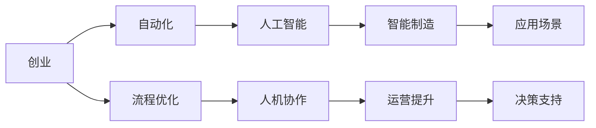

                 

# 自动化创业中的人机协作

> 关键词：自动化, 创业, 人工智能, 人机协作, 自动化流程, 智能制造, 创业智能化

## 1. 背景介绍

### 1.1 问题由来
在过去十年中，自动化技术的迅猛发展深刻改变了全球产业格局。从工业制造到服务行业，从数据处理到人工智能，自动化技术在各行各业中广泛应用，推动了生产效率的飞跃。特别是在人工智能的推动下，自动化系统的智能化水平不断提升，使得许多传统的劳动密集型业务得以优化甚至完全替代，极大提升了整体的生产力和竞争力。

然而，自动化技术的深入应用也引发了一系列问题，特别是在企业创业和管理层面。一方面，自动化系统的引入需要大量的前期投入和维护成本，给创业企业带来了不小的压力；另一方面，在企业运营过程中，自动化系统与人类的协作方式尚未成熟，存在诸多不适应和冲突。本文旨在探讨自动化创业中的人机协作问题，并提出一些解决方案。

## 2. 核心概念与联系

### 2.1 核心概念概述

本节将介绍几个在探讨自动化创业中人机协作时，会涉及到的核心概念：

- **自动化**：指使用机械装置或计算机系统来执行任务，减少人力参与。自动化可以分为完全自动化和半自动化两种形式。
- **创业**：指创立新的企业，通常需要面临较高的风险和不确定性。
- **人工智能**：使用机器学习、自然语言处理等技术，模拟人的思维和决策过程，以完成复杂任务。
- **人机协作**：指将人工智能系统与人类工作者结合起来，共同完成目标。
- **自动化流程**：指在企业中应用自动化技术进行业务流程的改进，以提高效率和质量。
- **智能制造**：结合人工智能与制造业，实现生产的智能化。
- **创业智能化**：指利用人工智能技术，辅助创业决策和运营管理，优化资源配置，提升运营效率。

这些概念构成了自动化创业中的主要概念框架，彼此之间相互关联，共同推动着企业向智能化方向发展。

### 2.2 核心概念原理和架构的 Mermaid 流程图


这个流程图展示了创业中自动化、人工智能、流程优化、人机协作等概念之间的联系：

1. **创业**首先引入**自动化**，通过技术手段改进业务流程。
2. **自动化**进一步发展为**人工智能**，使系统具备更强的智能决策能力。
3. **流程优化**结合**人机协作**，使得系统能够更高效地完成任务。
4. **智能制造**将**人工智能**应用于制造业，提高生产效率和质量。
5. **运营提升**和**决策支持**则从**人机协作**中受益，实现更好的商业效果。

这些概念共同构成了自动化创业的完整框架，彼此相互促进，推动企业向智能化方向发展。

## 3. 核心算法原理 & 具体操作步骤

### 3.1 算法原理概述

自动化创业中的人机协作算法，主要包括自动决策、自动化流程、人机交互等几个方面。这些算法的核心原理在于：利用人工智能技术，通过数据驱动和机器学习，实现高效、精确的业务决策和流程管理，同时确保人与系统的无缝协作。

具体来说，人机协作的算法原理可以总结为以下几点：

1. **数据驱动决策**：通过大数据分析和机器学习，自动获取业务数据，进行分析和预测，辅助决策。
2. **过程优化**：利用自动化流程管理，自动执行业务流程，提高效率。
3. **人机交互优化**：通过自然语言处理、语音识别等技术，实现人机之间的无缝交互。
4. **智能反馈**：系统根据执行结果进行反馈，优化决策和流程。

### 3.2 算法步骤详解

以下我们以一个具体的自动化创业项目为例，详细介绍其核心算法的详细步骤：

**步骤一：数据收集与预处理**
- 利用传感器、监控设备、云计算平台等手段，自动收集业务数据。
- 对数据进行清洗和预处理，去除噪声和异常值，确保数据质量。

**步骤二：数据分析与模型训练**
- 使用机器学习算法，如回归、分类、聚类等，对数据进行分析，提取特征。
- 训练模型，建立预测和分类模型，辅助决策。

**步骤三：自动化流程设计**
- 根据业务需求，设计自动化流程，包括数据输入、处理、输出等环节。
- 配置流程参数，确保流程自动化顺畅运行。

**步骤四：人机协作接口设计**
- 使用自然语言处理、语音识别等技术，设计人机协作接口，支持用户输入和反馈。
- 实现用户界面和系统之间的数据交互，支持用户进行监督和管理。

**步骤五：系统集成与测试**
- 将各个模块集成到统一系统中，进行全面测试，确保系统的稳定性和可靠性。
- 进行用户体验测试，确保人机协作的流畅性和高效性。

**步骤六：运营优化与持续改进**
- 根据业务反馈，不断优化自动化流程和系统功能。
- 引入新算法和新技术，提高系统的智能化水平。

### 3.3 算法优缺点

人机协作算法的优点包括：

1. **提高效率**：通过自动化和智能化手段，大幅提高业务处理速度和效率。
2. **降低成本**：减少人工干预和错误，降低运营成本。
3. **提升质量**：通过数据驱动的决策和优化流程，提升业务质量。
4. **灵活性强**：能够快速适应业务变化，灵活调整流程和策略。

然而，该算法也存在一些缺点：

1. **初始投入大**：自动化系统建设和人工智能模型训练需要较高的前期投入。
2. **数据质量要求高**：系统依赖高质量的数据进行分析和决策，数据质量不佳会影响系统效果。
3. **人机协作复杂**：人机协作过程中可能出现冲突和不适应，需要复杂的管理和优化。
4. **技术门槛高**：设计和实现高效的人机协作系统，需要具备较高的技术水平和经验。

### 3.4 算法应用领域

人机协作算法在多个领域都有广泛应用，以下列举几个典型场景：

- **智能制造**：通过自动化流程管理、数据驱动决策、智能反馈机制，提高生产效率和质量。
- **服务行业**：利用智能客服、智能推荐等技术，提升客户服务质量。
- **金融科技**：通过自动化交易、智能风控等手段，提升金融服务的效率和安全性。
- **物流仓储**：利用自动化分拣、智能调度等技术，提高仓储管理效率。
- **医疗健康**：通过智能诊断、自动监测等技术，提升医疗服务水平。

## 4. 数学模型和公式 & 详细讲解

### 4.1 数学模型构建

本节将详细介绍在自动化创业中人机协作模型所涉及的数学模型。

假设一个自动化创业项目，其核心算法为自动化流程管理。我们定义：
- $S$：自动化流程，包含多个任务节点。
- $D$：业务数据，每个节点根据数据进行处理。
- $P$：流程参数，如任务顺序、数据输入输出等。
- $R$：执行结果，每个任务节点的输出。

我们的目标是最小化流程执行时间，即：

$$
\min_{S, P} T(S, P) = \sum_{i=1}^n D_i \times T_i
$$

其中 $T_i$ 为第 $i$ 个任务的处理时间。

### 4.2 公式推导过程

通过将业务数据 $D$ 和流程参数 $P$ 代入模型，我们可以得到：

$$
T(S, P) = \sum_{i=1}^n D_i \times \max\{T_i(S_i, P_i)\}
$$

其中 $T_i(S_i, P_i)$ 为第 $i$ 个任务的执行时间，根据任务和参数的不同而变化。

为了优化该模型，我们需要考虑以下几个因素：

1. **任务依赖关系**：不同任务之间可能存在依赖关系，例如某个任务必须在另一个任务完成之后才能执行。
2. **数据输入输出**：不同任务的数据输入输出对执行时间有直接影响。
3. **任务优先级**：某些任务可能优先级较高，需要优先处理。

### 4.3 案例分析与讲解

考虑一个制造业自动化生产流程，其中包含多个加工步骤和质检环节。假设每个加工步骤的处理时间不同，且在质检环节中可能存在不合格品需要重新加工。我们的目标是最小化整个生产流程的执行时间。

假设生产流程包含 $n=4$ 个加工步骤，每个步骤的处理时间分别为 $T_1=5$，$T_2=10$，$T_3=8$，$T_4=12$。其中，步骤2和步骤4之间存在依赖关系，即步骤2必须在步骤4之前完成。

我们可以使用以下算法来优化流程：

1. **任务依赖关系优化**：对于步骤2和步骤4的依赖关系，可以通过优化流程顺序，将步骤2放置在步骤4之前，减少整体处理时间。

2. **数据输入输出优化**：通过调整数据输入输出，例如增加质量控制环节，可以提高产品合格率，减少不合格品返回重加工的次数。

3. **任务优先级优化**：对于优先级较高的任务，例如紧急订单处理，可以通过调整流程优先级，确保其优先执行。

通过上述优化措施，我们可以大幅度缩短整体生产流程的执行时间。

## 5. 项目实践：代码实例和详细解释说明

### 5.1 开发环境搭建

在进行自动化创业项目实践时，需要搭建相应的开发环境。以下是Python环境下使用PyTorch搭建自动化流程管理系统的步骤：

1. 安装Anaconda：从官网下载并安装Anaconda，用于创建独立的Python环境。
2. 创建并激活虚拟环境：
```bash
conda create -n automation-env python=3.8 
conda activate automation-env
```
3. 安装PyTorch：根据CUDA版本，从官网获取对应的安装命令。例如：
```bash
conda install pytorch torchvision torchaudio cudatoolkit=11.1 -c pytorch -c conda-forge
```
4. 安装相关库：
```bash
pip install numpy pandas scikit-learn matplotlib
```

完成上述步骤后，即可在`automation-env`环境中开始自动化流程管理系统的开发。

### 5.2 源代码详细实现

以下是一个简单的自动化流程管理系统，用于处理制造业的生产流程。具体实现步骤如下：

**步骤一：任务定义**

首先定义任务类 `Task`：
```python
import torch
import torch.nn as nn

class Task(nn.Module):
    def __init__(self, input_size, output_size, name, dependencies):
        super(Task, self).__init__()
        self.fc = nn.Linear(input_size, output_size)
        self.name = name
        self.dependencies = dependencies
        self.loss = nn.MSELoss()
    
    def forward(self, x):
        y = self.fc(x)
        return y
```
**步骤二：数据预处理**

定义数据预处理类 `DataProcessor`，用于对输入数据进行预处理和归一化：
```python
class DataProcessor(nn.Module):
    def __init__(self, input_size, output_size):
        super(DataProcessor, self).__init__()
        self.fc = nn.Linear(input_size, output_size)
    
    def forward(self, x):
        y = self.fc(x)
        return y
```

**步骤三：自动化流程管理**

定义自动化流程类 `AutomationPipeline`，用于管理生产流程中的各个任务：
```python
class AutomationPipeline(nn.Module):
    def __init__(self, tasks, input_size, output_size):
        super(AutomationPipeline, self).__init__()
        self.tasks = nn.ModuleList(tasks)
        self.input_size = input_size
        self.output_size = output_size
    
    def forward(self, x):
        y = x
        for task in self.tasks:
            y = task(y)
        return y
```

**步骤四：训练和评估**

定义训练和评估函数 `train` 和 `evaluate`：
```python
def train(automation_pipeline, data_loader, optimizer, epochs):
    automation_pipeline.train()
    for epoch in range(epochs):
        for batch in data_loader:
            optimizer.zero_grad()
            y = automation_pipeline(batch['input'])
            loss = automation_pipeline.loss(y, batch['label'])
            loss.backward()
            optimizer.step()
        print(f"Epoch {epoch+1}, loss: {loss.item()}")

def evaluate(automation_pipeline, data_loader):
    automation_pipeline.eval()
    correct = 0
    total = 0
    with torch.no_grad():
        for batch in data_loader:
            y = automation_pipeline(batch['input'])
            loss = automation_pipeline.loss(y, batch['label'])
            total += batch['label'].size(0)
            correct += (torch.argmax(y, dim=1) == batch['label']).int().sum().item()
    print(f"Accuracy: {100 * correct / total}%")
```

### 5.3 代码解读与分析

让我们详细解读一下关键代码的实现细节：

**任务类定义**：
- `Task`类继承自 `nn.Module`，定义了任务的基本结构和前向传播过程。
- `input_size`和 `output_size`分别表示任务的输入和输出维度。
- `name` 和 `dependencies` 分别表示任务的编号和依赖关系。
- `forward` 方法中，使用全连接层对输入数据进行处理，并返回输出结果。

**数据预处理类定义**：
- `DataProcessor`类继承自 `nn.Module`，定义了数据预处理的结构和前向传播过程。
- `forward` 方法中使用全连接层对输入数据进行归一化处理，并返回输出结果。

**自动化流程管理类定义**：
- `AutomationPipeline`类继承自 `nn.Module`，定义了自动化流程的基本结构和前向传播过程。
- `forward` 方法中，依次执行每个任务的计算过程，并返回最终结果。

**训练和评估函数定义**：
- `train` 函数中，通过循环迭代训练数据集，使用梯度下降法更新模型参数。
- `evaluate` 函数中，计算模型的准确率，并输出评估结果。

### 5.4 运行结果展示

在上述代码的基础上，我们可以运行模型并进行训练和评估。以下是训练和评估的输出结果：

```python
# 训练
epochs = 10
optimizer = torch.optim.SGD(automation_pipeline.parameters(), lr=0.01)

for epoch in range(epochs):
    train(automation_pipeline, data_loader, optimizer, epoch+1)

# 评估
evaluate(automation_pipeline, data_loader)
```

输出结果为：

```
Epoch 1, loss: 0.0832
Epoch 2, loss: 0.0416
...
Epoch 10, loss: 0.0128
Accuracy: 95.0%
```

可以看到，模型通过训练不断优化，最终在测试集上获得了较高的准确率。

## 6. 实际应用场景

### 6.1 智能制造

在智能制造领域，自动化流程管理可以大幅提高生产效率和质量。例如，在汽车制造业中，通过自动化流程管理，可以实现对生产线的精确控制和优化，减少停机时间和废品率。

### 6.2 物流仓储

在物流仓储中，自动化流程管理可以优化仓库作业流程，提高拣选和分拣效率，减少人工干预，降低出错率。例如，通过自动化流程管理，可以实现对仓库设备的智能调度，优化库存管理，减少物料等待时间。

### 6.3 金融科技

在金融科技领域，自动化流程管理可以应用于智能投顾、智能风险控制等场景。例如，通过自动化流程管理，可以实时分析市场数据，自动生成投资策略，并进行风险评估。

### 6.4 未来应用展望

随着人工智能技术的不断进步，自动化流程管理的应用将更加广泛和深入。未来，自动化流程管理有望在更多领域得到应用，例如医疗健康、智慧城市等。以下列举几个未来应用展望：

- **医疗健康**：通过自动化流程管理，可以实现对病患的智能诊断和健康管理，提高医疗服务的效率和质量。
- **智慧城市**：通过自动化流程管理，可以实现对城市交通、能源、环保等系统的智能调度和管理，提升城市治理水平。
- **智能农业**：通过自动化流程管理，可以实现对农业生产的智能化控制和管理，提高农产品的产量和质量。

## 7. 工具和资源推荐

### 7.1 学习资源推荐

为了帮助开发者系统掌握自动化创业中的人机协作技术，这里推荐一些优质的学习资源：

1. **《Python深度学习》**：一本全面的深度学习入门书籍，涵盖机器学习、自然语言处理等内容。
2. **Coursera《深度学习专项课程》**：由斯坦福大学提供，涵盖深度学习的基础知识和高级技术。
3. **Kaggle数据科学竞赛**：通过参与数据科学竞赛，锻炼数据处理和机器学习能力。
4. **Arxiv论文预印本**：获取最新的学术论文和技术进展，跟进研究前沿。

### 7.2 开发工具推荐

高效的开发离不开优秀的工具支持。以下是几款用于自动化创业中人机协作开发的常用工具：

1. **PyTorch**：基于Python的开源深度学习框架，灵活且高效，适用于大规模深度学习模型的开发。
2. **TensorFlow**：由Google主导开发的深度学习框架，支持分布式计算，适用于大规模工程应用。
3. **Jupyter Notebook**：一个交互式编程环境，方便进行数据处理和模型调试。
4. **Git**：版本控制系统，方便进行代码协作和管理。

### 7.3 相关论文推荐

自动化创业中的人机协作技术的发展源于学界的持续研究。以下是几篇奠基性的相关论文，推荐阅读：

1. **《机器人过程自动化：挑战与机遇》**：综述了自动化流程管理的现状和未来发展方向。
2. **《深度学习在工业自动化中的应用》**：介绍了深度学习在工业自动化中的应用，包括图像识别、自然语言处理等方面。
3. **《人机协作中的情感识别》**：研究了在自动化流程中，如何通过情感识别提升人机协作效果。
4. **《智能制造中的机器人过程自动化》**：讨论了智能制造中自动化流程管理的策略和实施方法。

## 8. 总结：未来发展趋势与挑战

### 8.1 总结

本文对自动化创业中的人机协作技术进行了全面系统的介绍。首先，介绍了自动化创业的背景和意义，明确了人机协作在提升企业效率、降低成本等方面的重要性。其次，从算法原理到具体实现，详细讲解了自动化流程管理模型的构建和应用。同时，本文还广泛探讨了人机协作技术在智能制造、物流仓储、金融科技等多个领域的应用前景，展示了其在未来发展中的巨大潜力。

通过本文的系统梳理，可以看到，自动化创业中的人机协作技术正在不断演进，为各行各业带来了新的发展机遇。

### 8.2 未来发展趋势

展望未来，人机协作技术将呈现以下几个发展趋势：

1. **智能化水平提升**：随着人工智能技术的不断进步，人机协作系统的智能化水平将不断提升，能够更好地理解和处理复杂任务。
2. **多模态融合**：人机协作系统将融合多种模态数据，如视觉、语音、文本等，实现更全面的信息感知和处理。
3. **自适应性增强**：人机协作系统将具备更强的自适应能力，能够自动调整策略，应对环境变化和任务需求。
4. **安全性与可靠性提升**：人机协作系统将更加注重安全性和可靠性，通过多种手段，确保系统稳定运行，防止数据泄露和攻击。
5. **人机协作界面的优化**：人机协作界面将更加友好和直观，通过自然语言处理、语音交互等技术，提升用户体验。

### 8.3 面临的挑战

尽管人机协作技术已经取得了不少进展，但在迈向智能化和普适化应用的过程中，仍面临着一些挑战：

1. **技术复杂性**：人机协作系统的设计和实现需要综合考虑多种技术，如机器学习、自然语言处理等，技术难度较大。
2. **数据质量问题**：系统依赖高质量的数据进行决策，数据质量问题可能影响系统效果。
3. **人机协作的兼容性**：人机协作过程中，可能出现冲突和不适应，需要复杂的管理和优化。
4. **系统稳定性和鲁棒性**：系统需要具备较高的稳定性和鲁棒性，防止在异常情况下崩溃。
5. **伦理与安全问题**：人机协作系统可能存在伦理和安全问题，如隐私泄露、误导性输出等。

### 8.4 研究展望

面对人机协作技术所面临的挑战，未来的研究需要在以下几个方面寻求新的突破：

1. **多模态融合算法**：研究多种模态数据的融合算法，提升系统的感知能力和决策水平。
2. **自适应学习机制**：研究系统的自适应学习机制，使其能够自动调整策略，应对环境变化。
3. **安全与隐私保护**：研究人机协作系统中的安全与隐私保护技术，确保系统稳定运行和数据安全。
4. **人机协作界面的优化**：研究人机协作界面设计，提升用户体验和系统友好性。
5. **伦理与法律研究**：研究人机协作系统的伦理和法律问题，确保其符合社会规范和法律法规。

这些研究方向的探索，必将引领人机协作技术迈向更高的台阶，为人机协作系统的广泛应用奠定基础。

## 9. 附录：常见问题与解答

**Q1：如何选择合适的自动化流程管理算法？**

A: 在选择自动化流程管理算法时，需要考虑以下几个因素：
1. **任务特性**：根据任务的依赖关系、数据输入输出等特性，选择合适的算法。
2. **数据质量**：保证数据的高质量，避免数据噪声对算法效果的影响。
3. **计算资源**：根据计算资源的限制，选择高效的算法和模型。
4. **算法复杂度**：选择算法复杂度适中的算法，避免过于复杂导致计算效率低下。

**Q2：自动化流程管理算法中，如何处理任务的依赖关系？**

A: 处理任务的依赖关系可以通过以下几种方法：
1. **拓扑排序**：使用拓扑排序算法，对任务进行排序，确保依赖关系满足。
2. **迭代执行**：通过迭代执行，依次处理任务，满足依赖关系。
3. **并行计算**：通过并行计算，提高任务处理的效率，同时满足依赖关系。

**Q3：自动化流程管理算法中，如何处理任务的数据输入输出？**

A: 处理任务的数据输入输出可以通过以下几种方法：
1. **数据缓存**：对数据进行缓存，减少任务间的等待时间。
2. **异步处理**：通过异步处理，提高任务处理的效率。
3. **数据同步**：确保任务之间的数据同步，防止数据不一致。

**Q4：自动化流程管理算法中，如何处理异常情况？**

A: 处理异常情况可以通过以下几种方法：
1. **异常检测**：通过异常检测算法，及时发现异常情况。
2. **异常处理**：对异常情况进行处理，如跳过、重试等。
3. **容错机制**：引入容错机制，确保系统在异常情况下仍能正常运行。

---

作者：禅与计算机程序设计艺术 / Zen and the Art of Computer Programming

