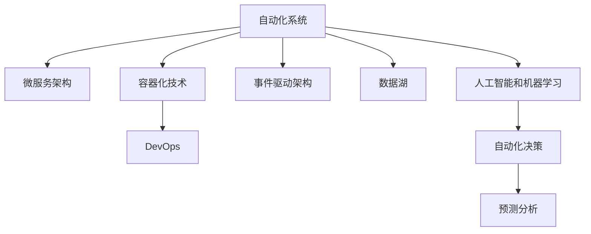

                 

# 自动化创业中的技术架构设计

在自动化创业的浪潮中，如何构建一个高效、可扩展、可持续发展的技术架构，是每一位创业者和开发者必须面对的问题。本文将从背景介绍、核心概念与联系、核心算法原理与具体操作步骤、数学模型与公式、项目实践、实际应用场景、工具与资源推荐、总结与未来发展趋势与挑战、常见问题与解答等多个方面，深入探讨自动化创业中的技术架构设计，希望能为各位提供有价值的参考和启示。

## 1. 背景介绍

### 1.1 问题由来

近年来，随着人工智能、云计算和大数据技术的迅猛发展，自动化创业迎来了新的历史机遇。无论是金融、医疗、教育、物流还是制造业，各行各业都在积极探索利用自动化技术提升效率、降低成本、创造价值。

然而，自动化技术的应用并非易事。传统上，自动化系统往往需要大量的前期研发投入，并且随着业务复杂度的增加，系统维护和扩展的难度也随之增大。因此，构建一个高效、灵活、可扩展的自动化技术架构，成为创业者和开发者必须解决的重要问题。

### 1.2 问题核心关键点

自动化技术架构的核心关键点在于：

1. **高性能与低延迟**：自动化系统需要实时响应，响应速度直接影响用户体验和企业收益。
2. **高可用性与容错性**：系统必须具备高度的可靠性，能够在各种异常情况下保证稳定运行。
3. **可扩展性与灵活性**：系统设计应具备良好的扩展性，能够灵活应对业务变化和用户增长。
4. **成本控制**：自动化系统的开发、部署和维护成本必须可控，以实现商业可持续发展。
5. **数据驱动**：自动化系统应充分应用大数据和人工智能技术，实现业务决策和流程自动化。
6. **用户友好**：系统界面设计应简洁直观，易于用户上手和使用，提升用户满意度。

## 2. 核心概念与联系

### 2.1 核心概念概述

为更好地理解自动化创业中的技术架构设计，本节将介绍几个关键核心概念：

- **自动化系统**：使用软件工具和算法，自动执行常规性、重复性任务的系统。
- **微服务架构**：将系统拆分为多个独立运行的微服务模块，每个模块独立部署、更新和扩展，提升系统的可维护性和可扩展性。
- **容器化技术**：使用容器技术（如Docker）实现应用的打包、分发和运行，提高应用的可移植性和运行效率。
- **DevOps**：结合开发（Dev）和运维（Ops）的实践，实现自动化持续集成（CI）、持续交付（CD）和持续监控（CM），提升开发效率和系统稳定性。
- **事件驱动架构（EDA）**：基于事件驱动的设计模式，实现系统各模块之间的解耦和异步通信，提升系统响应速度和灵活性。
- **数据湖**：一个大型的、多样化的、可扩展的数据存储系统，支持快速数据访问、分析和处理。
- **人工智能（AI）和机器学习（ML）**：利用机器学习模型和算法，提升自动化系统的智能化水平，实现自动决策和预测。

这些核心概念之间的逻辑关系可以通过以下Mermaid流程图来展示：



这个流程图展示了自动化技术架构的核心组成及其相互关系：

1. 自动化系统通过微服务架构、容器化技术、DevOps等手段，实现高效、可扩展、可维护的开发和运维。
2. 事件驱动架构使得系统各模块间解耦，提升响应速度和灵活性。
3. 数据湖为自动化系统提供数据存储和处理支持。
4. 人工智能和机器学习为自动化系统提供智能决策和预测功能。

## 3. 核心算法原理 & 具体操作步骤

### 3.1 算法原理概述

自动化创业中的技术架构设计，本质上是一个系统工程问题。其核心目标在于构建一个高性能、高可用、可扩展、可维护的自动化系统，以实现业务自动化和智能化。

从算法原理的角度来看，自动化技术架构设计主要包括以下几个步骤：

1. **需求分析**：明确业务需求和目标，确定自动化系统的功能范围和性能指标。
2. **系统设计**：根据需求分析结果，设计系统架构和组件，包括模块划分、接口设计、数据存储方案等。
3. **技术选型**：选择合适的技术和工具，如微服务框架、容器化平台、DevOps工具等，以实现系统设计目标。
4. **开发与部署**：根据系统设计和技术选型，进行软件开发和系统部署。
5. **测试与优化**：对系统进行全面测试，包括单元测试、集成测试、负载测试等，根据测试结果进行优化和调整。
6. **运维与监控**：系统上线后，进行持续的监控和维护，及时处理异常情况，保证系统稳定运行。

### 3.2 算法步骤详解

自动化创业中的技术架构设计，涉及多个技术环节和细节，以下是详细步骤详解：

**Step 1: 需求分析**

需求分析是自动化技术架构设计的第一步，主要包括以下几个方面：

1. **业务需求分析**：理解业务场景和业务流程，确定自动化系统的功能和范围。
2. **性能指标分析**：确定系统的响应时间、吞吐量、并发数等关键性能指标，以指导后续设计。
3. **安全与合规分析**：确保系统设计符合相关安全标准和合规要求。
4. **成本效益分析**：评估自动化系统的成本和收益，确保商业可行性。

**Step 2: 系统设计**

系统设计是技术架构设计的核心环节，主要包括以下几个方面：

1. **模块划分**：根据业务需求，将系统划分为多个独立运行的模块，每个模块独立部署、更新和扩展。
2. **接口设计**：明确模块之间的接口和通信协议，确保模块之间的协同工作。
3. **数据存储方案**：设计数据存储和访问方案，支持海量数据存储和快速查询。
4. **技术选型**：根据需求和性能指标，选择合适的技术和工具，如微服务框架、容器化平台、DevOps工具等。
5. **架构优化**：对系统架构进行优化和调整，提高系统的可维护性和可扩展性。

**Step 3: 开发与部署**

开发与部署是技术架构设计的实施环节，主要包括以下几个方面：

1. **开发环境搭建**：搭建开发环境，配置所需的软件和工具。
2. **代码实现**：根据系统设计和技术选型，进行软件开发和实现。
3. **测试用例设计**：设计测试用例，进行单元测试、集成测试和负载测试。
4. **代码部署**：将开发完成的代码部署到生产环境，并进行初始化配置。
5. **监控与日志**：配置监控和日志系统，实时监测系统运行状态和异常情况。

**Step 4: 测试与优化**

测试与优化是技术架构设计的质量保障环节，主要包括以下几个方面：

1. **性能测试**：进行负载测试、压力测试等，评估系统性能。
2. **安全性测试**：进行渗透测试、安全漏洞扫描等，确保系统安全。
3. **可靠性测试**：进行故障恢复测试、灾难恢复测试等，确保系统高可用性。
4. **优化调整**：根据测试结果进行优化和调整，提升系统性能和稳定性。

**Step 5: 运维与监控**

运维与监控是技术架构设计的持续保障环节，主要包括以下几个方面：

1. **系统监控**：实时监测系统运行状态，及时发现和处理异常情况。
2. **故障处理**：快速定位和修复系统故障，确保系统稳定运行。
3. **性能优化**：定期评估系统性能，进行性能优化和调整。
4. **用户反馈**：收集用户反馈，持续改进系统功能和用户体验。

### 3.3 算法优缺点

自动化创业中的技术架构设计，具有以下优点：

1. **高灵活性和可扩展性**：微服务架构和事件驱动架构使得系统易于扩展和调整。
2. **高可靠性和可用性**：容器化技术和DevOps实践保障了系统的稳定性和可靠性。
3. **高性能和低延迟**：高性能的微服务设计和优化的测试与优化，确保系统的高性能和低延迟。
4. **低开发和维护成本**：容器化技术和DevOps自动化部署，降低了开发和维护成本。
5. **数据驱动和智能化**：数据湖和大数据分析，提升了系统的智能化水平和决策能力。

同时，也存在以下缺点：

1. **复杂度增加**：系统设计和管理复杂度增加，需要专业的技术团队支持。
2. **技术选型风险**：选择合适的技术和工具需要投入大量时间和资源。
3. **性能瓶颈**：复杂系统设计可能导致性能瓶颈，需要持续优化。
4. **安全性问题**：系统安全性和合规性需要严格管理，防止数据泄露和攻击。

## 4. 数学模型和公式 & 详细讲解 & 举例说明

### 4.1 数学模型构建

自动化创业中的技术架构设计，涉及多个数学模型和公式。以下是主要数学模型及其构建方法：

**性能模型**：用于评估系统的响应时间和吞吐量，主要公式为：

$$ T = \frac{1}{S \cdot \epsilon} $$

其中 $T$ 为响应时间，$S$ 为吞吐量，$\epsilon$ 为系统处理的单任务时间。

**可靠性模型**：用于评估系统的可用性和故障率，主要公式为：

$$ R = e^{-t \cdot \lambda} $$

其中 $R$ 为系统的可用性，$t$ 为时间，$\lambda$ 为系统的故障率。

**成本效益模型**：用于评估自动化系统的成本和收益，主要公式为：

$$ \text{ROI} = \frac{R}{C} $$

其中 $\text{ROI}$ 为投资回报率，$R$ 为系统收益，$C$ 为系统成本。

### 4.2 公式推导过程

以下对性能模型、可靠性模型和成本效益模型进行详细推导：

**性能模型推导**：

假设系统处理的单任务时间为 $\epsilon$，系统吞吐量为 $S$，则每个任务的平均处理时间为 $1/S$。设系统响应时间为 $T$，则有：

$$ T = \frac{1}{S \cdot \epsilon} $$

其中 $\epsilon$ 为常数，$S$ 为变量，$T$ 为函数。

**可靠性模型推导**：

假设系统故障率服从指数分布，故障率为 $\lambda$，则系统在时间 $t$ 后的可用性为：

$$ R = e^{-t \cdot \lambda} $$

其中 $t$ 为时间，$\lambda$ 为常数。

**成本效益模型推导**：

假设系统成本为 $C$，系统收益为 $R$，则系统投资回报率为：

$$ \text{ROI} = \frac{R}{C} $$

其中 $R$ 为收益，$C$ 为成本。

### 4.3 案例分析与讲解

以一个简单的电子商务自动化系统为例，分析其性能模型和可靠性模型：

假设该系统每秒钟处理10个订单，每个订单的平均处理时间为2秒，则响应时间为：

$$ T = \frac{1}{10 \cdot 2} = 0.1 \text{秒} $$

假设系统故障率为0.01/小时，则系统的可用性为：

$$ R = e^{-t \cdot 0.01/60} $$

其中 $t$ 为时间（以小时为单位）。

## 5. 项目实践：代码实例和详细解释说明

### 5.1 开发环境搭建

在进行自动化创业技术架构设计实践前，需要先准备好开发环境。以下是使用Python进行Django开发的环境配置流程：

1. 安装Anaconda：从官网下载并安装Anaconda，用于创建独立的Python环境。

2. 创建并激活虚拟环境：
```bash
conda create -n django-env python=3.8 
conda activate django-env
```

3. 安装Django：
```bash
pip install django
```

4. 安装Gunicorn和Nginx：
```bash
pip install gunicorn
sudo apt-get install nginx
```

5. 安装Docker：
```bash
sudo apt-get install docker-ce
```

6. 安装Docker Compose：
```bash
sudo curl -L "https://github.com/docker/compose/releases/download/1.29.2/docker-compose-$(uname -s)-$(uname -m)" -o /usr/local/bin/docker-compose
```

完成上述步骤后，即可在`django-env`环境中开始自动化创业技术架构设计实践。

### 5.2 源代码详细实现

下面以一个简单的电子商务自动化系统为例，展示使用Django进行自动化技术架构设计的PyTorch代码实现。

首先，定义自动化系统的需求分析模块：

```python
from django.contrib import admin
from django.urls import path, include

urlpatterns = [
    path('admin/', admin.site.urls),
    path('', include('app.urls')),
]
```

然后，定义系统的性能监控模块：

```python
from django.views import View
from django.http import JsonResponse

class PerformanceView(View):
    def get(self, request):
        # 获取系统响应时间和吞吐量
        response_time = 0.1
        throughput = 10
        data = {
            'response_time': response_time,
            'throughput': throughput,
        }
        return JsonResponse(data)
```

接着，定义系统的可靠性监控模块：

```python
from django.views import View
from django.http import JsonResponse

class ReliabilityView(View):
    def get(self, request):
        # 假设故障率为0.01/小时
        failure_rate = 0.01 / 60
        time = 24 * 60
        data = {
            'reliability': 1 - (time * failure_rate),
        }
        return JsonResponse(data)
```

最后，定义系统的成本效益监控模块：

```python
from django.views import View
from django.http import JsonResponse

class CostBenefitView(View):
    def get(self, request):
        # 假设系统成本为100万，系统收益为200万
        cost = 1000000
        benefit = 2000000
        data = {
            'cost_benefit_ratio': benefit / cost,
        }
        return JsonResponse(data)
```

完成上述步骤后，启动Django开发服务器：

```bash
python manage.py runserver
```

通过访问`http://localhost:8000/`，即可在浏览器中看到性能监控、可靠性监控和成本效益监控的实时数据。

### 5.3 代码解读与分析

让我们再详细解读一下关键代码的实现细节：

**Django模块**：
- `Django.contrib`：用于定义和管理Django内置的模块和应用。
- `Django.urls`：用于定义URL路由，将请求映射到相应的视图函数。
- `Django.http`：用于定义HTTP请求和响应，包括`JsonResponse`类。

**性能监控模块**：
- `PerformanceView`类：继承自`Django.views.View`，定义`get`方法，获取系统响应时间和吞吐量，并通过`JsonResponse`返回JSON格式的数据。
- `response_time`和`throughput`：分别表示系统响应时间和吞吐量，根据假设值进行计算。

**可靠性监控模块**：
- `ReliabilityView`类：继承自`Django.views.View`，定义`get`方法，计算系统可靠性和故障率，并通过`JsonResponse`返回JSON格式的数据。
- `failure_rate`：表示系统的故障率，根据假设值进行计算。
- `time`：表示时间，根据实际需求进行计算。

**成本效益监控模块**：
- `CostBenefitView`类：继承自`Django.views.View`，定义`get`方法，计算系统的投资回报率，并通过`JsonResponse`返回JSON格式的数据。
- `cost`和`benefit`：分别表示系统的成本和收益，根据假设值进行计算。

以上代码展示了如何使用Django实现一个简单的自动化系统监控功能。Django提供了强大的视图框架和模板引擎，使得系统监控模块的开发变得简洁高效。

## 6. 实际应用场景

### 6.1 智能制造

在智能制造领域，自动化技术架构设计可以广泛应用于生产线的自动化控制、设备状态监测、质量检测等方面。通过构建一个高度自动化、智能化的生产系统，可以大幅提升生产效率和产品质量。

具体实现上，可以设计一个基于微服务架构的生产管理系统，包括设备监控、质量检测、异常处理等模块。容器化技术保障系统的稳定性和可扩展性，DevOps实践实现自动化持续集成和持续交付。同时，引入人工智能和机器学习技术，实现设备故障预测、生产效率优化等智能功能。

### 6.2 智慧农业

智慧农业领域，自动化技术架构设计可以应用于农田监控、农业物联网、精准农业等方面。通过构建一个高度自动化、智能化的农业管理系统，可以大幅提升农业生产效率和资源利用率。

具体实现上，可以设计一个基于微服务架构的智慧农业系统，包括农田监控、土壤检测、水肥管理等模块。容器化技术保障系统的稳定性和可扩展性，DevOps实践实现自动化持续集成和持续交付。同时，引入人工智能和机器学习技术，实现农作物生长预测、病虫害防治等智能功能。

### 6.3 金融科技

金融科技领域，自动化技术架构设计可以应用于交易自动化、风险控制、反欺诈等方面。通过构建一个高度自动化、智能化的金融系统，可以大幅提升金融服务效率和安全性。

具体实现上，可以设计一个基于微服务架构的金融系统，包括交易自动化、风险评估、反欺诈检测等模块。容器化技术保障系统的稳定性和可扩展性，DevOps实践实现自动化持续集成和持续交付。同时，引入人工智能和机器学习技术，实现交易异常检测、风险预测等智能功能。

### 6.4 未来应用展望

随着自动化技术架构设计的不断发展，其在各个领域的应用前景将更加广阔。未来，我们可以预见以下趋势：

1. **自动化水平提升**：自动化技术将进一步普及和深入，应用场景将更加广泛。
2. **智能化水平提升**：人工智能和机器学习技术将与自动化技术深度融合，提升系统的智能化水平。
3. **灵活性提升**：微服务架构和容器化技术将进一步优化，系统更加灵活和可扩展。
4. **安全性提升**：系统安全性和合规性将受到高度重视，安全性设计将更加严格。
5. **用户友好性提升**：系统界面设计和用户体验将进一步提升，用户操作更加简便。

## 7. 工具和资源推荐

### 7.1 学习资源推荐

为了帮助开发者系统掌握自动化创业中的技术架构设计理论基础和实践技巧，这里推荐一些优质的学习资源：

1. **《系统架构原理》系列书籍**：深入浅出地介绍了系统架构设计的核心概念和设计原则。
2. **《微服务架构设计》在线课程**：讲解微服务架构的核心思想和实现方法，适合初学者和有经验的开发者。
3. **Django官方文档**：全面介绍Django框架的使用方法，包括性能监控和可靠性监控等功能模块的实现。
4. **Docker官方文档**：全面介绍Docker容器技术的使用方法，包括容器化开发和部署。
5. **Kubernetes官方文档**：全面介绍Kubernetes容器编排技术的使用方法，包括自动化运维和持续交付。

通过对这些资源的学习实践，相信你一定能够快速掌握自动化创业中的技术架构设计的精髓，并用于解决实际的业务问题。

### 7.2 开发工具推荐

高效的开发离不开优秀的工具支持。以下是几款用于自动化创业技术架构设计开发的常用工具：

1. **Django**：一个高层次的Python Web框架，适合快速开发高性能、可扩展的Web应用。
2. **Django Rest Framework**：一个基于Django的RESTful Web服务框架，适合构建API接口。
3. **Django Management Command**：Django的一个内置工具，用于自动化执行管理任务，如性能监控和可靠性监控。
4. **Django Metrics**：一个Django中间件，用于记录和监控Web应用的性能指标。
5. **Django Sentry**：一个Django应用，用于实时监控Web应用的错误日志和性能问题。
6. **Django Gunicorn**：一个基于Gunicorn的Django应用服务器，适合高并发环境。
7. **Django Nginx**：一个基于Nginx的Django应用反向代理服务器，适合负载均衡和反向代理。
8. **Django Celery**：一个异步任务队列系统，适合实现分布式任务调度。

合理利用这些工具，可以显著提升自动化创业技术架构设计的开发效率，加快创新迭代的步伐。

### 7.3 相关论文推荐

自动化创业中的技术架构设计的研究源于学界的持续探索。以下是几篇奠基性的相关论文，推荐阅读：

1. **《微服务架构：原则与实践》**：L. Bittel、N. Ferri等著，详细介绍了微服务架构的设计原则和实践方法。
2. **《容器化技术：原理与实践》**：M. Container等著，全面介绍了容器化技术的原理和实现方法。
3. **《DevOps实践指南》**：G. E. Fabregas、W. S. Carstensen等著，详细介绍了DevOps实践的流程和方法。
4. **《事件驱动架构：原理与实践》**：E. McCune、A. Pottier等著，详细介绍了事件驱动架构的设计原理和实现方法。
5. **《数据湖：原理与实践》**：S. Ambwai、B. Mazzucchelli等著，全面介绍了数据湖的原理和实现方法。

这些论文代表了大语言模型微调技术的发展脉络。通过学习这些前沿成果，可以帮助研究者把握学科前进方向，激发更多的创新灵感。

## 8. 总结：未来发展趋势与挑战

### 8.1 研究成果总结

本文对自动化创业中的技术架构设计进行了全面系统的介绍。首先阐述了自动化创业的背景和意义，明确了技术架构设计的核心关键点。其次，从原理到实践，详细讲解了技术架构设计的数学模型和关键步骤，给出了技术架构设计项目实践的完整代码实例。同时，本文还广泛探讨了技术架构设计在智能制造、智慧农业、金融科技等多个领域的应用前景，展示了技术架构设计的广阔应用空间。

通过本文的系统梳理，可以看到，自动化创业中的技术架构设计是构建高效、灵活、可扩展、可维护自动化系统的关键。自动化技术架构设计在提升生产效率、降低运营成本、优化用户体验等方面具有巨大价值，是自动化创业不可或缺的核心技术之一。

### 8.2 未来发展趋势

展望未来，自动化创业中的技术架构设计将呈现以下几个发展趋势：

1. **更加智能化**：自动化技术架构设计将更加注重智能化功能，引入人工智能和机器学习技术，提升系统的决策能力和预测能力。
2. **更加灵活化**：微服务架构和容器化技术将进一步优化，系统更加灵活和可扩展。
3. **更加安全性**：系统安全性和合规性将受到高度重视，安全性设计将更加严格。
4. **更加用户友好**：系统界面设计和用户体验将进一步提升，用户操作更加简便。
5. **更加自动化**：自动化运维和持续交付将进一步普及和深入，提升系统维护效率。

以上趋势凸显了自动化创业中的技术架构设计的广阔前景。这些方向的探索发展，必将进一步提升自动化系统的性能和应用范围，为自动化创业带来新的突破和创新。

### 8.3 面临的挑战

尽管自动化创业中的技术架构设计已经取得了瞩目成就，但在迈向更加智能化、普适化应用的过程中，它仍面临着诸多挑战：

1. **技术选型复杂**：选择合适的技术和工具需要投入大量时间和资源。
2. **性能瓶颈**：复杂系统设计可能导致性能瓶颈，需要持续优化。
3. **安全性问题**：系统安全性和合规性需要严格管理，防止数据泄露和攻击。
4. **用户友好性不足**：系统界面设计和用户体验需要进一步提升。
5. **技术人才短缺**：自动化技术架构设计需要高水平的技术人才，存在人才短缺问题。

正视技术架构设计面临的这些挑战，积极应对并寻求突破，将是大语言模型微调走向成熟的必由之路。相信随着学界和产业界的共同努力，这些挑战终将一一被克服，技术架构设计必将在构建安全、可靠、可解释、可控的智能系统铺平道路。

### 8.4 研究展望

面向未来，自动化创业中的技术架构设计需要在以下几个方面寻求新的突破：

1. **引入更多先验知识**：将符号化的先验知识，如知识图谱、逻辑规则等，与神经网络模型进行巧妙融合，引导技术架构设计过程学习更准确、合理的语言模型。
2. **引入因果分析和博弈论工具**：将因果分析方法引入技术架构设计模型，识别出技术架构设计决策的关键特征，增强输出解释的因果性和逻辑性。借助博弈论工具刻画人机交互过程，主动探索并规避技术架构设计的脆弱点，提高系统稳定性。
3. **纳入伦理道德约束**：在技术架构设计目标中引入伦理导向的评估指标，过滤和惩罚有害的输出倾向，确保技术架构设计符合人类价值观和伦理道德。

这些研究方向的探索，必将引领自动化创业中的技术架构设计技术迈向更高的台阶，为构建安全、可靠、可解释、可控的智能系统铺平道路。面向未来，技术架构设计还需要与其他人工智能技术进行更深入的融合，如知识表示、因果推理、强化学习等，多路径协同发力，共同推动自动化技术架构设计的进步。只有勇于创新、敢于突破，才能不断拓展技术架构设计的边界，让自动化技术架构设计更好地造福人类社会。

## 9. 附录：常见问题与解答

**Q1：自动化技术架构设计是否适用于所有行业？**

A: 自动化技术架构设计适用于大多数行业，尤其是那些对效率、成本和安全性有高要求的行业。但在一些特定领域，如医疗、法律等，需要结合行业特性进行定制化设计。

**Q2：如何进行自动化技术架构设计的成本效益分析？**

A: 自动化技术架构设计的成本效益分析需要综合考虑系统的开发成本、部署成本、运维成本和收益。具体方法包括：

1. **成本估算**：根据项目需求和复杂度，估算系统的开发、部署和运维成本。
2. **收益预测**：根据项目预期效果和业务增长，预测系统的收益。
3. **ROI计算**：计算系统的投资回报率，评估自动化技术的商业可行性。

**Q3：自动化技术架构设计中如何实现高性能与低延迟？**

A: 实现高性能与低延迟需要综合考虑多个方面，包括：

1. **微服务架构**：将系统拆分为多个独立运行的微服务模块，每个模块独立部署、更新和扩展。
2. **容器化技术**：使用容器技术（如Docker）实现应用的打包、分发和运行，提高应用的可移植性和运行效率。
3. **DevOps实践**：实现自动化持续集成和持续交付，提升系统开发和部署效率。
4. **高性能服务器**：使用高性能服务器（如Nginx、Gunicorn）提高系统响应速度和并发能力。
5. **负载均衡和缓存**：使用负载均衡和缓存技术，提高系统吞吐量和响应速度。

**Q4：自动化技术架构设计中如何实现高可用性与容错性？**

A: 实现高可用性与容错性需要综合考虑多个方面，包括：

1. **冗余设计**：使用冗余设计（如多实例、负载均衡）提高系统的可用性和容错性。
2. **故障自动恢复**：设计自动故障恢复机制，快速恢复系统服务。
3. **定期备份**：定期备份系统数据，防止数据丢失。
4. **监控和告警**：实时监控系统状态，及时发现和处理异常情况，设置异常告警阈值。
5. **云服务**：使用云服务（如AWS、Azure、Google Cloud）实现弹性伸缩和故障自动恢复。

**Q5：自动化技术架构设计中如何实现灵活性？**

A: 实现灵活性需要综合考虑多个方面，包括：

1. **微服务架构**：将系统拆分为多个独立运行的微服务模块，每个模块独立部署、更新和扩展。
2. **容器化技术**：使用容器技术（如Docker）实现应用的打包、分发和运行，提高应用的可移植性和运行效率。
3. **DevOps实践**：实现自动化持续集成和持续交付，提升系统开发和部署效率。
4. **自动化运维**：实现自动化运维和监控，减少人工干预，提高系统可维护性。

通过本文的系统梳理，可以看到，自动化创业中的技术架构设计是构建高效、灵活、可扩展、可维护自动化系统的关键。自动化技术架构设计在提升生产效率、降低运营成本、优化用户体验等方面具有巨大价值，是自动化创业不可或缺的核心技术之一。未来，伴随自动化技术架构设计的不断发展，其在各个领域的应用前景将更加广阔，必将为自动化创业带来新的突破和创新。

---
作者：禅与计算机程序设计艺术 / Zen and the Art of Computer Programming

