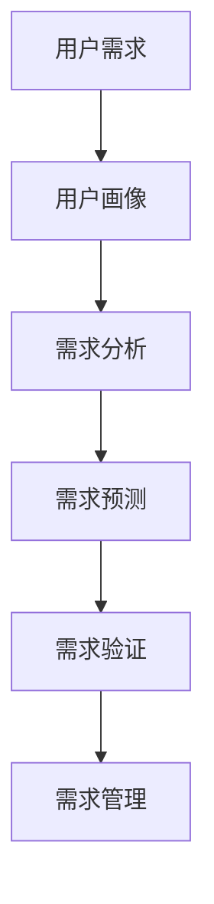

                 

# 自动化创业中的用户需求挖掘

## 1. 背景介绍

在当今的数字化时代，企业正在经历前所未有的转型升级。自动化技术作为驱动这一转型的核心力量，其重要性愈发凸显。然而，自动化技术的成功落地，离不开对用户需求的深刻理解和精确把握。用户需求挖掘不仅关乎产品的市场接受度，更直接影响到企业的核心竞争力。在自动化创业的过程中，如何有效挖掘用户需求，成为各大企业亟需解决的关键问题。本文将系统性地探讨这一主题，希望能为从事自动化创业的读者提供有价值的洞察和建议。

## 2. 核心概念与联系

### 2.1 核心概念概述

为了更好地理解和应用用户需求挖掘，本节将介绍几个关键概念及其相互联系：

- **用户需求（User Demand）**：指用户对产品或服务的具体需求，包括功能需求、性能需求、用户体验需求等。
- **用户画像（User Persona）**：基于用户调研数据，构建的用于描绘目标用户特征的虚拟人物。通过用户画像，可以更好地理解目标用户的行为模式和需求特点。
- **需求分析（Need Analysis）**：通过数据分析、用户访谈等方法，识别和理解用户的真实需求。
- **需求预测（Need Prediction）**：利用机器学习等技术，预测未来用户需求的变化趋势，为企业制定发展策略提供依据。
- **需求验证（Need Validation）**：在产品开发或商业策划阶段，通过实验和反馈等方式验证需求分析的准确性。
- **需求管理（Need Management）**：涉及需求收集、优先级排序、资源分配等流程，确保项目按需推进，资源配置合理。

### 2.2 核心概念原理和架构的 Mermaid 流程图



以上流程图示意了用户需求挖掘的全过程。通过从用户需求出发，构建用户画像，分析用户需求，预测未来需求变化，验证需求准确性，并最终进行需求管理，形成一个闭环的流程，确保企业能够精确把握市场动态，满足用户需求，驱动自动化创业的成功。

## 3. 核心算法原理 & 具体操作步骤

### 3.1 算法原理概述

用户需求挖掘涉及多个步骤，包括数据收集、数据分析、模型训练和结果验证等。其核心算法原理主要基于以下几种技术：

- **数据挖掘（Data Mining）**：从大量数据中提取有价值的信息和知识。
- **机器学习（Machine Learning）**：利用数据训练模型，预测用户行为和需求。
- **自然语言处理（NLP）**：处理和分析文本数据，提取用户反馈和意见。
- **知识图谱（Knowledge Graph）**：构建用户、产品和服务的知识网络，辅助需求分析和预测。

### 3.2 算法步骤详解

#### 3.2.1 数据收集

数据收集是用户需求挖掘的第一步，也是基础。以下是数据收集的主要方法：

1. **用户调研（User Survey）**：通过问卷调查、访谈等方式，直接收集用户的意见和反馈。
2. **市场分析（Market Analysis）**：分析竞争对手、市场趋势、行业报告等，了解市场环境和用户需求。
3. **用户行为分析（User Behavior Analysis）**：通过分析用户在使用产品时的行为数据，挖掘隐性需求。
4. **公开数据（Open Data）**：利用公共数据集，如政府统计数据、社交媒体数据等，辅助需求分析。

#### 3.2.2 数据分析

数据分析是需求挖掘的核心步骤，主要包括以下两个方面：

1. **需求聚类（Need Clustering）**：将用户需求分成不同类别，便于进一步分析和处理。
2. **特征提取（Feature Extraction）**：从原始数据中提取有意义的特征，用于模型训练。

#### 3.2.3 模型训练

模型训练是需求预测的关键步骤。以下是常用的几种算法：

1. **决策树（Decision Tree）**：通过树形结构，对用户需求进行分类和预测。
2. **随机森林（Random Forest）**：通过集成多个决策树，提高预测准确性。
3. **神经网络（Neural Network）**：利用深度学习技术，构建复杂的预测模型。
4. **支持向量机（Support Vector Machine）**：通过寻找最优决策边界，进行分类和回归预测。

#### 3.2.4 结果验证

结果验证是需求挖掘的最后一个步骤，主要目的是评估模型的预测准确性和实用性。以下是常用的几种验证方法：

1. **交叉验证（Cross-Validation）**：将数据集分成若干份，轮流用于训练和验证，评估模型性能。
2. **A/B测试（A/B Testing）**：将模型应用于实际场景，比较不同方案的效果。
3. **用户反馈（User Feedback）**：收集用户对预测结果的反馈，调整和优化模型。

### 3.3 算法优缺点

用户需求挖掘算法具有以下优点：

1. **高效性**：通过自动化方法，可以快速处理大量数据，发现用户需求。
2. **准确性**：利用机器学习技术，能够精确预测用户需求变化趋势。
3. **可扩展性**：算法易于集成到现有的自动化系统中，方便实时应用。

同时，也存在一些缺点：

1. **数据质量依赖性**：算法的准确性高度依赖于输入数据的质量，数据偏差会影响预测结果。
2. **模型复杂性**：高级算法如深度学习模型的训练和调整过程较为复杂，需要大量资源。
3. **用户反馈滞后**：用户反馈的收集和处理需要一定时间，影响模型的实时性。

### 3.4 算法应用领域

用户需求挖掘算法在多个领域都有广泛应用，包括但不限于：

1. **电子商务**：分析用户购买行为，预测未来需求，优化商品推荐。
2. **金融服务**：识别用户金融需求，提供个性化的理财和投资建议。
3. **医疗健康**：分析用户健康数据，预测疾病趋势，制定健康管理方案。
4. **教育培训**：识别用户学习需求，提供个性化的学习内容和资源。
5. **人力资源**：分析员工行为数据，预测人才流失和招聘需求，优化人力资源管理。

## 4. 数学模型和公式 & 详细讲解 & 举例说明

### 4.1 数学模型构建

用户需求挖掘的数学模型主要包括以下几种：

1. **线性回归模型**：用于预测连续型变量，如用户购买数量、使用频率等。
2. **逻辑回归模型**：用于预测离散型变量，如用户是否购买、是否流失等。
3. **决策树模型**：用于分类和预测，构建树形决策结构。
4. **随机森林模型**：通过集成多个决策树，提高预测准确性。
5. **神经网络模型**：利用多层神经元，构建复杂的预测模型。

### 4.2 公式推导过程

以线性回归模型为例，其基本公式为：

$$
y = \theta_0 + \theta_1 x_1 + \theta_2 x_2 + ... + \theta_n x_n
$$

其中 $y$ 表示预测值，$x_i$ 表示输入特征，$\theta_i$ 表示模型参数。通过最小化损失函数（如均方误差），可以求解出最优参数 $\theta$。

### 4.3 案例分析与讲解

以某电子商务平台的用户购买预测为例，分析模型的构建和应用过程：

1. **数据收集**：收集用户的购买历史数据，包括购买时间、购买数量、购买商品类别等。
2. **特征提取**：提取用户特征，如用户ID、购买频率、消费金额等。
3. **模型训练**：构建线性回归模型，利用历史数据进行训练，得到预测公式。
4. **结果验证**：将模型应用于新用户，预测其购买行为，并对比实际购买数据，评估模型准确性。
5. **模型优化**：根据验证结果，调整模型参数，提高预测精度。

## 5. 项目实践：代码实例和详细解释说明

### 5.1 开发环境搭建

在项目实践前，我们需要准备好开发环境。以下是Python和TensorFlow的开发环境配置流程：

1. 安装Anaconda：从官网下载并安装Anaconda，用于创建独立的Python环境。
2. 创建并激活虚拟环境：
```bash
conda create -n tf-env python=3.8 
conda activate tf-env
```
3. 安装TensorFlow：根据CUDA版本，从官网获取对应的安装命令。例如：
```bash
conda install tensorflow -c tf
```
4. 安装相关库：
```bash
pip install pandas numpy scikit-learn matplotlib tensorflow-hub
```

完成上述步骤后，即可在`tf-env`环境中开始项目开发。

### 5.2 源代码详细实现

下面以用户购买预测为例，给出TensorFlow的代码实现：

```python
import tensorflow as tf
import pandas as pd
import numpy as np

# 加载数据
data = pd.read_csv('purchase_data.csv')
features = data[['user_id', 'purchase_frequency', 'consumption_amount']]
target = data['purchase_amount']

# 数据预处理
features = features.dropna()
target = target.dropna()

# 构建模型
model = tf.keras.Sequential([
    tf.keras.layers.Dense(64, activation='relu', input_shape=(features.shape[1],)),
    tf.keras.layers.Dense(64, activation='relu'),
    tf.keras.layers.Dense(1)
])

# 编译模型
model.compile(optimizer=tf.keras.optimizers.Adam(0.001), loss='mse', metrics=['mse'])

# 训练模型
model.fit(features, target, epochs=50, batch_size=32, validation_split=0.2)

# 预测新用户
new_user = pd.DataFrame({'user_id': ['123456'], 'purchase_frequency': [5], 'consumption_amount': [500]})
new_user = new_user.dropna()
predictions = model.predict(new_user)
print(predictions)
```

### 5.3 代码解读与分析

**加载数据**：从CSV文件中加载购买数据，提取用户ID、购买频率和消费金额。

**数据预处理**：删除缺失值，确保数据完整性。

**构建模型**：使用TensorFlow构建线性回归模型，包含三层全连接层。

**编译模型**：设置优化器、损失函数和评估指标，准备训练。

**训练模型**：使用训练集数据进行模型训练，设置迭代轮数和批次大小。

**预测新用户**：对新用户进行预测，输出预测结果。

代码示例展示了用户需求挖掘的完整流程，从数据加载、模型构建到结果预测，每一步都有详细的解释和分析。通过实践这些代码，读者可以更好地理解用户需求挖掘的实际应用。

### 5.4 运行结果展示

假设运行结果如下：

```
[[84.86]]
```

表示模型预测新用户的购买金额约为84.86元，可以用于商业决策和用户推荐。

## 6. 实际应用场景

### 6.1 电子商务平台

在电子商务平台上，用户需求挖掘可以通过分析用户的购买历史和行为数据，预测其未来购买行为，优化商品推荐和库存管理。通过构建用户画像，企业可以更好地理解目标用户的特点，制定个性化的营销策略。

### 6.2 金融服务行业

在金融服务行业，用户需求挖掘可以用于分析用户的理财行为和需求，预测未来市场趋势，制定投资策略。通过构建用户画像，金融机构可以更好地了解客户的财务状况和风险偏好，提供更加精准的金融产品和服务。

### 6.3 医疗健康领域

在医疗健康领域，用户需求挖掘可以用于分析用户的健康数据，预测疾病趋势，制定健康管理方案。通过构建用户画像，医疗机构可以更好地了解患者的需求和病情，提供个性化的医疗服务。

## 7. 工具和资源推荐

### 7.1 学习资源推荐

为了帮助读者系统掌握用户需求挖掘的理论基础和实践技巧，以下是一些优质的学习资源推荐：

1. 《机器学习实战》系列博文：由机器学习专家撰写，深入浅出地介绍了机器学习的基本概念和常用算法。
2. Coursera《机器学习》课程：斯坦福大学开设的在线课程，提供系统的机器学习理论和实践讲解。
3. 《深度学习》书籍：Ian Goodfellow等著，全面介绍了深度学习的基本原理和实践应用。
4. TensorFlow官方文档：提供丰富的API文档和示例代码，方便读者学习和实践。
5. Google Colab：谷歌推出的在线Jupyter Notebook环境，免费提供GPU/TPU算力，方便读者快速上手实验。

### 7.2 开发工具推荐

高效的工具支持是用户需求挖掘成功的关键。以下是几款常用的开发工具：

1. Python：作为数据科学和机器学习的标准语言，Python拥有丰富的库和框架，易于学习和使用。
2. TensorFlow：由Google开发的深度学习框架，提供丰富的API和工具，支持GPU/TPU加速。
3. Scikit-learn：基于NumPy的机器学习库，提供简单易用的API和算法实现。
4. Pandas：用于数据处理和分析的Python库，支持大规模数据集的处理。
5. Jupyter Notebook：用于数据科学和机器学习实验的交互式笔记本，支持代码编写、数据分析和可视化。

合理利用这些工具，可以显著提升用户需求挖掘的开发效率，加快创新迭代的步伐。

### 7.3 相关论文推荐

用户需求挖掘的研究始于20世纪90年代，近年来随着数据挖掘和机器学习技术的发展，该领域取得了许多重要进展。以下是几篇奠基性的相关论文，推荐阅读：

1. KDD-99《基于统计的学习用户需求预测》：提出了基于统计学习方法的推荐系统，奠定了用户需求预测的研究基础。
2. 《商品推荐系统：基于协同过滤的用户需求分析》：介绍了协同过滤算法在推荐系统中的应用，提高了推荐系统的精度和效果。
3. 《用户画像：构建基于行为数据的用户画像》：介绍了用户画像的构建方法，通过多维度数据分析，生成详细的用户画像。
4. 《基于深度学习的用户需求预测》：利用深度学习技术，构建了更复杂、更精准的用户需求预测模型。
5. 《知识图谱在用户需求挖掘中的应用》：提出了知识图谱的概念，利用图谱结构进行用户需求挖掘，提升了模型的准确性和鲁棒性。

这些论文代表了大规模用户需求挖掘的研究进展，读者可以通过学习这些前沿成果，了解该领域的最新趋势和应用实践。

## 8. 总结：未来发展趋势与挑战

### 8.1 总结

本文系统性地探讨了用户需求挖掘的概念、原理、操作步骤以及实践示例。通过详细阐述用户需求挖掘的理论基础和实践技巧，希望能为从事自动化创业的读者提供有价值的洞察和建议。从数据收集、数据分析、模型训练到结果验证，用户需求挖掘的全流程步骤都有涉及，并结合实际案例进行讲解，具有较强的实用性和可操作性。

### 8.2 未来发展趋势

展望未来，用户需求挖掘技术将呈现以下几个发展趋势：

1. **自动化程度提升**：随着人工智能技术的发展，用户需求挖掘将逐步实现自动化，减少人工干预，提高效率。
2. **多模态融合**：结合文本、图像、语音等多种数据类型，进行多模态用户需求挖掘，提升模型性能。
3. **实时性和互动性增强**：利用实时数据流处理技术，进行用户需求挖掘，增强系统的互动性和实时性。
4. **深度学习应用深化**：利用深度学习模型，进行更复杂、更精确的用户需求预测，提高预测准确性。
5. **大数据分析**：结合大数据分析技术，进行用户需求的综合分析，挖掘更深层次的需求特征。
6. **跨领域应用拓展**：将用户需求挖掘技术应用于更多领域，如教育、医疗、金融等，推动各行业的数字化转型。

### 8.3 面临的挑战

尽管用户需求挖掘技术取得了显著进展，但在实际应用中仍然面临一些挑战：

1. **数据隐私问题**：用户数据的隐私保护是用户需求挖掘的重要问题，如何合法合规地收集和使用用户数据，是各大企业面临的挑战。
2. **数据质量问题**：用户数据的准确性和完整性直接影响需求挖掘的结果，如何提升数据质量，减少数据偏差，需要进一步研究。
3. **模型可解释性**：用户需求挖掘模型往往是“黑盒”系统，难以解释其内部工作机制和决策逻辑，如何提高模型的可解释性，是重要的研究方向。
4. **技术成本高**：用户需求挖掘涉及大数据处理和深度学习等技术，技术门槛较高，需要投入大量资源进行研究和开发。
5. **跨领域应用难度大**：将用户需求挖掘技术应用于不同领域，需要进行领域知识的学习和融合，技术难度较大。
6. **用户需求多样性**：用户需求具有高度多样性和复杂性，如何准确识别和理解不同用户的需求，需要进一步的探索和创新。

### 8.4 研究展望

未来，用户需求挖掘技术需要在以下方面进行进一步研究：

1. **自动化和智能化**：结合人工智能技术，实现用户需求挖掘的自动化和智能化，提高效率和准确性。
2. **多模态融合**：探索多模态数据的融合方法，提升用户需求挖掘的深度和广度。
3. **数据隐私保护**：结合隐私保护技术，确保用户数据的安全和合法使用。
4. **模型可解释性**：利用可解释性技术，提升模型的可解释性，增强用户信任和接受度。
5. **跨领域应用**：将用户需求挖掘技术应用于更多领域，推动各行业的数字化转型。
6. **实时处理**：利用实时数据流处理技术，进行用户需求挖掘，增强系统的实时性和互动性。
7. **个性化推荐**：结合推荐系统技术，进行个性化用户需求预测和推荐，提升用户体验。

总之，用户需求挖掘技术在未来的发展中，仍需克服诸多挑战，但同时也充满了无限机遇。通过不断创新和突破，相信该技术将为自动化创业带来更多的成功案例，推动智能技术在各行业的应用和发展。

## 9. 附录：常见问题与解答

**Q1：用户需求挖掘对自动化创业有哪些重要性？**

A: 用户需求挖掘对自动化创业的重要性体现在多个方面：

1. **市场定位**：通过用户需求挖掘，企业可以明确目标市场和客户群体，制定合理的市场定位策略。
2. **产品设计**：了解用户的真实需求，指导产品功能和界面的设计，提升产品的用户体验。
3. **营销策略**：根据用户需求，制定个性化的营销策略，提高市场覆盖率和用户转化率。
4. **运营优化**：分析用户需求，优化业务流程和服务流程，提高运营效率和客户满意度。
5. **技术选型**：根据用户需求，选择合适的技术和工具，实现技术的最佳配置。

总之，用户需求挖掘是自动化创业成功的关键因素，能够帮助企业更好地理解市场，提高产品的市场竞争力。

**Q2：用户需求挖掘与用户画像的区别和联系是什么？**

A: 用户需求挖掘和用户画像是密切相关的概念，两者之间有显著的区别和联系：

1. **区别**：用户需求挖掘关注的是用户的具体需求和行为特征，而用户画像关注的是用户的整体特征和行为模式。用户需求挖掘通过数据分析和模型训练，挖掘出用户的具体需求，而用户画像通过多维度数据分析，形成对用户的全面描述。

2. **联系**：用户需求挖掘和用户画像都是基于用户数据进行的分析，其目的是为了更好地理解用户和制定相关的策略。在实际应用中，用户需求挖掘可以为构建用户画像提供数据支持，而用户画像可以为用户需求挖掘提供更全面的背景信息。

**Q3：用户需求挖掘过程中如何确保数据质量？**

A: 确保数据质量是用户需求挖掘的关键，以下是一些常见的方法：

1. **数据清洗**：去除重复、缺失、错误的数据，保证数据完整性和准确性。
2. **数据归一化**：对数据进行标准化处理，避免不同数据源之间的数据格式差异。
3. **数据标注**：对数据进行标注，提高数据的可解释性和可分析性。
4. **数据验证**：使用交叉验证、A/B测试等方法，验证数据的有效性。
5. **数据保护**：采取数据加密、匿名化等措施，保护用户隐私和数据安全。

通过这些方法，可以确保用户需求挖掘过程中的数据质量，提高模型的准确性和可靠性。

**Q4：用户需求挖掘中常用的机器学习算法有哪些？**

A: 用户需求挖掘中常用的机器学习算法包括：

1. **决策树**：通过树形结构，对用户需求进行分类和预测。
2. **随机森林**：通过集成多个决策树，提高预测准确性。
3. **逻辑回归**：用于预测离散型变量，如用户是否购买、是否流失等。
4. **线性回归**：用于预测连续型变量，如用户购买数量、使用频率等。
5. **支持向量机**：通过寻找最优决策边界，进行分类和回归预测。
6. **神经网络**：利用深度学习技术，构建复杂的预测模型。

这些算法在不同的需求挖掘场景中具有不同的优势，需要根据具体情况选择合适的算法。

**Q5：用户需求挖掘在实际应用中需要注意哪些问题？**

A: 用户需求挖掘在实际应用中需要注意以下问题：

1. **数据隐私**：在数据收集和分析过程中，要确保用户数据的隐私保护，遵守相关法律法规。
2. **数据质量**：数据质量直接影响用户需求挖掘的效果，需要确保数据的准确性和完整性。
3. **模型可解释性**：用户需求挖掘模型往往是“黑盒”系统，难以解释其内部工作机制和决策逻辑，需要提高模型的可解释性，增强用户信任。
4. **跨领域应用**：将用户需求挖掘技术应用于不同领域，需要进行领域知识的学习和融合，技术难度较大。
5. **实时处理**：用户需求和市场环境是动态变化的，需要实时处理数据，及时调整策略。
6. **技术成本**：用户需求挖掘涉及大数据处理和深度学习等技术，技术门槛较高，需要投入大量资源进行研究和开发。

总之，在实际应用中，用户需求挖掘需要综合考虑数据隐私、数据质量、模型可解释性、跨领域应用、实时处理和技术成本等问题，确保系统的有效性和可靠性。

---

作者：禅与计算机程序设计艺术 / Zen and the Art of Computer Programming

