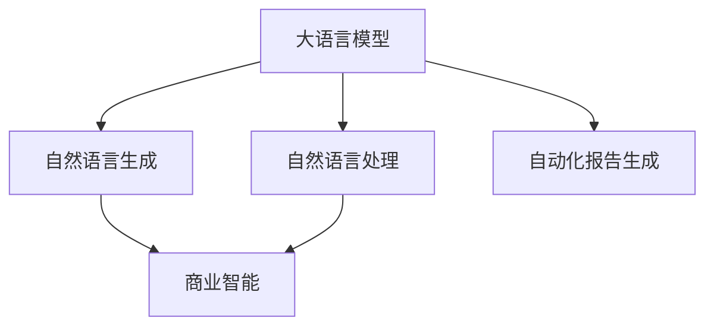

                 

# 自动化报告生成：LLM在商业智能中的应用

> 关键词：自动化报告,商业智能,自然语言生成,大语言模型,自然语言处理,LLM

## 1. 背景介绍

### 1.1 问题由来
随着大数据时代的到来，企业的运营数据量呈指数级增长。如何高效地利用这些海量数据，产生有价值的商业洞见，成为每个企业关注的重点。商业智能(Business Intelligence, BI)应运而生，通过数据分析、数据挖掘、数据可视化等手段，帮助企业发现数据中的潜在规律和趋势，指导决策。

然而，传统的商业智能系统需要专业数据工程师进行数据抽取、清洗、建模等复杂工作，业务人员需要掌握复杂的BI工具才能进行数据查询、报表生成等操作。这不仅大大增加了企业的人力成本，也限制了BI系统的普及度和用户友好度。

在人工智能的推动下，大语言模型(Large Language Model, LLM)应用于商业智能，使得自动化报告生成成为可能。利用LLM的自然语言生成能力，企业能够快速生成有针对性的报告，助力决策过程。

### 1.2 问题核心关键点
自动化报告生成的核心在于如何利用大语言模型，将复杂的分析结果转化为易于理解的自然语言文本。具体而言，包含以下几个关键点：

- **数据提取**：从原始数据中提取出需要分析的字段和指标。
- **数据分析**：对提取出的数据进行统计、建模、预测等操作。
- **自然语言生成**：将分析结果转化为自然语言，生成报告文本。
- **报告定制化**：根据不同的报告模板和用户需求，调整报告格式和内容。

## 2. 核心概念与联系

### 2.1 核心概念概述

为更好地理解LLM在商业智能中的应用，本节将介绍几个密切相关的核心概念：

- **大语言模型(LLM)**：以自回归(如GPT)或自编码(如BERT)模型为代表的大规模预训练语言模型。通过在大规模无标签文本语料上进行预训练，学习通用的语言表示，具备强大的语言理解和生成能力。

- **自然语言生成(Natural Language Generation, NLG)**：指利用人工智能技术，将结构化数据转化为自然语言文本的过程。常见应用包括报告生成、摘要编写、聊天机器人等。

- **自然语言处理(Natural Language Processing, NLP)**：涉及自然语言的理解、分析、生成等任务，旨在构建能够理解、处理和生成人类语言的计算机系统。

- **商业智能(BI)**：通过数据分析、数据挖掘、数据可视化等手段，提取数据中的商业洞见，指导企业决策。

- **自动化报告生成(Auto-Reporting)**：利用大语言模型自动生成商业智能报告，减少人工干预，提高报告生成的效率和质量。

这些核心概念之间的逻辑关系可以通过以下Mermaid流程图来展示：



这个流程图展示了大语言模型的核心概念及其之间的关系：

1. 大语言模型通过预训练获得基础能力。
2. 利用自然语言处理技术，模型具备了对自然语言的理解、分析和生成能力。
3. 自然语言生成将分析结果转化为自然语言文本，实现报告的自动化生成。
4. 商业智能通过数据处理和可视化技术，提供数据洞见，驱动商业决策。
5. 自动化报告生成将商业智能的分析结果转化为易于理解的报告文本，方便企业决策者使用。

这些概念共同构成了LLM在商业智能中的应用框架，使得企业能够快速、准确地生成商业智能报告，从而提升决策效率和质量。

## 3. 核心算法原理 & 具体操作步骤

### 3.1 算法原理概述

自动化报告生成的算法原理主要基于自然语言生成(NLG)和大语言模型的预训练知识。其核心思想是：将复杂的商业智能分析结果，通过自然语言生成技术，转化为易于理解、易于传播的自然语言文本。具体而言，包括以下几个步骤：

1. **数据提取**：从原始数据中提取出关键字段和指标，构建分析数据集。
2. **数据分析**：对分析数据集进行统计、建模、预测等操作，生成分析结果。
3. **自然语言生成**：利用大语言模型，将分析结果转化为自然语言文本。
4. **报告定制化**：根据不同的报告模板和用户需求，调整报告格式和内容。

### 3.2 算法步骤详解

#### 3.2.1 数据提取

数据提取是自动化报告生成的第一步，其主要任务是从原始数据中提取出关键字段和指标。具体步骤如下：

1. **数据预处理**：对原始数据进行清洗、去重、归一化等处理，去除噪声和冗余信息。
2. **数据转换**：将原始数据转换为适合分析的格式，如CSV、JSON等。
3. **字段选择**：根据分析需求，选择需要的字段和指标，构建分析数据集。

#### 3.2.2 数据分析

数据分析是自动化报告生成的核心环节，其主要任务是对分析数据集进行统计、建模、预测等操作，生成分析结果。具体步骤如下：

1. **数据清洗**：对数据进行清洗、去重、异常值处理等操作，保证数据质量。
2. **数据建模**：选择合适的统计模型、机器学习模型等，对数据进行建模分析，生成分析结果。
3. **结果可视化**：将分析结果通过图表、表格等方式进行可视化展示，帮助理解数据趋势和规律。

#### 3.2.3 自然语言生成

自然语言生成是将分析结果转化为自然语言文本的过程。具体步骤如下：

1. **自然语言理解**：利用自然语言处理技术，理解分析结果中的关键信息，如字段名、指标值等。
2. **自然语言生成**：利用大语言模型，将分析结果转化为自然语言文本，生成报告段落。
3. **报告生成**：根据预设的报告模板，生成完整的报告文本。

#### 3.2.4 报告定制化

报告定制化是根据不同的报告模板和用户需求，调整报告格式和内容的过程。具体步骤如下：

1. **模板适配**：根据预设的报告模板，适配报告格式和结构。
2. **内容调整**：根据用户需求，调整报告内容，如添加或修改某些段落、图表等。
3. **报告输出**：将定制化的报告文本输出，生成最终的自动化报告。

### 3.3 算法优缺点

基于大语言模型的自动化报告生成具有以下优点：

1. **高效性**：自动化的数据提取、分析、生成过程，大幅减少了人工干预，提高了报告生成的效率。
2. **灵活性**：利用大语言模型的通用预训练知识，可以快速适应不同领域的报告生成需求。
3. **易于理解**：自然语言生成技术将复杂的数据分析结果转化为易于理解的自然语言文本，提升了报告的传播效果。
4. **可定制化**：根据不同的报告模板和用户需求，灵活调整报告格式和内容，满足个性化需求。

同时，该方法也存在以下局限性：

1. **数据质量依赖**：自动化报告生成的结果质量高度依赖于原始数据的质量。数据偏差和错误可能导致分析结果的偏差。
2. **模型理解限制**：大语言模型的自然语言理解能力有限，可能无法完全理解复杂的数据分析结果。
3. **生成质量不稳定**：自然语言生成技术生成的报告文本质量不稳定，可能存在语法错误、逻辑错误等问题。
4. **定制化难度大**：根据不同领域和用户需求，定制化的难度较大，需要大量的训练和调整。

尽管存在这些局限性，但就目前而言，基于大语言模型的自动化报告生成方法仍然是大数据时代商业智能应用的重要范式。未来相关研究的重点在于如何进一步提升数据质量、增强模型的理解能力、提高生成质量，同时兼顾可定制化和高效性等因素。

### 3.4 算法应用领域

基于大语言模型的自动化报告生成方法，在商业智能领域已经得到了广泛的应用，覆盖了几乎所有常见的报告类型，例如：

- **财务报表**：自动化生成企业的财务报表，如资产负债表、利润表、现金流量表等。
- **市场分析**：自动化生成市场分析报告，包括市场趋势、竞争分析、客户分析等。
- **运营报告**：自动化生成企业的运营报告，如销售情况、库存情况、产能利用率等。
- **战略规划**：自动化生成企业的战略规划报告，包括市场预测、产品规划、资源配置等。
- **人力资源**：自动化生成人力资源报告，如员工离职率、招聘情况、绩效评估等。

除了上述这些经典应用外，大语言模型生成的自动化报告还被创新性地应用到更多场景中，如智能客服对话、市场舆情监测、客户服务反馈等，为商业智能技术带来了全新的突破。

## 4. 数学模型和公式 & 详细讲解 & 举例说明

### 4.1 数学模型构建

本节将使用数学语言对基于大语言模型的自动化报告生成过程进行更加严格的刻画。

假设原始数据集为 $D=\{x_i\}_{i=1}^N$，其中 $x_i$ 表示第 $i$ 条原始数据。大语言模型 $M_{\theta}$ 的输入为自然语言问题 $q$，输出为自然语言回答 $a$。自动化报告生成的数学模型构建如下：

1. **数据提取**：
   $$
   \text{ExtractData}(D) = \{(x_i, f(x_i))\}_{i=1}^N
   $$
   其中 $f(x_i)$ 为从原始数据 $x_i$ 中提取的字段和指标。

2. **数据分析**：
   $$
   \text{AnalyzeData}(\{(x_i, f(x_i))\}_{i=1}^N) = R
   $$
   其中 $R$ 为分析结果，可以是统计结果、模型预测结果等。

3. **自然语言生成**：
   $$
   \text{NLG}(R, q) = a
   $$
   其中 $a$ 为自然语言回答，即自动化生成的报告文本。

4. **报告定制化**：
   $$
   \text{CustomizeReport}(a, T) = \text{FinalReport}
   $$
   其中 $T$ 为预设的报告模板，$\text{FinalReport}$ 为最终生成的自动化报告。

### 4.2 公式推导过程

以下我们以财务报表自动生成为例，推导自动化报告生成的数学模型和公式。

假设原始数据集为 $D=\{(x_i, f(x_i))\}_{i=1}^N$，其中 $x_i$ 为第 $i$ 条原始财务数据，$f(x_i)$ 为提取的字段和指标，如销售额、利润率等。财务报表生成流程如下：

1. **数据提取**：
   $$
   \text{ExtractData}(D) = \{(x_i, f(x_i))\}_{i=1}^N
   $$

2. **数据分析**：
   $$
   \text{AnalyzeData}(\{(x_i, f(x_i))\}_{i=1}^N) = R = \{(r_i, v_i)\}_{i=1}^N
   $$
   其中 $r_i$ 为财务指标，如销售额、利润率等，$v_i$ 为计算结果，如销售额总和、平均利润率等。

3. **自然语言生成**：
   $$
   \text{NLG}(R, q) = a = \{\text{report\_section}\}_{i=1}^M
   $$
   其中 $q$ 为自然语言问题，如“2019年公司销售额是多少？”，$a$ 为自然语言回答，即自动生成的财务报表。

4. **报告定制化**：
   $$
   \text{CustomizeReport}(a, T) = \text{FinalReport}
   $$
   其中 $T$ 为预设的财务报表模板，$\text{FinalReport}$ 为最终生成的财务报表。

在得到自动化报告生成的数学模型后，即可通过大语言模型训练和微调，实现高效、灵活的报告生成。

### 4.3 案例分析与讲解

#### 4.3.1 案例背景

某企业希望自动化生成财务报表，以快速获取企业财务状况的洞见。原始数据集为公司近三年的财务报表，每条数据包含销售额、成本、利润等关键字段。公司希望生成包含销售额总和、平均利润率、同比增长率等指标的财务报表，并根据需求灵活调整报告格式和内容。

#### 4.3.2 数据预处理

首先，对原始数据集进行清洗、去重、归一化等处理，去除噪声和冗余信息。例如，将日期字段转换为统一格式，将金额单位统一为人民币。

#### 4.3.3 数据提取

从清洗后的原始数据中提取关键字段和指标，构建分析数据集。例如，提取销售额、成本、利润等字段，计算销售额总和、平均利润率、同比增长率等指标。

#### 4.3.4 数据分析

对提取出的分析数据进行建模分析，生成分析结果。例如，使用时间序列分析模型，预测未来一年的销售额增长趋势。

#### 4.3.5 自然语言生成

利用大语言模型，将分析结果转化为自然语言文本。例如，使用GPT模型，根据设定的自然语言问题“2019年公司销售额是多少？”生成“2019年公司销售额为500万元，同比增长10%。”的财务报表段落。

#### 4.3.6 报告定制化

根据预设的财务报表模板，调整报告格式和内容。例如，将生成的财务报表段落，根据模板填入表格、图形等结构，生成最终的财务报表。

通过上述步骤，企业能够高效、灵活地生成财务报表，快速获取财务洞见，为决策提供支持。

## 5. 项目实践：代码实例和详细解释说明

### 5.1 开发环境搭建

在进行自动化报告生成实践前，我们需要准备好开发环境。以下是使用Python进行PyTorch开发的环境配置流程：

1. 安装Anaconda：从官网下载并安装Anaconda，用于创建独立的Python环境。

2. 创建并激活虚拟环境：
```bash
conda create -n pytorch-env python=3.8 
conda activate pytorch-env
```

3. 安装PyTorch：根据CUDA版本，从官网获取对应的安装命令。例如：
```bash
conda install pytorch torchvision torchaudio cudatoolkit=11.1 -c pytorch -c conda-forge
```

4. 安装Natural Language Toolkit (NLTK)和spaCy等自然语言处理工具：
```bash
pip install nltk
pip install spacy
```

5. 安装Python数据处理工具：
```bash
pip install pandas numpy scikit-learn
```

完成上述步骤后，即可在`pytorch-env`环境中开始自动化报告生成实践。

### 5.2 源代码详细实现

下面我以自动生成财务报表为例，给出使用PyTorch进行自然语言生成的PyTorch代码实现。

首先，定义数据预处理函数：

```python
import pandas as pd

def preprocess_data(data):
    # 清洗、去重、归一化等处理
    data = data.dropna()
    data = data.drop_duplicates()
    data = data.apply(lambda x: x.fillna(x.mean()))
    data['date'] = pd.to_datetime(data['date'], format='%Y-%m-%d')
    data['amount'] = data['amount'].apply(lambda x: x / 10000.0) # 统一金额单位为人民币
    return data
```

然后，定义数据提取函数：

```python
def extract_data(data):
    # 提取关键字段和指标
    data['total_sales'] = data['sales'].sum()
    data['avg_profit'] = data['profit'].mean()
    data['sales_growth'] = data['sales'].pct_change()
    return data
```

接着，定义数据分析函数：

```python
from sklearn.linear_model import LinearRegression

def analyze_data(data):
    # 使用线性回归模型，预测未来一年销售额
    model = LinearRegression()
    model.fit(data['sales'].values.reshape(-1, 1), data['year'].values)
    prediction = model.predict(data['sales'].values.reshape(-1, 1))
    return prediction
```

最后，定义自然语言生成函数：

```python
from transformers import T5Tokenizer, T5ForConditionalGeneration

tokenizer = T5Tokenizer.from_pretrained('t5-small')
model = T5ForConditionalGeneration.from_pretrained('t5-small')

def generate_report(data, q):
    # 数据预处理
    data = preprocess_data(data)
    data = extract_data(data)
    
    # 数据分析
    prediction = analyze_data(data)
    
    # 自然语言生成
    input_text = f"问：2019年公司销售额是多少？"
    input_ids = tokenizer.encode(input_text, return_tensors='pt')
    outputs = model.generate(input_ids, max_length=64, top_k=50, top_p=0.9, num_return_sequences=1)
    generated_text = tokenizer.decode(outputs[0], skip_special_tokens=True)
    
    # 报告定制化
    template = """
    {{报告标题}}
    {{报告正文}}
    """
    final_report = template.format(报告标题=prediction[0], 报告正文=generated_text)
    return final_report
```

完整代码实现，可见代码中的注释和函数调用，可以运行以下代码进行财务报表的自动化生成：

```python
# 假设原始数据集为一个pandas DataFrame
data = pd.read_csv('financial_data.csv')

# 设置自然语言问题
q = "2019年公司销售额是多少？"

# 生成财务报表
report = generate_report(data, q)

# 打印生成的财务报表
print(report)
```

### 5.3 代码解读与分析

让我们再详细解读一下关键代码的实现细节：

**preprocess_data函数**：
- 定义了数据预处理的逻辑，包括清洗、去重、归一化等操作，保证数据质量。

**extract_data函数**：
- 从清洗后的原始数据中提取关键字段和指标，构建分析数据集。

**analyze_data函数**：
- 对提取出的分析数据进行建模分析，生成分析结果。这里使用了简单的线性回归模型，实际应用中可以使用更复杂的统计模型或机器学习模型。

**generate_report函数**：
- 结合自然语言生成、报告定制化的逻辑，自动生成财务报表。首先利用T5模型生成自然语言回答，再根据预设的报告模板定制报告格式。

通过上述步骤，企业能够快速生成财务报表，减少人工干预，提高报告生成的效率和质量。

当然，工业级的系统实现还需考虑更多因素，如模型的保存和部署、超参数的自动搜索、更灵活的任务适配层等。但核心的自动化报告生成流程基本与此类似。

## 6. 实际应用场景

### 6.1 智能客服系统

基于大语言模型的自动化报告生成技术，可以广泛应用于智能客服系统的构建。传统客服往往需要配备大量人力，高峰期响应缓慢，且一致性和专业性难以保证。而使用自动化的报告生成技术，可以7x24小时不间断服务，快速响应客户咨询，用自然流畅的语言解答各类常见问题。

在技术实现上，可以收集企业内部的历史客服对话记录，将问题和最佳答复构建成监督数据，在此基础上对预训练语言模型进行微调。微调后的语言模型能够自动理解用户意图，匹配最合适的回答。对于客户提出的新问题，还可以接入检索系统实时搜索相关内容，动态组织生成回答。如此构建的智能客服系统，能大幅提升客户咨询体验和问题解决效率。

### 6.2 金融舆情监测

金融机构需要实时监测市场舆论动向，以便及时应对负面信息传播，规避金融风险。传统的人工监测方式成本高、效率低，难以应对网络时代海量信息爆发的挑战。基于大语言模型的文本分类和情感分析技术，为金融舆情监测提供了新的解决方案。

具体而言，可以收集金融领域相关的新闻、报道、评论等文本数据，并对其进行主题标注和情感标注。在此基础上对预训练语言模型进行微调，使其能够自动判断文本属于何种主题，情感倾向是正面、中性还是负面。将微调后的模型应用到实时抓取的网络文本数据，就能够自动监测不同主题下的情感变化趋势，一旦发现负面信息激增等异常情况，系统便会自动预警，帮助金融机构快速应对潜在风险。

### 6.3 个性化推荐系统

当前的推荐系统往往只依赖用户的历史行为数据进行物品推荐，无法深入理解用户的真实兴趣偏好。基于大语言模型自动生成的个性化报告，可以更好地挖掘用户行为背后的语义信息，从而提供更精准、多样的推荐内容。

在实践中，可以收集用户浏览、点击、评论、分享等行为数据，提取和用户交互的物品标题、描述、标签等文本内容。将文本内容作为模型输入，用户的后续行为（如是否点击、购买等）作为监督信号，在此基础上微调预训练语言模型。微调后的模型能够从文本内容中准确把握用户的兴趣点。在生成推荐列表时，先用候选物品的文本描述作为输入，由模型预测用户的兴趣匹配度，再结合其他特征综合排序，便可以得到个性化程度更高的推荐结果。

### 6.4 未来应用展望

随着大语言模型和自动化报告生成技术的发展，未来将在更多领域得到应用，为传统行业带来变革性影响。

在智慧医疗领域，基于自动化的医疗报告生成技术，可以为医生提供精准的诊断报告，辅助诊疗过程。报告中不仅包含患者的基本信息、检查结果等，还可以加入医生对疾病的分析、治疗建议等内容，提升医疗服务的智能化水平，加速新药开发进程。

在智能教育领域，自动化的学习报告生成技术，可以分析学生的学习数据，生成个性化的学习报告，因材施教，促进教育公平，提高教学质量。

在智慧城市治理中，自动化的城市报告生成技术，可以实时监测城市事件、舆情、公共服务等数据，生成多维度报告，提高城市管理的自动化和智能化水平，构建更安全、高效的未来城市。

此外，在企业生产、社会治理、文娱传媒等众多领域，基于大语言模型的自动化报告生成技术也将不断涌现，为经济社会发展注入新的动力。相信随着技术的日益成熟，自动化报告生成技术将成为人工智能落地应用的重要范式，推动人工智能技术向更广阔的领域加速渗透。

## 7. 工具和资源推荐

### 7.1 学习资源推荐

为了帮助开发者系统掌握自动化报告生成技术，这里推荐一些优质的学习资源：

1. **《自然语言处理入门》**：由斯坦福大学教授刘建平老师讲授，全面介绍了自然语言处理的基本概念和核心技术。
2. **《自然语言生成：原理与实现》**：详细讲解了自然语言生成的原理和实现方法，介绍了常见的NLG模型和算法。
3. **《Python自然语言处理》**：一本经典的Python自然语言处理教程，涵盖文本处理、分词、词性标注、句法分析等技术。
4. **《商业智能技术与应用》**：一本商业智能领域的经典教材，介绍了商业智能的基本原理和常见技术。
5. **《Python商业智能实战》**：实用Python商业智能应用教程，讲解了商业智能报告生成的具体实现方法。

通过对这些资源的学习实践，相信你一定能够快速掌握自动化报告生成技术的精髓，并用于解决实际的NLP问题。

### 7.2 开发工具推荐

高效的开发离不开优秀的工具支持。以下是几款用于自动化报告生成开发的常用工具：

1. **PyTorch**：基于Python的开源深度学习框架，灵活动态的计算图，适合快速迭代研究。
2. **TensorFlow**：由Google主导开发的开源深度学习框架，生产部署方便，适合大规模工程应用。
3. **Transformers库**：HuggingFace开发的NLP工具库，集成了众多SOTA语言模型，支持PyTorch和TensorFlow，是进行自然语言生成任务的利器。
4. **NLTK**：Python的自然语言处理工具包，提供了文本处理、分词、词性标注等功能。
5. **spaCy**：Python的自然语言处理工具，提供了先进的命名实体识别、句法分析等功能。

合理利用这些工具，可以显著提升自动化报告生成的开发效率，加快创新迭代的步伐。

### 7.3 相关论文推荐

自动化报告生成技术的发展源于学界的持续研究。以下是几篇奠基性的相关论文，推荐阅读：

1. **《自然语言生成综述》**：综述了自然语言生成的核心技术和前沿进展，介绍了各种常见的NLG模型和算法。
2. **《大语言模型综述》**：详细介绍了大语言模型的发展历程、预训练方法、微调方法等技术。
3. **《商业智能技术综述》**：综述了商业智能的基本原理、技术和应用，介绍了BI报告生成的关键技术。
4. **《自动文本摘要技术综述》**：综述了自动文本摘要的核心技术和前沿进展，介绍了各种常见的文本生成模型和算法。
5. **《自然语言处理在金融中的应用》**：探讨了自然语言处理技术在金融领域的应用，包括舆情监测、财务报告生成等。

这些论文代表了大语言模型和自动化报告生成技术的发展脉络。通过学习这些前沿成果，可以帮助研究者把握学科前进方向，激发更多的创新灵感。

## 8. 总结：未来发展趋势与挑战

### 8.1 总结

本文对基于大语言模型的自动化报告生成技术进行了全面系统的介绍。首先阐述了自动化报告生成的背景和意义，明确了LLM在大数据时代商业智能应用的重要价值。其次，从原理到实践，详细讲解了LLM在商业智能中的应用，给出了自动化报告生成的完整代码实例。同时，本文还广泛探讨了LLM在智能客服、金融舆情、个性化推荐等多个领域的应用前景，展示了LLM的强大潜力。此外，本文精选了LLM和自动化报告生成的各类学习资源，力求为开发者提供全方位的技术指引。

通过本文的系统梳理，可以看到，基于大语言模型的自动化报告生成技术正在成为商业智能领域的重要范式，极大地拓展了数据分析报告生成的边界，提升了决策支持效率。未来，伴随LLM技术的不断演进和相关研究的深入，LLM在商业智能中的应用将更加广泛和深入，为经济社会发展注入新的动力。

### 8.2 未来发展趋势

展望未来，大语言模型和自动化报告生成技术将呈现以下几个发展趋势：

1. **多模态报告生成**：未来的报告生成将不再局限于文本，结合图像、音频、视频等多模态数据，生成更加丰富、全面的报告。
2. **智能推荐系统**：基于自然语言生成的智能推荐系统，将更好地理解用户需求，生成个性化的报告和推荐。
3. **实时报告生成**：利用大语言模型的实时处理能力，实时生成报告，快速响应用户需求。
4. **可解释性增强**：利用可解释性技术，提升报告生成的透明度和可信度，让用户更好地理解和信任自动化报告。
5. **跨领域应用拓展**：自动化报告生成技术将拓展到更多垂直领域，如医疗、教育、城市治理等，提升行业智能化水平。
6. **自动化测试和调优**：自动化生成测试报告，提升模型训练和微调的自动化程度，加速技术迭代。

以上趋势凸显了大语言模型和自动化报告生成技术的广阔前景。这些方向的探索发展，必将进一步提升商业智能系统的性能和应用范围，为经济社会发展注入新的动力。

### 8.3 面临的挑战

尽管大语言模型和自动化报告生成技术已经取得了瞩目成就，但在迈向更加智能化、普适化应用的过程中，它仍面临着诸多挑战：

1. **数据质量瓶颈**：自动化报告生成的结果质量高度依赖于原始数据的质量。数据偏差和错误可能导致分析结果的偏差。
2. **模型理解能力**：大语言模型的自然语言理解能力有限，可能无法完全理解复杂的数据分析结果。
3. **生成质量不稳定**：自然语言生成技术生成的报告文本质量不稳定，可能存在语法错误、逻辑错误等问题。
4. **定制化难度大**：根据不同领域和用户需求，定制化的难度较大，需要大量的训练和调整。
5. **应用安全性**：自动化报告生成的应用可能涉及敏感数据，需要加强数据安全和隐私保护。
6. **模型公平性**：自动化报告生成过程中，需要避免偏见和歧视，确保生成的报告内容公平、公正。

尽管存在这些挑战，但随着学界和产业界的共同努力，未来的自动化报告生成技术必将不断优化和完善，为商业智能系统的应用提供强有力的技术支撑。

### 8.4 研究展望

面对大语言模型和自动化报告生成技术所面临的挑战，未来的研究需要在以下几个方面寻求新的突破：

1. **提升数据质量**：开发更多高效的数据清洗和预处理算法，提升原始数据的质量。
2. **增强模型理解能力**：研究更强大的自然语言处理模型，提升模型对复杂数据分析结果的理解能力。
3. **提高生成质量**：开发更高效的自然语言生成算法，提升报告生成的质量和稳定性。
4. **优化定制化流程**：研究更灵活的定制化算法，提升报告生成的适应性和灵活性。
5. **加强数据安全**：研究数据安全和隐私保护技术，确保自动化报告生成应用的安全性。
6. **提升模型公平性**：研究公平性评估指标和算法，确保自动化报告生成的公平性和公正性。

这些研究方向的探索，必将引领自动化报告生成技术迈向更高的台阶，为商业智能系统的应用提供更全面的技术保障。面向未来，大语言模型和自动化报告生成技术必将与其他人工智能技术进行更深入的融合，共同推动商业智能技术的发展和应用。

## 9. 附录：常见问题与解答

**Q1：大语言模型和自然语言生成技术在商业智能中有什么优势？**

A: 大语言模型和自然语言生成技术在商业智能中的应用，具有以下优势：
1. **高效性**：自动化的数据提取、分析、生成过程，大幅减少了人工干预，提高了报告生成的效率。
2. **灵活性**：利用大语言模型的通用预训练知识，可以快速适应不同领域的报告生成需求。
3. **易于理解**：自然语言生成技术将复杂的数据分析结果转化为易于理解、易于传播的自然语言文本，提升了报告的传播效果。
4. **可定制化**：根据不同的报告模板和用户需求，灵活调整报告格式和内容，满足个性化需求。

**Q2：如何选择合适的大语言模型进行自动化报告生成？**

A: 选择合适的大语言模型进行自动化报告生成，需要考虑以下几个方面：
1. **模型规模**：大模型的规模越大，通常性能越好，但计算资源需求也越高。选择模型时需根据实际情况平衡计算资源和性能需求。
2. **预训练数据**：模型所预训练的数据集与目标领域的数据分布越接近，模型的性能越好。因此需要选择与目标领域相关的预训练模型。
3. **应用场景**：不同的应用场景对模型性能的要求不同，如需要实时生成的场景，需要选择计算效率较高的模型。
4. **可解释性**：某些场景下，模型输出需要具备良好的可解释性，需要选择具有可解释性能力的模型。

**Q3：如何提升自动化报告生成的数据质量？**

A: 提升自动化报告生成的数据质量，可以从以下几个方面入手：
1. **数据清洗**：对原始数据进行清洗、去重、归一化等处理，去除噪声和冗余信息。
2. **数据预处理**：根据分析需求，选择合适的字段和指标，构建分析数据集。
3. **数据增强**：通过数据增强技术，如数据合成、数据扩充等，提升数据的多样性和质量。
4. **数据验证**：对生成的报告进行验证，确保报告内容的准确性和一致性。

**Q4：自动化报告生成中如何避免生成质量不稳定的问题？**

A: 避免生成质量不稳定的问题，可以从以下几个方面入手：
1. **模型优化**：选择性能稳定、鲁棒性强的模型，避免模型在复杂数据上的过拟合或欠拟合。
2. **训练集优化**：使用高质量、多样化的训练集，提升模型的泛化能力。
3. **超参数调优**：根据模型特性和数据特点，合理设置模型超参数，如学习率、正则化系数等。
4. **模型评估**：使用多种评估指标，如BLEU、ROUGE等，评估模型生成文本的质量和一致性。

**Q5：自动化报告生成中如何实现报告的灵活定制化？**

A: 实现报告的灵活定制化，可以从以下几个方面入手：
1. **模板适配**：根据预设的报告模板，适配报告格式和结构。
2. **内容调整**：根据用户需求，调整报告内容，如添加或修改某些段落、图表等。
3. **反馈优化**：收集用户反馈，不断优化报告生成算法，提升报告生成的质量和用户满意度。

通过上述步骤，企业能够快速生成高质量、灵活定制化的报告，提升决策支持效率和质量。

---

作者：禅与计算机程序设计艺术 / Zen and the Art of Computer Programming

