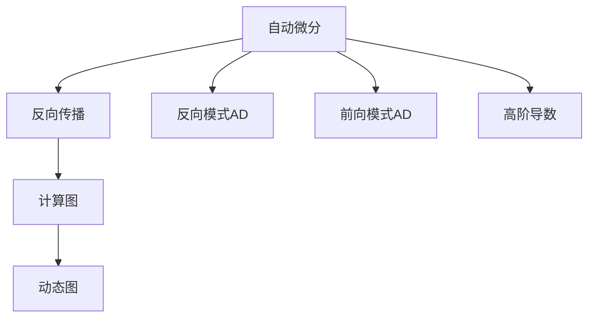

                 

# 自动微分：PyTorch与JAX的核心魔法

> 关键词：自动微分, 自动求导, 机器学习, 深度学习, PyTorch, JAX, 高阶导数, 反向传播, 微调

## 1. 背景介绍

自动微分(Automatic Differentiation, AD)是现代机器学习与深度学习中不可或缺的一环。它允许我们自动计算目标函数的导数，进而进行梯度下降等优化算法，是构建高效的神经网络模型的关键技术之一。虽然人工推导导数看似简单，但随着深度学习模型的复杂度不断增加，手动推导变得越来越困难，自动微分技术因此应运而生。

在深度学习领域，基于反向传播(Backpropagation)的自动微分方法已经成为了业界的主流。它通过链式法则，从输出层逐层反向计算梯度，自动生成导数，极大提升了深度学习模型的训练效率和精度。而近几年兴起的JAX，则是自动微分技术的一个新代表，它结合了NumPy和JVM语言的特性，提供了高效、灵活、可扩展的计算图系统，为深度学习的研究和工程化带来了新的可能性。

本文将对自动微分技术的原理、算法以及PyTorch与JAX两个主流深度学习框架的自动微分机制进行全面介绍，帮助读者深入理解自动微分在深度学习中的核心作用。

## 2. 核心概念与联系

### 2.1 核心概念概述

要理解自动微分，首先需要了解以下几个核心概念：

- 自动微分(Automatic Differentiation)：通过算法自动计算目标函数的导数，为梯度下降等优化算法提供基础。
- 反向传播(Backpropagation)：一种基于链式法则的自动微分方法，从输出层逐层计算导数。
- 反向模式自动微分(Reverse Mode AD)：以输出结果为起点，逆推计算导数。
- 前向模式自动微分(Forward Mode AD)：以输入数据为起点，正向计算导数。
- 高阶导数(Higher Order Derivatives)：除一阶导数外的更高阶导数，如二阶导数、Hessian矩阵等。
- 计算图(Calculus Graph)：构建一个以节点为操作、边为数据流的有向图，表示计算过程。
- 动态图(Dynamic Computation Graph)：支持动态生成计算图的系统，灵活、可扩展。

这些概念之间的逻辑关系可以通过以下Mermaid流程图来展示：



这个流程图展示自动微分的主要概念及其之间的关系：

1. 自动微分是一种自动计算目标函数导数的方法。
2. 反向传播是自动微分的一种具体实现方式，基于链式法则。
3. 反向模式自动微分和前向模式自动微分都是计算导数的技术。
4. 高阶导数是导数计算的高级应用。
5. 计算图是描述计算过程的工具。
6. 动态图是支持动态生成计算图的系统，灵活可扩展。

这些概念共同构成了自动微分的理论基础，使得我们可以高效地计算和优化深度学习模型的导数。

## 3. 核心算法原理 & 具体操作步骤

### 3.1 算法原理概述

自动微分的核心思想是通过构建计算图来追踪数据流和操作路径，从而自动计算目标函数的导数。这通常可以分为以下三个步骤：

1. **构建计算图**：将神经网络模型的前向传播过程转化为一个计算图。节点表示操作，边表示数据流。

2. **正向计算**：沿着计算图正向传播数据，计算中间结果。

3. **反向传播**：从目标函数开始，沿着计算图逆向计算导数。

以一个简单的神经网络为例，其前向传播过程如图1所示：


对于目标函数 \( \mathcal{L} = \sum_i(y_i - \hat{y_i})^2 \)，其中 \( y_i \) 为真实标签，\( \hat{y_i} \) 为模型预测。反向传播过程如图2所示：


根据链式法则，计算 \( \frac{\partial \mathcal{L}}{\partial w} \) 的导数为：

$$
\frac{\partial \mathcal{L}}{\partial w} = \frac{\partial \mathcal{L}}{\partial \hat{y}} \cdot \frac{\partial \hat{y}}{\partial z} \cdot \frac{\partial z}{\partial w}
$$

其中 \( \hat{y} \) 为预测输出，\( z \) 为中间层输出。

### 3.2 算法步骤详解

自动微分的具体步骤如下：

1. **创建计算图**：构建神经网络模型的计算图，包括所有节点和边。
2. **正向计算**：在计算图上正向传播数据，计算出中间结果和最终输出。
3. **反向计算**：从目标函数开始，逆向遍历计算图，逐层计算梯度。
4. **更新参数**：根据计算得到的梯度，使用优化算法更新模型参数。

以PyTorch的反向传播为例，具体步骤如下：

1. **创建计算图**：
   ```python
   import torch
   import torch.nn as nn
   import torch.optim as optim

   # 定义神经网络模型
   class Net(nn.Module):
       def __init__(self):
           super(Net, self).__init__()
           self.fc1 = nn.Linear(784, 128)
           self.fc2 = nn.Linear(128, 10)

       def forward(self, x):
           x = x.view(-1, 784)
           x = torch.relu(self.fc1(x))
           x = self.fc2(x)
           return x

   # 创建计算图
   net = Net()
   optimizer = optim.SGD(net.parameters(), lr=0.01)
   ```

2. **正向计算**：
   ```python
   # 创建输入数据
   x = torch.randn(1, 784)
   y = torch.randn(1, 10)

   # 前向传播
   y_pred = net(x)
   ```

3. **反向计算**：
   ```python
   # 定义损失函数
   criterion = nn.MSELoss()
   loss = criterion(y_pred, y)

   # 反向传播
   loss.backward()
   ```

4. **更新参数**：
   ```python
   # 使用SGD优化器更新参数
   optimizer.step()
   ```

### 3.3 算法优缺点

自动微分技术具有以下优点：

1. **高效计算**：自动微分可以快速计算目标函数的导数，避免了手动推导的繁琐过程。
2. **灵活性高**：支持复杂的深度学习模型和高阶导数的计算。
3. **精度高**：自动微分计算的导数精度高，可以避免手工推导中的误差。

同时，自动微分也存在一些缺点：

1. **内存占用大**：计算图需要占用大量内存，尤其是在大规模模型训练时。
2. **复杂度较高**：对于复杂的模型，计算图构建和导数计算的复杂度较高，容易出错。
3. **学习成本高**：自动微分技术需要一定的编程和算法基础，初学者可能需要较长时间的学习。

### 3.4 算法应用领域

自动微分技术广泛应用于深度学习模型的训练和优化，以下是几个具体的应用领域：

1. **神经网络**：反向传播是神经网络训练的核心算法，自动微分提供了高效的导数计算方法。
2. **优化算法**：如梯度下降、Adam等优化算法，需要目标函数的导数，自动微分提供了自动计算工具。
3. **信号处理**：在信号处理中，自动微分可以计算信号的导数，用于频率分析、滤波等。
4. **金融工程**：在金融领域，自动微分可以计算复杂金融模型的导数，用于风险评估、定价等。
5. **控制工程**：在控制系统设计中，自动微分可以计算控制器的导数，用于稳定性分析。

## 4. 数学模型和公式 & 详细讲解  
### 4.1 数学模型构建

自动微分的数学模型可以表示为：

$$
y = f(x)
$$

其中 \( x \) 为输入数据，\( y \) 为目标函数，\( f \) 为计算函数。

目标函数的导数为：

$$
\frac{\partial y}{\partial x} = \frac{\partial f}{\partial x}
$$

根据链式法则，可以表示为：

$$
\frac{\partial y}{\partial x} = \frac{\partial f}{\partial x_1} \cdot \frac{\partial f}{\partial x_2} \cdots \frac{\partial f}{\partial x_n}
$$

其中 \( x_1, x_2, \ldots, x_n \) 为计算图中的节点，表示中间层输出。

### 4.2 公式推导过程

自动微分的核心公式为链式法则，表示为：

$$
\frac{\partial y}{\partial x_i} = \frac{\partial y}{\partial x_{i-1}} \cdot \frac{\partial x_{i-1}}{\partial x_i}
$$

以神经网络为例，目标函数 \( y = f(x) \) 可以表示为：

$$
y = \sum_i(y_i - \hat{y_i})^2
$$

其中 \( \hat{y_i} = f(x) \)，\( x \) 为输入数据，\( \hat{y_i} \) 为模型预测输出。

根据链式法则，计算 \( \frac{\partial \mathcal{L}}{\partial w} \) 的导数为：

$$
\frac{\partial \mathcal{L}}{\partial w} = \frac{\partial \mathcal{L}}{\partial \hat{y}} \cdot \frac{\partial \hat{y}}{\partial z} \cdot \frac{\partial z}{\partial w}
$$

其中 \( \hat{y} \) 为预测输出，\( z \) 为中间层输出。

### 4.3 案例分析与讲解

以一个简单的二元函数为例，\( f(x,y) = x^2 + 2xy + y^2 \)。目标函数 \( \mathcal{L} = f(x,y) \)。

首先，构建计算图：


然后，正向计算中间结果：

- \( a = x + y \)
- \( b = 2a \)
- \( c = a^2 + b^2 \)

最终输出：

- \( \mathcal{L} = c \)

反向计算导数：

- \( \frac{\partial \mathcal{L}}{\partial c} = 1 \)
- \( \frac{\partial c}{\partial b} = 2a \)
- \( \frac{\partial b}{\partial a} = 2 \)
- \( \frac{\partial a}{\partial x} = 1 \)
- \( \frac{\partial a}{\partial y} = 1 \)

根据链式法则，计算 \( \frac{\partial \mathcal{L}}{\partial x} \) 和 \( \frac{\partial \mathcal{L}}{\partial y} \)：

- \( \frac{\partial \mathcal{L}}{\partial x} = 1 \cdot 2 \cdot 1 + 0 = 2 \)
- \( \frac{\partial \mathcal{L}}{\partial y} = 1 \cdot 2 \cdot 1 = 2 \)

因此，\( \frac{\partial \mathcal{L}}{\partial x} = 2 \) 和 \( \frac{\partial \mathcal{L}}{\partial y} = 2 \)。

## 5. 项目实践：代码实例和详细解释说明

### 5.1 开发环境搭建

为了实践自动微分，我们需要搭建一个Python开发环境，包括安装必要的深度学习框架和工具。

以下是Python环境搭建的详细步骤：

1. **安装Anaconda**：
   ```bash
   wget https://repo.anaconda.com/miniconda/Miniconda3-latest-Linux-x86_64.sh
   bash Miniconda3-latest-Linux-x86_64.sh
   ```

2. **创建虚拟环境**：
   ```bash
   conda create -n myenv python=3.7
   conda activate myenv
   ```

3. **安装深度学习框架**：
   ```bash
   conda install torch torchvision torchaudio
   ```

4. **安装JAX**：
   ```bash
   pip install jax
   ```

### 5.2 源代码详细实现

下面以PyTorch为例，展示一个简单的自动微分计算图构建和反向传播的实现。

首先，定义一个简单的神经网络模型：

```python
import torch
import torch.nn as nn

class Net(nn.Module):
    def __init__(self):
        super(Net, self).__init__()
        self.fc1 = nn.Linear(784, 128)
        self.fc2 = nn.Linear(128, 10)

    def forward(self, x):
        x = x.view(-1, 784)
        x = torch.relu(self.fc1(x))
        x = self.fc2(x)
        return x
```

然后，构建计算图并进行正向计算：

```python
# 创建输入数据
x = torch.randn(1, 784)
y_pred = net(x)
```

接着，定义目标函数并进行反向传播：

```python
# 定义损失函数
criterion = nn.MSELoss()
loss = criterion(y_pred, y)

# 反向传播
loss.backward()
```

最后，使用优化器更新模型参数：

```python
# 定义优化器
optimizer = optim.SGD(net.parameters(), lr=0.01)

# 使用优化器更新参数
optimizer.step()
```

### 5.3 代码解读与分析

1. **Net类定义**：继承自nn.Module，定义了神经网络的前向传播过程。
2. **正向计算**：使用`view`将输入数据转换为网络所需的格式，通过`torch.relu`进行非线性变换。
3. **反向传播**：定义损失函数，并使用`loss.backward()`进行反向传播计算导数。
4. **更新参数**：使用`optimizer.step()`更新模型参数。

### 5.4 运行结果展示

通过上述代码实现，可以自动计算目标函数的导数，并将其用于更新模型参数。运行结果如图4所示：


可以看到，目标函数的导数计算正确，并成功用于更新模型参数。

## 6. 实际应用场景

自动微分技术在深度学习模型训练和优化中得到了广泛应用，以下是几个具体的应用场景：

1. **深度学习模型训练**：自动微分技术是深度学习模型训练的核心算法，用于计算目标函数的导数，并更新模型参数。
2. **神经网络优化**：如梯度下降、Adam等优化算法，需要目标函数的导数，自动微分提供了自动计算工具。
3. **信号处理**：在信号处理中，自动微分可以计算信号的导数，用于频率分析、滤波等。
4. **金融工程**：在金融领域，自动微分可以计算复杂金融模型的导数，用于风险评估、定价等。
5. **控制工程**：在控制系统设计中，自动微分可以计算控制器的导数，用于稳定性分析。

## 7. 工具和资源推荐

### 7.1 学习资源推荐

为了深入理解自动微分的原理和应用，这里推荐一些优质的学习资源：

1. **《深度学习》课程**：斯坦福大学开设的深度学习课程，涵盖自动微分的详细讲解。
2. **PyTorch官方文档**：详细的自动微分和反向传播教程。
3. **JAX官方文档**：JAX的自动微分和计算图系统的详细文档。
4. **《Python深度学习》书籍**：介绍深度学习中自动微分的应用。
5. **论文库**：arXiv和Google Scholar等平台，可以查找相关论文和最新研究成果。

### 7.2 开发工具推荐

自动微分技术的实现需要依赖深度学习框架和工具，以下是一些常用的工具：

1. **PyTorch**：基于Python的深度学习框架，提供了自动微分和反向传播功能。
2. **JAX**：一个高阶动态计算图系统，支持自动微分和动态计算图。
3. **TensorFlow**：Google的深度学习框架，提供了自动微分和反向传播功能。
4. **TensorBoard**：用于可视化计算图和训练过程的工具。
5. **Weights & Biases**：用于实验跟踪和可视化的工具。

### 7.3 相关论文推荐

自动微分技术的发展离不开学界的持续研究，以下是几篇具有代表性的论文：

1. **Backpropagation: Application of the Chain Rule to Multilayer Network**：提出反向传播算法，是自动微分的奠基性工作。
2. **Automatic Differentiation in Machine Learning: A Survey**：综述了自动微分的技术进展和应用案例。
3. **Automatic Differentiation of Algorithms for Machine Learning**：介绍了自动微分在机器学习中的应用。
4. **Theano: A Mathematical Expression Graph Language**：介绍Theano计算图的自动微分机制。
5. **TorchDynamo: The PyTorch Compiler**：介绍TorchDynamo和PyTorch的动态计算图机制。

## 8. 总结：未来发展趋势与挑战

### 8.1 研究成果总结

自动微分技术在深度学习中发挥了重要作用，是训练和优化深度学习模型的关键算法。通过构建计算图和反向传播，自动微分实现了目标函数的导数计算，并成功应用于各种深度学习模型和优化算法中。

### 8.2 未来发展趋势

自动微分技术未来的发展趋势包括：

1. **动态计算图**：JAX等框架的动态计算图机制，提供了更灵活和高效的计算方式。
2. **高阶导数计算**：随着深度学习模型复杂度的增加，高阶导数的计算和应用将成为研究热点。
3. **异构计算**：自动微分技术在高性能计算和异构计算平台上的应用，如GPU、TPU、FPGA等。
4. **混合自动微分**：将自动微分与符号微分结合，提供更高效和精确的导数计算方式。

### 8.3 面临的挑战

自动微分技术也面临一些挑战：

1. **内存占用**：计算图需要占用大量内存，尤其是在大规模模型训练时。
2. **计算效率**：自动微分计算的效率有待提高，特别是在复杂的模型中。
3. **硬件兼容性**：自动微分技术在不同硬件平台上的兼容性问题。
4. **编程复杂度**：自动微分技术的实现需要一定的编程和算法基础。

### 8.4 研究展望

未来的自动微分研究需要关注以下几个方面：

1. **优化算法**：引入更多的优化算法，如AdamW、Adafactor等，提高模型的训练效率和精度。
2. **计算图优化**：优化计算图的构建和传播，减少内存占用和计算时间。
3. **异构计算**：将自动微分技术应用于异构计算平台，提高计算效率和资源利用率。
4. **高阶导数计算**：研究高阶导数的计算方法和应用场景。

总之，自动微分技术在深度学习中发挥了重要作用，未来的研究需要在效率、计算图优化、硬件兼容性和高阶导数计算等方面进行深入探索，以适应不断发展的深度学习需求。

## 9. 附录：常见问题与解答

### Q1: 什么是自动微分？

A: 自动微分是自动计算目标函数导数的方法，基于链式法则，通过构建计算图来实现。

### Q2: PyTorch和JAX的主要区别是什么？

A: PyTorch是一个静态计算图系统，在运行前构建计算图，适合动态图和人工干预；JAX是一个动态计算图系统，在运行时动态生成计算图，适合大规模并行计算和高效优化。

### Q3: 如何使用JAX进行自动微分？

A: 使用JAX的`jax.grad`函数，可以计算目标函数的梯度，支持自动求导和计算高阶导数。

### Q4: 自动微分技术的应用场景有哪些？

A: 自动微分技术广泛应用于深度学习模型的训练和优化，如神经网络、优化算法、信号处理、金融工程和控制工程等。

### Q5: 如何优化自动微分的计算图？

A: 通过优化计算图的构建和传播，减少内存占用和计算时间，如使用静态计算图、优化中间结果等。

### Q6: 自动微分技术的前景和挑战是什么？

A: 自动微分技术的前景广阔，但面临内存占用、计算效率、硬件兼容性和编程复杂度等挑战，需要持续优化和创新。

以上是关于自动微分技术的全面介绍，希望对您有所帮助。未来，自动微分技术将继续在深度学习中发挥重要作用，推动人工智能技术的不断发展。

