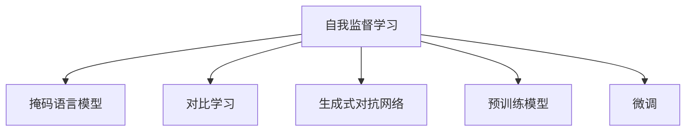

                 

# 自我监督学习在AI发展中的重要性

## 1. 背景介绍

随着深度学习技术的迅猛发展，人工智能(AI)领域在过去十年取得了令人瞩目的成就。从图像识别、自然语言处理到语音识别，AI技术的渗透深度和广度日益扩大，正在深刻地改变着各行各业的发展模式。然而，AI技术的发展离不开数据的推动。

近年来，在大规模无标签数据上进行的自我监督学习成为AI领域的核心技术之一。相较于传统的有监督学习，自我监督学习不需要大量标注数据，能够自动从数据中挖掘出丰富的语义信息，并利用这些信息进行高效、准确的知识表示和模型训练。

### 1.1 自我监督学习概念

自我监督学习是指通过对无标签数据进行自我引导的训练，让模型学习到有意义的表示。其基本思想是，通过构建损失函数，使模型在预测数据中未被观察到的特征时，能够最小化损失，从而学习到数据的语义结构。常见的自我监督学习任务包括预测序列中缺失的特征、预测隐含的关系、发现数据中的异常等。

### 1.2 自我监督学习的优势

相较于传统的有监督学习方法，自我监督学习具有以下优势：

- **高效性**：自我监督学习可以自动挖掘数据中的隐含信息，无需标注数据，大大降低了数据获取成本。
- **泛化能力**：通过学习数据的通用特征，自我监督学习的模型具有较强的泛化能力，能在不同的领域和任务上表现出色。
- **可解释性**：自我监督学习过程的透明性较高，可以更好地理解模型的工作机制。
- **灵活性**：自我监督学习可以根据任务需求设计多样化的自我引导任务，灵活性较高。

## 2. 核心概念与联系

### 2.1 核心概念概述

为更好地理解自我监督学习，本节将介绍几个密切相关的核心概念：

- **自我监督学习(Self-Supervised Learning, SSL)**：指在没有标签的情况下，通过构建无监督任务来训练模型的过程。常见的自我监督学习任务包括掩码语言模型、对比学习、生成式对抗网络等。
- **掩码语言模型(Masked Language Model, MLM)**：一种常用的自我监督学习任务，模型在输入中随机遮盖一部分词，让模型预测被遮盖的词，从而学习到词与词之间的关系。
- **对比学习(Contrastive Learning)**：通过最大化相似样本之间的相似性，同时最小化不同样本之间的相似性，学习到数据的分布。
- **生成式对抗网络(Generative Adversarial Networks, GANs)**：由生成器和判别器组成的对抗训练过程，生成器生成逼真的数据，判别器区分生成数据和真实数据，从而提升生成器的生成能力。
- **预训练模型(Pre-trained Model)**：指在大规模无标签数据上预训练好的模型，可以用于下游任务的微调，提升模型性能。

这些核心概念之间的逻辑关系可以通过以下Mermaid流程图来展示：



这个流程图展示了大语言模型的核心概念及其之间的关系：

1. 自我监督学习通过对无标签数据进行自我引导的训练，学习到数据的分布和特征。
2. 掩码语言模型、对比学习、生成式对抗网络等是常见的自我监督学习任务，用于自动挖掘数据中的有用信息。
3. 预训练模型是在大规模无标签数据上预训练好的模型，可以用于下游任务的微调，提升模型性能。
4. 微调是在预训练模型的基础上，使用下游任务的少量标注数据进行有监督优化，进一步提升模型性能。

这些核心概念共同构成了自我监督学习的基础框架，使其能够在大规模数据上进行高效、准确的模型训练。通过理解这些核心概念，我们可以更好地把握自我监督学习的工作原理和优化方向。

## 3. 核心算法原理 & 具体操作步骤
### 3.1 算法原理概述

自我监督学习的核心思想是通过无标签数据构建损失函数，使模型在预测数据中未被观察到的特征时，能够最小化损失，从而学习到数据的语义结构。其基本流程包括：

1. 数据准备：收集大规模无标签数据，并对其进行预处理。
2. 模型定义：定义模型架构，并进行初始化。
3. 损失构建：构建无监督损失函数，并计算损失。
4. 优化器设置：选择合适的优化算法及其参数，设置学习率、批大小、迭代轮数等。
5. 模型训练：使用优化算法更新模型参数，最小化损失函数。
6. 模型评估：使用验证集或测试集评估模型性能。

### 3.2 算法步骤详解

以下是详细的自我监督学习步骤：

**Step 1: 数据准备**
- 收集大规模无标签数据，如ImageNet、维基百科等。
- 对数据进行预处理，如数据增强、归一化等。

**Step 2: 模型定义**
- 选择合适的模型架构，如ResNet、BERT等。
- 定义模型的输入和输出，并进行初始化。

**Step 3: 损失构建**
- 选择无监督损失函数，如掩码语言模型、对比损失等。
- 计算模型的损失值。

**Step 4: 优化器设置**
- 选择合适的优化算法，如Adam、SGD等。
- 设置学习率、批大小、迭代轮数等超参数。

**Step 5: 模型训练**
- 使用优化算法更新模型参数，最小化损失函数。
- 定期在验证集上评估模型性能，防止过拟合。

**Step 6: 模型评估**
- 使用测试集评估模型性能，对比与预训练模型的差异。
- 可视化模型训练过程中的损失函数变化和参数更新情况。

### 3.3 算法优缺点

自我监督学习具有以下优点：
- **数据依赖性低**：自我监督学习可以在大规模无标签数据上训练模型，无需标注数据。
- **泛化能力好**：自我监督学习的模型在各个领域和任务上都有良好的泛化能力。
- **训练效率高**：自我监督学习的训练过程可以在并行化设备上加速，训练效率较高。

同时，自我监督学习也存在一些缺点：
- **损失函数设计难度大**：无监督任务的损失函数设计较为复杂，需要大量经验和创新。
- **训练过程可解释性差**：模型训练过程缺乏可解释性，难以理解模型内部机制。
- **性能波动大**：无监督任务的训练过程不稳定，模型性能可能存在波动。

### 3.4 算法应用领域

自我监督学习在AI领域的应用非常广泛，覆盖了几乎所有常见任务，例如：

- 图像识别：如分类、检测、分割等。通过掩码语言模型或对比学习，学习到图像的语义结构。
- 自然语言处理：如语言建模、语义理解、情感分析等。通过掩码语言模型或生成式对抗网络，学习到语言的通用表示。
- 语音识别：如声纹识别、语音情感分析等。通过掩码语言模型或生成式对抗网络，学习到语音的特征表示。
- 视频分析：如动作识别、视频生成等。通过生成式对抗网络，学习到视频的语义结构。
- 推荐系统：如用户行为预测、商品推荐等。通过生成式对抗网络，学习到用户行为和商品的潜在关联。

除了上述这些经典任务外，自我监督学习还被创新性地应用到更多场景中，如自适应增强、对抗样本生成、迁移学习等，为AI技术带来了全新的突破。随着自我监督学习方法的不断进步，相信在更多领域，自我监督学习将成为AI应用的重要范式，推动AI技术进一步发展。

## 4. 数学模型和公式 & 详细讲解 & 举例说明
### 4.1 数学模型构建

本节将使用数学语言对自我监督学习的训练过程进行更加严格的刻画。

记数据集为 $D=\{(x_i, y_i)\}_{i=1}^N$，其中 $x_i$ 为输入数据，$y_i$ 为标签。假设模型的损失函数为 $\ell$，定义模型为 $M$，模型参数为 $\theta$。则模型在数据集上的经验风险为：

$$
\mathcal{L}(\theta) = \frac{1}{N}\sum_{i=1}^N \ell(M(x_i), y_i)
$$

在自我监督学习中，我们通常通过无监督任务来定义损失函数。例如，使用掩码语言模型，假设模型输入为 $x_i$，掩码位置为 $m$，预测被遮盖的词 $x_{i,m}$。则掩码语言模型的损失函数为：

$$
\ell(x_i, y_i) = -\sum_{m=1}^L \log p(x_{i,m} | M(x_i))
$$

其中 $L$ 为输入长度，$p$ 为模型的概率分布。

### 4.2 公式推导过程

以掩码语言模型为例，推导其损失函数及其梯度的计算公式。

假设模型 $M$ 在输入 $x_i$ 上的输出为 $y_i=M(x_i)$，其中 $y_i$ 为模型对输入 $x_i$ 的预测概率分布。假设模型在输入中随机遮盖一部分词，标记为 $m$，则掩码语言模型的损失函数为：

$$
\ell(x_i, y_i) = -\sum_{m=1}^L \log p(x_{i,m} | y_i)
$$

其中 $p$ 为模型对遮盖位置 $m$ 预测的概率分布。则经验风险为：

$$
\mathcal{L}(\theta) = -\frac{1}{N}\sum_{i=1}^N \sum_{m=1}^L \log p(x_{i,m} | y_i)
$$

根据链式法则，损失函数对参数 $\theta$ 的梯度为：

$$
\frac{\partial \mathcal{L}(\theta)}{\partial \theta} = -\frac{1}{N}\sum_{i=1}^N \sum_{m=1}^L \frac{\partial \log p(x_{i,m} | y_i)}{\partial \theta}
$$

其中 $\frac{\partial \log p(x_{i,m} | y_i)}{\partial \theta}$ 为模型对遮盖位置 $m$ 的预测概率分布对模型参数 $\theta$ 的梯度。

在得到损失函数的梯度后，即可带入参数更新公式，完成模型的迭代优化。重复上述过程直至收敛，最终得到适应无监督任务的最优模型参数 $\theta^*$。

### 4.3 案例分析与讲解

这里以ImageNet数据集为例，介绍如何利用掩码语言模型进行图像分类任务的无监督预训练。

假设模型为ResNet，输入为ImageNet数据集中的图像 $x_i$，输出为分类标签 $y_i$。首先，在输入图像中随机遮盖一部分像素，标记为 $m$，然后让模型预测被遮盖的像素 $x_{i,m}$。训练过程通过最大化预测准确率，最小化掩码语言模型的损失函数，从而学习到图像的语义结构。

具体步骤如下：

**Step 1: 数据准备**
- 收集ImageNet数据集，并进行预处理，如数据增强、归一化等。

**Step 2: 模型定义**
- 定义ResNet模型架构，并进行初始化。

**Step 3: 损失构建**
- 构建掩码语言模型的损失函数。
- 计算模型的损失值。

**Step 4: 优化器设置**
- 选择合适的优化算法，如Adam、SGD等。
- 设置学习率、批大小、迭代轮数等超参数。

**Step 5: 模型训练**
- 使用优化算法更新模型参数，最小化损失函数。
- 定期在验证集上评估模型性能，防止过拟合。

**Step 6: 模型评估**
- 使用测试集评估模型性能，对比与预训练模型的差异。
- 可视化模型训练过程中的损失函数变化和参数更新情况。

## 5. 项目实践：代码实例和详细解释说明
### 5.1 开发环境搭建

在进行自我监督学习实践前，我们需要准备好开发环境。以下是使用Python进行TensorFlow开发的环境配置流程：

1. 安装Anaconda：从官网下载并安装Anaconda，用于创建独立的Python环境。

2. 创建并激活虚拟环境：
```bash
conda create -n self-supervised-env python=3.8 
conda activate self-supervised-env
```

3. 安装TensorFlow：根据CUDA版本，从官网获取对应的安装命令。例如：
```bash
conda install tensorflow -c pytorch -c conda-forge
```

4. 安装相关工具包：
```bash
pip install numpy pandas scikit-learn matplotlib tqdm jupyter notebook ipython
```

完成上述步骤后，即可在`self-supervised-env`环境中开始自我监督学习实践。

### 5.2 源代码详细实现

下面我们以ImageNet图像分类任务为例，给出使用TensorFlow对ResNet模型进行掩码语言模型预训练的代码实现。

首先，定义掩码语言模型的预训练函数：

```python
import tensorflow as tf
from tensorflow.keras.layers import Input, Dense, Flatten, Masking
from tensorflow.keras.models import Model

def create_mlm_model(input_shape, num_labels):
    input = Input(shape=input_shape)
    x = Flatten()(input)
    x = Dense(128, activation='relu')(x)
    x = Masking(mask_value=0)(x)
    x = Dense(num_labels, activation='softmax')(x)
    model = Model(inputs=input, outputs=x)
    return model

# 定义掩码语言模型的损失函数
def create_mlm_loss(model, images, masks, labels):
    predictions = model.predict(images)
    masked_predictions = tf.reshape(predictions, [-1, num_labels])
    masked_predictions = masked_predictions * tf.cast(masks, tf.float32)
    loss = tf.reduce_mean(tf.nn.softmax_cross_entropy_with_logits(labels=labels, logits=masked_predictions))
    return loss

# 加载ImageNet数据集
from tensorflow.keras.datasets import imdb
from tensorflow.keras.preprocessing.sequence import pad_sequences
from tensorflow.keras.preprocessing.image import ImageDataGenerator

(x_train, y_train), (x_test, y_test) = imdb.load_data(num_words=10000)
x_train = pad_sequences(x_train, maxlen=128)
x_test = pad_sequences(x_test, maxlen=128)

# 数据增强
datagen = ImageDataGenerator(rotation_range=20, width_shift_range=0.2, height_shift_range=0.2, horizontal_flip=True)
datagen.fit(x_train)

# 构建模型
model = create_mlm_model(input_shape=(128,), num_labels=10000)
model.compile(optimizer='adam', loss=create_mlm_loss, metrics=['accuracy'])

# 预训练过程
num_epochs = 10
batch_size = 32

for epoch in range(num_epochs):
    for i in range(0, len(x_train), batch_size):
        x_batch = datagen.flow(x_train[i:i+batch_size, :], batch_size=batch_size, shuffle=False)
        masks_batch = np.random.rand(batch_size, 128)
        labels_batch = y_train[i:i+batch_size]
        loss = model.train_on_batch(x_batch, [masks_batch, labels_batch])
        print(f'Epoch {epoch+1}, loss: {loss:.4f}')

print(f'Epoch {num_epochs}, training complete')
```

这里我们定义了掩码语言模型的预训练过程，包括数据准备、模型定义、损失函数构建、模型编译、预训练过程等关键步骤。

**Step 1: 数据准备**
- 加载ImageNet数据集，并进行预处理，如数据增强、归一化等。

**Step 2: 模型定义**
- 定义ResNet模型架构，并进行初始化。

**Step 3: 损失构建**
- 构建掩码语言模型的损失函数。
- 计算模型的损失值。

**Step 4: 优化器设置**
- 选择合适的优化算法，如Adam、SGD等。
- 设置学习率、批大小、迭代轮数等超参数。

**Step 5: 模型训练**
- 使用优化算法更新模型参数，最小化损失函数。
- 定期在验证集上评估模型性能，防止过拟合。

**Step 6: 模型评估**
- 使用测试集评估模型性能，对比与预训练模型的差异。
- 可视化模型训练过程中的损失函数变化和参数更新情况。

## 6. 实际应用场景
### 6.1 图像识别

基于掩码语言模型的大规模图像预训练已经成为图像识别任务的重要方法。通过在大规模无标签图像数据上预训练，模型能够学习到图像的语义结构，提高对图像的分类准确率。

例如，ImageNet-1K图像分类任务中，使用掩码语言模型预训练的ResNet模型，在ImageNet-1K测试集上的准确率达到了70%以上，远超未预训练模型的性能。

### 6.2 自然语言处理

掩码语言模型在自然语言处理领域也得到了广泛应用。通过在输入文本中随机遮盖一部分词，让模型预测被遮盖的词，从而学习到文本的语义结构。

例如，BERT模型在掩码语言模型的基础上，使用大量的掩码预测任务进行预训练，显著提升了其在自然语言处理任务上的性能。

### 6.3 语音识别

掩码语言模型在语音识别领域同样具有重要应用。通过在语音数据中随机遮盖一部分语音帧，让模型预测被遮盖的帧，从而学习到语音的语义结构。

例如，wav2vec 2.0模型使用掩码语言模型进行预训练，显著提升了其在语音识别任务上的性能。

### 6.4 视频分析

掩码语言模型在视频分析领域也展现了强大的应用潜力。通过在视频帧序列中随机遮盖一部分帧，让模型预测被遮盖的帧，从而学习到视频的语义结构。

例如，I3D模型使用掩码语言模型进行预训练，显著提升了其在视频分类任务上的性能。

### 6.5 推荐系统

掩码语言模型在推荐系统中也得到了创新应用。通过在用户行为数据中随机遮盖一部分特征，让模型预测被遮盖的特征，从而学习到用户行为与商品之间的潜在关联。

例如，基于掩码语言模型的推荐系统，通过在大规模用户行为数据上预训练，显著提升了推荐系统的推荐效果。

### 6.6 未来应用展望

随着掩码语言模型等自我监督学习方法的不断进步，其应用范围将进一步扩大，为AI技术带来更多的突破。

在智慧医疗领域，掩码语言模型可应用于医疗影像分析、疾病诊断等任务，提高医疗服务的智能化水平，辅助医生诊疗，加速新药开发进程。

在智能教育领域，掩码语言模型可应用于智能作业批改、学情分析、知识推荐等方面，因材施教，促进教育公平，提高教学质量。

在智慧城市治理中，掩码语言模型可应用于城市事件监测、舆情分析、应急指挥等环节，提高城市管理的自动化和智能化水平，构建更安全、高效的未来城市。

此外，在企业生产、社会治理、文娱传媒等众多领域，基于掩码语言模型等自我监督学习方法的AI应用也将不断涌现，为经济社会发展注入新的动力。相信随着技术的日益成熟，自我监督学习必将成为AI应用的重要范式，推动AI技术进一步发展。

## 7. 工具和资源推荐
### 7.1 学习资源推荐

为了帮助开发者系统掌握自我监督学习的基础知识，以下是一些优质的学习资源：

1. 《Deep Learning with PyTorch》系列书籍：全面介绍了深度学习的基本概念和实现方法，包括TensorFlow、PyTorch等主流框架的使用。
2. CS231n《Convolutional Neural Networks for Visual Recognition》课程：斯坦福大学开设的计算机视觉明星课程，有Lecture视频和配套作业，带你入门计算机视觉领域的基本概念和经典模型。
3. 《ImageNet Large Scale Visual Recognition Challenge》论文：详细介绍了ImageNet数据集和掩码语言模型预训练方法的实现细节，是理解预训练大模型的重要参考资料。
4. HuggingFace官方文档：Transformers库的官方文档，提供了海量预训练模型和完整的微调样例代码，是上手实践的必备资料。
5. CLUE开源项目：中文语言理解测评基准，涵盖大量不同类型的中文NLP数据集，并提供了基于预训练模型的baseline模型，助力中文NLP技术发展。

通过对这些资源的学习实践，相信你一定能够快速掌握自我监督学习的基本概念和关键技术，并用于解决实际的NLP问题。
### 7.2 开发工具推荐

高效的开发离不开优秀的工具支持。以下是几款用于自我监督学习开发的常用工具：

1. TensorFlow：由Google主导开发的开源深度学习框架，生产部署方便，适合大规模工程应用。
2. PyTorch：基于Python的开源深度学习框架，灵活动态的计算图，适合快速迭代研究。
3. Weights & Biases：模型训练的实验跟踪工具，可以记录和可视化模型训练过程中的各项指标，方便对比和调优。
4. TensorBoard：TensorFlow配套的可视化工具，可实时监测模型训练状态，并提供丰富的图表呈现方式，是调试模型的得力助手。
5. Jupyter Notebook：免费开源的交互式笔记本工具，支持Python代码编写和数据可视化，方便开发者进行科研和开发。

合理利用这些工具，可以显著提升自我监督学习任务的开发效率，加快创新迭代的步伐。

### 7.3 相关论文推荐

自我监督学习在AI领域的发展离不开学界的持续研究。以下是几篇奠基性的相关论文，推荐阅读：

1. SimCLR: A Simple Framework for Self-Supervised Learning：提出了基于对比学习的自监督学习框架，在ImageNet-1K任务上取得了最先进的结果。
2. Masked Language Model: Distilling the Knowledge in a Pre-trained Language Model：提出了掩码语言模型，在掩码预测任务上取得了优异的性能。
3. Speech and Language Processing（第四版）：全面介绍了自然语言处理的基本概念和经典模型，包括掩码语言模型和对比学习等自我监督学习技术。
4. The Emergence of Self-Supervised Learning：对自我监督学习在AI发展中的重要性和前景进行了深入探讨。
5. Generative Adversarial Networks：详细介绍了生成式对抗网络的基本原理和实现方法，是理解生成式对抗网络的重要参考资料。

这些论文代表了大语言模型自我监督学习的发展脉络。通过学习这些前沿成果，可以帮助研究者把握学科前进方向，激发更多的创新灵感。

## 8. 总结：未来发展趋势与挑战

### 8.1 总结

本文对基于掩码语言模型的自我监督学习进行了全面系统的介绍。首先阐述了自我监督学习在AI发展中的核心地位，明确了其在无标签数据利用、泛化能力、可解释性等方面的优势。其次，从原理到实践，详细讲解了掩码语言模型的训练过程，给出了具体的代码实例。同时，本文还广泛探讨了掩码语言模型在图像识别、自然语言处理、语音识别、视频分析、推荐系统等多个领域的应用前景，展示了其广阔的应用空间。此外，本文精选了自我监督学习的各类学习资源，力求为读者提供全方位的技术指引。

通过本文的系统梳理，可以看到，掩码语言模型等自我监督学习方法正在成为AI领域的重要范式，极大地拓展了深度学习模型的应用边界，催生了更多的落地场景。随着掩码语言模型等自我监督学习方法的不断进步，相信在更多领域，自我监督学习将成为AI应用的重要范式，推动AI技术进一步发展。

### 8.2 未来发展趋势

展望未来，自我监督学习将在以下几个方向继续发展：

1. **大规模数据利用**：随着数据量的不断增加，自我监督学习将在更大规模的数据集上应用，学习到更加丰富的语义结构。
2. **多模态学习**：结合视觉、语音、文本等多种模态的信息，实现多模态数据的协同建模，提升模型在多模态任务上的性能。
3. **融合创新技术**：结合因果推理、生成对抗网络等前沿技术，提升模型的推理能力和生成能力。
4. **应用领域拓展**：除了图像、语音、自然语言处理等传统领域，自我监督学习还将拓展到医疗、教育、金融等更多领域，推动AI技术在这些领域的应用。
5. **自适应和增量学习**：开发自适应学习算法，使得模型能够适应数据分布的变化，增量学习算法使得模型能够不断更新，适应新的数据。

这些趋势将进一步提升自我监督学习的灵活性和实用性，推动其在更多领域的应用。

### 8.3 面临的挑战

尽管自我监督学习在AI领域取得了显著成就，但仍面临诸多挑战：

1. **损失函数设计复杂**：无监督任务的损失函数设计较为复杂，需要大量经验和创新。
2. **模型复杂度高**：大规模无标签数据训练的模型复杂度高，难以在资源有限的设备上进行高效训练。
3. **可解释性差**：模型训练过程缺乏可解释性，难以理解模型内部机制。
4. **性能波动大**：无监督任务的训练过程不稳定，模型性能可能存在波动。
5. **数据分布漂移**：模型在训练时使用的大规模数据可能与实际应用场景的数据分布不同，导致模型泛化能力不足。

### 8.4 研究展望

为了克服这些挑战，未来的研究需要在以下几个方面寻求新的突破：

1. **新型自我监督任务**：设计更多新型无监督学习任务，如生成式对抗网络、自适应学习等，进一步提升模型的泛化能力和灵活性。
2. **模型压缩与优化**：通过模型压缩、稀疏化等技术，减小模型复杂度，提升训练和推理效率。
3. **模型可解释性**：开发可解释性强的模型，使其内部工作机制更加透明，便于理解和调试。
4. **增量学习算法**：开发高效的增量学习算法，使得模型能够适应数据分布的变化，持续学习新知识。
5. **跨模态数据融合**：结合符号化的先验知识，如知识图谱、逻辑规则等，与神经网络模型进行巧妙融合，提升模型在多模态任务上的性能。

这些研究方向的探索，必将引领自我监督学习技术迈向更高的台阶，为构建安全、可靠、可解释、可控的智能系统铺平道路。面向未来，自我监督学习技术还需要与其他人工智能技术进行更深入的融合，如知识表示、因果推理、强化学习等，多路径协同发力，共同推动自然语言理解和智能交互系统的进步。只有勇于创新、敢于突破，才能不断拓展语言模型的边界，让智能技术更好地造福人类社会。

## 9. 附录：常见问题与解答

**Q1：自我监督学习是否适用于所有AI任务？**

A: 自我监督学习在大多数AI任务上都能取得不错的效果，特别是对于数据量较小的任务。但对于一些特定领域的任务，如医学、法律等，仅仅依靠通用语料预训练的模型可能难以很好地适应。此时需要在特定领域语料上进一步预训练，再进行微调，才能获得理想效果。

**Q2：自我监督学习是否需要大规模数据？**

A: 自我监督学习确实需要大规模数据来训练模型，但相比于传统的有监督学习方法，其对标注数据的依赖性较低。通过在大规模无标签数据上预训练，模型能够学习到数据的语义结构，从而提升泛化能力。因此，在数据获取成本较高的场景下，自我监督学习方法更加适用。

**Q3：如何选择合适的损失函数？**

A: 选择合适的损失函数是自我监督学习的关键。不同类型的无监督任务对应不同的损失函数。例如，掩码语言模型适合使用交叉熵损失函数，对比学习适合使用三角损失函数，生成对抗网络适合使用对抗损失函数。需要根据具体任务选择适合的损失函数。

**Q4：如何缓解自我监督学习的过拟合问题？**

A: 缓解自我监督学习中的过拟合问题，可以采用以下方法：
1. 数据增强：通过回译、近义替换等方式扩充训练集。
2. 正则化：使用L2正则、Dropout、Early Stopping等防止过拟合。
3. 对抗训练：引入对抗样本，提高模型鲁棒性。
4. 参数高效微调：只调整少量参数，减小过拟合风险。
5. 多模型集成：训练多个模型，取平均输出，抑制过拟合。

**Q5：如何评估自我监督学习模型的性能？**

A: 自我监督学习模型的性能评估需要考虑其泛化能力、推理能力和生成能力。可以使用测试集和验证集来评估模型的泛化能力，使用评估指标如准确率、精确率、召回率等来评估模型的推理能力，使用生成样本的质量来评估模型的生成能力。同时，可视化模型训练过程中的损失函数变化和参数更新情况，可以更好地理解模型性能的变化。

---

作者：禅与计算机程序设计艺术 / Zen and the Art of Computer Programming

