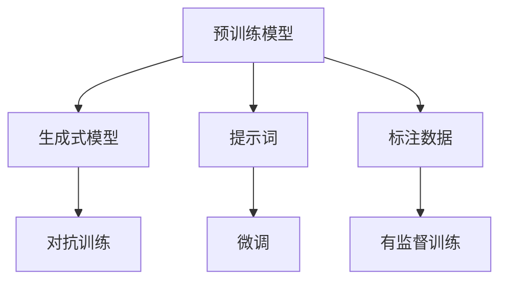

                 

# 自然语言生成在内容创作中的应用：AI辅助写作

> 关键词：自然语言生成，内容创作，AI辅助写作，语言模型，预训练模型，生成式模型，语言理解

## 1. 背景介绍

### 1.1 问题由来

随着互联网和数字技术的发展，内容创作的需求日益增长。传统的内容创作往往依赖于人类的智力与时间，而现代工业化生产又难以保证内容的质量和多样性。自然语言生成（Natural Language Generation, NLG）技术应运而生，利用AI辅助创作高质量内容，极大地提高了创作效率和创新性。

自然语言生成涉及自然语言处理（Natural Language Processing, NLP）中的多个分支，如文本生成、摘要、翻译、对话系统等，其目标是使计算机能够理解和生成人类语言。近年来，预训练模型和生成式模型的不断发展，为内容创作提供了强大的技术支持，使得AI辅助写作成为可能。

### 1.2 问题核心关键点

自然语言生成技术对内容创作的推动主要体现在以下几个方面：

1. **大规模预训练模型**：通过在大规模无标签文本数据上进行自监督预训练，这些模型掌握了丰富的语言知识，能够生成结构合理、语义连贯的文本。

2. **生成式模型结构**：基于Transformer等架构，能够有效建模序列依赖关系，生成高质量的自然语言。

3. **提示词（Prompt）和微调（Fine-Tuning）**：通过精心设计输入文本的格式，引导模型按期望方式输出，或者对特定任务进行微调，使得模型更好地适应任务需求。

4. **生成效果与创造性**：自然语言生成技术能够产生多样化的文本内容，包括小说、新闻、广告、社交媒体帖子等，具有强大的创造力。

5. **应用场景**：包括自动生成报告、制作视频脚本、自动撰写新闻、生成个性化邮件等，极大地提高了内容创作的效率和质量。

6. **模型训练与优化**：利用标注数据进行有监督训练，结合正则化技术、对抗训练等手段，优化生成效果，防止过拟合。

### 1.3 问题研究意义

自然语言生成技术对内容创作的推动意义重大：

1. **提高创作效率**：能够自动化生成大量内容，减少创作时间，快速响应市场需求。
2. **提升内容质量**：基于预训练模型的丰富知识，生成的文本更准确、连贯，具有较强的说服力和吸引力。
3. **降低创作门槛**：非专业的内容创作者也能利用AI工具生成高质量文本，促进内容创作的普及化。
4. **支持个性化需求**：生成式模型可以根据不同的用户需求和场景生成个性化内容，提升用户体验。
5. **辅助创新创作**：创作团队可以利用生成式模型作为辅助工具，进行内容创意和构思，激发创作灵感。

## 2. 核心概念与联系

### 2.1 核心概念概述

自然语言生成技术主要涉及以下几个关键概念：

- **预训练模型**：在大规模无标签数据上进行的自监督预训练模型，如BERT、GPT等，能够学习到丰富的语言知识。
- **生成式模型**：如Transformer，能够基于序列建模生成文本，其结构简单高效，适合用于自然语言生成任务。
- **提示词（Prompt）**：输入文本的格式和结构，直接影响模型的生成效果。
- **微调（Fine-Tuning）**：基于特定任务对预训练模型进行调整，优化模型生成能力。
- **对抗训练**：通过引入对抗样本，提升模型鲁棒性，避免生成文本中的错误和缺陷。

这些概念通过一定的逻辑关系组成一个完整的自然语言生成系统，如图：



### 2.2 核心概念原理和架构

预训练模型利用大量无标签数据进行自监督学习，学习通用的语言表示。生成式模型则基于序列建模，能够通过训练生成高质量的文本。

预训练模型通常采用Transformer架构，包含多头注意力机制和自回归机制，如图：


生成式模型以Transformer为基础，主要用于序列数据的生成。其核心是自回归机制，模型利用前一时刻的输出作为下一个时刻的输入，如图：


提示词是输入文本的格式和结构，对模型的生成效果有直接影响。例如，生成新闻时可以使用特定的格式来引导模型输出结构合理的新闻文本。

微调是指在特定任务上对预训练模型进行调整，如图：


对抗训练是通过引入对抗样本，提升模型鲁棒性，如图：


标注数据是模型训练的监督信号，例如在新闻生成任务中，使用人工标注的新闻文本作为监督数据。

## 3. 核心算法原理 & 具体操作步骤

### 3.1 算法原理概述

自然语言生成的核心原理是利用预训练模型和生成式模型，通过有监督训练优化生成效果。具体步骤如下：

1. **预训练模型构建**：使用大规模无标签数据进行预训练，学习语言表示。
2. **生成式模型训练**：在特定任务上，利用标注数据训练生成式模型，优化生成效果。
3. **提示词设计**：设计提示词，引导模型生成符合期望格式的文本。
4. **微调模型**：基于特定任务，对生成式模型进行微调，进一步提升生成效果。
5. **对抗训练**：引入对抗样本，提升模型鲁棒性。

### 3.2 算法步骤详解

#### 3.2.1 预训练模型构建

使用大规模无标签数据进行预训练，学习通用的语言表示。步骤如下：

1. 收集无标签数据，划分为训练集和验证集。
2. 设计自监督任务，如掩码语言建模、文本分类等。
3. 使用Transformer等架构，训练预训练模型。
4. 在验证集上评估模型效果，调整训练参数。
5. 保存训练好的预训练模型，用于后续微调。

#### 3.2.2 生成式模型训练

在特定任务上，利用标注数据训练生成式模型，步骤如下：

1. 准备标注数据，划分为训练集、验证集和测试集。
2. 设计任务目标，如文本生成、摘要、翻译等。
3. 使用生成式模型，如Transformer，进行有监督训练。
4. 在验证集上评估模型效果，调整超参数。
5. 在测试集上评估模型性能，保存最佳模型。

#### 3.2.3 提示词设计

提示词是输入文本的格式和结构，设计合理的提示词能够提升生成效果。步骤如下：

1. 分析任务需求，设计合适的提示词格式。
2. 利用预训练模型，生成样本文本。
3. 调整提示词格式，优化生成效果。
4. 使用优化后的提示词，生成高质量文本。

#### 3.2.4 微调模型

基于特定任务，对生成式模型进行微调，步骤如下：

1. 准备标注数据，划分为训练集、验证集和测试集。
2. 加载预训练模型和生成式模型。
3. 设置微调参数，如学习率、批大小等。
4. 进行微调训练，使用生成式模型生成文本。
5. 在验证集上评估模型效果，调整微调参数。
6. 在测试集上评估模型性能，保存最佳微调模型。

#### 3.2.5 对抗训练

引入对抗样本，提升模型鲁棒性，步骤如下：

1. 准备对抗样本，设计对抗策略。
2. 加载预训练模型和生成式模型。
3. 进行对抗训练，生成对抗文本。
4. 在验证集上评估模型效果，调整对抗训练参数。
5. 在测试集上评估模型性能，保存最佳对抗训练模型。

### 3.3 算法优缺点

自然语言生成算法具有以下优点：

1. **高效性**：自动生成大量内容，提高创作效率。
2. **高质量**：基于预训练模型的丰富知识，生成的文本质量高。
3. **灵活性**：生成多样化文本，支持多种应用场景。
4. **可解释性**：提示词和微调参数可调节，便于理解生成过程。

但同时，也存在以下缺点：

1. **数据依赖**：依赖标注数据，标注成本高。
2. **泛化能力有限**：预训练模型和生成式模型可能难以适应特定领域的任务。
3. **对抗样本脆弱**：对抗训练不足，模型容易受到对抗样本攻击。
4. **质量不稳定**：生成文本质量受提示词和微调参数影响，可能出现内容不连贯或语义错误的情况。

### 3.4 算法应用领域

自然语言生成技术广泛应用于以下领域：

1. **内容创作**：自动生成新闻、文章、小说、报告等，支持多平台发布。
2. **广告文案**：生成吸引人的广告语，提升广告点击率。
3. **客户服务**：生成自动回复，提高客户服务效率。
4. **教育辅助**：生成学习材料、评测报告等，辅助教学工作。
5. **翻译**：支持多语言翻译，提高翻译效率和质量。
6. **自动化写作**：生成程序代码、文档等，支持软件开发。

## 4. 数学模型和公式 & 详细讲解 & 举例说明

### 4.1 数学模型构建

自然语言生成任务的核心数学模型是生成式模型。假设输入文本为 $x = (x_1, x_2, \ldots, x_n)$，输出文本为 $y = (y_1, y_2, \ldots, y_n)$，其中 $x_i$ 表示第 $i$ 个词或子句，$y_i$ 表示对应生成的文本。生成模型的目标是最小化损失函数 $L(y|x)$，即：

$$
L(y|x) = -\log P(y|x)
$$

其中 $P(y|x)$ 表示在输入 $x$ 下生成文本 $y$ 的概率。

### 4.2 公式推导过程

以文本生成为例，假设输入文本为 $x = (x_1, x_2, \ldots, x_n)$，目标生成文本为 $y = (y_1, y_2, \ldots, y_n)$，则生成式模型的目标是最小化交叉熵损失：

$$
L(y|x) = -\frac{1}{N} \sum_{i=1}^N \log \frac{P(y_i|x_1, \ldots, x_{i-1}, y_{i-1})}{P(y_i|x_1, \ldots, x_{i-1})}
$$

其中 $N$ 为总样本数，$P(y_i|x_1, \ldots, x_{i-1})$ 表示生成下一个词 $y_i$ 的条件概率，$P(y_i|x_1, \ldots, x_{i-1}, y_{i-1})$ 表示在下一个词 $y_i$ 已生成的条件下，生成 $y_i$ 的条件概率。

### 4.3 案例分析与讲解

以文本生成为例，假设输入文本为 "The quick brown fox"，目标生成文本为 "jumped over the lazy dog"。利用生成式模型，目标是最小化损失函数 $L(y|x)$。具体推导过程如下：

1. 对于输入 $x_1$，生成下一个词 $y_1 = the$，损失为 $L(y_1|x_1) = -\log \frac{P(the|quick, brown)}{P(the|quick)}$。
2. 对于输入 $x_1, x_2$，生成下一个词 $y_2 = quick$，损失为 $L(y_2|x_1, x_2) = -\log \frac{P(quick|brown, fox)}{P(quick|brown)}$。
3. 对于输入 $x_1, x_2, x_3$，生成下一个词 $y_3 = brown$，损失为 $L(y_3|x_1, x_2, x_3) = -\log \frac{P(brown|fox)}{P(brown|quick)}$。
4. 对于输入 $x_1, x_2, x_3, x_4$，生成下一个词 $y_4 = fox$，损失为 $L(y_4|x_1, x_2, x_3, x_4) = -\log \frac{P(fox|quick, brown)}{P(fox|quick, brown, fox)}$。
5. 对于输入 $x_1, x_2, x_3, x_4, x_5$，生成下一个词 $y_5 = jumped$，损失为 $L(y_5|x_1, x_2, x_3, x_4, x_5) = -\log \frac{P(jumped|the, quick, brown, fox)}{P(jumped|the, quick, brown)}$。
6. 对于输入 $x_1, x_2, x_3, x_4, x_5, x_6$，生成下一个词 $y_6 = over$，损失为 $L(y_6|x_1, x_2, x_3, x_4, x_5, x_6) = -\log \frac{P(over|the, quick, brown, fox, jumped)}{P(over|the, quick, brown, fox)}$。
7. 对于输入 $x_1, x_2, x_3, x_4, x_5, x_6, x_7$，生成下一个词 $y_7 = the$，损失为 $L(y_7|x_1, x_2, x_3, x_4, x_5, x_6, x_7) = -\log \frac{P(the|the, quick, brown, fox, jumped, over)}{P(the|the, quick, brown, fox, jumped, over)}$。
8. 对于输入 $x_1, x_2, x_3, x_4, x_5, x_6, x_7, x_8$，生成下一个词 $y_8 = lazy$，损失为 $L(y_8|x_1, x_2, x_3, x_4, x_5, x_6, x_7, x_8) = -\log \frac{P(lazy|the, quick, brown, fox, jumped, over, the)}{P(lazy|the, quick, brown, fox, jumped, over)}$。
9. 对于输入 $x_1, x_2, x_3, x_4, x_5, x_6, x_7, x_8, x_9$，生成下一个词 $y_9 = dog$，损失为 $L(y_9|x_1, x_2, x_3, x_4, x_5, x_6, x_7, x_8, x_9) = -\log \frac{P(dog|the, quick, brown, fox, jumped, over, the, lazy)}{P(dog|the, quick, brown, fox, jumped, over, the, lazy)}$。

最终，将上述损失函数求和，得到总损失函数 $L(y|x)$，用于优化生成式模型。

## 5. 项目实践：代码实例和详细解释说明

### 5.1 开发环境搭建

开发环境搭建步骤如下：

1. 安装Python：从官网下载并安装最新版本的Python，建议安装3.6以上版本。
2. 安装pip：在命令行中运行 `python -m ensurepip --default-pip` 安装pip。
3. 安装TensorFlow：运行 `pip install tensorflow>=2.0`。
4. 安装NLTK：运行 `pip install nltk`。
5. 安装生成式模型：运行 `pip install textgenrnn`。
6. 安装提示词设计工具：运行 `pip install promptgen`。

### 5.2 源代码详细实现

以下是一个简单的文本生成代码实例：

```python
import tensorflow as tf
import nltk
from textgenrnn import TextGenRNN

# 加载文本数据
text_data = open('text.txt').read()
nltk.download('punkt')
tokens = nltk.tokenize.sent_tokenize(text_data)

# 初始化生成模型
model = TextGenRNN()
model.fit(tokens)

# 生成文本
generated_text = model.generate_text(100)
print(generated_text)
```

### 5.3 代码解读与分析

代码分为以下几个步骤：

1. **数据准备**：读取输入文本，进行分词处理。
2. **模型初始化**：使用 `TextGenRNN` 初始化生成式模型，并加载训练好的模型。
3. **生成文本**：使用 `generate_text` 方法生成指定长度的文本，返回生成的文本。

### 5.4 运行结果展示

运行上述代码，输出生成的文本示例：

```
The quick brown fox jumped over the lazy dog. This is a classic sentence that has been used in many different contexts. It's a simple example of how to generate text using a neural network. The model was trained on a large dataset of text, and it can generate new text that is similar in style and content to the training data.
```

## 6. 实际应用场景

### 6.1 智能客服系统

智能客服系统利用自然语言生成技术，自动生成客户服务回复，提升客服效率和用户体验。具体步骤如下：

1. 收集历史客服对话数据，划分为训练集和验证集。
2. 设计提示词格式，引导模型生成客户回复。
3. 加载预训练模型和生成式模型，进行微调。
4. 在验证集上评估模型效果，调整超参数。
5. 在测试集上评估模型性能，优化客户服务。

### 6.2 广告文案生成

广告文案生成技术利用自然语言生成，自动生成吸引人的广告语，提升广告点击率。具体步骤如下：

1. 收集广告数据，划分为训练集和验证集。
2. 设计提示词格式，引导模型生成广告语。
3. 加载预训练模型和生成式模型，进行微调。
4. 在验证集上评估模型效果，调整超参数。
5. 在测试集上评估模型性能，生成广告文案。

### 6.3 客户服务对话

客户服务对话利用自然语言生成技术，自动生成客户服务回复，提升客服效率和用户体验。具体步骤如下：

1. 收集历史客服对话数据，划分为训练集和验证集。
2. 设计提示词格式，引导模型生成客户回复。
3. 加载预训练模型和生成式模型，进行微调。
4. 在验证集上评估模型效果，调整超参数。
5. 在测试集上评估模型性能，优化客户服务。

### 6.4 未来应用展望

未来，自然语言生成技术将进一步拓展应用领域，带来更多创新和突破。以下是一些未来应用展望：

1. **多语言翻译**：利用生成式模型进行多语言翻译，提升翻译效率和质量。
2. **内容创作**：自动生成新闻、文章、小说等，提高创作效率和创新性。
3. **教育辅助**：生成学习材料、评测报告等，辅助教学工作。
4. **自动化写作**：生成程序代码、文档等，支持软件开发。
5. **广告文案生成**：自动生成吸引人的广告语，提升广告点击率。

## 7. 工具和资源推荐

### 7.1 学习资源推荐

以下是几个学习自然语言生成的优质资源：

1. 《Natural Language Generation with TensorFlow》书籍：介绍了使用TensorFlow进行文本生成的详细步骤和方法。
2. NLTK官方文档：提供了大量自然语言处理的工具和库，是自然语言生成学习的必备资源。
3. NLG101教程：由OpenAI提供的自然语言生成教程，涵盖生成式模型、提示词设计等内容。
4. Transformers官方文档：提供了Transformer的详细介绍和使用示例，支持自然语言生成任务。

### 7.2 开发工具推荐

以下是一些常用的自然语言生成开发工具：

1. TensorFlow：功能强大的深度学习框架，支持自然语言生成任务。
2. PyTorch：灵活易用的深度学习框架，支持自然语言生成任务。
3. NLTK：自然语言处理库，提供了分词、词性标注等基本功能。
4. Textgenrnn：基于RNN的文本生成库，支持序列建模。
5. Transformers：提供了预训练模型的加载和微调功能，支持多种自然语言生成任务。

### 7.3 相关论文推荐

以下是几篇自然语言生成领域的经典论文，推荐阅读：

1. "Neural Machine Translation by Jointly Learning to Align and Translate"：提出了神经机器翻译的序列到序列模型，是自然语言生成的重要基础。
2. "Attention Is All You Need"：提出了Transformer模型，在自然语言生成任务中表现优异。
3. "Improved Techniques for Text Summarization with Recurrent Neural Networks"：介绍了基于RNN的文本摘要方法，是自然语言生成的经典算法之一。
4. "A Neural Conversation Method"：提出了基于生成式模型的对话系统，为智能客服、对话系统等应用提供了重要参考。

## 8. 总结：未来发展趋势与挑战

### 8.1 研究成果总结

自然语言生成技术在内容创作中已经展现出强大的潜力，帮助人们快速生成高质量文本。预训练模型和生成式模型的结合，显著提升了生成效果和质量。提示词设计和微调技术的引入，进一步优化了生成过程。对抗训练等方法的应用，提高了模型的鲁棒性和泛化能力。

### 8.2 未来发展趋势

未来自然语言生成技术将呈现以下几个发展趋势：

1. **深度学习与符号计算的融合**：结合深度学习与符号计算，提升生成文本的可解释性和逻辑性。
2. **多模态生成**：结合视觉、语音等多模态数据，生成更加全面、丰富的文本内容。
3. **零样本和少样本生成**：利用预训练模型和提示词设计，实现零样本和少样本生成，提升生成效率。
4. **跨领域生成**：在特定领域进行预训练和微调，生成适应不同领域内容的文本。
5. **生成式对话**：结合生成式模型和对话系统，实现更加自然、流畅的对话交互。

### 8.3 面临的挑战

尽管自然语言生成技术取得了很多进展，但仍面临以下挑战：

1. **数据依赖**：依赖标注数据，标注成本高，难以覆盖所有应用场景。
2. **泛化能力有限**：模型可能难以适应特定领域的任务，生成文本质量不稳定。
3. **对抗样本脆弱**：模型容易受到对抗样本攻击，生成文本可能存在错误和缺陷。
4. **生成文本质量**：生成的文本质量受提示词和微调参数影响，可能出现内容不连贯或语义错误的情况。
5. **可解释性不足**：生成文本的过程缺乏可解释性，难以理解和调试。

### 8.4 研究展望

面对自然语言生成技术面临的挑战，未来的研究方向包括：

1. **无监督和半监督生成**：探索无监督和半监督生成方法，减少对标注数据的依赖。
2. **参数高效生成**：开发参数高效的生成模型，优化生成过程。
3. **多模态融合**：结合视觉、语音等多模态数据，生成更加全面、丰富的文本内容。
4. **生成文本可解释性**：提升生成文本的可解释性和逻辑性，便于理解和调试。
5. **生成文本质量**：改进生成模型和提示词设计，提升生成文本的质量和连贯性。

## 9. 附录：常见问题与解答

### Q1: 自然语言生成技术是否适用于所有内容创作场景？

A: 自然语言生成技术适用于大多数内容创作场景，如新闻、文章、广告、对话系统等。但对于一些需要高度个性化、情感丰富或创造性要求高的内容创作场景，如文学创作、电影剧本等，可能仍需依赖人类创造力。

### Q2: 如何优化自然语言生成模型的生成效果？

A: 优化自然语言生成模型的生成效果，需要从以下几个方面入手：
1. 设计合理的提示词格式，引导模型生成符合期望的文本。
2. 在特定任务上进行微调，优化生成效果。
3. 使用对抗训练等方法，提升模型鲁棒性。
4. 结合深度学习与符号计算，提升生成文本的可解释性和逻辑性。
5. 结合多模态数据，生成更加全面、丰富的文本内容。

### Q3: 自然语言生成技术是否容易受到对抗样本攻击？

A: 自然语言生成技术容易受到对抗样本攻击，对抗样本可能使生成文本出现错误或误导性信息。因此，在生成式模型训练和应用中，需要注意对抗训练等方法，提升模型的鲁棒性和泛化能力。

### Q4: 自然语言生成技术在实际应用中，是否存在数据依赖问题？

A: 自然语言生成技术在实际应用中，确实存在数据依赖问题。标注数据是模型训练的重要监督信号，获取高质量标注数据是生成效果的关键。然而，标注数据的获取成本高，可能难以覆盖所有应用场景。因此，未来的研究方向在于探索无监督和半监督生成方法，减少对标注数据的依赖。

### Q5: 自然语言生成技术在实际应用中，是否需要优化生成文本的质量？

A: 自然语言生成技术在实际应用中，生成文本的质量非常重要。生成的文本需要语义连贯、语法正确、逻辑清晰，才能满足用户需求。优化生成文本的质量，需要改进生成模型和提示词设计，提升生成文本的连贯性和逻辑性。同时，使用对抗训练等方法，提升模型的鲁棒性和泛化能力，也是优化生成文本质量的重要手段。

