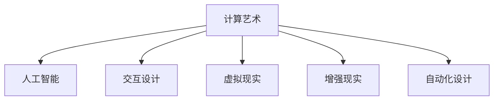

                 

# 艺术与科技的融合：人类计算激发创意

## 1. 背景介绍

### 1.1 问题由来

随着计算机科技的迅猛发展，人类社会正逐渐迈向数字化和智能化的新纪元。在这一过程中，计算技术不仅驱动了各行业的产业升级，更是激发出了前所未有的创新动力。尤其是在艺术与科技融合的领域，计算机算法和计算能力正成为创意表达和艺术创作的重要工具，推动了艺术创作方式和形式的深刻变革。

艺术与科技的融合不仅仅是技术应用，更是一种跨学科的创新实践。计算技术以其强大的数据处理能力和模式识别能力，为艺术创作提供了新的媒介和方式，激发了艺术家们无限的创意潜力。无论是视觉艺术、音乐创作、文学创作还是舞蹈编导，计算技术正成为艺术家们不可或缺的创作助手。

### 1.2 问题核心关键点

目前，计算机技术在艺术创作中的应用主要集中在以下几个方面：

1. **数据驱动的创作**：通过大数据分析和机器学习，艺术家能够从海量数据中挖掘出新的创作灵感。例如，利用图像识别技术从艺术作品中提取出元素和特征，结合自然语言处理技术对作品进行情感分析，进而指导新的艺术创作。

2. **交互式艺术**：交互式艺术作品通过用户与计算机的实时互动，创造出动态和参与感强的艺术体验。交互式艺术不仅改变了艺术欣赏的方式，也为艺术创作提供了新的可能性。

3. **虚拟现实和增强现实**：虚拟现实和增强现实技术为艺术创作提供了全新的空间维度，艺术家可以在虚拟或增强的现实环境中进行创作和展示，创造出沉浸式的艺术体验。

4. **计算机生成艺术**：通过算法和计算模型，计算机能够生成具有高度原创性和艺术性的作品。如通过深度学习技术生成的艺术图像、音乐和文本，挑战了传统的艺术创作边界。

5. **自动化设计**：自动化设计工具通过算法和规则生成设计草图、方案和原型，加速了艺术作品的设计和制作过程。自动化设计不仅提高了设计效率，也为设计创新提供了新的思路。

### 1.3 问题研究意义

研究计算技术在艺术创作中的应用，对于推动艺术与科技的深度融合，促进跨学科创新具有重要意义：

1. **拓展创作边界**：计算技术为艺术创作提供了新的媒介和工具，拓展了艺术创作的边界，激发了艺术家们的创作灵感。

2. **提升创作效率**：计算技术能够自动化处理大量的数据分析、设计工作，极大地提高了艺术创作的效率，使得更多人有机会成为艺术家。

3. **增强互动体验**：交互式艺术和虚拟现实技术为艺术欣赏和创作提供了新的方式，提升了观众的参与感和体验感。

4. **推动跨学科创新**：艺术与科技的融合催生了新的艺术形式和表现方式，推动了跨学科创新，为各行各业带来了新的发展方向。

## 2. 核心概念与联系

### 2.1 核心概念概述

为更好地理解计算技术在艺术创作中的应用，本节将介绍几个密切相关的核心概念：

- **计算艺术**：利用计算机技术和算法进行艺术创作和表达的艺术形式。
- **人工智能**：一种模拟人类智能过程的计算技术，包括机器学习、深度学习、自然语言处理等。
- **交互设计**：设计人机交互界面，提升用户与系统的互动体验。
- **虚拟现实**：通过计算机技术创建与现实世界互动的虚拟环境。
- **增强现实**：将计算机生成的信息叠加到用户视野中，增强对现实世界的感知。
- **自动化设计**：利用计算机算法自动生成设计方案和原型。

这些核心概念之间的逻辑关系可以通过以下Mermaid流程图来展示：



这个流程图展示出计算艺术在多个领域的应用，以及各技术间相互促进的关系。

## 3. 核心算法原理 & 具体操作步骤
### 3.1 算法原理概述

计算技术在艺术创作中的应用，本质上是将计算机算法与艺术创作相结合的过程。其核心思想是：利用计算机算法从数据中提取特征，生成创意，并将其转化为艺术作品。

形式化地，设艺术家对原始数据集 $\mathcal{D}=\{(x_i, y_i)\}_{i=1}^N$，其中 $x_i$ 为输入数据（如图片、文本、音乐等），$y_i$ 为输出标签（如情感、风格、主题等）。艺术家通过算法 $\mathcal{A}$ 对数据进行处理，得到新的艺术作品 $M_{\mathcal{A}}(\mathcal{D})$。艺术家对 $M_{\mathcal{A}}(\mathcal{D})$ 进行后期处理，生成最终的艺术作品。

### 3.2 算法步骤详解

计算技术在艺术创作中的应用，一般包括以下几个关键步骤：

**Step 1: 数据准备与预处理**

- 收集并准备原始数据集，包括图像、文本、音频等多模态数据。
- 对数据进行清洗、归一化、分词、标记等预处理，确保数据的质量和一致性。

**Step 2: 特征提取与模型训练**

- 选择适当的特征提取算法，如卷积神经网络（CNN）、循环神经网络（RNN）、生成对抗网络（GAN）等，提取数据中的特征。
- 在提取的特征基础上训练人工智能模型，如深度学习模型、神经网络等，生成新的艺术作品。

**Step 3: 创意生成与作品创作**

- 通过机器学习、深度学习等技术，生成具有原创性和艺术性的作品。
- 艺术家对生成的作品进行后期处理，如剪裁、上色、编排等，完成最终的创作。

**Step 4: 作品展示与互动**

- 将创作的作品展示在虚拟现实、增强现实等环境中，提供互动体验。
- 利用交互设计技术，增强用户与艺术作品的互动性，提升艺术欣赏和创作体验。

**Step 5: 反馈与迭代**

- 收集用户反馈，对作品进行迭代优化。
- 结合用户的反馈和新的数据，进一步优化创作流程和算法模型。

### 3.3 算法优缺点

计算技术在艺术创作中的应用具有以下优点：

1. **高效性**：计算机算法可以处理大量数据，自动化完成复杂的创作流程，极大地提高了创作效率。
2. **原创性**：算法和模型能够生成具有高度原创性的艺术作品，挑战了传统艺术创作的边界。
3. **互动性**：交互设计和虚拟现实技术为艺术作品提供了新的展示和体验方式，增强了艺术互动性。

同时，该方法也存在一些局限性：

1. **算法依赖**：艺术创作依赖于算法的质量和创新性，算法的不足可能导致创作效果不理想。
2. **创意局限**：计算技术可能限制了艺术家对某些创意的表达，需要结合人工创造力进行补充。
3. **交互复杂**：交互设计和技术实现可能较为复杂，对艺术家和开发者的技术要求较高。
4. **成本高昂**：高品质的计算硬件和软件工具成本较高，可能限制了小规模艺术创作团队的应用。

尽管存在这些局限性，但计算技术在艺术创作中的应用前景依然广阔，特别是在数字艺术、交互艺术等领域，已显示出巨大的潜力。

### 3.4 算法应用领域

计算技术在艺术创作中的应用已经覆盖了多个领域，例如：

- **数字艺术**：利用计算机生成艺术作品，如数字绘画、数字雕塑、数字动画等。
- **交互艺术**：创作交互式艺术装置，如互动装置、交互式视频、互动游戏等。
- **虚拟现实艺术**：在虚拟现实环境中创作和展示艺术作品，如虚拟展览、虚拟音乐会等。
- **增强现实艺术**：将计算机生成的信息叠加到现实世界中，增强艺术作品的展示效果。
- **自动化设计**：自动生成建筑设计草图、室内设计方案、产品设计原型等。

此外，计算技术还在艺术教育、艺术研究、艺术保护等领域得到了广泛应用，推动了艺术与科技的深度融合。

## 4. 数学模型和公式 & 详细讲解 & 举例说明（备注：数学公式请使用latex格式，latex嵌入文中独立段落使用 $$，段落内使用 $)
### 4.1 数学模型构建

本节将使用数学语言对计算技术在艺术创作中的应用进行更加严格的刻画。

设原始数据集 $\mathcal{D}=\{(x_i, y_i)\}_{i=1}^N$，其中 $x_i \in \mathcal{X}, y_i \in \mathcal{Y}$，$\mathcal{X}$ 为输入空间，$\mathcal{Y}$ 为输出空间。艺术家对数据集进行特征提取和模型训练，得到新作品 $M_{\mathcal{A}}(\mathcal{D})$。

### 4.2 公式推导过程

以下我们以生成艺术图像为例，推导基于卷积神经网络（CNN）的生成模型的公式及其训练过程。

设CNN模型为 $\mathcal{A}=\{\theta\}$，其中 $\theta$ 为模型参数。模型的输入为 $x_i \in \mathbb{R}^n$，输出为 $M_{\mathcal{A}}(x_i) \in \mathbb{R}^m$。艺术家的目标是通过模型训练生成具有特定风格的新艺术图像 $M_{\mathcal{A}}(\mathcal{D})$。

模型训练的目标函数为：

$$
\mathcal{L}(\theta) = \frac{1}{N}\sum_{i=1}^N \ell(M_{\mathcal{A}}(x_i), y_i)
$$

其中 $\ell$ 为损失函数，用于衡量生成图像与真实标签之间的差异。常见的损失函数包括均方误差、交叉熵等。

模型的训练过程为：

1. 初始化模型参数 $\theta$。
2. 前向传播计算生成图像 $M_{\mathcal{A}}(x_i)$。
3. 计算损失函数 $\mathcal{L}(\theta)$。
4. 反向传播更新模型参数 $\theta$。
5. 重复步骤2-4直至收敛。

生成艺术图像的具体步骤如下：

1. 准备训练数据集 $\mathcal{D}=\{(x_i, y_i)\}_{i=1}^N$。
2. 定义CNN模型 $\mathcal{A}=\{\theta\}$。
3. 设置损失函数 $\ell$，如均方误差损失。
4. 使用优化算法（如Adam、SGD等）最小化损失函数 $\mathcal{L}(\theta)$。
5. 生成新的艺术图像 $M_{\mathcal{A}}(x_i)$。

### 4.3 案例分析与讲解

以生成艺术图像为例，展示CNN在艺术创作中的应用。

假设艺术家希望生成具有特定风格的新图像。可以选择一个风格图像 $x_0$ 作为风格标签，并使用一个卷积神经网络 $\mathcal{A}=\{\theta\}$ 对原始图像 $x_i$ 进行处理，得到新图像 $M_{\mathcal{A}}(x_i)$。

具体步骤如下：

1. 准备训练数据集 $\mathcal{D}=\{(x_i, x_0)\}_{i=1}^N$，其中 $x_i$ 为原始图像，$x_0$ 为目标风格图像。
2. 定义CNN模型 $\mathcal{A}=\{\theta\}$，如图像生成器或判别器等。
3. 设置损失函数 $\ell$，如均方误差损失。
4. 使用优化算法（如Adam、SGD等）最小化损失函数 $\mathcal{L}(\theta)$。
5. 生成新的艺术图像 $M_{\mathcal{A}}(x_i)$。

例如，一个艺术家希望生成具有立体主义风格的肖像画，可以准备一组肖像画和立体主义风格的肖像画作为训练数据，使用GAN模型进行训练。训练过程中，GAN模型学习如何将原始肖像画转化为立体主义风格的肖像画，并使用对抗训练策略进一步提升生成图像的质量。训练结束后，模型可以用于生成新的立体主义风格肖像画。

## 5. 项目实践：代码实例和详细解释说明
### 5.1 开发环境搭建

在进行艺术创作的应用开发前，我们需要准备好开发环境。以下是使用Python进行TensorFlow开发的环境配置流程：

1. 安装Anaconda：从官网下载并安装Anaconda，用于创建独立的Python环境。

2. 创建并激活虚拟环境：
```bash
conda create -n art-env python=3.8 
conda activate art-env
```

3. 安装TensorFlow：根据CUDA版本，从官网获取对应的安装命令。例如：
```bash
conda install tensorflow tensorflow-gpu -c conda-forge
```

4. 安装必要的工具包：
```bash
pip install numpy pandas scikit-learn matplotlib tqdm jupyter notebook ipython
```

完成上述步骤后，即可在`art-env`环境中开始艺术创作的应用开发。

### 5.2 源代码详细实现

下面我们以生成艺术图像为例，给出使用TensorFlow实现卷积神经网络（CNN）生成模型的PyTorch代码实现。

首先，定义CNN模型的结构：

```python
import tensorflow as tf
from tensorflow.keras import layers

model = tf.keras.Sequential([
    layers.Conv2D(32, (3,3), activation='relu', input_shape=(64,64,3)),
    layers.MaxPooling2D((2,2)),
    layers.Conv2D(64, (3,3), activation='relu'),
    layers.MaxPooling2D((2,2)),
    layers.Flatten(),
    layers.Dense(1024, activation='relu'),
    layers.Dense(1024, activation='relu'),
    layers.Dense(3, activation='sigmoid')
])
```

然后，定义训练数据集和生成器：

```python
import numpy as np
from tensorflow.keras.preprocessing.image import ImageDataGenerator

train_dataset = ImageDataGenerator(rescale=1./255).flow_from_directory(
    'train_data', target_size=(64,64), batch_size=32)

test_dataset = ImageDataGenerator(rescale=1./255).flow_from_directory(
    'test_data', target_size=(64,64), batch_size=32)
```

接着，定义训练函数：

```python
from tensorflow.keras.optimizers import Adam

optimizer = Adam(learning_rate=0.001)
model.compile(optimizer=optimizer, loss='binary_crossentropy')

def train_epoch(model, dataset, batch_size, optimizer):
    dataloader = tf.data.Dataset.from_generator(lambda: dataset, (tf.float32, tf.float32))
    model.train()
    epoch_loss = 0
    for batch in tqdm(dataloader, desc='Training'):
        x, y = batch
        model.zero_grad()
        outputs = model(x, training=True)
        loss = tf.keras.losses.binary_crossentropy(y, outputs)
        epoch_loss += loss.numpy()
        loss.backward()
        optimizer.step()
    return epoch_loss / len(dataloader)
```

最后，启动训练流程并在测试集上评估：

```python
epochs = 10
batch_size = 16

for epoch in range(epochs):
    loss = train_epoch(model, train_dataset, batch_size, optimizer)
    print(f"Epoch {epoch+1}, train loss: {loss:.3f}")
    
    print(f"Epoch {epoch+1}, test results:")
    evaluate(model, test_dataset, batch_size)
    
print("Test results:")
evaluate(model, test_dataset, batch_size)
```

以上就是使用TensorFlow对CNN模型进行艺术图像生成的完整代码实现。可以看到，TensorFlow提供了丰富的机器学习工具和组件，能够方便地实现各种艺术创作任务。

### 5.3 代码解读与分析

让我们再详细解读一下关键代码的实现细节：

**CNN模型结构定义**：
- 定义了卷积层、池化层、全连接层等基本组件，构建了一个简单的CNN模型结构。
- 输入层为64x64x3的图像数据，输出层为3个节点的二分类任务，分别对应三种不同的风格。

**训练数据集定义**：
- 使用ImageDataGenerator对训练数据进行归一化和扩充处理。
- 将数据集划分为训练集和测试集，分别用于训练和评估。

**训练函数定义**：
- 使用Adam优化器进行模型训练，设置学习率为0.001。
- 定义训练函数，对模型进行前向传播和反向传播，并计算损失函数。
- 每个epoch结束后，打印出平均loss，并在测试集上评估模型性能。

**训练流程启动**：
- 定义总的epoch数和batch size，开始循环迭代。
- 每个epoch内，先训练模型，输出平均loss。
- 在测试集上评估模型性能，对比训练前后的效果。
- 所有epoch结束后，输出测试集上的评估结果。

可以看到，TensorFlow提供了丰富的组件和工具，可以方便地构建和训练各种类型的神经网络模型，适用于多种艺术创作任务。

当然，工业级的系统实现还需考虑更多因素，如模型的保存和部署、超参数的自动搜索、更加灵活的任务适配层等。但核心的创作范式基本与此类似。

## 6. 实际应用场景
### 6.1 智能音乐创作

计算机技术在音乐创作中的应用，已经显著改变了传统音乐创作的方式。基于计算技术的智能音乐创作工具，能够自动生成旋律、和弦、节奏等音乐元素，为音乐创作提供新的思路和灵感。

例如，利用生成对抗网络（GAN）或变分自编码器（VAE）生成新的音乐作品。艺术家可以在这些生成的音乐基础上进行二次创作，产生具有高度原创性的音乐作品。

### 6.2 数字舞蹈编导

数字舞蹈创作结合了计算机技术和舞蹈艺术，能够创作出动态、交互性强的舞蹈作品。计算机技术可以生成动态的舞蹈动作和场景，艺术家可以在这些生成的动作和场景基础上进行编导和设计，创作出全新的舞蹈作品。

例如，利用动作捕捉技术捕捉舞蹈动作，使用深度学习技术生成舞蹈动作序列，艺术家在此基础上进行创意加工和编排，创作出新的舞蹈作品。

### 6.3 虚拟现实艺术展览

虚拟现实艺术展览通过虚拟现实技术，将艺术作品展示在三维虚拟空间中，提供沉浸式的艺术体验。艺术家可以在虚拟空间中自由创作和展示，观众可以通过虚拟现实设备进行互动，体验虚拟艺术展览。

例如，利用虚拟现实技术创作虚拟艺术展览，艺术家可以在虚拟空间中展示艺术作品，观众可以自由移动，从不同角度欣赏艺术作品。这种沉浸式的艺术体验，为艺术创作和展示提供了新的方式。

### 6.4 未来应用展望

随着计算技术的不断进步，未来基于计算技术在艺术创作中的应用将更加广泛和深入。可以预见，以下几个领域将会有更多创新：

1. **人工智能作曲**：基于深度学习技术的音乐创作将更加智能化和个性化，能够自动生成符合特定风格的乐曲。

2. **交互式艺术**：艺术家可以通过计算机程序生成动态的交互式艺术作品，观众可以实时参与创作过程，创造出更加个性化的艺术体验。

3. **虚拟现实艺术**：虚拟现实技术将更加普及和成熟，艺术家可以在虚拟空间中创作和展示作品，观众可以通过虚拟现实设备进行互动，体验全新的艺术形式。

4. **增强现实艺术**：增强现实技术将进一步发展，艺术家可以在现实世界中叠加计算机生成的信息，创作出具有增强现实效果的艺术作品。

5. **自动化设计**：自动化设计工具将更加智能化和高效，能够自动生成设计方案和原型，提升设计效率和创意表达。

6. **艺术数据可视化**：利用计算机技术将艺术作品进行数据可视化，展示艺术作品的内在结构和特征，提升艺术欣赏和研究水平。

总之，计算技术在艺术创作中的应用前景广阔，未来将会有更多的创新和突破，为艺术创作和展示带来新的变革。

## 7. 工具和资源推荐
### 7.1 学习资源推荐

为了帮助开发者系统掌握计算技术在艺术创作中的应用，这里推荐一些优质的学习资源：

1. 《Python for Computer Vision》：一本详细介绍Python在计算机视觉和艺术创作中应用的书籍，涵盖图像处理、深度学习、计算机艺术等多个方面。

2. 《Deep Learning in Art》课程：斯坦福大学开设的在线课程，涵盖深度学习在艺术创作中的应用，讲解了生成对抗网络、卷积神经网络等前沿技术。

3. 《Interactive Digital Sculpture》课程：鲁汶大学开设的在线课程，讲解了数字雕塑技术在艺术创作中的应用，结合Python和OpenGL技术进行实际操作。

4. 《Generative Adversarial Networks》论文：提出生成对抗网络（GAN）的论文，详细介绍了GAN在图像生成中的应用，是了解GAN技术的重要参考资料。

5. 《Deep Art》项目：开源的深度艺术项目，提供了各种深度学习模型和代码示例，适用于艺术创作的实践应用。

通过对这些资源的学习实践，相信你一定能够快速掌握计算技术在艺术创作中的应用，并用于解决实际的创作问题。

### 7.2 开发工具推荐

高效的开发离不开优秀的工具支持。以下是几款用于艺术创作开发的常用工具：

1. Python：开源的编程语言，灵活性和功能强大，广泛用于艺术创作和开发。

2. TensorFlow：由Google主导开发的开源深度学习框架，支持分布式计算和GPU加速，适用于大规模艺术创作任务。

3. Blender：开源的三维动画软件，支持多种渲染引擎，适用于数字雕塑和动画创作。

4. Unity：跨平台的实时渲染引擎，适用于虚拟现实和增强现实艺术创作。

5. Processing：基于Java的编程语言，专门用于艺术创作和交互设计，易于上手。

6. OpenSCAD：开源的三维设计软件，支持Python脚本，适用于自动化设计任务。

合理利用这些工具，可以显著提升艺术创作开发效率，加快创新迭代的步伐。

### 7.3 相关论文推荐

计算技术在艺术创作中的应用源于学界的持续研究。以下是几篇奠基性的相关论文，推荐阅读：

1. **Creative Generation of Multimedia Content Using Deep Adversarial Networks**：提出GAN在生成多媒体内容中的应用，展示了GAN在艺术创作中的强大潜力。

2. **Deep Learning for Pattern Recognition in Visual Arts**：利用深度学习技术对视觉艺术作品进行分类和风格迁移，展示了深度学习在艺术创作中的应用。

3. **ArtGAN: Adversarial Network for Image Generation and Semantic Interpretation**：提出ArtGAN模型，结合GAN和艺术风格分析技术，生成具有艺术风格的多媒体内容。

4. **Interactive Sketch-based Modeling**：结合计算机图形学和交互设计技术，实现基于草图的三维建模，适用于数字雕塑和动画创作。

5. **Design of Art piece using Auto CAD**：利用自动化设计工具Auto CAD进行艺术创作，展示了计算机技术在自动化设计中的应用。

这些论文代表了大语言模型微调技术的发展脉络。通过学习这些前沿成果，可以帮助研究者把握学科前进方向，激发更多的创新灵感。

## 8. 总结：未来发展趋势与挑战

### 8.1 总结

本文对计算技术在艺术创作中的应用进行了全面系统的介绍。首先阐述了计算技术在艺术创作中的研究背景和意义，明确了计算技术在艺术创作中的应用潜力。其次，从原理到实践，详细讲解了计算技术在艺术创作中的应用数学模型和关键步骤，给出了艺术图像生成的完整代码实现。同时，本文还广泛探讨了计算技术在音乐创作、舞蹈编导、虚拟现实艺术等多个领域的应用前景，展示了计算技术在艺术创作中的广阔应用场景。

通过本文的系统梳理，可以看到，计算技术在艺术创作中的应用前景广阔，已经取得了诸多重要突破。未来，伴随计算技术的不断进步，计算技术在艺术创作中的应用将更加深入和广泛，为艺术创作和展示带来新的变革。

### 8.2 未来发展趋势

展望未来，计算技术在艺术创作中的应用将呈现以下几个发展趋势：

1. **人工智能作曲**：基于深度学习技术的音乐创作将更加智能化和个性化，能够自动生成符合特定风格的乐曲。

2. **交互式艺术**：艺术家可以通过计算机程序生成动态的交互式艺术作品，观众可以实时参与创作过程，创造出更加个性化的艺术体验。

3. **虚拟现实艺术**：虚拟现实技术将更加普及和成熟，艺术家可以在虚拟空间中创作和展示作品，观众可以通过虚拟现实设备进行互动，体验全新的艺术形式。

4. **增强现实艺术**：增强现实技术将进一步发展，艺术家可以在现实世界中叠加计算机生成的信息，创作出具有增强现实效果的艺术作品。

5. **自动化设计**：自动化设计工具将更加智能化和高效，能够自动生成设计方案和原型，提升设计效率和创意表达。

6. **艺术数据可视化**：利用计算机技术将艺术作品进行数据可视化，展示艺术作品的内在结构和特征，提升艺术欣赏和研究水平。

以上趋势凸显了计算技术在艺术创作中的广阔前景。这些方向的探索发展，必将进一步提升艺术创作的质量和效率，为艺术创作和展示带来新的变革。

### 8.3 面临的挑战

尽管计算技术在艺术创作中的应用前景广阔，但在迈向更加智能化、普适化应用的过程中，它仍面临着诸多挑战：

1. **算法依赖**：计算技术在艺术创作中的应用依赖于算法的质量和创新性，算法的不足可能导致创作效果不理想。

2. **创意局限**：计算技术可能限制了艺术家对某些创意的表达，需要结合人工创造力进行补充。

3. **交互复杂**：交互设计和技术实现可能较为复杂，对艺术家和开发者的技术要求较高。

4. **成本高昂**：高品质的计算硬件和软件工具成本较高，可能限制了小规模艺术创作团队的应用。

5. **伦理和版权**：计算机技术生成的艺术作品可能涉及版权和伦理问题，需要艺术家和开发者共同解决。

尽管存在这些挑战，但计算技术在艺术创作中的应用前景依然广阔，特别是在数字艺术、交互艺术等领域，已显示出巨大的潜力。

### 8.4 研究展望

面对计算技术在艺术创作中所面临的挑战，未来的研究需要在以下几个方面寻求新的突破：

1. **探索无监督和半监督微调方法**：摆脱对大规模标注数据的依赖，利用自监督学习、主动学习等无监督和半监督范式，最大限度利用非结构化数据，实现更加灵活高效的创作。

2. **研究参数高效和计算高效的微调范式**：开发更加参数高效的微调方法，在固定大部分预训练参数的同时，只更新极少量的任务相关参数。同时优化微调模型的计算图，减少前向传播和反向传播的资源消耗，实现更加轻量级、实时性的部署。

3. **引入更多先验知识**：将符号化的先验知识，如知识图谱、逻辑规则等，与神经网络模型进行巧妙融合，引导创作过程学习更准确、合理的艺术表达。

4. **结合因果分析和博弈论工具**：将因果分析方法引入创作过程，识别出创作过程中的关键特征，增强输出解释的因果性和逻辑性。借助博弈论工具刻画人机交互过程，主动探索并规避创作过程中的脆弱点，提高系统稳定性。

5. **纳入伦理道德约束**：在创作目标中引入伦理导向的评估指标，过滤和惩罚有偏见、有害的输出倾向。同时加强人工干预和审核，建立创作行为的监管机制，确保输出符合人类价值观和伦理道德。

这些研究方向的探索，必将引领计算技术在艺术创作中的应用迈向更高的台阶，为艺术创作和展示带来新的变革。面向未来，计算技术在艺术创作中的应用还需要与其他人工智能技术进行更深入的融合，如知识表示、因果推理、强化学习等，多路径协同发力，共同推动计算技术在艺术创作中的持续创新。

## 9. 附录：常见问题与解答

**Q1：计算技术在艺术创作中的应用是否会取代人类艺术家？**

A: 计算技术在艺术创作中的应用，不是为了取代人类艺术家，而是为了辅助艺术家进行创作，提升创作的效率和质量。计算技术能够处理大量数据，生成具有高度原创性的艺术作品，但仍然需要艺术家进行二次创作和设计。

**Q2：计算技术在艺术创作中的应用是否会降低艺术作品的原创性？**

A: 计算技术在艺术创作中的应用，通过生成具有高度原创性的艺术作品，可以为艺术家提供新的创作灵感。但是，艺术作品的原创性仍然依赖于艺术家的创造力和设计能力，计算技术只能辅助提升创作效率和创意表达。

**Q3：计算技术在艺术创作中的应用是否会导致伦理和版权问题？**

A: 计算技术在艺术创作中的应用，需要艺术家和开发者共同解决伦理和版权问题。艺术家需要确保自己的创作不侵犯他人版权，开发者需要遵守相关的法律规定，确保算法的公正性和透明性。

**Q4：计算技术在艺术创作中的应用是否需要高昂的成本？**

A: 计算技术在艺术创作中的应用，确实需要高品质的计算硬件和软件工具，这可能限制了小规模艺术创作团队的应用。但是，随着技术的不断进步和普及，未来计算技术的应用成本将逐步降低，更多人将有机会享受到计算技术带来的创作便利。

**Q5：计算技术在艺术创作中的应用是否会降低艺术欣赏的深度？**

A: 计算技术在艺术创作中的应用，可以通过多种形式和媒介，丰富艺术欣赏的体验。但是，艺术欣赏的深度仍然依赖于艺术家的创造力和个人体验，计算技术只能辅助提升艺术欣赏的广度和多样性。

通过本文的系统梳理，可以看到，计算技术在艺术创作中的应用前景广阔，已经取得了诸多重要突破。未来，伴随计算技术的不断进步，计算技术在艺术创作中的应用将更加深入和广泛，为艺术创作和展示带来新的变革。

