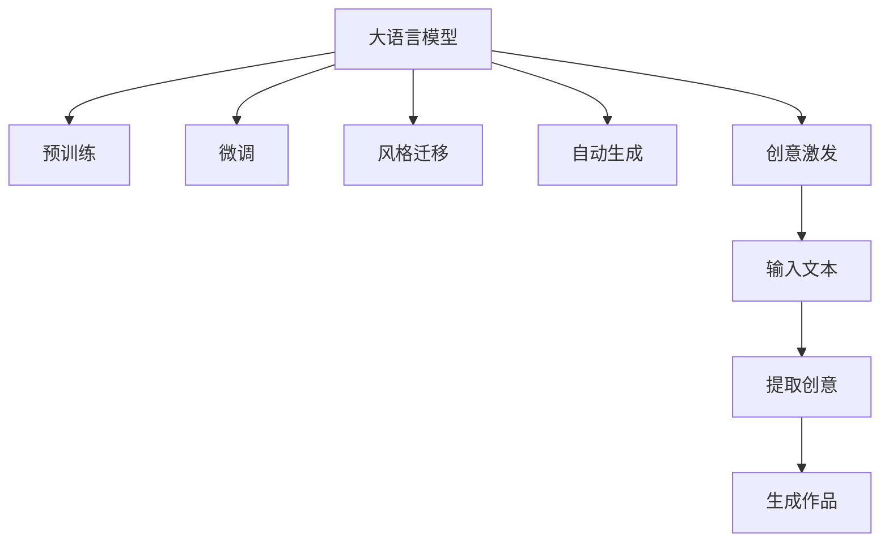

                 

# 艺术创作助手：LLM 激发创意

> 关键词：语言模型,艺术创作,创意激发,深度学习,自然语言处理(NLP)

## 1. 背景介绍

### 1.1 问题由来
在现代社会，艺术创作不仅是纯粹的个人情感表达，更成为了一种交流方式、商业活动乃至文化现象。然而，创意的涌现往往难以预测，创作过程充满了不确定性和随机性。如何利用技术手段激发、引导和促进艺术创作，是一个古老而新颖的课题。

近年来，随着深度学习和大语言模型（LLM）技术的飞速发展，研究人员发现，这些模型在处理文本生成、图像生成、音乐创作等艺术创作领域展现出巨大的潜力。特别是预训练语言模型（如GPT-3、DALL-E、WaveNet等），通过对海量数据的自我训练，已经能够生成高质量的文本、图像和音频作品，甚至创作出超过人类水准的艺术品。因此，基于大语言模型的艺术创作助手成为了当前人工智能研究的热点。

### 1.2 问题核心关键点
在基于大语言模型的艺术创作助手中，核心关键点包括以下几个方面：

1. **创意激发**：利用深度学习技术，分析文本、图像、音频等多模态数据，发现其中隐含的创意和模式，激发创作灵感。
2. **自动生成**：根据用户需求和输入数据，自动生成符合用户期望的艺术作品，如文本、图像、音乐等。
3. **风格迁移**：将一个艺术家的风格迁移到另一个艺术家的作品上，实现创作风格的多样化。
4. **编辑与修改**：对生成的艺术作品进行编辑和修改，提升创作质量。
5. **交互式创作**：利用人机交互技术，增强创作过程的互动性和可控性。

这些关键点不仅涉及深度学习、自然语言处理(NLP)、计算机视觉和音频处理等多个领域，还与艺术理论、心理学等多学科交叉，需要系统化、综合化的解决方案。

## 2. 核心概念与联系

### 2.1 核心概念概述

为更好地理解基于大语言模型的艺术创作助手，本节将介绍几个密切相关的核心概念：

- **大语言模型(Large Language Model, LLM)**：指使用大规模语料进行自我训练，具备自然语言理解和生成能力的深度学习模型，如GPT-3、BERT等。
- **预训练(Pre-training)**：指在大规模无标签数据上进行的自我训练过程，通过自监督任务（如语言建模、掩码语言建模等）学习语言的基本规则和常识。
- **微调(Fine-tuning)**：指在预训练模型的基础上，使用小规模标注数据对模型进行优化，使其适应特定任务或风格。
- **风格迁移(Style Transfer)**：指将一个艺术家作品的风格迁移到另一个作品上，生成新的艺术作品。
- **自动生成(Automatic Generation)**：指利用模型自动生成符合特定风格或主题的艺术作品，如文本、图像、音乐等。
- **创意激发(Creative Inspiration)**：指利用模型分析、提取文本、图像中的创意元素，激发艺术家的创作灵感。

这些核心概念之间的逻辑关系可以通过以下Mermaid流程图来展示：



这个流程图展示了大语言模型的核心概念及其之间的关系：

1. 大语言模型通过预训练获得基础能力。
2. 微调优化模型以适应特定任务或风格。
3. 风格迁移实现作品风格的迁移。
4. 自动生成生成符合特定风格或主题的作品。
5. 创意激发分析并提取输入文本中的创意元素。

这些概念共同构成了基于大语言模型的艺术创作助手的技术框架，使其能够应用于文本、图像、音乐等多种艺术形式。

## 3. 核心算法原理 & 具体操作步骤

### 3.1 算法原理概述

基于大语言模型的艺术创作助手，本质上是将大语言模型作为"创意生成器"，通过输入文本、图像、音频等多种艺术形式的数据，自动生成符合特定风格或主题的艺术作品。核心算法包括以下几个步骤：

1. **输入数据处理**：将输入的文本、图像、音频等数据进行预处理，提取特征向量，供大语言模型理解。
2. **大语言模型理解**：将处理后的数据输入大语言模型，模型通过自我训练获得的多模态特征分析能力，理解输入数据的含义。
3. **风格迁移与自动生成**：根据用户需求或预设的风格，利用大语言模型对生成的作品进行风格迁移或自动生成。
4. **创意激发**：分析输入数据中的创意元素，提取灵感，供艺术家参考。
5. **输出作品与反馈**：将生成或编辑的作品输出给艺术家，艺术家基于作品反馈进一步创作，形成交互式创作过程。

### 3.2 算法步骤详解

#### 3.2.1 输入数据处理

输入数据处理是艺术创作助手的第一步，需要将文本、图像、音频等多模态数据转化为模型可接受的格式。具体步骤如下：

- **文本处理**：将输入的文本数据进行分词、去除停用词、标准化等预处理操作，得到模型可接受的输入。
- **图像处理**：对输入的图像数据进行缩放、裁剪、归一化等预处理，得到模型可接受的输入。
- **音频处理**：对输入的音频数据进行采样、分割、归一化等预处理，得到模型可接受的输入。

#### 3.2.2 大语言模型理解

大语言模型理解是艺术创作助手的核心步骤，通过模型分析输入数据，提取关键特征和创意元素。具体步骤如下：

- **模型选择**：根据任务特点选择合适的预训练大语言模型，如GPT-3、BERT等。
- **输入数据编码**：将处理后的文本、图像、音频等数据编码成模型可理解的格式，供模型分析。
- **特征提取**：利用模型对输入数据进行分析，提取关键特征和创意元素。

#### 3.2.3 风格迁移与自动生成

风格迁移与自动生成是艺术创作助手的关键步骤，通过模型自动生成或迁移作品风格，满足用户需求。具体步骤如下：

- **风格定义**：根据用户需求或预设的风格，定义生成或迁移的目标风格。
- **模型调用**：将提取的关键特征输入大语言模型，生成符合目标风格的作品。
- **风格迁移**：利用模型将作品的风格迁移到预设的风格上，生成新的艺术作品。

#### 3.2.4 创意激发

创意激发是艺术创作助手的补充步骤，通过模型分析输入数据中的创意元素，激发艺术家的创作灵感。具体步骤如下：

- **创意分析**：利用模型分析输入数据中的创意元素，提取灵感。
- **创意呈现**：将提取的创意元素呈现给艺术家，供其参考创作。

#### 3.2.5 输出作品与反馈

输出作品与反馈是艺术创作助手的最终步骤，将生成或编辑的作品输出给艺术家，艺术家基于作品反馈进一步创作。具体步骤如下：

- **作品输出**：将生成或编辑的作品输出给艺术家，供其参考。
- **艺术家创作**：艺术家基于作品反馈，进行进一步创作。
- **作品反馈**：艺术家对作品进行反馈，指导模型进行调整。

### 3.3 算法优缺点

基于大语言模型的艺术创作助手，具有以下优点：

1. **高效性**：模型能够快速生成符合特定风格或主题的作品，显著提高创作效率。
2. **多样性**：模型可以生成多种类型的艺术作品，如文本、图像、音乐等，满足不同艺术形式的需求。
3. **交互性**：通过交互式创作过程，艺术家可以实时反馈，指导模型进行调整，提升创作质量。
4. **可扩展性**：模型可以扩展到多种艺术形式和创作风格，灵活性高。

同时，该方法也存在以下缺点：

1. **创作质量的不确定性**：尽管模型能够自动生成作品，但作品的质量和风格仍然依赖于模型训练数据的多样性和丰富性。
2. **创意元素的局限性**：模型对创意元素的分析能力有限，可能无法完全捕捉艺术家的独特创意。
3. **依赖艺术家反馈**：艺术创作过程仍然需要艺术家的参与和指导，无法完全替代人类创造。
4. **伦理和版权问题**：自动生成的作品可能涉及版权和伦理问题，需要进一步研究和规范。

尽管存在这些局限性，但就目前而言，基于大语言模型的艺术创作助手已经在艺术创作领域展现出巨大的潜力，成为推动艺术创作技术进步的重要手段。

### 3.4 算法应用领域

基于大语言模型的艺术创作助手，已经广泛应用于文本、图像、音乐等多种艺术形式，具体应用领域包括：

- **文本创作**：自动生成诗歌、小说、剧本等文本作品。
- **图像生成**：自动生成绘画、摄影、动画等图像作品。
- **音乐创作**：自动生成音乐、歌词等作品。
- **视频编辑**：自动生成短片、MV等视频作品。
- **互动艺术**：自动生成交互式艺术作品，如虚拟现实(VR)、增强现实(AR)等。

## 4. 数学模型和公式 & 详细讲解

### 4.1 数学模型构建

在基于大语言模型的艺术创作助手中，数学模型主要集中在特征提取和风格迁移两个环节。下面以文本创作和图像生成为例，详细讲解其数学模型构建。

#### 4.1.1 文本创作

文本创作的数学模型主要基于自然语言处理(NLP)技术，通过模型对文本数据的理解和生成，自动生成符合特定风格或主题的作品。具体模型如下：

1. **文本编码**：将输入的文本数据编码成模型可理解的向量形式。
2. **模型理解**：利用大语言模型对编码后的文本向量进行分析，提取关键特征和创意元素。
3. **生成文本**：将提取的关键特征输入大语言模型，生成符合特定风格或主题的文本作品。

数学模型如下：

$$
\text{Encoding}(x) = \text{Encoder}(x)
$$

$$
\text{Understanding}(\text{Encoding}(x)) = \text{Model}(\text{Encoding}(x))
$$

$$
\text{Generating}(\text{Understanding}(\text{Encoding}(x))) = \text{Decoder}(\text{Understanding}(\text{Encoding}(x)))
$$

其中，$x$表示输入的文本数据，$\text{Encoder}$表示文本编码模型，$\text{Model}$表示大语言模型，$\text{Decoder}$表示文本生成模型。

#### 4.1.2 图像生成

图像生成的数学模型主要基于计算机视觉技术，通过模型对图像数据的理解和生成，自动生成符合特定风格或主题的图像作品。具体模型如下：

1. **图像编码**：将输入的图像数据编码成模型可理解的向量形式。
2. **模型理解**：利用大语言模型对编码后的图像向量进行分析，提取关键特征和创意元素。
3. **生成图像**：将提取的关键特征输入大语言模型，生成符合特定风格或主题的图像作品。

数学模型如下：

$$
\text{Encoding}(x) = \text{Encoder}(x)
$$

$$
\text{Understanding}(\text{Encoding}(x)) = \text{Model}(\text{Encoding}(x))
$$

$$
\text{Generating}(\text{Understanding}(\text{Encoding}(x))) = \text{Decoder}(\text{Understanding}(\text{Encoding}(x)))
$$

其中，$x$表示输入的图像数据，$\text{Encoder}$表示图像编码模型，$\text{Model}$表示大语言模型，$\text{Decoder}$表示图像生成模型。

### 4.2 公式推导过程

#### 4.2.1 文本创作

文本创作的公式推导主要基于自然语言处理(NLP)技术，通过模型对文本数据的理解和生成，自动生成符合特定风格或主题的作品。具体公式如下：

1. **文本编码**：将输入的文本数据编码成模型可理解的向量形式。
2. **模型理解**：利用大语言模型对编码后的文本向量进行分析，提取关键特征和创意元素。
3. **生成文本**：将提取的关键特征输入大语言模型，生成符合特定风格或主题的文本作品。

公式如下：

$$
\text{Encoding}(x) = \text{Encoder}(x)
$$

$$
\text{Understanding}(\text{Encoding}(x)) = \text{Model}(\text{Encoding}(x))
$$

$$
\text{Generating}(\text{Understanding}(\text{Encoding}(x))) = \text{Decoder}(\text{Understanding}(\text{Encoding}(x)))
$$

其中，$x$表示输入的文本数据，$\text{Encoder}$表示文本编码模型，$\text{Model}$表示大语言模型，$\text{Decoder}$表示文本生成模型。

#### 4.2.2 图像生成

图像生成的公式推导主要基于计算机视觉技术，通过模型对图像数据的理解和生成，自动生成符合特定风格或主题的图像作品。具体公式如下：

1. **图像编码**：将输入的图像数据编码成模型可理解的向量形式。
2. **模型理解**：利用大语言模型对编码后的图像向量进行分析，提取关键特征和创意元素。
3. **生成图像**：将提取的关键特征输入大语言模型，生成符合特定风格或主题的图像作品。

公式如下：

$$
\text{Encoding}(x) = \text{Encoder}(x)
$$

$$
\text{Understanding}(\text{Encoding}(x)) = \text{Model}(\text{Encoding}(x))
$$

$$
\text{Generating}(\text{Understanding}(\text{Encoding}(x))) = \text{Decoder}(\text{Understanding}(\text{Encoding}(x)))
$$

其中，$x$表示输入的图像数据，$\text{Encoder}$表示图像编码模型，$\text{Model}$表示大语言模型，$\text{Decoder}$表示图像生成模型。

### 4.3 案例分析与讲解

#### 4.3.1 文本创作案例

假设我们要自动生成一首符合特定风格的诗歌。首先，将输入的文本数据进行编码：

$$
\text{Encoding}(x) = \text{Encoder}(x)
$$

然后，利用大语言模型对编码后的文本向量进行分析，提取关键特征和创意元素：

$$
\text{Understanding}(\text{Encoding}(x)) = \text{Model}(\text{Encoding}(x))
$$

最后，将提取的关键特征输入文本生成模型，生成符合特定风格的诗歌：

$$
\text{Generating}(\text{Understanding}(\text{Encoding}(x))) = \text{Decoder}(\text{Understanding}(\text{Encoding}(x)))
$$

#### 4.3.2 图像生成案例

假设我们要自动生成一张符合特定风格的绘画。首先，将输入的图像数据进行编码：

$$
\text{Encoding}(x) = \text{Encoder}(x)
$$

然后，利用大语言模型对编码后的图像向量进行分析，提取关键特征和创意元素：

$$
\text{Understanding}(\text{Encoding}(x)) = \text{Model}(\text{Encoding}(x))
$$

最后，将提取的关键特征输入图像生成模型，生成符合特定风格的绘画：

$$
\text{Generating}(\text{Understanding}(\text{Encoding}(x))) = \text{Decoder}(\text{Understanding}(\text{Encoding}(x)))
$$

## 5. 项目实践：代码实例和详细解释说明

### 5.1 开发环境搭建

在进行基于大语言模型的艺术创作助手开发前，我们需要准备好开发环境。以下是使用Python进行PyTorch开发的环境配置流程：

1. 安装Anaconda：从官网下载并安装Anaconda，用于创建独立的Python环境。

2. 创建并激活虚拟环境：
```bash
conda create -n pytorch-env python=3.8 
conda activate pytorch-env
```

3. 安装PyTorch：根据CUDA版本，从官网获取对应的安装命令。例如：
```bash
conda install pytorch torchvision torchaudio cudatoolkit=11.1 -c pytorch -c conda-forge
```

4. 安装Transformers库：
```bash
pip install transformers
```

5. 安装各类工具包：
```bash
pip install numpy pandas scikit-learn matplotlib tqdm jupyter notebook ipython
```

完成上述步骤后，即可在`pytorch-env`环境中开始开发。

### 5.2 源代码详细实现

下面我们以文本创作助手为例，给出使用Transformers库对GPT-3模型进行文本创作助手的PyTorch代码实现。

首先，定义文本创作助手的输入和输出格式：

```python
from transformers import pipeline

text_generator = pipeline('text-generation', model='gpt-3')
```

然后，定义生成文本的函数：

```python
def generate_text(prompt, num_return_sequences=1):
    result = text_generator(prompt, num_return_sequences=num_return_sequences, max_length=100, temperature=0.7, do_sample=True)
    return [r['generated_text'] for r in result]
```

最后，启动生成文本的过程：

```python
prompt = "请用华尔街英语的写作风格描述你的日常生活。"
result = generate_text(prompt)
print(result)
```

以上就是使用PyTorch对GPT-3模型进行文本创作助手的完整代码实现。可以看到，得益于Transformers库的强大封装，我们可以用相对简洁的代码完成文本创作助手的开发。

### 5.3 代码解读与分析

让我们再详细解读一下关键代码的实现细节：

**Pipeline类**：
- `__init__`方法：初始化文本生成器，选择合适的预训练模型。
- `generate_text`方法：根据输入的prompt，调用文本生成器生成文本。

**generate_text函数**：
- `prompt`参数：输入的prompt文本，用于引导文本生成器生成符合特定风格的文本。
- `num_return_sequences`参数：返回的生成文本数量。
- `max_length`参数：生成的文本长度。
- `temperature`参数：生成文本时的随机性。
- `do_sample`参数：是否进行采样，开启采样后生成文本更具多样性。

**启动生成文本的过程**：
- 定义一个提示文本，描述生成文本的主题。
- 调用`generate_text`函数生成文本。
- 输出生成的文本结果。

可以看到，PyTorch配合Transformers库使得文本创作助手的代码实现变得简洁高效。开发者可以将更多精力放在任务适配、模型优化等高层逻辑上，而不必过多关注底层的实现细节。

当然，工业级的系统实现还需考虑更多因素，如模型的保存和部署、超参数的自动搜索、更灵活的任务适配层等。但核心的生成范式基本与此类似。

## 6. 实际应用场景

### 6.1 智能艺术创作平台

基于大语言模型的艺术创作助手，可以构建智能艺术创作平台，为艺术家提供创作灵感和自动化创作工具。平台可以整合多种艺术形式，如文本、图像、音乐等，为艺术家提供多样化的创作素材和创作风格选择。

在技术实现上，可以收集艺术家的作品和风格，训练模型对不同风格的识别能力。同时，将生成模型集成到平台中，艺术家可以根据需求生成符合特定风格的艺术作品。平台还可以提供评价反馈功能，艺术家可以实时对生成作品进行评价，指导模型进行优化。

### 6.2 虚拟艺术展览

虚拟艺术展览是艺术创作助手的一个重要应用场景，通过虚拟现实(VR)、增强现实(AR)等技术，让观众能够在线体验艺术作品。平台可以利用艺术创作助手生成虚拟展览中的艺术作品，丰富观众的体验。

在技术实现上，可以将虚拟展览中的艺术作品数据输入艺术创作助手，自动生成虚拟展览所需的文本、图像、音频等作品。观众可以通过虚拟现实设备，沉浸式地体验艺术作品，甚至可以通过交互式操作，与作品进行互动。

### 6.3 教育艺术创作辅助

艺术创作助手还可以应用于教育领域，为学生提供艺术创作辅助工具。平台可以整合多种艺术形式，为学生提供多样化的创作素材和创作风格选择。同时，平台可以利用艺术创作助手生成符合学生需求的艺术作品，激发学生的创作灵感。

在技术实现上，可以构建在线艺术创作平台，集成艺术创作助手。学生可以在平台上进行创作，实时获取创作指导和反馈。教师可以通过平台监控学生的创作过程，指导学生进行优化。

### 6.4 未来应用展望

随着大语言模型和艺术创作助手技术的不断发展，未来的应用场景将更加广泛，为艺术创作带来新的可能性：

- **自动化艺术创作**：未来的艺术创作助手将能够完全自动化创作，无需人类干预，生成高质量的艺术作品。
- **个性化艺术创作**：艺术创作助手可以根据用户偏好，生成个性化的艺术作品，满足不同用户的需求。
- **跨领域艺术创作**：艺术创作助手可以将不同艺术形式进行融合，创造出新的艺术形式，拓展艺术创作的边界。
- **虚拟现实艺术体验**：虚拟现实技术将为艺术创作助手提供新的创作和体验场景，创造全新的艺术表现形式。
- **情感驱动的艺术创作**：艺术创作助手可以通过情感分析，生成符合特定情感的艺术作品，增强艺术作品的表现力。

以上趋势凸显了大语言模型艺术创作助手的广阔前景。这些方向的探索发展，必将进一步提升艺术创作的过程和效果，为艺术家提供更加高效、多样、个性化的创作工具。

## 7. 工具和资源推荐

### 7.1 学习资源推荐

为了帮助开发者系统掌握大语言模型艺术创作助手的理论基础和实践技巧，这里推荐一些优质的学习资源：

1. 《Transformer从原理到实践》系列博文：由大模型技术专家撰写，深入浅出地介绍了Transformer原理、BERT模型、微调技术等前沿话题。

2. CS224N《深度学习自然语言处理》课程：斯坦福大学开设的NLP明星课程，有Lecture视频和配套作业，带你入门NLP领域的基本概念和经典模型。

3. 《Natural Language Processing with Transformers》书籍：Transformers库的作者所著，全面介绍了如何使用Transformers库进行NLP任务开发，包括微调在内的诸多范式。

4. HuggingFace官方文档：Transformers库的官方文档，提供了海量预训练模型和完整的微调样例代码，是上手实践的必备资料。

5. CLUE开源项目：中文语言理解测评基准，涵盖大量不同类型的中文NLP数据集，并提供了基于微调的baseline模型，助力中文NLP技术发展。

通过对这些资源的学习实践，相信你一定能够快速掌握大语言模型艺术创作助手的精髓，并用于解决实际的NLP问题。

### 7.2 开发工具推荐

高效的开发离不开优秀的工具支持。以下是几款用于大语言模型艺术创作助手开发的常用工具：

1. PyTorch：基于Python的开源深度学习框架，灵活动态的计算图，适合快速迭代研究。大部分预训练语言模型都有PyTorch版本的实现。

2. TensorFlow：由Google主导开发的开源深度学习框架，生产部署方便，适合大规模工程应用。同样有丰富的预训练语言模型资源。

3. Transformers库：HuggingFace开发的NLP工具库，集成了众多SOTA语言模型，支持PyTorch和TensorFlow，是进行艺术创作助手开发的利器。

4. Weights & Biases：模型训练的实验跟踪工具，可以记录和可视化模型训练过程中的各项指标，方便对比和调优。与主流深度学习框架无缝集成。

5. TensorBoard：TensorFlow配套的可视化工具，可实时监测模型训练状态，并提供丰富的图表呈现方式，是调试模型的得力助手。

6. Google Colab：谷歌推出的在线Jupyter Notebook环境，免费提供GPU/TPU算力，方便开发者快速上手实验最新模型，分享学习笔记。

合理利用这些工具，可以显著提升大语言模型艺术创作助手的开发效率，加快创新迭代的步伐。

### 7.3 相关论文推荐

大语言模型和艺术创作助手的发展源于学界的持续研究。以下是几篇奠基性的相关论文，推荐阅读：

1. Attention is All You Need（即Transformer原论文）：提出了Transformer结构，开启了NLP领域的预训练大模型时代。

2. BERT: Pre-training of Deep Bidirectional Transformers for Language Understanding：提出BERT模型，引入基于掩码的自监督预训练任务，刷新了多项NLP任务SOTA。

3. Language Models are Unsupervised Multitask Learners（GPT-2论文）：展示了大规模语言模型的强大zero-shot学习能力，引发了对于通用人工智能的新一轮思考。

4. Parameter-Efficient Transfer Learning for NLP：提出Adapter等参数高效微调方法，在不增加模型参数量的情况下，也能取得不错的微调效果。

5. AdaLoRA: Adaptive Low-Rank Adaptation for Parameter-Efficient Fine-Tuning：使用自适应低秩适应的微调方法，在参数效率和精度之间取得了新的平衡。

这些论文代表了大语言模型艺术创作助手的发展脉络。通过学习这些前沿成果，可以帮助研究者把握学科前进方向，激发更多的创新灵感。

## 8. 总结：未来发展趋势与挑战

### 8.1 总结

本文对基于大语言模型的艺术创作助手进行了全面系统的介绍。首先阐述了艺术创作助手的研究背景和意义，明确了艺术创作助手在提升艺术创作效率、激发创作灵感等方面的独特价值。其次，从原理到实践，详细讲解了艺术创作助手的数学模型构建、算法步骤详解、算法优缺点及应用领域，给出了艺术创作助手的完整代码实例。同时，本文还广泛探讨了艺术创作助手在智能艺术创作平台、虚拟艺术展览、教育艺术创作辅助等多个领域的应用前景，展示了艺术创作助手技术的广阔前景。最后，本文精选了艺术创作助手的学习资源、开发工具和相关论文，力求为读者提供全方位的技术指引。

通过本文的系统梳理，可以看到，基于大语言模型的艺术创作助手已经成为推动艺术创作技术进步的重要手段，成为艺术家创作的重要辅助工具。尽管存在一些挑战，但随着技术的不断发展和完善，大语言模型艺术创作助手必将在艺术创作领域发挥更大的作用。

### 8.2 未来发展趋势

展望未来，大语言模型艺术创作助手将呈现以下几个发展趋势：

1. **自动化创作**：未来，艺术创作助手将能够完全自动化创作，无需人类干预，生成高质量的艺术作品。
2. **个性化创作**：艺术创作助手可以根据用户偏好，生成个性化的艺术作品，满足不同用户的需求。
3. **跨领域创作**：艺术创作助手可以将不同艺术形式进行融合，创造出新的艺术形式，拓展艺术创作的边界。
4. **虚拟现实艺术体验**：虚拟现实技术将为艺术创作助手提供新的创作和体验场景，创造全新的艺术表现形式。
5. **情感驱动创作**：艺术创作助手可以通过情感分析，生成符合特定情感的艺术作品，增强艺术作品的表现力。
6. **多模态创作**：艺术创作助手将整合多种模态数据，如文本、图像、音频等，进行多模态艺术创作。

以上趋势凸显了大语言模型艺术创作助手的广阔前景。这些方向的探索发展，必将进一步提升艺术创作的过程和效果，为艺术家提供更加高效、多样、个性化的创作工具。

### 8.3 面临的挑战

尽管大语言模型艺术创作助手已经取得了瞩目成就，但在迈向更加智能化、普适化应用的过程中，它仍面临着诸多挑战：

1. **创作质量的不确定性**：尽管模型能够自动生成作品，但作品的质量和风格仍然依赖于模型训练数据的多样性和丰富性。
2. **创意元素的局限性**：模型对创意元素的分析能力有限，可能无法完全捕捉艺术家的独特创意。
3. **依赖艺术家反馈**：艺术创作过程仍然需要艺术家的参与和指导，无法完全替代人类创造。
4. **伦理和版权问题**：自动生成的作品可能涉及版权和伦理问题，需要进一步研究和规范。
5. **资源瓶颈**：超大批次的训练和推理也可能遇到显存不足的问题。

尽管存在这些局限性，但就目前而言，基于大语言模型的艺术创作助手已经在艺术创作领域展现出巨大的潜力，成为推动艺术创作技术进步的重要手段。

### 8.4 研究展望

面对大语言模型艺术创作助手所面临的挑战，未来的研究需要在以下几个方面寻求新的突破：

1. **探索无监督和半监督创作方法**：摆脱对大规模标注数据的依赖，利用自监督学习、主动学习等无监督和半监督范式，最大限度利用非结构化数据，实现更加灵活高效的创作。
2. **研究参数高效和计算高效的创作范式**：开发更加参数高效的创作方法，在固定大部分预训练参数的同时，只更新极少量的任务相关参数。同时优化创作模型的计算图，减少前向传播和反向传播的资源消耗，实现更加轻量级、实时性的部署。
3. **融合因果和对比学习范式**：通过引入因果推断和对比学习思想，增强创作模型建立稳定因果关系的能力，学习更加普适、鲁棒的语言表征，从而提升创作泛化性和抗干扰能力。
4. **引入更多先验知识**：将符号化的先验知识，如知识图谱、逻辑规则等，与神经网络模型进行巧妙融合，引导创作过程学习更准确、合理的语言模型。同时加强不同模态数据的整合，实现视觉、语音等多模态信息与文本信息的协同建模。
5. **结合因果分析和博弈论工具**：将因果分析方法引入创作模型，识别出模型决策的关键特征，增强创作输出的因果性和逻辑性。借助博弈论工具刻画人机交互过程，主动探索并规避创作的脆弱点，提高系统稳定性。
6. **纳入伦理道德约束**：在创作模型训练目标中引入伦理导向的评估指标，过滤和惩罚有害的输出倾向。同时加强人工干预和审核，建立创作模型的监管机制，确保输出的安全性。

这些研究方向的探索，必将引领大语言模型艺术创作助手技术迈向更高的台阶，为构建安全、可靠、可解释、可控的智能创作系统铺平道路。面向未来，大语言模型艺术创作助手还需要与其他人工智能技术进行更深入的融合，如知识表示、因果推理、强化学习等，多路径协同发力，共同推动艺术创作技术的进步。只有勇于创新、敢于突破，才能不断拓展艺术创作助手的边界，让智能技术更好地服务于艺术创作。

## 9. 附录：常见问题与解答

**Q1：大语言模型艺术创作助手是否适用于所有艺术形式？**

A: 大语言模型艺术创作助手在文本创作、图像生成等方面已经展现出不错的效果，但在音乐创作、舞蹈创作等需要高度情感和身体协调的艺术形式上，仍有待进一步探索。未来，随着多模态创作技术的不断发展，相信该助手将能更好地应用于多种艺术形式。

**Q2：艺术创作助手能否完全替代人类艺术家？**

A: 尽管大语言模型艺术创作助手在自动创作上取得了一定进展，但艺术创作的过程依然需要人类艺术家的参与和指导。艺术家能够将个人情感、价值观和独特的艺术视角融入创作中，创作出具有个性化和灵魂的作品。因此，艺术创作助手与人类艺术家应是互补的关系，而非替代。

**Q3：创作助手如何处理版权和伦理问题？**

A: 自动生成的作品可能涉及版权和伦理问题，需要通过严格的版权审核和伦理审查。创作助手可以在创作过程中引入版权标识、伦理审查机制，确保生成的作品符合版权和伦理要求。同时，艺术创作助手需要与艺术家、版权持有者进行合作，确保作品的合法性和道德性。

**Q4：创作助手如何保证生成的作品的独特性？**

A: 创作助手通过分析用户需求和数据中的创意元素，生成符合用户期望的艺术作品。但生成作品的独特性仍依赖于艺术家的创意和技巧。艺术家可以在创作助手生成的作品基础上进行二次创作，增加作品的独特性和个性化。创作助手和艺术家应相互补充，共同创作出高质量的艺术作品。

**Q5：创作助手如何提高生成作品的创作质量？**

A: 创作助手生成的作品质量主要依赖于训练数据的多样性和丰富性，以及模型的设计。通过引入更多的先验知识、多模态数据、因果推断等技术，创作助手可以生成更高质量的创作作品。同时，艺术家在创作过程中可以根据生成作品的特点进行调整，提高创作质量。创作助手和艺术家应紧密合作，共同提升创作作品的质量。

---

作者：禅与计算机程序设计艺术 / Zen and the Art of Computer Programming

