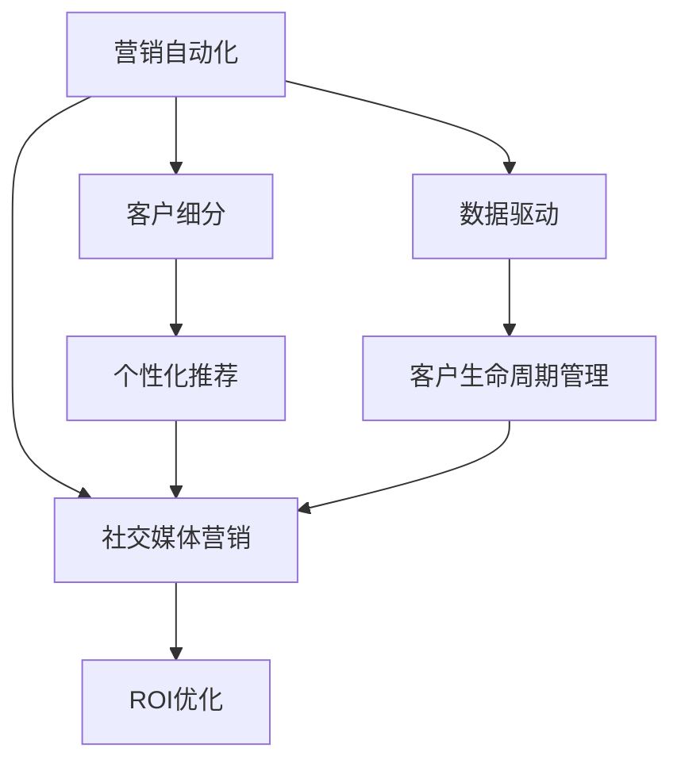

                 

# 营销创新：吸引目标用户

> 关键词：
1. 营销自动化
2. 客户细分
3. 个性化推荐
4. 数据驱动
5. 客户生命周期管理
6. 社交媒体营销
7. ROI优化

## 1. 背景介绍

在数字化时代，企业的营销环境发生了根本变化。传统的单向传播模式已被社交媒体、搜索引擎和移动应用等平台的多向互动所取代。品牌与消费者之间的互动更加频繁，营销策略需要更加精准、个性化，才能有效吸引并保持目标用户。在此背景下，营销创新成为企业竞争力的关键。本文将从营销自动化、客户细分、个性化推荐等多个维度，探讨如何通过数据驱动和创新技术，吸引并保持目标用户，提升企业营销效果。

## 2. 核心概念与联系

### 2.1 核心概念概述

为更好地理解本文的内容，我们首先定义几个关键概念：

1. **营销自动化**：指利用技术手段自动完成营销任务，包括客户数据分析、邮件营销、广告投放等。这不仅能提高营销效率，还能提供精准的客户体验。

2. **客户细分**：根据客户的行为、兴趣、需求等特征，将客户分为不同的群体，便于定制化的营销策略。客户细分是实现个性化营销的基础。

3. **个性化推荐**：基于客户的历史行为数据，为其推荐最相关和最感兴趣的产品或服务。个性化推荐能有效提升客户的满意度和购买转化率。

4. **数据驱动**：营销决策以数据为基础，通过数据分析和机器学习等技术手段，预测客户行为，优化营销策略。数据驱动是营销创新不可或缺的一环。

5. **客户生命周期管理**：通过分析客户在不同生命周期阶段的行为和需求，制定相应的营销策略，提升客户忠诚度和复购率。

6. **社交媒体营销**：利用社交媒体平台进行品牌宣传和用户互动，提升品牌影响力和客户参与度。

7. **ROI优化**：通过优化营销活动，提高投资回报率，确保营销投入能获得最大化的商业回报。

这些概念之间的逻辑关系可以通过以下Mermaid流程图来展示：



这个流程图展示了几大核心概念之间的联系：

1. 营销自动化是基础，提供精准的客户数据。
2. 客户细分基于自动化数据，划分为不同的客户群体。
3. 个性化推荐进一步细化客户体验，提升转化率。
4. 数据驱动确保营销策略的科学性和精准性。
5. 客户生命周期管理优化客户全生命周期的营销策略。
6. 社交媒体营销提升品牌影响力和客户互动。
7. ROI优化评估营销效果，确保投入产出比。

## 3. 核心算法原理 & 具体操作步骤

### 3.1 算法原理概述

基于上述概念，营销创新的核心在于通过数据驱动和创新技术，实现精准的客户分析和个性化的营销策略，提升ROI。以下是主要算法原理：

1. **数据收集与预处理**：从多渠道收集客户数据，包括行为数据、社交媒体互动数据、交易数据等。对数据进行清洗、去重和归一化处理，为后续分析提供高质量的数据。

2. **客户细分**：使用聚类算法或分类算法对客户进行分组，如RFM分析、K-means聚类、决策树等。根据不同的客户细分结果，制定个性化的营销策略。

3. **个性化推荐**：使用协同过滤、内容推荐、深度学习等技术，基于用户的历史行为数据，生成个性化推荐列表。推荐算法包括基于内容的推荐、基于协同的推荐、混合推荐等。

4. **预测分析**：通过时间序列分析、回归分析等技术，预测客户行为，如购买预测、流失预测等。利用预测结果优化营销策略。

5. **客户生命周期管理**：构建客户生命周期模型，根据不同阶段的行为和需求，设计相应的营销策略。如新客户转化、流失预警、忠诚度维护等。

6. **ROI优化**：使用A/B测试、多臂老虎机算法等方法，优化营销活动，提升ROI。

### 3.2 算法步骤详解

接下来，我们详细介绍基于数据驱动的营销创新步骤：

**Step 1: 数据收集与预处理**

1. **数据来源**：从网站流量、交易记录、社交媒体互动、CRM系统等渠道收集客户数据。
2. **数据清洗**：去除重复数据和错误数据，填补缺失值，归一化数据格式。
3. **特征工程**：提取有意义的特征，如用户行为、人口统计、交易历史等，构建特征向量。

**Step 2: 客户细分**

1. **聚类分析**：使用K-means、层次聚类等算法，对客户进行分组。每个群体具有相似的特征和行为。
2. **RFM分析**：基于客户最近一次购买时间(R)、购买频率(F)、消费金额(M)，对客户进行评分。高RFM值的客户更具有价值。
3. **客户分类**：使用决策树、逻辑回归等分类算法，将客户分为高价值客户和低价值客户。

**Step 3: 个性化推荐**

1. **协同过滤**：基于用户行为矩阵，推荐相似用户喜欢的商品。
2. **基于内容的推荐**：分析商品属性，推荐与用户偏好相似的商品。
3. **深度学习推荐**：使用神经网络模型，学习用户行为和商品特征，生成推荐列表。

**Step 4: 预测分析**

1. **时间序列预测**：使用ARIMA、LSTM等模型，预测客户行为，如购买预测、流失预测等。
2. **回归分析**：使用线性回归、逻辑回归等方法，预测客户属性，如购买概率、流失概率等。

**Step 5: 客户生命周期管理**

1. **建立模型**：构建客户生命周期模型，定义不同阶段的客户行为和需求。
2. **策略优化**：根据不同阶段制定相应的营销策略，如新客户转化、流失预警、忠诚度维护等。

**Step 6: ROI优化**

1. **A/B测试**：对营销活动进行随机分组，比较不同策略的ROI。
2. **多臂老虎机算法**：分配预算到不同策略中，根据反馈调整策略权重。

### 3.3 算法优缺点

基于数据驱动的营销创新方法具有以下优点：

1. **精准性**：通过数据分析和模型训练，能提供精准的客户行为预测和个性化的推荐策略。
2. **自动化**：自动化流程减少了人工干预，提高了营销效率。
3. **可扩展性**：能处理大规模数据，适用于复杂营销场景。
4. **ROI优化**：通过A/B测试和多臂老虎机算法，不断优化营销策略，提高投资回报率。

同时，该方法也存在一些局限性：

1. **数据质量要求高**：客户数据的准确性和完整性直接影响模型效果。
2. **算法复杂度高**：多模型并行和深度学习模型的计算复杂度较高，对硬件资源要求高。
3. **模型解释性不足**：部分复杂模型的决策过程难以解释，难以进行调试和优化。

尽管存在这些局限性，但整体而言，基于数据驱动的营销创新方法仍然是目前最为先进的营销策略之一。

### 3.4 算法应用领域

基于数据驱动的营销创新方法已在多个领域得到广泛应用，包括电子商务、金融、医疗、旅游等。以下是几个典型的应用场景：

1. **电子商务**：通过个性化推荐和流失预警，提升客户转化率和留存率。例如，Amazon利用协同过滤推荐商品，提升客户购物体验。
2. **金融**：通过行为分析，识别高风险客户，制定针对性的风险控制策略。例如，银行通过RFM分析，优化客户维护策略。
3. **医疗**：通过预测模型，预测患者的病情变化，制定个性化治疗方案。例如，健康保险公司通过预测模型，降低赔付风险。
4. **旅游**：通过客户行为分析，设计个性化旅游推荐，提升客户满意度。例如，携程利用协同过滤推荐旅游线路，提升客户预订率。

## 4. 数学模型和公式 & 详细讲解 & 举例说明

### 4.1 数学模型构建

下面我们通过数学语言对上述营销创新步骤进行严格的刻画。

假设客户数据为 $D=\{(x_i,y_i)\}_{i=1}^N$，其中 $x_i$ 为特征向量，$y_i$ 为目标变量（如是否购买、是否流失等）。

**数据收集与预处理**

数据收集与预处理的目标是构建特征向量 $x_i$，其形式为：

$$
x_i = \{\text{ID}, \text{Time}, \text{Feature}_1, \text{Feature}_2, \ldots, \text{Feature}_k\}
$$

其中 $\text{ID}$ 为客户ID，$\text{Time}$ 为时间戳，$\text{Feature}_1, \text{Feature}_2, \ldots, \text{Feature}_k$ 为客户的各种行为特征。

**客户细分**

客户分群的常用方法包括K-means聚类和层次聚类。以K-means聚类为例，目标是最小化损失函数：

$$
J = \frac{1}{N}\sum_{i=1}^N \sum_{j=1}^k (\theta_j - x_i)^2
$$

其中 $\theta_j$ 为聚类中心，$x_i$ 为客户数据，$k$ 为聚类数目。

**个性化推荐**

个性化推荐常用的算法包括协同过滤、基于内容的推荐和深度学习推荐。以协同过滤为例，目标是最小化损失函数：

$$
J = \sum_{i=1}^N \sum_{j=1}^M (\hat{y}_{i,j} - y_{i,j})^2
$$

其中 $\hat{y}_{i,j}$ 为用户$i$对商品$j$的预测评分，$y_{i,j}$为实际评分，$N$和$M$分别为用户数和商品数。

**预测分析**

预测分析常用的方法包括时间序列分析和回归分析。以时间序列预测为例，目标是最小化损失函数：

$$
J = \sum_{i=1}^T (\hat{y}_i - y_i)^2
$$

其中 $\hat{y}_i$ 为第$i$个时间点的预测值，$y_i$为实际值，$T$为时间点数。

**客户生命周期管理**

客户生命周期管理的常用方法包括RFM分析和客户分类。以RFM分析为例，目标是最小化损失函数：

$$
J = \sum_{i=1}^N \max(R_i \times F_i \times M_i, 0)
$$

其中 $R_i, F_i, M_i$ 分别为最近一次购买时间、购买频率、消费金额，$N$为客户数。

**ROI优化**

ROI优化的常用方法包括A/B测试和多臂老虎机算法。以A/B测试为例，目标是最小化损失函数：

$$
J = \sum_{i=1}^N (\text{cost}_i - \text{revenue}_i)^2
$$

其中 $\text{cost}_i$ 为第$i$个实验的成本，$\text{revenue}_i$为第$i$个实验的收入，$N$为实验数。

### 4.2 公式推导过程

接下来，我们详细介绍上述模型的公式推导过程。

**数据收集与预处理**

数据收集与预处理的目标是构建特征向量 $x_i$，其形式为：

$$
x_i = \{\text{ID}, \text{Time}, \text{Feature}_1, \text{Feature}_2, \ldots, \text{Feature}_k\}
$$

其中 $\text{ID}$ 为客户ID，$\text{Time}$ 为时间戳，$\text{Feature}_1, \text{Feature}_2, \ldots, \text{Feature}_k$ 为客户的各种行为特征。

**客户细分**

客户分群的常用方法包括K-means聚类和层次聚类。以K-means聚类为例，目标是最小化损失函数：

$$
J = \frac{1}{N}\sum_{i=1}^N \sum_{j=1}^k (\theta_j - x_i)^2
$$

其中 $\theta_j$ 为聚类中心，$x_i$ 为客户数据，$k$ 为聚类数目。

**个性化推荐**

个性化推荐常用的算法包括协同过滤、基于内容的推荐和深度学习推荐。以协同过滤为例，目标是最小化损失函数：

$$
J = \sum_{i=1}^N \sum_{j=1}^M (\hat{y}_{i,j} - y_{i,j})^2
$$

其中 $\hat{y}_{i,j}$ 为用户$i$对商品$j$的预测评分，$y_{i,j}$为实际评分，$N$和$M$分别为用户数和商品数。

**预测分析**

预测分析常用的方法包括时间序列分析和回归分析。以时间序列预测为例，目标是最小化损失函数：

$$
J = \sum_{i=1}^T (\hat{y}_i - y_i)^2
$$

其中 $\hat{y}_i$ 为第$i$个时间点的预测值，$y_i$为实际值，$T$为时间点数。

**客户生命周期管理**

客户生命周期管理的常用方法包括RFM分析和客户分类。以RFM分析为例，目标是最小化损失函数：

$$
J = \sum_{i=1}^N \max(R_i \times F_i \times M_i, 0)
$$

其中 $R_i, F_i, M_i$ 分别为最近一次购买时间、购买频率、消费金额，$N$为客户数。

**ROI优化**

ROI优化的常用方法包括A/B测试和多臂老虎机算法。以A/B测试为例，目标是最小化损失函数：

$$
J = \sum_{i=1}^N (\text{cost}_i - \text{revenue}_i)^2
$$

其中 $\text{cost}_i$ 为第$i$个实验的成本，$\text{revenue}_i$为第$i$个实验的收入，$N$为实验数。

### 4.3 案例分析与讲解

以某电商平台为例，分析其如何通过数据驱动的营销策略提升销售业绩。

**Step 1: 数据收集与预处理**

该平台从交易记录、浏览历史、客户评价等多个渠道收集客户数据，构建客户特征向量。具体步骤如下：

1. 收集交易记录：包括购买时间、商品ID、商品价格、购买金额等。
2. 收集浏览历史：包括浏览时间、浏览商品ID、浏览时长等。
3. 收集客户评价：包括评价内容、评价时间、评价评分等。
4. 数据清洗：去除重复数据和错误数据，填补缺失值，归一化数据格式。
5. 特征提取：提取有意义的特征，如用户行为、人口统计、交易历史等，构建特征向量。

**Step 2: 客户细分**

该平台使用K-means聚类算法对客户进行分组，得到5个客户群体。具体步骤如下：

1. 对客户特征向量进行标准化处理。
2. 使用K-means聚类算法，将客户分为5个聚类中心。
3. 根据聚类中心，将客户分为5个群体。

**Step 3: 个性化推荐**

该平台使用协同过滤算法，为用户推荐相似用户喜欢的商品。具体步骤如下：

1. 构建用户-商品矩阵，表示用户对商品的评分。
2. 根据用户-商品矩阵，计算用户$i$对商品$j$的预测评分。
3. 使用排名算法，将推荐商品列表按照评分排序，推荐给用户。

**Step 4: 预测分析**

该平台使用时间序列分析方法，预测客户是否流失。具体步骤如下：

1. 收集客户历史行为数据，构建时间序列数据。
2. 使用ARIMA模型，预测客户流失概率。
3. 根据预测结果，制定相应的客户流失预警策略。

**Step 5: 客户生命周期管理**

该平台建立客户生命周期模型，制定新客户转化、流失预警、忠诚度维护等策略。具体步骤如下：

1. 定义客户生命周期阶段，如新客户、活跃客户、流失客户等。
2. 根据不同阶段的行为和需求，制定相应的营销策略。
3. 定期更新客户生命周期模型，优化策略效果。

**Step 6: ROI优化**

该平台使用A/B测试方法，优化广告投放策略。具体步骤如下：

1. 将广告分成A/B两组，随机分配给不同用户。
2. 收集两组广告的点击率和转化率等指标。
3. 分析A/B两组广告的效果，选择表现更好的策略。

通过上述数据驱动的营销策略，该平台显著提升了销售业绩和客户满意度。

## 5. 项目实践：代码实例和详细解释说明

### 5.1 开发环境搭建

在进行营销创新项目开发前，我们需要准备好开发环境。以下是使用Python进行Pandas和Scikit-learn开发的开发环境配置流程：

1. 安装Anaconda：从官网下载并安装Anaconda，用于创建独立的Python环境。

2. 创建并激活虚拟环境：
```bash
conda create -n marketing-env python=3.8 
conda activate marketing-env
```

3. 安装Pandas和Scikit-learn：
```bash
conda install pandas scikit-learn
```

4. 安装各类工具包：
```bash
pip install numpy matplotlib seaborn plotly
```

完成上述步骤后，即可在`marketing-env`环境中开始营销创新项目开发。

### 5.2 源代码详细实现

下面我们以客户细分和个性化推荐为例，给出使用Pandas和Scikit-learn对营销数据进行分析的Python代码实现。

**客户细分代码**

```python
import pandas as pd
from sklearn.cluster import KMeans

# 加载客户数据
data = pd.read_csv('customer_data.csv')

# 选择特征
features = ['Age', 'Income', 'Purchase_History']

# 标准化数据
from sklearn.preprocessing import StandardScaler
scaler = StandardScaler()
data[features] = scaler.fit_transform(data[features])

# 聚类分析
kmeans = KMeans(n_clusters=5)
labels = kmeans.fit_predict(data[features])

# 输出聚类结果
print(labels)
```

**个性化推荐代码**

```python
import pandas as pd
from sklearn.metrics.pairwise import cosine_similarity

# 加载商品数据和用户评分数据
items = pd.read_csv('items.csv')
ratings = pd.read_csv('ratings.csv')

# 构建用户-商品评分矩阵
matrix = ratings.pivot_table(index='user_id', columns='item_id', values='rating')

# 计算用户-商品评分矩阵的余弦相似度
similarity = cosine_similarity(matrix)

# 输出余弦相似度矩阵
print(similarity)
```

### 5.3 代码解读与分析

让我们再详细解读一下关键代码的实现细节：

**客户细分代码**

1. **数据加载**：使用Pandas的`read_csv`方法加载客户数据。
2. **特征选择**：选择与客户行为相关的特征，如年龄、收入、购买历史等。
3. **数据标准化**：使用`StandardScaler`对特征进行标准化处理，避免特征尺度不同带来的影响。
4. **聚类分析**：使用`KMeans`算法进行聚类分析，得到5个客户群体。

**个性化推荐代码**

1. **数据加载**：使用Pandas的`read_csv`方法加载商品数据和用户评分数据。
2. **构建评分矩阵**：使用`pivot_table`方法构建用户-商品评分矩阵。
3. **计算相似度**：使用`cosine_similarity`计算用户-商品评分矩阵的余弦相似度。

这些代码实现了客户细分和个性化推荐的基本步骤，展示了如何使用Pandas和Scikit-learn进行数据处理和分析。

当然，在工业级的系统实现中，还需要考虑更多因素，如数据的实时处理、模型的自动化更新、更灵活的任务适配层等。但核心的算法和步骤与上述示例类似。

## 6. 实际应用场景

### 6.1 智能推荐系统

基于客户细分的个性化推荐系统，可以广泛应用于电商、视频、音乐等多个领域。通过分析用户行为和兴趣，推荐系统能提供精准的商品、内容或服务，提升用户体验和转化率。

在技术实现上，可以收集用户浏览、购买、评分等行为数据，使用协同过滤、基于内容的推荐、深度学习推荐等技术，对用户进行分类和推荐。推荐算法包括基于协同的推荐、基于内容的推荐、混合推荐等。

### 6.2 营销自动化平台

营销自动化平台可以整合客户数据、营销工具和业务流程，实现营销任务的自动完成。通过数据分析和模型训练，平台能提供精准的客户细分和个性化推荐策略，提升营销效率和效果。

在技术实现上，可以构建数据收集、数据处理、客户细分、个性化推荐、预测分析、ROI优化等模块。使用数据管道和机器学习库，自动化完成营销任务。

### 6.3 社交媒体分析

社交媒体分析工具可以分析用户的行为和互动数据，洞察用户需求和趋势。通过情感分析、舆情监测、用户画像等技术，分析工具能提供有价值的洞察，帮助企业制定针对性的营销策略。

在技术实现上，可以收集用户评论、帖子、互动等社交媒体数据，使用自然语言处理和机器学习技术，进行情感分析、主题建模、用户画像等分析。

## 7. 工具和资源推荐

### 7.1 学习资源推荐

为了帮助开发者系统掌握营销创新理论基础和实践技巧，这里推荐一些优质的学习资源：

1. 《数据驱动营销》系列书籍：全面介绍数据驱动营销的理论基础和实践方法，涵盖客户细分、个性化推荐、预测分析等多个方面。

2. Coursera《数据科学专业》课程：斯坦福大学开设的课程，涵盖数据分析、机器学习、数据可视化等多个方面，提供系统化的学习路径。

3. Udacity《数据科学纳米学位》课程：提供实际案例和项目，帮助开发者将理论知识应用于实践。

4. Kaggle《营销数据竞赛》：参加数据竞赛，实战练习数据分析和模型训练技巧，积累实际经验。

5. MarketingProfs博客：营销领域的权威博客，提供最新的营销技术和案例分析，帮助开发者及时了解行业动态。

通过对这些资源的学习实践，相信你一定能够快速掌握营销创新的精髓，并用于解决实际的营销问题。

### 7.2 开发工具推荐

高效的开发离不开优秀的工具支持。以下是几款用于营销创新开发的常用工具：

1. Python：作为数据科学和机器学习的主流编程语言，Python有丰富的数据处理和机器学习库，如Pandas、Scikit-learn、TensorFlow等。

2. R语言：作为一种强大的统计分析工具，R语言在数据处理和可视化方面具有优势，尤其在营销数据分析中广泛应用。

3. Tableau：一种流行的数据可视化工具，可以帮助开发者快速生成数据报表和可视化图表，直观展示分析结果。

4. Power BI：微软推出的商业智能工具，支持数据处理、分析和可视化，提供丰富的可视化组件。

5. Google Analytics：一种强大的网站分析工具，可以实时监测网站流量、用户行为等数据，提供详细的分析报告。

6. Salesforce Marketing Cloud：一种领先的营销自动化平台，支持多渠道营销和客户关系管理。

合理利用这些工具，可以显著提升营销创新项目的开发效率，加快创新迭代的步伐。

### 7.3 相关论文推荐

营销创新的研究源于学界的持续研究。以下是几篇奠基性的相关论文，推荐阅读：

1. "Customer Segmentation: A Data-Minable Framework for Market Segmentation"（客户分段的可数据化框架）：提出使用聚类分析对客户进行分段的算法。

2. "Personalization and Recommendation in Multi-Agent Systems"（多智能体系统中的个性化推荐）：探讨如何在大规模系统中实现个性化推荐。

3. "Predictive Customer Lifetime Value Analysis: A Systematic Review and Critical Synthesis"（客户生命价值预测的系统回顾与批判性综合）：综述客户生命周期价值预测的研究进展。

4. "Sales Prediction and Forecasting: A Survey of Techniques and Applications"（销售预测和预测：技术与应用综述）：综述销售预测的各种技术和应用场景。

5. "Machine Learning in Marketing: A Review"（营销中的机器学习：综述）：综述机器学习在营销中的应用，包括客户细分、个性化推荐、情感分析等多个方面。

这些论文代表了大营销创新领域的研究方向和最新进展。通过学习这些前沿成果，可以帮助研究者把握学科前进方向，激发更多的创新灵感。

## 8. 总结：未来发展趋势与挑战

### 8.1 总结

本文对基于数据驱动的营销创新方法进行了全面系统的介绍。首先阐述了营销自动化、客户细分、个性化推荐等多个维度的理论基础，明确了营销创新的重要性和实现路径。其次，通过详细讲解算法原理和操作步骤，展示了如何使用数据驱动技术提升营销效果。最后，通过代码实例和实际应用场景，展示了如何构建营销自动化平台、社交媒体分析工具等系统，实现数据驱动的营销创新。

通过本文的系统梳理，可以看到，基于数据驱动的营销创新方法在多领域得到了广泛应用，为企业的营销决策提供了强大的技术支撑。未来，伴随大数据、人工智能等技术的不断进步，营销创新必将迎来更大的发展机遇。

### 8.2 未来发展趋势

展望未来，基于数据驱动的营销创新方法将呈现以下几个发展趋势：

1. **智能化提升**：伴随AI技术的发展，营销自动化平台将越来越智能化，能够自动进行用户画像、需求分析、个性化推荐等。

2. **多渠道整合**：营销数据将越来越多地来自多渠道，包括社交媒体、移动应用、线下终端等。未来的营销自动化平台将支持多渠道数据的整合和分析。

3. **实时化增强**：实时数据分析和营销策略的调整，将提升营销活动的效果和效率。未来的营销自动化平台将支持实时数据处理和策略优化。

4. **可解释性增强**：随着解释性AI技术的发展，营销自动化平台将提供更透明的决策过程，帮助企业理解和优化营销策略。

5. **跨领域融合**：未来的营销自动化平台将不仅仅局限于营销领域，还将与供应链、物流、客户服务等进行融合，形成更加完整的数据生态。

以上趋势凸显了数据驱动营销创新技术的广阔前景。这些方向的探索发展，必将进一步提升营销活动的精准性和效果，为企业的市场竞争提供强大的技术支持。

### 8.3 面临的挑战

尽管基于数据驱动的营销创新方法已经取得了显著成效，但在迈向更加智能化、实时化和跨领域融合的过程中，它仍面临诸多挑战：

1. **数据质量和获取**：客户数据的准确性和完整性直接影响营销效果，如何获取高质量数据是一大挑战。

2. **算法复杂度和资源消耗**：复杂算法的计算复杂度高，对硬件资源要求高，如何优化算法以提高效率是另一大挑战。

3. **用户隐私和数据安全**：客户数据的隐私保护和数据安全是营销自动化平台的重要保障，如何保障数据隐私和防止数据泄露是一大挑战。

4. **跨部门协作**：营销数据涉及多个部门，如何实现跨部门协作和数据共享是一大挑战。

5. **系统集成和互操作性**：多系统集成带来的系统互操作性问题是一大挑战，如何实现系统之间的无缝衔接是未来需要解决的问题。

尽管存在这些挑战，但整体而言，基于数据驱动的营销创新方法仍然是目前最为先进的营销策略之一。只有勇于创新、敢于突破，才能不断拓展营销创新的边界，让数据驱动的营销创新为企业的市场竞争提供更大的优势。

### 8.4 研究展望

面向未来，营销创新的研究需要在以下几个方面寻求新的突破：

1. **跨领域知识融合**：将知识图谱、符号推理等跨领域知识与数据驱动的营销策略进行融合，提升营销决策的深度和广度。

2. **多模态数据融合**：将文本、图像、视频等多种模态的数据进行融合，提升营销数据分析的准确性和全面性。

3. **实时决策优化**：使用强化学习、多臂老虎机等方法，实现实时决策优化，提升营销活动的效果和效率。

4. **用户行为预测**：结合因果推断、深度学习等方法，提升对用户行为的预测准确性，优化营销策略。

5. **解释性增强**：使用可解释的机器学习模型，增强营销自动化平台的透明度和可解释性，帮助企业理解和优化营销策略。

6. **隐私保护机制**：设计隐私保护机制，确保客户数据的隐私和安全，防止数据泄露和滥用。

这些研究方向的探索，必将引领基于数据驱动的营销创新技术迈向更高的台阶，为企业的市场竞争提供更大的优势。面向未来，营销创新的研究需要更多跨学科的协同努力，才能不断拓展数据驱动营销的边界，为企业的市场竞争提供更大的优势。

## 9. 附录：常见问题与解答

**Q1：客户细分有哪些常用方法？**

A: 客户细分的常用方法包括K-means聚类、层次聚类、RFM分析、决策树等。不同方法适用于不同的场景，需要根据具体情况进行选择。

**Q2：如何构建有效的个性化推荐系统？**

A: 构建有效的个性化推荐系统需要多方面的考虑，包括数据收集、特征选择、模型选择、算法优化等。常用的推荐算法包括协同过滤、基于内容的推荐、深度学习推荐等。

**Q3：如何提高个性化推荐系统的效果？**

A: 提高个性化推荐系统的效果需要不断优化算法和模型，如引入用户反馈、多模型融合、超参数调优等。同时，需要不断收集和更新数据，保证推荐系统的时效性。

**Q4：如何在营销自动化平台中实现多渠道数据整合？**

A: 实现多渠道数据整合需要建立统一的数据标准和数据治理机制，利用ETL工具进行数据清洗和整合。同时，需要使用数据管道和API接口，实现多渠道数据的实时接入和分析。

**Q5：如何保障营销自动化平台的隐私和数据安全？**

A: 保障营销自动化平台的隐私和数据安全需要采用数据加密、访问控制、数据匿名化等技术手段。同时，需要建立严格的数据治理和隐私保护机制，确保数据安全和隐私保护。

---

作者：禅与计算机程序设计艺术 / Zen and the Art of Computer Programming

