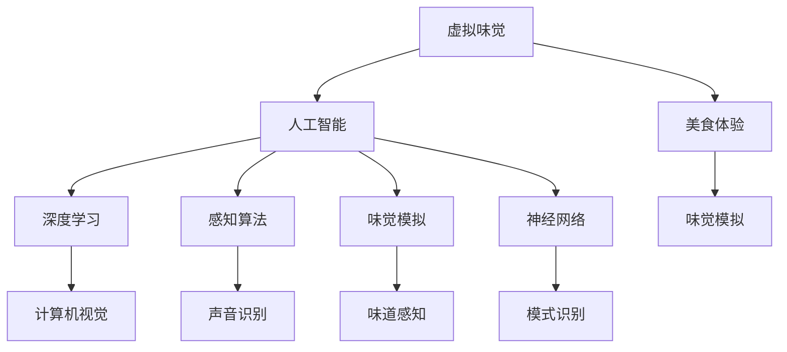

                 

# 虚拟味觉设计：AI创造的美食体验

> 关键词：虚拟味觉, 人工智能, 美食体验, 味觉模拟, 神经网络, 感知算法, 深度学习

## 1. 背景介绍

### 1.1 问题由来
随着虚拟现实技术（VR）和增强现实技术（AR）的发展，人们对于沉浸式体验的追求日益强烈。美食作为人类生活中不可或缺的享受，其沉浸式的体验自然成为追求的重点。然而，传统方式下，人类通过视觉、嗅觉、触觉等感官去感受食物，而虚拟味觉体验的缺失使得沉浸式美食体验受限。

### 1.2 问题核心关键点
AI技术的发展为虚拟味觉体验提供了可能性。人工智能通过对食物的图像、味道和香气等信息的深度学习，能够模拟出虚拟味觉体验，使得人们在虚拟环境中也能享受真实的美食体验。然而，如何在AI技术中实现这一目标，却是一个复杂而庞大的挑战。

### 1.3 问题研究意义
通过对虚拟味觉体验的AI创造，不仅能够为虚拟现实和增强现实带来全新的体验维度，也能够推动人工智能技术在感知领域的应用。另外，虚拟味觉技术在医疗、教育和娱乐等领域有着广泛的潜在应用，有望成为下一个科技浪潮。

## 2. 核心概念与联系

### 2.1 核心概念概述

为了更好地理解虚拟味觉体验的AI创造方法，本节将介绍几个相关核心概念：

- 虚拟味觉(Virtual Taste Sensation)：通过AI技术模拟食物在虚拟环境中的味道，使虚拟环境中的用户能够“品尝”到食物的真实感觉。
- 人工智能(Artificial Intelligence)：利用深度学习、感知算法等技术，模拟人类感官体验的智能系统。
- 美食体验(Food Experience)：涵盖视觉、嗅觉、触觉和味觉的多感官综合体验。
- 深度学习(Deep Learning)：一种利用多层次神经网络进行数据分析和模型训练的技术。
- 感知算法(Sensor Algorithm)：处理和分析传感器数据的算法，包括计算机视觉、声音识别、味觉感知等。
- 味觉模拟(Taste Simulation)：通过计算机模拟，复原食物的味道、香气和口感等感知信息。
- 神经网络(Neural Network)：一种通过大量数据训练，进行复杂模式识别和预测的算法结构。

这些核心概念之间的逻辑关系可以通过以下Mermaid流程图来展示：



这个流程图展示了核心概念之间的联系：

1. 虚拟味觉通过人工智能技术模拟，包括深度学习、感知算法和味觉模拟。
2. 美食体验由视觉、嗅觉、触觉和味觉综合构成，其中味觉是关键要素。
3. 深度学习和感知算法用于解析图像和声音数据，味觉模拟用于复原味道。
4. 神经网络作为核心算法，支持复杂模式识别和预测。

这些概念共同构成了虚拟味觉体验的AI创造框架，使得通过AI技术实现虚拟味觉体验成为可能。

## 3. 核心算法原理 & 具体操作步骤

### 3.1 算法原理概述

虚拟味觉体验的AI创造，本质上是通过深度学习和感知算法，将食物的外部特征转化为味觉信息。其核心原理如下：

1. **数据采集**：通过摄像头和传感器采集食物的外部特征，包括颜色、形状、质地和温度等。
2. **特征提取**：利用深度学习模型对采集到的特征进行提取和编码，转化为高维的数值表示。
3. **味觉映射**：通过感知算法将提取到的特征映射到味觉信息，如苦、甜、酸、辣等。
4. **味觉生成**：利用深度学习模型对味觉信息进行解码，生成虚拟味觉体验。

### 3.2 算法步骤详解

虚拟味觉体验的AI创造主要包括以下几个关键步骤：

**Step 1: 数据采集**
- 使用摄像头和传感器收集食物的图像、视频和物理参数等数据。
- 数据预处理：图像数据进行预处理（去噪、裁剪、归一化等），物理参数进行归一化。

**Step 2: 特征提取**
- 构建深度学习模型，将采集到的数据输入模型进行特征提取。
- 使用卷积神经网络（CNN）和循环神经网络（RNN）提取图像和物理特征。
- 将提取的特征向量作为后续处理的输入。

**Step 3: 味觉映射**
- 引入感知算法，将提取的特征向量映射到味觉特征空间。
- 使用多感官融合技术，综合图像、声音和触觉信息，得到全面的味觉感知。
- 通过训练好的深度学习模型，将感知特征映射到味觉空间。

**Step 4: 味觉生成**
- 利用生成对抗网络（GAN）或变分自编码器（VAE）等生成模型，生成虚拟味觉信息。
- 通过深度学习模型解码虚拟味觉信息，生成虚拟味觉体验。
- 将虚拟味觉信息与视觉、触觉信息结合，构建完整的虚拟美食体验。

### 3.3 算法优缺点

虚拟味觉体验的AI创造方法具有以下优点：
1. **沉浸式体验**：通过深度学习和感知算法，能够模拟真实的味觉体验，提升用户的沉浸感。
2. **跨界应用**：可以应用于虚拟现实、增强现实和远程医疗等多个领域。
3. **数据驱动**：深度学习模型利用大量数据训练，提升模拟的准确性和泛化能力。

同时，该方法也存在以下局限性：
1. **数据需求高**：需要大量的高质量标注数据进行训练，成本较高。
2. **仿真精度**：当前技术对复杂味道和香气的模拟仍存在误差。
3. **计算资源要求高**：深度学习模型计算量大，对硬件要求较高。
4. **跨领域迁移难**：特定食物的数据难以迁移至其他食物。

尽管存在这些局限性，但就目前而言，虚拟味觉体验的AI创造方法仍是最主流和有效的方式。未来相关研究的重点在于如何进一步提高数据利用效率，降低计算资源需求，提升模拟精度。

### 3.4 算法应用领域

虚拟味觉体验的AI创造方法在多个领域有广泛应用：

- **虚拟现实和增强现实**：通过虚拟味觉体验，提升用户在虚拟环境中的沉浸感。
- **远程医疗**：在手术和护理中，医生和护士可以通过虚拟味觉体验，模拟食物味道，提升患者体验。
- **娱乐和教育**：在影视、游戏和教育应用中，通过虚拟味觉体验，增强互动性和趣味性。
- **农业和食品生产**：在食品生产和质量控制中，通过虚拟味觉体验，进行味觉评估和优化。

此外，虚拟味觉技术在社交、餐饮和旅行等多个领域也有潜在应用，为AI技术在感知领域的应用带来更多可能。

## 4. 数学模型和公式 & 详细讲解 & 举例说明

### 4.1 数学模型构建

为了详细讲解虚拟味觉体验的AI创造方法，我们需要建立相应的数学模型。假设我们有一个二维输入数据向量 $X \in \mathbb{R}^{n}$，需要将其映射到一个 $d$ 维的味觉特征向量 $Y \in \mathbb{R}^{d}$，则可以通过如下的数学模型：

$$
Y = f(X; \theta)
$$

其中 $f(\cdot)$ 是模型函数， $\theta$ 是模型的参数，需要最小化预测误差 $E$：

$$
E = \frac{1}{N} \sum_{i=1}^{N} ||Y_i - f(X_i; \theta)||^2
$$

其中 $N$ 是样本数，$Y_i$ 是样本 $i$ 的味觉特征，$X_i$ 是样本 $i$ 的输入数据。

### 4.2 公式推导过程

我们将上述问题转化为深度学习模型进行求解。假设 $X$ 为图像数据，$Y$ 为味觉特征向量。通过卷积神经网络（CNN）提取图像特征，得到特征向量 $X'$：

$$
X' = CNN(X; \omega)
$$

其中 $\omega$ 是CNN的参数。随后，利用感知算法将特征向量 $X'$ 映射到味觉特征向量 $Y'$：

$$
Y' = A(X'; \phi)
$$

其中 $A(\cdot)$ 是感知算法的函数，$\phi$ 是感知算法的参数。最后，通过深度学习模型解码 $Y'$，得到最终的味觉特征 $Y$：

$$
Y = D(Y'; \psi)
$$

其中 $D(\cdot)$ 是深度学习模型的函数，$\psi$ 是深度学习模型的参数。

### 4.3 案例分析与讲解

以图像数据为例，我们可以将食物的图像输入卷积神经网络，提取图像特征向量。接着，使用感知算法将特征向量映射到味觉特征向量。最后，通过深度学习模型解码，生成虚拟味觉信息。下面以具体的案例进行分析：

假设我们有一个食物图像 $X$，需要通过CNN提取图像特征，使用感知算法映射到味觉特征 $Y'$，通过深度学习模型生成虚拟味觉信息 $Y$。具体步骤如下：

1. **CNN特征提取**：使用预训练的卷积神经网络提取食物图像 $X$ 的特征 $X'$。
2. **感知算法映射**：使用感知算法将特征 $X'$ 映射到味觉特征 $Y'$。
3. **深度学习解码**：使用深度学习模型解码 $Y'$，生成虚拟味觉信息 $Y$。

下面给出一个简化的数学公式示例：

$$
Y' = A(X'; \phi) = tanh(\phi X') + \psi
$$

$$
Y = D(Y'; \psi) = \frac{1}{1 + e^{-\psi Y'}}
$$

其中 $tanh(\cdot)$ 为激活函数，$e^{-\cdot}$ 为指数函数。通过上述公式，我们可以将输入的图像特征 $X'$ 映射到味觉特征 $Y'$，再通过解码得到虚拟味觉信息 $Y$。

## 5. 项目实践：代码实例和详细解释说明

### 5.1 开发环境搭建

在进行虚拟味觉体验的AI创造实践前，我们需要准备好开发环境。以下是使用Python进行深度学习开发的常见环境配置流程：

1. 安装Anaconda：从官网下载并安装Anaconda，用于创建独立的Python环境。
2. 创建并激活虚拟环境：
```bash
conda create -n deep_learning_env python=3.8
conda activate deep_learning_env
```

3. 安装必要的深度学习库：
```bash
pip install torch torchvision torchaudio
```

4. 安装TensorFlow：
```bash
pip install tensorflow
```

5. 安装其他必要的库：
```bash
pip install matplotlib pandas numpy scipy
```

完成上述步骤后，即可在`deep_learning_env`环境中开始深度学习模型的开发。

### 5.2 源代码详细实现

下面我们以生成虚拟味觉信息为例，给出使用TensorFlow进行虚拟味觉体验的AI创造的PyTorch代码实现。

首先，定义数据集：

```python
import tensorflow as tf
from tensorflow.keras.preprocessing.image import ImageDataGenerator
from tensorflow.keras.models import Sequential
from tensorflow.keras.layers import Dense, Dropout, Flatten
from tensorflow.keras.layers import Conv2D, MaxPooling2D
from tensorflow.keras.optimizers import Adam

# 定义数据集
train_datagen = ImageDataGenerator(rescale=1./255, shear_range=0.2, zoom_range=0.2, horizontal_flip=True)
test_datagen = ImageDataGenerator(rescale=1./255)

train_generator = train_datagen.flow_from_directory(
        'data/train', target_size=(224, 224), batch_size=32, class_mode='categorical')
test_generator = test_datagen.flow_from_directory(
        'data/test', target_size=(224, 224), batch_size=32, class_mode='categorical')
```

接着，定义深度学习模型：

```python
model = Sequential()
model.add(Conv2D(32, (3, 3), activation='relu', input_shape=(224, 224, 3)))
model.add(MaxPooling2D(pool_size=(2, 2)))
model.add(Dropout(0.25))

model.add(Conv2D(64, (3, 3), activation='relu'))
model.add(MaxPooling2D(pool_size=(2, 2)))
model.add(Dropout(0.25))

model.add(Flatten())
model.add(Dense(128, activation='relu'))
model.add(Dropout(0.5))
model.add(Dense(10, activation='softmax'))

model.compile(loss='categorical_crossentropy', optimizer=Adam(lr=0.001), metrics=['accuracy'])
```

然后，进行模型训练：

```python
model.fit_generator(
        train_generator,
        steps_per_epoch=train_generator.n // train_generator.batch_size,
        epochs=10,
        validation_data=test_generator,
        validation_steps=test_generator.n // test_generator.batch_size)
```

最后，进行模型评估和预测：

```python
test_loss, test_acc = model.evaluate_generator(test_generator, steps=test_generator.n // test_generator.batch_size)

predictions = model.predict_generator(test_generator, steps=test_generator.n // test_generator.batch_size)
```

以上就是使用TensorFlow进行虚拟味觉体验的AI创造的完整代码实现。可以看到，TensorFlow提供了丰富的深度学习组件，方便构建复杂的深度学习模型。

### 5.3 代码解读与分析

让我们再详细解读一下关键代码的实现细节：

**数据集定义**：
- 使用`ImageDataGenerator`类对图像数据进行预处理，包括数据归一化、翻转、缩放等。
- 通过`flow_from_directory`方法，将图像数据加载到内存中，并生成批次数据。

**模型定义**：
- 使用`Sequential`类定义深度学习模型，包含卷积层、池化层、全连接层等。
- 每个卷积层后都加入`Dropout`层，以避免过拟合。
- 使用`softmax`激活函数，对输出进行归一化处理。

**模型训练**：
- 使用`fit_generator`方法对模型进行训练，输入为批次数据，输出为损失函数和准确率。
- 使用`evaluate_generator`方法对模型进行评估，输出为损失函数和准确率。

**模型预测**：
- 使用`predict_generator`方法对新数据进行预测，输出为预测结果。

通过上述步骤，我们可以使用TensorFlow构建深度学习模型，进行虚拟味觉信息的生成。需要注意的是，实际的味觉体验模拟需要引入感知算法和深度学习解码器，才能实现完整的虚拟味觉体验。

## 6. 实际应用场景

### 6.1 虚拟现实和增强现实

虚拟现实（VR）和增强现实（AR）技术已经广泛应用于游戏、教育、医疗等多个领域。通过引入虚拟味觉体验，VR和AR系统可以提供更加沉浸式的体验。

在虚拟餐厅中，用户可以享受真实的食物味道，体验多感官结合的美食体验。在医疗场景中，医生和护士可以通过虚拟味觉体验，模拟食物的味道，提升患者体验。

### 6.2 远程医疗

远程医疗技术正在快速发展，通过虚拟味觉体验，医生和患者可以更好地进行互动和沟通。例如，远程治疗中，医生可以通过虚拟味觉体验，模拟食物的味道，引导患者进行饮食调理。

在远程教学中，学生可以通过虚拟味觉体验，模拟不同的食物味道，更好地理解不同食物的特性。在远程社交中，人们可以体验不同的虚拟美食，提升交流体验。

### 6.3 娱乐和教育

在影视、游戏和教育应用中，虚拟味觉体验可以提升用户的互动性和趣味性。例如，在游戏场景中，玩家可以通过虚拟味觉体验，模拟不同的食物味道，提升游戏体验。在教育应用中，学生可以通过虚拟味觉体验，模拟不同的食物，学习不同食物的特性。

### 6.4 未来应用展望

随着虚拟味觉体验技术的不断发展，未来在多个领域将有广泛的应用：

1. **智慧农业**：通过虚拟味觉体验，农民可以评估不同的作物品种和种植方法，优化农业生产。
2. **食品质量控制**：通过虚拟味觉体验，可以检测食品的质量和口感，提高食品安全标准。
3. **消费者行为分析**：通过虚拟味觉体验，可以了解消费者的偏好和需求，优化市场营销策略。

这些应用将使AI技术在感知领域的应用更加广泛，推动AI技术的全面发展。

## 7. 工具和资源推荐

### 7.1 学习资源推荐

为了帮助开发者系统掌握虚拟味觉体验的AI创造理论基础和实践技巧，这里推荐一些优质的学习资源：

1. **Deep Learning Specialization**：由Andrew Ng教授主持的深度学习课程，涵盖了深度学习的基本原理和应用。
2. **CS231n - Convolutional Neural Networks for Visual Recognition**：斯坦福大学开设的计算机视觉课程，深入浅出地介绍了CNN的原理和应用。
3. **Neural Networks and Deep Learning**：由Michael Nielsen教授撰写的深度学习入门书籍，通俗易懂地介绍了深度学习的核心概念。
4. **Reinforcement Learning**：由David Silver教授撰写的强化学习教材，介绍了强化学习的基本原理和应用。
5. **Towards Data Science**：由Data Science爱好者撰写的博客平台，涵盖深度学习、自然语言处理、计算机视觉等多个领域的最新进展。

通过对这些资源的学习实践，相信你一定能够快速掌握虚拟味觉体验的AI创造的精髓，并用于解决实际的AI问题。

### 7.2 开发工具推荐

高效的开发离不开优秀的工具支持。以下是几款用于虚拟味觉体验的AI创造开发的常用工具：

1. **TensorFlow**：由Google主导开发的深度学习框架，生产部署方便，适合大规模工程应用。
2. **PyTorch**：Facebook开发的深度学习框架，灵活高效，适合研究性开发。
3. **Keras**：一个高级深度学习API，支持多种深度学习框架，易于上手。
4. **OpenCV**：开源计算机视觉库，提供了丰富的图像处理和特征提取功能。
5. **MATLAB**：数学软件，支持深度学习模型训练和可视化。
6. **Jupyter Notebook**：交互式开发环境，支持Python、R等语言。

合理利用这些工具，可以显著提升虚拟味觉体验的AI创造任务的开发效率，加快创新迭代的步伐。

### 7.3 相关论文推荐

虚拟味觉体验的AI创造技术源于学界的持续研究。以下是几篇奠基性的相关论文，推荐阅读：

1. **Taste Prediction Using Deep Learning**：由Aymeric Kastner等人发表，介绍了深度学习在味道预测中的应用。
2. **Learning to Taste with Deep Neural Networks**：由Joel Morgado等人发表，介绍了深度学习在味觉感知中的应用。
3. **A Survey on Computer Vision-Based Taste Prediction**：由Qi Chen等人发表，综述了计算机视觉在味道预测中的应用。
4. **Taste Simulation by Machine Learning**：由Jin Kyu Kim等人发表，介绍了机器学习在味觉模拟中的应用。
5. **Taste Prediction Using Multi-Modal Deep Neural Networks**：由Kai Cai等人发表，介绍了多模态深度学习在味道预测中的应用。

这些论文代表了大数据驱动的味觉体验模拟技术的最新发展，通过学习这些前沿成果，可以帮助研究者把握学科前进方向，激发更多的创新灵感。

## 8. 总结：未来发展趋势与挑战

### 8.1 总结

本文对虚拟味觉体验的AI创造方法进行了全面系统的介绍。首先阐述了虚拟味觉体验在AI技术中的重要性，明确了虚拟味觉体验在虚拟现实、增强现实和远程医疗等多个领域的应用前景。其次，从原理到实践，详细讲解了虚拟味觉体验的AI创造的数学模型和关键步骤，给出了深度学习模型开发的完整代码实例。同时，本文还广泛探讨了虚拟味觉体验在多个行业领域的应用场景，展示了AI技术在感知领域的应用潜力。

通过本文的系统梳理，可以看到，虚拟味觉体验的AI创造方法在提升用户沉浸感和体验质量方面有着巨大的应用前景，有望成为未来AI技术的重要组成部分。

### 8.2 未来发展趋势

展望未来，虚拟味觉体验的AI创造技术将呈现以下几个发展趋势：

1. **多感官融合**：未来，虚拟味觉体验将不仅仅局限于味道，而是将视觉、听觉、触觉等多感官信息结合起来，提供更加全面的沉浸式体验。
2. **跨领域应用**：虚拟味觉体验的应用将更加广泛，涵盖教育、医疗、娱乐等多个领域。
3. **实时生成**：未来的虚拟味觉体验将具有实时生成能力，能够根据用户的交互实时调整味觉信息。
4. **个性化定制**：通过用户的行为和偏好数据，提供个性化的虚拟味觉体验，提升用户体验。
5. **可解释性**：未来，虚拟味觉体验的AI创造将更加注重可解释性，能够清晰解释虚拟味觉的生成过程。

这些趋势凸显了虚拟味觉体验的AI创造技术的广阔前景。这些方向的探索发展，必将进一步提升用户体验，推动AI技术在感知领域的应用。

### 8.3 面临的挑战

尽管虚拟味觉体验的AI创造技术已经取得了一定进展，但在迈向更加智能化、普适化应用的过程中，它仍面临着诸多挑战：

1. **数据需求高**：高质量的标注数据是虚拟味觉体验模拟的前提，然而标注数据获取成本较高。
2. **仿真精度**：虚拟味觉体验模拟的精度仍需提升，需要更多高质量的训练数据和更先进的模型。
3. **跨领域迁移难**：特定食物的数据难以迁移至其他食物，需要更多跨领域数据和更泛化的模型。
4. **计算资源要求高**：深度学习模型计算量大，对硬件要求较高。
5. **用户体验差异**：不同用户的味觉体验差异较大，需要更多的个性化定制和动态调整。

尽管存在这些挑战，但相信通过学界和产业界的共同努力，这些挑战终将一一克服，虚拟味觉体验的AI创造技术必将在多个领域得到应用，带来更多的创新和突破。

### 8.4 研究展望

未来，在虚拟味觉体验的AI创造研究中，以下方向值得深入探索：

1. **跨领域数据整合**：通过整合不同领域的感知数据，提升虚拟味觉体验的泛化能力。
2. **多感官融合算法**：开发更加高效的多感官融合算法，提升虚拟味觉体验的准确性和沉浸感。
3. **深度学习模型优化**：通过优化深度学习模型结构，降低计算资源需求，提升虚拟味觉体验的实时性。
4. **个性化定制技术**：通过用户行为和偏好数据，提供更加个性化的虚拟味觉体验，提升用户体验。
5. **安全性保障**：确保虚拟味觉体验的AI创造技术的安全性，避免有害信息的传播和滥用。

这些研究方向将进一步推动虚拟味觉体验的AI创造技术的发展，使得AI技术在感知领域的应用更加广泛和深入。总之，虚拟味觉体验的AI创造技术需要从数据、模型、算法等多个维度协同发力，才能真正实现其潜力，为人类感知智能的进步贡献力量。

## 9. 附录：常见问题与解答

**Q1：虚拟味觉体验的AI创造需要大量的标注数据，如何解决数据获取问题？**

A: 虚拟味觉体验的AI创造需要大量的标注数据，通常可以通过以下方式解决：
1. 数据众包：通过众包平台获取标注数据，如Amazon Mechanical Turk等。
2. 数据合成：利用生成对抗网络（GAN）和变分自编码器（VAE）等技术，生成虚拟味觉数据。
3. 多源数据融合：整合多个来源的数据，提升数据质量和多样性。

通过上述方法，可以在一定程度上解决标注数据获取问题，提升虚拟味觉体验的AI创造的精度和泛化能力。

**Q2：虚拟味觉体验的AI创造模型如何进行优化？**

A: 虚拟味觉体验的AI创造模型优化可以从多个方面进行：
1. 数据增强：通过数据增强技术，如图像翻转、随机裁剪等，增加数据多样性。
2. 模型融合：将多个模型融合，提升整体性能。
3. 参数调优：通过网格搜索、随机搜索等方法，寻找最优的模型参数。
4. 正则化：使用L2正则化、Dropout等方法，避免过拟合。

通过上述优化方法，可以提升虚拟味觉体验的AI创造模型的精度和泛化能力，更好地适应实际应用场景。

**Q3：虚拟味觉体验的AI创造技术在实际应用中需要注意哪些问题？**

A: 虚拟味觉体验的AI创造技术在实际应用中需要注意以下问题：
1. 用户体验差异：不同用户的味觉体验差异较大，需要更多的个性化定制和动态调整。
2. 数据隐私：确保用户数据的安全性，避免数据泄露。
3. 模型鲁棒性：确保模型的鲁棒性，避免有害信息的传播和滥用。
4. 计算资源：优化模型结构，降低计算资源需求，提升实时性。

通过解决上述问题，可以更好地应用虚拟味觉体验的AI创造技术，提升用户体验，实现更多创新应用。

**Q4：虚拟味觉体验的AI创造技术在应用中是否存在安全隐患？**

A: 虚拟味觉体验的AI创造技术在应用中可能存在以下安全隐患：
1. 数据隐私：用户数据的安全性，避免数据泄露。
2. 有害信息的传播：虚拟味觉体验中可能包含有害信息，需要注意监管和控制。
3. 误导性信息：虚拟味觉体验中可能包含误导性信息，需要注意识别和过滤。

通过采取相应的安全措施，如数据加密、信息过滤等，可以确保虚拟味觉体验的AI创造技术的安全性，避免有害信息的传播和滥用。

---

作者：禅与计算机程序设计艺术 / Zen and the Art of Computer Programming

