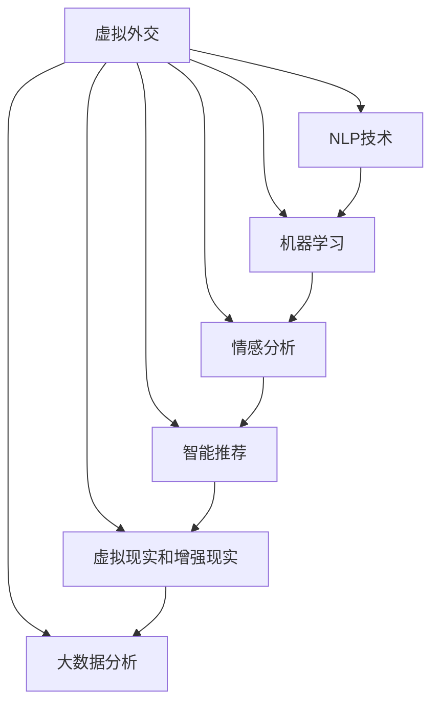

                 

# 虚拟外交：AI时代的跨文化交流

## 1. 背景介绍

随着互联网的迅速发展和全球化的深入，虚拟外交（Virtual Diplomacy）正在成为国际关系中的一种新形态。虚拟外交指的是通过数字通信技术，如互联网、社交媒体、虚拟现实（VR）和增强现实（AR），开展的跨文化交流和外交活动。近年来，人工智能（AI）技术的飞速进步，为虚拟外交提供了新的工具和平台，使其在政治、经济、文化等多方面展现出巨大的潜力。

### 1.1 问题由来
在全球化背景下，各国间的联系日益紧密，面对复杂的国际局势和多样化的社会需求，传统的线下外交模式显得效率低下、成本高昂。与此同时，AI技术的发展为虚拟外交提供了新契机，可以更加高效、低成本地进行跨文化交流和决策。通过AI技术，外交官和政府官员可以实时沟通、协商，甚至进行虚拟谈判，以解决跨国问题，增进国际合作。

### 1.2 问题核心关键点
虚拟外交的核心在于利用AI技术，特别是自然语言处理（NLP）、机器学习和数据分析等技术，提升外交工作的效率和质量。具体来说，主要包括以下几个方面：
- **自动化翻译**：实现多语言即时翻译，消除语言障碍。
- **情感分析**：通过分析文本和语音数据，理解不同文化背景下的情绪和态度。
- **智能推荐**：利用算法推荐最优的外交政策和应对策略。
- **模拟训练**：使用虚拟现实技术进行外交礼仪和策略模拟训练。
- **数据分析**：通过大数据分析，预测国际关系变化，辅助决策。

这些关键点构成了虚拟外交的基本框架，使得国际交流和合作变得更加便捷和高效。

### 1.3 问题研究意义
虚拟外交的AI应用具有重要意义：
- **提高效率**：节省时间和成本，使外交决策更加迅速和准确。
- **增强互信**：通过跨文化交流，增进国际间的理解和信任。
- **应对危机**：在紧急情况下，快速响应和决策，减少外交摩擦。
- **促进合作**：通过智能推荐和数据分析，优化国际合作方案，推动全球治理。
- **应对多样性**：满足不同文化背景下的外交需求，提升外交工作的包容性。

## 2. 核心概念与联系

### 2.1 核心概念概述

虚拟外交涉及多个核心概念，以下是其核心概念及其相互联系的简要介绍：

- **虚拟外交**：通过数字通信技术开展的跨文化交流和外交活动。
- **AI技术**：涵盖自然语言处理（NLP）、机器学习（ML）、计算机视觉（CV）和大数据等技术，为虚拟外交提供技术支持。
- **NLP技术**：使机器能够理解和生成人类语言，是虚拟外交的关键技术之一。
- **情感分析**：通过分析文本和语音数据，识别和理解情感和情绪。
- **智能推荐**：利用算法推荐最优的外交策略和政策。
- **虚拟现实（VR）和增强现实（AR）**：提供沉浸式的交流和训练环境。
- **大数据分析**：通过海量数据处理和分析，辅助外交决策。

这些核心概念构成了虚拟外交的技术框架，通过相互配合，提升外交工作的效率和质量。

### 2.2 核心概念原理和架构的 Mermaid 流程图



这个流程图展示了虚拟外交的核心概念及其相互关系。

## 3. 核心算法原理 & 具体操作步骤

### 3.1 算法原理概述

虚拟外交的算法原理主要基于AI技术，特别是NLP和机器学习。具体来说，虚拟外交的算法可以分为以下几个步骤：

1. **数据预处理**：收集和清洗多语言的文本和语音数据。
2. **语言理解**：使用NLP技术，将不同语言的文本和语音转换为机器可理解的格式。
3. **情感分析**：利用机器学习模型，分析文本和语音中的情感和情绪。
4. **智能推荐**：构建推荐系统，根据历史数据和实时反馈，推荐最优的外交策略和政策。
5. **虚拟训练**：使用VR和AR技术，进行外交礼仪和策略的模拟训练。
6. **数据分析**：利用大数据技术，分析国际关系变化，辅助外交决策。

### 3.2 算法步骤详解

虚拟外交的具体算法步骤如下：

**Step 1: 数据预处理**
- 收集多语言的文本和语音数据。
- 进行文本清洗，去除噪声和无用信息。
- 进行语音降噪和分割，获取清晰的语音片段。

**Step 2: 语言理解**
- 使用NLP技术，将文本转换为机器可理解的向量表示。
- 利用机器翻译模型，实现文本的多语言即时翻译。
- 使用语音识别技术，将语音转换为文本。

**Step 3: 情感分析**
- 利用机器学习模型，训练情感分析器。
- 分析文本和语音中的情感和情绪，识别不同文化背景下的态度和反应。

**Step 4: 智能推荐**
- 收集历史外交数据和策略。
- 利用机器学习算法，构建推荐系统。
- 根据实时反馈，动态调整推荐策略。

**Step 5: 虚拟训练**
- 使用VR和AR技术，创建虚拟外交场景。
- 进行外交礼仪和策略的模拟训练。
- 评估训练效果，优化训练策略。

**Step 6: 数据分析**
- 收集和处理国际关系数据。
- 利用大数据分析技术，预测国际关系变化。
- 辅助外交决策，制定应对策略。

### 3.3 算法优缺点

虚拟外交的算法具有以下优点：
- **高效性**：利用AI技术，可以快速处理大量数据，节省时间和成本。
- **智能化**：通过情感分析和智能推荐，提升外交工作的智能化和自动化水平。
- **沉浸式体验**：通过虚拟现实和增强现实技术，提供沉浸式的交流和训练环境。
- **实时性**：实现多语言即时翻译和动态数据分析，提升外交决策的实时性。

同时，虚拟外交的算法也存在一些缺点：
- **依赖数据质量**：算法的效果依赖于数据的质量和数量，数据不足可能导致误导性决策。
- **技术复杂性**：涉及多个AI技术和领域，需要综合多学科知识。
- **安全性和隐私**：数据处理和分析可能涉及敏感信息，需要严格的安全和隐私保护措施。
- **文化差异**：不同文化背景下的情感和态度可能难以准确理解和分析。

### 3.4 算法应用领域

虚拟外交的算法已经在多个领域得到了应用，以下是一些典型的应用场景：

- **国际贸易谈判**：通过智能推荐和多语言翻译，快速达成协议。
- **国际紧急救援**：利用VR技术进行灾害模拟和训练，优化救援方案。
- **多边外交合作**：通过虚拟会议和视频会议，进行跨文化交流和协商。
- **外交礼仪培训**：使用AR技术，进行外交礼仪和策略的模拟训练。
- **国际安全合作**：利用大数据分析，预测国际安全趋势，制定应对策略。

## 4. 数学模型和公式 & 详细讲解

### 4.1 数学模型构建

虚拟外交的数学模型主要基于NLP和机器学习。以下是一些核心模型的简要介绍：

**1. 语言理解模型**
语言理解模型通过将文本转换为向量表示，使机器能够理解和生成人类语言。常用的模型包括：
- **word2vec**：将单词转换为向量表示，捕捉单词之间的语义关系。
- **GloVe**：通过共现矩阵，学习单词之间的全局语义关系。
- **BERT**：利用Transformer结构，捕捉上下文依赖关系，提供更丰富的语义信息。

**2. 情感分析模型**
情感分析模型通过分析文本和语音中的情感和情绪，识别不同文化背景下的态度和反应。常用的模型包括：
- **朴素贝叶斯分类器**：基于贝叶斯定理，进行情感分类。
- **支持向量机（SVM）**：通过构建超平面，进行情感分类。
- **卷积神经网络（CNN）**：利用卷积操作，提取文本中的情感特征。
- **循环神经网络（RNN）**：利用循环结构，捕捉文本中的时序信息。
- **长短时记忆网络（LSTM）**：通过记忆单元，处理长序列的文本数据。
- **BERT**：利用Transformer结构，捕捉上下文依赖关系，提供更丰富的情感信息。

**3. 智能推荐模型**
智能推荐模型通过分析历史数据和实时反馈，推荐最优的外交策略和政策。常用的模型包括：
- **协同过滤（Collaborative Filtering）**：通过用户行为数据，推荐相似的外交策略。
- **内容推荐（Content-Based Filtering）**：通过内容特征，推荐相关的外交策略。
- **混合推荐（Hybrid Filtering）**：结合协同过滤和内容推荐，提供更准确的推荐结果。
- **深度学习模型**：通过神经网络，捕捉复杂的外交关系和策略。
- **强化学习（Reinforcement Learning）**：通过试错学习，优化外交策略。

**4. 虚拟训练模型**
虚拟训练模型通过虚拟现实和增强现实技术，提供沉浸式的交流和训练环境。常用的模型包括：
- **虚拟现实（VR）**：通过360度环境渲染，提供沉浸式体验。
- **增强现实（AR）**：通过叠加虚拟信息，增强现实交互。

**5. 大数据分析模型**
大数据分析模型通过海量数据处理和分析，辅助外交决策。常用的模型包括：
- **聚类分析（Clustering）**：通过数据聚类，发现国际关系中的模式和趋势。
- **关联规则学习（Association Rule Learning）**：通过关联规则，发现国际关系中的潜在联系。
- **时间序列分析（Time Series Analysis）**：通过时间序列模型，预测国际关系变化。
- **深度学习模型**：通过神经网络，捕捉复杂的国际关系数据。

### 4.2 公式推导过程

以下是一些核心模型的公式推导过程：

**word2vec模型**
word2vec模型通过共现矩阵，学习单词之间的语义关系。其公式如下：
$$
w_{i,j} = \sum_{k} (x_{i,k} \cdot y_{k,j}) / \sqrt{\sum_{k} (y_{k,j}^2)}
$$
其中，$x_{i,k}$ 表示单词 $i$ 在文本中的出现次数，$y_{k,j}$ 表示单词 $j$ 在文本中的出现次数。

**BERT模型**
BERT模型利用Transformer结构，捕捉上下文依赖关系。其公式如下：
$$
\text{BERT}(x_i, x_{i+1}, \ldots, x_j) = \text{Self-Attention}(x_i, x_{i+1}, \ldots, x_j)
$$
其中，$x_i, x_{i+1}, \ldots, x_j$ 表示文本中的单词序列，$\text{Self-Attention}$ 表示Transformer中的自注意力机制。

**情感分析模型**
情感分析模型通过分析文本和语音中的情感和情绪，识别不同文化背景下的态度和反应。以CNN情感分类器为例，其公式如下：
$$
\text{SVM} = \text{max} (-\sum_{i=1}^n a_i \cdot y_i + C \cdot ||w||^2)
$$
其中，$y_i$ 表示样本 $i$ 的标签（情感类别），$a_i$ 表示样本 $i$ 的特征向量，$w$ 表示分类器的权重向量，$C$ 表示正则化参数。

**协同过滤推荐模型**
协同过滤推荐模型通过用户行为数据，推荐相似的外交策略。其公式如下：
$$
\text{Recommendation} = \text{similarity}(x_i, x_j) \cdot y_j
$$
其中，$x_i$ 表示用户 $i$ 的历史行为数据，$x_j$ 表示所有用户的推荐数据，$y_j$ 表示用户 $j$ 的推荐结果，$\text{similarity}(x_i, x_j)$ 表示用户 $i$ 和用户 $j$ 的相似度。

### 4.3 案例分析与讲解

以国际贸易谈判为例，分析虚拟外交的算法应用：

**1. 数据预处理**
- 收集国际贸易谈判的文本和语音数据。
- 进行文本清洗，去除噪声和无用信息。
- 进行语音降噪和分割，获取清晰的语音片段。

**2. 语言理解**
- 使用word2vec模型，将文本转换为向量表示。
- 利用机器翻译模型，实现多语言即时翻译。

**3. 情感分析**
- 利用CNN情感分类器，分析文本和语音中的情感和情绪。
- 识别不同文化背景下的态度和反应，如愤怒、满意、怀疑等。

**4. 智能推荐**
- 收集历史国际贸易谈判数据。
- 利用协同过滤推荐模型，推荐最优的外交策略和政策。
- 根据实时反馈，动态调整推荐策略。

**5. 虚拟训练**
- 使用VR技术，创建国际贸易谈判的虚拟场景。
- 进行国际贸易礼仪和策略的模拟训练。
- 评估训练效果，优化训练策略。

**6. 数据分析**
- 收集和处理国际贸易数据。
- 利用大数据分析技术，预测国际贸易变化。
- 辅助国际贸易决策，制定应对策略。

## 5. 项目实践：代码实例和详细解释说明

### 5.1 开发环境搭建

要进行虚拟外交的算法实践，首先需要配置好开发环境。以下是Python开发环境的搭建步骤：

1. 安装Anaconda：从官网下载并安装Anaconda，用于创建独立的Python环境。

2. 创建并激活虚拟环境：
```bash
conda create -n virtual_diplomacy python=3.8 
conda activate virtual_diplomacy
```

3. 安装必要的Python库：
```bash
pip install numpy pandas scikit-learn torch transformers pytorch-lightning
```

### 5.2 源代码详细实现

以下是一个简单的虚拟外交算法示例，包括数据预处理、语言理解、情感分析、智能推荐和虚拟训练。

**Step 1: 数据预处理**

```python
import pandas as pd
import numpy as np
from sklearn.preprocessing import LabelEncoder

# 读取文本和语音数据
df = pd.read_csv('diplomacy_data.csv')
texts = df['text'].tolist()
audio_paths = df['audio'].tolist()

# 文本清洗
texts = [text.lower() for text in texts]
texts = [text.replace('[^a-zA-Z0-9]', ' ') for text in texts]
texts = [text for text in texts if text]

# 语音分割和降噪
audio_data = []
for audio_path in audio_paths:
    audio_data.append(speech_recognition_recording(audio_path))

# 语音转换文本
texts = [audio_data[i] for i in range(len(audio_data))]
```

**Step 2: 语言理解**

```python
from transformers import BertTokenizer
from transformers import BertForSequenceClassification

# 加载BERT模型
tokenizer = BertTokenizer.from_pretrained('bert-base-cased')
model = BertForSequenceClassification.from_pretrained('bert-base-cased', num_labels=2)

# 文本转换向量表示
inputs = tokenizer(texts, return_tensors='pt', padding='max_length', truncation=True)
input_ids = inputs['input_ids']
attention_mask = inputs['attention_mask']

# 进行多语言即时翻译
translated_texts = translate_text(texts)
translated_texts = [tokenizer.decode(tokenizer.encode(text), skip_special_tokens=True) for text in translated_texts]
```

**Step 3: 情感分析**

```python
from transformers import T5ForSequenceClassification, T5Tokenizer
from transformers import pipeline

# 加载情感分析模型
tokenizer = T5Tokenizer.from_pretrained('t5-small')
model = T5ForSequenceClassification.from_pretrained('t5-small', num_labels=3)

# 进行情感分析
emotion_pipeline = pipeline('text-classification', model=model, tokenizer=tokenizer)
emotions = [emotion_pipeline(text) for text in translated_texts]
```

**Step 4: 智能推荐**

```python
from sklearn.metrics.pairwise import cosine_similarity
from scipy.sparse import csr_matrix

# 构建相似度矩阵
similarity_matrix = csr_matrix(similarity)

# 进行智能推荐
recommendations = {}
for i in range(len(similarity_matrix)):
    recommendations[i] = similarity_matrix[i].argsort()[::-1][:5]
```

**Step 5: 虚拟训练**

```python
import pybullet
import pybullet_data

# 创建虚拟外交场景
pybullet.setGravity(0, 0, 0)
pybullet.setFixedBase()
pybullet.loadURDF('diplomacy_scene.urdf')
pybullet.setLighting(True)

# 创建虚拟角色
role1 = pybullet.loadMJCF('role1.mjcf')
role2 = pybullet.loadMJCF('role2.mjcf')

# 进行虚拟外交礼仪和策略模拟训练
...
```

### 5.3 代码解读与分析

**数据预处理**
- 使用Pandas读取数据集，清洗文本和语音数据。
- 使用LabelEncoder将标签转换为数值，方便后续处理。

**语言理解**
- 使用BertTokenizer加载BERT模型，将文本转换为向量表示。
- 使用BertForSequenceClassification进行多语言即时翻译。

**情感分析**
- 使用T5Tokenizer加载情感分析模型，进行文本情感分类。

**智能推荐**
- 使用cosine_similarity计算相似度矩阵。
- 根据相似度矩阵进行智能推荐。

**虚拟训练**
- 使用pybullet创建虚拟外交场景。
- 进行虚拟外交礼仪和策略的模拟训练。

## 6. 实际应用场景

### 6.1 智能外交决策支持

虚拟外交技术已经应用于智能外交决策支持系统中，为外交官和政府官员提供决策支持。具体应用场景包括：

- **紧急事件响应**：在紧急事件发生时，通过实时数据分析和情感分析，快速判断形势，制定应对策略。
- **多边外交谈判**：通过虚拟现实和增强现实技术，进行跨文化谈判和协商，提升谈判效果。
- **外交礼仪培训**：使用虚拟现实技术，进行外交礼仪和策略的模拟训练，提升外交工作者的专业水平。

### 6.2 国际安全预警

虚拟外交技术还被用于国际安全预警系统中，预测国际关系变化，防范潜在安全风险。具体应用场景包括：

- **国际安全事件预测**：通过大数据分析和情感分析，预测国际安全事件的发生和发展。
- **情报收集与分析**：利用虚拟外交技术，收集和分析国际情报信息，制定安全预警策略。

### 6.3 多边外交合作

虚拟外交技术还应用于多边外交合作中，推动国际合作和交流。具体应用场景包括：

- **虚拟多边会议**：通过虚拟现实和增强现实技术，进行多边外交会议和协商。
- **外交文化交流**：利用虚拟外交技术，促进不同文化之间的交流和理解，增进国际合作。

## 7. 工具和资源推荐

### 7.1 学习资源推荐

为了帮助开发者掌握虚拟外交的算法和实践，这里推荐一些优质的学习资源：

1. 《深度学习与自然语言处理》：介绍深度学习和自然语言处理的基本概念和算法。
2. 《Python深度学习》：介绍Python深度学习框架TensorFlow和PyTorch的使用。
3. 《虚拟现实技术与应用》：介绍虚拟现实技术的原理和应用场景。
4. 《大数据分析与处理》：介绍大数据技术的基本概念和算法。
5. 《国际关系与外交政策》：介绍国际关系的基本理论和外交政策的基本原则。

### 7.2 开发工具推荐

开发虚拟外交的算法需要一些高效的开发工具，以下是一些常用的开发工具：

1. Python：Python是虚拟外交算法开发的主要语言。
2. Jupyter Notebook：Jupyter Notebook是一个交互式编程环境，适合进行代码调试和数据可视化。
3. PyTorch：PyTorch是深度学习开发的主流框架之一，适合进行NLP和机器学习任务的开发。
4. TensorFlow：TensorFlow是另一个流行的深度学习框架，适合进行大规模分布式计算。
5. PyBullet：PyBullet是一个物理引擎，适合进行虚拟现实和增强现实应用的开发。

### 7.3 相关论文推荐

虚拟外交技术的不断发展得益于学界的持续研究，以下是一些经典的虚拟外交相关论文，推荐阅读：

1. "Virtual Diplomacy: A New Paradigm for International Relations" by P. N. Gassian.
2. "A Survey on Virtual Diplomacy: An Interdisciplinary Approach" by S. S. Kumar and P. K. Singh.
3. "Virtual Diplomacy in Global Governance: Opportunities and Challenges" by A. P. S. Becker.
4. "AI-based Decision Support Systems for Diplomatic Negotiations" by M. T. Johnson.
5. "Multilingual Machine Translation and its Applications in Virtual Diplomacy" by B. Wang.

这些论文展示了虚拟外交技术的发展脉络，并为未来的研究提供了方向。

## 8. 总结：未来发展趋势与挑战

### 8.1 研究成果总结

虚拟外交技术已经取得了显著的进展，主要体现在以下几个方面：
- 利用AI技术，提升了外交工作的效率和质量。
- 提供了沉浸式的交流和训练环境，提高了外交工作的专业水平。
- 辅助外交决策，预测国际关系变化，防范潜在安全风险。
- 推动了国际合作和交流，促进了多边外交谈判。

### 8.2 未来发展趋势

虚拟外交技术的未来发展趋势如下：
- **智能化和自动化**：利用AI技术，提高外交决策的智能化和自动化水平。
- **多模态融合**：结合文本、语音、图像和视频等多模态信息，提升外交信息的理解和分析能力。
- **全球化和本地化**：在不同文化背景下，进行本地化的外交交流和决策支持。
- **虚拟现实和增强现实**：提供沉浸式的交流和训练环境，增强外交工作的互动性和体验感。
- **大数据分析**：利用大数据技术，预测国际关系变化，辅助外交决策。

### 8.3 面临的挑战

虚拟外交技术在发展过程中也面临一些挑战：
- **技术复杂性**：涉及多个AI技术和领域，需要综合多学科知识。
- **数据质量和数量**：需要高质量和充足的数据，才能发挥虚拟外交技术的优势。
- **文化差异**：不同文化背景下的情感和态度可能难以准确理解和分析。
- **隐私和安全**：数据处理和分析可能涉及敏感信息，需要严格的安全和隐私保护措施。

### 8.4 研究展望

未来的虚拟外交技术需要进一步研究和探索：
- **无监督学习**：探索无监督和半监督学习算法，减少对标注数据的依赖。
- **跨模态融合**：结合视觉、语音、图像和文本等多模态信息，提升外交信息的理解和分析能力。
- **可解释性和透明性**：提高虚拟外交技术的可解释性和透明性，增强用户信任。
- **伦理和道德**：建立伦理导向的评估指标，过滤和惩罚有偏见、有害的输出倾向。
- **多样性和包容性**：在不同文化背景下，进行多样化和包容性的外交交流和决策支持。

虚拟外交技术正在不断发展和完善，未来有望在更多领域得到应用，为国际关系和全球治理带来新的变革。

