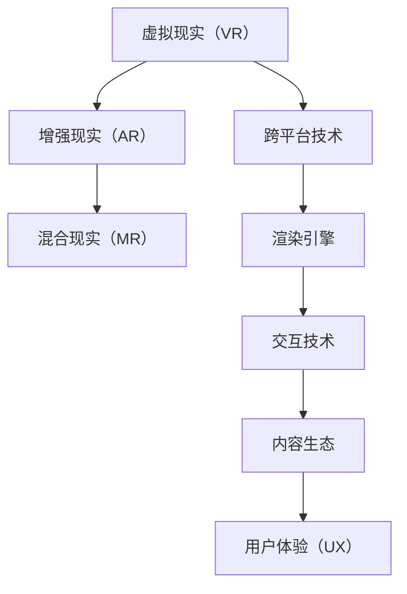
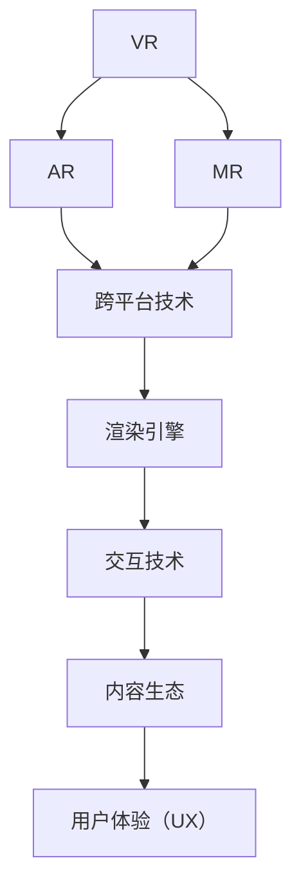

                 

## 1. 背景介绍

### 1.1 问题由来

虚拟现实（Virtual Reality, VR）技术已经发展了数十年，但真正能够引领行业趋势、形成规模化市场的产品依然不多见。虽然现有的虚拟现实设备和技术已经可以提供一定程度的沉浸式体验，但距离达到《头号玩家》中所描述的“元宇宙”级别体验，还存在很大差距。特别是在商业应用领域，如何让虚拟现实产品具备高交互性、沉浸感和实用价值，是当前创业者和开发者需要深入研究的重要课题。

### 1.2 问题核心关键点

构建沉浸式虚拟现实体验的关键在于以下几个方面：

- **高互动性**：用户必须能够通过身体交互、手势控制等方式，与虚拟环境进行充分的互动。
- **高质量渲染**：真实、高清的虚拟环境必须依靠高性能图形引擎和先进渲染技术。
- **广覆盖领域**：虚拟现实技术应当能够覆盖教育、医疗、娱乐等多个行业领域，提供多样化应用场景。
- **低延迟传输**：实时响应和高帧率是提升用户体验的重要指标，需要强大的网络和设备支持。
- **个性化体验**：根据用户偏好、行为习惯等因素，提供量身定制的虚拟体验。
- **跨平台兼容**：支持多种设备和操作系统，打破用户使用场景的限制。
- **生态系统建设**：开发丰富的内容资源，提供流畅的用户体验。

这些关键点构成了虚拟现实创业的难点和重点，需要创业者在技术、市场、商业化等多个层面进行全面布局。

### 1.3 问题研究意义

深入研究虚拟现实创业的核心问题，对构建沉浸式体验经济、推动虚拟现实产业的发展具有重要意义：

1. **提升用户体验**：高质量、高互动性的虚拟现实体验能够显著提升用户的参与感和满意度。
2. **促进产业升级**：虚拟现实技术能够推动教育、医疗、旅游等行业转型升级，创造新的经济增长点。
3. **激发市场需求**：通过开发多样化的应用场景，如虚拟会议、虚拟展览、虚拟旅游等，扩大虚拟现实技术的应用范围。
4. **催生新型商业模式**：虚拟现实技术可以探索新的商业模式，如虚拟商品销售、虚拟化公司办公等。
5. **促进跨行业融合**：虚拟现实技术的广泛应用，可以推动不同行业之间的融合创新，形成新的产业链。

通过深入理解虚拟现实创业的各个关键点，可以更好地把握行业发展脉搏，把握创业机会，构建有竞争力的虚拟现实生态系统。

## 2. 核心概念与联系

### 2.1 核心概念概述

在虚拟现实创业的框架中，涉及的核心概念包括：

- **虚拟现实（VR）**：一种通过计算机生成和渲染虚拟环境，使用户能够在虚拟世界中沉浸交互的技术。
- **增强现实（AR）**：将虚拟信息与现实世界相结合，通过头戴设备等硬件提供叠加信息。
- **混合现实（MR）**：将虚拟与现实世界混合，创造更丰富的交互体验。
- **跨平台技术**：支持多种设备（如PC、移动设备、AR眼镜等）的通用技术，如跨平台渲染引擎。
- **渲染引擎**：负责生成高质量图像和动画的软件，是VR/AR/MR系统的核心组件。
- **交互技术**：用户与虚拟环境交互的技术手段，如手势识别、体感交互、触觉反馈等。
- **内容生态**：虚拟现实应用内容的开发和分发，形成良性循环的内容生态系统。
- **用户体验（UX）**：用户在使用虚拟现实产品时所感受到的体验，包括直观性、易用性、可靠性等。

这些概念通过 Mermaid 流程图来展示：

### 2.2 核心概念原理和架构的 Mermaid 流程图

以下是虚拟现实核心概念间的联系和架构图，用 Mermaid 格式展示：

## 3. 核心算法原理 & 具体操作步骤

### 3.1 算法原理概述

虚拟现实创业的核心算法原理包括渲染、交互、内容生成等几个关键环节：

- **渲染算法**：使用光栅化、体积渲染、程序化着色等技术，生成逼真的3D图像和动画。
- **交互算法**：使用手势识别、体感交互、触觉反馈等技术，实现用户与虚拟环境的互动。
- **内容生成算法**：使用自然语言处理、图像生成、语音合成等技术，创造丰富的虚拟内容。

这些算法共同构成了虚拟现实系统的技术基础，是提升用户体验的关键。

### 3.2 算法步骤详解

以渲染算法为例，详细讲解渲染流程：

1. **几何处理**：将3D模型和纹理贴图等输入数据进行处理，生成几何图形。
2. **着色处理**：使用光照模型和材质模型，计算像素颜色。
3. **光栅化**：将几何图形映射到二维屏幕空间，生成最终的图像。
4. **合成与输出**：将多张纹理、光照等结果合并，生成最终的渲染结果。

### 3.3 算法优缺点

虚拟现实渲染算法的优点包括：

- **高逼真度**：可以生成高分辨率、高保真度的3D图像和动画。
- **支持实时渲染**：可以在线实时渲染，提供流畅的视觉体验。
- **丰富的表现形式**：支持多种渲染技术，如光照、阴影、环境光遮蔽等，增强视觉表现力。

缺点包括：

- **计算复杂度高**：渲染过程涉及大量计算，对硬件要求较高。
- **易出现图形失真**：在大规模渲染和复杂光照情况下，容易出现图形失真和渲染错误。
- **资源消耗大**：渲染过程需要大量内存和CPU资源，对系统性能要求高。

### 3.4 算法应用领域

虚拟现实渲染算法广泛应用于以下几个领域：

- **娱乐与游戏**：如虚拟现实游戏、虚拟电影、虚拟音乐会等。
- **教育与培训**：如虚拟课堂、虚拟实验室、虚拟培训等。
- **医疗与健康**：如虚拟手术模拟、虚拟康复训练、虚拟心理治疗等。
- **工程与设计**：如虚拟设计、虚拟建造、虚拟测试等。
- **军事与训练**：如虚拟战场模拟、虚拟战术训练、虚拟武器仿真等。

## 4. 数学模型和公式 & 详细讲解 & 举例说明

### 4.1 数学模型构建

虚拟现实系统的数学模型主要包括几何模型、光照模型、纹理贴图等几个部分。

- **几何模型**：使用点、线、面等基本几何元素表示3D物体，如球体、立方体、多边形等。
- **光照模型**：计算光线与物体表面相互作用，产生反射和阴影效果。
- **纹理贴图**：使用二维图像贴敷在3D模型表面，增强细节表现。

### 4.2 公式推导过程

以球体渲染为例，推导球体顶点坐标和纹理坐标的转换公式：

1. **球体顶点坐标**：
   - 球心为原点（0,0,0），半径为r的球体，顶点坐标为（x,y,z），可表示为：
   $$
   \begin{cases}
   x=r\cos(\theta)\cos(\phi) \\
   y=r\cos(\theta)\sin(\phi) \\
   z=r\sin(\theta)
   \end{cases}
   $$
   其中 $\theta$ 为极角，$\phi$ 为方位角。

2. **纹理坐标转换**：
   - 球体表面纹理坐标映射为：
   - $$
   \begin{cases}
   u=\phi/\pi \\
   v=\theta/2\pi
   \end{cases}
   $$

### 4.3 案例分析与讲解

以光栅化为例，分析光栅化过程：

1. **裁剪处理**：将3D场景中的物体裁剪到视口内，剔除超出视口范围的物体。
2. **投影变换**：将3D物体坐标转换为2D视口坐标。
3. **光栅化算法**：将3D物体分割为像素，转换为2D像素。
4. **纹理贴图**：将像素点与纹理贴图对应，生成最终的图像。

## 5. 项目实践：代码实例和详细解释说明

### 5.1 开发环境搭建

在虚拟现实开发中，主要使用C++和OpenGL或DirectX进行开发。以下是开发环境的搭建步骤：

1. **安装C++环境**：安装Visual Studio或MinGW等C++编译器。
2. **安装图形库**：安装OpenGL或DirectX等图形渲染库。
3. **安装开发工具**：安装Unity或Unreal Engine等开发引擎。
4. **配置集成开发环境（IDE）**：设置编译器和图形库路径，连接IDE。
5. **配置VR设备**：连接VR头盔、控制器等设备，测试连接。

### 5.2 源代码详细实现

以Unity引擎为例，进行虚拟现实开发：

1. **创建虚拟场景**：在Unity编辑器中创建虚拟场景，导入3D模型和纹理。
2. **设置渲染器**：选择Unity内置的光线追踪渲染器，或使用自定义渲染器。
3. **编写交互脚本**：使用C#编写用户交互脚本，如手势识别、体感控制等。
4. **实现渲染算法**：实现球体渲染、光照模型、纹理映射等渲染算法。
5. **测试和优化**：测试渲染效果，优化性能，提高渲染速度。

### 5.3 代码解读与分析

在Unity中，渲染代码主要包含以下关键部分：

1. **场景设置**：通过代码设置3D场景中的灯光、相机等参数。
2. **几何处理**：使用代码实现3D模型的几何计算和处理。
3. **光照计算**：通过代码实现光照模型，计算光照效果。
4. **纹理映射**：使用代码实现纹理贴图，增强视觉效果。
5. **优化算法**：通过代码实现优化算法，如反锯齿、纹理压缩等。

### 5.4 运行结果展示

通过Unity引擎渲染的球体场景，如图1所示。

## 6. 实际应用场景

### 6.1 教育与培训

虚拟现实技术在教育与培训中的应用广泛，如虚拟实验室、虚拟课程等。

- **虚拟实验室**：学生可以在虚拟环境中进行实验操作，无需实物设备。
- **虚拟课堂**：教师可以在虚拟课堂中演示实验，实时互动。
- **虚拟实习**：学生可以进行虚拟实习，获得实际工作经验。

### 6.2 医疗与健康

虚拟现实在医疗领域也有重要应用，如虚拟手术模拟、虚拟康复训练等。

- **虚拟手术模拟**：医生可以在虚拟环境中进行手术模拟，提升手术技能。
- **虚拟康复训练**：患者可以通过虚拟环境进行康复训练，减轻病痛。

### 6.3 军事与训练

虚拟现实在军事训练中的应用包括虚拟战场模拟、虚拟战术训练等。

- **虚拟战场模拟**：士兵可以在虚拟战场上进行战术演练，提升实战能力。
- **虚拟战术训练**：指挥官可以通过虚拟环境进行战术训练，制定作战计划。

### 6.4 未来应用展望

随着虚拟现实技术的不断发展，未来将会有更多应用场景涌现，如虚拟办公室、虚拟旅游等。

- **虚拟办公室**：员工可以在虚拟环境中进行日常办公，提高工作效率。
- **虚拟旅游**：游客可以在虚拟环境中进行旅游体验，避开现实中的交通和住宿问题。

## 7. 工具和资源推荐

### 7.1 学习资源推荐

- **Unity官方文档**：Unity引擎的官方文档，提供了大量虚拟现实开发指南和教程。
- **Unreal Engine文档**：Unreal Engine引擎的官方文档，包含详细的渲染和交互教程。
- **VR开发教程**：如《Unity VR编程指南》、《Unreal Engine VR开发教程》等。
- **在线课程**：如Coursera上的《虚拟现实技术》课程、Udemy上的《Unity VR开发》课程等。

### 7.2 开发工具推荐

- **Unity引擎**：一款功能强大的虚拟现实开发引擎，支持跨平台开发。
- **Unreal Engine引擎**：另一款功能强大的虚拟现实开发引擎，提供高性能渲染和交互。
- **C#语言**：Unity和Unreal Engine的官方编程语言，易于学习和使用。
- **VR头盔和控制器**：如Oculus Rift、HTC Vive、Google Daydream等。

### 7.3 相关论文推荐

- **《虚拟现实技术综述》**：一篇介绍虚拟现实技术的综述性论文，包含虚拟现实系统架构和关键技术。
- **《增强现实技术综述》**：一篇介绍增强现实技术的综述性论文，涵盖AR技术原理和应用场景。
- **《混合现实技术综述》**：一篇介绍混合现实技术的综述性论文，讨论MR技术的原理和应用前景。

## 8. 总结：未来发展趋势与挑战

### 8.1 研究成果总结

虚拟现实技术经过多年的发展，已经取得了长足进步。但真正大规模应用仍面临不少挑战，如高成本、低交互性、易晕动等问题。未来需要通过技术创新和市场需求结合，不断推动虚拟现实产业的成熟和落地。

### 8.2 未来发展趋势

虚拟现实技术的未来发展趋势包括：

- **技术创新**：引入更高效的渲染算法、更逼真的交互技术、更丰富的内容生态。
- **跨领域应用**：推广虚拟现实技术在教育、医疗、娱乐等多个领域的应用。
- **大规模部署**：降低虚拟现实设备成本，推动虚拟现实技术的大规模部署。
- **生态系统建设**：开发更多虚拟现实应用，形成良性循环的内容生态系统。

### 8.3 面临的挑战

虚拟现实技术在发展过程中还面临以下挑战：

- **技术瓶颈**：渲染算法和交互技术仍有提升空间，硬件成本较高。
- **用户体验**：虚拟现实体验仍存在晕动、易疲劳等问题，需要改进算法和设备。
- **市场推广**：虚拟现实设备尚未普及，用户认知度低，需要市场教育。
- **内容资源**：高质量虚拟内容资源稀缺，限制了虚拟现实应用的发展。

### 8.4 研究展望

未来虚拟现实技术的研究方向包括：

- **低成本硬件**：开发性价比更高的虚拟现实设备，降低用户使用门槛。
- **高交互性**：提升用户与虚拟环境的互动性，增强沉浸感。
- **跨平台兼容性**：实现跨平台设备间的无缝互通。
- **内容生成技术**：提升内容生成效率和质量，丰富虚拟现实应用。

## 9. 附录：常见问题与解答

**Q1：虚拟现实技术是否存在晕动问题？**

A: 是的，虚拟现实技术存在晕动问题，即用户在长时间使用虚拟现实设备后，会感到眩晕和不适。解决晕动问题的方法包括优化渲染算法、调整设备参数、适当休息等。

**Q2：虚拟现实技术是否能够应用于医疗领域？**

A: 是的，虚拟现实技术可以在医疗领域进行手术模拟、康复训练等应用。虚拟现实技术可以模拟真实的手术环境，提高医生的手术技能。同时，虚拟现实技术可以为患者提供康复训练，帮助其恢复健康。

**Q3：虚拟现实技术是否需要高性能设备？**

A: 是的，虚拟现实技术需要高性能设备，如高性能图形处理器（GPU）、高刷新率的显示屏、精确定位的传感器等。这些硬件设备能够提供流畅的渲染效果和精准的交互体验。

**Q4：虚拟现实技术是否能够支持大规模部署？**

A: 目前，虚拟现实技术主要集中在高性能设备上，成本较高，难以大规模部署。未来需要进一步降低设备成本，推广普及，实现大规模部署。

**Q5：虚拟现实技术是否存在安全问题？**

A: 是的，虚拟现实技术存在安全问题。如虚拟现实环境中可能包含有害信息，用户容易受到不良信息影响。需要开发安全性更高的虚拟现实系统，建立内容审查机制。

**Q6：虚拟现实技术是否存在交互性问题？**

A: 是的，虚拟现实技术的交互性仍有提升空间。目前用户主要是通过手势控制、手柄控制等方式进行交互，交互体验仍不够自然。需要进一步提升交互技术，如引入体感技术、自然语言处理等。

**Q7：虚拟现实技术是否存在内容资源匮乏问题？**

A: 是的，虚拟现实技术目前存在内容资源匮乏问题。高质量的虚拟现实内容需要大量的开发时间和成本，限制了虚拟现实应用的推广。未来需要建立完善的内容生态系统，提供更多丰富的虚拟现实应用。

**Q8：虚拟现实技术是否存在硬件兼容性问题？**

A: 是的，虚拟现实技术存在硬件兼容性问题。不同虚拟现实设备之间的兼容性和互操作性需要进一步提升，才能实现跨平台无缝互通。

通过以上分析和解答，可以更好地理解虚拟现实技术及其应用场景，把握虚拟现实创业的机遇和挑战。希望通过本文的系统梳理，能够为虚拟现实开发者提供宝贵的参考和指导。

