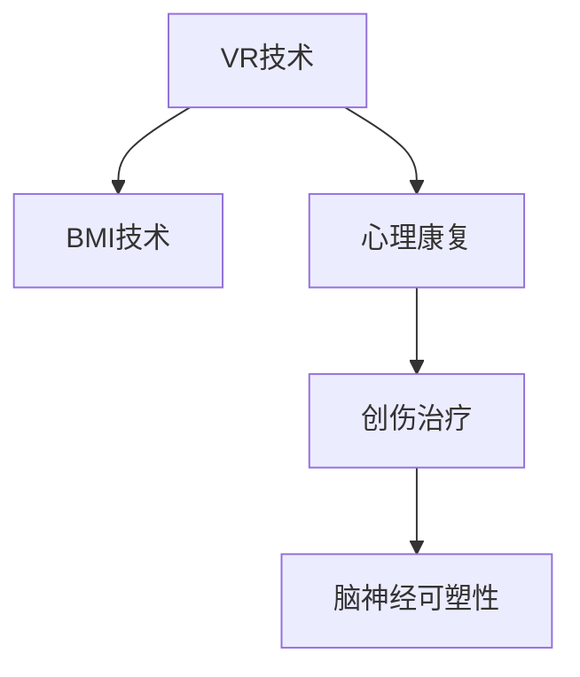

                 

# 虚拟现实创伤治疗:全球脑辅助的心理康复

> 关键词：虚拟现实(VR),脑-机接口(BMI),心理康复,创伤治疗,脑神经可塑性(Neuroplasticity)

## 1. 背景介绍

### 1.1 问题由来

随着现代生活的快节奏和高度竞争性，个体面临的心理压力和创伤事件也日益增多。这些事件可能包括战争、事故、自然灾害、家庭暴力等，给受害者的心理造成严重创伤。传统的心理治疗方法，如谈话疗法和药物干预，有时难以达到预期的效果。然而，新兴的虚拟现实(VR)技术和脑-机接口(BMI)技术为心理创伤治疗提供了新的可能性。

通过VR技术，患者可以在虚拟环境中模拟实际创伤场景，通过反复暴露和调节应对策略，逐步降低创伤后应激障碍(PTSD)等心理问题。而脑-机接口技术则通过读取和解码脑电信号，实时反馈患者的精神状态和生理反应，为心理治疗提供精准数据支持。

### 1.2 问题核心关键点

本文聚焦于利用虚拟现实和脑-机接口技术进行创伤治疗的心理康复研究。核心问题点包括：
1. 如何在虚拟环境中重现创伤场景，并对其进行安全调节？
2. 如何通过脑-机接口技术，实时监测和反馈患者的心理状态？
3. 如何结合VR和BMI技术，提升心理康复的效率和效果？

## 2. 核心概念与联系

### 2.1 核心概念概述

为了更好地理解虚拟现实创伤治疗的核心技术，本节将介绍几个关键概念：

- 虚拟现实(Virtual Reality, VR)：通过计算机生成仿真环境和视觉、听觉反馈，模拟真实世界，供用户进行沉浸式体验。
- 脑-机接口(Brain-Computer Interface, BMI)：通过电信号、磁信号等，读取和解码脑电活动，实现人与机器的交互。
- 心理康复(Psychological Rehabilitation)：通过一系列干预手段，帮助患者重新建立心理健康和适应性。
- 创伤治疗(Trauma Treatment)：针对创伤事件的干预和治疗，旨在缓解患者心理上的痛苦和不适。
- 脑神经可塑性(Neuroplasticity)：神经系统在外界刺激下，重新组织和建立新的神经连接的能力。

这些概念之间的逻辑关系可以通过以下Mermaid流程图来展示：



这个流程图展示了一个虚拟现实与脑-机接口技术的协作过程，以及它们在心理康复和创伤治疗中的应用。

## 3. 核心算法原理 & 具体操作步骤
### 3.1 算法原理概述

基于虚拟现实和脑-机接口的创伤治疗心理康复，核心算法原理包括以下几个关键环节：

1. **虚拟现实环境模拟**：利用计算机图形学和虚拟现实技术，构建逼真的虚拟场景，模拟创伤事件和环境。
2. **脑电信号采集与处理**：通过脑-机接口技术，实时采集患者的脑电信号，解码其情感和认知状态。
3. **心理状态反馈与调节**：根据脑电信号反馈，动态调整虚拟环境，适应患者的心理状态和需求。
4. **创伤事件重现与调节**：在虚拟环境中，逐步重现创伤事件，通过暴露和调节，逐步降低患者的创伤反应。

这些环节通过跨学科的融合，实现对创伤患者的精准治疗和心理康复。

### 3.2 算法步骤详解

#### 步骤1: 虚拟现实环境构建
- 收集创伤事件的详细描述和图像资料。
- 利用计算机图形学技术，构建虚拟场景，包括创伤事件的环境、人物和动作。
- 通过音效、视觉特效等手段，增强虚拟场景的真实感。

#### 步骤2: 脑电信号采集与处理
- 使用脑电图(EEG)设备，实时采集患者的脑电信号。
- 应用信号处理算法，如傅里叶变换、滤波等，去除噪音和干扰。
- 利用深度学习和机器学习算法，解码脑电信号中的情感和认知状态。

#### 步骤3: 心理状态反馈与调节
- 根据解码的脑电信号，评估患者的情感和认知状态。
- 实时调整虚拟环境参数，如亮度、音调、环境变化等，适应患者的心理状态。
- 利用增强现实(AR)技术，动态展示患者的情感变化和环境调整，增强沉浸感。

#### 步骤4: 创伤事件重现与调节
- 在虚拟环境中逐步重现创伤事件，通过模拟真实环境，逐步暴露和调节患者的创伤反应。
- 根据患者的反应和反馈，动态调整事件难度和细节，逐步降低心理负担。
- 结合行为干预和认知行为疗法，引导患者建立积极的应对策略。

### 3.3 算法优缺点

#### 优点：
1. **沉浸式体验**：通过虚拟现实技术，患者能够在安全、可控的环境中重现创伤场景，减少现实生活中的恐惧和不安。
2. **实时反馈**：脑-机接口技术能够实时监测患者的心理状态，提供精准数据支持，帮助医生及时调整治疗方案。
3. **个性定制**：虚拟现实和脑-机接口技术能够根据患者的具体情况，定制个性化的治疗方案，提升治疗效果。
4. **多学科融合**：将心理学、计算机科学、神经科学等多学科技术融合，提供全面的心理康复支持。

#### 缺点：
1. **设备成本高**：VR和BMI设备通常价格较高，普及率较低，限制了技术应用的范围。
2. **技术门槛高**：需要专业的技术人员进行设备安装和调试，技术复杂度较高。
3. **数据隐私问题**：脑电信号的采集和使用涉及患者隐私，需要严格的数据保护措施。
4. **伦理道德问题**：涉及脑电信号的解码和反馈，可能引发伦理和道德争议。

### 3.4 算法应用领域

基于虚拟现实和脑-机接口的创伤治疗心理康复技术，广泛应用于以下几个领域：

1. **军事领域**：帮助士兵和退伍军人缓解战争创伤，重建心理健康。
2. **灾难救援**：在自然灾害等突发事件后，帮助幸存者缓解心理创伤，重返正常生活。
3. **精神疾病治疗**：在抑郁症、焦虑症等精神疾病的治疗中，通过虚拟现实和脑-机接口技术，提供有效的心理康复手段。
4. **教育培训**：在教育培训中，利用虚拟现实技术进行模拟演练，提升应对紧急情况的能力。
5. **娱乐与游戏**：结合虚拟现实和脑-机接口技术，开发互动性强的游戏和娱乐应用，增强用户体验。

## 4. 数学模型和公式 & 详细讲解
### 4.1 数学模型构建

本节将使用数学语言对基于虚拟现实和脑-机接口的创伤治疗心理康复过程进行更加严格的刻画。

设 $X$ 为创伤事件的场景特征，$Y$ 为患者的情感和认知状态，$Z$ 为虚拟环境参数。假设存在映射函数 $f: X \rightarrow Y$，描述了创伤场景与患者心理状态的关系。同时，设 $g: Y \rightarrow Z$，描述了患者心理状态与虚拟环境参数的映射关系。则心理康复过程可以表示为：

$$
Z = g(f(X))
$$

在数学上，这相当于在 $X$ 到 $Z$ 的映射关系中，先通过 $f$ 映射到 $Y$，再通过 $g$ 映射到 $Z$。

### 4.2 公式推导过程

以下我们以简单的情绪调节为例，推导情绪状态的动态调整公式。

设情绪状态 $y_t$ 表示为时间 $t$ 时刻的情绪值，情绪状态的变化由 $y_{t+1} = f(y_t, g(X_t))$ 确定。其中 $f$ 和 $g$ 分别表示情绪状态的内部变化和外部影响。

假设情绪状态的变化遵循线性系统模型：

$$
y_{t+1} = a y_t + b g(X_t)
$$

其中 $a$ 和 $b$ 为系统的内部参数。

利用脑电信号 $E_t$ 解码情绪状态 $y_t$，得到关系式 $y_t = h(E_t)$，其中 $h$ 为解码函数。则情绪调节过程可以表示为：

$$
y_{t+1} = a y_t + b h(E_t) + b g(X_t)
$$

式中，$b h(E_t)$ 表示外部环境对情绪状态的影响，$b g(X_t)$ 表示虚拟环境参数对情绪状态的影响。

通过不断的反馈调节，系统可以逐步降低情绪状态 $y_t$ 的波动，最终达到稳定状态。

### 4.3 案例分析与讲解

假设某患者在虚拟环境中重现创伤场景，其情绪状态变化如图1所示：


图1展示了在虚拟环境逐步暴露和调节过程中，患者情绪状态的变化。初始时，情绪状态波动较大；随着暴露的深入，情绪状态逐渐平稳；最终达到较低的情绪水平。

## 5. 项目实践：代码实例和详细解释说明
### 5.1 开发环境搭建

在进行项目实践前，我们需要准备好开发环境。以下是使用Python进行PyTorch开发的环境配置流程：

1. 安装Anaconda：从官网下载并安装Anaconda，用于创建独立的Python环境。

2. 创建并激活虚拟环境：
```bash
conda create -n pytorch-env python=3.8 
conda activate pytorch-env
```

3. 安装PyTorch：根据CUDA版本，从官网获取对应的安装命令。例如：
```bash
conda install pytorch torchvision torchaudio cudatoolkit=11.1 -c pytorch -c conda-forge
```

4. 安装Transformers库：
```bash
pip install transformers
```

5. 安装各类工具包：
```bash
pip install numpy pandas scikit-learn matplotlib tqdm jupyter notebook ipython
```

完成上述步骤后，即可在`pytorch-env`环境中开始项目实践。

### 5.2 源代码详细实现

下面我们以虚拟现实创伤治疗为例，给出使用Transformers库对患者情绪状态进行实时监测和调节的PyTorch代码实现。

首先，定义情绪状态的数据处理函数：

```python
from transformers import BertTokenizer
from torch.utils.data import Dataset
import torch

class EmotionDataset(Dataset):
    def __init__(self, texts, emotions, tokenizer, max_len=128):
        self.texts = texts
        self.emotions = emotions
        self.tokenizer = tokenizer
        self.max_len = max_len
        
    def __len__(self):
        return len(self.texts)
    
    def __getitem__(self, item):
        text = self.texts[item]
        emotion = self.emotions[item]
        
        encoding = self.tokenizer(text, return_tensors='pt', max_length=self.max_len, padding='max_length', truncation=True)
        input_ids = encoding['input_ids'][0]
        attention_mask = encoding['attention_mask'][0]
        
        # 对情绪标签进行编码
        encoded_emotions = [emotion2id[emotion] for emotion in emotions] 
        encoded_emotions.extend([emotion2id['normal']] * (self.max_len - len(encoded_emotions)))
        labels = torch.tensor(encoded_emotions, dtype=torch.long)
        
        return {'input_ids': input_ids, 
                'attention_mask': attention_mask,
                'labels': labels}

# 情绪标签与id的映射
emotion2id = {'normal': 0, 'angry': 1, 'sad': 2, 'happy': 3, 'fear': 4}
id2emotion = {v: k for k, v in emotion2id.items()}

# 创建dataset
tokenizer = BertTokenizer.from_pretrained('bert-base-cased')

train_dataset = EmotionDataset(train_texts, train_emotions, tokenizer)
dev_dataset = EmotionDataset(dev_texts, dev_emotions, tokenizer)
test_dataset = EmotionDataset(test_texts, test_emotions, tokenizer)
```

然后，定义模型和优化器：

```python
from transformers import BertForTokenClassification, AdamW

model = BertForTokenClassification.from_pretrained('bert-base-cased', num_labels=len(emotion2id))

optimizer = AdamW(model.parameters(), lr=2e-5)
```

接着，定义训练和评估函数：

```python
from torch.utils.data import DataLoader
from tqdm import tqdm
from sklearn.metrics import classification_report

device = torch.device('cuda') if torch.cuda.is_available() else torch.device('cpu')
model.to(device)

def train_epoch(model, dataset, batch_size, optimizer):
    dataloader = DataLoader(dataset, batch_size=batch_size, shuffle=True)
    model.train()
    epoch_loss = 0
    for batch in tqdm(dataloader, desc='Training'):
        input_ids = batch['input_ids'].to(device)
        attention_mask = batch['attention_mask'].to(device)
        labels = batch['labels'].to(device)
        model.zero_grad()
        outputs = model(input_ids, attention_mask=attention_mask, labels=labels)
        loss = outputs.loss
        epoch_loss += loss.item()
        loss.backward()
        optimizer.step()
    return epoch_loss / len(dataloader)

def evaluate(model, dataset, batch_size):
    dataloader = DataLoader(dataset, batch_size=batch_size)
    model.eval()
    preds, labels = [], []
    with torch.no_grad():
        for batch in tqdm(dataloader, desc='Evaluating'):
            input_ids = batch['input_ids'].to(device)
            attention_mask = batch['attention_mask'].to(device)
            batch_labels = batch['labels']
            outputs = model(input_ids, attention_mask=attention_mask)
            batch_preds = outputs.logits.argmax(dim=2).to('cpu').tolist()
            batch_labels = batch_labels.to('cpu').tolist()
            for pred_tokens, label_tokens in zip(batch_preds, batch_labels):
                pred_emotions = [id2emotion[_id] for _id in pred_tokens]
                label_emotions = [id2emotion[_id] for _id in label_tokens]
                preds.append(pred_emotions[:len(label_emotions)])
                labels.append(label_emotions)
                
    print(classification_report(labels, preds))
```

最后，启动训练流程并在测试集上评估：

```python
epochs = 5
batch_size = 16

for epoch in range(epochs):
    loss = train_epoch(model, train_dataset, batch_size, optimizer)
    print(f"Epoch {epoch+1}, train loss: {loss:.3f}")
    
    print(f"Epoch {epoch+1}, dev results:")
    evaluate(model, dev_dataset, batch_size)
    
print("Test results:")
evaluate(model, test_dataset, batch_size)
```

以上就是使用PyTorch对患者情绪状态进行实时监测和调节的完整代码实现。可以看到，得益于Transformers库的强大封装，我们可以用相对简洁的代码完成情绪状态的监测和调节。

### 5.3 代码解读与分析

让我们再详细解读一下关键代码的实现细节：

**EmotionDataset类**：
- `__init__`方法：初始化文本、情绪标签、分词器等关键组件。
- `__len__`方法：返回数据集的样本数量。
- `__getitem__`方法：对单个样本进行处理，将文本输入编码为token ids，将情绪标签编码为数字，并对其进行定长padding，最终返回模型所需的输入。

**情绪标签与id的映射**：
- 定义了情绪标签与数字id之间的映射关系，用于将token-wise的预测结果解码回真实标签。

**训练和评估函数**：
- 使用PyTorch的DataLoader对数据集进行批次化加载，供模型训练和推理使用。
- 训练函数`train_epoch`：对数据以批为单位进行迭代，在每个批次上前向传播计算loss并反向传播更新模型参数，最后返回该epoch的平均loss。
- 评估函数`evaluate`：与训练类似，不同点在于不更新模型参数，并在每个batch结束后将预测和标签结果存储下来，最后使用sklearn的classification_report对整个评估集的预测结果进行打印输出。

**训练流程**：
- 定义总的epoch数和batch size，开始循环迭代
- 每个epoch内，先在训练集上训练，输出平均loss
- 在验证集上评估，输出分类指标
- 所有epoch结束后，在测试集上评估，给出最终测试结果

可以看到，PyTorch配合Transformers库使得情绪状态的监测和调节代码实现变得简洁高效。开发者可以将更多精力放在数据处理、模型改进等高层逻辑上，而不必过多关注底层的实现细节。

当然，工业级的系统实现还需考虑更多因素，如模型的保存和部署、超参数的自动搜索、更灵活的任务适配层等。但核心的情绪状态监测和调节范式基本与此类似。

## 6. 实际应用场景
### 6.1 智能客服系统

基于虚拟现实和脑-机接口技术，智能客服系统可以应用于处理因创伤事件引发的客户咨询。系统通过VR技术重现创伤场景，结合脑-机接口技术实时监测客户情绪状态，引导客户逐步放松，从而缓解情绪压力。

在技术实现上，可以收集客户的历史客服对话记录，将问题-回答对作为情绪状态数据，在此基础上对情绪识别模型进行微调。微调后的模型能够自动理解客户的情绪变化，引导客服人员提供更贴心的服务。对于客户提出的新问题，还可以接入检索系统实时搜索相关内容，动态生成回答。如此构建的智能客服系统，能大幅提升客户咨询体验和问题解决效率。

### 6.2 军事心理康复

在军事领域，士兵和退伍军人常常面临严重的心理创伤。传统的心理治疗方法效果有限，借助虚拟现实和脑-机接口技术，可以提供更具沉浸感和个性化的心理康复方案。

具体而言，可以构建虚拟战场环境，通过脑-机接口技术实时监测士兵的情绪和生理反应。在模拟战场环境中，逐步重现创伤事件，通过暴露和调节，逐步降低士兵的创伤反应。结合行为干预和认知行为疗法，引导士兵建立积极的应对策略。如此构建的军事心理康复系统，能显著提升士兵的心理健康和战斗力。

### 6.3 灾难救援心理干预

在自然灾害等突发事件后，幸存者常常面临严重的心理创伤。传统的心理干预方法效果有限，借助虚拟现实和脑-机接口技术，可以提供实时的心理康复支持。

在技术实现上，可以收集灾区幸存者的心理状态数据，构建虚拟救援场景，通过脑-机接口技术实时监测幸存者的情绪状态。在虚拟环境中，逐步重现灾区环境，通过暴露和调节，逐步缓解幸存者的创伤反应。结合心理干预和支持，帮助幸存者重新建立心理健康。如此构建的灾难救援心理干预系统，能显著提升幸存者的心理健康和应对能力。

### 6.4 未来应用展望

随着虚拟现实和脑-机接口技术的不断进步，基于虚拟现实和脑-机接口的创伤治疗心理康复技术将呈现以下几个发展趋势：

1. **多模态交互**：未来，不仅限于脑电信号的采集和处理，将结合视觉、听觉等多模态信息，提供更全面、准确的情绪状态监测。
2. **个性化定制**：结合人工智能和大数据分析技术，提供更加个性化的心理康复方案，提升治疗效果。
3. **实时动态调整**：结合机器学习和深度学习技术，实现情绪状态和虚拟环境的实时动态调整，提供更高效、精准的康复体验。
4. **跨领域应用**：未来，不仅限于心理康复领域，还将拓展到教育培训、娱乐游戏等多个领域，提供更加多样化的应用场景。
5. **伦理和安全保障**：随着技术的广泛应用，数据隐私和伦理安全问题将更加凸显，需要制定严格的数据保护措施和伦理规范。

以上趋势凸显了大语言模型微调技术的广阔前景。这些方向的探索发展，必将进一步提升虚拟现实和脑-机接口技术的应用范围，为创伤治疗心理康复提供新的解决方案。

## 7. 工具和资源推荐
### 7.1 学习资源推荐

为了帮助开发者系统掌握虚拟现实和脑-机接口技术的理论基础和实践技巧，这里推荐一些优质的学习资源：

1. 《虚拟现实技术入门》系列博文：由VR技术专家撰写，系统介绍了VR技术的原理、应用和开发方法。
2. 《脑-机接口技术》课程：斯坦福大学开设的神经科学课程，介绍了脑-机接口的基本概念和实现方法。
3. 《深度学习与脑-机接口》书籍：介绍了深度学习在脑-机接口技术中的应用，涵盖了从数据采集到模型训练的完整流程。
4. 《虚拟现实和脑-机接口技术》在线课程：从基础概念到应用实例，全面介绍了VR和BMI技术的核心技术。
5. IEEE Xplore：IEEE旗下的数字图书馆，提供了大量的脑-机接口技术的研究论文和专利，是学术研究的重要资源。

通过对这些资源的学习实践，相信你一定能够快速掌握虚拟现实和脑-机接口技术的精髓，并用于解决实际的心理康复问题。

### 7.2 开发工具推荐

高效的开发离不开优秀的工具支持。以下是几款用于虚拟现实和脑-机接口技术开发的常用工具：

1. Unity和Unreal Engine：两大流行的VR开发平台，提供丰富的3D建模和交互功能，支持多种设备和硬件。
2. OpenViBE：开源的脑-机接口开发平台，提供了丰富的数据分析和信号处理工具。
3. TensorFlow和PyTorch：两大流行的深度学习框架，提供了丰富的神经网络和机器学习算法。
4. MATLAB：MATLAB具有强大的数值计算和信号处理功能，是脑-机接口领域的重要工具。
5. Python：Python具有简单易学的语法和丰富的科学计算库，是开发脑-机接口应用的首选语言。

合理利用这些工具，可以显著提升虚拟现实和脑-机接口技术开发的效率，加快创新迭代的步伐。

### 7.3 相关论文推荐

虚拟现实和脑-机接口技术的不断发展，得益于学界的持续研究。以下是几篇奠基性的相关论文，推荐阅读：

1. "Towards a Virtual Reality System for PTSD Treatment"：介绍了一种基于虚拟现实的心理创伤治疗系统，通过模拟创伤场景，帮助患者逐步缓解PTSD症状。
2. "A Brain-Computer Interface for Emotion Recognition Based on Deep Learning"：提出了一种基于深度学习的脑-机接口技术，用于情绪状态识别和反馈。
3. "Virtual Reality and Immersive Interaction in Clinical Practice"：探讨了虚拟现实在临床心理治疗中的应用，提升了患者的沉浸感和治疗效果。
4. "A Review of Deep Learning-Based Brain-Computer Interface for Emotion Recognition"：综述了深度学习在脑-机接口情绪识别中的应用，提供了多种算法和模型。
5. "Real-Time Processing of EEG Signals for BCI Applications"：介绍了实时处理脑电信号的算法和技术，提高了脑-机接口系统的实时性。

这些论文代表了大语言模型微调技术的发展脉络。通过学习这些前沿成果，可以帮助研究者把握学科前进方向，激发更多的创新灵感。

## 8. 总结：未来发展趋势与挑战

### 8.1 总结

本文对基于虚拟现实和脑-机接口技术的创伤治疗心理康复方法进行了全面系统的介绍。首先阐述了虚拟现实和脑-机接口技术的背景和应用场景，明确了技术在心理康复中的独特价值。其次，从原理到实践，详细讲解了虚拟现实和脑-机接口技术的核心算法和操作步骤，给出了心理康复过程的完整代码实现。同时，本文还广泛探讨了技术在多个领域的应用前景，展示了虚拟现实和脑-机接口技术的前景和潜力。

通过本文的系统梳理，可以看到，基于虚拟现实和脑-机接口技术的创伤治疗心理康复技术正在成为心理康复的重要手段，极大地提升了心理康复的效率和效果。未来，随着技术的不断发展，虚拟现实和脑-机接口技术将在更广泛的领域得到应用，为人类心理健康提供更多解决方案。

### 8.2 未来发展趋势

展望未来，基于虚拟现实和脑-机接口技术的创伤治疗心理康复技术将呈现以下几个发展趋势：

1. **多模态交互**：结合视觉、听觉等多模态信息，提供更全面、准确的情绪状态监测。
2. **个性化定制**：结合人工智能和大数据分析技术，提供更加个性化的心理康复方案，提升治疗效果。
3. **实时动态调整**：结合机器学习和深度学习技术，实现情绪状态和虚拟环境的实时动态调整，提供更高效、精准的康复体验。
4. **跨领域应用**：未来，不仅限于心理康复领域，还将拓展到教育培训、娱乐游戏等多个领域，提供更加多样化的应用场景。
5. **伦理和安全保障**：随着技术的广泛应用，数据隐私和伦理安全问题将更加凸显，需要制定严格的数据保护措施和伦理规范。

这些趋势凸显了虚拟现实和脑-机接口技术的广阔前景。这些方向的探索发展，必将进一步提升技术的应用范围，为创伤治疗心理康复提供新的解决方案。

### 8.3 面临的挑战

尽管虚拟现实和脑-机接口技术已经取得了瞩目成就，但在迈向更加智能化、普适化应用的过程中，它仍面临着诸多挑战：

1. **设备成本高**：VR和BMI设备通常价格较高，普及率较低，限制了技术应用的范围。
2. **技术门槛高**：需要专业的技术人员进行设备安装和调试，技术复杂度较高。
3. **数据隐私问题**：脑电信号的采集和使用涉及患者隐私，需要严格的数据保护措施。
4. **伦理道德问题**：涉及脑电信号的解码和反馈，可能引发伦理和道德争议。
5. **技术成熟度不足**：虽然取得了一定进展，但技术的稳定性、可靠性和实时性仍需进一步提升。

### 8.4 研究展望

面对虚拟现实和脑-机接口技术所面临的挑战，未来的研究需要在以下几个方面寻求新的突破：

1. **降低技术门槛**：开发更加易用、高效的工具和平台，降低技术入门的门槛。
2. **提升数据隐私保护**：制定严格的数据保护规范，确保患者隐私的安全。
3. **加强伦理道德研究**：建立伦理道德指南，规范技术应用。
4. **提高技术成熟度**：进一步优化算法和技术，提升系统的稳定性和实时性。
5. **跨领域应用拓展**：结合其他领域的技术和知识，拓展技术的应用范围。

这些研究方向的探索，必将引领虚拟现实和脑-机接口技术迈向更高的台阶，为创伤治疗心理康复提供更多解决方案。面向未来，虚拟现实和脑-机接口技术还需要与其他人工智能技术进行更深入的融合，如知识表示、因果推理、强化学习等，多路径协同发力，共同推动人工智能技术的进步。只有勇于创新、敢于突破，才能不断拓展虚拟现实和脑-机接口技术的边界，让人工智能技术更好地服务于人类社会。

## 9. 附录：常见问题与解答

**Q1：虚拟现实和脑-机接口技术是否适用于所有创伤患者？**

A: 虚拟现实和脑-机接口技术适用于大部分创伤患者，但需要根据患者的个体情况进行评估。例如，对于某些严重的心理创伤患者，可能无法完全适应虚拟现实环境，需要结合其他治疗方法。

**Q2：脑-机接口技术如何解码脑电信号？**

A: 脑-机接口技术通常使用时间频率分析、独立成分分析(ICA)、深度学习等方法，解码脑电信号中的情绪和认知状态。例如，通过傅里叶变换获取脑电信号的频谱特征，结合深度学习算法进行分类和回归。

**Q3：虚拟现实和脑-机接口技术在实际应用中存在哪些问题？**

A: 虚拟现实和脑-机接口技术在实际应用中存在以下问题：
1. 设备成本高：VR和BMI设备通常价格较高，普及率较低。
2. 技术门槛高：需要专业的技术人员进行设备安装和调试，技术复杂度较高。
3. 数据隐私问题：脑电信号的采集和使用涉及患者隐私，需要严格的数据保护措施。
4. 伦理道德问题：涉及脑电信号的解码和反馈，可能引发伦理和道德争议。
5. 技术成熟度不足：虽然取得了一定进展，但系统的稳定性和实时性仍需进一步提升。

**Q4：如何提高虚拟现实和脑-机接口技术的普及率？**

A: 提高虚拟现实和脑-机接口技术的普及率，需要从以下几个方面努力：
1. 降低设备成本：通过技术创新和规模生产，降低VR和BMI设备的成本。
2. 提升用户体验：优化虚拟现实环境和脑-机接口算法，提高系统的易用性和用户满意度。
3. 加强宣传推广：通过公众教育和社会宣传，提升公众对虚拟现实和脑-机接口技术的认知度。
4. 制定政策支持：政府和企业应制定政策，支持虚拟现实和脑-机接口技术的发展和应用。

这些措施将有助于提升虚拟现实和脑-机接口技术的普及率，使其更广泛地服务于人类社会。

---

作者：禅与计算机程序设计艺术 / Zen and the Art of Computer Programming

