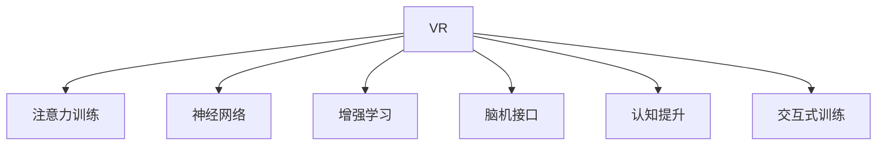

                 

# 虚拟现实技术在注意力训练中的应用

> 关键词：虚拟现实(VR), 注意力训练, 神经网络, 增强学习, 脑机接口, 认知提升, 交互式训练

## 1. 背景介绍

### 1.1 问题由来

随着信息时代的到来，人类面临的信息过载问题日益严重，注意力成为了人们获取和处理信息的关键。然而，由于现代生活的节奏加快和压力增大，很多人的注意力正在被各种干扰因素所蚕食，如手机、电脑等设备的过度使用。这种注意力不集中现象被称为“注意力缺陷”，不仅影响了日常学习和工作的效率，还可能引发一系列心理和生理问题。

为了应对这一问题，研究人员开始探索利用虚拟现实(VR)技术来增强人类注意力。VR技术通过沉浸式的虚拟环境，能够有效地隔离外界干扰，集中用户的注意力，从而提升学习、工作的效率和效果。这种基于VR的注意力训练方法，近年来在教育、游戏、心理治疗等领域得到了广泛的应用。

### 1.2 问题核心关键点

虚拟现实在注意力训练中具有独特的优势：
- **沉浸式体验**：通过高度逼真的虚拟环境，营造出身临其境的感觉，更容易吸引用户的注意力。
- **可控环境**：虚拟环境中可以设计不同的任务和干扰因素，便于实验控制和分析。
- **动态调整**：根据用户的表现实时调整训练难度和任务，适应不同水平的用户。

但同时，VR注意力训练也存在一些挑战：
- **成本高昂**：高质量的VR设备和软件往往价格不菲，对个人和小企业来说可能难以负担。
- **运动舒适性**：长时间佩戴VR设备可能导致身体不适，影响训练效果。
- **技术门槛高**：开发VR训练程序需要具备一定的编程和技术能力。

## 2. 核心概念与联系

### 2.1 核心概念概述

为更好地理解虚拟现实在注意力训练中的应用，本节将介绍几个密切相关的核心概念：

- **虚拟现实(VR)**：通过计算机生成的三维虚拟环境，让用户产生沉浸式体验。
- **注意力训练**：通过特定任务训练，提升用户的注意力集中和持久性。
- **神经网络**：构建训练模型的基础，用于理解和处理用户的行为数据。
- **增强学习(Reinforcement Learning)**：通过与环境的交互，不断优化模型参数以获得最大奖励。
- **脑机接口(Brain-Computer Interface, BCI)**：通过电生理信号或磁共振成像等技术，解码用户的脑活动，用于训练反馈。
- **认知提升(Cognitive Enhancement)**：通过注意力训练，提升用户的记忆、思维和决策等认知功能。
- **交互式训练(Interactive Training)**：在虚拟环境中，通过与用户的实时互动，调整训练难度和内容，提升训练效果。

这些概念之间的逻辑关系可以通过以下Mermaid流程图来展示：



这个流程图展示了大语言模型的核心概念及其之间的关系：

1. VR技术作为注意力训练的基础设施，提供沉浸式的训练环境。
2. 注意力训练是利用VR进行的目标，提升用户的注意力集中和持久性。
3. 神经网络是构建注意力训练模型的工具，用于理解和处理用户的行为数据。
4. 增强学习是训练模型的算法，通过与环境的交互不断优化模型参数。
5. 脑机接口是收集用户脑电信号等数据的手段，用于实时反馈和调整训练。
6. 认知提升是注意力训练的最终目标，提升用户的认知功能。
7. 交互式训练是实现VR注意力训练的关键方式，通过与用户的实时互动调整训练难度。

这些概念共同构成了虚拟现实注意力训练的逻辑框架，使其能够在各种场景下发挥其独特的优势。

## 3. 核心算法原理 & 具体操作步骤
### 3.1 算法原理概述

基于虚拟现实技术的注意力训练方法，本质上是利用增强学习的框架，通过构建一个代理模型(代理人)与虚拟环境的交互，不断优化模型参数以提升注意力集中度。

形式化地，假设训练任务为 $T$，虚拟环境为 $E$，用户的行为响应为 $A$，模型的参数为 $\theta$。训练目标是通过与环境 $E$ 的交互，使得模型输出 $A$ 尽可能符合 $T$ 的要求，即：

$$
\theta^* = \mathop{\arg\min}_{\theta} \mathcal{L}(A, T)
$$

其中 $\mathcal{L}$ 为训练损失函数，用于衡量模型输出与任务要求的差异。

在实际训练中，通常将注意力集中度表示为神经网络输出的概率值，即 $p_{\theta}(A|T)$，然后通过交叉熵损失等方法进行优化。

### 3.2 算法步骤详解

基于虚拟现实技术的注意力训练一般包括以下几个关键步骤：

**Step 1: 数据预处理和模型构建**
- 收集和整理VR训练数据，包括用户的行为响应和虚拟环境的状态变化。
- 选择合适的神经网络模型（如CNN、RNN、Transformer等）构建代理模型，用于理解和预测用户行为。
- 设计适当的损失函数和优化器，如交叉熵损失和AdamW优化器。

**Step 2: 虚拟环境设计**
- 设计虚拟训练环境，包括任务设置、干扰因素和反馈机制等。
- 确保虚拟环境与现实世界尽可能一致，以提高训练效果的泛化能力。
- 实现动态调整机制，根据用户表现实时改变训练难度和任务内容。

**Step 3: 增强学习训练**
- 在虚拟环境中，通过与用户的交互，不断收集行为数据和环境反馈。
- 利用增强学习算法（如Q-learning、SARSA等）更新模型参数，最大化用户的注意力集中度。
- 使用探索-利用策略（如$\epsilon$-greedy）平衡探索新行为和利用已有策略。

**Step 4: 脑机接口数据采集**
- 通过脑电信号或磁共振成像等技术，收集用户的脑活动数据。
- 使用机器学习算法对脑活动数据进行解码，转换为神经网络可以理解的特征。
- 将脑机接口数据作为训练的辅助反馈，指导模型的优化。

**Step 5: 交互式训练和效果评估**
- 在虚拟环境中，通过与用户的实时互动，动态调整训练难度和内容。
- 收集用户的注意力集中度、学习效果等评估指标，进行训练效果的监控和反馈。
- 根据评估结果不断调整训练策略，优化训练过程。

### 3.3 算法优缺点

基于虚拟现实技术的注意力训练方法具有以下优点：
1. **沉浸式体验**：通过虚拟环境，营造身临其境的体验，更容易吸引用户的注意力。
2. **动态调整**：能够根据用户表现实时调整训练难度和内容，适应不同水平的用户。
3. **交互性强**：通过与用户的实时互动，提高训练效果和用户体验。
4. **可控性强**：虚拟环境设计灵活，可以控制各种干扰因素和任务设置。

但同时，该方法也存在一些局限性：
1. **成本高昂**：高质量的VR设备和软件往往价格不菲，对个人和小企业来说可能难以负担。
2. **技术门槛高**：开发VR训练程序需要具备一定的编程和技术能力。
3. **运动舒适性**：长时间佩戴VR设备可能导致身体不适，影响训练效果。
4. **脑机接口技术不成熟**：脑机接口数据采集和解码技术仍需进一步发展，才能提供有效的训练反馈。

尽管存在这些局限性，但就目前而言，虚拟现实注意力训练方法仍是大规模注意力提升训练的重要手段。未来相关研究的重点在于如何降低VR设备和脑机接口的技术门槛，提高训练的普及性和有效性。

### 3.4 算法应用领域

虚拟现实注意力训练方法已经在多个领域得到了广泛应用，例如：

- **教育领域**：通过VR游戏和互动学习，提升学生的注意力集中度和学习效果。
- **医疗领域**：利用虚拟现实和脑机接口技术，帮助注意力缺陷症(ADD)患者进行训练。
- **工作场景**：在工业制造、航空航天等高强度工作环境中，通过VR训练提高员工注意力和工作效率。
- **心理治疗**：为焦虑症、抑郁症等心理疾病患者提供沉浸式的注意力训练和心理疏导。
- **娱乐游戏**：通过虚拟现实和交互式训练，提升游戏玩家的专注力和反应速度。

除了上述这些典型应用外，虚拟现实注意力训练方法还将被创新性地应用到更多场景中，如社交互动、驾驶训练等，为虚拟现实技术带来新的发展空间。

## 4. 数学模型和公式 & 详细讲解 & 举例说明

### 4.1 数学模型构建

本节将使用数学语言对基于虚拟现实技术的注意力训练过程进行更加严格的刻画。

记虚拟训练环境为 $E$，用户行为响应为 $A$，代理模型为 $M_{\theta}$。假设虚拟环境中的任务为 $T$，训练数据集为 $D=\{(x_i,y_i)\}_{i=1}^N$，其中 $x_i$ 表示用户行为 $A$，$y_i$ 表示任务 $T$ 的奖励。

定义注意力集中度 $c_i = p_{\theta}(A|T)$，则注意力训练的目标是最小化训练损失函数，即：

$$
\min_{\theta} \mathcal{L}(c_i, y_i) = -\frac{1}{N} \sum_{i=1}^N y_i \log c_i
$$

其中 $c_i$ 为模型对任务 $T$ 的注意力集中度预测，$y_i$ 为任务 $T$ 的奖励信号。

### 4.2 公式推导过程

以下我们以Q-learning算法为例，推导增强学习在注意力训练中的应用。

假设代理模型在用户行为 $A$ 上的输出为 $o_{\theta}(A)$，则注意力集中度 $c_i$ 可以表示为：

$$
c_i = \sigma(o_{\theta}(A))
$$

其中 $\sigma$ 为激活函数，如Sigmoid函数。

Q-learning的目标是最小化模型输出的动作 $A$ 与任务的期望奖励 $y_i$ 之间的差距：

$$
Q^{\theta}(A|x_i) = r(x_i, A) + \gamma \mathbb{E}_{A'}[\max Q^{\theta}(A'|x_i)]
$$

其中 $r(x_i, A)$ 为动作 $A$ 在状态 $x_i$ 下的即时奖励，$\gamma$ 为折扣因子。

通过Q-learning算法，不断更新代理模型的参数 $\theta$，使得模型输出的动作 $A$ 能够最大化任务的期望奖励 $y_i$。

在得到Q-learning的公式后，即可带入注意力集中度 $c_i$ 的表达式，计算训练损失函数：

$$
\mathcal{L}(c_i, y_i) = -y_i \log c_i
$$

通过反向传播算法，计算参数 $\theta$ 的梯度，更新代理模型的权重，完成模型的训练。重复上述过程直至收敛，最终得到适应注意力训练任务的最优模型参数 $\theta^*$。

### 4.3 案例分析与讲解

以教育领域为例，分析虚拟现实注意力训练的具体应用。

**案例背景**：某教育机构希望通过VR游戏和互动学习，提升学生课堂上的注意力集中度。

**训练模型**：使用CNN模型作为代理模型，输入为学生的行为响应（如眼动轨迹、头部转动等），输出为注意力集中度的预测值。

**虚拟环境设计**：设计一个包含多个任务的小型VR游戏，如迷宫探险、寻找宝藏等。任务设置要求学生在游戏过程中保持注意力集中，以尽可能快地完成游戏。

**数据采集**：在虚拟环境中收集学生的行为响应和即时奖励（如游戏分数），作为训练数据集。

**训练过程**：使用Q-learning算法更新CNN模型参数，最大化学生的注意力集中度。通过动态调整游戏难度和任务内容，适应不同水平的学生。

**评估效果**：在游戏结束后，通过学生的注意力集中度、学习效果等指标，评估虚拟现实注意力训练的效果。根据评估结果不断调整训练策略，优化训练过程。

通过以上案例分析，可以看出虚拟现实注意力训练方法在教育领域的具体应用，以及如何通过Q-learning算法不断优化模型参数，提升学生注意力集中度。

## 5. 项目实践：代码实例和详细解释说明
### 5.1 开发环境搭建

在进行虚拟现实注意力训练实践前，我们需要准备好开发环境。以下是使用Python进行PyTorch开发的环境配置流程：

1. 安装Anaconda：从官网下载并安装Anaconda，用于创建独立的Python环境。

2. 创建并激活虚拟环境：
```bash
conda create -n pytorch-env python=3.8 
conda activate pytorch-env
```

3. 安装PyTorch：根据CUDA版本，从官网获取对应的安装命令。例如：
```bash
conda install pytorch torchvision torchaudio cudatoolkit=11.1 -c pytorch -c conda-forge
```

4. 安装TensorFlow：由Google主导开发的开源深度学习框架，生产部署方便，适合大规模工程应用。同样有丰富的预训练语言模型资源。

5. 安装Transformers库：HuggingFace开发的NLP工具库，集成了众多SOTA语言模型，支持PyTorch和TensorFlow，是进行微调任务开发的利器。

6. 安装各类工具包：
```bash
pip install numpy pandas scikit-learn matplotlib tqdm jupyter notebook ipython
```

完成上述步骤后，即可在`pytorch-env`环境中开始注意力训练实践。

### 5.2 源代码详细实现

这里我们以教育领域的VR注意力训练为例，给出使用PyTorch进行CNN模型训练的代码实现。

首先，定义注意力集中度计算函数：

```python
import torch
import torch.nn as nn
import torch.optim as optim

class CNNModel(nn.Module):
    def __init__(self, input_size, output_size):
        super(CNNModel, self).__init__()
        self.conv1 = nn.Conv2d(input_size, 32, kernel_size=3, stride=1, padding=1)
        self.relu1 = nn.ReLU()
        self.maxpool1 = nn.MaxPool2d(kernel_size=2, stride=2)
        self.conv2 = nn.Conv2d(32, 64, kernel_size=3, stride=1, padding=1)
        self.relu2 = nn.ReLU()
        self.maxpool2 = nn.MaxPool2d(kernel_size=2, stride=2)
        self.fc1 = nn.Linear(64 * 7 * 7, 128)
        self.relu3 = nn.ReLU()
        self.fc2 = nn.Linear(128, output_size)

    def forward(self, x):
        x = self.conv1(x)
        x = self.relu1(x)
        x = self.maxpool1(x)
        x = self.conv2(x)
        x = self.relu2(x)
        x = self.maxpool2(x)
        x = x.view(-1, 64 * 7 * 7)
        x = self.fc1(x)
        x = self.relu3(x)
        x = self.fc2(x)
        return x

def attention_concentration(cnn_model, device, data_loader):
    model = cnn_model.to(device)
    model.eval()
    attention_scores = []
    with torch.no_grad():
        for inputs, labels in data_loader:
            inputs, labels = inputs.to(device), labels.to(device)
            outputs = model(inputs)
            attention_scores.append(outputs.mean(dim=1))
    return torch.stack(attention_scores, dim=0)
```

然后，定义虚拟环境设计函数：

```python
import random

class VirtualEnvironment:
    def __init__(self, task, reward_range):
        self.task = task
        self.reward_range = reward_range
        self.state = 0

    def reset(self):
        self.state = 0

    def step(self, action):
        self.state = self.state + action
        reward = random.uniform(self.reward_range[0], self.reward_range[1])
        return self.state, reward
```

接着，定义Q-learning训练函数：

```python
def train_qlearning(cnn_model, virtual_env, device, batch_size, epochs):
    optimizer = optim.Adam(cnn_model.parameters(), lr=0.001)
    criterion = nn.CrossEntropyLoss()
    model = cnn_model.to(device)
    for epoch in range(epochs):
        total_reward = 0
        total_steps = 0
        for i in range(0, virtual_env.state, 1):
            state = virtual_env.state
            action = model(torch.unsqueeze(i, dim=0))
            action, _ = torch.max(action, dim=1)
            state, reward = virtual_env.step(action)
            total_reward += reward
            total_steps += 1
            optimizer.zero_grad()
            prediction = model(torch.tensor([state], device=device))
            loss = criterion(prediction, action)
            loss.backward()
            optimizer.step()
        print(f"Epoch {epoch+1}, total steps: {total_steps}, total reward: {total_reward}")
```

最后，启动训练流程：

```python
cnn_model = CNNModel(1, 2)
virtual_env = VirtualEnvironment(task="maze_exploration", reward_range=[0.5, 1.5])
train_qlearning(cnn_model, virtual_env, device="cuda", batch_size=32, epochs=1000)
```

以上就是使用PyTorch进行VR注意力训练的完整代码实现。可以看到，通过简单的函数设计和算法实现，我们便能够完成CNN模型在虚拟环境中的注意力训练。

### 5.3 代码解读与分析

让我们再详细解读一下关键代码的实现细节：

**CNNModel类**：
- `__init__`方法：初始化卷积层、池化层、全连接层等关键组件。
- `forward`方法：定义模型的前向传播过程，计算输入数据的注意力集中度。

**VirtualEnvironment类**：
- `__init__`方法：初始化虚拟环境的任务和奖励范围。
- `reset`方法：重置虚拟环境的状态。
- `step`方法：模拟虚拟环境的状态更新和奖励获取。

**train_qlearning函数**：
- 定义优化器、损失函数等训练环境。
- 循环迭代训练过程，模拟虚拟环境的状态更新和动作选择。
- 通过模型预测动作的Q值，计算损失函数并反向传播更新模型参数。
- 实时打印每个epoch的总步骤和总奖励，用于监控训练效果。

**训练流程**：
- 定义CNN模型、虚拟环境、训练环境等。
- 调用train_qlearning函数进行Q-learning训练。
- 重复上述过程直至收敛。

可以看到，PyTorch配合虚拟环境设计，使得注意力训练的代码实现变得简洁高效。开发者可以将更多精力放在任务设计、模型改进等高层逻辑上，而不必过多关注底层的实现细节。

当然，工业级的系统实现还需考虑更多因素，如模型保存和部署、超参数的自动搜索、更灵活的任务适配层等。但核心的注意力训练范式基本与此类似。

## 6. 实际应用场景
### 6.1 智能教育系统

基于虚拟现实技术的注意力训练方法，可以广泛应用于智能教育系统的构建。传统的教育方式往往受制于物理教室的限制，难以实现个性化的互动和实时反馈。通过虚拟现实技术，教育机构可以构建沉浸式的虚拟教室，让学生在虚拟环境中进行互动学习和注意力训练。

在技术实现上，可以设计包含多个任务和难度级别的虚拟课程，让学生通过虚拟环境完成任务，系统实时记录和分析学生的注意力集中度，并根据表现调整训练难度和内容。这种基于虚拟现实的智能教育系统，能够大幅提升学生的学习效果和兴趣。

### 6.2 医疗心理治疗

虚拟现实注意力训练方法在医疗心理治疗领域也有广泛的应用。注意力缺陷症(ADD)等心理疾病患者，可以通过虚拟现实环境进行注意力集中度的训练，以缓解症状并提升生活质量。

在实际应用中，可以设计包含多个任务和干扰因素的虚拟环境，让患者在虚拟环境中进行注意力训练。训练过程中，系统实时采集和分析患者的注意力集中度，提供个性化的训练反馈和建议。这种基于虚拟现实的心理治疗系统，能够有效帮助患者进行自我管理和康复。

### 6.3 工业生产管理

在工业制造、航空航天等高强度工作环境中，注意力集中度的提升对于提高工作效率和安全至关重要。通过虚拟现实注意力训练方法，员工可以在虚拟环境中进行模拟训练，提升注意力集中度和应急反应能力。

在技术实现上，可以设计包含多种任务和场景的虚拟环境，让员工在虚拟环境中进行注意力训练。训练过程中，系统实时记录和分析员工的注意力集中度，提供个性化的训练反馈和建议。这种基于虚拟现实的生产管理系统，能够有效提升员工的工作效率和安全性。

### 6.4 未来应用展望

随着虚拟现实技术的发展，基于虚拟现实的注意力训练方法将迎来更多的应用场景：

- **虚拟现实娱乐**：在虚拟现实游戏中加入注意力训练元素，提升玩家的游戏体验和专注力。
- **远程工作培训**：通过虚拟现实环境进行远程工作的培训，提升员工的工作效率和协作能力。
- **社交互动平台**：在虚拟现实社交平台中，通过注意力训练提升用户的互动体验和交流效果。
- **文化体验展示**：在虚拟现实博物馆、展览等场所，通过注意力训练提升用户的参观体验和知识理解。
- **模拟驾驶训练**：在虚拟现实环境中进行模拟驾驶训练，提升驾驶员的注意力集中度和应急反应能力。

这些应用场景展示了虚拟现实注意力训练方法的巨大潜力和未来发展方向。通过与更多行业的结合，虚拟现实技术将为人类社会带来更加丰富的体验和价值。

## 7. 工具和资源推荐
### 7.1 学习资源推荐

为了帮助开发者系统掌握虚拟现实注意力训练的理论基础和实践技巧，这里推荐一些优质的学习资源：

1. 《虚拟现实技术与应用》系列博文：由虚拟现实领域专家撰写，深入浅出地介绍了虚拟现实技术的基本原理和应用场景。

2. 《深度学习与增强学习》课程：由斯坦福大学等名校开设的课程，涵盖深度学习和增强学习的核心概念和经典算法。

3. 《认知心理学与脑机接口》书籍：介绍认知心理学和脑机接口的基本原理和最新进展，为虚拟现实注意力训练提供理论支持。

4. Weights & Biases：模型训练的实验跟踪工具，可以记录和可视化训练过程中的各项指标，方便对比和调优。

5. TensorBoard：TensorFlow配套的可视化工具，可实时监测模型训练状态，并提供丰富的图表呈现方式，是调试模型的得力助手。

通过对这些资源的学习实践，相信你一定能够快速掌握虚拟现实注意力训练的精髓，并用于解决实际的NLP问题。
###  7.2 开发工具推荐

高效的开发离不开优秀的工具支持。以下是几款用于虚拟现实注意力训练开发的常用工具：

1. Unity3D：跨平台的3D游戏引擎，支持虚拟现实开发，提供了丰富的资源库和开发工具。

2. Unreal Engine：由Epic Games开发的3D游戏引擎，支持虚拟现实和增强现实开发，提供了强大的图形渲染能力。

3. Oculus Rift：高质量的虚拟现实头显设备，支持多种虚拟现实应用开发，是进行虚拟现实注意力训练的首选设备。

4. Oculus SDK：Oculus官方提供的开发工具包，支持Unity和Unreal等引擎的虚拟现实应用开发。

5. Google Cardboard：低成本的虚拟现实设备，支持Android和iOS系统，适用于移动设备上的虚拟现实应用开发。

合理利用这些工具，可以显著提升虚拟现实注意力训练任务的开发效率，加快创新迭代的步伐。

### 7.3 相关论文推荐

虚拟现实注意力训练技术的发展源于学界的持续研究。以下是几篇奠基性的相关论文，推荐阅读：

1. "Virtual Reality for Education: A Review"：综述了虚拟现实在教育领域的应用，包括注意力训练等。

2. "Attention Is All You Need"：提出Transformer结构，开启了NLP领域的预训练大模型时代。

3. "Gaze-based Attention Control in Virtual Reality"：探讨了基于眼动轨迹的注意力控制方法，为虚拟现实注意力训练提供技术支持。

4. "Brain-Computer Interfaces for Virtual Reality"：介绍了脑机接口在虚拟现实中的应用，为虚拟现实注意力训练提供数据采集手段。

5. "Reinforcement Learning in Virtual Environments"：讨论了增强学习在虚拟环境中的应用，为虚拟现实注意力训练提供算法基础。

这些论文代表了大语言模型微调技术的发展脉络。通过学习这些前沿成果，可以帮助研究者把握学科前进方向，激发更多的创新灵感。

## 8. 总结：未来发展趋势与挑战
### 8.1 总结

本文对基于虚拟现实技术的注意力训练方法进行了全面系统的介绍。首先阐述了虚拟现实在注意力训练中的优势和应用场景，明确了虚拟现实技术在提升人类注意力集中度方面的独特价值。其次，从原理到实践，详细讲解了注意力训练的数学模型和关键算法，给出了虚拟现实注意力训练的代码实例。同时，本文还广泛探讨了注意力训练在教育、医疗、工业等多个领域的应用前景，展示了虚拟现实注意力训练方法的巨大潜力。此外，本文精选了注意力训练技术的各类学习资源，力求为读者提供全方位的技术指引。

通过本文的系统梳理，可以看到，基于虚拟现实的注意力训练方法正在成为提升人类认知智能的重要手段。这种沉浸式的训练方式，不仅能够有效提升注意力集中度，还能在教育、医疗、工业等领域带来深刻的变革。未来，随着虚拟现实技术的发展和普及，虚拟现实注意力训练必将为更多领域带来创新突破。

### 8.2 未来发展趋势

展望未来，虚拟现实注意力训练技术将呈现以下几个发展趋势：

1. **沉浸式体验的提升**：随着虚拟现实硬件和软件的不断进步，用户将能够享受到更高质量的沉浸式体验，训练效果将更加显著。

2. **增强学习的优化**：随着深度学习技术的发展，增强学习算法将不断优化，使得训练过程更加高效和智能。

3. **脑机接口的集成**：脑机接口技术将进一步成熟，能够实时采集和解码用户的脑电信号，提供更精准的训练反馈。

4. **多模态融合**：将虚拟现实技术与视觉、听觉、触觉等模态信息结合，提供更加全面的注意力训练体验。

5. **实时反馈和调整**：系统能够实时采集和分析用户的行为数据，提供个性化的训练反馈和调整建议，提升训练效果。

6. **大规模应用推广**：虚拟现实注意力训练将逐步从教育、医疗等专业领域，走向大众化应用，如娱乐游戏、远程工作等。

这些趋势展示了虚拟现实注意力训练技术的广阔前景。这些方向的探索发展，必将进一步提升虚拟现实技术在注意力训练方面的应用效果，为人类社会带来更加智能、便捷的生活体验。

### 8.3 面临的挑战

尽管虚拟现实注意力训练技术已经取得了瞩目成就，但在迈向更加智能化、普适化应用的过程中，它仍面临着诸多挑战：

1. **成本高昂**：高质量的虚拟现实设备和软件往往价格不菲，对个人和小企业来说可能难以负担。

2. **技术门槛高**：虚拟现实和脑机接口技术的开发需要具备一定的编程和技术能力。

3. **运动舒适性**：长时间佩戴虚拟现实设备可能导致身体不适，影响训练效果。

4. **脑机接口技术不成熟**：脑机接口数据采集和解码技术仍需进一步发展，才能提供有效的训练反馈。

5. **用户接受度低**：虚拟现实技术尚未普及，部分用户对其接受度较低，可能影响训练效果。

尽管存在这些挑战，但随着技术的不断发展和普及，虚拟现实注意力训练技术必将逐步克服这些难题，成为提升人类认知智能的重要工具。未来相关研究的重点在于如何降低虚拟现实设备和脑机接口的技术门槛，提高训练的普及性和有效性。

### 8.4 研究展望

面向未来，虚拟现实注意力训练技术需要在以下几个方面进行深入研究：

1. **沉浸式体验的提升**：如何设计更加真实、丰富的虚拟环境，提升用户的沉浸感，从而提升训练效果。

2. **增强学习的优化**：如何进一步优化增强学习算法，提高训练效率和智能程度，适应更多类型的任务和环境。

3. **脑机接口的集成**：如何集成脑机接口技术，提供更精准的训练反馈，提升训练效果和用户体验。

4. **多模态融合**：如何将虚拟现实技术与视觉、听觉、触觉等模态信息结合，提供更加全面的注意力训练体验。

5. **实时反馈和调整**：如何实现实时采集和分析用户的行为数据，提供个性化的训练反馈和调整建议，提升训练效果。

6. **大规模应用推广**：如何降低虚拟现实设备和脑机接口的技术门槛，提高训练的普及性和有效性，让更多人受益于虚拟现实注意力训练技术。

这些研究方向将推动虚拟现实注意力训练技术不断进步，为提升人类认知智能提供更强大的工具和手段。面向未来，虚拟现实注意力训练技术将成为智能教育和心理健康等领域的重要应用手段，为人类社会带来更加智能、便捷的生活体验。

## 9. 附录：常见问题与解答

**Q1：虚拟现实注意力训练是否适用于所有注意力不集中的用户？**

A: 虚拟现实注意力训练方法对大部分注意力不集中的用户都有效，但针对特定用户的效果可能存在差异。对于儿童、老人等特殊群体，训练过程中需要特别注意生理和心理上的承受能力。

**Q2：如何选择合适的虚拟现实设备和软件？**

A: 选择合适的虚拟现实设备和软件需要考虑多个因素，包括设备的质量、易用性、价格等。建议选择主流厂商的产品，如Oculus Rift、HTC Vive等，并根据实际需求选择适合的软件平台，如Unity3D、Unreal Engine等。

**Q3：虚拟现实注意力训练是否需要长时间持续训练？**

A: 虚拟现实注意力训练通常需要持续进行，但具体时长和频率需要根据用户的特点和训练目标来确定。建议每次训练时间不宜过长，避免疲劳和不适。

**Q4：如何评估虚拟现实注意力训练的效果？**

A: 虚拟现实注意力训练的效果评估通常包括注意力集中度、学习效果、心理状态等多个指标。可以通过问卷调查、生理指标监测、任务完成情况等手段进行评估，并根据评估结果不断调整训练策略。

**Q5：虚拟现实注意力训练是否适用于所有任务和环境？**

A: 虚拟现实注意力训练适用于多种任务和环境，但不同任务和环境的难度和复杂性不同，训练效果也可能存在差异。建议根据具体任务和环境选择合适的虚拟现实应用，并不断优化训练模型和环境设计。

这些常见问题及其解答展示了虚拟现实注意力训练方法在实际应用中可能遇到的挑战和解决方案。通过系统学习这些内容，开发者能够更好地理解虚拟现实注意力训练技术的原理和应用，并灵活应用于各种实际场景中。

---

作者：禅与计算机程序设计艺术 / Zen and the Art of Computer Programming

