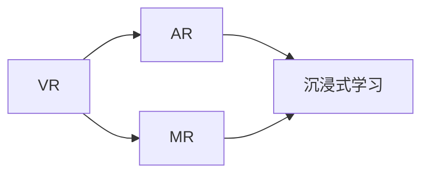

                 

# 虚拟现实教育创业：沉浸式学习体验

## 1. 背景介绍

### 1.1 问题由来
随着数字化教育的兴起，虚拟现实（Virtual Reality, VR）技术因其沉浸式、互动性强等特点，逐渐成为教育领域的重要创新工具。特别是在K-12教育和高等教育中，VR能够提供更加直观、形象、生动的学习体验，激发学生的学习兴趣，提高学习效果。

传统的教育方式通常依赖于黑板、教材和PPT等静态媒介，难以满足学生多样化的学习需求。VR技术通过立体、三维的视觉和听觉反馈，使得学生在虚拟环境中能够身临其境地参与学习，从而提升学习效果和体验。

### 1.2 问题核心关键点
在VR教育创业中，关键点包括以下几个方面：

- **技术选型**：选择合适的VR硬件和软件平台，如Oculus Rift、HTC Vive等。
- **内容设计**：开发丰富的教学内容，如虚拟实验室、历史场景重现、语言学习等。
- **用户体验**：优化VR系统的易用性和舒适度，避免晕动症等问题。
- **数据分析**：收集和分析学生互动数据，提供个性化学习方案。
- **市场推广**：探索有效的市场推广策略，扩大VR教育的市场规模。

### 1.3 问题研究意义
VR教育创业能够促进教育公平、提升教育质量、激发学生兴趣。其研究意义如下：

1. **教育公平**：VR技术能够跨越地域限制，为偏远地区学生提供优质教育资源。
2. **教育质量**：通过沉浸式学习，学生能够更深入地理解和掌握知识，提高考试成绩。
3. **兴趣激发**：通过生动有趣的学习体验，激发学生对学习的热爱和好奇心。
4. **市场规模**：VR教育的普及将创造巨大的市场空间，带动相关产业发展。

## 2. 核心概念与联系

### 2.1 核心概念概述

为更好地理解VR教育创业的流程，本节将介绍几个关键概念：

- **虚拟现实（Virtual Reality, VR）**：利用计算机生成仿真的三维视觉和听觉环境，使用户能够通过头显和控制器等设备，在虚拟环境中进行互动。
- **增强现实（Augmented Reality, AR）**：在现实世界中叠加虚拟信息，增强用户对环境的认知和互动。
- **混合现实（Mixed Reality, MR）**：将物理世界和数字世界融合，创建一种新的沉浸式体验。
- **沉浸式学习（Immersive Learning）**：利用虚拟现实技术，提供高度沉浸、互动的学习体验，增强学生参与度和学习效果。

这些概念之间的关系可以通过以下Mermaid流程图来展示：



这个流程图展示了几者之间的关系：

1. VR通过生成虚拟环境，为沉浸式学习提供基础。
2. AR通过增强现实世界，为沉浸式学习提供信息补充。
3. MR通过混合物理和虚拟世界，为沉浸式学习提供更丰富的交互方式。
4. 最终，所有的技术手段都服务于沉浸式学习，提升学习效果和体验。

## 3. 核心算法原理 & 具体操作步骤
### 3.1 算法原理概述

VR教育创业的核心在于利用虚拟现实技术，创造沉浸式的学习环境，实现知识的有效传递。具体来说，主要包括以下几个步骤：

1. **场景构建**：根据教学内容，构建虚拟学习场景，如实验室、历史场景等。
2. **用户交互**：通过虚拟角色和虚拟物品，实现用户与虚拟场景的互动。
3. **数据采集**：收集用户在学习过程中的动作、位置、时间等数据。
4. **反馈优化**：根据用户行为数据，动态调整学习内容和难度。
5. **个性化学习**：根据用户学习进度和兴趣，推荐个性化的学习路径和资源。

### 3.2 算法步骤详解

下面详细介绍VR教育创业的具体操作步骤：

**Step 1: 需求分析与场景设计**
- 与教育专家和一线教师合作，分析教学目标和需求。
- 根据需求设计虚拟学习场景，如虚拟实验室、历史场景重现等。
- 确定教学内容，如实验步骤、历史事件等。

**Step 2: 技术选型与系统搭建**
- 选择适合的VR硬件设备和软件开发平台，如Oculus Rift、HTC Vive等。
- 搭建VR教育平台，包括虚拟场景生成、用户交互、数据采集等功能模块。
- 优化用户体验，如调整头盔佩戴舒适度、减少晕动症等。

**Step 3: 内容开发与互动设计**
- 根据教学内容，开发丰富的虚拟学习内容，如互动实验、历史场景等。
- 设计互动方式，如交互式问答、虚拟实验操作等。
- 引入AR技术，增强虚拟场景的现实感和互动性。

**Step 4: 数据采集与分析**
- 使用传感器和追踪设备，收集用户在学习过程中的位置、动作等数据。
- 分析用户互动数据，识别学习障碍和兴趣点。
- 根据分析结果，动态调整学习内容和难度。

**Step 5: 个性化学习与反馈优化**
- 根据用户学习进度和兴趣，推荐个性化的学习路径和资源。
- 利用机器学习算法，优化学习内容的推荐策略。
- 提供及时反馈，鼓励用户持续学习。

### 3.3 算法优缺点

VR教育创业的优势包括：

1. **沉浸式体验**：提供高度沉浸、互动的学习环境，激发学生学习兴趣。
2. **多样化学习方式**：结合AR和MR技术，提供丰富多样的学习方式。
3. **个性化学习**：通过数据分析，提供个性化的学习方案。
4. **跨越地域限制**：为偏远地区学生提供优质教育资源。

同时，VR教育创业也存在一些局限性：

1. **硬件成本高**：VR设备和软件开发成本较高，难以大规模推广。
2. **技术门槛高**：需要专业的技术团队进行开发和维护。
3. **用户体验问题**：长时间使用可能引起晕动症等不适。
4. **数据隐私问题**：用户互动数据的隐私和安全需要得到保障。

### 3.4 算法应用领域

VR教育创业技术在多个领域都有广泛的应用，包括：

1. **K-12教育**：通过虚拟实验室、历史场景等，提供生动有趣的学习体验，激发学生兴趣。
2. **高等教育**：结合AR和MR技术，提供实验室模拟、虚拟解剖等复杂学习场景。
3. **职业培训**：利用虚拟现实技术，提供安全的职业培训环境，如模拟手术、飞行训练等。
4. **语言学习**：通过虚拟场景和互动对话，提升语言学习效果和兴趣。
5. **文化交流**：结合虚拟现实技术，进行跨文化交流和理解。

除了以上领域，VR教育技术还能应用于游戏、旅游、房地产等更多场景，为不同行业的教育和培训提供支持。

## 4. 数学模型和公式 & 详细讲解  
### 4.1 数学模型构建

在本节中，我们将通过数学模型来进一步说明VR教育创业的技术实现过程。

假设教学内容为$C$，虚拟场景为$S$，用户互动数据为$D$，个性化学习路径为$L$。则VR教育创业的过程可以表示为：

$$
L = f(C, S, D)
$$

其中$f$为优化函数，表示根据教学内容、虚拟场景和用户互动数据，生成个性化学习路径的映射关系。

### 4.2 公式推导过程

假设用户在学习过程中的行为数据为$\{x_i, y_i\}_{i=1}^N$，其中$x_i$为位置、动作等特征，$y_i$为行为结果，如实验成功、问题解答等。

根据贝叶斯网络模型，可以得到用户行为数据的联合概率分布$P(x, y)$。通过最大化后验概率，可以推导出优化函数$f$的计算公式：

$$
f = \mathop{\arg\max}_{L} P(L|C, S, D) = \mathop{\arg\max}_{L} \frac{P(L|C, S, D)}{P(C, S, D)}
$$

其中$P(C, S, D)$为数据分布的先验概率，$P(L|C, S, D)$为目标函数，即根据当前学习内容、虚拟场景和用户互动数据，生成最优学习路径的后验概率。

### 4.3 案例分析与讲解

以虚拟实验室为例，分析用户行为数据和个性化学习路径的关系：

假设用户在虚拟实验室中进行了以下操作：

1. 进入虚拟实验室（位置坐标$x_1$）。
2. 观察实验器材（选择器材$y_1$）。
3. 进行实验操作（操作动作$x_2$）。
4. 记录实验结果（记录结果$y_2$）。

根据用户行为数据$\{x_1, y_1, x_2, y_2\}$，可以推导出其行为模式$P(x, y)$。通过分析$P(x, y)$，可以得到用户的学习兴趣和障碍点，进一步优化个性化学习路径$L$。

## 5. 项目实践：代码实例和详细解释说明
### 5.1 开发环境搭建

在进行VR教育创业实践前，我们需要准备好开发环境。以下是使用Unity3D进行VR开发的环境配置流程：

1. 安装Unity3D：从官网下载并安装Unity3D，用于构建虚拟场景和交互逻辑。
2. 安装VRSDK：安装Oculus SDK、HTC Vive SDK等VR设备SDK，用于支持虚拟场景和用户交互。
3. 安装机器学习库：如TensorFlow、PyTorch等，用于处理用户互动数据和优化学习路径。

完成上述步骤后，即可在Unity3D中开始VR教育创业的开发工作。

### 5.2 源代码详细实现

这里我们以虚拟实验室为例，给出Unity3D中实现虚拟实验室的代码实现：

```csharp
using UnityEngine;
using UnityEngine.UI;
using System.Collections.Generic;

public class VirtualLab : MonoBehaviour
{
    public GameObject[] labItems;
    public GameObject[] labMetrics;
    public GameObject labController;
    private List<string> labSteps;
    private List<string> labResults;
    
    // 初始化虚拟实验室
    void Start()
    {
        labSteps = new List<string>();
        labResults = new List<string>();
        
        // 生成实验步骤
        for (int i = 0; i < labItems.Length; i++)
        {
            labSteps.Add("操作" + (i+1) + "个器材");
        }
        
        // 生成实验结果
        for (int i = 0; i < labMetrics.Length; i++)
        {
            labResults.Add("实验结果" + (i+1));
        }
        
        // 加载实验物品和指标
        for (int i = 0; i < labItems.Length; i++)
        {
            labItems[i].SetActive(i == 0);
        }
        for (int i = 0; i < labMetrics.Length; i++)
        {
            labMetrics[i].SetActive(i == 0);
        }
    }
    
    // 用户操作器材
    public void OperateLabItem(int itemIndex)
    {
        labItems[itemIndex].SetActive(false);
        labMetrics[itemIndex].SetActive(true);
        labController.SetActive(false);
    }
    
    // 用户记录实验结果
    public void RecordLabResult(int metricIndex)
    {
        labMetrics[metricIndex].SetActive(false);
        labController.SetActive(true);
    }
    
    // 反馈实验结果
    public void ShowFeedback(string result)
    {
        labController.SetActive(false);
        Debug.Log("实验结果：" + result);
    }
}
```

### 5.3 代码解读与分析

让我们再详细解读一下关键代码的实现细节：

**VirtualLab类**：
- `Start`方法：初始化虚拟实验室，生成实验步骤和结果。
- `OperateLabItem`方法：用户操作器材，关闭该器材，显示结果指标。
- `RecordLabResult`方法：用户记录实验结果，显示反馈控制器。
- `ShowFeedback`方法：显示实验结果，记录日志。

**数据结构**：
- `labSteps`和`labResults`：用于存储实验步骤和结果。

**用户交互**：
- 用户可以通过点击、拖动等操作，操作虚拟实验室中的器材。
- 用户可以通过记录按钮，记录实验结果。
- 系统根据用户行为数据，生成反馈信息。

通过Unity3D的脚本编写，可以方便地实现虚拟实验室的交互逻辑。开发者还可以进一步集成机器学习库，分析用户互动数据，优化学习路径。

## 6. 实际应用场景
### 6.1 虚拟实验室

虚拟实验室是VR教育创业中应用最广泛的场景之一。通过虚拟实验室，学生可以在虚拟环境中进行实验操作，掌握科学原理和方法。

在虚拟实验室中，学生可以通过交互式界面，进行虚拟实验操作，如虚拟显微镜、虚拟化学实验等。系统实时记录学生的动作和实验结果，根据学生的行为数据，提供个性化的实验指导和反馈。

### 6.2 历史场景重现

虚拟历史场景能够提供生动的历史教学体验，帮助学生更好地理解历史事件和人物。

在虚拟历史场景中，学生可以通过互动操作，体验历史事件的发展过程。系统根据学生的互动行为，提供历史事件的详细解释和背景信息，帮助学生更深入地理解历史知识。

### 6.3 语言学习

虚拟现实技术能够为语言学习提供沉浸式的语言环境，提升学生的语言听说能力。

在虚拟语言学习环境中，学生可以通过虚拟角色和虚拟物品，进行语言对话和交流。系统根据学生的对话行为，提供个性化语言训练和反馈，帮助学生提升语言水平。

### 6.4 未来应用展望

随着VR技术的不断进步，VR教育创业将在更多领域得到应用，为教育带来更多创新和可能。

在未来的教育中，VR技术将更加普及和便捷。学生可以通过便携式VR设备，随时随地进行沉浸式学习，提升学习效果。

同时，VR教育创业还将与其他技术手段进行更深层次的融合，如AR、MR、AI等，提供更加智能、个性化的学习体验。

## 7. 工具和资源推荐
### 7.1 学习资源推荐

为了帮助开发者系统掌握VR教育创业的理论基础和实践技巧，这里推荐一些优质的学习资源：

1. Unity3D官方文档：Unity3D的官方文档，提供了详尽的开发指南和API参考，是进行VR开发的基础。
2. VR开发教程：如C# VR开发教程、Unity3D VR开发教程等，帮助你掌握VR开发的流程和技巧。
3. AR/VR教育资源：如EdTech Hub、Virtual Classroom等，提供大量VR教育资源的下载和使用。
4. Machine Learning for VR：关于机器学习在VR教育中的应用，提供了丰富的案例和实现方法。

通过对这些资源的学习实践，相信你一定能够快速掌握VR教育创业的精髓，并用于解决实际的VR教育问题。

### 7.2 开发工具推荐

高效的开发离不开优秀的工具支持。以下是几款用于VR教育创业开发的常用工具：

1. Unity3D：基于C#的虚拟现实开发平台，支持丰富的3D图形和交互功能。
2. Blender：开源的三维建模和动画软件，适合创建复杂的虚拟场景。
3. TensorFlow和PyTorch：用于处理和分析用户互动数据，优化学习路径。
4. Oculus SDK和HTC Vive SDK：支持Oculus Rift和HTC Vive等VR设备，实现虚拟场景和用户交互。

合理利用这些工具，可以显著提升VR教育创业的开发效率，加快创新迭代的步伐。

### 7.3 相关论文推荐

VR教育创业技术的发展源于学界的持续研究。以下是几篇奠基性的相关论文，推荐阅读：

1. A Survey on Virtual Reality in Education: Opportunities and Challenges：综述了VR在教育中的应用现状和未来趋势。
2. Virtual reality and situated cognition：分析了VR技术对学习认知的影响和机制。
3. Virtual reality learning environments: Education, data mining and knowledge discovery：讨论了VR学习环境的构建和应用。
4. Enhancing learning by integrating physical and virtual worlds: A meta-analysis and review of the literature：综述了MR技术在教育中的应用。

这些论文代表了大VR教育创业技术的发展脉络。通过学习这些前沿成果，可以帮助研究者把握学科前进方向，激发更多的创新灵感。

## 8. 总结：未来发展趋势与挑战

### 8.1 总结

本文对VR教育创业的流程进行了全面系统的介绍。首先阐述了VR教育创业的背景和意义，明确了VR教育创业的关键技术和步骤。其次，从原理到实践，详细讲解了VR教育创业的数学模型和算法实现。同时，本文还探讨了VR教育创业在多个领域的应用前景，展示了其广阔的市场潜力。此外，本文精选了VR教育创业的学习资源，力求为读者提供全方位的技术指引。

通过本文的系统梳理，可以看到，VR教育创业技术正在成为教育领域的重要创新工具，极大地拓展了教育方式的多样性，提升了学生的学习效果。未来，随着VR技术的不断进步，VR教育创业必将在更多领域得到应用，为教育带来更多创新和可能。

### 8.2 未来发展趋势

展望未来，VR教育创业技术将呈现以下几个发展趋势：

1. **普及化和普及化**：随着VR设备的普及和价格下降，VR教育创业将逐渐普及到更多学校和企业。
2. **智能化和个性化**：结合AI技术，提供更加智能和个性化的学习体验，提高学习效果。
3. **跨领域融合**：与其他技术手段（如AR、MR、AI等）进行更深层次的融合，提供更加丰富的学习方式。
4. **实时化与互动化**：实现实时反馈和互动，提升学生的参与度和学习兴趣。
5. **远程教育**：通过虚拟教室和远程交互，为偏远地区学生提供优质教育资源。

这些趋势将推动VR教育创业技术在教育领域的应用和普及，为学生提供更加多样、生动、智能的学习方式。

### 8.3 面临的挑战

尽管VR教育创业技术已经取得了不少成就，但在迈向更加智能化、普适化应用的过程中，它仍面临着诸多挑战：

1. **硬件成本问题**：VR设备和软件开发成本较高，难以大规模推广。
2. **技术门槛问题**：需要专业的技术团队进行开发和维护。
3. **用户体验问题**：长时间使用可能引起晕动症等不适。
4. **数据隐私问题**：用户互动数据的隐私和安全需要得到保障。
5. **技术整合问题**：需要与其他技术手段进行深度整合，才能提供最佳的学习体验。

### 8.4 研究展望

为了应对这些挑战，未来的研究需要在以下几个方面寻求新的突破：

1. **降低硬件成本**：开发更轻便、低成本的VR设备，推动VR教育的普及化。
2. **提高技术门槛**：开发更易用、更友好的VR开发工具和平台，降低技术门槛。
3. **提升用户体验**：优化VR设备的舒适度和交互方式，减少晕动症等不适。
4. **保障数据隐私**：开发数据加密和隐私保护技术，确保用户数据的隐私和安全。
5. **深度整合技术**：与其他技术手段进行深度整合，提供更全面的学习体验。

这些研究方向的探索，必将引领VR教育创业技术迈向更高的台阶，为构建安全、可靠、智能的教育系统铺平道路。面向未来，VR教育创业技术还需要与其他人工智能技术进行更深入的融合，如知识表示、因果推理、强化学习等，多路径协同发力，共同推动教育领域的进步。

## 9. 附录：常见问题与解答

**Q1：VR教育创业中需要哪些关键技术？**

A: VR教育创业需要以下关键技术：
1. VR硬件设备：如Oculus Rift、HTC Vive等。
2. 软件开发平台：如Unity3D、Unreal Engine等。
3. 用户交互设计：如交互式界面、虚拟角色等。
4. 数据采集与分析：如传感器、追踪设备、机器学习等。
5. 个性化学习路径：如推荐算法、反馈优化等。

**Q2：如何选择VR硬件设备？**

A: 选择VR硬件设备时，需要考虑以下因素：
1. 设备的价格和性能：选择性能优秀、价格合理的设备。
2. 设备的舒适度和易用性：确保设备佩戴舒适、操作便捷。
3. 设备的兼容性和扩展性：选择兼容主流操作系统和设备的设备。

**Q3：如何进行用户行为数据分析？**

A: 进行用户行为数据分析时，可以采用以下方法：
1. 收集用户位置、动作等数据。
2. 使用机器学习算法，分析用户行为模式。
3. 根据分析结果，优化个性化学习路径。

**Q4：如何优化个性化学习路径？**

A: 优化个性化学习路径时，可以采用以下方法：
1. 根据用户行为数据，生成学习路径。
2. 结合机器学习算法，优化学习路径。
3. 提供个性化的学习指导和反馈。

**Q5：如何进行虚拟实验室的开发？**

A: 开发虚拟实验室时，可以采用以下方法：
1. 使用Unity3D等开发平台，创建虚拟场景和交互逻辑。
2. 引入虚拟角色和虚拟物品，增强用户互动体验。
3. 收集用户行为数据，优化学习路径和反馈。

---

作者：禅与计算机程序设计艺术 / Zen and the Art of Computer Programming

