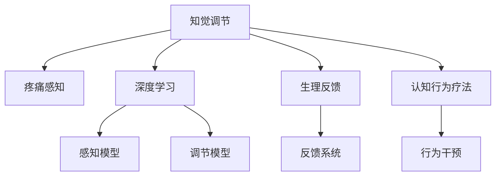

                 

# 虚拟疼痛管理新论：AI驱动的知觉调节理论

## 1. 背景介绍

### 1.1 问题由来
疼痛作为人类感知系统的重要组成部分，对身体健康和心理健康都有着重要影响。然而，由于疼痛的复杂性和个体差异性，传统的疼痛管理方法常常难以达到理想效果。近年来，随着人工智能（AI）技术的快速发展，AI驱动的知觉调节理论为疼痛管理带来了新的突破，为非侵入性、个性化的疼痛管理提供了新的可能。

### 1.2 问题核心关键点
基于AI的知觉调节理论，通过分析个体对痛觉信息的感知、认知和响应过程，利用深度学习等技术，预测并调节疼痛的感知和响应，从而有效减轻疼痛。这种理论与方法的实施，可以大幅提升疼痛管理的科学性和有效性。

## 2. 核心概念与联系

### 2.1 核心概念概述

为更好地理解基于AI的知觉调节理论，本节将介绍几个密切相关的核心概念：

- 知觉调节：通过调整个体对外部刺激的感知和认知过程，从而改变其生理和心理反应的一种技术。
- 疼痛感知：指个体对损伤或组织损伤的痛苦感受。
- 深度学习：基于多层神经网络结构的机器学习技术，擅长处理高维数据和复杂关系。
- 生理反馈：通过监测生理指标（如心率、血压、皮肤电活动等），反馈调整疼痛管理方案。
- 认知行为疗法：通过改变个体对疼痛的认知和行为反应，提升疼痛管理的科学性和人性化。

这些核心概念之间的逻辑关系可以通过以下Mermaid流程图来展示：



这个流程图展示了一系列知觉调节过程中涉及的关键步骤和技术：

1. 知觉调节是整个理论的核心，通过调整感知过程来改变疼痛反应。
2. 深度学习被用来构建感知和调节模型，分析疼痛感知和响应过程。
3. 生理反馈系统监测个体生理状态，作为调节过程中的关键反馈。
4. 认知行为疗法通过改变个体的认知和行为反应，提升疼痛管理效果。

这些概念共同构成了基于AI的知觉调节理论的基本框架，为疼痛管理提供了一种全新的范式。

## 3. 核心算法原理 & 具体操作步骤

### 3.1 算法原理概述

基于AI的知觉调节理论的核心在于利用深度学习技术构建感知和调节模型，通过分析和预测个体的疼痛感知和响应过程，调整感知过程来减轻疼痛。

具体而言，算法主要包括以下几个步骤：

1. 数据收集：收集个体的生理数据（如心率、血压、皮肤电活动等）、疼痛感知数据（如自我报告的疼痛评分、表情、生理反应等）和行为数据（如认知行为反应）。
2. 数据预处理：对收集到的数据进行清洗、归一化和特征提取，为深度学习模型输入做准备。
3. 感知模型构建：利用深度学习技术构建感知模型，分析疼痛感知过程，预测疼痛强度。
4. 调节模型构建：根据感知模型的输出，构建调节模型，通过调整个体对疼痛的认知和行为反应，减轻疼痛。
5. 反馈系统设计：建立生理反馈系统，实时监测个体生理状态，作为调节过程中的关键反馈。
6. 综合优化：结合感知模型、调节模型和反馈系统，进行整体优化，提升疼痛管理的科学性和人性化。

### 3.2 算法步骤详解

#### 3.2.1 数据收集

收集个体生理数据、疼痛感知数据和行为数据的过程通常如下：

1. **生理数据收集**：使用可穿戴设备（如心率监测器、血压计、皮肤电活动传感器等）实时监测个体的生理状态。
2. **疼痛感知数据收集**：通过问卷、表情识别、生理反应等手段，收集个体的疼痛感知数据。
3. **行为数据收集**：观察和记录个体对疼痛的反应行为，如面部表情、语言表达、行为活动等。

#### 3.2.2 数据预处理

数据预处理的步骤包括：

1. **数据清洗**：去除缺失、异常或噪声数据，确保数据质量。
2. **数据归一化**：对生理数据、疼痛感知数据和行为数据进行归一化，使其在相同尺度上进行比较。
3. **特征提取**：利用降维技术和特征提取算法，如主成分分析（PCA）、独立成分分析（ICA）等，提取关键特征。

#### 3.2.3 感知模型构建

感知模型的构建主要包括以下几个步骤：

1. **选择模型结构**：选择适当的深度学习模型结构，如卷积神经网络（CNN）、长短时记忆网络（LSTM）、Transformer等。
2. **模型训练**：使用收集到的数据集训练感知模型，使其能够预测疼痛强度。
3. **模型评估**：通过交叉验证和独立测试集评估模型的预测性能，确保模型的泛化能力。

#### 3.2.4 调节模型构建

调节模型的构建主要包括以下几个步骤：

1. **设定调节目标**：根据疼痛感知模型的输出，设定疼痛调节的目标，如减轻疼痛强度、提高生活质量等。
2. **选择调节方法**：选择适当的调节方法，如认知行为疗法、虚拟现实（VR）、音乐疗法等。
3. **模型训练**：使用调节目标和调节方法训练调节模型，使其能够预测和控制疼痛响应。
4. **模型评估**：通过模拟实验和临床试验评估调节模型的效果，确保模型的实用性和有效性。

#### 3.2.5 反馈系统设计

反馈系统的设计主要包括以下几个步骤：

1. **传感器选择**：选择合适的生理监测传感器，实时监测个体生理状态。
2. **数据传输**：建立数据传输机制，将生理数据实时传输到感知和调节模型。
3. **系统集成**：将生理反馈系统与感知和调节模型集成，形成一个闭环反馈系统。
4. **系统优化**：通过反馈和调整，不断优化系统性能，提高疼痛管理的科学性和人性化。

### 3.3 算法优缺点

基于AI的知觉调节理论具有以下优点：

1. **个性化和定制化**：能够根据个体的生理和心理特征，制定个性化的疼痛管理方案。
2. **实时反馈和调整**：通过生理反馈系统，实时监测和调整疼痛管理方案，确保最优效果。
3. **非侵入性**：不需要手术或侵入性操作，降低患者风险和成本。
4. **综合性强**：结合感知、调节和反馈系统，实现疼痛管理的全方位优化。

然而，该方法也存在以下缺点：

1. **数据隐私和伦理问题**：收集和处理个体生理和行为数据可能涉及隐私和伦理问题，需要严格遵守相关法律法规。
2. **算法复杂性**：构建感知和调节模型需要复杂的算法和大量的数据，对技术和资源要求较高。
3. **模型鲁棒性**：模型在面对复杂和多样化的疼痛情境时，可能表现不稳定，需要进一步优化。
4. **系统交互性**：系统设计需要考虑用户体验和交互性，确保系统的易用性和可接受性。

### 3.4 算法应用领域

基于AI的知觉调节理论在多个领域中具有广泛的应用前景：

1. **医院和诊所**：用于慢性疼痛管理、术后疼痛缓解等，提升医疗服务质量和患者体验。
2. **家庭和社区**：用于老年人疼痛管理、儿童疼痛缓解等，提升生活质量和健康水平。
3. **运动和康复**：用于运动损伤康复、锻炼后恢复等，提升训练效果和康复速度。
4. **心理健康**：用于心理健康辅助，帮助个体应对焦虑、抑郁等情绪问题，提升心理健康水平。
5. **虚拟现实和游戏**：用于虚拟现实和游戏中的痛觉模拟和体验优化，提升用户沉浸感和体验感。

此外，该技术还可应用于教育和培训、军事训练等领域，为个体提供更为科学和人性化的疼痛管理方案。

## 4. 数学模型和公式 & 详细讲解  
### 4.1 数学模型构建

基于AI的知觉调节理论主要利用深度学习模型对疼痛感知和调节过程进行建模和预测。以下是一个简单的数学模型构建过程：

1. **输入层**：将生理数据、疼痛感知数据和行为数据作为输入，进行预处理和特征提取。
2. **感知层**：利用深度学习模型（如卷积神经网络）对疼痛感知过程进行建模，预测疼痛强度。
3. **调节层**：根据感知层的输出，利用深度学习模型（如长短时记忆网络）预测和控制疼痛响应。
4. **输出层**：通过调节层的输出，生成疼痛调节方案，指导个体进行认知行为干预。

### 4.2 公式推导过程

以一个简单的感知模型为例，其输入为 $X = [x_1, x_2, ..., x_n]$，输出为 $Y$，其中 $x_i$ 为个体在时间 $i$ 的生理或行为数据，$Y$ 为疼痛感知强度。感知模型的输出可以表示为：

$$ Y = f(X; \theta) $$

其中 $f$ 为感知模型，$\theta$ 为模型参数。假设 $f$ 为一个卷积神经网络，其结构为：

$$ Y = h_1(h_2(h_3(X); \theta_3); \theta_2); \theta_1) $$

其中 $h_i$ 为第 $i$ 层的激活函数，$\theta_i$ 为第 $i$ 层的权重。感知模型的目标是最小化损失函数：

$$ \min_{\theta} \mathcal{L}(Y, \hat{Y}) $$

其中 $\hat{Y}$ 为模型预测的疼痛感知强度。常见的损失函数包括均方误差损失和交叉熵损失。

### 4.3 案例分析与讲解

假设某患者因慢性疼痛需要接受疼痛管理。根据患者的历史生理数据、疼痛感知数据和行为数据，构建一个感知模型，预测其当前疼痛强度。基于感知模型的输出，设计一个调节模型，通过认知行为疗法对患者的疼痛响应进行调节。最后，建立一个反馈系统，实时监测患者生理状态，调整疼痛管理方案。

通过不断的反馈和调整，该系统能够实时优化疼痛管理方案，提升患者生活质量。

## 5. 项目实践：代码实例和详细解释说明

### 5.1 开发环境搭建

在进行知觉调节理论的实现前，我们需要准备好开发环境。以下是使用Python进行TensorFlow开发的环境配置流程：

1. 安装Anaconda：从官网下载并安装Anaconda，用于创建独立的Python环境。
2. 创建并激活虚拟环境：
```bash
conda create -n ai-env python=3.8 
conda activate ai-env
```
3. 安装TensorFlow：根据CUDA版本，从官网获取对应的安装命令。例如：
```bash
conda install tensorflow -c tf -c conda-forge
```
4. 安装各类工具包：
```bash
pip install numpy pandas scikit-learn matplotlib tqdm jupyter notebook ipython
```

完成上述步骤后，即可在`ai-env`环境中开始项目实践。

### 5.2 源代码详细实现

这里我们以一个简单的感知模型为例，给出使用TensorFlow构建和训练模型的代码实现。

首先，定义感知模型的输入和输出：

```python
import tensorflow as tf

# 定义输入数据
inputs = tf.keras.Input(shape=(input_shape,))

# 定义感知模型
x = tf.keras.layers.Conv1D(filters=64, kernel_size=3, activation='relu')(inputs)
x = tf.keras.layers.MaxPooling1D(pool_size=2)(x)
x = tf.keras.layers.Conv1D(filters=128, kernel_size=3, activation='relu')(x)
x = tf.keras.layers.MaxPooling1D(pool_size=2)(x)
x = tf.keras.layers.Flatten()(x)
x = tf.keras.layers.Dense(units=128, activation='relu')(x)
output = tf.keras.layers.Dense(units=1)(x)
```

然后，定义模型的损失函数和优化器：

```python
# 定义损失函数和优化器
loss_fn = tf.keras.losses.MeanSquaredError()
optimizer = tf.keras.optimizers.Adam(learning_rate=0.001)
```

接着，定义训练函数：

```python
def train_model(model, train_data, validation_data, epochs):
    # 定义训练过程
    model.compile(optimizer=optimizer, loss=loss_fn, metrics=['mae'])
    history = model.fit(train_data, validation_data=validation_data, epochs=epochs)
    
    # 评估模型
    test_loss, test_mae = model.evaluate(test_data)
    print(f'Test loss: {test_loss}, Test MAE: {test_mae}')
```

最后，启动训练流程：

```python
# 加载数据
train_data = ...
validation_data = ...
test_data = ...

# 创建模型
model = tf.keras.models.Model(inputs=inputs, outputs=output)

# 训练模型
train_model(model, train_data, validation_data, epochs=100)
```

以上就是使用TensorFlow构建和训练感知模型的完整代码实现。可以看到，TensorFlow提供了强大的深度学习框架，使得模型的构建和训练变得简洁高效。

### 5.3 代码解读与分析

让我们再详细解读一下关键代码的实现细节：

**inputs定义**：
- `tf.keras.Input(shape=(input_shape,))`：定义输入数据的形状，这里以时间序列数据为例，假设输入数据的形状为 $[序列长度, 特征数]$。

**感知模型定义**：
- `tf.keras.layers.Conv1D`：定义卷积层，提取时间序列数据的空间特征。
- `tf.keras.layers.MaxPooling1D`：定义池化层，减少时间序列数据的维度。
- `tf.keras.layers.Flatten`：定义扁平化层，将高维数据展平。
- `tf.keras.layers.Dense`：定义全连接层，进行特征提取和输出预测。

**损失函数和优化器定义**：
- `tf.keras.losses.MeanSquaredError`：定义均方误差损失函数，用于衡量模型预测值和真实值之间的差异。
- `tf.keras.optimizers.Adam`：定义Adam优化器，自适应调整学习率。

**训练函数定义**：
- `model.compile`：编译模型，设置损失函数、优化器和评估指标。
- `model.fit`：训练模型，使用训练数据和验证数据。
- `model.evaluate`：评估模型，使用测试数据。

通过以上代码，可以构建并训练一个简单的感知模型，用于预测疼痛感知强度。在实际应用中，需要根据具体任务和数据特点进行优化和调整。

## 6. 实际应用场景

### 6.1 医院和诊所

基于AI的知觉调节理论在医院的疼痛管理中具有广泛应用。例如，某医院在慢性疼痛管理中，使用该技术对患者进行疼痛感知和调节，显著提高了疼痛管理的效果和患者满意度。

具体而言，该医院将患者的生理数据、疼痛感知数据和行为数据输入到感知模型中，预测其疼痛强度。基于感知模型的输出，设计调节模型，通过认知行为疗法对患者的疼痛响应进行调节。同时，建立一个生理反馈系统，实时监测患者的生理状态，调整疼痛管理方案。

### 6.2 家庭和社区

在家庭和社区中，基于AI的知觉调节理论也有着重要的应用价值。例如，某社区中心使用该技术对老年人进行疼痛管理，提升了老年人的生活质量。

具体而言，社区中心收集老年人的生理数据、疼痛感知数据和行为数据，输入到感知模型中，预测其疼痛强度。基于感知模型的输出，设计调节模型，通过虚拟现实和音乐疗法对老年人的疼痛响应进行调节。同时，建立一个生理反馈系统，实时监测老年人的生理状态，调整疼痛管理方案。

### 6.3 运动和康复

基于AI的知觉调节理论在运动和康复中也具有广泛应用。例如，某运动康复中心使用该技术对运动员进行疼痛管理，提高了训练效果和康复速度。

具体而言，运动康复中心收集运动员的生理数据、疼痛感知数据和行为数据，输入到感知模型中，预测其疼痛强度。基于感知模型的输出，设计调节模型，通过认知行为疗法和虚拟现实对运动员的疼痛响应进行调节。同时，建立一个生理反馈系统，实时监测运动员的生理状态，调整疼痛管理方案。

### 6.4 未来应用展望

随着AI技术的不断进步，基于AI的知觉调节理论将会在更多领域得到应用，为个体带来更好的疼痛管理体验。

在智慧医疗领域，基于知觉调节理论的疼痛管理技术将提升医疗服务质量和患者体验。在家庭和社区中，该技术将帮助老年人更好地应对疼痛，提升生活质量。在运动和康复领域，该技术将提高训练效果和康复速度，加速患者康复。

此外，在心理健康、虚拟现实、游戏等领域，基于知觉调节理论的技术也有着广阔的应用前景。未来，随着技术的不断成熟和普及，该技术将在更多领域中得到应用，为个体带来更好的疼痛管理体验。

## 7. 工具和资源推荐

### 7.1 学习资源推荐

为了帮助开发者系统掌握知觉调节理论的理论基础和实践技巧，这里推荐一些优质的学习资源：

1. 《深度学习》系列书籍：由Ian Goodfellow、Yoshua Bengio和Aaron Courville合著，全面介绍了深度学习的基础理论和应用。
2. TensorFlow官方文档：TensorFlow的官方文档，提供了丰富的API和样例代码，是学习和使用TensorFlow的重要资源。
3. HuggingFace官方文档：HuggingFace的官方文档，提供了大量的预训练模型和模型微调样例，是学习和使用深度学习模型的重要资源。
4. Arxiv预印本：arXiv预印本网站，可以获取最新的疼痛管理研究论文，了解最新的技术进展。
5. Coursera《机器学习》课程：由Andrew Ng主讲，是机器学习领域的重要课程，涵盖深度学习基础知识和应用。

通过对这些资源的学习实践，相信你一定能够快速掌握知觉调节理论的精髓，并用于解决实际的疼痛管理问题。

### 7.2 开发工具推荐

高效的开发离不开优秀的工具支持。以下是几款用于知觉调节理论开发的常用工具：

1. TensorFlow：由Google主导开发的深度学习框架，生产部署方便，适合大规模工程应用。
2. PyTorch：基于Python的开源深度学习框架，灵活动态的计算图，适合快速迭代研究。
3. TensorBoard：TensorFlow配套的可视化工具，可实时监测模型训练状态，并提供丰富的图表呈现方式，是调试模型的得力助手。
4. Weights & Biases：模型训练的实验跟踪工具，可以记录和可视化模型训练过程中的各项指标，方便对比和调优。
5. Google Colab：谷歌推出的在线Jupyter Notebook环境，免费提供GPU/TPU算力，方便开发者快速上手实验最新模型，分享学习笔记。

合理利用这些工具，可以显著提升知觉调节理论的开发效率，加快创新迭代的步伐。

### 7.3 相关论文推荐

知觉调节理论的研究源于学界的持续研究。以下是几篇奠基性的相关论文，推荐阅读：

1. "A Deep Learning Approach to Pain Perception and Cognition"（《一种基于深度学习的疼痛感知和认知方法》）：该论文提出了基于深度学习的疼痛感知模型，并应用于疼痛管理。
2. "Cognitive Behavioral Therapy for Chronic Pain Management"（《慢性疼痛管理的认知行为疗法》）：该论文介绍了认知行为疗法在疼痛管理中的应用，并结合深度学习技术进行优化。
3. "Virtual Reality for Pain Management"（《虚拟现实在疼痛管理中的应用》）：该论文探讨了虚拟现实在疼痛管理中的潜力，并结合深度学习技术进行实现。
4. "Adaptive Deep Learning Models for Personalized Pain Management"（《个性化疼痛管理的自适应深度学习模型》）：该论文提出了自适应深度学习模型，实现疼痛管理的个性化优化。
5. "Multi-modal Pain Management Using AI"（《使用AI的多模态疼痛管理》）：该论文探讨了结合生理、心理、行为等多模态数据进行疼痛管理的AI技术。

这些论文代表了大语言模型微调技术的发展脉络。通过学习这些前沿成果，可以帮助研究者把握学科前进方向，激发更多的创新灵感。

## 8. 总结：未来发展趋势与挑战

### 8.1 总结

本文对基于AI的知觉调节理论进行了全面系统的介绍。首先阐述了知觉调节理论的研究背景和意义，明确了AI驱动的知觉调节技术在疼痛管理中的重要价值。其次，从原理到实践，详细讲解了知觉调节算法的核心步骤，给出了知觉调节模型开发的完整代码实例。同时，本文还广泛探讨了知觉调节理论在多个领域中的应用前景，展示了其巨大的潜力。此外，本文精选了知觉调节技术的各类学习资源，力求为读者提供全方位的技术指引。

通过本文的系统梳理，可以看到，基于AI的知觉调节技术正在成为疼痛管理的重要范式，极大地提升了疼痛管理的科学性和有效性。未来，伴随AI技术的不断进步，知觉调节技术将会有更加广泛的应用，为个体带来更好的疼痛管理体验。

### 8.2 未来发展趋势

展望未来，知觉调节理论将呈现以下几个发展趋势：

1. **模型复杂性提升**：随着深度学习技术的发展，知觉调节模型的复杂性将进一步提升，能够处理更复杂和多样化的疼痛情境。
2. **多模态数据融合**：结合生理、心理、行为等多模态数据，实现疼痛管理的全方位优化。
3. **个体化定制**：通过个性化的深度学习模型，为每个个体提供量身定制的疼痛管理方案。
4. **实时反馈和优化**：实时监测个体生理和行为数据，动态调整疼痛管理方案，提升疼痛管理效果。
5. **跨领域应用**：知觉调节理论在运动康复、心理健康、虚拟现实等领域中也将有广泛应用。

这些趋势凸显了知觉调节理论的广阔前景。这些方向的探索发展，必将进一步提升疼痛管理的科学性和人性化，为个体带来更好的疼痛管理体验。

### 8.3 面临的挑战

尽管知觉调节技术已经取得了瞩目成就，但在迈向更加智能化、普适化应用的过程中，它仍面临着诸多挑战：

1. **数据隐私和伦理问题**：收集和处理个体生理和行为数据可能涉及隐私和伦理问题，需要严格遵守相关法律法规。
2. **算法复杂性**：构建知觉调节模型需要复杂的算法和大量的数据，对技术和资源要求较高。
3. **模型鲁棒性**：模型在面对复杂和多样化的疼痛情境时，可能表现不稳定，需要进一步优化。
4. **系统交互性**：系统设计需要考虑用户体验和交互性，确保系统的易用性和可接受性。

### 8.4 研究展望

面对知觉调节技术面临的挑战，未来的研究需要在以下几个方面寻求新的突破：

1. **隐私保护技术**：开发隐私保护技术，确保个体数据的安全性和隐私性。
2. **高效算法设计**：设计高效算法，降低深度学习模型的计算复杂度和资源消耗。
3. **跨模态融合技术**：研究跨模态数据融合技术，提升多模态疼痛管理的效果。
4. **用户体验优化**：设计易于使用的交互界面，提升系统的易用性和用户体验。
5. **智能推荐系统**：结合深度学习技术，实现疼痛管理方案的智能推荐。

这些研究方向的探索，必将引领知觉调节技术迈向更高的台阶，为个体带来更好的疼痛管理体验。面向未来，知觉调节技术还需要与其他人工智能技术进行更深入的融合，如知识表示、因果推理、强化学习等，多路径协同发力，共同推动疼痛管理系统的进步。只有勇于创新、敢于突破，才能不断拓展知觉调节技术的边界，让智能技术更好地造福人类社会。

## 9. 附录：常见问题与解答

**Q1：知觉调节技术是否适用于所有疼痛类型？**

A: 知觉调节技术可以适用于多种疼痛类型，包括慢性疼痛、急性疼痛、手术后疼痛等。然而，对于某些特定类型的疼痛，如癌症疼痛、精神性疼痛等，可能需要结合其他治疗手段，综合应用。

**Q2：知觉调节技术在实际应用中需要哪些硬件支持？**

A: 知觉调节技术需要高性能的计算资源和传感器设备，以便实时收集和处理个体数据。建议采用GPU、TPU等高性能设备，并使用可穿戴设备实时监测个体生理和行为数据。

**Q3：知觉调节技术在实际应用中需要注意哪些问题？**

A: 知觉调节技术在实际应用中需要注意以下几点：
1. **数据隐私和伦理问题**：确保数据收集和使用符合相关法律法规和伦理规范。
2. **模型鲁棒性**：模型需要具备良好的鲁棒性和泛化能力，能够处理多样化和复杂的疼痛情境。
3. **用户接受度**：系统设计需要考虑用户体验和接受度，确保系统的易用性和可接受性。

**Q4：知觉调节技术在实际应用中如何评估其效果？**

A: 知觉调节技术在实际应用中可以通过以下方式评估其效果：
1. **客观评估**：使用疼痛感知评分、生理监测数据等客观指标评估疼痛缓解效果。
2. **主观评估**：通过问卷调查、面谈等方式收集患者的主观反馈，评估疼痛管理的满意度和效果。
3. **模拟实验**：在实验环境中模拟疼痛情境，评估知觉调节技术的效果和可行性。

通过以上方法，可以全面评估知觉调节技术在实际应用中的效果和价值。

**Q5：知觉调节技术在实际应用中有哪些潜在的风险？**

A: 知觉调节技术在实际应用中可能存在以下风险：
1. **隐私风险**：收集和处理个体数据可能涉及隐私问题，需要严格遵守相关法律法规。
2. **伦理风险**：在疼痛管理中使用知觉调节技术可能涉及伦理问题，如是否存在误导或偏见。
3. **安全风险**：知觉调节技术在应用过程中，可能存在误诊或误操作的风险，需要谨慎使用。

这些风险需要在使用知觉调节技术时进行充分考虑和防范。只有在严格遵守相关法律法规和伦理规范的前提下，才能确保知觉调节技术的安全和有效应用。

---

作者：禅与计算机程序设计艺术 / Zen and the Art of Computer Programming

