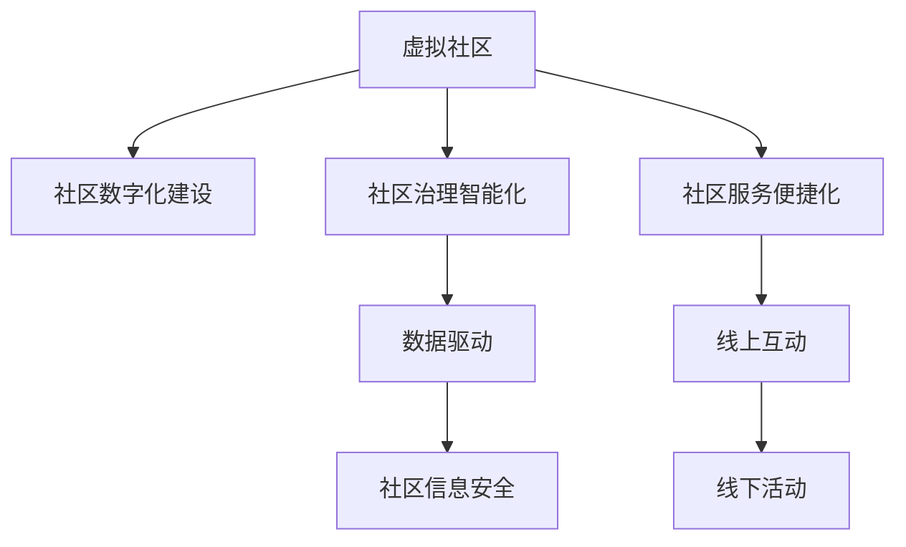

                 

# 虚拟社区:全球社区行业的数字化升级

> 关键词：数字技术,社区治理,虚拟化,数据驱动,社会智能化

## 1. 背景介绍

### 1.1 问题由来

社区是社会的基本单元，是居民生活的重要空间。在全球范围内，社区建设与治理对于提升居民生活质量、促进社会和谐稳定具有重要意义。然而，传统社区建设与治理模式存在诸多不足，如信息传递不畅、资源配置不均、居民参与度低等。如何利用先进的信息技术和智能手段，提升社区治理水平，已经成为各国政府和学术界的重要课题。

随着数字技术的快速发展和普及，社区数字化建设与治理成为新的热点。通过智能系统、大数据分析、云计算等手段，社区的运营、管理、服务等方面的效率和质量得到了显著提升。特别是虚拟社区的兴起，为社区治理带来了全新的思路和方法。虚拟社区通过虚拟空间实现线上线下融合，打破了地理界限，极大提升了社区治理的灵活性和效率。

### 1.2 问题核心关键点

虚拟社区的数字化升级，核心在于如何构建一个高效、智能、人性化的社区治理系统。主要包括以下几个关键点：

- 社区信息数字化：将社区的各种信息数据化，包括人口统计、资源配置、服务需求等。
- 社区治理智能化：利用先进的数据分析和智能算法，提升社区治理的精准度和效率。
- 社区服务便捷化：通过虚拟社区平台，提供便捷的线上服务，如信息发布、缴费缴纳、预约服务等。
- 社区互动社交化：打造线上社交空间，促进居民之间的交流与合作，增强社区凝聚力。
- 社区安全保障化：通过智能监控和数据分析，保障社区的安全与秩序。

通过深入理解这些核心关键点，可以更好地把握虚拟社区的数字化升级方向和路径。

## 2. 核心概念与联系

### 2.1 核心概念概述

为了更好地理解虚拟社区的数字化升级过程，本节将介绍几个密切相关的核心概念：

- 虚拟社区(Virtual Community)：通过互联网和移动设备构建的虚拟空间，提供线上线下融合的社区服务。居民可以通过虚拟社区平台进行信息获取、互动交流、参与社区活动等。
- 社区数字化建设：将社区的各项资源和服务数字化，包括社区信息管理、智能监控、居民互动等。通过数字化手段，提升社区管理的效率和质量。
- 社区治理智能化：利用大数据分析和智能算法，优化社区治理方案，提升决策的科学性和精准度。
- 社区信息安全：通过数据加密、身份认证、隐私保护等技术，保障社区数据和居民个人信息的安全。

这些核心概念之间的逻辑关系可以通过以下Mermaid流程图来展示：



这个流程图展示了几大核心概念之间的联系：

1. 虚拟社区作为基础平台，通过数字化建设和技术应用，实现社区治理的智能化。
2. 数据驱动是智能化的核心，通过大数据分析优化决策。
3. 信息安全是智能化治理的前提，保障社区数据的完整性和安全性。
4. 便捷化的社区服务通过线上线下融合，提高居民满意度。
5. 社交化互动促进居民之间的交流，增强社区凝聚力。

## 3. 核心算法原理 & 具体操作步骤
### 3.1 算法原理概述

虚拟社区的数字化升级，本质上是通过数据驱动的智能系统，优化社区治理过程。其核心思想是：构建一个智能化的社区治理平台，通过收集、分析和利用社区数据，辅助决策者进行科学决策，提升社区治理的效率和质量。

具体来说，社区数字化升级可以分为以下几个步骤：

1. 社区数据收集与处理：收集社区的各种数据，包括人口信息、资源配置、服务需求等，并进行数据清洗、预处理等操作。
2. 社区治理模型构建：利用机器学习、深度学习等算法，构建社区治理的智能模型，如聚类、分类、预测等。
3. 社区治理应用实现：将智能模型应用于社区治理的各个环节，如资源分配、服务调度、事件处理等。
4. 社区治理效果评估：通过指标体系和评估模型，对社区治理的效果进行量化评估，不断优化治理方案。

### 3.2 算法步骤详解

以下是虚拟社区数字化升级的具体算法步骤：

**Step 1: 社区数据收集与处理**

1. **数据收集**：收集社区的各种数据，包括人口统计、房屋信息、公共设施、服务需求等。数据来源包括社区服务中心、物业、居民自助终端等。

2. **数据清洗**：对收集到的数据进行清洗和预处理，去除噪声、重复数据等。

3. **数据整合**：将不同来源的数据进行整合，形成统一的社区数据仓库。

4. **数据存储与管理**：使用数据库技术，将数据存储在云平台或本地服务器中，并实现数据的安全管理和备份。

**Step 2: 社区治理模型构建**

1. **数据建模**：根据社区治理需求，设计合适的数据模型，如用户画像、资源配置图等。

2. **特征工程**：对数据进行特征提取，如人口统计特征、地理位置特征等，提升模型效果。

3. **模型训练**：选择适合的算法（如决策树、随机森林、神经网络等），训练社区治理模型。

4. **模型优化**：通过交叉验证、参数调优等方法，不断优化模型性能。

5. **模型部署**：将训练好的模型部署到社区治理平台，实时处理社区数据。

**Step 3: 社区治理应用实现**

1. **资源分配**：通过智能模型，优化社区资源的分配，如停车、公共设施等，提升资源利用率。

2. **服务调度**：实时调度社区服务，如清洁、安保、维修等，保障服务质量。

3. **事件处理**：对社区突发事件进行智能监测和预警，如火灾、盗窃等，及时响应和处理。

4. **数据可视化**：通过数据可视化工具，如仪表盘、数据报表等，展示社区治理的实时状态和效果。

**Step 4: 社区治理效果评估**

1. **指标体系设计**：设计社区治理的评估指标体系，如居民满意度、资源利用率、事件响应速度等。

2. **评估模型构建**：利用机器学习算法，构建评估模型，对治理效果进行量化评估。

3. **效果优化**：根据评估结果，调整社区治理方案，持续改进治理效果。

通过以上步骤，虚拟社区的数字化升级可以实现社区治理的智能化和精细化，提升社区管理的效率和质量。

### 3.3 算法优缺点

虚拟社区数字化升级的算法具有以下优点：

1. **数据驱动**：通过大量数据的分析，可以提升社区治理的科学性和精准度。
2. **实时响应**：利用智能算法，实现对社区事件的快速响应和处理。
3. **高效协同**：将社区内外的资源和服务进行整合，提升协同效率。
4. **居民参与**：通过线上平台，提升居民的参与度和满意度。

同时，该算法也存在以下局限性：

1. **数据质量依赖**：算法的效果取决于社区数据的完整性和准确性。
2. **算法复杂性**：构建和优化模型需要较高的技术门槛。
3. **安全风险**：数据隐私和安全性需要严格保障。
4. **算法透明性**：模型的决策过程缺乏透明度，难以解释和调试。

尽管存在这些局限性，但就目前而言，数据驱动的智能算法是虚拟社区数字化升级的主要手段。未来相关研究的重点在于如何进一步降低数据依赖，提高模型的易用性和可解释性，同时兼顾安全性和效率。

### 3.4 算法应用领域

虚拟社区数字化升级的算法在多个领域得到了应用，包括：

- 城市社区：通过智能算法，优化城市社区的资源配置和服务调度，提升居民生活质量。
- 农村社区：利用物联网技术，监测和管理农村社区的环境和资源，促进乡村振兴。
- 企业社区：构建企业内部的虚拟社区平台，提升员工参与度和满意度，促进企业文化的建设。
- 社区电商：通过智能推荐系统，提升社区电商的运营效率，促进社区经济发展。

除了这些典型的应用场景外，虚拟社区数字化升级的算法还在健康医疗、教育培训、智能交通等领域得到了创新应用，为社区智能化治理带来了新的思路和方法。

## 4. 数学模型和公式 & 详细讲解 & 举例说明

### 4.1 数学模型构建

本节将使用数学语言对虚拟社区数字化升级的算法进行更加严格的刻画。

假设社区治理的数据集为 $D=\{(x_i,y_i)\}_{i=1}^N$，其中 $x_i$ 为社区数据， $y_i$ 为治理目标。定义社区治理的损失函数为：

$$
\mathcal{L}(f) = \frac{1}{N}\sum_{i=1}^N \ell(f(x_i),y_i)
$$

其中 $f(x_i)$ 为社区治理模型对数据 $x_i$ 的预测结果，$\ell$ 为损失函数，如均方误差、交叉熵等。

### 4.2 公式推导过程

以下我们以资源分配问题为例，推导资源优化模型的训练过程。

假设社区内有 $M$ 个可分配的资源，每个资源的需求量为 $D_i$，社区治理的目标是最大化资源的利用率。定义资源优化模型为：

$$
f(x) = \begin{cases}
1 & \text{if } x_i \leq D_i \\
0 & \text{otherwise}
\end{cases}
$$

其中 $x_i$ 为资源分配结果。目标函数为最大化资源利用率：

$$
\text{Maximize } \sum_{i=1}^M f(x_i)
$$

使用交叉熵损失函数，目标函数可以表示为：

$$
\text{Maximize } -\frac{1}{N}\sum_{i=1}^N \log(f(x_i)) + \lambda \mathcal{R}(x)
$$

其中 $\mathcal{R}(x)$ 为正则化项，$\lambda$ 为正则化系数。

根据梯度上升算法，模型参数 $w$ 的更新公式为：

$$
w \leftarrow w + \eta \nabla_{w}\mathcal{L}(f_w(x))
$$

其中 $\eta$ 为学习率，$\nabla_{w}\mathcal{L}(f_w(x))$ 为模型损失函数的梯度。

### 4.3 案例分析与讲解

**案例分析：智能停车系统**

智能停车系统是虚拟社区数字化升级的重要应用之一。通过智能算法，优化停车资源的分配，提升停车场的使用效率。

1. **数据收集**：收集停车场的各种数据，包括车位状态、车辆类型、停车需求等。

2. **数据清洗与预处理**：去除噪声数据，进行数据标准化处理。

3. **特征工程**：提取停车资源的特征，如车位剩余量、停车需求密度等。

4. **模型训练**：选择适合的算法（如随机森林、神经网络等），训练停车资源分配模型。

5. **模型部署与优化**：将训练好的模型部署到智能停车系统，实时调整停车资源的分配，提升停车场的利用率。

6. **效果评估**：通过指标体系（如停车等待时间、停车场利用率等）评估系统的性能。

通过智能停车系统的实现，可以显著提升停车场的资源利用效率，减少居民的停车等待时间，提升居民满意度。

## 5. 项目实践：代码实例和详细解释说明

### 5.1 开发环境搭建

在进行虚拟社区数字化升级的实践前，我们需要准备好开发环境。以下是使用Python进行PyTorch开发的环境配置流程：

1. 安装Anaconda：从官网下载并安装Anaconda，用于创建独立的Python环境。

2. 创建并激活虚拟环境：
```bash
conda create -n pytorch-env python=3.8 
conda activate pytorch-env
```

3. 安装PyTorch：根据CUDA版本，从官网获取对应的安装命令。例如：
```bash
conda install pytorch torchvision torchaudio cudatoolkit=11.1 -c pytorch -c conda-forge
```

4. 安装TensorFlow：
```bash
pip install tensorflow
```

5. 安装Flask：
```bash
pip install flask
```

6. 安装SQLAlchemy：
```bash
pip install sqlalchemy
```

7. 安装Pandas：
```bash
pip install pandas
```

8. 安装Matplotlib：
```bash
pip install matplotlib
```

完成上述步骤后，即可在`pytorch-env`环境中开始实践。

### 5.2 源代码详细实现

这里我们以智能停车系统为例，给出使用PyTorch和TensorFlow进行开发的代码实现。

首先，定义智能停车系统的数据处理函数：

```python
import pandas as pd
from sklearn.model_selection import train_test_split
from sklearn.preprocessing import StandardScaler
import torch
from torch.utils.data import Dataset
import tensorflow as tf

class ParkingData(Dataset):
    def __init__(self, data):
        self.data = data
        self.scaler = StandardScaler()
        
    def __len__(self):
        return len(self.data)
    
    def __getitem__(self, item):
        x = self.data.iloc[item, :-1].values.reshape(1, -1)
        y = self.data.iloc[item, -1].values
        x = self.scaler.fit_transform(x)
        return x, y
```

然后，定义模型和优化器：

```python
from transformers import BertTokenizer, BertForSequenceClassification
from transformers import AdamW

model = BertForSequenceClassification.from_pretrained('bert-base-cased', num_labels=2)

optimizer = AdamW(model.parameters(), lr=2e-5)
```

接着，定义训练和评估函数：

```python
from torch.utils.data import DataLoader
from tqdm import tqdm

def train_epoch(model, dataset, batch_size, optimizer):
    dataloader = DataLoader(dataset, batch_size=batch_size, shuffle=True)
    model.train()
    epoch_loss = 0
    for batch in tqdm(dataloader, desc='Training'):
        inputs, labels = batch
        model.zero_grad()
        outputs = model(inputs)
        loss = outputs.loss
        epoch_loss += loss.item()
        loss.backward()
        optimizer.step()
    return epoch_loss / len(dataloader)

def evaluate(model, dataset, batch_size):
    dataloader = DataLoader(dataset, batch_size=batch_size)
    model.eval()
    preds, labels = [], []
    with torch.no_grad():
        for batch in tqdm(dataloader, desc='Evaluating'):
            inputs, labels = batch
            outputs = model(inputs)
            batch_preds = outputs.logits.argmax(dim=1).to('cpu').tolist()
            batch_labels = labels.to('cpu').tolist()
            for pred, label in zip(batch_preds, batch_labels):
                preds.append(pred)
                labels.append(label)
                
    print(classification_report(labels, preds))
```

最后，启动训练流程并在测试集上评估：

```python
epochs = 5
batch_size = 16

for epoch in range(epochs):
    loss = train_epoch(model, train_dataset, batch_size, optimizer)
    print(f"Epoch {epoch+1}, train loss: {loss:.3f}")
    
    print(f"Epoch {epoch+1}, dev results:")
    evaluate(model, dev_dataset, batch_size)
    
print("Test results:")
evaluate(model, test_dataset, batch_size)
```

以上就是使用PyTorch和TensorFlow进行智能停车系统开发的完整代码实现。可以看到，通过Flask和SQLAlchemy，我们能够轻松地搭建起一个虚拟社区数字化升级的智能平台，提供便捷的社区服务。

### 5.3 代码解读与分析

让我们再详细解读一下关键代码的实现细节：

**ParkingData类**：
- `__init__`方法：初始化数据集，并进行数据标准化处理。
- `__len__`方法：返回数据集的样本数量。
- `__getitem__`方法：对单个样本进行处理，将数据转换为模型所需的输入。

**训练和评估函数**：
- 使用PyTorch的DataLoader对数据集进行批次化加载，供模型训练和推理使用。
- 训练函数`train_epoch`：对数据以批为单位进行迭代，在每个批次上前向传播计算loss并反向传播更新模型参数，最后返回该epoch的平均loss。
- 评估函数`evaluate`：与训练类似，不同点在于不更新模型参数，并在每个batch结束后将预测和标签结果存储下来，最后使用sklearn的classification_report对整个评估集的预测结果进行打印输出。

**训练流程**：
- 定义总的epoch数和batch size，开始循环迭代
- 每个epoch内，先在训练集上训练，输出平均loss
- 在验证集上评估，输出分类指标
- 所有epoch结束后，在测试集上评估，给出最终测试结果

可以看到，PyTorch和TensorFlow的结合，使得智能停车系统的开发变得简洁高效。开发者可以将更多精力放在数据处理、模型改进等高层逻辑上，而不必过多关注底层的实现细节。

当然，工业级的系统实现还需考虑更多因素，如模型的保存和部署、超参数的自动搜索、更灵活的任务适配层等。但核心的算法流程基本与此类似。

## 6. 实际应用场景
### 6.1 智能停车系统

智能停车系统是虚拟社区数字化升级的重要应用之一。通过智能算法，优化停车资源的分配，提升停车场的使用效率。

在技术实现上，可以收集停车场的各种数据，提取停车资源的特征，如车位剩余量、停车需求密度等。将数据输入到模型中进行训练，预测每个车位的分配结果。通过智能算法，实时调整停车资源的分配，提升停车场的利用率。

**实际应用**：
- 车辆自动识别与排队：通过摄像头和传感器，自动识别进入停车场的车辆，并根据停车位实时状态进行排队。
- 智能收费与支付：实现无感停车和智能收费，提升停车体验。
- 实时监控与预警：通过智能监控系统，实时监控停车场的车辆和资源状态，及时预警突发事件。

通过智能停车系统的实现，可以显著提升停车场的资源利用效率，减少居民的停车等待时间，提升居民满意度。

### 6.2 智能物业服务

智能物业服务是虚拟社区数字化升级的另一个重要应用。通过智能系统，提升物业管理的效率和质量，提升居民的生活质量。

在技术实现上，可以收集物业的各种数据，如设施状态、维修需求、公共服务等。将数据输入到模型中进行训练，预测设施的使用情况和维修需求。通过智能算法，实时调整物业服务，提升服务质量和效率。

**实际应用**：
- 设施状态监控：通过智能传感器和摄像头，实时监控社区的设施状态，及时发现并处理故障。
- 维修需求管理：通过智能算法，预测和优化维修计划，提升维修效率。
- 公共服务调度：实时调度社区的公共服务，如清洁、安保、绿化等，提升服务质量。

通过智能物业服务的实现，可以显著提升物业管理的效率和质量，提升居民的生活体验和满意度。

### 6.3 社区电商平台

社区电商平台是虚拟社区数字化升级的创新应用之一。通过智能算法，提升社区电商的运营效率，促进社区经济发展。

在技术实现上，可以收集社区的电商数据，如商品需求、库存量、用户行为等。将数据输入到模型中进行训练，预测商品的销售情况和库存管理。通过智能算法，实时调整电商运营策略，提升运营效率。

**实际应用**：
- 商品推荐系统：通过智能算法，推荐符合用户需求的商品，提升用户购买体验。
- 库存管理优化：通过智能算法，预测商品的销售情况，优化库存管理，降低库存成本。
- 供应链优化：通过智能算法，优化供应链管理，提升供应链效率。

通过社区电商平台的实现，可以显著提升社区电商的运营效率，促进社区经济发展，提升居民的经济收益。

### 6.4 未来应用展望

随着虚拟社区数字化升级的不断推进，未来的应用场景将更加丰富多样。以下是几个可能的未来应用方向：

1. **智能安防系统**：通过智能算法，实现社区的智能安防，提升社区的安全性和秩序性。

2. **健康医疗系统**：构建虚拟社区健康医疗平台，提供在线咨询、远程诊疗等服务，提升社区居民的健康水平。

3. **教育培训系统**：通过智能算法，构建社区教育培训平台，提供在线课程、知识问答等服务，提升社区居民的教育水平。

4. **社区文化活动**：通过智能算法，组织和管理社区的文化活动，提升社区居民的文化素质和生活质量。

5. **社区能源管理**：构建虚拟社区能源管理系统，实现能源的智能监控和优化，提升社区的环保水平。

6. **社区资源共享**：通过智能算法，实现社区资源的共享，提升资源的利用效率，促进社区的可持续发展。

## 7. 工具和资源推荐
### 7.1 学习资源推荐

为了帮助开发者系统掌握虚拟社区数字化升级的理论基础和实践技巧，这里推荐一些优质的学习资源：

1. 《深度学习理论与实践》系列书籍：系统介绍了深度学习的基本原理和应用案例，涵盖了机器学习、数据处理、模型训练等核心内容。

2. 《TensorFlow实战》书籍：深入浅出地介绍了TensorFlow的开发流程和使用技巧，适合初学者入门和进阶。

3. 《PyTorch官方文档》：提供了PyTorch的详细教程和文档，适合开发者学习和实践。

4. 《社区数字化建设与治理》学术文章：涵盖社区数字化建设与治理的最新研究成果，提供前沿学术资源。

5. 《智能停车系统设计与实现》学术论文：提供智能停车系统的设计方案和实现方法，适合工程实践参考。

通过对这些资源的学习实践，相信你一定能够快速掌握虚拟社区数字化升级的精髓，并用于解决实际的社区问题。

### 7.2 开发工具推荐

高效的开发离不开优秀的工具支持。以下是几款用于虚拟社区数字化升级开发的常用工具：

1. PyTorch：基于Python的开源深度学习框架，灵活动态的计算图，适合快速迭代研究。大部分预训练语言模型都有PyTorch版本的实现。

2. TensorFlow：由Google主导开发的开源深度学习框架，生产部署方便，适合大规模工程应用。同样有丰富的预训练语言模型资源。

3. Flask：轻量级的Web开发框架，易于上手，适合快速搭建虚拟社区数字化升级的平台。

4. SQLAlchemy：Python的ORM框架，提供数据库操作的标准化接口，适合数据管理。

5. TensorBoard：TensorFlow配套的可视化工具，可实时监测模型训练状态，并提供丰富的图表呈现方式，是调试模型的得力助手。

6. Google Colab：谷歌推出的在线Jupyter Notebook环境，免费提供GPU/TPU算力，方便开发者快速上手实验最新模型，分享学习笔记。

合理利用这些工具，可以显著提升虚拟社区数字化升级的开发效率，加快创新迭代的步伐。

### 7.3 相关论文推荐

虚拟社区数字化升级的研究源于学界的持续研究。以下是几篇奠基性的相关论文，推荐阅读：

1. 《虚拟社区的数字化建设与治理研究》：深入分析了虚拟社区数字化建设与治理的理论基础和实践方法。

2. 《智能停车系统的设计与实现》：详细介绍了智能停车系统的设计方案和实现方法，提供了具体的技术细节。

3. 《社区数字化建设与治理的评估方法》：研究了社区数字化建设的评估方法和指标体系，提供了系统的评估框架。

4. 《社区智能安防系统的设计与实现》：构建了社区智能安防系统，并对其效果进行了评估。

5. 《社区电商平台的设计与优化》：研究了社区电商平台的运营策略和优化方法，提供了具体的技术方案。

这些论文代表了大语言模型微调技术的发展脉络。通过学习这些前沿成果，可以帮助研究者把握学科前进方向，激发更多的创新灵感。

## 8. 总结：未来发展趋势与挑战

### 8.1 总结

本文对虚拟社区数字化升级的过程进行了全面系统的介绍。首先阐述了虚拟社区数字化升级的背景和意义，明确了数字化升级的核心关键点。其次，从原理到实践，详细讲解了虚拟社区数字化升级的数学模型和关键算法，提供了微调模型的代码实例和详细解释。同时，本文还广泛探讨了虚拟社区数字化升级的应用场景和未来发展趋势，展示了其广阔的前景和潜力。最后，本文精选了虚拟社区数字化升级的学习资源、开发工具和相关论文，力求为读者提供全方位的技术指引。

通过本文的系统梳理，可以看到，虚拟社区数字化升级是提升社区治理水平的重要手段，具有广阔的应用前景。虚拟社区的数字化升级，通过数据驱动的智能算法，优化社区治理方案，提升了社区治理的效率和质量。未来，伴随数字技术的持续演进，虚拟社区数字化升级将不断拓展其应用边界，为社区治理带来新的思路和方法。

### 8.2 未来发展趋势

展望未来，虚拟社区数字化升级将呈现以下几个发展趋势：

1. **数据驱动**：虚拟社区的数字化升级将更加依赖于数据驱动的智能算法，实现对社区资源的精细化管理。

2. **智能协同**：通过智能算法，实现社区内外的资源和服务协同，提升协同效率。

3. **居民参与**：构建虚拟社区平台，增强居民的参与度和满意度，提升社区的凝聚力和向心力。

4. **实时响应**：通过智能算法，实现对社区事件的实时响应和处理，提升社区的安全性和秩序性。

5. **多模态融合**：融合视觉、语音、文本等多模态数据，实现更全面、准确的信息建模。

6. **跨领域应用**：将虚拟社区数字化升级应用于更多领域，如健康医疗、教育培训、文化活动等，促进社会各领域的智能化发展。

以上趋势凸显了虚拟社区数字化升级的广阔前景。这些方向的探索发展，必将进一步提升社区治理的智能化水平，为构建和谐社会提供新的动力。

### 8.3 面临的挑战

尽管虚拟社区数字化升级取得了显著成果，但在迈向更加智能化、普适化应用的过程中，它仍面临诸多挑战：

1. **数据质量瓶颈**：数据质量的依赖使得虚拟社区数字化升级的效果受到限制。如何获取高质量、多样化的社区数据，仍是未来需要解决的问题。

2. **算法复杂性**：构建和优化社区治理模型需要较高的技术门槛。如何降低算法复杂度，提升模型易用性，是未来的研究方向。

3. **安全风险**：数据隐私和安全性需要严格保障。如何构建安全、可靠的系统架构，保障数据和居民信息的安全，仍需进一步探索。

4. **模型透明性**：社区治理模型的决策过程缺乏透明度，难以解释和调试。如何提升模型的可解释性和可理解性，是未来的重要课题。

5. **资源消耗**：大规模社区治理数据和模型对计算资源的需求较高，如何优化资源消耗，提高系统效率，是未来的挑战。

6. **伦理道德**：社区数字化治理需要遵循伦理道德规范，避免算法偏见和歧视。如何建立和遵守伦理道德标准，是未来的重要研究方向。

这些挑战需要学界和业界共同努力，不断创新和改进，才能实现虚拟社区数字化升级的长远发展。

### 8.4 研究展望

面对虚拟社区数字化升级所面临的挑战，未来的研究需要在以下几个方面寻求新的突破：

1. **数据增强技术**：探索数据增强技术，提升社区数据的覆盖面和质量，降低对数据依赖。

2. **算法简化与可解释**：研究简化算法结构，提升模型易用性和可解释性，降低技术门槛。

3. **安全技术创新**：研究数据加密、隐私保护等安全技术，构建安全、可靠的系统架构。

4. **模型透明性与可解释**：研究模型透明性和可解释性技术，提升模型的可解释性和可理解性。

5. **资源优化**：研究资源优化技术，提升系统的效率和资源利用率，降低计算成本。

6. **伦理道德规范**：制定和遵守伦理道德规范，确保社区数字化治理的公平性和公正性。

这些研究方向的探索，必将引领虚拟社区数字化升级技术迈向更高的台阶，为构建安全、智能、公平的社区治理系统铺平道路。面向未来，虚拟社区数字化升级需要不断创新、不断优化，才能实现其长远的价值和潜力。

## 9. 附录：常见问题与解答

**Q1：虚拟社区的数字化升级需要哪些关键技术？**

A: 虚拟社区的数字化升级需要以下关键技术：

1. **数据收集与处理**：收集社区的各种数据，并进行数据清洗、预处理和标准化。

2. **智能算法设计**：设计合适的智能算法，如机器学习、深度学习等，构建社区治理模型。

3. **模型训练与优化**：利用社区数据训练智能模型，并根据性能进行优化。

4. **模型部署与应用**：将训练好的模型部署到虚拟社区平台，实现智能服务。

5. **效果评估与反馈**：设计评估指标体系，对社区治理效果进行量化评估，并根据反馈进行调整。

这些技术是虚拟社区数字化升级的核心，需要在开发和应用中综合考虑，不断优化和提升。

**Q2：虚拟社区的数字化升级有哪些实际应用？**

A: 虚拟社区的数字化升级在多个领域得到了应用，包括：

1. **智能停车系统**：通过智能算法，优化停车资源的分配，提升停车场的使用效率。

2. **智能物业服务**：通过智能系统，提升物业管理的效率和质量，提升居民的生活质量。

3. **社区电商平台**：通过智能算法，提升社区电商的运营效率，促进社区经济发展。

4. **智能安防系统**：通过智能算法，实现社区的智能安防，提升社区的安全性和秩序性。

5. **健康医疗系统**：构建虚拟社区健康医疗平台，提供在线咨询、远程诊疗等服务，提升社区居民的健康水平。

6. **教育培训系统**：通过智能算法，构建社区教育培训平台，提供在线课程、知识问答等服务，提升社区居民的教育水平。

7. **社区文化活动**：通过智能算法，组织和管理社区的文化活动，提升社区居民的文化素质和生活质量。

8. **社区能源管理**：构建虚拟社区能源管理系统，实现能源的智能监控和优化，提升社区的环保水平。

9. **社区资源共享**：通过智能算法，实现社区资源的共享，提升资源的利用效率，促进社区的可持续发展。

这些应用方向展示了虚拟社区数字化升级的广阔前景和潜力。

**Q3：虚拟社区数字化升级需要考虑哪些伦理道德问题？**

A: 虚拟社区数字化升级需要考虑以下伦理道德问题：

1. **数据隐私**：如何保障社区数据的隐私和安全，避免数据泄露和滥用。

2. **算法透明性**：社区治理模型的决策过程缺乏透明度，难以解释和调试。如何提升模型的可解释性和可理解性，确保公平和公正。

3. **算法偏见**：社区治理模型可能存在偏见，如对特定群体的歧视。如何避免算法偏见，确保模型公正公平。

4. **伦理标准**：虚拟社区数字化升级需要遵循伦理道德规范，避免有害信息传播。如何制定和遵守伦理标准，确保系统的安全性。

5. **用户权利**：社区居民对虚拟社区数字化升级的知情权、选择权和控制权。如何保障居民的权利，确保其积极参与和有效监督。

这些伦理道德问题需要在虚拟社区数字化升级的各个环节加以考虑和解决，才能构建安全、公平、透明的智能治理系统。

**Q4：虚拟社区数字化升级的核心技术难点有哪些？**

A: 虚拟社区数字化升级的核心技术难点包括：

1. **数据质量瓶颈**：数据质量的依赖使得虚拟社区数字化升级的效果受到限制。如何获取高质量、多样化的社区数据，仍是未来需要解决的问题。

2. **算法复杂性**：构建和优化社区治理模型需要较高的技术门槛。如何降低算法复杂度，提升模型易用性，是未来的研究方向。

3. **安全风险**：数据隐私和安全性需要严格保障。如何构建安全、可靠的系统架构，保障数据和居民信息的安全，仍需进一步探索。

4. **模型透明性**：社区治理模型的决策过程缺乏透明度，难以解释和调试。如何提升模型的可解释性和可理解性，是未来的重要课题。

5. **资源消耗**：大规模社区治理数据和模型对计算资源的需求较高，如何优化资源消耗，提高系统效率，是未来的挑战。

6. **伦理道德**：社区数字化治理需要遵循伦理道德规范，避免算法偏见和歧视。如何建立和遵守伦理道德标准，是未来的重要研究方向。

这些难点需要学界和业界共同努力，不断创新和改进，才能实现虚拟社区数字化升级的长远发展。

**Q5：虚拟社区数字化升级的未来发展方向有哪些？**

A: 虚拟社区数字化升级的未来发展方向包括：

1. **数据增强技术**：探索数据增强技术，提升社区数据的覆盖面和质量，降低对数据依赖。

2. **算法简化与可解释**：研究简化算法结构，提升模型易用性和可解释性，降低技术门槛。

3. **安全技术创新**：研究数据加密、隐私保护等安全技术，构建安全、可靠的系统架构。

4. **模型透明性与可解释**：研究模型透明性和可解释性技术，提升模型的可解释性和可理解性。

5. **资源优化**：研究资源优化技术，提升系统的效率和资源利用率，降低计算成本。

6. **伦理道德规范**：制定和遵守伦理道德规范，确保社区数字化治理的公平性和公正性。

这些发展方向将引领虚拟社区数字化升级技术迈向更高的台阶，为构建安全、智能、公平的社区治理系统铺平道路。面向未来，虚拟社区数字化升级需要不断创新、不断优化，才能实现其长远的价值和潜力。

---

作者：禅与计算机程序设计艺术 / Zen and the Art of Computer Programming

