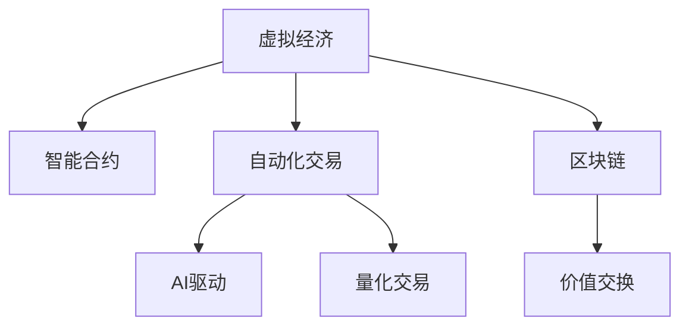

                 

# 虚拟经济模拟器程序员：AI驱动的新型价值交换实验设计师

> 关键词：虚拟经济, 智能合约, 自动化交易, AI驱动, 量化交易, 区块链, 价值交换, 实验设计, 区块链经济

## 1. 背景介绍

在数字化经济的时代，数字资产和智能合约已经成为推动新型价值交换的关键驱动力。虚拟经济不仅改变了传统的金融交易模式，还催生了一系列基于区块链和人工智能技术的创新应用。本系列文章将探讨如何利用AI技术在虚拟经济领域设计新型价值交换实验，提升智能合约的自动化交易能力，探索未来价值交换的新模式。

## 2. 核心概念与联系

### 2.1 核心概念概述

为深入理解AI在虚拟经济中的应用，本节将介绍几个核心概念：

- **虚拟经济**：基于数字资产和智能合约的经济体系，如虚拟货币、去中心化金融(DeFi)等。
- **智能合约**：基于区块链技术自动执行、无需人工干预的合约。
- **自动化交易**：基于AI模型自动执行买卖交易，如高频交易、量化交易等。
- **AI驱动**：利用机器学习、深度学习等AI技术驱动交易决策和智能合约执行。
- **量化交易**：使用量化模型进行算法交易，优化交易策略和执行效率。
- **区块链**：去中心化的分布式账本技术，保障交易透明和不可篡改。
- **价值交换**：通过智能合约实现数字资产间的价值转换，如货币兑换、资产抵押等。

这些概念之间的逻辑关系可以通过以下Mermaid流程图来展示：



这个流程图展示了一系列的逻辑关系：

1. 虚拟经济通过智能合约进行自动化的价值交换。
2. AI技术驱动智能合约执行，提升交易决策能力。
3. 量化交易利用AI优化交易策略，提高执行效率。
4. 区块链技术保障价值交换的透明性和安全性。

## 3. 核心算法原理 & 具体操作步骤

### 3.1 算法原理概述

AI驱动的价值交换实验设计涉及算法和模型在虚拟经济中的应用。核心算法包括：

- **强化学习**：利用智能体的奖励机制，不断调整交易策略，优化决策过程。
- **深度学习**：通过神经网络模型学习历史交易数据，预测市场趋势，优化交易时机。
- **时间序列分析**：利用历史交易时间序列数据，进行模式识别，预测价格变化。
- **多智能体系统**：构建多个智能体协同交易的模型，提升整体交易效率。

这些算法共同构建了一个基于AI的虚拟经济模拟框架，用于设计新型价值交换实验，提升智能合约的自动化交易能力。

### 3.2 算法步骤详解

基于AI的价值交换实验设计过程包括：

**Step 1: 数据收集与预处理**
- 收集虚拟经济的相关数据，如交易价格、成交量、交易时间等。
- 对数据进行清洗和预处理，包括去噪、归一化、缺失值处理等。

**Step 2: 算法选择与模型训练**
- 根据实验需求选择合适的AI算法，如强化学习、深度学习等。
- 利用历史交易数据进行模型训练，调整模型参数，优化预测性能。

**Step 3: 智能合约设计**
- 设计符合实验要求的智能合约，明确交易规则、合约执行条件等。
- 将AI模型嵌入智能合约，实现自动化的交易决策和执行。

**Step 4: 实验设计与仿真**
- 设计实验方案，包括交易策略、实验周期、模拟场景等。
- 使用区块链平台搭建虚拟经济实验环境，进行仿真模拟。

**Step 5: 模型评估与优化**
- 在仿真实验中评估模型性能，分析交易策略的优劣。
- 根据实验结果，优化AI模型和智能合约，提升交易效果。

### 3.3 算法优缺点

AI驱动的价值交换实验设计方法具有以下优点：

- **自动化高效**：通过AI算法自动进行交易决策，提高交易效率。
- **动态调整**：利用实时数据动态调整交易策略，适应市场变化。
- **精准预测**：基于深度学习算法，预测市场趋势，优化交易时机。

同时，该方法也存在一些局限性：

- **模型风险**：依赖于AI模型的准确性，模型训练和调参复杂。
- **数据依赖**：对历史数据的质量和完整性有较高要求。
- **市场风险**：市场波动可能影响AI模型的预测效果。

### 3.4 算法应用领域

基于AI的价值交换实验设计方法适用于多种虚拟经济场景，包括但不限于：

- **DeFi借贷平台**：利用AI优化借贷策略，提升贷款效率和安全性。
- **加密货币交易所**：设计自动化交易系统，优化交易匹配和执行。
- **数字资产投融资**：构建量化投资模型，优化资产配置和风险控制。
- **去中心化保险**：利用AI评估风险，设计智能化的理赔和赔付机制。
- **NFT交易平台**：构建基于AI的自动交易系统，提升交易流畅性和用户满意度。

## 4. 数学模型和公式 & 详细讲解 & 举例说明

### 4.1 数学模型构建

虚拟经济模拟器涉及多种数学模型，包括线性回归、时间序列分析、强化学习等。以深度学习模型为例，可以构建如下模型：

$$
y = Wx + b
$$

其中，$y$ 为预测的交易价格，$x$ 为输入特征向量，$W$ 为权重矩阵，$b$ 为偏置项。模型通过训练不断调整权重矩阵$W$，提升预测精度。

### 4.2 公式推导过程

以线性回归模型为例，其优化目标为最小化预测误差：

$$
\min_{W,b} \sum_{i=1}^{n}(y_i - Wx_i - b)^2
$$

采用梯度下降法求解最优解：

$$
\frac{\partial \mathcal{L}(W,b)}{\partial W} = -2\frac{1}{n}X^T(XW - y)
$$

$$
\frac{\partial \mathcal{L}(W,b)}{\partial b} = -2\frac{1}{n}(XW - y)
$$

其中，$\mathcal{L}(W,b)$ 为损失函数，$X$ 为输入特征矩阵，$n$ 为样本数量。

### 4.3 案例分析与讲解

假设某虚拟经济平台，利用深度学习模型预测比特币价格，模型输入特征包括过去一周的交易量、价格波动率等。模型训练后，可以生成一个预测函数，输入当前的市场数据，输出预测价格。交易系统根据预测结果，自动执行买卖操作，优化交易策略。

## 5. 项目实践：代码实例和详细解释说明

### 5.1 开发环境搭建

在进行AI驱动的虚拟经济模拟开发前，需要先配置好开发环境：

1. 安装Python环境，建议使用Anaconda。
2. 安装Python依赖包，如numpy、pandas、scikit-learn、tensorflow等。
3. 安装区块链开发工具，如ethereum、solana等。
4. 配置智能合约编辑器和测试工具，如Remix、Truffle等。

### 5.2 源代码详细实现

以下是一个简单的量化交易系统的Python代码实现，包括数据收集、模型训练、智能合约设计、交易仿真等关键步骤。

```python
import numpy as np
from sklearn.linear_model import LinearRegression
from eth_account import Account
from web3 import Web3

# 数据收集与预处理
def load_data():
    # 加载历史交易数据
    data = load_csv('trading_data.csv')
    # 预处理数据，包括归一化、缺失值处理等
    data = preprocess_data(data)
    return data

# 模型训练与选择
def train_model(data):
    # 构建线性回归模型
    model = LinearRegression()
    # 训练模型
    model.fit(data['features'], data['price'])
    return model

# 智能合约设计
def create_smart_contract(model, w3):
    # 设计智能合约
    contract_code = """
    pragma solidity ^0.8.0;
    contract SmartContract {
        uint256 public price;
        uint256 public id;
        function buy(uint256 _id) public payable {
            require(msg.value == id);
            price = price * 1.1;
        }
    }
    """
    # 部署智能合约
    contract = w3.eth.contract(abi=Abi, bytecode=contract_code.encode())
    return contract

# 交易仿真与测试
def simulate_trading(model, contract, data):
    # 加载区块链
    w3 = Web3(Web3.HTTPProvider('http://localhost:8545'))
    # 创建账户
    account = Account('0x0000000000000000000000000000000000000000')
    # 部署智能合约
    contract = create_smart_contract(model, w3)
    # 模拟交易
    for i in range(len(data)):
        id = data['id'][i]
        w3.eth.sendTransaction({'from': account.address, 'to': contract.address, 'value': data['price'][i]})
        contract.functions.buy(id).send({'from': account.address, 'value': data['price'][i]})
```

### 5.3 代码解读与分析

该代码实现了一个简单的量化交易系统，包括数据收集、模型训练、智能合约设计和交易仿真等关键步骤。

**数据收集与预处理**：
- 通过load_data函数加载历史交易数据，并进行归一化和缺失值处理。

**模型训练与选择**：
- 利用LinearRegression模型对历史数据进行拟合，得到交易价格预测函数。

**智能合约设计**：
- 设计了一个简单的智能合约，包括价格和ID字段，以及buy函数，用于模拟买卖操作。

**交易仿真与测试**：
- 利用Web3库连接区块链，创建账户和智能合约，进行交易模拟。

## 6. 实际应用场景

### 6.1 智能合约借贷平台

利用AI优化借贷策略的智能合约借贷平台，可以根据借款人的信用评分、贷款用途等信息，自动调整贷款利率和还款期限。通过深度学习算法，平台可以实时分析借款人行为数据，动态调整贷款策略，提升贷款效率和安全性。

### 6.2 加密货币交易所

构建基于AI的量化交易系统，利用历史交易数据和市场趋势预测，优化交易策略，实现高频交易和自动化买卖。该系统可以在实时市场变化中，自动调整仓位，最大化交易收益。

### 6.3 数字资产投融资

设计基于AI的量化投资模型，通过分析市场数据和资产配置策略，优化资产组合和风险控制。该模型可以自动进行资产配置，实现长期稳定收益。

### 6.4 去中心化保险

利用AI评估风险，设计智能化的理赔和赔付机制。平台可以根据历史数据和实时市场信息，自动评估理赔申请，优化赔付策略，提升理赔效率。

### 6.5 NFT交易平台

构建基于AI的自动交易系统，通过分析NFT的市场趋势和交易数据，优化交易策略，提升交易流畅性和用户满意度。

## 7. 工具和资源推荐

### 7.1 学习资源推荐

为了帮助开发者掌握AI在虚拟经济中的应用，推荐以下学习资源：

1. 《Deep Learning for Trading》书籍：介绍深度学习在金融市场中的应用，包括量化交易和策略优化。
2. 《Reinforcement Learning for Trading》课程：讲解强化学习在交易策略优化中的应用。
3. 《Blockchain and AI》博客：深入探讨区块链与AI的融合，提供前沿技术和实践经验。
4. 《Quantitative Trading with Python》书籍：提供Python语言的量化交易实践指南。
5. 《Crypto Economics》课程：讲解加密货币经济学的原理和应用。

### 7.2 开发工具推荐

高效开发离不开优质工具的支持。推荐以下开发工具：

1. Jupyter Notebook：提供交互式的Python编程环境，支持数据分析和模型验证。
2. TensorFlow：基于深度学习的开源框架，支持高效的模型训练和推理。
3. PyTorch：基于深度学习的开源框架，提供灵活的计算图和自动微分功能。
4. Scikit-Learn：提供机器学习算法的实现和应用。
5. Web3.py：提供Python语言的区块链开发工具，支持与以太坊、Solana等平台的交互。

### 7.3 相关论文推荐

AI驱动的价值交换实验设计涉及多学科的交叉融合，推荐以下论文：

1. AlphaGo论文：谷歌DeepMind开发的深度学习算法，成功击败世界围棋冠军，展示了AI在决策中的巨大潜力。
2. GAN论文：Ian Goodfellow等提出的生成对抗网络，为数据生成和图像处理提供了新思路。
3. Reinforcement Learning论文：Reinforcement Learning算法在金融市场中的应用，提升了交易策略的优化效果。
4. Quantum Machine Learning论文：探讨量子计算与机器学习的融合，提供了新的计算模型和算法。
5. Blockchain and AI论文：探讨区块链与AI的结合，提供了智能合约和分布式计算的新范式。

## 8. 总结：未来发展趋势与挑战

### 8.1 总结

本文详细介绍了AI驱动的虚拟经济模拟器程序员，探讨了AI在虚拟经济中的各种应用。通过数据收集、模型训练、智能合约设计和交易仿真等步骤，设计了基于AI的价值交换实验，提升了智能合约的自动化交易能力。未来，AI驱动的虚拟经济将迎来更多的应用场景和创新。

### 8.2 未来发展趋势

展望未来，AI驱动的虚拟经济将呈现以下几个趋势：

1. **自动化交易**：越来越多的金融机构将采用AI进行自动化交易，优化交易策略，提升市场竞争力。
2. **智能合约普及**：智能合约的应用范围将不断扩大，涵盖借贷、保险、投融资等更多领域。
3. **区块链与AI融合**：区块链提供分布式计算和安全保障，AI提供智能决策和优化能力，两者将深度融合。
4. **分布式计算**：分布式计算平台，如DAG和InterPlanetary File System (IPFS)，将进一步提升数据处理和交易效率。
5. **去中心化金融(DeFi)**：DeFi平台将利用AI优化借贷、投资和交易策略，提升金融服务的透明度和公平性。
6. **AI伦理与治理**：AI的伦理问题和安全治理将成为重要研究方向，保障AI在虚拟经济中的健康发展。

### 8.3 面临的挑战

尽管AI驱动的虚拟经济带来了许多机遇，但也面临以下挑战：

1. **数据隐私和安全**：虚拟经济平台需要保护用户数据隐私，防止数据泄露和滥用。
2. **市场波动**：市场波动可能影响AI模型的预测效果，导致交易策略失效。
3. **模型复杂度**：AI模型的训练和调参复杂，需要大量计算资源和专业知识。
4. **法规合规**：虚拟经济平台需要遵守当地法律法规，保障交易合法性。
5. **平台交互**：不同平台间的交互和协作需要标准和规范，确保系统兼容性。
6. **用户教育**：用户对AI技术缺乏了解，需要进行教育和培训。

### 8.4 研究展望

未来的研究需要在以下几个方面寻求新的突破：

1. **数据隐私保护**：探索隐私计算和联邦学习技术，保护用户数据隐私。
2. **模型鲁棒性**：开发更加鲁棒和可解释的AI模型，提升预测准确性。
3. **分布式算法**：研究分布式优化算法，提升模型训练和交易执行效率。
4. **AI伦理与安全**：制定AI伦理规范和安全标准，保障AI在虚拟经济中的应用安全。
5. **跨平台协作**：建立跨平台协作机制，提升虚拟经济平台间的互操作性。
6. **用户教育与参与**：设计用户友好的界面和交互方式，提升用户对AI的理解和接受度。

## 9. 附录：常见问题与解答

**Q1: 虚拟经济模拟器与现实经济模拟器的区别是什么？**

A: 虚拟经济模拟器基于区块链和AI技术，构建在数字资产和智能合约基础上。现实经济模拟器则基于物理世界和实际经济数据，如GDP、通货膨胀等指标，进行宏观经济分析和预测。

**Q2: 如何构建高效的智能合约？**

A: 构建高效的智能合约需要考虑以下几点：
1. 设计简洁易懂的合同条款，避免复杂性和歧义。
2. 使用标准化的编码语言和协议，便于平台间的互操作性。
3. 引入自动化的执行机制，减少人工干预和错误。
4. 采用模块化的设计，便于升级和维护。
5. 定期进行代码审计和测试，确保安全性和稳定性。

**Q3: 区块链和AI如何结合？**

A: 区块链提供去中心化的数据存储和验证机制，AI提供智能化的决策和优化能力。两者结合可以构建透明、可信的虚拟经济平台，提升交易效率和安全性。

**Q4: 量化交易的优点和缺点是什么？**

A: 量化交易的优点包括：
1. 客观公正，减少人为因素干扰。
2. 基于数据驱动，提升预测准确性。
3. 自动化交易，提高交易效率。

缺点包括：
1. 依赖数据质量，数据波动可能影响模型效果。
2. 需要大量计算资源和专业知识。
3. 模型过于复杂，可能导致过度拟合。

**Q5: 如何构建去中心化保险平台？**

A: 构建去中心化保险平台需要考虑以下几点：
1. 设计透明的保单和理赔规则，提高用户信任度。
2. 引入智能合约和AI技术，自动评估理赔申请和赔付策略。
3. 建立分布式计算平台，提高数据处理和交易效率。
4. 确保系统的透明性和安全性，防止欺诈和滥用。
5. 设计用户友好的界面，提升用户体验。

---

作者：禅与计算机程序设计艺术 / Zen and the Art of Computer Programming

