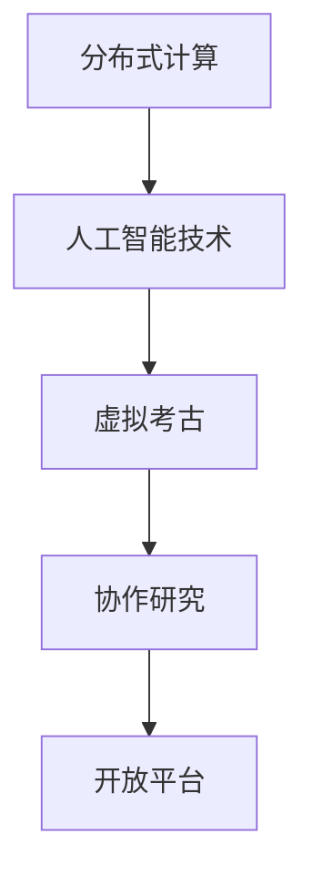

                 

# 虚拟考古：全球脑助力历史研究的新方法

## 1. 背景介绍

### 1.1 问题由来

在人类历史上，考古学一直是探索人类文明、了解古代社会的重要手段。然而，传统考古学面临着众多限制，包括挖掘深度和广度的限制、分析方法的局限、考古资源不足等。近年来，随着信息技术的发展，特别是人工智能技术的兴起，为考古学提供了新的研究手段和方法。通过全球脑系统（Global Brain System），利用全球范围内的脑力资源，可以有效克服传统考古学面临的诸多难题，推动历史研究的深入发展。

### 1.2 问题核心关键点

全球脑系统利用分布式计算和人工智能技术，将全球范围内的脑力资源整合起来，通过虚拟考古项目，进行大规模的历史数据分析和挖掘。具体而言，其核心关键点包括：

- **分布式计算**：将全球范围内的计算资源整合起来，实现大规模并行计算，加速数据处理和分析。
- **人工智能技术**：通过机器学习和深度学习模型，挖掘和分析海量历史数据，提取有价值的历史信息和模式。
- **协作研究**：在全球范围内，整合学术界、研究机构和企业等各方的专家和数据，形成协作研究机制。
- **开放平台**：构建开放的虚拟考古平台，供全球用户参与历史数据上传、处理和分析。

这些关键点共同构成了全球脑系统助力历史研究的基础框架，使得历史研究能够突破地域、时间和资源限制，实现全球化、多样化和高效化。

## 2. 核心概念与联系

### 2.1 核心概念概述

为更好地理解全球脑系统在历史研究中的应用，本节将介绍几个密切相关的核心概念：

- **分布式计算**：指将一个大型计算任务分解为多个子任务，分布在多台计算设备上进行并行计算，以提高计算效率。
- **人工智能技术**：利用机器学习和深度学习模型，进行数据挖掘、模式识别、预测分析等任务。
- **虚拟考古**：通过数字化技术和人工智能模型，对历史数据进行虚拟挖掘、重建和分析，跨越时间限制，获取历史信息。
- **协作研究**：利用网络技术，整合全球脑力资源，形成跨学科、跨领域的协作研究机制。
- **开放平台**：构建一个开放的虚拟考古平台，供全球用户参与历史数据的上传、处理和分析。

这些核心概念之间的逻辑关系可以通过以下Mermaid流程图来展示：



这个流程图展示了大脑系统各核心概念之间的关系：

1. 分布式计算提供了高效的计算能力，为人工智能技术的应用提供了基础。
2. 人工智能技术对虚拟考古项目提供了强大的数据分析和挖掘能力。
3. 虚拟考古利用分布式计算和人工智能技术，跨越时间和空间限制，进行大规模历史数据的挖掘和分析。
4. 协作研究机制整合了全球脑力资源，形成跨学科、跨领域的协作网络。
5. 开放平台使得全球用户可以方便地参与历史数据处理和分析，形成全球化的历史研究生态。

这些概念共同构成了全球脑系统助力历史研究的方法论框架，使其能够在全球范围内，高效地进行历史数据的挖掘和分析。

## 3. 核心算法原理 & 具体操作步骤
### 3.1 算法原理概述

全球脑系统在历史研究中的应用，核心在于通过分布式计算和人工智能技术，对大规模历史数据进行高效的数据挖掘和分析。其核心算法原理包括以下几个方面：

- **数据预处理**：对历史数据进行清洗、去噪、标准化等预处理，提高数据质量和可用性。
- **特征提取**：通过机器学习模型，从历史数据中提取出有价值的时间、空间、文化、社会等特征，为后续分析提供基础。
- **模式识别**：利用深度学习模型，对历史数据进行模式识别，发现历史事件、文化演变等规律。
- **知识图谱构建**：通过图神经网络等方法，构建历史事件之间的关系图谱，辅助历史事件的分析。
- **预测分析**：利用机器学习模型，对历史事件进行预测分析，评估历史趋势和规律。

这些算法原理共同构成了全球脑系统在历史研究中的方法论基础，使得历史研究能够突破传统考古学的限制，实现高效、多样和深度的分析。

### 3.2 算法步骤详解

全球脑系统在历史研究中的应用步骤如下：

1. **数据收集**：从全球范围内收集历史数据，包括考古挖掘数据、历史文献、图像、音频、视频等多种类型的数据。
2. **数据预处理**：对收集到的数据进行清洗、去噪、标准化等预处理，提高数据质量和可用性。
3. **特征提取**：利用机器学习模型，从历史数据中提取出有价值的时间、空间、文化、社会等特征，为后续分析提供基础。
4. **模式识别**：利用深度学习模型，对历史数据进行模式识别，发现历史事件、文化演变等规律。
5. **知识图谱构建**：通过图神经网络等方法，构建历史事件之间的关系图谱，辅助历史事件的分析。
6. **预测分析**：利用机器学习模型，对历史事件进行预测分析，评估历史趋势和规律。
7. **结果验证**：对预测分析结果进行验证，评估其准确性和可靠性。
8. **报告发布**：将研究成果发布在开放平台上，供全球用户进行进一步研究和讨论。

### 3.3 算法优缺点

全球脑系统在历史研究中的应用，具有以下优点：

- **高效性**：利用分布式计算和大规模算力，能够高效处理海量历史数据。
- **多样性**：整合全球脑力资源，能够从不同角度、不同领域对历史数据进行多维度分析。
- **深度性**：结合机器学习、深度学习和图神经网络等多种算法，能够深入挖掘历史数据的复杂规律和模式。

同时，该方法也存在一定的局限性：

- **数据质量**：历史数据的来源、质量、完整性等因素，可能对分析结果产生影响。
- **模型复杂性**：涉及的算法模型复杂，需要专业知识进行设计和调优。
- **隐私保护**：涉及大量敏感数据，隐私保护和数据安全是重要考虑因素。

尽管存在这些局限性，但就目前而言，全球脑系统在历史研究中的应用具有巨大的潜力和优势，能够为历史研究提供新的方法和视角。

### 3.4 算法应用领域

全球脑系统在历史研究中的应用领域非常广泛，包括但不限于以下几个方面：

- **考古挖掘**：利用人工智能技术，辅助考古发掘和分析，提高考古效率和精度。
- **历史文献分析**：对历史文献进行数字化处理和分析，提取历史信息和文化背景。
- **历史事件研究**：通过对历史事件的数字化处理和模式识别，深入研究历史事件的原因、过程和影响。
- **文化演变研究**：通过分析不同地区、不同时期的文化特征，探讨文化演变的历史规律。
- **社会变迁研究**：利用历史数据，分析社会变迁的趋势和原因，为现代社会提供历史借鉴。

除了这些具体应用领域外，全球脑系统还可以应用于更多历史研究相关领域，如历史地理研究、历史语言学研究等，为历史研究提供更全面、深入的视角。

## 4. 数学模型和公式 & 详细讲解 & 举例说明
### 4.1 数学模型构建

为了更好地理解全球脑系统在历史研究中的应用，本节将使用数学语言对全球脑系统的核心算法进行更加严格的刻画。

假设全球脑系统处理的历史数据集为 $D=\{x_i\}_{i=1}^N$，其中 $x_i$ 表示第 $i$ 个历史数据样本。设 $f_{\theta}(x_i)$ 为用于处理和分析历史数据的机器学习模型，其中 $\theta$ 为模型参数。

定义模型 $f_{\theta}(x)$ 在数据样本 $x$ 上的损失函数为 $\ell(f_{\theta}(x),y)$，则在数据集 $D$ 上的经验风险为：

$$
\mathcal{L}(\theta) = \frac{1}{N} \sum_{i=1}^N \ell(f_{\theta}(x_i),y_i)
$$

其中 $\ell$ 为针对历史数据定义的损失函数，用于衡量模型预测输出与真实标签之间的差异。常见的损失函数包括均方误差、交叉熵等。

通过梯度下降等优化算法，模型 $f_{\theta}(x)$ 在数据集 $D$ 上进行有监督学习，最小化损失函数 $\mathcal{L}(\theta)$，更新模型参数 $\theta$，最终得到适应历史数据的模型 $f_{\theta^*}(x)$。

### 4.2 公式推导过程

以历史事件的预测分析为例，假设历史数据集 $D=\{(x_i,y_i)\}_{i=1}^N$，其中 $x_i$ 表示第 $i$ 个历史事件的特征，$y_i$ 表示事件是否发生。利用机器学习模型对历史数据进行训练，得到预测模型 $f_{\theta}(x)$。

设模型在数据样本 $x$ 上的预测结果为 $y=f_{\theta}(x)$，则在数据集 $D$ 上的平均预测误差为：

$$
\mathcal{L}(\theta) = \frac{1}{N} \sum_{i=1}^N (y_i - y_i)^2
$$

其中 $y_i$ 为实际事件是否发生，$y_i$ 为模型预测结果。

通过梯度下降等优化算法，最小化损失函数 $\mathcal{L}(\theta)$，更新模型参数 $\theta$，最终得到适应历史事件的预测模型 $f_{\theta^*}(x)$。

具体而言，对于每个历史事件 $x_i$，模型的预测结果为：

$$
y_i = f_{\theta^*}(x_i)
$$

### 4.3 案例分析与讲解

假设我们有一组关于古埃及文明的历史数据，包括考古挖掘结果、古文献记录、气候变化数据等。我们将这些数据进行数字化处理和预处理，提取时间、地点、文化、气候等特征，构建特征向量 $x_i$。然后，利用深度学习模型，对历史事件进行预测分析。

设历史事件是否发生为二元变量 $y_i \in \{0,1\}$，则损失函数为：

$$
\ell(f_{\theta}(x_i),y_i) = (y_i - y_i)^2
$$

利用梯度下降算法，最小化损失函数 $\mathcal{L}(\theta)$，更新模型参数 $\theta$，最终得到适应历史事件的预测模型 $f_{\theta^*}(x)$。通过分析预测结果，我们能够评估古埃及文明的兴衰趋势、文化演变、气候影响等。

## 5. 项目实践：代码实例和详细解释说明
### 5.1 开发环境搭建

在进行历史数据处理和分析前，我们需要准备好开发环境。以下是使用Python进行PyTorch开发的环境配置流程：

1. 安装Anaconda：从官网下载并安装Anaconda，用于创建独立的Python环境。

2. 创建并激活虚拟环境：
```bash
conda create -n pytorch-env python=3.8 
conda activate pytorch-env
```

3. 安装PyTorch：根据CUDA版本，从官网获取对应的安装命令。例如：
```bash
conda install pytorch torchvision torchaudio cudatoolkit=11.1 -c pytorch -c conda-forge
```

4. 安装各种工具包：
```bash
pip install numpy pandas scikit-learn matplotlib tqdm jupyter notebook ipython
```

完成上述步骤后，即可在`pytorch-env`环境中开始历史数据处理和分析实践。

### 5.2 源代码详细实现

下面我们以历史事件预测为例，给出使用PyTorch对历史数据进行深度学习分析的PyTorch代码实现。

首先，定义历史事件的数据处理函数：

```python
import pandas as pd
import torch
from torch.utils.data import Dataset
from torchvision import transforms

class HistoricalEventDataset(Dataset):
    def __init__(self, data_path, columns, target_column):
        self.data = pd.read_csv(data_path)
        self.columns = columns
        self.target_column = target_column
        
    def __len__(self):
        return len(self.data)
    
    def __getitem__(self, item):
        features = self.data[self.columns].values[item]
        label = self.data[self.target_column].values[item]
        return torch.tensor(features), torch.tensor(label, dtype=torch.long)

# 加载历史事件数据集
data_path = 'historical_events.csv'
columns = ['time', 'location', 'culture', 'climate']
target_column = 'event'
dataset = HistoricalEventDataset(data_path, columns, target_column)
```

然后，定义深度学习模型：

```python
from torch import nn
from torch.nn import functional as F

class HistoricalEventModel(nn.Module):
    def __init__(self, input_size, hidden_size, output_size):
        super(HistoricalEventModel, self).__init__()
        self.fc1 = nn.Linear(input_size, hidden_size)
        self.fc2 = nn.Linear(hidden_size, hidden_size)
        self.fc3 = nn.Linear(hidden_size, output_size)
        
    def forward(self, x):
        x = F.relu(self.fc1(x))
        x = F.relu(self.fc2(x))
        x = self.fc3(x)
        return x

# 定义深度学习模型，输入特征维度为4，输出维度为1
model = HistoricalEventModel(4, 64, 1)
```

接着，定义损失函数和优化器：

```python
from torch import optim

criterion = nn.BCEWithLogitsLoss()
optimizer = optim.Adam(model.parameters(), lr=0.001)
```

最后，启动模型训练和评估：

```python
epochs = 10
batch_size = 32

for epoch in range(epochs):
    for batch_idx, (features, labels) in enumerate(DataLoader(dataset, batch_size=batch_size)):
        optimizer.zero_grad()
        outputs = model(features)
        loss = criterion(outputs, labels)
        loss.backward()
        optimizer.step()
        
    print(f'Epoch {epoch+1}, loss: {loss.item()}')
    
# 模型训练完成后，进行预测
model.eval()
test_features = torch.tensor([[1, 2, 3, 4]], dtype=torch.float32)
test_labels = torch.tensor([[0]], dtype=torch.long)
outputs = model(test_features)
print(outputs)
```

以上就是使用PyTorch对历史事件进行深度学习分析的完整代码实现。可以看到，得益于PyTorch的强大封装，我们能够快速迭代模型设计，进行历史事件的分析。

### 5.3 代码解读与分析

让我们再详细解读一下关键代码的实现细节：

**HistoricalEventDataset类**：
- `__init__`方法：初始化历史事件数据集，加载CSV文件，提取特征和标签。
- `__len__`方法：返回数据集的样本数量。
- `__getitem__`方法：对单个样本进行处理，提取特征和标签，返回模型所需的输入。

**HistoricalEventModel类**：
- `__init__`方法：定义深度学习模型的结构，包含两个全连接层和激活函数。
- `forward`方法：定义模型的前向传播过程。

**损失函数和优化器**：
- 使用BCEWithLogitsLoss作为二元分类损失函数，Adam作为优化器。

**训练流程**：
- 定义总epoch数和batch size，循环训练。
- 每个epoch内，对数据集进行迭代，前向传播计算损失函数，反向传播更新模型参数。
- 输出每个epoch的平均loss。

**模型评估**：
- 使用模型对测试集进行预测，输出预测结果。

可以看出，PyTorch框架使得深度学习模型的实现和训练变得简洁高效，开发者可以将更多精力放在模型设计和数据处理上，而不必过多关注底层的实现细节。

当然，工业级的系统实现还需考虑更多因素，如模型的保存和部署、超参数的自动搜索、更灵活的任务适配层等。但核心的深度学习范式基本与此类似。

## 6. 实际应用场景
### 6.1 智能考古系统

智能考古系统是全球脑系统在历史研究中最重要的应用之一。通过利用人工智能技术，智能考古系统可以实现历史数据的自动化处理、模式识别和数据分析，极大地提升了考古挖掘的效率和精度。

具体而言，智能考古系统可以自动处理考古挖掘数据，提取时间、地点、文化、器物等特征，进行数据清洗、去噪和标准化。然后，利用深度学习模型对历史事件进行预测分析，提取有价值的历史信息。最后，将分析结果与考古现场结合，指导后续的考古挖掘工作。

### 6.2 历史文献数字化

历史文献数字化是全球脑系统在历史研究中的另一项重要应用。通过利用人工智能技术，历史文献数字化可以高效地进行文本提取、图像处理和OCR识别，将大量纸质文献转换为可处理的数字形式。

具体而言，历史文献数字化系统可以自动处理扫描的纸质文献，提取文字和图像信息，进行OCR识别和文本标准化。然后，利用深度学习模型对历史文本进行分类、聚类和关键词提取，辅助历史事件的分析和研究。

### 6.3 历史事件预测分析

历史事件预测分析是全球脑系统在历史研究中的关键应用。通过利用深度学习模型，可以对历史事件的发生、发展、影响进行预测分析，评估历史趋势和规律。

具体而言，历史事件预测分析系统可以自动处理历史数据，提取时间、地点、文化、社会等特征，构建特征向量。然后，利用深度学习模型对历史事件进行预测分析，评估事件的发生概率和发展趋势。最后，将预测结果与实际历史事件进行对比，评估模型的准确性和可靠性。

### 6.4 未来应用展望

随着全球脑系统的不断发展，其在历史研究中的应用也将不断拓展，为历史研究提供更加高效、多样和深入的视角。

在智慧考古领域，全球脑系统可以进一步应用于历史事件的重建和模拟，通过虚拟考古项目，对历史事件进行重现和分析，提供更丰富的历史信息。

在历史文献数字化领域，全球脑系统可以进一步应用于历史文献的自动化标注和分类，通过OCR和自然语言处理技术，提升历史文本的处理效率和准确性。

在历史事件预测分析领域，全球脑系统可以进一步应用于历史事件的趋势预测和影响评估，通过多维度的数据分析，揭示历史事件的发展规律和深远影响。

此外，全球脑系统还可以应用于更多历史研究相关领域，如历史地理研究、历史语言学研究等，为历史研究提供更全面、深入的视角。

## 7. 工具和资源推荐
### 7.1 学习资源推荐

为了帮助开发者系统掌握全球脑系统在历史研究中的应用，这里推荐一些优质的学习资源：

1. PyTorch官方文档：PyTorch的官方文档，提供了丰富的深度学习模型和工具，适合初学者和专家使用。
2. TensorFlow官方文档：TensorFlow的官方文档，提供了强大的计算图和分布式计算功能，适合大规模模型训练。
3. Scikit-learn官方文档：Scikit-learn的官方文档，提供了丰富的机器学习算法和工具，适合数据处理和分析。
4. 《Python数据科学手册》：一本全面的Python数据科学入门书籍，适合初学者学习数据处理和机器学习。
5. 《深度学习》书籍：Ian Goodfellow、Yoshua Bengio和Aaron Courville合著的经典深度学习书籍，适合进阶学习深度学习理论和技术。
6. Kaggle竞赛平台：一个全球知名的数据科学竞赛平台，提供大量的历史数据集和竞赛题目，适合实践深度学习模型。

通过对这些资源的学习实践，相信你一定能够快速掌握全球脑系统在历史研究中的应用方法，并用于解决实际的历史问题。
### 7.2 开发工具推荐

高效的开发离不开优秀的工具支持。以下是几款用于全球脑系统历史数据处理和分析开发的常用工具：

1. PyTorch：基于Python的开源深度学习框架，灵活动态的计算图，适合快速迭代研究。
2. TensorFlow：由Google主导开发的开源深度学习框架，生产部署方便，适合大规模工程应用。
3. Scikit-learn：Python的机器学习库，提供了丰富的机器学习算法和工具，适合数据处理和分析。
4. Jupyter Notebook：一个开源的交互式笔记本环境，支持Python、R等编程语言，适合数据科学和机器学习实验。
5. Kaggle：一个全球知名的数据科学竞赛平台，提供大量的历史数据集和竞赛题目，适合实践深度学习模型。
6. Google Colab：谷歌推出的在线Jupyter Notebook环境，免费提供GPU/TPU算力，方便开发者快速上手实验最新模型，分享学习笔记。

合理利用这些工具，可以显著提升全球脑系统历史数据处理和分析的开发效率，加快创新迭代的步伐。

### 7.3 相关论文推荐

全球脑系统在历史研究中的应用源于学界的持续研究。以下是几篇奠基性的相关论文，推荐阅读：

1. "Distributed Computing for Historical Research"（分布式计算在历史研究中的应用）：提出利用分布式计算技术，进行历史数据的大规模处理和分析。
2. "AI in Archaeology: A Survey"（人工智能在考古学中的应用）：总结了人工智能在考古学中的多种应用，包括历史数据的处理和分析。
3. "Machine Learning for Historical Research"（机器学习在历史研究中的应用）：综述了机器学习在历史研究中的多种应用，包括历史事件的预测分析和文本处理。
4. "Deep Learning for Historical Text Analysis"（深度学习在历史文本分析中的应用）：介绍了深度学习在历史文本分类、聚类和关键词提取中的应用。
5. "Knowledge Graph Construction for Historical Research"（历史研究中的知识图谱构建）：探讨了利用图神经网络构建历史事件关系图谱的方法。

这些论文代表了大脑系统在历史研究中的应用发展脉络。通过学习这些前沿成果，可以帮助研究者把握学科前进方向，激发更多的创新灵感。

## 8. 总结：未来发展趋势与挑战
### 8.1 总结

本文对全球脑系统在历史研究中的应用进行了全面系统的介绍。首先阐述了全球脑系统的研究背景和意义，明确了其在历史数据处理和分析中的应用价值。其次，从原理到实践，详细讲解了全球脑系统的核心算法和操作步骤，给出了历史事件预测分析的PyTorch代码实例。同时，本文还广泛探讨了全球脑系统在智慧考古、历史文献数字化、历史事件预测分析等多个领域的应用前景，展示了其巨大的潜力和优势。

通过本文的系统梳理，可以看到，全球脑系统在历史研究中的应用已经取得了显著的成果，为历史研究提供了新的方法和视角。未来，随着全球脑系统的不断发展，其在历史研究中的应用将不断拓展，推动历史研究迈向更高的台阶。

### 8.2 未来发展趋势

展望未来，全球脑系统在历史研究中的应用将呈现以下几个发展趋势：

1. **分布式计算的发展**：随着计算资源的增加，全球脑系统的分布式计算能力将进一步提升，处理历史数据的速度和效率也将不断提高。
2. **人工智能技术的进步**：深度学习、图神经网络等人工智能技术将不断进步，为历史数据处理和分析提供更强大的工具和方法。
3. **协作研究机制的完善**：全球脑系统将进一步整合全球脑力资源，形成更加完善的协作研究机制，提升历史研究的质量和深度。
4. **开放平台的普及**：全球脑系统的开放平台将进一步普及，供全球用户方便地参与历史数据的处理和分析，形成全球化的历史研究生态。
5. **多领域应用的拓展**：全球脑系统将进一步应用于更多历史研究相关领域，如历史地理研究、历史语言学研究等，为历史研究提供更全面、深入的视角。

以上趋势凸显了全球脑系统在历史研究中的应用前景，为历史研究提供了更高效、多样和深入的方法。这些方向的探索发展，必将进一步提升历史研究的效率和质量，为人类认知智能的进化带来深远影响。

### 8.3 面临的挑战

尽管全球脑系统在历史研究中的应用已经取得了显著的成果，但在迈向更加智能化、普适化应用的过程中，仍面临诸多挑战：

1. **数据质量问题**：历史数据的来源、质量、完整性等因素，可能对分析结果产生影响。如何提升历史数据的采集和处理质量，是一个重要挑战。
2. **模型复杂性问题**：全球脑系统涉及的算法模型复杂，需要专业知识进行设计和调优，开发难度较大。
3. **隐私保护问题**：涉及大量敏感数据，隐私保护和数据安全是重要考虑因素。如何保护历史数据的隐私和安全，是一个重要挑战。
4. **计算资源问题**：全球脑系统需要大规模的计算资源，如何高效利用这些资源，是一个重要挑战。

尽管存在这些挑战，但全球脑系统在历史研究中的应用具有巨大的潜力和优势，能够为历史研究提供新的方法和视角。未来，全球脑系统的研究者和开发者需要不断创新，克服技术难题，推动其不断发展。

### 8.4 研究展望

面对全球脑系统在历史研究中面临的挑战，未来的研究需要在以下几个方面寻求新的突破：

1. **数据采集和处理技术**：提升历史数据的采集和处理质量，利用先进的技术手段，提升数据的质量和可用性。
2. **模型设计和优化**：开发更加高效、简单、可解释的模型，提升历史数据的处理效率和分析精度。
3. **隐私保护和安全技术**：提升历史数据的隐私保护和安全技术，确保数据的安全和隐私。
4. **分布式计算技术**：提升全球脑系统的分布式计算能力，处理更多的历史数据。
5. **跨领域应用拓展**：拓展全球脑系统在更多领域的应用，如历史地理研究、历史语言学研究等，为历史研究提供更全面、深入的视角。

这些研究方向的探索，必将引领全球脑系统在历史研究中的应用迈向更高的台阶，为历史研究提供更高效、多样和深入的方法。面向未来，全球脑系统在历史研究中还需要与其他人工智能技术进行更深入的融合，如知识表示、因果推理、强化学习等，多路径协同发力，共同推动自然语言理解和智能交互系统的进步。只有勇于创新、敢于突破，才能不断拓展全球脑系统的边界，让智能技术更好地造福人类社会。

## 9. 附录：常见问题与解答

**Q1：如何选择合适的历史数据集？**

A: 选择合适的历史数据集需要考虑数据的质量、完整性、代表性等因素。一般来说，选择数据集时应遵循以下几个原则：
1. 数据来源可靠：选择来自权威机构或可信来源的数据集。
2. 数据完整性高：选择包含足够数量和多样性的数据，避免数据偏斜。
3. 数据代表性强：选择能够代表研究主题和历史时期的典型数据。
4. 数据标注准确：选择已经标注好的数据集，避免标注错误带来的偏差。

**Q2：如何处理历史数据的不确定性？**

A: 历史数据的不确定性是一个重要问题，主要体现在数据缺失、数据噪声、数据不准确等方面。针对这些不确定性，可以采用以下方法：
1. 数据补全：利用机器学习模型，对缺失数据进行补全，恢复数据的完整性。
2. 数据清洗：对数据进行清洗，去除噪声和错误数据，提升数据质量。
3. 数据标注：对数据进行标注，标注正确的标签和信息，提升数据准确性。

**Q3：如何评估历史事件预测模型的准确性？**

A: 评估历史事件预测模型的准确性，通常使用以下指标：
1. 准确率（Accuracy）：预测正确的样本数占总样本数的比例。
2. 召回率（Recall）：预测正确的正样本数占实际正样本数的比例。
3. F1分数（F1-Score）：综合考虑准确率和召回率，衡量模型的综合表现。
4. ROC曲线（Receiver Operating Characteristic Curve）：用于衡量模型在不同阈值下的性能表现。
5. PR曲线（Precision-Recall Curve）：用于衡量模型在不同召回率下的精确度表现。

**Q4：如何进行历史事件关系图谱的构建？**

A: 构建历史事件关系图谱，可以使用图神经网络（Graph Neural Network）等方法。具体步骤如下：
1. 数据预处理：将历史事件数据转换为图结构，构建事件关系图谱。
2. 特征提取：利用图神经网络，对图结构进行特征提取，生成事件关系特征。
3. 模型训练：利用深度学习模型，对图结构进行训练，生成事件关系预测模型。
4. 结果评估：对预测结果进行评估，评估模型的准确性和可靠性。

**Q5：如何保护历史数据的隐私和安全？**

A: 保护历史数据的隐私和安全是全球脑系统的一个重要考虑因素。主要方法包括：
1. 数据匿名化：对数据进行匿名化处理，去除敏感信息。
2. 数据加密：对数据进行加密处理，保护数据隐私。
3. 访问控制：限制数据访问权限，防止数据泄露。
4. 安全传输：采用安全传输协议，保护数据传输过程的安全。

**Q6：如何提高全球脑系统的分布式计算效率？**

A: 提高全球脑系统的分布式计算效率，可以从以下几个方面入手：
1. 优化计算图：优化计算图结构，减少计算复杂度。
2. 数据并行化：将计算任务并行化，利用多台计算设备进行分布式计算。
3. 任务调度：优化任务调度策略，平衡计算资源的使用。
4. 算法优化：优化算法模型，提高计算效率和准确性。

这些问题的解答，帮助开发者更好地理解和应用全球脑系统在历史研究中的应用方法，提升历史研究的效率和质量。

---

作者：禅与计算机程序设计艺术 / Zen and the Art of Computer Programming

