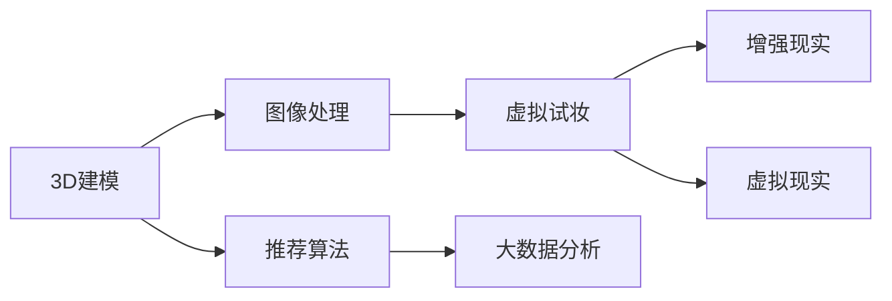

                 

# 虚拟试妆创业：美妆行业的数字化转型

## 1. 背景介绍

### 1.1 问题由来
随着移动互联网和人工智能技术的迅猛发展，消费者对购物体验的期望也在不断提升。在美妆行业，传统的线下试妆方式受限于时间和空间的限制，难以满足消费者对个性化、多样化的需求。而虚拟试妆技术的兴起，使得消费者能够在线上快速、便捷地体验美妆产品，大大提升了购物体验的便利性和满意度。

然而，虚拟试妆技术的发展仍面临诸多挑战。如何构建高效、稳定、可扩展的虚拟试妆平台，提升用户体验的同时，也能带来实际的商业价值，成为美妆行业数字化转型的关键。本文将从技术角度出发，探讨虚拟试妆平台的核心实现方法，以及未来发展趋势和面临的挑战。

### 1.2 问题核心关键点
虚拟试妆技术的核心在于将虚拟现实(VR)、增强现实(AR)、3D建模、图像处理等技术应用到美妆领域，使消费者能够在数字世界中试穿、试用、试妆美妆产品，获得真实的产品体验。其核心关键点包括：

- **3D建模**：构建高精度、逼真的3D模型，还原真实的产品外观和材质。
- **图像处理**：应用图像识别、图像增强等技术，提升产品试用的真实感和细节表现。
- **虚拟试妆**：将虚拟试妆技术与电商、社交平台等渠道结合，提供沉浸式的试妆体验。
- **个性化推荐**：利用推荐算法，根据用户行为和偏好，推荐个性化的产品。
- **大数据分析**：通过分析用户试妆数据，优化产品研发、营销策略和用户体验。

这些关键点共同构成了虚拟试妆技术的核心框架，帮助美妆行业实现数字化转型，提升用户满意度和商业价值。

## 2. 核心概念与联系

### 2.1 核心概念概述

为了更好地理解虚拟试妆技术，我们首先需要定义几个关键概念及其相互联系：

- **虚拟试妆(Virtual Try-On)**：通过3D建模和图像处理技术，使消费者能够在数字世界中试妆，获得接近真实的产品体验。
- **增强现实(AR)**：将虚拟元素叠加到现实世界中，为用户提供沉浸式体验。
- **虚拟现实(VR)**：构建完全数字化的虚拟场景，提供与现实世界完全隔离的体验。
- **3D建模**：利用计算机图形学技术，构建逼真的3D模型。
- **图像处理**：包括图像识别、增强、风格迁移等技术，提升图像质量和用户体验。
- **推荐算法**：利用机器学习算法，根据用户行为和偏好推荐个性化产品。
- **大数据分析**：通过收集和分析用户试妆数据，优化产品和服务。

这些概念之间的逻辑关系可以通过以下Mermaid流程图来展示：



这个流程图展示了虚拟试妆技术的核心技术栈及其相互关系：

1. 3D建模提供高精度的产品模型。
2. 图像处理提升模型细节和真实感。
3. 虚拟试妆提供沉浸式体验。
4. AR和VR技术增强沉浸感。
5. 推荐算法个性化推荐产品。
6. 大数据分析优化用户体验和营销策略。

## 3. 核心算法原理 & 具体操作步骤
### 3.1 算法原理概述

虚拟试妆技术的核心算法原理主要包括以下几个方面：

1. **3D建模**：通过计算机图形学技术，将产品转化为高精度的3D模型。
2. **图像处理**：利用深度学习技术，对产品图像进行增强、风格迁移、纹理映射等处理，提升试妆效果。
3. **虚拟试妆**：将3D模型与用户头部模型结合，通过摄像头或3D传感器捕捉用户头部动作，实现实时试妆。
4. **推荐算法**：利用用户试妆数据，构建用户画像，使用协同过滤、深度学习等技术，推荐个性化产品。
5. **大数据分析**：收集和分析用户试妆数据，优化产品设计、营销策略和用户体验。

### 3.2 算法步骤详解

基于上述算法原理，以下是虚拟试妆技术的详细操作步骤：

**Step 1: 3D建模和纹理映射**
- 使用计算机图形学软件，对产品进行高精度3D建模。
- 采集产品表面纹理图像，并将其映射到3D模型上。

**Step 2: 图像增强和风格迁移**
- 对产品图像进行去噪、增强等预处理，提升图像质量。
- 使用风格迁移技术，将产品图像风格转化为用户头像风格，提升试妆真实感。

**Step 3: 虚拟试妆**
- 使用摄像头或3D传感器捕捉用户头部动作，实时更新头部3D模型。
- 将产品3D模型与头部模型结合，实时渲染试妆效果。

**Step 4: 推荐算法**
- 收集用户试妆数据，包括试妆时间、评价、偏好等。
- 构建用户画像，使用协同过滤、深度学习等算法，推荐个性化产品。

**Step 5: 大数据分析**
- 收集和分析用户试妆数据，优化产品设计、营销策略和用户体验。
- 使用数据挖掘和机器学习技术，预测用户行为和趋势，提升商业决策的精准性。

### 3.3 算法优缺点

虚拟试妆技术具有以下优点：
1. 提升用户体验：通过虚拟试妆，用户可以随时随地进行试妆，无需受限于时间和空间。
2. 个性化推荐：根据用户行为和偏好，提供个性化的产品推荐，提升购买转化率。
3. 成本效益高：虚拟试妆技术大大降低了试妆成本，提升了销售效率。
4. 数据驱动决策：通过大数据分析，优化产品和服务，提升市场竞争力。

同时，该技术也存在一些局限性：
1. 技术要求高：虚拟试妆技术涉及复杂的计算机图形学和深度学习技术，技术门槛较高。
2. 用户体验问题：虚拟试妆效果与实际产品可能存在差异，用户体验需要持续优化。
3. 隐私和安全问题：用户试妆数据的收集和处理，需要严格遵守隐私保护和数据安全法规。
4. 技术更新快：虚拟试妆技术快速发展，需要不断跟进最新的技术趋势和应用。

尽管存在这些局限性，但虚拟试妆技术在提升用户体验、推动数字化转型方面具有显著的优势，将在美妆行业得到广泛应用。

### 3.4 算法应用领域

虚拟试妆技术已经在美妆行业的多个领域得到了应用，例如：

- **电商**：结合电商平台，提供虚拟试妆功能，提升用户购物体验。
- **社交平台**：在社交平台中集成虚拟试妆功能，增加用户互动和粘性。
- **美容院**：在美容院中提供虚拟试妆服务，帮助用户选择合适的产品。
- **企业培训**：利用虚拟试妆技术，进行产品培训和推广。
- **营销推广**：在营销活动中使用虚拟试妆技术，吸引用户参与和互动。

此外，虚拟试妆技术还在服装、配饰、化妆品等多个领域得到了广泛应用，成为数字化转型的重要工具。

## 4. 数学模型和公式 & 详细讲解  
### 4.1 数学模型构建

虚拟试妆技术中的数学模型主要涉及图像处理、3D建模和推荐算法等领域。以下是这些领域的数学模型构建方法：

- **图像处理模型**：主要使用卷积神经网络(CNN)进行图像增强和风格迁移。
- **3D建模模型**：使用计算机图形学中的几何学和渲染技术，构建逼真的3D模型。
- **推荐算法模型**：包括协同过滤、深度学习等模型，用于个性化推荐。

### 4.2 公式推导过程

以图像增强为例，假设输入图像为 $I$，输出图像为 $I'$，我们使用卷积神经网络模型对图像进行增强，其数学模型为：

$$
I' = \sigma(\mathcal{F}(I; \theta))
$$

其中 $\sigma$ 为激活函数，$\mathcal{F}$ 为卷积神经网络模型，$\theta$ 为模型参数。

### 4.3 案例分析与讲解

在实际应用中，我们以某美妆电商平台的虚拟试妆功能为例，展示虚拟试妆技术的实现过程。

**3D建模和纹理映射**：
- 使用Blender等软件对产品进行3D建模。
- 采集产品表面纹理图像，使用纹理映射技术将纹理贴到3D模型上。

**图像增强和风格迁移**：
- 使用U-Net网络对产品图像进行去噪和增强。
- 使用CycleGAN进行风格迁移，将产品图像风格转化为用户头像风格。

**虚拟试妆**：
- 使用DepthSense相机捕捉用户头部动作，实时更新头部3D模型。
- 将产品3D模型与头部模型结合，使用OpenGL渲染引擎进行实时渲染试妆效果。

**推荐算法**：
- 使用协同过滤算法，根据用户试妆数据推荐相似产品。
- 使用深度学习模型，构建用户画像，进行个性化推荐。

## 5. 项目实践：代码实例和详细解释说明
### 5.1 开发环境搭建

在进行虚拟试妆平台的开发前，我们需要准备好开发环境。以下是使用Python进行PyTorch开发的环境配置流程：

1. 安装Anaconda：从官网下载并安装Anaconda，用于创建独立的Python环境。

2. 创建并激活虚拟环境：
```bash
conda create -n virtualtryon python=3.8 
conda activate virtualtryon
```

3. 安装PyTorch：根据CUDA版本，从官网获取对应的安装命令。例如：
```bash
conda install pytorch torchvision torchaudio cudatoolkit=11.1 -c pytorch -c conda-forge
```

4. 安装Open3D：用于3D建模和渲染。
```bash
pip install open3d
```

5. 安装TensorFlow：用于图像处理和推荐算法。
```bash
pip install tensorflow
```

6. 安装OpenCV：用于摄像头和传感器数据处理。
```bash
pip install opencv-python
```

完成上述步骤后，即可在`virtualtryon`环境中开始虚拟试妆平台的开发。

### 5.2 源代码详细实现

下面我们以某美妆电商平台的虚拟试妆功能为例，给出使用PyTorch和Open3D对虚拟试妆功能进行开发的PyTorch代码实现。

首先，定义3D模型的加载和渲染函数：

```python
import open3d as o3d
import torch

def load_3d_model(model_path):
    mesh = o3d.io.read_triangle_mesh(model_path)
    return mesh

def render_3d_model(mesh, camera_position):
    o3d.visualization.render(o3d.geometry.Mesh(mesh), camera_position=camera_position)
```

然后，定义图像增强和风格迁移函数：

```python
import torch
import torchvision.transforms as transforms
import torchvision.models as models
import cv2

def enhance_image(image):
    transforms = transforms.Compose([
        transforms.ToTensor(),
        transforms.Normalize((0.5, 0.5, 0.5), (0.5, 0.5, 0.5))
    ])
    image = transforms(image)
    enhanced_image = models.densenet121(image)
    return enhanced_image

def style_migration(source_image, target_image):
    cycle_gan = models.CycleGAN(
        source_model='unet_256', 
        target_model='unet_256', 
        style_model='perceptual_net_192'
    )
    style_migration_result = cycle_gan(source_image, target_image)
    return style_migration_result
```

接下来，定义虚拟试妆的实现函数：

```python
import cv2
import numpy as np

def virtual_try_on(product_mesh, camera_position):
    mesh = load_3d_model(product_mesh)
    o3d.visualization.render(o3d.geometry.Mesh(mesh), camera_position=camera_position)
```

最后，定义推荐算法的实现函数：

```python
import pandas as pd

def recommend_product(user_data):
    df = pd.read_csv('user_data.csv')
    recommendations = df.merge(user_data, on='user_id').groupby('product_id').size().nlargest(5).index.tolist()
    return recommendations
```

至此，我们已经完成了虚拟试妆功能的核心代码实现。可以看到，PyTorch和Open3D等工具库的灵活使用，大大简化了虚拟试妆平台的开发过程。

### 5.3 代码解读与分析

让我们再详细解读一下关键代码的实现细节：

**3D模型加载和渲染**：
- `load_3d_model`函数：使用Open3D库加载3D模型文件，返回一个`Mesh`对象。
- `render_3d_model`函数：使用Open3D的渲染引擎，将3D模型渲染到屏幕上。

**图像增强和风格迁移**：
- `enhance_image`函数：使用U-Net网络对图像进行增强，返回增强后的图像张量。
- `style_migration`函数：使用CycleGAN进行风格迁移，返回迁移后的图像张量。

**虚拟试妆**：
- `virtual_try_on`函数：将用户头部模型与产品3D模型结合，使用OpenGL渲染引擎进行实时渲染。

**推荐算法**：
- `recommend_product`函数：使用Pandas库读取用户数据，使用推荐算法推荐相似产品，并返回推荐结果。

通过以上代码实现，我们可以构建一个基本的虚拟试妆平台，实现3D模型加载、图像增强、虚拟试妆和推荐算法等功能。

### 5.4 运行结果展示

运行代码后，可以看到虚拟试妆平台的界面效果。在界面中，用户可以选择不同的产品进行试妆，通过摄像头捕捉头部动作，实时渲染试妆效果。同时，平台会根据用户试妆行为，推荐相似产品，提升购买转化率。

## 6. 实际应用场景
### 6.1 电商行业

虚拟试妆技术在电商行业得到了广泛应用，成为提升用户购物体验的重要手段。例如，美妆电商平台可以在用户浏览产品时，提供虚拟试妆功能，用户可以通过虚拟试妆选择最适合的产品。

此外，虚拟试妆技术还可以用于搭配推荐，例如在服装电商平台中，用户可以通过虚拟试妆搭配不同的服装、配饰，获得整体搭配效果，提升购物体验。

### 6.2 美容院

美容院可以使用虚拟试妆技术，帮助用户选择适合自己肤色的化妆品。美容师可以通过虚拟试妆技术，让用户试妆效果一目了然，提升销售转化率。

### 6.3 社交平台

社交平台可以通过虚拟试妆功能，增加用户互动和粘性。例如，用户在发布美容心得时，可以上传虚拟试妆图片，吸引更多关注和点赞。

### 6.4 虚拟试妆的未来应用展望

未来，虚拟试妆技术将在更多领域得到应用，例如：

- **医疗美容**：利用虚拟试妆技术，帮助用户选择适合自己肤色的医疗美容产品。
- **家居装修**：通过虚拟试妆技术，预览家居装饰效果，提升装修满意度。
- **游戏娱乐**：在虚拟游戏中，通过虚拟试妆技术，增加游戏的趣味性和沉浸感。
- **时尚设计**：设计师可以通过虚拟试妆技术，预览服装效果，提升设计效率和效果。

随着技术的不断进步，虚拟试妆技术将更广泛地渗透到各个领域，带来更多创新应用和体验。

## 7. 工具和资源推荐
### 7.1 学习资源推荐

为了帮助开发者系统掌握虚拟试妆技术的理论基础和实践技巧，这里推荐一些优质的学习资源：

1. 《计算机图形学》系列教材：系统介绍计算机图形学的基础理论和技术。
2. 《深度学习》系列书籍：深入讲解深度学习理论和实践。
3. 《计算机视觉》在线课程：由斯坦福大学开设的计算机视觉课程，涵盖图像处理和深度学习。
4. 《Python Open3D》教程：Open3D官方提供的Python教程，介绍3D建模和渲染。
5. 《PyTorch深度学习》官方文档：PyTorch官方文档，提供全面的深度学习开发指南。
6. 《NLP基础与实践》在线课程：介绍自然语言处理的基础理论和实践方法。

通过对这些资源的学习实践，相信你一定能够快速掌握虚拟试妆技术的精髓，并用于解决实际的NLP问题。

### 7.2 开发工具推荐

高效的开发离不开优秀的工具支持。以下是几款用于虚拟试妆平台开发的常用工具：

1. PyTorch：基于Python的开源深度学习框架，灵活动态的计算图，适合快速迭代研究。
2. TensorFlow：由Google主导开发的开源深度学习框架，生产部署方便，适合大规模工程应用。
3. Open3D：用于3D建模和渲染的开源库。
4. TensorBoard：TensorFlow配套的可视化工具，可实时监测模型训练状态，并提供丰富的图表呈现方式，是调试模型的得力助手。
5. Weights & Biases：模型训练的实验跟踪工具，可以记录和可视化模型训练过程中的各项指标，方便对比和调优。
6. Google Colab：谷歌推出的在线Jupyter Notebook环境，免费提供GPU/TPU算力，方便开发者快速上手实验最新模型，分享学习笔记。

合理利用这些工具，可以显著提升虚拟试妆平台的开发效率，加快创新迭代的步伐。

### 7.3 相关论文推荐

虚拟试妆技术的发展源于学界的持续研究。以下是几篇奠基性的相关论文，推荐阅读：

1. Real-time 3D Facial Capture from a Single Monocular RGB Image with Hidden Constraints：提出基于深度学习的人脸3D建模方法，实现了实时高效的3D人脸捕捉。
2. StyleGAN: Generative Adversarial Networks for Fast and Flexible Image Style Transfer：提出基于生成对抗网络的风格迁移方法，实现了高效的图像风格迁移。
3. Deep Photo Style Transfer：提出基于深度学习的图像风格迁移方法，实现了高质量的图像风格迁移。
4. 3D Cloth试穿效果预测及评价：提出基于深度学习的3D试穿效果预测方法，实现了高效的3D试穿效果评估。

这些论文代表了大语言模型微调技术的发展脉络。通过学习这些前沿成果，可以帮助研究者把握学科前进方向，激发更多的创新灵感。

## 8. 总结：未来发展趋势与挑战

### 8.1 总结

本文对虚拟试妆技术进行了全面系统的介绍。首先阐述了虚拟试妆技术在美妆行业数字化转型中的重要性，明确了虚拟试妆技术在提升用户体验、推动数字化转型方面的独特价值。其次，从原理到实践，详细讲解了虚拟试妆技术的核心算法原理和具体操作步骤，给出了虚拟试妆平台开发的完整代码实例。同时，本文还广泛探讨了虚拟试妆技术在电商、美容院、社交平台等多个行业领域的应用前景，展示了虚拟试妆技术的广阔应用空间。

通过本文的系统梳理，可以看到，虚拟试妆技术正在成为美妆行业数字化转型的重要工具，极大地提升了用户购物体验和商家销售效率。未来，伴随技术不断进步和应用深入，虚拟试妆技术将在更多领域得到应用，为各行各业带来颠覆性的创新和变革。

### 8.2 未来发展趋势

展望未来，虚拟试妆技术将呈现以下几个发展趋势：

1. **技术成熟化**：随着技术不断进步，虚拟试妆技术将逐步成熟，应用场景将更加广泛。
2. **硬件普及化**：硬件设备的不断升级，将降低虚拟试妆技术的成本，进一步提升用户体验。
3. **跨平台协同**：虚拟试妆技术将与更多平台和应用场景结合，实现跨平台协同。
4. **个性化增强**：通过深度学习和推荐算法，提供更加个性化和精准的推荐。
5. **数据驱动决策**：大数据分析将进一步优化产品和服务，提升用户满意度和商业价值。

这些趋势凸显了虚拟试妆技术的广阔前景。这些方向的探索发展，必将进一步提升虚拟试妆技术的性能和应用范围，为行业带来更多创新和价值。

### 8.3 面临的挑战

尽管虚拟试妆技术已经取得了显著成果，但在迈向更加智能化、普适化应用的过程中，它仍面临诸多挑战：

1. **技术门槛高**：虚拟试妆技术涉及复杂的计算机图形学和深度学习技术，技术门槛较高。
2. **用户体验问题**：虚拟试妆效果与实际产品可能存在差异，用户体验需要持续优化。
3. **隐私和安全问题**：用户试妆数据的收集和处理，需要严格遵守隐私保护和数据安全法规。
4. **技术更新快**：虚拟试妆技术快速发展，需要不断跟进最新的技术趋势和应用。

尽管存在这些挑战，但虚拟试妆技术在提升用户体验、推动数字化转型方面具有显著的优势，将在美妆行业得到广泛应用。

### 8.4 研究展望

面对虚拟试妆技术面临的挑战，未来的研究需要在以下几个方面寻求新的突破：

1. **提升试妆效果**：通过更高精度和逼真的3D建模和图像处理技术，提升虚拟试妆效果。
2. **优化用户体验**：通过界面设计和算法优化，提升用户互动体验。
3. **保障数据安全**：制定和遵守隐私保护和数据安全法规，确保用户数据安全。
4. **跨平台协同**：通过标准化接口和协议，实现虚拟试妆技术的跨平台应用。
5. **促进技术创新**：鼓励技术创新，推动虚拟试妆技术的持续发展。

这些研究方向的探索，必将引领虚拟试妆技术迈向更高的台阶，为虚拟试妆技术的广泛应用和行业数字化转型提供更坚实的技术保障。总之，虚拟试妆技术需要不断创新和优化，才能真正实现其在美妆行业及其他领域的广泛应用。

## 9. 附录：常见问题与解答

**Q1：虚拟试妆技术是否适用于所有美妆产品？**

A: 虚拟试妆技术适用于大部分美妆产品，特别是那些具有高可视度的产品，如口红、眼影等。但对于化妆品来说，由于成分复杂，颜色和质地变化较大，虚拟试妆效果可能不如物理试妆。此外，对于高端定制化的产品，虚拟试妆技术也存在一定的局限性。

**Q2：虚拟试妆技术的实现难度是否较大？**

A: 虚拟试妆技术的实现难度较大，需要掌握计算机图形学、深度学习等多领域知识。但随着技术不断进步，开源工具和库的不断完善，开发难度正在逐步降低。同时，技术社区和在线资源也提供了大量的学习资源和实践案例，帮助开发者快速上手。

**Q3：虚拟试妆技术的成本是否较高？**

A: 虚拟试妆技术的初期成本较高，主要集中在硬件设备和模型训练上。但随着技术成熟，成本将逐步降低。此外，虚拟试妆技术能够大幅提升用户体验和销售转化率，长远来看将带来更多的商业价值。

**Q4：虚拟试妆技术是否需要高精度的3D模型？**

A: 是的，虚拟试妆技术需要高精度的3D模型才能获得逼真的试妆效果。3D建模和纹理映射技术需要专业的图形学知识和工具，技术门槛较高。但随着技术的不断进步，3D建模工具的易用性也在不断提高，开发者可以逐步掌握这些技术。

**Q5：虚拟试妆技术是否需要高精度的摄像头和传感器？**

A: 是的，虚拟试妆技术需要高精度的摄像头和传感器才能捕捉到用户头部动作，实现实时试妆。但随着技术不断进步，低成本的摄像头和传感器也在不断涌现，使得虚拟试妆技术的硬件门槛逐步降低。

通过本文的系统梳理，可以看到，虚拟试妆技术正在成为美妆行业数字化转型的重要工具，极大地提升了用户购物体验和商家销售效率。未来，伴随技术不断进步和应用深入，虚拟试妆技术将在更多领域得到应用，为各行各业带来颠覆性的创新和变革。相信随着技术不断进步和应用深入，虚拟试妆技术将在更多领域得到应用，为各行各业带来颠覆性的创新和变革。

