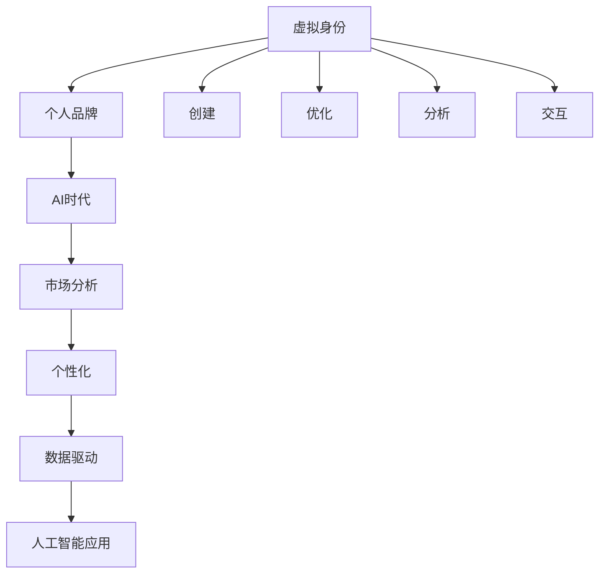

                 

# 虚拟身份市场分析专家：AI时代的个人品牌顾问

> 关键词：虚拟身份、个人品牌、AI时代、市场分析、个性化、数据驱动、人工智能应用

## 1. 背景介绍

随着人工智能(AI)技术的不断进步，虚拟身份在数字世界中的应用愈发广泛。虚拟身份不仅可以帮助人们在虚拟空间中更好地建立和维护个人品牌，还能够为商业、社交、教育等多个领域带来深远影响。本文将从虚拟身份市场分析的角度出发，探讨AI时代如何通过虚拟身份构建和优化个人品牌，从而提升个人在数字时代的竞争力。

### 1.1 虚拟身份的市场现状

虚拟身份市场正处于快速发展阶段，预计到2025年将达到数百亿美元的规模。主要应用场景包括社交网络、虚拟现实(AR/VR)、在线游戏、电子商务等。不同领域的虚拟身份需求各异，但总体趋势显示，用户对个性化、沉浸式和互动性虚拟身份的需求持续增长。

### 1.2 虚拟身份与个人品牌的关系

虚拟身份是用户在虚拟世界中的“虚拟替身”，可以理解为个人品牌在数字空间中的延伸和拓展。虚拟身份不仅代表用户的外部形象，更是其内在的价值观、态度和行为的综合体现。因此，构建和优化虚拟身份，能够直接增强个人品牌的影响力和吸引力。

## 2. 核心概念与联系

### 2.1 核心概念概述

为了更好地理解虚拟身份市场及其在AI时代的最新发展，本节将介绍几个关键概念及其相互联系：

- **虚拟身份**：指用户在虚拟世界中的“虚拟替身”，可以是文本、图像、声音或组合形式，涵盖个人形象、行为和互动风格等多个维度。
- **个人品牌**：指个人或企业通过特定形象、价值主张和行动方式在目标受众中建立和维持的认知形象，其核心在于一致性和独特性。
- **AI时代**：AI技术的应用推动了各行各业的变革，尤其在虚拟身份和个性化服务领域，AI驱动的算法优化和自动化过程发挥了关键作用。
- **市场分析**：通过收集、分析和解读市场数据，洞察市场趋势和用户需求，为虚拟身份的构建和优化提供指导。
- **个性化**：指根据用户偏好和行为数据定制个性化的虚拟身份体验和服务，提升用户满意度和忠诚度。
- **数据驱动**：通过大数据和机器学习技术，从用户行为和反馈中提取洞察，指导虚拟身份的优化和迭代。
- **人工智能应用**：涵盖虚拟身份创建、优化、分析和交互等多个环节，AI技术通过自然语言处理(NLP)、计算机视觉、语音识别等手段，增强虚拟身份的智能和互动性。

这些概念之间的逻辑关系可以通过以下Mermaid流程图来展示：



这个流程图展示了大语言模型微调的核心概念及其之间的关系：

1. 虚拟身份是个人品牌在数字空间中的具体表现形式。
2. AI时代为虚拟身份的构建和优化提供了技术支撑，包括但不限于自然语言处理、计算机视觉和语音识别等。
3. 市场分析通过数据驱动的方式，洞察用户需求和行为模式，为虚拟身份的个性化提供指导。
4. 个性化是虚拟身份构建的核心，通过用户行为数据的分析，实现虚拟身份的差异化、场景化和定制化。
5. 数据驱动作为个性化背后的关键力量，利用大数据和机器学习技术，从海量数据中提取有价值的信息。
6. 人工智能应用是虚拟身份创建、优化、分析和交互的重要工具，提升虚拟身份的智能化和互动性。

这些概念共同构成了虚拟身份在AI时代的应用框架，为其在多个领域的应用提供了基础。

## 3. 核心算法原理 & 具体操作步骤

### 3.1 算法原理概述

虚拟身份的构建和优化，本质上是基于机器学习和大数据分析的个性化过程。其核心算法原理可以概括为以下几个步骤：

1. **数据收集**：从社交媒体、电商平台、在线游戏等多个渠道收集用户行为数据，涵盖用户偏好、互动记录、地理位置等多个维度。
2. **特征提取**：使用自然语言处理(NLP)、计算机视觉、语音识别等技术，提取用户的语言风格、视觉偏好、声音特征等关键特征。
3. **模型训练**：基于用户特征和行为数据，使用机器学习算法训练预测模型，识别用户偏好和行为模式。
4. **个性化生成**：根据预测模型和用户偏好，生成个性化的虚拟身份，涵盖外观、行为和互动风格等多个方面。
5. **反馈优化**：持续收集用户反馈数据，通过迭代优化算法，不断调整虚拟身份，提升用户体验。

### 3.2 算法步骤详解

以下是虚拟身份构建和优化的详细步骤：

**Step 1: 数据收集**
- 整合社交媒体、电商平台、在线游戏等多个渠道的用户行为数据。
- 利用API接口、爬虫工具等手段，自动抓取数据。

**Step 2: 特征提取**
- 使用NLP技术对文本数据进行情感分析、主题建模等处理，提取用户的语言风格和偏好。
- 利用计算机视觉技术对图片、视频等视觉数据进行分析，提取用户的视觉偏好和风格。
- 通过语音识别技术分析音频数据，提取用户的声音特征和风格。

**Step 3: 模型训练**
- 选择适当的机器学习算法，如协同过滤、深度神经网络等。
- 使用收集到的用户特征和行为数据，训练预测模型。
- 模型训练过程中，要注意防止过拟合，采用适当的正则化技术，如L2正则、Dropout等。

**Step 4: 个性化生成**
- 根据预测模型的输出，结合用户偏好，生成个性化的虚拟身份。
- 虚拟身份包括文本、图片、声音等多种形式，应综合考虑用户的多维偏好。

**Step 5: 反馈优化**
- 持续收集用户反馈数据，包括评分、评论、互动记录等。
- 利用迭代优化算法，如遗传算法、贝叶斯优化等，不断调整虚拟身份。
- 定期评估虚拟身份的效果，通过A/B测试等方式，验证改进效果。

### 3.3 算法优缺点

基于机器学习和数据分析的虚拟身份构建方法，具有以下优点：

1. **高个性化**：通过用户行为数据的分析和预测，生成高度个性化的虚拟身份，满足用户多样化的需求。
2. **智能化**：利用AI技术自动化处理数据，提高生成效率和准确性。
3. **实时优化**：通过持续收集用户反馈，动态调整虚拟身份，提升用户体验。

同时，该方法也存在以下缺点：

1. **数据隐私**：数据收集和使用过程中，用户隐私可能受到侵犯。
2. **模型复杂**：模型训练和特征提取过程较为复杂，需要较高的技术门槛。
3. **用户粘性**：虚拟身份的优化需要用户持续参与，用户的活跃度和参与度可能影响效果。

### 3.4 算法应用领域

虚拟身份构建和优化技术，已经广泛应用于以下几个领域：

- **社交网络**：如Instagram、Facebook等平台，通过虚拟身份优化用户界面和互动体验。
- **在线游戏**：如《魔兽世界》、《堡垒之夜》等，生成个性化的虚拟角色，提升用户粘性。
- **电子商务**：如亚马逊、淘宝等平台，通过虚拟身份优化商品推荐和购物体验。
- **虚拟现实**：如Oculus Rift、HTC Vive等，生成个性化的虚拟形象，增强沉浸式体验。
- **教育领域**：如Khan Academy、Coursera等，通过虚拟身份提升在线教育体验和互动性。

这些应用场景展示了虚拟身份在AI时代的广泛应用前景，为各领域提供了新的增长点。

## 4. 数学模型和公式 & 详细讲解 & 举例说明

### 4.1 数学模型构建

虚拟身份的构建和优化，可以通过数学模型来进行形式化描述。假设用户的虚拟身份由多个维度组成，每个维度对应的特征向量为 $x_i$，模型的目标函数为 $L(y,\hat{y})$，其中 $y$ 为真实标签，$\hat{y}$ 为预测标签。数学模型可以表示为：

$$
\min_{\theta} L(y,\hat{y}(\theta))
$$

其中 $\theta$ 为模型参数，$L$ 为损失函数，常用的损失函数包括均方误差、交叉熵等。

### 4.2 公式推导过程

以一个简单的二分类问题为例，假设用户特征为 $x_1$，模型预测标签为 $\hat{y}$，真实标签为 $y$，则二分类交叉熵损失函数为：

$$
L(y,\hat{y}) = -y\log\hat{y} - (1-y)\log(1-\hat{y})
$$

对于具有 $n$ 个特征的用户，其虚拟身份生成的数学模型可以表示为：

$$
\hat{y} = \sigma(W^Tx + b)
$$

其中 $\sigma$ 为激活函数，$W$ 和 $b$ 为模型参数。

### 4.3 案例分析与讲解

假设我们收集了一个用户在社交媒体上的文本数据，使用LSTM进行情感分析，得到用户对于不同话题的情感倾向。假设用户对“旅行”话题的情感倾向为正向，那么我们可以通过以下公式生成虚拟身份的文本部分：

$$
\hat{x}_{\text{text}} = W_{\text{text}} x_{\text{text}} + b_{\text{text}}
$$

其中 $x_{\text{text}}$ 为用户对于“旅行”话题的情感倾向向量，$W_{\text{text}}$ 和 $b_{\text{text}}$ 为训练得到的模型参数。

## 5. 项目实践：代码实例和详细解释说明

### 5.1 开发环境搭建

在进行虚拟身份构建和优化的实践前，我们需要准备好开发环境。以下是使用Python进行PyTorch开发的环境配置流程：

1. 安装Anaconda：从官网下载并安装Anaconda，用于创建独立的Python环境。

2. 创建并激活虚拟环境：
```bash
conda create -n virtual_id_env python=3.8 
conda activate virtual_id_env
```

3. 安装PyTorch：根据CUDA版本，从官网获取对应的安装命令。例如：
```bash
conda install pytorch torchvision torchaudio cudatoolkit=11.1 -c pytorch -c conda-forge
```

4. 安装Natural Language Toolkit (NLTK)、spaCy等文本处理库：
```bash
pip install nltk spacy
```

5. 安装计算机视觉库OpenCV：
```bash
pip install opencv-python
```

6. 安装语音处理库librosa：
```bash
pip install librosa
```

完成上述步骤后，即可在`virtual_id_env`环境中开始项目实践。

### 5.2 源代码详细实现

以下是使用PyTorch进行虚拟身份构建的代码实现。

```python
import torch
import torch.nn as nn
import torch.optim as optim
from sklearn.model_selection import train_test_split
from torch.utils.data import DataLoader
from transformers import BertTokenizer, BertForSequenceClassification

# 加载预训练模型
tokenizer = BertTokenizer.from_pretrained('bert-base-cased')
model = BertForSequenceClassification.from_pretrained('bert-base-cased', num_labels=2)

# 准备训练数据
# 这里假设训练数据已经预处理完成，特征数据为 X，标签数据为 y
X_train, X_test, y_train, y_test = train_test_split(X, y, test_size=0.2, random_state=42)

# 数据集处理
train_dataset = torch.utils.data.TensorDataset(X_train, y_train)
test_dataset = torch.utils.data.TensorDataset(X_test, y_test)
train_loader = DataLoader(train_dataset, batch_size=32, shuffle=True)
test_loader = DataLoader(test_dataset, batch_size=32, shuffle=False)

# 设置模型和优化器
criterion = nn.CrossEntropyLoss()
optimizer = optim.Adam(model.parameters(), lr=1e-5)

# 训练模型
model.train()
for epoch in range(10):
    for batch in train_loader:
        inputs, labels = batch
        optimizer.zero_grad()
        outputs = model(inputs)
        loss = criterion(outputs, labels)
        loss.backward()
        optimizer.step()

# 评估模型
model.eval()
with torch.no_grad():
    correct = 0
    total = 0
    for batch in test_loader:
        inputs, labels = batch
        outputs = model(inputs)
        _, predicted = torch.max(outputs, 1)
        total += labels.size(0)
        correct += (predicted == labels).sum().item()

    print(f"Accuracy: {100 * correct / total:.2f}%")
```

### 5.3 代码解读与分析

让我们再详细解读一下关键代码的实现细节：

**数据集准备**：
- 使用`BertTokenizer`对文本数据进行分词和编码，转换为模型可以处理的张量。
- 将文本张量和标签张量组成`TensorDataset`，并使用`DataLoader`进行批次处理。

**模型和优化器设置**：
- 使用预训练的BERT模型，并通过`num_labels`参数指定分类任务的标签数。
- 选择`CrossEntropyLoss`作为损失函数，并使用`Adam`优化器进行参数更新。

**模型训练**：
- 在每个epoch中，对训练集数据进行迭代，计算损失函数，反向传播更新模型参数。

**模型评估**：
- 在测试集上对模型进行评估，计算准确率。

**代码解释**：
- `model.train()`和`model.eval()`用于切换模型训练和评估模式。
- `optimizer.zero_grad()`用于重置梯度。
- `outputs = model(inputs)`为模型前向传播输出。
- `criterion(outputs, labels)`计算损失函数。
- `loss.backward()`反向传播计算梯度。
- `optimizer.step()`更新模型参数。
- `_, predicted = torch.max(outputs, 1)`对输出结果进行预测，得到概率最高的类别。

通过上述代码，我们可以快速构建和训练一个虚拟身份构建模型。实际应用中，需要根据具体场景进行数据处理和模型优化，以达到更好的效果。

## 6. 实际应用场景

### 6.1 虚拟现实中的个性化虚拟角色

虚拟现实技术的发展，使得用户可以在虚拟空间中自由互动和探索。通过个性化的虚拟角色，可以提升用户沉浸感和体验。例如，在《Minecraft》等游戏中，用户可以选择不同的外观和行为风格的虚拟角色，从而更自由地探索虚拟世界。

### 6.2 社交网络中的虚拟头像

社交网络平台上的虚拟头像，是用户在线形象的重要组成部分。通过个性化虚拟头像的构建，可以增强用户的社交粘性和互动性。例如，Instagram上的虚拟头像生成器，可以根据用户上传的真人照片，自动生成个性化的虚拟头像，满足用户的个性化需求。

### 6.3 在线教育中的虚拟教师

在线教育平台通过虚拟教师，可以提供更加灵活和个性化的教学体验。例如，Khan Academy通过虚拟教师与学生互动，提供个性化的问题解答和辅导。虚拟教师可以根据学生的学习进度和偏好，动态调整教学内容和难度，提升学习效果。

### 6.4 未来应用展望

随着AI技术的进一步发展，虚拟身份在更多领域将得到广泛应用。以下是几个可能的应用方向：

- **虚拟工作环境**：如虚拟办公室、虚拟会议等，通过个性化的虚拟形象，增强团队协作和沟通效率。
- **虚拟健康应用**：如虚拟心理咨询、虚拟健身教练等，提升用户体验和健康效果。
- **虚拟旅游**：如虚拟旅游向导，提供个性化的旅游建议和互动体验。
- **虚拟金融顾问**：如虚拟理财顾问，提供个性化的财务建议和投资策略。

## 7. 工具和资源推荐

### 7.1 学习资源推荐

为了帮助开发者系统掌握虚拟身份的构建和优化，这里推荐一些优质的学习资源：

1. **《Python自然语言处理》（NLTK）**：介绍自然语言处理的基本概念和Python实现。
2. **《深度学习入门》（斋藤康毅）**：讲解深度学习的基本原理和Python实现。
3. **《Python计算机视觉》（Michael Carley）**：介绍计算机视觉的基本概念和Python实现。
4. **《Python语音处理》（Jamie Heppenspall）**：讲解语音处理的基本概念和Python实现。
5. **《NLP基础教程》（Christopher D. Manning）**：讲解自然语言处理的基本概念和Python实现。
6. **《Transformers: Fairness, Responsibility, and Privacy》**：讲解大语言模型构建和应用的基本概念和Python实现。

通过对这些资源的学习实践，相信你一定能够快速掌握虚拟身份构建和优化的精髓，并用于解决实际的NLP问题。

### 7.2 开发工具推荐

高效的开发离不开优秀的工具支持。以下是几款用于虚拟身份构建和优化的常用工具：

1. **PyTorch**：基于Python的开源深度学习框架，灵活动态的计算图，适合快速迭代研究。大部分预训练语言模型都有PyTorch版本的实现。
2. **TensorFlow**：由Google主导开发的开源深度学习框架，生产部署方便，适合大规模工程应用。同样有丰富的预训练语言模型资源。
3. **PyTorch Lightning**：基于PyTorch的深度学习框架，支持轻量级模型的快速训练和部署。
4. **Weights & Biases**：模型训练的实验跟踪工具，可以记录和可视化模型训练过程中的各项指标，方便对比和调优。
5. **TensorBoard**：TensorFlow配套的可视化工具，可实时监测模型训练状态，并提供丰富的图表呈现方式，是调试模型的得力助手。

合理利用这些工具，可以显著提升虚拟身份构建的开发效率，加快创新迭代的步伐。

### 7.3 相关论文推荐

虚拟身份构建和优化技术的发展源于学界的持续研究。以下是几篇奠基性的相关论文，推荐阅读：

1. **Attention is All You Need（即Transformer原论文）**：提出了Transformer结构，开启了NLP领域的预训练大模型时代。
2. **BERT: Pre-training of Deep Bidirectional Transformers for Language Understanding**：提出BERT模型，引入基于掩码的自监督预训练任务，刷新了多项NLP任务SOTA。
3. **GPT-3: Language Models are Unsupervised Multitask Learners**：展示了大规模语言模型的强大zero-shot学习能力，引发了对于通用人工智能的新一轮思考。
4. **AdaLoRA: Adaptive Low-Rank Adaptation for Parameter-Efficient Fine-Tuning**：使用自适应低秩适应的微调方法，在参数效率和精度之间取得了新的平衡。
5. **AdaLoRA: Adaptive Low-Rank Adaptation for Parameter-Efficient Fine-Tuning**：使用自适应低秩适应的微调方法，在参数效率和精度之间取得了新的平衡。

这些论文代表了大语言模型微调技术的发展脉络。通过学习这些前沿成果，可以帮助研究者把握学科前进方向，激发更多的创新灵感。

## 8. 总结：未来发展趋势与挑战

### 8.1 研究成果总结

本文对基于机器学习和数据分析的虚拟身份构建方法进行了全面系统的介绍。首先阐述了虚拟身份在AI时代的重要性和市场现状，明确了虚拟身份在构建和优化过程中的核心算法原理和操作步骤。其次，通过代码实例和详细解释说明，展示了虚拟身份构建的实际应用。最后，通过实际应用场景的探讨，展望了虚拟身份在AI时代的发展趋势和未来应用。

通过本文的系统梳理，可以看到，虚拟身份构建和优化技术在AI时代具有广阔的发展前景，为各领域提供了新的增长点。受益于AI技术的不断进步，虚拟身份在个性化、智能化、互动性等方面将实现质的飞跃，为数字世界的用户提供更加丰富和满足的需求。

### 8.2 未来发展趋势

展望未来，虚拟身份构建和优化技术将呈现以下几个发展趋势：

1. **高个性化**：通过深度学习和数据分析，生成高度个性化的虚拟身份，满足用户多样化的需求。
2. **智能化**：利用AI技术自动化处理数据，提高生成效率和准确性，增强虚拟身份的智能和互动性。
3. **实时优化**：通过持续收集用户反馈，动态调整虚拟身份，提升用户体验。
4. **多模态融合**：融合视觉、语音、文本等多种模态数据，提升虚拟身份的全面性和复杂性。
5. **跨领域应用**：在社交、游戏、教育等多个领域，虚拟身份将得到广泛应用，带来新的商业和社交价值。
6. **隐私保护**：在数据收集和处理过程中，更加重视用户隐私保护，采用匿名化、差分隐私等技术手段。

这些趋势凸显了虚拟身份构建和优化技术的广阔前景，为各领域提供了新的增长点。

### 8.3 面临的挑战

尽管虚拟身份构建和优化技术已经取得了瞩目成就，但在迈向更加智能化、普适化应用的过程中，它仍面临着诸多挑战：

1. **数据隐私**：数据收集和使用过程中，用户隐私可能受到侵犯。
2. **模型复杂**：模型训练和特征提取过程较为复杂，需要较高的技术门槛。
3. **用户粘性**：虚拟身份的优化需要用户持续参与，用户的活跃度和参与度可能影响效果。
4. **模型鲁棒性**：模型面对域外数据时，泛化性能往往大打折扣。
5. **交互体验**：虚拟身份的交互体验需要进一步提升，以实现更自然的用户交互。

### 8.4 研究展望

面对虚拟身份构建和优化面临的种种挑战，未来的研究需要在以下几个方面寻求新的突破：

1. **数据隐私保护**：开发更为隐私保护的数据收集和处理技术，如差分隐私、联邦学习等。
2. **模型优化**：采用更为高效的模型架构和优化算法，提升模型的泛化性能和交互体验。
3. **跨模态融合**：融合视觉、语音、文本等多种模态数据，提升虚拟身份的全面性和复杂性。
4. **用户参与**：设计更为便捷和互动的虚拟身份优化界面，增强用户的参与感和满意度。
5. **交互设计**：优化虚拟身份的交互界面和流程，提升用户的沉浸感和体验。
6. **伦理和法律**：在虚拟身份的构建和优化过程中，重视伦理和法律问题，确保数据和模型使用的合法性和合理性。

这些研究方向的探索，必将引领虚拟身份构建和优化技术迈向更高的台阶，为数字世界的用户提供更加丰富和满足的需求。面向未来，虚拟身份构建和优化技术还需要与其他人工智能技术进行更深入的融合，如知识表示、因果推理、强化学习等，多路径协同发力，共同推动虚拟身份在数字世界的应用和创新。

## 9. 附录：常见问题与解答

**Q1：虚拟身份构建和优化是否适用于所有用户？**

A: 虚拟身份构建和优化技术主要适用于具有一定技术基础和设备条件的用户，如智能手机用户、PC用户等。对于技术水平较低或设备条件较差的用户，可能面临一定的使用门槛。

**Q2：虚拟身份构建和优化需要多少数据？**

A: 虚拟身份构建和优化需要大量用户行为数据，数据量越大，模型越能够精确预测用户的偏好和行为。但数据隐私和安全也是必须考虑的重要因素。

**Q3：虚拟身份构建和优化是否影响用户体验？**

A: 合理设计的虚拟身份构建和优化系统，能够显著提升用户体验，但也需要注意避免过度侵入和影响用户的隐私和自由。

**Q4：虚拟身份构建和优化的成本如何？**

A: 虚拟身份构建和优化的成本主要集中在数据收集和模型训练上。对于大型企业和平台，需要投入一定的技术资源和资金，进行数据处理和模型训练。

**Q5：虚拟身份构建和优化是否有伦理问题？**

A: 虚拟身份构建和优化过程中，需要重视用户的隐私保护和数据安全，避免对用户造成不必要的困扰和风险。同时，应确保虚拟身份的使用符合伦理和法律规范。

---

作者：禅与计算机程序设计艺术 / Zen and the Art of Computer Programming

