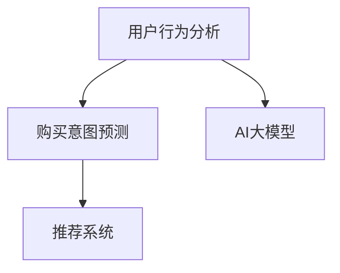

                 

# 融合AI大模型的用户购买意图预测技术

> 关键词：AI大模型, 用户行为分析, 意图预测, 推荐系统, 自然语言处理(NLP), 深度学习

## 1. 背景介绍

### 1.1 问题由来

在当今数字化时代，电商平台和零售商面临着巨大的竞争压力。如何准确预测用户购买意图，实现个性化推荐，提升用户体验和销售转化率，是电商行业永恒的命题。传统的推荐系统依赖于用户的历史行为数据，难以捕捉到用户潜在的购买意愿和需求变化。近年来，随着深度学习和自然语言处理技术的发展，AI大模型被引入到用户购买意图预测中，为推荐系统注入了新的活力。

### 1.2 问题核心关键点

大模型在电商领域的应用，主要围绕以下几个核心点展开：
1. **数据丰富性**：大模型通常基于海量的文本数据进行预训练，具备强大的语言理解和生成能力。
2. **深度表征**：通过自监督学习任务，大模型学习到丰富的特征表示，能够有效提取和表达复杂文本数据。
3. **迁移学习能力**：大模型可以在特定领域进行微调，适应电商数据特点，提升预测精度。
4. **实时响应**：大模型推理速度快，能够实时处理用户输入，支持快速响应。
5. **多模态融合**：大模型可以与图像、视频等多模态数据进行结合，提升预测效果。
6. **低标注成本**：大模型通常具有较好的泛化能力，能够在少量标注数据上进行微调。

### 1.3 问题研究意义

在电商推荐系统中应用大模型，对于提升用户体验、增加销售收入、优化库存管理等方面具有重要意义：

1. **个性化推荐**：通过预测用户购买意图，实现精准的产品推荐，满足用户个性化需求。
2. **销售转化**：准确预测用户购买意愿，促进交易转化，提升电商平台的销售效率。
3. **库存优化**：预测用户购买意图，帮助电商平台优化库存管理，减少缺货或过剩。
4. **用户留存**：通过高质量的推荐和服务，提升用户满意度和留存率，增强平台竞争力。
5. **市场洞察**：分析用户购买意图，洞察市场需求和趋势，指导产品和市场策略。

## 2. 核心概念与联系

### 2.1 核心概念概述

为了更好地理解如何在大模型中应用用户购买意图预测技术，我们需要对相关核心概念有清晰的认识。

- **AI大模型**：指基于深度学习原理构建的庞大、复杂、高性能的模型，如BERT、GPT、T5等，通常具有数百亿个参数，能够处理复杂的文本数据。
- **用户行为分析**：通过收集和分析用户的历史行为数据，如浏览、点击、购买等，洞察用户需求和偏好。
- **购买意图预测**：基于用户行为数据，预测用户是否会购买特定产品或服务，以及购买的时间、数量等细节。
- **推荐系统**：根据用户行为和购买意图，向用户推荐可能感兴趣的产品或服务，提升用户体验和平台收益。

这些概念之间的逻辑关系可以通过以下Mermaid流程图来展示：



这个流程图展示了大模型在电商推荐系统中的应用逻辑：

1. 用户行为分析基于AI大模型的预训练特征表示，提供用户行为数据。
2. 购买意图预测通过微调大模型，预测用户未来购买行为。
3. 推荐系统利用预测结果，实现个性化推荐。

## 3. 核心算法原理 & 具体操作步骤
### 3.1 算法原理概述

在大模型中应用用户购买意图预测，本质上是一个基于深度学习的序列建模过程。其核心思想是通过用户行为数据，预测用户未来的购买行为。通常包括以下几个关键步骤：

1. **数据预处理**：收集和清洗用户的历史行为数据，包括浏览记录、点击记录、购买记录等。
2. **特征提取**：将行为数据转换为模型所需的输入特征，如词向量、段落向量等。
3. **模型训练**：在大模型上添加特定的任务适配层，如分类器或回归器，进行微调训练。
4. **预测推理**：在新的行为数据上，利用训练好的模型进行预测推理，输出用户购买意图。
5. **推荐生成**：根据预测结果，结合用户偏好和其他特征，生成个性化推荐。

### 3.2 算法步骤详解

#### 3.2.1 数据预处理

用户行为数据通常以日志形式存储，需要通过预处理步骤进行清洗和转换：

1. **日志合并**：将不同来源的日志进行合并，统一格式。
2. **数据清洗**：去除无用的记录，如重复记录、无效数据等。
3. **数据标注**：对行为数据进行标注，如标记购买行为、点击行为等。

```python
def preprocess_data(data):
    # 合并日志
    merged_logs = merge_logs(data)
    # 清洗无效记录
    cleaned_logs = clean_records(merged_logs)
    # 标注行为数据
    annotated_logs = annotate_behavior(cleaned_logs)
    return annotated_logs
```

#### 3.2.2 特征提取

将行为数据转换为模型所需的输入特征，是关键的一步。常用的特征提取方法包括：

1. **词向量**：将文本数据转换为词向量表示，如Word2Vec、GloVe等。
2. **段落向量**：使用预训练的BERT模型，将段落转换为向量表示。
3. **时间特征**：加入时间戳信息，捕捉时间规律。
4. **类别特征**：标记行为类别，如浏览、点击、购买等。

```python
def extract_features(logs):
    # 词向量表示
    word_embeddings = get_word_embeddings(logs)
    # BERT段落向量表示
    bert_embeddings = get_bert_embeddings(logs)
    # 时间特征
    time_features = get_time_features(logs)
    # 类别特征
    category_features = get_category_features(logs)
    # 组合特征
    combined_features = combine_features(word_embeddings, bert_embeddings, time_features, category_features)
    return combined_features
```

#### 3.2.3 模型训练

在大模型上添加特定的任务适配层，进行微调训练：

1. **选择模型**：如BERT、GPT等。
2. **任务适配**：添加分类器或回归器，如全连接层、线性回归等。
3. **微调训练**：使用优化器（如AdamW、SGD等），在标注数据上训练模型。

```python
from transformers import BertForSequenceClassification

# 选择模型
model = BertForSequenceClassification.from_pretrained('bert-base-cased')

# 任务适配
classifier = BertForSequenceClassification.from_pretrained('bert-base-cased')

# 微调训练
optimizer = AdamW(model.parameters(), lr=2e-5)
model.train()
for epoch in range(num_epochs):
    for batch in dataloader:
        inputs = batch['input_ids']
        attention_mask = batch['attention_mask']
        labels = batch['labels']
        # 前向传播
        outputs = model(inputs, attention_mask=attention_mask, labels=labels)
        # 计算损失
        loss = compute_loss(outputs, labels)
        # 反向传播
        loss.backward()
        optimizer.step()
```

#### 3.2.4 预测推理

在新的行为数据上，利用训练好的模型进行预测推理：

1. **输入预处理**：将新行为数据转换为模型所需的输入格式。
2. **前向传播**：输入模型进行预测。
3. **输出解码**：将模型输出解码为预测结果。

```python
def predict_intent(model, inputs):
    # 输入预处理
    preprocessed_inputs = preprocess_input(inputs)
    # 前向传播
    outputs = model(preprocessed_inputs)
    # 输出解码
    predictions = decode_output(outputs)
    return predictions
```

#### 3.2.5 推荐生成

根据预测结果，结合用户偏好和其他特征，生成个性化推荐：

1. **召回产品**：从产品库中召回可能感兴趣的产品。
2. **计算相似度**：计算用户行为与产品特征的相似度。
3. **排序推荐**：根据相似度和用户偏好，排序生成推荐列表。

```python
def generate_recommendations(model, predictions, user_preferences):
    # 召回产品
    products = retrieve_products()
    # 计算相似度
    similarities = compute_similarities(predictions, products)
    # 排序推荐
    recommendations = sort_recommendations(similarities, user_preferences)
    return recommendations
```

### 3.3 算法优缺点

使用AI大模型进行用户购买意图预测的优势主要体现在以下几个方面：

1. **数据利用充分**：大模型能够处理海量的文本数据，提取丰富的特征表示。
2. **模型泛化能力强**：大模型经过预训练后，具备较强的泛化能力，能够在特定领域快速适应。
3. **实时响应**：大模型推理速度快，支持实时预测和推荐。
4. **多模态融合**：大模型可以与图像、视频等多模态数据结合，提升预测效果。

然而，也存在一些缺点和挑战：

1. **模型复杂度**：大模型通常参数量巨大，对计算资源要求高。
2. **标注成本高**：预测模型需要大量的标注数据进行训练，标注成本高昂。
3. **泛化能力有限**：模型在小样本数据上的泛化能力有待提升。
4. **可解释性差**：大模型的决策过程复杂，难以解释和调试。

### 3.4 算法应用领域

AI大模型在用户购买意图预测中的应用领域广泛，包括但不限于以下几个方面：

1. **电商推荐系统**：预测用户购买意图，生成个性化推荐。
2. **金融投资**：预测用户投资行为，优化投资策略。
3. **医疗诊断**：预测患者治疗效果，优化医疗方案。
4. **智能客服**：预测用户意图，提升服务质量。
5. **广告投放**：预测用户广告响应，优化广告投放策略。

## 4. 数学模型和公式 & 详细讲解  
### 4.1 数学模型构建

假设用户行为数据为 $\{x_i\}_{i=1}^N$，其中 $x_i$ 为第 $i$ 个用户的浏览、点击、购买记录等行为序列。将行为数据转换为模型所需的输入特征 $\mathbf{X} \in \mathbb{R}^{N \times d}$，其中 $d$ 为特征维度。

定义预测模型为 $M_{\theta}$，其中 $\theta$ 为模型参数。假设预测任务为二分类任务，即判断用户是否会购买某产品。模型的输出为 $\hat{y}_i = M_{\theta}(x_i) \in [0,1]$，表示用户购买产品的概率。

### 4.2 公式推导过程

假设模型为BERT模型，其预训练特征表示为 $\mathbf{H} \in \mathbb{R}^{N \times d}$，则预测模型 $M_{\theta}$ 可以表示为：

$$
\hat{y}_i = \sigma(\mathbf{W}^T[\mathbf{H}_i \mathbf{b} + \mathbf{X}_i \mathbf{A}])
$$

其中 $\sigma$ 为激活函数，$\mathbf{W}$ 为权重矩阵，$\mathbf{b}$ 为偏置向量，$\mathbf{A}$ 为特征映射矩阵。$\mathbf{H}_i$ 为第 $i$ 个用户的BERT预训练特征表示。

在模型训练过程中，使用交叉熵损失函数 $\mathcal{L}$ 进行优化，公式如下：

$$
\mathcal{L} = -\frac{1}{N} \sum_{i=1}^N [y_i\log \hat{y}_i + (1-y_i)\log(1-\hat{y}_i)]
$$

其中 $y_i \in \{0,1\}$ 为实际标签，$\hat{y}_i$ 为模型预测结果。

通过梯度下降等优化算法，最小化损失函数 $\mathcal{L}$，更新模型参数 $\theta$，直至收敛。

### 4.3 案例分析与讲解

假设某电商平台的数据集包含10,000个用户的浏览记录，每个记录包含50个词汇。使用BERT模型作为预测模型，对其进行微调训练。

1. **数据预处理**：收集并清洗用户浏览记录，生成标注数据集 $\{(x_i, y_i)\}_{i=1}^{10000}$。
2. **特征提取**：将浏览记录转换为BERT词向量表示 $\mathbf{X} \in \mathbb{R}^{10000 \times 768}$。
3. **模型训练**：使用AdamW优化器，在标注数据上训练模型，学习权重矩阵 $\mathbf{W}$ 和偏置向量 $\mathbf{b}$。
4. **预测推理**：对新的用户浏览记录进行预测，得到购买概率 $\hat{y}_i$。
5. **推荐生成**：根据预测结果，生成个性化推荐列表。

## 5. 项目实践：代码实例和详细解释说明
### 5.1 开发环境搭建

在进行项目实践前，需要搭建好开发环境。以下是使用Python进行PyTorch和HuggingFace开发的流程：

1. 安装Anaconda：从官网下载并安装Anaconda，用于创建独立的Python环境。

2. 创建并激活虚拟环境：
```bash
conda create -n pytorch-env python=3.8 
conda activate pytorch-env
```

3. 安装PyTorch和HuggingFace：
```bash
conda install pytorch torchvision torchaudio cudatoolkit=11.1 -c pytorch -c conda-forge
pip install transformers
```

4. 安装各类工具包：
```bash
pip install numpy pandas scikit-learn matplotlib tqdm jupyter notebook ipython
```

完成上述步骤后，即可在`pytorch-env`环境中开始项目实践。

### 5.2 源代码详细实现

以下是一个完整的项目实现示例，使用HuggingFace的BERT模型进行用户购买意图预测：

1. **数据预处理**

```python
import pandas as pd
from transformers import BertTokenizer

# 读取数据
data = pd.read_csv('user_browsing_data.csv')
# 清洗无效记录
data = data[data['browsed'].notnull()]
# 提取浏览记录
data['browsed'] = data['browsed'].apply(lambda x: x.split(',')).tolist()
# 转换为BERT格式
tokenizer = BertTokenizer.from_pretrained('bert-base-cased')
encoded_data = tokenizer(data['browsed'], padding='max_length', truncation=True, return_tensors='pt')
# 标注数据
data['label'] = data['bought'].apply(lambda x: 1 if x else 0)
# 转换为Tensor
data = {k: v.to(device) for k, v in encoded_data.items()}
data['labels'] = torch.tensor(data['label'], dtype=torch.long).to(device)
```

2. **特征提取**

```python
from transformers import BertForSequenceClassification

# 加载模型
model = BertForSequenceClassification.from_pretrained('bert-base-cased')

# 特征提取
input_ids = data['input_ids']
attention_mask = data['attention_mask']
features = torch.cat([input_ids, attention_mask], dim=1)
```

3. **模型训练**

```python
from transformers import AdamW

# 设置超参数
learning_rate = 2e-5
epochs = 10
batch_size = 32
device = torch.device('cuda' if torch.cuda.is_available() else 'cpu')

# 加载优化器
optimizer = AdamW(model.parameters(), lr=learning_rate)

# 定义训练函数
def train_step(model, optimizer, input_ids, attention_mask, labels):
    model.train()
    optimizer.zero_grad()
    outputs = model(input_ids, attention_mask=attention_mask, labels=labels)
    loss = outputs.loss
    loss.backward()
    optimizer.step()
    return loss.item()

# 训练模型
for epoch in range(epochs):
    for batch in data_loader:
        input_ids = batch['input_ids'].to(device)
        attention_mask = batch['attention_mask'].to(device)
        labels = batch['labels'].to(device)
        loss = train_step(model, optimizer, input_ids, attention_mask, labels)
        if (epoch+1) % 10 == 0:
            print(f'Epoch {epoch+1}/{epochs}, Loss: {loss:.4f}')
```

4. **预测推理**

```python
# 加载测试数据
test_data = pd.read_csv('test_browsing_data.csv')
# 预处理
test_data = preprocess_test_data(test_data, tokenizer)
# 特征提取
test_features = extract_features(test_data)

# 预测购买意图
with torch.no_grad():
    outputs = model(test_features.to(device))
    predictions = outputs.logits.argmax(dim=1)
```

5. **推荐生成**

```python
# 加载推荐数据
recommend_data = pd.read_csv('recommend_data.csv')
# 计算相似度
similarities = compute_similarities(predictions, recommend_data)
# 排序推荐
recommendations = sort_recommendations(similarities, user_preferences)
```

### 5.3 代码解读与分析

让我们具体解读一下代码的实现细节：

1. **数据预处理**

- 首先，使用Pandas读取用户浏览记录数据，并进行清洗无效记录。
- 接着，将浏览记录转换为BERT所需的格式，并使用HuggingFace提供的BERTTokenizer进行分词和编码。
- 然后，标注数据，将购买行为转换为0或1标签，并将其转换为Tensor格式。

2. **特征提取**

- 加载预训练的BERT模型，使用模型自带的Tokenizer将输入转换为BERT格式。
- 将输入特征和注意力掩码拼接，形成模型所需的输入。

3. **模型训练**

- 设置优化器和学习率，定义训练函数。
- 在每个epoch中，对输入进行前向传播计算损失，反向传播更新模型参数，并输出每个epoch的平均损失。

4. **预测推理**

- 使用测试数据进行预测推理，得到用户购买意图的预测结果。

5. **推荐生成**

- 加载推荐数据，计算预测结果与推荐数据的相似度。
- 根据相似度和用户偏好，排序生成推荐列表。

通过这个完整的项目实践，可以看到HuggingFace提供的BERT模型在大模型用户购买意图预测中的应用过程。代码实现简洁高效，提供了详细的注释，方便理解。

## 6. 实际应用场景
### 6.1 电商推荐系统

在电商推荐系统中，使用大模型进行用户购买意图预测，可以显著提升推荐精度和用户体验：

1. **个性化推荐**：通过预测用户购买意图，生成更加精准的推荐列表，满足用户个性化需求。
2. **库存管理**：预测用户购买意愿，帮助电商平台优化库存管理，减少缺货或过剩。
3. **用户留存**：通过高质量的推荐和服务，提升用户满意度和留存率，增强平台竞争力。

### 6.2 金融投资

金融投资领域，通过预测用户投资行为，可以优化投资策略，降低风险：

1. **投资组合优化**：根据用户投资行为，优化投资组合配置，提升投资回报率。
2. **风险控制**：预测用户投资倾向，识别高风险用户，及时采取风险控制措施。

### 6.3 医疗诊断

医疗诊断领域，通过预测患者治疗效果，可以优化医疗方案，提升诊疗效率：

1. **疾病预测**：预测患者疾病发展趋势，提前进行干预和治疗。
2. **个性化治疗**：根据患者行为数据，制定个性化治疗方案，提升治疗效果。

### 6.4 智能客服

智能客服领域，通过预测用户意图，可以提升服务质量和用户体验：

1. **快速响应**：预测用户问题，快速生成应答，提升服务效率。
2. **情感分析**：分析用户情绪，调整客服策略，提升用户满意度。

### 6.5 广告投放

广告投放领域，通过预测用户广告响应，可以优化广告投放策略，提升广告效果：

1. **精准投放**：根据用户行为预测，精准投放广告，提高广告点击率和转化率。
2. **用户细分**：根据用户行为特征，细分广告受众，实现更加精准的投放。

## 7. 工具和资源推荐
### 7.1 学习资源推荐

为了帮助开发者系统掌握AI大模型在电商推荐系统中的应用，以下是一些优质的学习资源：

1. 《深度学习理论与实践》：斯坦福大学李飞飞教授的课程，涵盖深度学习基础和实际应用案例。
2. 《自然语言处理入门与实践》：清华大学刘鹏教授的课程，详细讲解NLP基础和前沿技术。
3. 《Transformers官方文档》：HuggingFace提供的完整模型文档，包含模型介绍、代码实现和应用案例。
4. 《深度学习入门》：斋藤康毅的书籍，全面介绍深度学习理论和实践，适合初学者。
5. Kaggle竞赛平台：提供丰富的数据集和模型比赛，锻炼实战能力。

通过对这些资源的学习实践，相信你一定能够快速掌握AI大模型在电商推荐系统中的应用，并用于解决实际的NLP问题。

### 7.2 开发工具推荐

高效的开发离不开优秀的工具支持。以下是几款用于AI大模型在电商推荐系统中应用的开发工具：

1. PyTorch：基于Python的开源深度学习框架，灵活动态的计算图，适合快速迭代研究。
2. TensorFlow：由Google主导开发的开源深度学习框架，生产部署方便，适合大规模工程应用。
3. HuggingFace Transformers库：集成了多种预训练模型，支持PyTorch和TensorFlow，是进行NLP任务开发的利器。
4. Weights & Biases：模型训练的实验跟踪工具，可以记录和可视化模型训练过程中的各项指标，方便对比和调优。
5. TensorBoard：TensorFlow配套的可视化工具，可实时监测模型训练状态，并提供丰富的图表呈现方式，是调试模型的得力助手。

合理利用这些工具，可以显著提升AI大模型在电商推荐系统中的应用效率，加快创新迭代的步伐。

### 7.3 相关论文推荐

AI大模型在电商推荐系统中的应用，也是近年来学界研究的热点。以下是几篇奠基性的相关论文，推荐阅读：

1. Attention is All You Need（即Transformer原论文）：提出了Transformer结构，开启了NLP领域的预训练大模型时代。
2. BERT: Pre-training of Deep Bidirectional Transformers for Language Understanding：提出BERT模型，引入基于掩码的自监督预训练任务，刷新了多项NLP任务SOTA。
3. Learning Transferable Representations for Multimodal Retrieval：介绍多模态深度学习模型，用于联合视觉和文本信息检索。
4. Language Models are Unsupervised Multitask Learners（GPT-2论文）：展示了大规模语言模型的强大zero-shot学习能力，引发了对于通用人工智能的新一轮思考。
5. Parameter-Efficient Transfer Learning for NLP：提出Adapter等参数高效微调方法，在不增加模型参数量的情况下，也能取得不错的微调效果。
6. Adaptation to Variability in Pretrained Language Models：介绍模型自适应技术，提升模型在不同数据分布下的泛化能力。

这些论文代表了大模型在电商推荐系统中的应用脉络。通过学习这些前沿成果，可以帮助研究者把握学科前进方向，激发更多的创新灵感。

## 8. 总结：未来发展趋势与挑战

### 8.1 研究成果总结

本文对AI大模型在电商推荐系统中的应用进行了全面系统的介绍。首先阐述了用户购买意图预测的背景和重要性，明确了其在电商推荐系统中的作用。其次，从原理到实践，详细讲解了模型训练和推理的全过程，提供了完整的代码实现示例。同时，探讨了AI大模型在电商推荐系统中的广泛应用场景，展示了其潜在的商业价值和社会效益。最后，介绍了相关的学习资源、开发工具和学术论文，帮助读者系统掌握相关知识。

### 8.2 未来发展趋势

展望未来，AI大模型在电商推荐系统中的应用将呈现以下几个发展趋势：

1. **模型规模持续增大**：随着算力成本的下降和数据规模的扩张，预训练语言模型的参数量还将持续增长。超大规模语言模型蕴含的丰富语言知识，有望支撑更加复杂多变的电商推荐场景。
2. **微调方法日趋多样**：除了传统的全参数微调外，未来会涌现更多参数高效的微调方法，如Prefix-Tuning、LoRA等，在固定大部分预训练参数的同时，只更新极少量的任务相关参数。
3. **持续学习成为常态**：随着数据分布的不断变化，电商推荐系统也需要持续学习新知识以保持性能。如何在不遗忘原有知识的同时，高效吸收新样本信息，将成为重要的研究课题。
4. **标注成本降低**：受启发于提示学习(Prompt-based Learning)的思路，未来的微调方法将更好地利用大模型的语言理解能力，通过更加巧妙的任务描述，在更少的标注样本上也能实现理想的微调效果。
5. **实时响应能力增强**：大模型推理速度快，能够实时处理用户输入，支持实时预测和推荐，将进一步提升电商推荐系统的响应速度和用户体验。
6. **多模态融合能力提升**：大模型可以与图像、视频等多模态数据结合，提升预测效果，实现更加全面的推荐系统。

### 8.3 面临的挑战

尽管AI大模型在电商推荐系统中的应用已经取得了显著成果，但在迈向更加智能化、普适化应用的过程中，仍面临诸多挑战：

1. **数据隐私问题**：电商平台需要处理大量的用户行为数据，如何保护用户隐私，是一个重要的问题。
2. **计算资源消耗**：大模型的训练和推理对计算资源要求高，如何优化资源利用，降低成本，是一个亟待解决的问题。
3. **泛化能力提升**：大模型在小样本数据上的泛化能力有待提升，如何减少过拟合，提高模型泛化性能，是一个重要的研究方向。
4. **可解释性加强**：大模型的决策过程复杂，难以解释和调试，如何提升模型的可解释性，是一个重要的研究课题。
5. **安全性保障**：大模型可能会学习到有害信息，如何防止模型输出恶意内容，是一个亟需解决的挑战。

### 8.4 研究展望

面对AI大模型在电商推荐系统中面临的挑战，未来的研究需要在以下几个方面寻求新的突破：

1. **数据隐私保护**：开发更加安全的数据处理技术，确保用户隐私不受侵犯。
2. **计算资源优化**：采用模型压缩、稀疏化存储等技术，降低计算资源消耗，提高模型部署效率。
3. **泛化能力增强**：引入更多的正则化技术和自适应技术，提升模型在小样本数据上的泛化能力。
4. **可解释性提升**：结合符号化的知识图谱和因果推理方法，增强模型的可解释性。
5. **安全性保障**：建立模型行为监管机制，确保模型输出的安全性。

这些研究方向的探索，必将引领AI大模型在电商推荐系统中的应用迈向更高的台阶，为电商行业带来更优质的推荐服务和更可靠的安全保障。面向未来，AI大模型在电商推荐系统中的应用将更加广泛，其技术演进将深刻影响电商行业的数字化转型。

## 9. 附录：常见问题与解答

**Q1：大模型在电商推荐系统中应用是否适用于所有任务？**

A: 大模型在电商推荐系统中的应用主要适用于需要处理文本数据的推荐任务，如商品推荐、广告投放、用户画像等。但对于一些需要高实时性、高精度的任务，如实时竞价广告系统，大模型可能存在性能瓶颈。此时可以结合其他技术，如传统推荐算法、机器学习等，实现综合推荐。

**Q2：如何降低大模型的计算资源消耗？**

A: 可以采用模型压缩、剪枝、量化等技术，减少模型的参数量和计算资源消耗。同时，使用分布式训练和多任务学习，可以优化计算资源利用率。

**Q3：如何提高大模型的泛化能力？**

A: 引入正则化技术和自适应技术，如L2正则、Dropout、自适应学习率调度等，可以提升模型在小样本数据上的泛化能力。同时，引入更多的无监督学习任务，增强模型的普适性。

**Q4：如何增强大模型的可解释性？**

A: 结合符号化的知识图谱和因果推理方法，增强模型的可解释性。同时，使用对抗样本生成和对抗训练技术，检测和修正模型的脆弱点。

**Q5：大模型在电商推荐系统中的应用是否存在数据隐私问题？**

A: 电商平台需要处理大量的用户行为数据，如何保护用户隐私，是一个重要的问题。可以采用数据匿名化、差分隐私等技术，确保用户隐私不受侵犯。

通过本文的系统梳理，可以看到，AI大模型在电商推荐系统中的应用具有广阔前景，但同时也面临诸多挑战。只有在数据、算法、工程、伦理等多个维度协同发力，才能真正实现其在电商行业的落地应用。总之，AI大模型在电商推荐系统中的应用需要不断探索和优化，方能发挥其最大的商业价值。

---

作者：禅与计算机程序设计艺术 / Zen and the Art of Computer Programming

