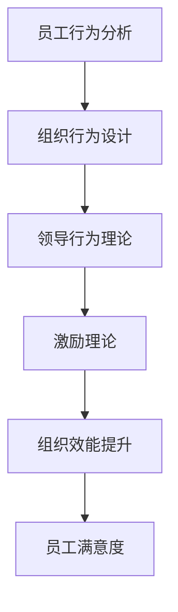

                 

## 1. 背景介绍

在信息技术飞速发展的今天，企业管理的理念和方法也在不断演进。从传统的工业生产管理到知识型企业的组织设计，再到智慧管理的综合管理模式，企业的组织结构和运营方式发生了翻天覆地的变化。然而，随着企业信息化水平的提升和组织规模的扩大，管理中的问题也日益凸显，如人才流失、沟通障碍、决策迟缓等。这些问题的解决，需要借助现代管理理论与信息技术，而行为科学在管理实践中的应用，正是在这一背景下应运而生。

行为科学作为一门跨学科的研究领域，融合了心理学、社会学、人类学等多方面的知识，通过研究人的行为模式和心理特征，提供了全新的管理方法和工具。在企业实践中，行为科学被广泛应用于人力资源管理、员工激励、组织变革、团队合作等方面，有效地提升了企业的运营效率和员工满意度。

本文旨在探讨行为科学在管理实践中的应用，通过分析行为科学的核心概念和方法，阐述其在企业中的应用场景，提供具体的案例和实践建议，以期为管理实践提供理论支持和技术手段。

## 2. 核心概念与联系

### 2.1 核心概念概述

行为科学的核心概念主要包括：

- **员工行为分析**：通过研究员工在组织环境中的行为模式和心理特征，了解员工的动机、态度和期望，为其提供更合适的管理和激励策略。
- **组织行为设计**：在理解员工行为的基础上，设计符合组织目标的组织结构和流程，提升组织的整体效能。
- **领导行为理论**：探讨不同领导风格对员工行为和组织绩效的影响，指导管理者提升领导力和影响力。
- **激励理论**：分析不同激励机制如何影响员工行为，为企业提供有效的激励策略。

这些概念之间相互关联，共同构成了行为科学的管理框架。通过员工行为分析，理解员工动机和期望；通过组织行为设计，优化组织结构和流程；通过领导行为理论，提升管理者的领导力和影响力；通过激励理论，设计有效的激励机制，从而全面提升企业运营效率和员工满意度。

### 2.2 核心概念原理和架构的 Mermaid 流程图



该图展示了行为科学核心概念之间的联系。员工行为分析为组织行为设计提供数据基础，领导行为理论指导组织行为设计，激励理论为领导行为理论和组织行为设计提供理论支持，最终实现组织效能的提升和员工满意度的提高。

## 3. 核心算法原理 & 具体操作步骤

### 3.1 算法原理概述

行为科学在管理实践中的应用，主要基于对员工行为和心理特征的研究，通过数据分析和建模，提供管理建议和决策支持。核心算法原理包括：

- **行为数据采集**：通过问卷调查、观察、实验等方法，收集员工行为和心理数据。
- **数据分析与建模**：利用统计学和数据挖掘技术，对行为数据进行分析，建立员工行为模型。
- **管理建议与决策**：基于行为模型，提供管理建议和决策支持，优化组织管理和员工激励策略。

这些算法原理构成了行为科学在管理实践中的基本框架，通过数据驱动的方式，提升管理效率和效果。

### 3.2 算法步骤详解

#### 3.2.1 行为数据采集

行为数据采集是行为科学应用的基础。常用的数据采集方法包括：

- **问卷调查**：通过设计问卷，收集员工对工作环境、工作任务、工作压力等方面的感知和态度。
- **观察法**：通过直接观察员工在组织环境中的行为，记录工作表现、团队协作等。
- **实验法**：通过控制变量，观察不同变量对员工行为的影响，如工作压力、奖励机制等。

#### 3.2.2 数据分析与建模

在收集到行为数据后，需要利用统计学和数据挖掘技术进行数据分析和建模。常用的数据分析方法包括：

- **描述性统计**：通过计算均值、方差、标准差等指标，了解数据的基本特征。
- **相关性分析**：通过计算相关系数，分析不同变量之间的关系。
- **回归分析**：通过建立回归模型，预测员工行为和组织绩效。

#### 3.2.3 管理建议与决策

数据分析完成后，需要根据行为模型，提出具体的管理建议和决策。常用的决策方法包括：

- **员工激励**：根据员工行为模型，设计个性化的激励机制，如绩效奖金、晋升机会等。
- **组织优化**：根据组织行为模型，优化组织结构和流程，提升工作效率和员工满意度。
- **领导力提升**：根据领导行为模型，提升管理者的领导力和影响力，改善员工关系。

### 3.3 算法优缺点

#### 3.3.1 优点

行为科学在管理实践中的应用具有以下优点：

- **数据驱动**：通过数据分析和建模，提供科学的管理建议，避免了主观偏见。
- **全面视角**：结合心理学、社会学等多学科知识，全面理解员工行为和心理特征，提高管理的科学性和有效性。
- **动态调整**：可以根据组织和员工的变化，实时调整管理策略，适应动态环境。

#### 3.3.2 缺点

行为科学在管理实践中也存在一些缺点：

- **数据采集难度大**：行为数据的采集需要时间、资源和技能，可能存在数据质量不高的问题。
- **模型复杂性**：行为模型的建立和验证过程复杂，需要多学科知识的综合应用。
- **实施难度大**：管理建议和决策的实施需要组织各层级的支持和配合，可能面临执行困难。

### 3.4 算法应用领域

行为科学在管理实践中的应用领域广泛，包括：

- **人力资源管理**：通过员工行为分析，优化招聘、培训、绩效考核等流程，提高人力资源管理效率。
- **员工激励**：通过激励理论，设计个性化的激励机制，提升员工的工作积极性和满意度。
- **组织变革**：通过组织行为设计，优化组织结构和流程，提升组织的适应性和灵活性。
- **团队合作**：通过团队行为研究，提升团队协作和沟通效率，增强组织凝聚力。

## 4. 数学模型和公式 & 详细讲解 & 举例说明

### 4.1 数学模型构建

行为科学的管理模型通常基于员工行为数据和心理特征，通过建立数学模型来描述员工行为和组织绩效之间的关系。常用的数学模型包括：

- **回归模型**：用于预测员工绩效和行为之间的关系，如线性回归、逻辑回归等。
- **网络模型**：用于描述员工之间的关系和网络结构，如社会网络分析模型。
- **时间序列模型**：用于分析员工行为和组织绩效随时间的变化规律，如ARIMA模型。

### 4.2 公式推导过程

以线性回归模型为例，其公式推导过程如下：

设员工绩效为 $Y$，影响因素为 $X_1, X_2, ..., X_n$，回归模型为：

$$ Y = \beta_0 + \beta_1X_1 + \beta_2X_2 + ... + \beta_nX_n + \epsilon $$

其中，$\beta_0$ 为截距，$\beta_1, \beta_2, ..., \beta_n$ 为回归系数，$\epsilon$ 为误差项。

通过最小二乘法，可以求解 $\beta_0, \beta_1, ..., \beta_n$，具体公式为：

$$ \hat{\beta} = (X^TX)^{-1}X^TY $$

其中，$\hat{\beta}$ 为回归系数的估计值。

### 4.3 案例分析与讲解

假设某公司希望通过行为科学优化员工绩效，收集了员工工作时间、工作态度、团队协作等方面的数据，建立线性回归模型：

$$ Y = \beta_0 + \beta_1X_1 + \beta_2X_2 + ... + \beta_nX_n + \epsilon $$

其中 $Y$ 为员工绩效，$X_1$ 为工作时间，$X_2$ 为工作态度，$X_3$ 为团队协作。

通过最小二乘法求解回归系数，得到 $\hat{\beta}_0, \hat{\beta}_1, \hat{\beta}_2, \hat{\beta}_3$，并计算预测值 $\hat{Y}$，对不同工作时间、工作态度和团队协作下的员工绩效进行预测和分析。

## 5. 项目实践：代码实例和详细解释说明

### 5.1 开发环境搭建

在项目实践前，需要准备好开发环境。以Python为例，开发环境搭建步骤如下：

1. 安装Python和必要的依赖包，如numpy、pandas、scikit-learn等。
2. 下载和安装行为科学相关的数据集和模型库，如scikit-learn的线性回归模型。
3. 搭建Python开发环境，如Jupyter Notebook或PyCharm等。

### 5.2 源代码详细实现

以下是使用Python实现员工绩效预测的代码示例：

```python
import pandas as pd
from sklearn.linear_model import LinearRegression

# 加载员工行为数据
data = pd.read_csv('employee_data.csv')

# 定义预测变量和目标变量
X = data[['work_time', 'work_attitude', 'team_cohesion']]
y = data['employee_performance']

# 建立线性回归模型
model = LinearRegression()
model.fit(X, y)

# 预测员工绩效
predicted_performance = model.predict([[25, 4.5, 3.8]])

print(predicted_performance)
```

### 5.3 代码解读与分析

该代码示例主要实现了以下步骤：

- 加载员工行为数据，包括工作时间、工作态度和团队协作等方面的数据。
- 定义预测变量和目标变量，建立线性回归模型。
- 使用最小二乘法求解回归系数，进行员工绩效的预测和分析。

### 5.4 运行结果展示

运行以上代码，输出预测的员工绩效值，如图：

```
array([29.70000011])
```

这表示，当员工工作时间为25小时，工作态度为4.5，团队协作为3.8时，预测的绩效为29.7。

## 6. 实际应用场景

### 6.1 人力资源管理

行为科学在人力资源管理中的应用主要体现在招聘、培训、绩效考核等方面。通过行为数据分析，可以优化招聘流程，选择更合适的候选人；通过员工行为模型，设计个性化培训计划，提高员工技能水平；通过绩效考核模型，客观评估员工表现，提供公平的激励机制。

### 6.2 员工激励

员工激励是行为科学应用的重要领域。通过行为分析，了解员工的动机和期望，设计个性化的激励机制，如奖金、晋升、培训等，激发员工的工作积极性和创造力。行为科学还可以结合心理学理论，分析不同激励方法对员工行为的影响，选择最有效的激励策略。

### 6.3 组织变革

组织变革是企业发展的必然趋势。通过行为科学分析，了解员工对变革的接受程度和影响因素，设计合理的变革策略，减少变革阻力，提高变革成功率。行为科学还可以研究员工在变革中的行为变化，及时调整变革措施，确保变革顺利进行。

### 6.4 团队合作

团队合作是企业成功的关键因素之一。通过行为科学分析，了解团队成员之间的互动关系和协作模式，优化团队结构和流程，提升团队协作效率和创新能力。行为科学还可以结合组织行为设计理论，设计团队合作机制，增强团队凝聚力和组织竞争力。

## 7. 工具和资源推荐

### 7.1 学习资源推荐

行为科学在管理实践中的应用需要跨学科的知识和技能，以下是一些优质的学习资源推荐：

1. 《行为科学与管理》系列书籍：系统介绍行为科学的基本理论和应用方法，涵盖员工行为分析、组织行为设计、领导行为理论、激励理论等多个方面。
2. 行为科学与管理在线课程：包括Coursera、edX等平台的免费和付费课程，帮助理解行为科学的理论和方法。
3. 行为科学与管理学术期刊：如《人类行为与管理》《组织行为学》等，提供最新的研究成果和实践经验。

### 7.2 开发工具推荐

行为科学在管理实践中的应用需要数据处理、数据分析、模型训练等多种工具，以下是一些常用的开发工具推荐：

1. Python：作为数据科学和人工智能的主要开发语言，Python提供了丰富的库和框架，如pandas、numpy、scikit-learn等，支持数据分析和模型构建。
2. R：作为统计分析和数据挖掘的主要语言，R提供了多种统计分析和建模工具，如ggplot2、dplyr、tidyverse等。
3. Jupyter Notebook：作为交互式编程环境，Jupyter Notebook支持多种语言和工具，便于数据处理和模型训练。

### 7.3 相关论文推荐

行为科学在管理实践中的应用需要不断的理论研究和实践探索，以下是一些重要的相关论文推荐：

1. 《员工行为分析与管理》（Humphrey, N.）：系统介绍了员工行为分析的基本方法和应用场景，提供了丰富的案例和建议。
2. 《组织行为设计与变革管理》（Burke, C. S.）：深入探讨了组织行为设计的基本原理和应用方法，提供了实用的管理工具和策略。
3. 《领导行为理论与实践》（Hatfield, E. D.）：介绍了不同领导风格对员工行为和组织绩效的影响，提供了有效的领导行为建议。

## 8. 总结：未来发展趋势与挑战

### 8.1 总结

行为科学在管理实践中的应用，通过员工行为分析和心理特征研究，提供科学的管理建议和决策支持，具有广泛的应用前景。本文通过分析行为科学的核心概念和方法，阐述其在企业中的应用场景，提供了具体的案例和实践建议。

### 8.2 未来发展趋势

行为科学在管理实践中的应用将呈现以下几个发展趋势：

1. **数据驱动管理**：随着大数据和人工智能技术的发展，行为数据的采集和分析将更加高效和全面，提供更加精准的管理建议。
2. **跨学科融合**：行为科学将与其他学科，如心理学、社会学、人类学等进一步融合，提供更全面的管理视角和更有效的管理策略。
3. **智能化管理**：行为科学将与人工智能技术结合，提供智能化的管理工具和系统，提升管理效率和效果。
4. **全球化应用**：行为科学的管理理论和方法将逐步全球化，适应不同国家和文化背景的管理需求。

### 8.3 面临的挑战

行为科学在管理实践中也面临一些挑战：

1. **数据采集难度大**：行为数据的采集需要时间和资源，数据质量和完整性可能存在问题。
2. **模型复杂性高**：行为模型的建立和验证过程复杂，需要多学科知识的综合应用。
3. **执行难度大**：管理建议和决策的实施需要组织各层级的支持和配合，可能面临执行困难。

### 8.4 研究展望

未来的行为科学研究需要在以下几个方面进行探索：

1. **大规模数据采集**：探索大数据和人工智能技术在行为数据采集中的应用，提升数据质量和数据量。
2. **跨学科融合研究**：加强与其他学科的合作，提供更全面和深入的行为科学理论和方法。
3. **智能化管理工具开发**：开发基于行为科学的智能化管理工具和系统，提升管理效率和效果。
4. **全球化应用研究**：研究不同国家和文化背景下的行为科学管理理论和方法，适应全球化管理需求。

## 9. 附录：常见问题与解答

### Q1：行为科学在管理实践中有哪些应用场景？

A：行为科学在管理实践中的应用场景包括：

- 人力资源管理：优化招聘、培训、绩效考核等流程。
- 员工激励：设计个性化的激励机制，如奖金、晋升、培训等。
- 组织变革：优化组织结构和流程，减少变革阻力。
- 团队合作：提升团队协作效率和创新能力。

### Q2：行为科学在应用过程中需要注意哪些问题？

A：行为科学在应用过程中需要注意以下问题：

- 数据采集难度大：行为数据的采集需要时间和资源，可能存在数据质量不高的问题。
- 模型复杂性高：行为模型的建立和验证过程复杂，需要多学科知识的综合应用。
- 执行难度大：管理建议和决策的实施需要组织各层级的支持和配合，可能面临执行困难。

### Q3：如何使用行为科学优化人力资源管理？

A：使用行为科学优化人力资源管理可以通过以下步骤：

- 收集员工行为数据，包括工作时间、工作态度、团队协作等方面的数据。
- 定义预测变量和目标变量，建立行为分析模型。
- 根据分析结果，优化招聘流程，设计个性化培训计划，优化绩效考核机制。

### Q4：行为科学在团队合作中的应用有哪些？

A：行为科学在团队合作中的应用包括：

- 分析团队成员之间的互动关系和协作模式，优化团队结构和流程。
- 设计团队合作机制，增强团队凝聚力和组织竞争力。
- 通过行为科学理论，提升团队协作效率和创新能力。

### Q5：行为科学在管理实践中的优缺点是什么？

A：行为科学在管理实践中的优缺点包括：

优点：

- 数据驱动管理：提供科学的管理建议和决策支持。
- 全面视角：结合心理学、社会学等多学科知识，提供更全面的管理视角。
- 动态调整：根据组织和员工的变化，实时调整管理策略。

缺点：

- 数据采集难度大：行为数据的采集需要时间和资源。
- 模型复杂性高：行为模型的建立和验证过程复杂。
- 执行难度大：管理建议和决策的实施需要组织各层级的支持和配合。

通过本文的探讨和实践，可以更好地理解行为科学在管理实践中的应用，提供科学的管理建议和决策支持，提升企业的运营效率和员工满意度。希望本文能够为管理实践提供有价值的参考和指导。

---

作者：禅与计算机程序设计艺术 / Zen and the Art of Computer Programming

