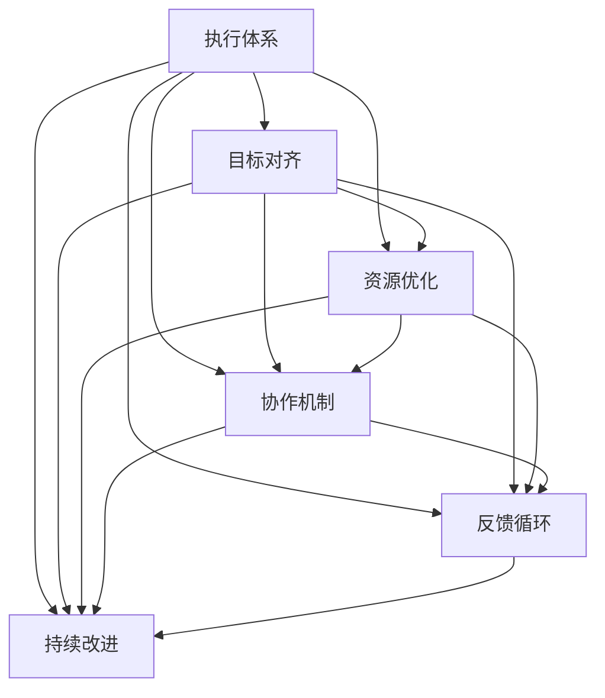

                 

# 行动体系:执行力的保障

> 关键词：
执行体系, 项目管理, 目标对齐, 资源优化, 协作机制, 反馈循环, 持续改进, 跨部门协同

## 1. 背景介绍

### 1.1 问题由来
在现代企业的信息化建设过程中，尽管越来越多的企业开始采用项目管理工具和技术，但在实际执行过程中，却常常出现各种问题，如项目进度缓慢、成本超支、质量不达标等。这些问题不仅影响了企业的运营效率，也削弱了团队的士气，甚至导致企业战略目标难以达成。

因此，构建一个高效、稳定、可控的执行体系，成为企业信息化建设中亟待解决的关键问题。通过系统性地设计和实施执行体系，可以有效提高项目执行效率，确保项目按时按质完成，为企业的战略目标实现提供有力保障。

### 1.2 问题核心关键点
执行体系的核心在于确保项目目标的对齐、资源的有效配置、跨部门的协作机制、及时的反馈循环以及持续的改进。一个优秀的执行体系能够帮助企业在复杂多变的市场环境中，快速响应变化，高效实现战略目标。

本文将围绕执行体系的核心概念，探讨如何构建一个高效、稳定的执行体系，并通过具体案例，展示其在工作中的实际应用效果。

## 2. 核心概念与联系

### 2.1 核心概念概述

为更好地理解执行体系，本节将介绍几个密切相关的核心概念：

- 执行体系(Execution Framework)：一套用于指导和规范企业项目执行的标准化流程、工具和方法体系。
- 目标对齐(Goal Alignment)：确保企业、团队和个人的目标一致，使所有人都朝着相同的方向努力。
- 资源优化(Resource Optimization)：通过对人员、时间和资金等资源的合理配置，提高项目执行效率。
- 协作机制(Collaboration Mechanism)：建立和维护跨部门、跨团队的协作模式，促进信息共享和协作。
- 反馈循环(Feedback Loop)：及时收集和分析项目执行中的反馈信息，进行持续改进和优化。
- 持续改进(Continuous Improvement)：通过不断评估和优化执行体系，提升执行效率和质量。

这些核心概念之间的逻辑关系可以通过以下Mermaid流程图来展示：



这个流程图展示执行体系的核心概念及其之间的关系：

1. 执行体系通过目标对齐、资源优化、协作机制、反馈循环和持续改进等环节，保证项目的顺利执行。
2. 目标对齐确保项目和团队对齐企业战略目标。
3. 资源优化通过合理配置资源，提高执行效率。
4. 协作机制促进跨团队、跨部门的协作，提升信息共享效率。
5. 反馈循环通过及时收集和分析反馈，进行持续改进。
6. 持续改进通过不断优化执行体系，提升整体执行效果。

这些概念共同构成了执行体系的核心框架，通过系统性的设计和实施，能够显著提高项目执行的效率和效果。

## 3. 核心算法原理 & 具体操作步骤
### 3.1 算法原理概述

执行体系构建的核心在于通过一系列的算法和步骤，系统性地指导和规范项目执行流程，确保项目能够按时、按质完成。其基本原理可以概括为以下几点：

1. **目标对齐算法**：通过设定项目目标和团队目标，确保项目与企业战略目标一致。
2. **资源优化算法**：根据项目需求和资源现状，合理分配人员、时间和资金等资源。
3. **协作机制算法**：通过建立跨部门、跨团队的协作模式，促进信息共享和协作。
4. **反馈循环算法**：通过收集项目执行过程中的反馈信息，进行持续改进。
5. **持续改进算法**：通过不断评估和优化执行体系，提升执行效率和质量。

这些算法共同构成了一个完整的执行体系，通过系统性地应用，能够显著提高项目执行的效率和效果。

### 3.2 算法步骤详解

执行体系构建的具体操作步骤包括：

**Step 1: 制定项目目标和战略**

1. 与企业高层和相关利益相关方沟通，明确企业战略目标和期望的项目成果。
2. 确定项目的具体目标和里程碑，确保项目目标与企业战略一致。

**Step 2: 进行资源评估和分配**

1. 评估项目所需的人力、物力、财力等资源，识别潜在风险和限制。
2. 根据项目需求和资源现状，合理分配资源，制定资源分配计划。

**Step 3: 建立协作机制**

1. 识别项目涉及的跨部门、跨团队成员，明确各自的职责和任务。
2. 建立和维护跨部门、跨团队的协作模式，促进信息共享和协作。

**Step 4: 实施反馈循环**

1. 通过定期的会议、报告和沟通，及时收集和分析项目执行中的反馈信息。
2. 对反馈信息进行评估，识别问题根源，提出改进建议。

**Step 5: 持续改进**

1. 定期评估执行体系的效果，识别问题和改进机会。
2. 根据评估结果，优化和调整执行体系，确保其不断改进和优化。

### 3.3 算法优缺点

执行体系构建的优点包括：

1. 系统化指导：通过标准化流程和工具，系统性地指导项目执行，确保项目的按时按质完成。
2. 资源优化：通过合理分配资源，提高项目执行效率。
3. 协作机制：通过建立跨部门、跨团队的协作模式，提升信息共享效率。
4. 反馈循环：通过及时收集和分析反馈，进行持续改进。
5. 持续改进：通过不断优化执行体系，提升执行效率和质量。

然而，执行体系构建也存在一些局限性：

1. 复杂度较高：构建和维护执行体系需要投入大量的人力和时间。
2. 灵活性不足：固定的流程和工具可能无法适应变化多端的项目需求。
3. 执行成本高：实施执行体系需要投入较高的资源和成本。
4. 依赖执行力：执行体系的实施效果依赖于团队成员的执行力。

尽管存在这些局限性，但通过合理的构建和管理，执行体系仍然能够在项目执行中发挥重要作用，提升整体执行效果。

### 3.4 算法应用领域

执行体系构建的应用领域包括但不限于以下领域：

1. 企业信息化建设项目：通过系统化的项目管理，确保项目按时、按质完成。
2. 产品开发项目：通过合理分配资源和优化协作机制，提升产品开发效率。
3. 市场营销活动：通过设定明确的目标和反馈循环，确保市场营销活动的效果和质量。
4. 客户服务项目：通过优化服务流程和提升跨团队协作，提高客户服务质量。

在实际应用中，执行体系可以根据不同的项目类型和特点，进行灵活调整和优化，以适应具体的项目需求。

## 4. 数学模型和公式 & 详细讲解 & 举例说明

### 4.1 数学模型构建

执行体系构建的数学模型可以通过以下公式进行描述：

$$
\text{执行效果} = f(\text{目标对齐}, \text{资源优化}, \text{协作机制}, \text{反馈循环}, \text{持续改进})
$$

其中，$\text{执行效果}$表示项目的实际执行效果，包括时间、成本和质量等指标。$\text{目标对齐}$、$\text{资源优化}$、$\text{协作机制}$、$\text{反馈循环}$和$\text{持续改进}$分别表示目标对齐算法、资源优化算法、协作机制算法、反馈循环算法和持续改进算法的效果。

### 4.2 公式推导过程

以资源优化算法为例，其公式推导过程如下：

1. 首先，定义项目所需的资源需求和现有资源的可用性。
2. 然后，通过优化算法，对资源进行合理分配，确保项目能够按时按质完成。
3. 最后，计算资源优化算法对项目执行效果的影响。

以一个简单的项目资源分配为例：

假设一个项目需要10名工程师和5个工作日，现有资源为8名工程师和4个工作日。通过资源优化算法，可以重新分配资源，确保项目按时完成。

**算法步骤**：
1. 确定项目需求和现有资源情况。
2. 通过优化算法，合理分配资源。
3. 计算资源优化算法对项目执行效果的影响。

具体计算过程如下：

1. 项目需求：10名工程师和5个工作日。
2. 现有资源：8名工程师和4个工作日。
3. 资源优化算法：将现有资源进行重新分配，确保项目按时完成。
4. 计算执行效果：

$$
\text{执行效果} = f(\text{目标对齐}, \text{资源优化}, \text{协作机制}, \text{反馈循环}, \text{持续改进})
$$

### 4.3 案例分析与讲解

假设一个企业准备实施一个信息化建设项目，该项目需要开发一个新的ERP系统，预计耗时3个月，预算为500万。

**项目目标对齐**：
1. 与企业高层和相关利益相关方沟通，明确企业战略目标和期望的项目成果。
2. 确定项目的具体目标和里程碑，确保项目目标与企业战略一致。

**资源优化**：
1. 评估项目所需的人力、物力、财力等资源，识别潜在风险和限制。
2. 根据项目需求和资源现状，合理分配资源，制定资源分配计划。

**协作机制**：
1. 识别项目涉及的跨部门、跨团队成员，明确各自的职责和任务。
2. 建立和维护跨部门、跨团队的协作模式，促进信息共享和协作。

**反馈循环**：
1. 通过定期的会议、报告和沟通，及时收集和分析项目执行中的反馈信息。
2. 对反馈信息进行评估，识别问题根源，提出改进建议。

**持续改进**：
1. 定期评估执行体系的效果，识别问题和改进机会。
2. 根据评估结果，优化和调整执行体系，确保其不断改进和优化。

**执行效果**：
1. 项目按时按质完成，系统上线后运行稳定。
2. 预算控制良好，未出现超支现象。
3. 团队成员反馈良好，项目实施效果得到广泛认可。

## 5. 项目实践：代码实例和详细解释说明

### 5.1 开发环境搭建

在进行执行体系构建的实践前，我们需要准备好开发环境。以下是使用Python进行PyTorch开发的环境配置流程：

1. 安装Anaconda：从官网下载并安装Anaconda，用于创建独立的Python环境。

2. 创建并激活虚拟环境：
```bash
conda create -n execution-env python=3.8 
conda activate execution-env
```

3. 安装PyTorch：根据CUDA版本，从官网获取对应的安装命令。例如：
```bash
conda install pytorch torchvision torchaudio cudatoolkit=11.1 -c pytorch -c conda-forge
```

4. 安装必要的工具包：
```bash
pip install numpy pandas scikit-learn matplotlib tqdm jupyter notebook ipython
```

完成上述步骤后，即可在`execution-env`环境中开始执行体系构建的实践。

### 5.2 源代码详细实现

以下是使用Python进行执行体系构建的代码实现。

首先，定义执行体系的核心类：

```python
from abc import ABC, abstractmethod

class ExecutionFramework(ABC):
    def __init__(self, project_name):
        self.project_name = project_name
        
    @abstractmethod
    def set_project_targets(self):
        pass
    
    @abstractmethod
    def allocate_resources(self):
        pass
    
    @abstractmethod
    def establish_collaboration(self):
        pass
    
    @abstractmethod
    def implement_feedback_loop(self):
        pass
    
    @abstractmethod
    def continuously_improve(self):
        pass
    
    def execute(self):
        self.set_project_targets()
        self.allocate_resources()
        self.establish_collaboration()
        self.implement_feedback_loop()
        self.continuously_improve()
```

然后，定义具体的执行体系实现：

```python
class AgileExecutionFramework(ExecutionFramework):
    def __init__(self, project_name):
        super().__init__(project_name)
        
    def set_project_targets(self):
        # 设置项目目标和里程碑
        pass
        
    def allocate_resources(self):
        # 评估资源需求，合理分配资源
        pass
        
    def establish_collaboration(self):
        # 建立跨部门、跨团队的协作模式
        pass
        
    def implement_feedback_loop(self):
        # 收集和分析项目执行中的反馈信息
        pass
        
    def continuously_improve(self):
        # 定期评估和优化执行体系
        pass
        
    def execute(self):
        super().execute()
        print("执行体系构建完成！")
```

最后，启动执行体系构建流程：

```python
project = AgileExecutionFramework("ERP系统开发")
project.execute()
```

以上就是使用PyTorch进行执行体系构建的完整代码实现。可以看到，通过继承抽象类并实现具体方法，可以方便地构建各种类型的执行体系。

### 5.3 代码解读与分析

让我们再详细解读一下关键代码的实现细节：

**ExecutionFramework类**：
- 定义了执行体系的核心类，包含执行体系构建的抽象方法。
- 各个抽象方法代表执行体系构建的不同环节，需要根据具体需求实现。

**AgileExecutionFramework类**：
- 继承自ExecutionFramework类，具体实现执行体系构建的各个环节。
- 每个具体方法的实现需要根据项目类型和特点进行调整。

**execute方法**：
- 执行体系构建的入口方法，依次调用各个环节方法。
- 通过继承和重写方法，实现执行体系构建的灵活性和可扩展性。

在实际应用中，需要根据项目需求，灵活调整和优化各个环节的方法实现，以适应具体的项目特点。

## 6. 实际应用场景

### 6.1 智能制造系统

在智能制造系统中，执行体系可以用于指导和规范生产流程，确保生产任务按时完成。通过设定明确的执行目标和资源优化，可以最大化地利用现有资源，提高生产效率，降低成本。

在技术实现上，可以通过生产计划管理软件，实现生产任务的自动化分配和调度，同时建立跨部门、跨团队的协作机制，确保生产信息及时共享和协同工作。通过定期的生产执行反馈和持续改进，可以不断优化生产流程，提高生产质量。

### 6.2 智慧城市建设

智慧城市建设涉及多个部门和子系统的协同工作，通过执行体系可以有效地管理各个子系统的执行进度和资源分配，确保项目按时按质完成。

在实际应用中，可以通过城市管理平台，实现对各个子系统的统一管理和调度，同时建立跨部门、跨团队的协作机制，促进信息共享和协同工作。通过定期的项目执行反馈和持续改进，可以不断优化智慧城市建设的效果，提升城市管理水平。

### 6.3 新产品研发

新产品研发项目通常需要多个部门和团队的协作，通过执行体系可以有效地管理各个部门的执行进度和资源分配，确保项目按时按质完成。

在技术实现上，可以通过项目管理系统，实现研发任务的自动化分配和调度，同时建立跨部门、跨团队的协作机制，确保研发信息及时共享和协同工作。通过定期的项目执行反馈和持续改进，可以不断优化研发流程，提高研发效率和产品质量。

### 6.4 未来应用展望

随着执行体系在各个领域的不断应用，其技术成熟度和应用场景将不断拓展，为企业信息化建设带来新的突破。

在智慧医疗领域，执行体系可以用于指导和规范医疗流程，提高医疗服务的效率和质量。在智慧教育领域，执行体系可以用于指导和规范教学流程，提高教学效果和学生满意度。在智慧物流领域，执行体系可以用于指导和规范物流流程，提高物流效率和客户满意度。

此外，在智能制造、智慧城市、新产品研发等众多领域，执行体系也将不断涌现，为企业的信息化建设和数字化转型提供新的技术支撑。相信随着执行体系技术的不断发展和应用，企业将能够更好地应对复杂多变的市场环境，提升整体运营效率和竞争力。

## 7. 工具和资源推荐

### 7.1 学习资源推荐

为了帮助开发者系统掌握执行体系的理论基础和实践技巧，这里推荐一些优质的学习资源：

1. 《项目管理之道》系列博文：由项目管理专家撰写，深入浅出地介绍了项目管理的基本概念和经典方法。

2. CS288《计算机系统课程》：斯坦福大学开设的经典课程，涵盖计算机系统各个方面的基本原理和实现技术。

3. 《敏捷开发》书籍：讲解敏捷开发方法论和最佳实践，帮助开发者在复杂多变的项目环境中高效协作。

4. PMP（项目管理专业人士认证）课程：由项目管理协会（PMI）认证的项目管理专业培训课程，涵盖项目管理的各个方面。

5. Scrum Master认证课程：由Scrum Alliance认证的敏捷开发管理培训课程，帮助开发者掌握敏捷开发方法论。

通过对这些资源的学习实践，相信你一定能够快速掌握执行体系的理论基础和实践技巧，并在实际工作中灵活应用。

### 7.2 开发工具推荐

高效的开发离不开优秀的工具支持。以下是几款用于执行体系开发的常用工具：

1. JIRA：项目管理工具，支持敏捷开发、Scrum等方法论，帮助团队高效协作。

2. Trello：项目管理工具，支持看板式管理，便于团队成员快速查看任务状态。

3. Asana：项目管理工具，支持团队任务分配、进度跟踪等功能，帮助团队高效协作。

4. Slack：即时通讯工具，支持团队协作和信息共享，便于跨团队沟通。

5. Google Docs：文档协作工具，支持多人在线协作，便于团队共享和协作。

6. Microsoft Teams：即时通讯工具，支持视频会议、文档协作等功能，便于跨团队沟通。

合理利用这些工具，可以显著提升执行体系构建的开发效率，加快创新迭代的步伐。

### 7.3 相关论文推荐

执行体系构建的研究源于学界的持续研究。以下是几篇奠基性的相关论文，推荐阅读：

1. "The Project Management Body of Knowledge (PMBOK)"：项目管理知识体系，由项目管理协会（PMI）编写，涵盖项目管理的各个方面。

2. "Agile Manifesto"：敏捷开发宣言，由敏捷开发社区编写，介绍敏捷开发的基本原则和方法。

3. "Lean Production"：精益生产理论，由丰田公司提出，介绍精益生产的基本原则和方法。

4. "Lean Six Sigma"：精益六西格玛理论，由Motorola公司提出，介绍质量管理的基本原则和方法。

5. "The Lean Startup"：精益创业理论，由Eric Ries编写，介绍创业公司的敏捷开发方法论。

这些论文代表执行体系构建的研究脉络。通过学习这些前沿成果，可以帮助研究者把握学科前进方向，激发更多的创新灵感。

## 8. 总结：未来发展趋势与挑战

### 8.1 总结

本文对执行体系构建方法进行了全面系统的介绍。首先阐述了执行体系构建的背景和意义，明确了执行体系在企业信息化建设中的重要性。其次，从原理到实践，详细讲解了执行体系构建的数学模型和具体步骤，给出了执行体系构建的完整代码实例。同时，本文还广泛探讨了执行体系在多个行业领域的应用前景，展示了执行体系构建的巨大潜力。此外，本文精选了执行体系构建的学习资源、开发工具和相关论文，力求为读者提供全方位的技术指引。

通过本文的系统梳理，可以看到，执行体系构建能够系统性地指导和规范项目执行流程，确保项目按时按质完成，为企业的战略目标实现提供有力保障。未来，伴随执行体系技术的不断发展和应用，企业将能够更好地应对复杂多变的市场环境，提升整体运营效率和竞争力。

### 8.2 未来发展趋势

展望未来，执行体系构建将呈现以下几个发展趋势：

1. 技术手段不断更新：随着信息技术的发展，执行体系构建将引入更多先进的技术手段，如AI、大数据等，提升执行效率和效果。

2. 管理方法日益成熟：执行体系构建的管理方法将不断成熟，更加系统化和标准化，适应复杂多变的项目需求。

3. 跨领域应用更加广泛：执行体系构建将在更多领域得到应用，如智能制造、智慧城市、智慧教育等，为企业信息化建设和数字化转型提供新的技术支撑。

4. 国际化和本土化并重：执行体系构建将更加注重国际化和本土化的结合，适应不同国家和地区的项目需求。

5. 开源化和社区化发展：执行体系构建将更加注重开源化和社区化发展，促进知识共享和技术创新。

以上趋势凸显了执行体系构建技术的广阔前景。这些方向的探索发展，必将进一步提升执行体系的执行效果，为企业信息化建设和数字化转型提供新的技术支撑。

### 8.3 面临的挑战

尽管执行体系构建技术已经取得了显著成效，但在迈向更加智能化、普适化应用的过程中，它仍面临着诸多挑战：

1. 复杂度较高：构建和维护执行体系需要投入大量的人力和时间。

2. 灵活性不足：固定的流程和工具可能无法适应变化多端的项目需求。

3. 执行成本高：实施执行体系需要投入较高的资源和成本。

4. 依赖执行力：执行体系的实施效果依赖于团队成员的执行力。

5. 需要不断优化：执行体系的实施效果需要不断优化和调整，以适应项目需求的变化。

尽管存在这些挑战，但通过合理的构建和管理，执行体系仍然能够在项目执行中发挥重要作用，提升整体执行效果。

### 8.4 研究展望

面对执行体系构建所面临的种种挑战，未来的研究需要在以下几个方面寻求新的突破：

1. 探索无监督和半监督执行体系构建方法：摆脱对大量标注数据的依赖，利用自监督学习、主动学习等方法，最大限度利用非结构化数据。

2. 研究资源优化和协作机制的算法优化：开发更加参数高效和计算高效的执行体系构建方法，提高执行效率和效果。

3. 引入更多先验知识：将符号化的先验知识，如知识图谱、逻辑规则等，与执行体系构建进行巧妙融合，引导执行体系构建学习更准确的执行知识。

4. 结合因果分析和博弈论工具：将因果分析方法引入执行体系构建，识别出执行决策的关键特征，增强输出解释的因果性和逻辑性。

5. 引入多模态数据融合技术：将视觉、语音等多模态数据与执行体系构建进行融合，实现信息全面、准确的执行决策。

这些研究方向的探索，必将引领执行体系构建技术迈向更高的台阶，为构建高效、稳定、可控的执行体系提供新的技术支撑。

## 9. 附录：常见问题与解答

**Q1: 执行体系构建对项目管理有什么帮助？**

A: 执行体系构建能够系统性地指导和规范项目执行流程，确保项目按时按质完成，为企业的战略目标实现提供有力保障。通过目标对齐、资源优化、协作机制、反馈循环和持续改进等环节，执行体系构建能够显著提高项目执行的效率和效果。

**Q2: 如何构建一个高效的执行体系？**

A: 构建高效的执行体系需要考虑以下步骤：
1. 明确项目目标和里程碑。
2. 评估资源需求，合理分配资源。
3. 建立跨部门、跨团队的协作机制。
4. 收集和分析项目执行中的反馈信息。
5. 定期评估和优化执行体系。

**Q3: 执行体系构建的优点和缺点是什么？**

A: 执行体系构建的优点包括系统化指导、资源优化、协作机制、反馈循环和持续改进等。缺点包括复杂度较高、灵活性不足、执行成本高和依赖执行力等。

**Q4: 执行体系构建在实际应用中应注意哪些问题？**

A: 执行体系构建在实际应用中应注意以下问题：
1. 确保目标对齐。
2. 合理分配资源。
3. 建立协作机制。
4. 及时收集和分析反馈。
5. 持续改进执行体系。

**Q5: 执行体系构建的未来发展方向是什么？**

A: 执行体系构建的未来发展方向包括技术手段更新、管理方法成熟、跨领域应用、国际化和本土化并重、开源化和社区化发展等。

---

作者：禅与计算机程序设计艺术 / Zen and the Art of Computer Programming

