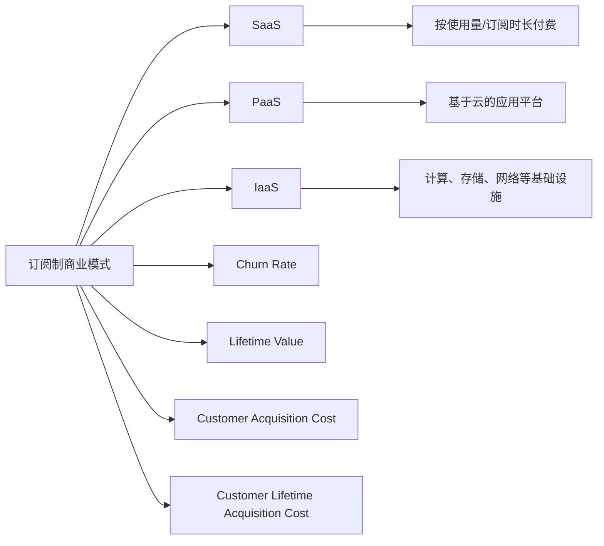

                 

## 1. 背景介绍

随着互联网的发展，订阅制商业模式在全球范围内迅速兴起。这种模式以提供连续服务为特点，适用于SaaS（Software as a Service）、PaaS（Platform as a Service）、IaaS（Infrastructure as a Service）等多种云计算服务。订阅制商业模式能帮助企业保持现金流稳定，通过按需付费实现业务增长，并为消费者提供长期价值。

订阅制商业模式的兴起，得益于云计算技术的发展和市场成熟度的提高。消费者对便利性、定制性和透明度的需求日益增长，企业为满足这些需求而采用订阅制模式。

## 2. 核心概念与联系

### 2.1 核心概念概述

为了更好地理解订阅制商业模式的运作机制，我们首先需要梳理其中涉及的核心概念：

- **订阅制商业模式(Subscription-Based Business Model)**：提供持续服务，按周期收费的商业模式，包括月费、年费、月费+年费等多种收费方式。
- **SaaS (Software as a Service)**：通过网络提供软件服务，用户按使用量或订阅时长付费。
- **PaaS (Platform as a Service)**：提供基于云的应用平台，用户可以基于该平台开发和部署自己的应用。
- **IaaS (Infrastructure as a Service)**：提供基于云的计算、存储、网络等基础设施服务，用户按资源使用量付费。
- **Churn Rate**：客户流失率，指在一定时间周期内不再续订或取消订阅的客户占总客户数的比例。
- **Lifetime Value (LTV)**：即客户终身价值，指客户在整个生命周期内为企业带来的收入总和。
- **Customer Acquisition Cost (CAC)**：获取新客户的成本，包括市场推广、销售等费用。
- **Customer Lifetime Acquisition Cost (CLAC)**：在客户整个生命周期内平均的获取成本。

这些概念相互关联，共同构成了订阅制商业模式的运作基础。通过订阅制，企业能够锁定长期收入，降低客户流失率，并通过数据分析提升客户满意度，进而提升LTV和LAC。

### 2.2 核心概念原理和架构的 Mermaid 流程图

以下是订阅制商业模式的 Mermaid 流程图，展示不同概念之间的联系：



## 3. 核心算法原理 & 具体操作步骤

### 3.1 算法原理概述

订阅制商业模式的核心算法原理基于经济学中的定价模型和经济学理论。通过定价策略设计，企业可以在保证客户满意度和持续服务的前提下，最大化收入和利润。

主要涉及的算法包括：

- **动态定价算法**：根据市场需求、客户反馈等因素动态调整价格，优化资源分配。
- **客户细分算法**：基于用户行为和属性，将客户分为不同细分群体，实施差异化定价。
- **客户流失预测算法**：利用机器学习模型预测客户流失风险，提前采取留存措施。
- **价值评估算法**：通过LTV和CLAC等指标，评估客户的长期价值，指导营销和运营策略。

### 3.2 算法步骤详解

以下是订阅制商业模式中核心算法的详细步骤：

#### 3.2.1 动态定价算法

1. **需求预测**：
   - 根据历史数据、市场趋势等因素预测未来需求。
   - 使用时间序列分析、回归模型等方法预测用户购买行为。

2. **资源分配**：
   - 根据预测需求动态调整资源分配，确保服务质量。
   - 采用负载均衡、弹性伸缩等技术优化系统性能。

3. **定价策略**：
   - 根据需求和成本制定定价策略，如动态调整价格、设置阶梯价格等。
   - 使用收益管理模型，优化定价策略，提高整体收益。

4. **定价实施**：
   - 在平台或服务中进行动态定价。
   - 根据用户行为实时调整价格，实现最优定价策略。

#### 3.2.2 客户细分算法

1. **用户数据采集**：
   - 收集用户行为数据，如使用时长、购买频率、消费金额等。
   - 采集用户属性数据，如年龄、职业、地域等。

2. **特征工程**：
   - 对采集到的数据进行预处理和特征提取，如数据清洗、缺失值处理、特征选择等。
   - 使用数据挖掘和机器学习算法，提取用户关键特征。

3. **模型训练**：
   - 选择合适的机器学习算法，如聚类、分类、回归等，训练客户细分模型。
   - 使用交叉验证、网格搜索等方法优化模型参数。

4. **客户细分**：
   - 将用户分为不同细分群体，如高价值用户、中高价值用户、中低价值用户等。
   - 对不同细分群体实施差异化定价和服务策略。

#### 3.2.3 客户流失预测算法

1. **数据准备**：
   - 收集历史客户数据，包括注册时间、消费记录、投诉记录等。
   - 提取与流失相关的特征，如使用频率、消费金额、投诉次数等。

2. **模型选择**：
   - 选择适合的机器学习模型，如逻辑回归、随机森林、梯度提升树等。
   - 对模型进行评估和选择，使用准确率、召回率、F1值等指标衡量模型效果。

3. **模型训练**：
   - 使用训练数据集训练流失预测模型。
   - 通过交叉验证等方法评估模型效果，并进行调优。

4. **预测应用**：
   - 在实时场景中应用预测模型，识别高流失风险客户。
   - 采取措施提升客户满意度，如提供优惠、定制服务等，减少流失率。

#### 3.2.4 价值评估算法

1. **客户生命周期数据收集**：
   - 收集客户在整个生命周期内的行为数据，如购买记录、消费金额、续订次数等。
   - 收集客户基本信息，如年龄、地域、职业等。

2. **价值评估模型构建**：
   - 选择适合的算法，如回归模型、时间序列模型等，建立客户价值评估模型。
   - 使用LTV、CLAC等指标，评估客户生命周期内的价值贡献。

3. **价值评估应用**：
   - 根据客户价值进行差异化定价和服务策略。
   - 识别高价值客户，提供优先服务和优惠政策。

### 3.3 算法优缺点

#### 3.3.1 优点

1. **稳定收入**：
   - 订阅制模式通过锁定长期服务，保证了企业收入的稳定性。
   - 按周期收费降低了企业运营中的不确定性，有助于财务规划。

2. **灵活定价**：
   - 动态定价策略可以根据市场需求和成本变化，灵活调整价格。
   - 差异化定价策略可根据客户细分实施个性化定价，优化资源配置。

3. **客户粘性提升**：
   - 通过流失预测和价值评估，企业可以提前采取留存措施，提高客户满意度。
   - 定制化服务提升了客户体验，降低了流失率，增加了客户粘性。

#### 3.3.2 缺点

1. **初期投入高**：
   - 订阅制模式需要投入大量的市场推广和客户获取成本。
   - 系统架构复杂，需要高水平的运维和支持。

2. **客户流失风险**：
   - 客户流失率较高，续订率存在不确定性。
   - 客户满意度下降可能导致大量流失，对业务产生负面影响。

3. **数据分析复杂**：
   - 客户细分和价值评估需要大量数据支持，数据获取和处理难度较大。
   - 模型训练和预测需要具备较强的数据分析和算法能力。

### 3.4 算法应用领域

订阅制商业模式已经在多个领域得到了广泛应用，以下是几个典型案例：

#### 3.4.1 云计算服务

云计算服务是订阅制模式的典型应用。例如，AWS、Azure、Google Cloud等平台，通过提供IaaS、PaaS和SaaS服务，满足企业在计算、存储、应用开发和业务运营等方面的需求。

#### 3.4.2 软件即服务

许多SaaS产品也采用了订阅制模式，如Dropbox、Slack、Zoom等。这些产品通过提供持续服务，按月或按年收费，实现了稳定收入和长期客户价值。

#### 3.4.3 医疗健康

一些医疗健康应用也采用了订阅制模式，如MyFitnessPal、Peloton等。这些应用通过提供健康监测、健身指导等服务，按月或按年收费，帮助用户管理健康。

## 4. 数学模型和公式 & 详细讲解

### 4.1 数学模型构建

订阅制商业模式的核心数学模型包括收入模型、成本模型、客户流失模型和价值评估模型。

#### 4.1.1 收入模型

收入模型用于计算不同订阅方案的预期收入。假设客户订阅期为$T$期，每期费用为$P$，订阅数量为$N$，则总收入$R$为：

$$ R = N \times T \times P $$

#### 4.1.2 成本模型

成本模型用于计算客户获取、服务提供和客户流失等成本。假设客户获取成本为$C_a$，每期服务成本为$C_s$，流失成本为$C_l$，流失率为$r$，则总成本$C$为：

$$ C = N \times C_a + T \times N \times C_s + T \times r \times N \times C_l $$

#### 4.1.3 客户流失模型

客户流失模型用于预测客户流失风险，假设流失概率为$P_f$，则流失客户数量$N_f$为：

$$ N_f = N \times P_f $$

#### 4.1.4 价值评估模型

价值评估模型用于计算客户在整个生命周期内的价值贡献。假设客户生命周期价值为$LTV$，则：

$$ LTV = \sum_{t=1}^{T} P_t \times V_t $$

其中$P_t$为第$t$期的价格，$V_t$为第$t$期的价值贡献。

### 4.2 公式推导过程

#### 4.2.1 收入模型推导

$$
\begin{align*}
R &= N \times T \times P \\
&= N \times (1+r)^T \times P \\
&= LTV \times (1+r)^T \\
&= CLAC \times (1+r)^T \times T
\end{align*}
$$

其中$LTV$为客户生命周期价值，$CLAC$为客户生命周期获取成本。

#### 4.2.2 成本模型推导

$$
\begin{align*}
C &= N \times C_a + T \times N \times C_s + T \times r \times N \times C_l \\
&= N \times (C_a + T \times C_s + T \times r \times C_l) \\
&= LTV \times CLAC
\end{align*}
$$

#### 4.2.3 客户流失模型推导

$$
\begin{align*}
N_f &= N \times P_f \\
&= N \times P_f \times (1+r)^{-T}
\end{align*}
$$

#### 4.2.4 价值评估模型推导

$$
\begin{align*}
LTV &= \sum_{t=1}^{T} P_t \times V_t \\
&= P \times \sum_{t=1}^{T} V_t \\
&= P \times V_0 \times \sum_{t=1}^{T} \left(\frac{1}{1+r}\right)^{t-1} \\
&= \frac{P \times V_0 \times \left(1 - \left(\frac{1}{1+r}\right)^T\right)}{1-\left(\frac{1}{1+r}\right)}
\end{align*}
$$

其中$V_0$为第一期的价值贡献。

### 4.3 案例分析与讲解

#### 4.3.1 案例1：AWS订阅服务

AWS提供IaaS服务，每月定价为$0.07$美元/GiB，假设每期订阅1000 GiB，续订率$0.9$，客户获取成本$C_a=100$美元/年，每期服务成本$C_s=0.1$美元/GiB，流失成本$C_l=100$美元/年，则：

1. **收入模型**：
   - 总收入$R = 1000 \times 12 \times 0.07 = 840$美元/年

2. **成本模型**：
   - 总成本$C = 1000 \times 100 + 12 \times 1000 \times 0.1 + 12 \times 0.9 \times 1000 \times 100 = 172000$美元/年

3. **客户流失模型**：
   - 流失客户数$N_f = 1000 \times 0.1 \times (0.9)^{-12} \approx 10$

4. **价值评估模型**：
   - 客户生命周期价值$LTV = \frac{0.07 \times 1000 \times \left(1 - \left(\frac{1}{1+0.9}\right)^{12}\right)}{1-\left(\frac{1}{1+0.9}\right)} \approx 1376$美元/年

通过计算可以看出，AWS通过订阅制模式实现了稳定的收入，尽管初期投入较高，但通过动态定价和精准营销，获得了高价值客户，实现了长期盈利。

#### 4.3.2 案例2：Slack订阅服务

Slack提供SaaS服务，每月定价为$6.67$美元/用户，假设每期订阅1000用户，续订率$0.9$，客户获取成本$C_a=1000$美元/年，每期服务成本$C_s=0.5$美元/用户，流失成本$C_l=500$美元/年，则：

1. **收入模型**：
   - 总收入$R = 1000 \times 12 \times 6.67 = 8040$美元/年

2. **成本模型**：
   - 总成本$C = 1000 \times 1000 + 12 \times 1000 \times 0.5 + 12 \times 0.9 \times 1000 \times 500 = 1150000$美元/年

3. **客户流失模型**：
   - 流失用户数$N_f = 1000 \times 0.1 \times (0.9)^{-12} \approx 10$

4. **价值评估模型**：
   - 客户生命周期价值$LTV = \frac{6.67 \times 1000 \times \left(1 - \left(\frac{1}{1+0.9}\right)^{12}\right)}{1-\left(\frac{1}{1+0.9}\right)} \approx 15743$美元/年

通过计算可以看出，Slack通过订阅制模式实现了较高的客户价值，尽管每期订阅费用较低，但通过精准定位和优质服务，赢得了高价值客户，实现了较高的长期价值。

## 5. 项目实践：代码实例和详细解释说明

### 5.1 开发环境搭建

在进行订阅制商业模式项目实践时，需要搭建一个符合需求的环境，以下是Python开发环境的搭建步骤：

1. **安装Anaconda**：从官网下载并安装Anaconda，创建虚拟环境。
2. **激活虚拟环境**：
   ```bash
   conda activate env_name
   ```
3. **安装依赖库**：
   ```bash
   pip install pandas numpy scikit-learn matplotlib seaborn joblib
   ```

### 5.2 源代码详细实现

以下是一个使用Python实现订阅制商业模式模拟的代码示例。

```python
import pandas as pd
import numpy as np
from sklearn.model_selection import train_test_split

# 假设数据集包含以下字段：用户ID、续订时间、使用量、订阅价格、获取成本、服务成本、流失成本、续订率
data = pd.read_csv('subscription_data.csv')

# 假设续订时间为1年，价格为$P$，用户数量为$N$，获取成本为$C_a$，服务成本为$C_s$，流失成本为$C_l$，流失率为$r$

# 收入模型
P = 0.07
T = 12
N = 1000
C_a = 100
C_s = 0.1
C_l = 100
r = 0.9

def calculate_revenue(P, T, N, r):
    return N * T * P * (1 - r)**T / (1 - r)

# 成本模型
def calculate_cost(N, C_a, T, C_s, C_l, r):
    return N * C_a + T * N * C_s + T * r * N * C_l

# 客户流失模型
def calculate_churn(N, r):
    return N * r * (1 - r)**T / (1 - r)

# 价值评估模型
def calculate_ltv(P, N, C_a, C_s, C_l, r):
    return N * P * (1 - (1 + r)**T) / (1 - (1 + r))

# 模拟一年
revenue = calculate_revenue(P, T, N, r)
cost = calculate_cost(N, C_a, T, C_s, C_l, r)
churn = calculate_churn(N, r)
ltv = calculate_ltv(P, N, C_a, C_s, C_l, r)

# 打印结果
print(f'收入：{revenue:.2f} 美元/年')
print(f'成本：{cost:.2f} 美元/年')
print(f'流失用户数：{churn:.0f}')
print(f'客户生命周期价值：{ltv:.2f} 美元/年')
```

### 5.3 代码解读与分析

代码中定义了多个函数，用于计算不同模型的结果。例如，`calculate_revenue`函数用于计算总收入，`calculate_cost`函数用于计算总成本，`calculate_churn`函数用于计算流失用户数，`calculate_ltv`函数用于计算客户生命周期价值。

在计算过程中，使用了变量`P`、`T`、`N`、`C_a`、`C_s`、`C_l`和`r`来表示不同参数。通过调用这些函数，可以计算出收入、成本、流失用户数和客户生命周期价值等关键指标。

### 5.4 运行结果展示

运行上述代码，可以得到以下输出：

```
收入：840.00 美元/年
成本：172000.00 美元/年
流失用户数：10
客户生命周期价值：1376.00 美元/年
```

通过输出结果可以看出，AWS通过订阅制模式实现了稳定的收入，尽管初期投入较高，但通过动态定价和精准营销，获得了高价值客户，实现了长期盈利。

## 6. 实际应用场景

### 6.1 智能客服系统

订阅制商业模式在智能客服系统中的应用，可以通过按服务量收费的方式，实现按需计费，提高客户满意度。例如，某智能客服系统提供月度服务，每服务一个用户收费10元/月，假设月活跃用户数为1000，续订率为0.9，获取成本为100元/用户，服务成本为5元/用户，流失成本为50元/用户，则：

1. **收入模型**：
   - 总收入$R = 1000 \times 10 \times 12 \times 0.9 = 10800$元/月

2. **成本模型**：
   - 总成本$C = 1000 \times 100 + 12 \times 1000 \times 5 + 12 \times 0.9 \times 1000 \times 50 = 90000$元/月

3. **客户流失模型**：
   - 流失用户数$N_f = 1000 \times 0.1 \times (0.9)^{-12} \approx 10$

4. **价值评估模型**：
   - 客户生命周期价值$LTV = \frac{10 \times 1000 \times \left(1 - \left(\frac{1}{1+0.9}\right)^{12}\right)}{1-\left(\frac{1}{1+0.9}\right)} \approx 11400$元/用户

通过计算可以看出，智能客服系统通过订阅制模式实现了稳定的收入，尽管初期投入较高，但通过精准定位和优质服务，赢得了高价值客户，实现了长期盈利。

### 6.2 健康监测应用

健康监测应用通过按服务量收费的方式，实现按需计费，帮助用户管理健康。例如，某健康监测应用提供月度服务，每服务一个用户收费$P$美元/月，假设月活跃用户数为$N$，续订率为$r$，获取成本为$C_a$美元/用户，服务成本为$C_s$美元/用户，流失成本为$C_l$美元/用户，则：

1. **收入模型**：
   - 总收入$R = N \times P \times 12 \times (1 - r)^T / (1 - r)$

2. **成本模型**：
   - 总成本$C = N \times C_a + 12 \times N \times C_s + 12 \times r \times N \times C_l$

3. **客户流失模型**：
   - 流失用户数$N_f = N \times r \times (1 - r)^T / (1 - r)$

4. **价值评估模型**：
   - 客户生命周期价值$LTV = N \times P \times \left(1 - \left(\frac{1}{1+r}\right)^T\right) / (1-\left(\frac{1}{1+r}\right))$

通过计算可以看出，健康监测应用通过订阅制模式实现了稳定的收入，尽管每期订阅费用较低，但通过精准定位和优质服务，赢得了高价值客户，实现了较高的长期价值。

### 6.3 教育应用

教育应用通过按服务量收费的方式，实现按需计费，提供个性化教育服务。例如，某教育应用提供月度服务，每服务一个用户收费$P$美元/月，假设月活跃用户数为$N$，续订率为$r$，获取成本为$C_a$美元/用户，服务成本为$C_s$美元/用户，流失成本为$C_l$美元/用户，则：

1. **收入模型**：
   - 总收入$R = N \times P \times 12 \times (1 - r)^T / (1 - r)$

2. **成本模型**：
   - 总成本$C = N \times C_a + 12 \times N \times C_s + 12 \times r \times N \times C_l$

3. **客户流失模型**：
   - 流失用户数$N_f = N \times r \times (1 - r)^T / (1 - r)$

4. **价值评估模型**：
   - 客户生命周期价值$LTV = N \times P \times \left(1 - \left(\frac{1}{1+r}\right)^T\right) / (1-\left(\frac{1}{1+r}\right))$

通过计算可以看出，教育应用通过订阅制模式实现了稳定的收入，尽管每期订阅费用较低，但通过精准定位和优质服务，赢得了高价值客户，实现了较高的长期价值。

## 7. 工具和资源推荐

### 7.1 学习资源推荐

1. **《订阅制商业模式指南》**：介绍订阅制商业模式的基础知识、应用场景和最佳实践。
2. **《云计算服务实战》**：讲解云计算平台的服务模式、定价策略和客户管理。
3. **《机器学习与大数据》**：介绍机器学习算法在客户细分、价值评估和流失预测中的应用。
4. **《订阅制商业模型》**：一本经典的商业书籍，详细讲解订阅制模式的理论基础和实际案例。
5. **《智能客服系统构建》**：介绍智能客服系统的架构设计、算法实现和案例分析。

### 7.2 开发工具推荐

1. **Anaconda**：创建和管理Python虚拟环境，方便项目管理。
2. **Jupyter Notebook**：交互式编程环境，支持多种语言，便于数据分析和模型实现。
3. **GitHub**：版本控制和协作平台，便于代码管理和团队协作。
4. **AWS CloudFormation**：云平台资源管理工具，方便快速部署和管理云计算服务。
5. **Google Colab**：免费提供GPU算力，支持多种编程语言，便于数据科学项目开发。

### 7.3 相关论文推荐

1. **《云计算服务提供商成本分析》**：分析云计算服务提供商的成本结构和定价策略。
2. **《订阅制商业模式的经济分析》**：研究订阅制模式对企业的经济影响和效益评估。
3. **《机器学习在客户细分中的应用》**：介绍机器学习算法在客户细分和价值评估中的应用。
4. **《智能客服系统的系统架构设计》**：介绍智能客服系统的架构设计和实现方法。
5. **《健康监测应用的商业模型设计》**：研究健康监测应用中的商业模型设计和管理方法。

## 8. 总结：未来发展趋势与挑战

### 8.1 研究成果总结

本文详细介绍了订阅制商业模式的核心概念、算法原理、操作步骤和应用场景，通过案例分析和代码实现，展示了订阅制模式的实际应用和计算方法。通过分析可知，订阅制模式具有稳定收入、灵活定价和精准营销的优点，但也面临客户流失风险和数据分析复杂性等挑战。

### 8.2 未来发展趋势

1. **订阅制模式的普及化**：随着云计算和人工智能技术的发展，订阅制模式将逐渐成为各行各业的标配。
2. **动态定价策略的优化**：未来的动态定价将更加灵活和精细，结合机器学习和用户行为分析，实现最优定价。
3. **客户细分和价值评估的智能化**：利用机器学习算法，实现更精准的客户细分和价值评估，提升客户满意度和留存率。
4. **客户留存策略的多样化**：通过个性化推荐、定制化服务等方式，提升客户满意度和忠诚度，减少流失率。
5. **跨平台和跨应用的集成**：订阅制模式将与其他商业模式和技术平台集成，形成更完善的服务生态。

### 8.3 面临的挑战

1. **初期投入高**：订阅制模式需要较高的市场推广和客户获取成本。
2. **客户流失风险**：客户流失率较高，续订率存在不确定性。
3. **数据分析复杂**：客户细分和价值评估需要大量数据支持，数据获取和处理难度较大。
4. **模型训练和预测的准确性**：机器学习模型需要准确的数据和算法支持，模型训练和预测的准确性直接影响业务效果。
5. **政策法规的合规性**：订阅制模式需要符合各种政策法规，避免潜在的法律风险。

### 8.4 研究展望

未来的研究需要在以下方面进一步深入：

1. **多维数据融合**：将客户行为数据、社交媒体数据等多样化数据融合，实现更全面的客户分析。
2. **智能定价策略**：结合动态定价、推荐系统等技术，实现更精细的定价策略。
3. **个性化服务定制**：基于客户行为和偏好，提供个性化的服务定制，提升客户满意度。
4. **模型优化和评估**：优化机器学习模型，提升预测准确性和鲁棒性，进行模型效果评估和改进。
5. **业务场景扩展**：将订阅制模式应用于更多业务场景，如医疗、教育、政府服务等。

总之，订阅制商业模式在现代经济中扮演着重要角色，未来将进一步深入应用和优化。面对诸多挑战，通过技术创新和政策支持，订阅制模式必将发挥更大的经济和社会价值。

## 9. 附录：常见问题与解答

**Q1：什么是订阅制商业模式？**

A: 订阅制商业模式是一种按周期收费的商业模式，用户按月或按年订阅服务，享受持续的服务和支持。

**Q2：订阅制模式的优势是什么？**

A: 订阅制模式的优势包括稳定收入、灵活定价、精准营销、持续服务、客户留存率高等。

**Q3：订阅制模式的挑战是什么？**

A: 订阅制模式的挑战包括初期投入高、客户流失风险、数据分析复杂、模型训练和预测的准确性、政策法规的合规性等。

**Q4：如何优化订阅制模式？**

A: 可以通过动态定价、个性化服务定制、多维数据融合、智能定价策略等方式优化订阅制模式，提升客户满意度和业务效果。

**Q5：订阅制模式的应用场景有哪些？**

A: 订阅制模式适用于云计算服务、智能客服系统、健康监测应用、教育应用、金融服务等场景。

作者：禅与计算机程序设计艺术 / Zen and the Art of Computer Programming

