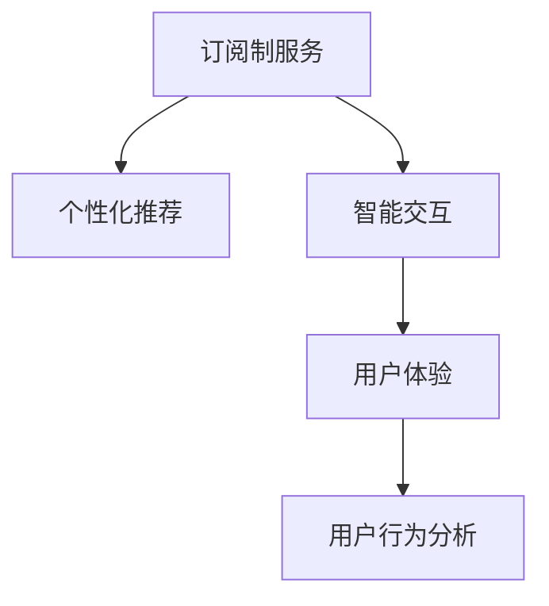

                 

# 订阅制服务的用户体验优化:个性化推荐和智能交互

> 关键词：订阅制服务，个性化推荐，智能交互，用户体验，用户行为分析

## 1. 背景介绍

在数字化和网络化的浪潮下，订阅制服务模式已成为众多互联网公司和传统行业转型升级的重要方向。典型的订阅制服务包括视频流媒体、在线教育、音乐、新闻等内容。这种模式以其灵活、便捷、沉浸式等特性，给用户带来独特的价值和体验。

然而，如何通过技术手段提升订阅制服务的用户体验，使更多用户愿意订阅并长期使用，成为了服务提供商需要重点关注的问题。近年来，个性化推荐和智能交互技术的发展，为订阅制服务带来了新的突破，成为提升用户体验的关键手段。

本文将系统介绍如何通过个性化推荐和智能交互技术优化订阅制服务用户体验，涵盖核心算法原理、具体操作步骤、数学模型、项目实践、实际应用场景、学习资源和工具推荐等方面。

## 2. 核心概念与联系

### 2.1 核心概念概述

为了更好地理解个性化推荐和智能交互技术，本节将介绍几个密切相关的核心概念：

- **订阅制服务(Subscription-based Services)**：指用户定期支付费用，获取持续访问某类服务的模式。如Netflix、Spotify等，为用户提供丰富的内容资源。
- **个性化推荐(Personalized Recommendation)**：指根据用户历史行为和偏好，推荐符合用户兴趣的内容。
- **智能交互(Intelligent Interaction)**：指通过AI技术，提升人机交互的智能性和自然性，实现更高效、更便捷的交流体验。
- **用户体验(User Experience, UX)**：指用户在使用服务过程中的感受和体验，涵盖可用性、满意度、情感等维度。
- **用户行为分析(User Behavior Analysis)**：指通过数据分析手段，了解用户行为模式，提升服务质量。

这些核心概念之间的关系如下图所示：



通过这些概念的协同作用，订阅制服务可以更好地满足用户需求，提升整体体验。

## 3. 核心算法原理 & 具体操作步骤
### 3.1 算法原理概述

个性化推荐和智能交互的核心算法，主要包括协同过滤、内容推荐、模型训练、自然语言处理等技术。其核心思想是：

1. **协同过滤(Collaborative Filtering)**：通过分析用户之间的相似度，找到相似用户的偏好，推断出用户可能感兴趣的内容。
2. **内容推荐(Content-Based Recommendation)**：基于内容的特征，推荐与用户历史行为相似的内容。
3. **模型训练(Model Training)**：使用机器学习模型预测用户行为，优化推荐系统。
4. **自然语言处理(Natural Language Processing, NLP)**：实现智能交互，提升人机交流的自然性和智能化。

这些算法通过数学模型进行建模，使用具体的公式和算法步骤来实现。

### 3.2 算法步骤详解

以基于协同过滤的个性化推荐为例，步骤如下：

**Step 1: 数据收集**
- 收集用户行为数据，如浏览历史、评分记录等。
- 构建用户-物品二元关系矩阵 $\mathbf{U}$，其中 $U_{i,j}$ 表示用户 $i$ 对物品 $j$ 的评分。

**Step 2: 相似度计算**
- 计算用户 $i$ 和用户 $j$ 的相似度 $s_{i,j}$，通常使用余弦相似度：
$$
s_{i,j} = \frac{\mathbf{U}_i \cdot \mathbf{U}_j}{||\mathbf{U}_i|| ||\mathbf{U}_j||}
$$
- 相似度矩阵 $\mathbf{S}$ 表示用户之间的相似度。

**Step 3: 推荐生成**
- 计算物品 $j$ 的预测评分 $\hat{U}_{i,j}$，使用加权平均公式：
$$
\hat{U}_{i,j} = \sum_{k=1}^{N} s_{i,k} U_{k,j}
$$
- 对预测评分进行排序，推荐前 $K$ 个物品。

**Step 4: 模型评估**
- 使用AUC、RMSE等指标评估推荐效果。
- 根据评估结果调整模型参数，如学习率、正则化强度等。

通过以上步骤，可以构建一个基本的个性化推荐系统，为用户推荐其感兴趣的内容。

### 3.3 算法优缺点

个性化推荐和智能交互技术的优点在于：
1. 提升用户满意度：通过精准推荐，提升用户体验，增强用户粘性。
2. 提高运营效率：减少用户筛选时间和成本，提高服务响应速度。
3. 挖掘用户需求：通过数据分析，发现用户隐式需求，拓展服务范围。

缺点包括：
1. 数据质量要求高：推荐效果依赖大量高质量用户行为数据。
2. 模型复杂度较高：需要复杂算法和大量参数调优。
3. 隐私保护问题：用户数据收集和分析可能引发隐私风险。
4. 推荐一致性问题：个性化推荐容易导致推荐结果一致性不足。

## 4. 数学模型和公式 & 详细讲解
### 4.1 数学模型构建

个性化推荐和智能交互的数学模型，通常基于矩阵分解、协同过滤、深度学习等技术。以协同过滤为例，用户-物品关系矩阵 $\mathbf{U}$ 可以表示为：

$$
\mathbf{U} = \mathbf{U}^* + \mathbf{E}
$$

其中 $\mathbf{U}^*$ 为真实用户-物品关系矩阵，$\mathbf{E}$ 为误差矩阵。通过分解 $\mathbf{U}$，可以找到用户和物品的潜在特征，进而预测用户评分。

### 4.2 公式推导过程

以基于矩阵分解的协同过滤为例，假设 $\mathbf{U}^*$ 可以分解为 $\mathbf{P}$ 和 $\mathbf{Q}$ 的乘积，即：

$$
\mathbf{U}^* = \mathbf{P} \mathbf{Q}^T
$$

其中 $\mathbf{P}$ 为 $M \times K$ 的矩阵，$\mathbf{Q}$ 为 $K \times N$ 的矩阵，$K$ 为潜在特征维度。

通过求解 $\mathbf{P}$ 和 $\mathbf{Q}$，可以得到用户的潜在特征 $\mathbf{p}_i$ 和物品的潜在特征 $\mathbf{q}_j$。用户 $i$ 对物品 $j$ 的评分预测为：

$$
\hat{U}_{i,j} = \mathbf{p}_i \cdot \mathbf{q}_j
$$

通过最小化损失函数 $\mathcal{L}$，可以更新 $\mathbf{P}$ 和 $\mathbf{Q}$：

$$
\mathcal{L} = \frac{1}{2} \|\mathbf{U} - \mathbf{P} \mathbf{Q}^T\|_F^2 + \lambda \|\mathbf{P}\|_F^2 + \lambda \|\mathbf{Q}\|_F^2
$$

其中 $\|\cdot\|_F$ 为矩阵的 Frobenius 范数，$\lambda$ 为正则化系数。

### 4.3 案例分析与讲解

以Netflix推荐系统为例，Netflix通过收集用户历史观看行为，使用协同过滤算法，为用户推荐其可能感兴趣的影视作品。Netflix将用户行为数据分解为多个维度，使用矩阵分解方法，找到用户和物品的潜在特征，实现高精度的推荐。Netflix的推荐系统已经能够精准预测用户的偏好，极大地提升了用户满意度。

## 5. 项目实践：代码实例和详细解释说明
### 5.1 开发环境搭建

要进行个性化推荐和智能交互的项目实践，需要搭建Python开发环境。具体步骤如下：

1. 安装Python：在官网下载对应版本的Python安装包，并配置环境变量。
2. 安装依赖包：使用pip安装必要的依赖包，如numpy、pandas、scikit-learn等。
3. 配置开发工具：安装IDE如PyCharm或VS Code，配置自动补全、调试等功能。

### 5.2 源代码详细实现

以实现协同过滤推荐系统为例，代码实现如下：

```python
import numpy as np
from sklearn.metrics import mean_squared_error

def matrix_factorization(X, rank, max_iter=100, learning_rate=0.01):
    M, N = X.shape
    K = rank
    P = np.random.randn(M, K)
    Q = np.random.randn(K, N)
    
    for _ in range(max_iter):
        U_pred = np.dot(P, Q.T)
        loss = mean_squared_error(X, U_pred)
        
        dP = np.dot((U_pred - X), Q) * learning_rate
        dQ = np.dot(P.T, (U_pred - X)) * learning_rate
        
        P -= dP
        Q -= dQ
    
    return P, Q

def get_recommendations(user_ids, items, U, Q, k=10):
    recommendations = {}
    for user_id in user_ids:
        user_index = np.where(user_ids == user_id)[0]
        user = U[user_index, :]
        scores = np.dot(user, Q)
        sorted_indices = scores.argsort()[::-1][:k]
        recommendations[user_id] = sorted_indices
    return recommendations
```

### 5.3 代码解读与分析

- `matrix_factorization` 函数：实现矩阵分解算法，返回用户潜在特征矩阵 `P` 和物品潜在特征矩阵 `Q`。
- `get_recommendations` 函数：根据用户 ID 和物品列表，使用 `P` 和 `Q` 计算用户对物品的评分预测，返回推荐列表。
- `mean_squared_error` 函数：计算预测值与实际值之间的均方误差，用于评估推荐效果。

## 6. 实际应用场景

### 6.1 视频流媒体平台

视频流媒体平台如Netflix、Amazon Prime Video，利用个性化推荐系统，根据用户历史观看数据，推荐其可能感兴趣的视频。这些平台通常收集大量用户行为数据，使用协同过滤、深度学习等技术，构建高效的推荐引擎，极大地提升了用户体验。

### 6.2 在线教育平台

在线教育平台如Coursera、Udacity，通过个性化推荐系统，推荐符合用户学习进度的课程。这些平台收集用户观看、学习、测验等行为数据，使用协同过滤、内容推荐等技术，为用户定制个性化的学习路径。

### 6.3 智能客服系统

智能客服系统如IBM Watson、阿里巴巴阿里云智能，利用智能交互技术，提升用户对话体验。这些系统通常结合自然语言处理、情感分析等技术，实现智能回答用户问题，提高了服务效率和用户满意度。

### 6.4 未来应用展望

未来，随着人工智能技术的不断进步，个性化推荐和智能交互技术将在更多领域得到应用，带来新的突破。例如：

- **游戏推荐系统**：通过用户游戏行为数据，推荐符合用户兴趣的游戏，提高游戏体验。
- **电商推荐系统**：利用用户购物数据，推荐商品和优惠活动，提升电商转化率。
- **金融推荐系统**：基于用户投资行为，推荐金融产品，优化投资组合。

## 7. 工具和资源推荐
### 7.1 学习资源推荐

要深入理解个性化推荐和智能交互技术，推荐以下学习资源：

1. 《推荐系统实践》：Ming-Wei Chang等著，介绍了推荐系统的理论基础和工程实践，是推荐系统学习的必读书籍。
2. 《Deep Learning for Recommendation Systems》：Kai-FC Wang等著，详细介绍了深度学习在推荐系统中的应用。
3. 《Python数据科学手册》：Jake VanderPlas著，介绍了数据处理、机器学习等核心技术。
4. Kaggle平台：提供了丰富的数据集和竞赛，可以实践推荐系统算法，积累实战经验。
5. TensorFlow官方文档：提供了详细的API和教程，适合深入学习推荐系统和智能交互技术。

### 7.2 开发工具推荐

开发推荐系统和智能交互系统，推荐以下开发工具：

1. Python：开源免费，具有强大的数据处理和机器学习库，是推荐系统和智能交互开发的首选语言。
2. TensorFlow：由Google主导的开源深度学习框架，适合构建复杂模型。
3. PyTorch：由Facebook主导的开源深度学习框架，支持动态图和GPU加速。
4. Flask：轻量级Web框架，适合快速开发推荐系统API。
5. Jupyter Notebook：交互式编程环境，适合数据处理和算法验证。

### 7.3 相关论文推荐

个性化推荐和智能交互技术的发展离不开学术界的不断探索。以下是几篇经典的推荐系统论文，推荐阅读：

1. "Personalized Ranking in Recommendation Systems"（AISTATS 2007）：提出PRS算法，以提升推荐效果。
2. "Collaborative Filtering for Implicit Feedback Datasets"（KDD 2008）：提出ALS算法，用于处理隐式反馈数据。
3. "LSTM-Based Recommender Systems"（SIGKDD 2016）：提出LSTM模型，提高推荐系统精度。
4. "Deep Collaborative Filtering"（ICLR 2017）：提出深度神经网络，提升推荐系统效果。
5. "Attention Is All You Need"（NIPS 2017）：提出Transformer模型，实现高效的推荐系统。

这些论文代表了推荐系统和智能交互技术的发展脉络。通过学习这些前沿成果，可以帮助研究者把握学科前进方向，激发更多的创新灵感。

## 8. 总结：未来发展趋势与挑战
### 8.1 研究成果总结

本文系统介绍了个性化推荐和智能交互技术，详细讲解了推荐系统的算法原理、操作步骤、数学模型、项目实践和应用场景。通过实践代码，进一步验证了推荐系统的效果。未来，个性化推荐和智能交互技术将在更多领域得到应用，带来新的突破。

### 8.2 未来发展趋势

个性化推荐和智能交互技术将呈现以下发展趋势：

1. **算法智能化**：利用深度学习、增强学习等技术，提升推荐系统的智能化水平，增强用户体验。
2. **多模态融合**：将文本、图片、视频等多模态数据结合，实现更加全面的用户画像。
3. **跨领域协同**：利用跨领域数据，提升推荐系统的泛化能力和效果。
4. **实时化**：通过流式数据处理和实时计算，实现实时推荐，提高用户体验。
5. **自适应性**：结合用户实时行为数据，实现动态调整和个性化推荐。

这些趋势将推动推荐系统和智能交互技术向更智能、更高效、更个性化的方向发展，为用户带来更好的体验。

### 8.3 面临的挑战

尽管个性化推荐和智能交互技术取得了显著成效，但在实际应用中，仍面临以下挑战：

1. **数据隐私保护**：用户行为数据的收集和使用可能引发隐私风险，如何保障用户隐私，是技术应用的前提。
2. **数据稀疏性**：推荐系统通常面临数据稀疏问题，如何处理稀疏数据，提升推荐效果，是技术应用的难点。
3. **模型复杂性**：深度学习模型通常需要大量计算资源和数据，如何优化模型，提高计算效率，是技术应用的关键。
4. **推荐一致性**：推荐结果的一致性可能不足，如何提高推荐系统的稳定性，是技术应用的挑战。

### 8.4 研究展望

未来，个性化推荐和智能交互技术需要在以下几个方面进行深入研究：

1. **隐私保护技术**：发展隐私保护算法，保障用户数据安全。
2. **稀疏数据处理**：研究稀疏数据处理技术，提升推荐效果。
3. **模型优化技术**：开发高效的模型架构和训练算法，提高计算效率。
4. **推荐一致性**：研究推荐系统的稳定性，提高推荐效果的一致性。

这些研究方向将推动推荐系统和智能交互技术向更成熟、更稳定、更高效的方向发展，为订阅制服务提供更优质的用户体验。

## 9. 附录：常见问题与解答

**Q1：如何处理推荐系统中的数据稀疏性问题？**

A: 推荐系统中的数据稀疏性可以通过以下方法处理：

1. 协同过滤：使用基于矩阵分解的协同过滤算法，通过矩阵补全技术，将稀疏数据转化为完整数据。
2. 模型融合：结合多种推荐算法，利用集成学习技术，提升推荐效果。
3. 数据增强：通过补全缺失数据、生成伪数据等方法，丰富数据集。

**Q2：推荐系统中的冷启动问题如何解决？**

A: 冷启动问题指的是新用户或新物品没有历史行为数据，导致推荐系统无法进行准确推荐。解决冷启动问题的方法包括：

1. 基线推荐：根据物品的平均评分或热门物品推荐，初步满足用户需求。
2. 生成模型：利用用户画像和物品属性，生成推荐结果。
3. 实时推荐：结合实时行为数据，动态调整推荐策略。

**Q3：推荐系统中的推荐效果如何评估？**

A: 推荐系统的推荐效果通常使用以下指标进行评估：

1. AUC：反映模型的准确率和召回率。
2. RMSE：评估预测值和真实值之间的均方误差。
3. CTR：点击率，反映推荐效果的用户反馈。

**Q4：智能交互系统中的自然语言处理技术有哪些？**

A: 自然语言处理技术包括：

1. 分词：将连续的文本分割成有意义的词汇。
2. 命名实体识别：识别文本中的实体，如人名、地名、机构名等。
3. 情感分析：分析文本中的情感倾向，如正面、负面、中性。
4 意图识别：识别用户文本的意图，如搜索、购买、咨询等。
5 对话管理：根据用户意图，选择合适的回复策略，构建对话树。

这些技术可以提升智能交互系统的自然性和智能化水平。

**Q5：智能客服系统中的用户情感分析方法有哪些？**

A: 用户情感分析方法包括：

1 情感词典：利用情感词典识别文本中的情感倾向，如正面、负面、中性。
2 情感分类器：利用机器学习模型训练情感分类器，自动识别用户情感。
3 情感生成模型：利用生成模型生成用户情感，提高情感分析的准确性。

这些方法可以提升智能客服系统的情感识别能力，提升用户体验。

