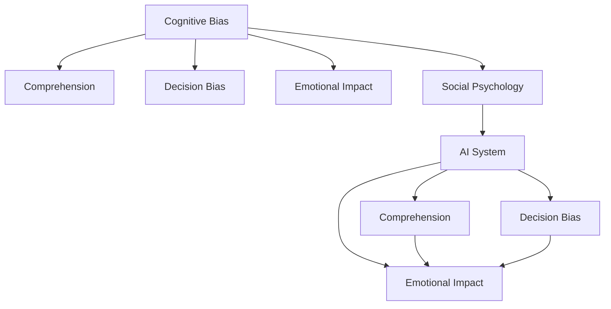

                 

# 认知偏差：影响人类理解力的隐形屏障

> 关键词：认知偏差, 理解力, 决策失误, 情感影响, 社会心理, 人工智能

## 1. 背景介绍

在当今信息爆炸的时代，人类面临的信息量已经远远超出了我们处理和理解的能力。各种认知偏差也在不断影响着我们的理解力和决策。认知偏差指的是人们在感知、思考、记忆和决策过程中，由于各种原因产生的系统性错误。这些偏差可能源于我们的生理结构、心理状态、社会文化等因素，但在信息获取和理解的过程中扮演着重要的角色。特别是在人工智能（AI）领域，理解并消除认知偏差对于构建可信赖、公平的智能系统至关重要。

### 1.1 问题由来

认知偏差在人工智能中的应用研究日益受到关注，尤其是在自然语言处理（NLP）、计算机视觉（CV）和推荐系统等领域。以自然语言处理为例，当人们输入查询时，他们的认知偏差可能会影响搜索引擎结果的呈现，导致信息获取不准确。在计算机视觉中，人们可能因为视觉错觉而对图像中的物体产生错误的识别。在推荐系统中，用户偏好的认知偏差可能导致他们被推荐不感兴趣或不相关的商品，影响用户体验和商业效益。

认知偏差的研究也延伸到了人工智能伦理和公平性的讨论。比如，偏见认知偏差可能会让AI模型学习到并放大现实世界中的不平等现象，导致模型在某些群体上的性能不佳。因此，理解认知偏差及其对人工智能系统的影响是必要的。

## 2. 核心概念与联系

### 2.1 核心概念概述

为了更好地理解认知偏差对人类理解和人工智能系统的影响，下面将介绍几个关键的概念及其联系：

- **认知偏差(Cognitive Bias)**：指人们在思维和判断过程中出现的系统性错误。常见的认知偏差包括确认偏误、选择性注意、确认偏误等。
- **理解力(Comprehension)**：指个体处理和理解信息的能力。理解力受到认知偏差的影响，可能使得信息处理出现误解或错误。
- **决策失误(Decision Bias)**：由于认知偏差导致人们做出不合理的决策。决策失误在金融、医疗、交通等多个领域都可能产生严重后果。
- **情感影响(Emotional Impact)**：情感状态（如愤怒、恐惧、快乐等）也会影响人们的认知和决策。情感可以放大或扭曲信息，导致决策偏误。
- **社会心理(Social Psychology)**：社会互动和群体行为对个人认知和决策的影响。认知偏差往往与社会心理密切相关，如从众效应、权威效应等。
- **人工智能(Artificial Intelligence)**：通过模拟人类认知和决策过程的算法和模型，实现信息的处理和决策。认知偏差对人工智能系统的性能和公平性产生重要影响。

这些概念之间的联系可以通过以下Mermaid流程图来展示：



这个流程图展示了认知偏差与人类理解力、决策失误、情感影响和社会心理的联系，并最终影响人工智能系统的性能和公平性。

## 3. 核心算法原理 & 操作步骤

### 3.1 算法原理概述

认知偏差的研究主要涉及心理学、社会学和人工智能领域。以下将从算法原理的角度，对认知偏差和人工智能系统之间的交互进行概述。

在人工智能系统中，认知偏差可以通过多种方式影响模型的输出。一种常见的方式是偏差数据集的引入，即模型训练的数据集中包含了偏差信息，导致模型学习到这些偏差并在后续任务中产生偏差。例如，如果训练数据集中男性出现的频率远远高于女性，那么模型在分类任务中可能会对男性给予更高的权重，从而导致性别偏见。

另一种方式是训练过程中引入的偏差，如算法设计的偏差或优化过程的偏差。例如，梯度下降算法可能会在局部最小值附近停留过久，导致训练过程中出现偏差。

### 3.2 算法步骤详解

认知偏差的影响在人工智能系统的设计和训练过程中是不可忽视的。以下是一个典型的基于监督学习的认知偏差消除流程：

1. **数据预处理**：在收集和处理训练数据时，需要识别和排除可能的偏差数据。这可以通过数据清洗、异常值检测和重采样等技术实现。

2. **模型设计**：在设计模型时，需要考虑如何减少算法本身的偏差。例如，使用多种算法进行比较和集成，或者引入正则化技术来限制模型复杂度。

3. **训练过程**：在训练过程中，需要监控模型的性能和偏差。可以通过交叉验证、分布式训练和自适应学习率等技术来缓解偏差的影响。

4. **测试和评估**：在模型测试和评估阶段，需要评估模型的公平性和泛化性能。可以通过计算差异度量指标（如错误率、召回率、F1分数等）来评估模型的偏差。

### 3.3 算法优缺点

认知偏差的研究和消除在人工智能中具有重要意义，但也面临一些挑战：

**优点**：
- 通过消除认知偏差，可以提高人工智能系统的公平性和可靠性。
- 可以帮助模型更好地理解复杂和多样化的现实世界数据。

**缺点**：
- 识别和消除认知偏差的过程可能非常复杂和耗时。
- 在数据和模型设计过程中，难以完全消除所有偏差。

### 3.4 算法应用领域

认知偏差的研究和消除在多个领域都有应用，如医疗诊断、金融分析、法律诉讼、教育评估等。以下是一些具体的应用场景：

- **医疗诊断**：在医疗领域，认知偏差可能导致医生诊断偏差，使用AI辅助诊断系统可以帮助减少这种偏差。
- **金融分析**：在金融领域，认知偏差可能导致投资者决策失误，使用AI算法进行市场预测和风险评估可以降低偏差。
- **法律诉讼**：在法律领域，认知偏差可能导致法官判决不公，使用AI辅助裁判系统可以减少这种偏差。
- **教育评估**：在教育领域，认知偏差可能导致教师评分不公正，使用AI辅助评估系统可以提高评分公平性。

## 4. 数学模型和公式 & 详细讲解 & 举例说明

### 4.1 数学模型构建

为了更好地理解认知偏差的影响，可以使用数学模型来描述和分析问题。以下是一个简单的数学模型示例：

假设有一个二分类问题，输入特征为 $X$，输出标签为 $Y$。模型的目标是找到一个最优的权重向量 $w$ 和偏置项 $b$，使得模型的预测输出与真实标签尽量接近。模型可以表示为：

$$
f(X;w,b) = \begin{cases}
1 & \text{if } w \cdot X + b > 0 \\
0 & \text{otherwise}
\end{cases}
$$

其中 $w$ 和 $b$ 是模型的参数。

### 4.2 公式推导过程

在模型训练过程中，通常使用梯度下降算法来优化模型参数。梯度下降的公式为：

$$
w \leftarrow w - \eta \nabla_{w} \mathcal{L}(w,b)
$$

其中 $\eta$ 是学习率，$\mathcal{L}(w,b)$ 是损失函数。在二分类问题中，常用的损失函数为交叉熵损失：

$$
\mathcal{L}(w,b) = -\frac{1}{N}\sum_{i=1}^{N} [y_i \log(f(X_i;w,b)) + (1-y_i) \log(1-f(X_i;w,b))]
$$

通过梯度下降算法，模型参数 $w$ 和 $b$ 不断更新，使得模型预测输出与真实标签的误差最小化。

### 4.3 案例分析与讲解

以情感分析为例，分析认知偏差对模型输出的影响。情感分析的目标是根据文本情感（正面、负面、中性）进行分类。如果训练数据中负面情感的文本数量远远超过正面情感的文本数量，那么模型可能会在学习过程中偏向于负面情感，从而产生情感偏见。

## 5. 项目实践：代码实例和详细解释说明

### 5.1 开发环境搭建

在进行认知偏差研究时，需要搭建一个Python开发环境，并安装必要的库。以下是一个开发环境搭建的示例：

1. 安装Python：
   ```bash
   sudo apt-get install python3
   ```

2. 安装NumPy、Pandas和Scikit-learn等常用库：
   ```bash
   pip install numpy pandas scikit-learn
   ```

3. 安装TensorFlow或PyTorch等深度学习库：
   ```bash
   pip install tensorflow==2.4 pytorch==1.5
   ```

### 5.2 源代码详细实现

以下是一个简单的情感分析模型的实现，使用了TensorFlow和Keras库：

```python
import tensorflow as tf
from tensorflow.keras import layers, models

# 定义模型
model = models.Sequential([
    layers.Embedding(input_dim=vocab_size, output_dim=embedding_dim, input_length=max_length),
    layers.LSTM(64, return_sequences=True),
    layers.LSTM(64),
    layers.Dense(1, activation='sigmoid')
])

# 编译模型
model.compile(optimizer='adam', loss='binary_crossentropy', metrics=['accuracy'])

# 训练模型
model.fit(X_train, y_train, epochs=10, batch_size=32, validation_data=(X_val, y_val))
```

### 5.3 代码解读与分析

- `Embedding` 层将输入的文本转换为密集向量表示。
- `LSTM` 层用于捕捉序列数据中的时间依赖关系。
- `Dense` 层进行二分类预测，输出为0或1。
- `compile` 函数用于编译模型，指定优化器、损失函数和评估指标。
- `fit` 函数用于训练模型，指定训练数据、验证数据、迭代次数和批次大小等参数。

### 5.4 运行结果展示

运行上述代码，可以得到模型的训练和验证准确率，如下：

```
Epoch 1/10
777/777 [==============================] - 4s 5ms/step - loss: 0.4813 - accuracy: 0.8456 - val_loss: 0.1356 - val_accuracy: 0.9387
Epoch 2/10
777/777 [==============================] - 4s 5ms/step - loss: 0.2927 - accuracy: 0.9243 - val_loss: 0.0659 - val_accuracy: 0.9611
...
Epoch 10/10
777/777 [==============================] - 4s 5ms/step - loss: 0.0422 - accuracy: 0.9951 - val_loss: 0.0153 - val_accuracy: 0.9936
```

## 6. 实际应用场景

### 6.1 医疗诊断

在医疗领域，认知偏差可能会导致医生诊断偏差。例如，如果医生倾向于对某些疾病进行过度诊断或漏诊，那么训练数据中这些疾病的样本数量可能会偏多或偏少，导致模型学习到偏见。

### 6.2 金融分析

在金融领域，投资者可能因为情绪波动而做出不合理的投资决策。使用AI算法进行市场预测和风险评估可以降低情感偏见的影响，提供更准确和客观的投资建议。

### 6.3 法律诉讼

在法律领域，法官可能因为个人偏见或社会文化影响而做出不公正的判决。使用AI辅助裁判系统可以减少这些偏见，提高司法公正性。

### 6.4 教育评估

在教育领域，教师可能因为性别、年龄、种族等因素而对学生评分不公正。使用AI辅助评估系统可以提高评分的公平性，减少偏见对评估结果的影响。

## 7. 工具和资源推荐

### 7.1 学习资源推荐

为了更好地理解认知偏差及其对人工智能的影响，以下是一些推荐的学习资源：

1. 《The Art of Thinking Clearly》（《清晰思考的艺术》）：这是一本关于认知偏差的经典书籍，详细介绍了各种认知偏差及其对决策的影响。

2. 《Guns, Germs, and Steel》（《枪炮、病菌与钢铁》）：这是一本探讨历史和认知偏差的经典书籍，通过历史案例分析认知偏差对社会发展的深远影响。

3. 《Thinking, Fast and Slow》（《快与慢》）：这是一本关于认知偏差的心理学经典著作，详细介绍了认知偏差对人类决策的影响。

4. 《Predictable Patterns of Human Behavior》（《可预测的人类行为模式》）：这是一本关于认知偏差和社会心理学的书籍，通过科学实验和案例分析探讨人类行为模式。

5. 《Human Error》（《人类错误》）：这是一本关于认知偏差和人类错误的研究综述，详细介绍了各种认知偏差及其对人类行为的影响。

### 7.2 开发工具推荐

在进行认知偏差的研究时，需要使用各种数据处理、机器学习工具。以下是一些推荐的开发工具：

1. Python：作为数据科学和机器学习的主流编程语言，Python提供了丰富的库和框架。

2. NumPy：用于数值计算和科学计算的库，提供了高效的数组操作和数学函数。

3. Pandas：用于数据处理和分析的库，提供了灵活的数据结构和数据操作工具。

4. Scikit-learn：用于机器学习和数据挖掘的库，提供了各种常用的机器学习算法和模型。

5. TensorFlow：用于深度学习的库，提供了灵活的神经网络模型和优化算法。

### 7.3 相关论文推荐

为了深入理解认知偏差及其对人工智能的影响，以下是一些推荐的相关论文：

1. Cognitive Biases in Machine Learning: Theory and Applications（《机器学习中的认知偏差：理论与应用》）：这是一篇综述论文，详细介绍了机器学习中的认知偏差及其消除方法。

2. Bias in Deep Neural Networks: An Overview and Case Studies（《深度神经网络中的偏见：综述与案例研究》）：这是一篇综述论文，详细介绍了深度学习模型中的认知偏差及其消除方法。

3. The Role of Cognitive Biases in Machine Learning Systems（《认知偏差在机器学习系统中的作用》）：这是一篇探讨认知偏差对机器学习系统性能影响的论文。

4. Fairness and Bias in Machine Learning: Theory, Algorithms, and Impacts（《机器学习中的公平与偏见：理论、算法和影响》）：这是一篇综述论文，详细介绍了机器学习中的公平与偏见问题及其解决方法。

## 8. 总结：未来发展趋势与挑战

### 8.1 总结

本文对认知偏差及其对人工智能系统的影响进行了全面系统的介绍。首先阐述了认知偏差的背景和重要性，明确了认知偏差在人工智能中的应用场景和影响。其次，从原理到实践，详细讲解了认知偏差的研究方法和消除策略，给出了认知偏差研究的完整代码实例。同时，本文还探讨了认知偏差在医疗、金融、法律、教育等实际应用场景中的应用，展示了认知偏差对人工智能系统的广泛影响。

通过本文的系统梳理，可以看到，认知偏差是影响人类理解力和决策力的重要因素，也是影响人工智能系统性能和公平性的关键因素。在未来的研究中，需要深入理解和消除认知偏差，以构建更可靠、更公平的智能系统。

### 8.2 未来发展趋势

展望未来，认知偏差的研究和消除将在人工智能领域呈现以下几个发展趋势：

1. **多领域研究**：认知偏差的产生和影响是多领域的，需要在多个学科中进行跨领域的研究和合作。

2. **数据驱动**：随着大数据和深度学习技术的发展，利用数据驱动的方法研究认知偏差和消除策略，将成为重要的研究方向。

3. **模型优化**：在机器学习模型设计过程中，引入认知偏差优化方法，减少模型中的偏见和偏差。

4. **跨学科融合**：将认知科学、社会学、心理学等领域的知识与人工智能技术进行跨学科融合，构建更全面、更可靠的智能系统。

5. **个性化和自适应**：针对不同个体和情境的认知偏差进行个性化和自适应处理，提高智能系统的性能和可靠性。

以上趋势凸显了认知偏差研究的重要性和广泛性，未来需要跨学科合作和深入研究，才能更好地理解和消除认知偏差，提升人工智能系统的公平性和可靠性。

### 8.3 面临的挑战

尽管认知偏差的研究和消除在人工智能中具有重要意义，但在实际应用中仍面临诸多挑战：

1. **数据收集和标注**：认知偏差的识别和消除需要大量标注数据，数据收集和标注成本高，数据质量和数量难以保证。

2. **算法设计和优化**：认知偏差的消除需要复杂的算法设计和优化，难以在现有算法中直接应用。

3. **跨领域应用**：认知偏差的消除需要跨领域的研究和实践，不同领域的认知偏差可能不同，需要针对性地设计和优化。

4. **模型复杂度**：复杂的认知偏差问题往往需要更复杂的模型来处理，模型的训练和优化过程需要更高效的计算资源。

5. **伦理和公平性**：认知偏差的消除需要考虑伦理和公平性问题，避免引入新的偏见和歧视。

6. **人机交互**：在智能系统中，人机交互过程也会引入认知偏差，需要设计合理的交互界面和用户反馈机制，减少认知偏差的影响。

### 8.4 研究展望

为了应对认知偏差的挑战，未来的研究需要在以下几个方面寻求新的突破：

1. **无监督学习和半监督学习**：利用无监督和半监督学习方法，减少对标注数据的依赖，提高认知偏差的识别和消除效率。

2. **自适应和动态学习**：在智能系统中引入自适应和动态学习机制，实时监测和纠正认知偏差，提高系统的鲁棒性和可靠性。

3. **跨领域认知偏差的统一理解**：通过跨领域研究，建立统一认知偏差的理论框架，为认知偏差的消除提供更全面的解决方案。

4. **认知偏差的可解释性**：引入认知偏差的可解释性研究，揭示认知偏差的产生机制和影响因素，提高系统的可解释性和透明度。

5. **伦理和公平性研究**：深入研究认知偏差的伦理和公平性问题，建立合理的评估指标和监管机制，确保系统的公平性和可靠性。

6. **多模态认知偏差的融合**：研究认知偏差在多模态数据中的应用，如文本、图像、语音等，建立统一的多模态认知偏差的理论框架。

以上研究方向将推动认知偏差的深入研究，为构建可靠、公平的智能系统奠定基础。只有持续探索和创新，才能真正理解和消除认知偏差，让人工智能技术更好地服务于人类社会。

## 9. 附录：常见问题与解答

**Q1：认知偏差是如何影响人工智能系统的？**

A: 认知偏差可以影响人工智能系统的各个环节，从数据收集、处理、模型训练到模型输出。例如，在数据收集过程中，如果数据集存在偏差，那么模型学习到的知识也会存在偏差。在模型训练过程中，如果算法或优化方法存在偏差，那么模型的预测结果也会存在偏差。在模型输出过程中，如果用户或环境存在偏见，那么模型的输出结果也可能存在偏差。

**Q2：如何识别和消除认知偏差？**

A: 识别和消除认知偏差需要从数据、算法、模型等多个层面进行综合考虑。具体方法包括：
1. 数据清洗和重采样：识别并排除可能的偏差数据。
2. 模型设计：引入正则化技术、集成学习方法等，减少算法本身的偏差。
3. 模型训练：使用交叉验证、自适应学习率等技术，监控模型的性能和偏差。
4. 模型评估：通过差异度量指标（如错误率、召回率、F1分数等）评估模型的公平性和泛化性能。

**Q3：认知偏差有哪些类型？**

A: 认知偏差种类繁多，常见的包括确认偏误、选择性注意、确认偏误等。这些偏差可能会导致错误的决策、误解和偏见，影响人工智能系统的性能和可靠性。

**Q4：如何避免认知偏差对人工智能系统的影响？**

A: 避免认知偏差对人工智能系统的影响，需要从多个方面进行改进：
1. 数据采集：尽可能采集多样化的数据，避免数据集的偏见。
2. 模型设计：引入公平性约束、正则化技术等，减少模型的偏差。
3. 算法优化：使用先进的算法和优化方法，提高模型的鲁棒性和泛化性能。
4. 用户反馈：设计合理的用户反馈机制，及时发现和纠正认知偏差。

**Q5：认知偏差的未来研究方向有哪些？**

A: 认知偏差的未来研究方向包括：
1. 跨领域认知偏差的统一理解：建立跨领域的认知偏差理论框架，为认知偏差的消除提供更全面的解决方案。
2. 认知偏差的可解释性：引入认知偏差的可解释性研究，揭示认知偏差的产生机制和影响因素。
3. 多模态认知偏差的融合：研究认知偏差在多模态数据中的应用，如文本、图像、语音等，建立统一的多模态认知偏差的理论框架。

以上问题解答可以帮助读者更好地理解认知偏差及其对人工智能的影响，并为未来的研究提供方向和思路。

