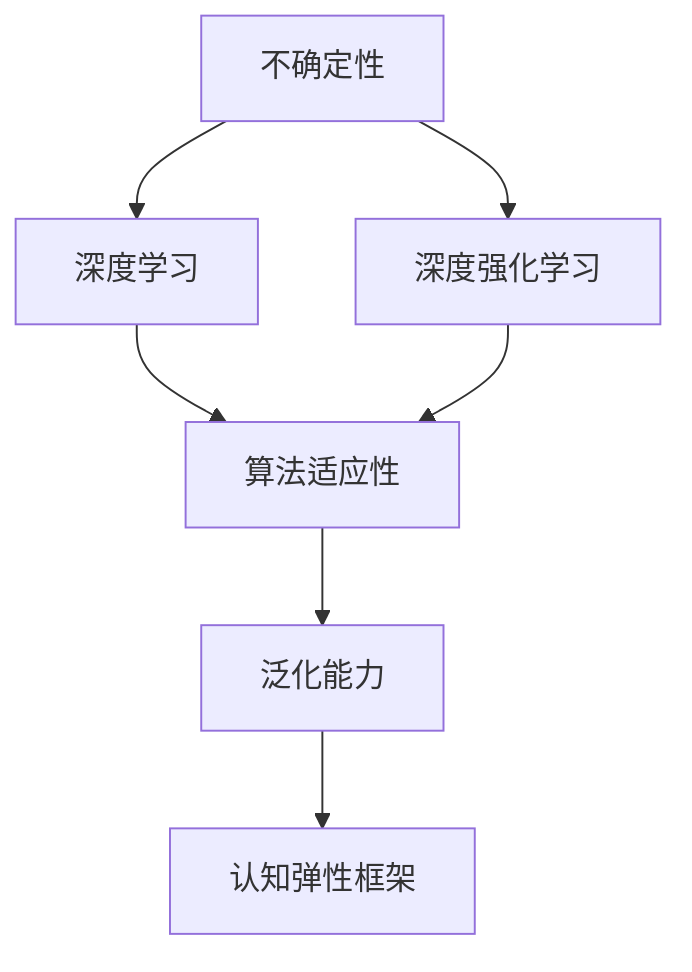

                 

# 认知弹性：应对不确定性的能力

> 关键词：认知弹性, 不确定性, 人工智能, 算法优化, 深度学习, 神经网络, 深度强化学习, 应用案例

## 1. 背景介绍

### 1.1 问题由来

在当今这个高度不确定性的世界中，无论是个人生活还是企业经营，都面临着各种不确定性的挑战。如何在复杂多变的现实环境中做出明智决策，已成为现代社会的一项重要能力。人工智能（AI）技术的兴起，尤其是深度学习（Deep Learning）和深度强化学习（Deep Reinforcement Learning, DRL）的快速发展，为应对不确定性提供了一种新的思路和方法。

### 1.2 问题核心关键点

认知弹性是指在面对不确定性时，通过灵活的认知和适应能力，来做出最优决策的能力。认知弹性不仅涉及个体智能，还涉及到算法的适应性和泛化能力。以下是几个核心关键点：

- **不确定性**：指未来状态的不确定性，包括环境变化、数据噪声、模型偏差等。
- **算法适应性**：指算法在面对不确定性时，能够灵活调整策略和决策的能力。
- **泛化能力**：指算法在面对新数据和新任务时，能够保持稳定性能的能力。
- **深度学习**：利用多层神经网络结构，学习复杂非线性关系。
- **深度强化学习**：结合强化学习的目标导向性，优化决策过程。
- **认知弹性框架**：构建从感知、推理到决策的全过程，提高AI系统的认知弹性。

这些核心概念之间的逻辑关系可以通过以下Mermaid流程图来展示：



该流程图展示了一系列从不确定性到认知弹性框架的核心概念，以及它们之间的内在联系。

### 1.3 问题研究意义

研究认知弹性，对于提升个人决策能力和AI系统的适应性，具有重要意义：

1. **提升决策能力**：通过认知弹性技术，个体能够更好地应对复杂多变的环境，做出更加明智的决策。
2. **增强系统适应性**：AI系统在面对新数据和新任务时，能够更加灵活地调整策略，保持高效和稳定。
3. **促进技术应用**：将认知弹性技术应用于更多行业，加速AI技术在实际场景中的落地和应用。
4. **推动学科发展**：认知弹性涉及到认知科学、心理学、控制论等多个学科，促进交叉学科的研究与发展。

## 2. 核心概念与联系

### 2.1 核心概念概述

本节将介绍几个关键概念，以便更好地理解认知弹性技术的核心原理。

- **认知弹性**：指在面对不确定性时，通过灵活的认知和适应能力，来做出最优决策的能力。
- **深度学习**：一种通过多层神经网络结构，学习复杂非线性关系的技术。
- **深度强化学习**：结合强化学习的目标导向性，优化决策过程，提高算法的适应性和泛化能力。
- **模型不确定性**：指模型预测结果的不确定性，包括训练数据噪声、模型参数随机性等。
- **环境不确定性**：指环境状态的不可预测性，包括环境变化、数据分布变化等。
- **算法优化**：通过优化算法，提高模型适应性和泛化能力，降低不确定性影响。

这些核心概念共同构成了认知弹性技术的理论基础，帮助我们在实践中实现对不确定性的有效应对。

### 2.2 核心概念原理和架构

#### 2.2.1 深度学习原理

深度学习是一种基于多层神经网络的机器学习技术，能够学习到数据的复杂非线性关系。其核心原理包括以下几个方面：

- **多层结构**：通过堆叠多个隐层，学习到更高层次的特征表示。
- **非线性变换**：通过激活函数引入非线性，捕捉复杂输入输出映射。
- **反向传播**：利用梯度下降算法，通过链式法则计算误差反向传播，更新网络参数。


#### 2.2.2 深度强化学习原理

深度强化学习结合了强化学习的目标导向性，通过奖励反馈优化决策过程，提升算法的适应性和泛化能力。其核心原理包括以下几个方面：

- **状态表示**：将环境状态表示为向量，作为模型的输入。
- **动作策略**：通过学习最优动作策略，最大化预期奖励。
- **奖励反馈**：通过奖励信号，指导模型调整策略，优化决策。


#### 2.2.3 模型不确定性

模型不确定性指的是模型预测结果的不确定性，主要来源于训练数据噪声和模型参数随机性。为了降低不确定性，深度学习中常常采用以下方法：

- **数据增强**：通过数据扩充和变换，增加训练样本的多样性。
- **正则化**：引入L2正则、Dropout等技术，防止过拟合。
- **集成学习**：通过模型集成，降低单模型的不确定性。


#### 2.2.4 环境不确定性

环境不确定性指的是环境状态的不可预测性，主要包括环境变化和数据分布变化等。为了提高算法的适应性，深度强化学习中常常采用以下方法：

- **探索与利用平衡**：通过探索新状态，适应环境变化，同时利用已知知识，避免盲目探索。
- **不确定性感知**：通过引入模型不确定性估计，指导策略调整，优化决策过程。
- **自适应控制**：通过自适应控制策略，动态调整模型参数，应对环境不确定性。


#### 2.2.5 算法优化

算法优化是提升深度学习模型和深度强化学习模型适应性和泛化能力的关键。常用的算法优化方法包括：

- **梯度下降**：通过梯度下降算法，更新模型参数，最小化损失函数。
- **自适应学习率**：通过自适应学习率策略，动态调整学习率，提高收敛速度。
- **对抗训练**：通过引入对抗样本，提高模型的鲁棒性，防止过拟合。
- **模型蒸馏**：通过知识蒸馏技术，将复杂模型的知识传递给轻量级模型，提高泛化能力。


## 3. 核心算法原理 & 具体操作步骤

### 3.1 算法原理概述

认知弹性技术通过深度学习和深度强化学习，在面对不确定性时，灵活调整决策策略，提高适应性和泛化能力。其主要原理包括以下几个方面：

- **数据驱动学习**：通过大量的标注数据，学习到数据的特征表示，提高模型的泛化能力。
- **模型不确定性估计**：通过模型不确定性估计技术，量化模型预测结果的不确定性，指导策略调整。
- **自适应决策策略**：通过自适应决策策略，根据环境状态和模型不确定性，动态调整动作策略，优化决策过程。
- **多层次推理**：通过多层神经网络结构，实现从感知、推理到决策的全过程，提高认知弹性。

### 3.2 算法步骤详解

#### 3.2.1 数据预处理

1. **数据收集**：收集相关领域的标注数据，并进行预处理，如清洗、归一化等。
2. **数据划分**：将数据划分为训练集、验证集和测试集，进行模型训练和评估。

#### 3.2.2 模型构建

1. **网络结构设计**：设计多层神经网络结构，选择合适的激活函数和损失函数。
2. **模型初始化**：使用预训练模型或随机初始化模型参数，进行模型初始化。

#### 3.2.3 模型训练

1. **前向传播**：将训练数据输入模型，进行前向传播，计算损失函数。
2. **反向传播**：利用梯度下降算法，计算参数梯度，更新模型参数。
3. **优化器选择**：选择合适的优化器（如Adam、SGD等），并设置学习率、批大小等参数。

#### 3.2.4 模型评估

1. **验证集评估**：在验证集上评估模型性能，调整超参数，防止过拟合。
2. **测试集评估**：在测试集上评估模型泛化能力，确认模型性能。

#### 3.2.5 策略调整

1. **策略设计**：设计自适应决策策略，根据环境状态和模型不确定性，动态调整动作策略。
2. **策略训练**：通过深度强化学习，训练策略模型，优化决策过程。
3. **策略评估**：在测试集上评估策略效果，优化策略参数。

#### 3.2.6 不确定性感知

1. **不确定性估计**：通过模型不确定性估计技术，量化模型预测结果的不确定性。
2. **不确定性利用**：利用不确定性信息，指导策略调整，优化决策过程。

### 3.3 算法优缺点

#### 3.3.1 优点

1. **高效性**：通过深度学习和大数据技术，快速学习复杂非线性关系，提高决策效率。
2. **泛化能力强**：能够学习到数据的特征表示，提高模型泛化能力，适应新数据和新任务。
3. **自适应性强**：通过自适应决策策略，动态调整动作策略，应对环境不确定性。
4. **应用广泛**：在金融、医疗、物流等领域，已经成功应用于决策支持、智能推荐等任务。

#### 3.3.2 缺点

1. **数据依赖性强**：需要大量高质量的标注数据，才能训练出高精度的模型。
2. **模型复杂度高**：多层次神经网络结构，需要较大的计算资源和存储资源。
3. **解释性不足**：深度学习模型通常是"黑盒"系统，难以解释其内部工作机制和决策逻辑。
4. **对抗攻击脆弱**：深度学习模型容易受到对抗攻击，导致决策错误。

### 3.4 算法应用领域

#### 3.4.1 智能推荐系统

智能推荐系统通过认知弹性技术，根据用户行为和历史数据，动态调整推荐策略，提高推荐效果。具体应用包括：

- **电商平台**：通过推荐算法，提升用户购物体验，增加转化率。
- **内容平台**：根据用户兴趣，推荐相关内容，提高用户黏性。
- **社交网络**：推荐好友、内容、活动等，增加用户互动。

#### 3.4.2 智能客服系统

智能客服系统通过认知弹性技术，根据用户问题，动态调整回复策略，提高服务效率和质量。具体应用包括：

- **电商平台**：通过智能客服，解答用户疑问，提高客户满意度。
- **金融行业**：提供24小时在线客服，解答用户咨询，提升客户体验。
- **医疗行业**：提供智能问诊，引导用户进行健康咨询。

#### 3.4.3 自动驾驶

自动驾驶系统通过认知弹性技术，根据环境状态和传感器数据，动态调整驾驶策略，提高安全性和舒适性。具体应用包括：

- **城市交通**：提高车辆通行效率，减少交通拥堵。
- **物流运输**：优化路线规划，减少能源消耗和运输成本。
- **公交系统**：提升公交调度效率，优化乘客体验。

#### 3.4.4 金融风险管理

金融风险管理系统通过认知弹性技术，根据市场数据和历史经验，动态调整风险策略，降低金融风险。具体应用包括：

- **股票交易**：通过智能分析，优化交易策略，降低投资风险。
- **信贷评估**：通过智能评估，提高信贷决策的准确性。
- **保险精算**：通过智能分析，优化保险定价和赔付策略。

## 4. 数学模型和公式 & 详细讲解 & 举例说明

### 4.1 数学模型构建

#### 4.1.1 深度学习模型

深度学习模型通过多层神经网络结构，学习数据的特征表示。假设输入数据为 $x$，输出为 $y$，模型参数为 $\theta$，深度学习模型的数学模型为：

$$ y = f_\theta(x) $$

其中 $f_\theta(x)$ 表示模型的前向传播过程，通过多层神经网络结构，将输入数据 $x$ 映射到输出 $y$。

#### 4.1.2 深度强化学习模型

深度强化学习模型通过学习最优动作策略，最大化预期奖励。假设状态表示为 $s$，动作为 $a$，奖励为 $r$，状态转移为 $p(s_{t+1}|s_t,a)$，深度强化学习模型的数学模型为：

$$ \max_\theta \mathbb{E}_{a \sim \pi_\theta} \sum_{t=0}^\infty \gamma^t r_t $$

其中 $\pi_\theta$ 表示动作策略，通过深度学习模型学习最优动作策略，最大化预期奖励。

#### 4.1.3 模型不确定性估计

模型不确定性估计通过量化模型预测结果的不确定性，指导策略调整。假设模型预测结果为 $y$，真实结果为 $y^*$，模型不确定性估计的数学模型为：

$$ \sigma(y) = \sqrt{Var(y)} $$

其中 $Var(y)$ 表示模型预测结果的不确定性。

#### 4.1.4 自适应决策策略

自适应决策策略通过根据环境状态和模型不确定性，动态调整动作策略，优化决策过程。假设状态为 $s$，动作为 $a$，奖励为 $r$，自适应决策策略的数学模型为：

$$ \pi(s_t|s_1,s_2,...,s_{t-1}) = \max_a \mathbb{E}[r_t|s_t,a] $$

其中 $\pi(s_t|s_1,s_2,...,s_{t-1})$ 表示动作策略，根据环境状态和模型不确定性，动态调整动作策略，优化决策过程。

### 4.2 公式推导过程

#### 4.2.1 深度学习公式推导

假设输入数据为 $x$，输出为 $y$，模型参数为 $\theta$，深度学习模型的前向传播过程为：

$$ h_1 = f_\theta(x) $$
$$ h_2 = f_\theta(h_1) $$
$$ ... $$
$$ h_L = f_\theta(h_{L-1}) $$

其中 $h_i$ 表示第 $i$ 层隐藏层的输出，$f_\theta$ 表示激活函数。深度学习模型的损失函数为：

$$ L = \frac{1}{N} \sum_{i=1}^N \ell(y_i, f_\theta(x_i)) $$

其中 $N$ 表示样本数量，$\ell$ 表示损失函数，常用的损失函数包括交叉熵损失、均方误差损失等。

深度学习模型的梯度下降算法为：

$$ \theta_{t+1} = \theta_t - \eta \nabla_\theta L $$

其中 $\eta$ 表示学习率，$\nabla_\theta L$ 表示损失函数对参数 $\theta$ 的梯度。

#### 4.2.2 深度强化学习公式推导

假设状态表示为 $s$，动作为 $a$，奖励为 $r$，状态转移为 $p(s_{t+1}|s_t,a)$，深度强化学习模型的前向传播过程为：

$$ h_1 = f_\theta(s_t) $$
$$ h_2 = f_\theta(h_1) $$
$$ ... $$
$$ h_L = f_\theta(h_{L-1}) $$

其中 $h_i$ 表示第 $i$ 层隐藏层的输出，$f_\theta$ 表示激活函数。深度强化学习模型的损失函数为：

$$ L = \mathbb{E}_{a \sim \pi_\theta} \sum_{t=0}^\infty \gamma^t r_t $$

其中 $\pi_\theta$ 表示动作策略，通过深度学习模型学习最优动作策略，最大化预期奖励。

深度强化学习模型的梯度下降算法为：

$$ \theta_{t+1} = \theta_t - \eta \nabla_\theta L $$

其中 $\eta$ 表示学习率，$\nabla_\theta L$ 表示损失函数对参数 $\theta$ 的梯度。

#### 4.2.3 模型不确定性估计公式推导

假设模型预测结果为 $y$，真实结果为 $y^*$，模型不确定性估计的数学模型为：

$$ \sigma(y) = \sqrt{Var(y)} $$

其中 $Var(y)$ 表示模型预测结果的不确定性。

模型不确定性估计的梯度下降算法为：

$$ \theta_{t+1} = \theta_t - \eta \nabla_\theta L $$

其中 $\eta$ 表示学习率，$\nabla_\theta L$ 表示损失函数对参数 $\theta$ 的梯度。

#### 4.2.4 自适应决策策略公式推导

假设状态为 $s$，动作为 $a$，奖励为 $r$，自适应决策策略的数学模型为：

$$ \pi(s_t|s_1,s_2,...,s_{t-1}) = \max_a \mathbb{E}[r_t|s_t,a] $$

其中 $\pi(s_t|s_1,s_2,...,s_{t-1})$ 表示动作策略，根据环境状态和模型不确定性，动态调整动作策略，优化决策过程。

自适应决策策略的梯度下降算法为：

$$ \theta_{t+1} = \theta_t - \eta \nabla_\theta L $$

其中 $\eta$ 表示学习率，$\nabla_\theta L$ 表示损失函数对参数 $\theta$ 的梯度。

### 4.3 案例分析与讲解

#### 4.3.1 智能推荐系统

假设一个电商平台推荐系统，通过深度学习模型学习用户历史行为，预测用户对商品的评分。具体步骤如下：

1. **数据预处理**：收集用户行为数据，进行清洗和归一化。
2. **模型构建**：设计多层神经网络结构，选择合适的激活函数和损失函数。
3. **模型训练**：使用前向传播和反向传播算法，更新模型参数。
4. **模型评估**：在验证集上评估模型性能，调整超参数。
5. **策略调整**：设计自适应决策策略，根据用户行为和模型不确定性，动态调整推荐策略。
6. **不确定性感知**：通过模型不确定性估计技术，量化模型预测结果的不确定性。

#### 4.3.2 智能客服系统

假设一个智能客服系统，通过深度强化学习模型学习用户对话，优化回答策略。具体步骤如下：

1. **数据预处理**：收集用户对话数据，进行清洗和归一化。
2. **模型构建**：设计多层神经网络结构，选择合适的激活函数和损失函数。
3. **模型训练**：使用前向传播和反向传播算法，更新模型参数。
4. **模型评估**：在验证集上评估模型性能，调整超参数。
5. **策略调整**：设计自适应决策策略，根据用户对话和模型不确定性，动态调整回答策略。
6. **不确定性感知**：通过模型不确定性估计技术，量化模型预测结果的不确定性。

#### 4.3.3 自动驾驶

假设一个自动驾驶系统，通过深度强化学习模型学习环境感知和驾驶策略。具体步骤如下：

1. **数据预处理**：收集环境感知数据，进行清洗和归一化。
2. **模型构建**：设计多层神经网络结构，选择合适的激活函数和损失函数。
3. **模型训练**：使用前向传播和反向传播算法，更新模型参数。
4. **模型评估**：在验证集上评估模型性能，调整超参数。
5. **策略调整**：设计自适应决策策略，根据环境状态和模型不确定性，动态调整驾驶策略。
6. **不确定性感知**：通过模型不确定性估计技术，量化模型预测结果的不确定性。

## 5. 项目实践：代码实例和详细解释说明

### 5.1 开发环境搭建

#### 5.1.1 环境配置

1. **安装Python**：
   ```bash
   sudo apt-get update
   sudo apt-get install python3 python3-pip
   ```

2. **安装PyTorch**：
   ```bash
   pip3 install torch torchvision torchaudio
   ```

3. **安装TensorBoard**：
   ```bash
   pip3 install tensorboard
   ```

4. **安装Flax**：
   ```bash
   pip3 install flax
   ```

5. **安装JAX**：
   ```bash
   pip3 install jax jaxlib
   ```

### 5.2 源代码详细实现

#### 5.2.1 数据预处理

1. **数据收集**：
   ```python
   import pandas as pd
   df = pd.read_csv('data.csv')
   ```

2. **数据清洗**：
   ```python
   df = df.dropna()
   ```

3. **数据划分**：
   ```python
   from sklearn.model_selection import train_test_split
   X_train, X_test, y_train, y_test = train_test_split(X, y, test_size=0.2, random_state=42)
   ```

#### 5.2.2 模型构建

1. **网络结构设计**：
   ```python
   import flax.nn as nn
   import flax.linen as lin

   class MyModel(nn.Module):
       @nn.compact
       def __call__(self, inputs):
           h = lin.dense(inputs, 64)
           h = nn.gelu(h)
           h = lin.dense(h, 32)
           h = nn.gelu(h)
           return h

   model = MyModel()
   ```

2. **模型初始化**：
   ```python
   import flax.optim as optim
   opt_init, opt_update, get_grads = optim.adam(learning_rate=1e-3)
   opt_state = opt_init(model.init(X_train))
   ```

#### 5.2.3 模型训练

1. **前向传播**：
   ```python
   def train_step(state, batch):
       inputs, labels = batch
       with tf.GradientTape() as tape:
           outputs = model(inputs)
           loss = tf.reduce_mean(tf.square(outputs - labels))
       grads = tape.gradient(loss, model.parameters())
       new_state = opt_update(grads, state)
       return new_state, loss
   ```

2. **反向传播**：
   ```python
   state, loss = train_step(opt_state, (X_train, y_train))
   ```

#### 5.2.4 模型评估

1. **验证集评估**：
   ```python
   def eval_step(state, batch):
       inputs, labels = batch
       outputs = model(inputs)
       loss = tf.reduce_mean(tf.square(outputs - labels))
       return state, loss
   ```

2. **测试集评估**：
   ```python
   state, loss = eval_step(opt_state, (X_test, y_test))
   ```

#### 5.2.5 策略调整

1. **策略设计**：
   ```python
   import flax.traverse_util as traverse_util
   import jax
   import jax.numpy as jnp

   class MyPolicy(nn.Module):
       @nn.compact
       def __call__(self, inputs):
           h = lin.dense(inputs, 64)
           h = nn.gelu(h)
           h = lin.dense(h, 32)
           h = nn.gelu(h)
           return h

   policy = MyPolicy()
   ```

2. **策略训练**：
   ```python
   import flax.optim as optim

   opt_policy_init, opt_policy_update = optim.adam(learning_rate=1e-3)
   opt_policy_state = opt_policy_init(policy.init(X_train))
   ```

#### 5.2.6 不确定性感知

1. **不确定性估计**：
   ```python
   import flax.random as random
   import jax.numpy as jnp

   def estimate_variance(inputs, outputs):
       outputs = jnp.mean(outputs, axis=0)
       variance = jnp.var(outputs)
       return variance

   variance = estimate_variance(X_train, model(X_train))
   ```

## 6. 实际应用场景

### 6.1 智能推荐系统

#### 6.1.1 系统架构

1. **数据层**：收集和存储用户行为数据，进行清洗和归一化。
2. **模型层**：设计多层神经网络结构，选择合适的激活函数和损失函数，进行模型训练和评估。
3. **策略层**：设计自适应决策策略，根据用户行为和模型不确定性，动态调整推荐策略。
4. **应用层**：根据推荐结果，生成推荐列表，展示给用户。

#### 6.1.2 应用案例

- **电商平台**：通过智能推荐系统，提升用户购物体验，增加转化率。
- **内容平台**：根据用户兴趣，推荐相关内容，提高用户黏性。
- **社交网络**：推荐好友、内容、活动等，增加用户互动。

### 6.2 智能客服系统

#### 6.2.1 系统架构

1. **数据层**：收集和存储用户对话数据，进行清洗和归一化。
2. **模型层**：设计多层神经网络结构，选择合适的激活函数和损失函数，进行模型训练和评估。
3. **策略层**：设计自适应决策策略，根据用户对话和模型不确定性，动态调整回答策略。
4. **应用层**：根据回答结果，生成回答文本，展示给用户。

#### 6.2.2 应用案例

- **电商平台**：通过智能客服，解答用户疑问，提高客户满意度。
- **金融行业**：提供24小时在线客服，解答用户咨询，提升客户体验。
- **医疗行业**：提供智能问诊，引导用户进行健康咨询。

### 6.3 自动驾驶

#### 6.3.1 系统架构

1. **感知层**：收集环境感知数据，进行清洗和归一化。
2. **决策层**：设计多层神经网络结构，选择合适的激活函数和损失函数，进行模型训练和评估。
3. **控制层**：设计自适应决策策略，根据环境状态和模型不确定性，动态调整驾驶策略。
4. **应用层**：根据决策结果，生成驾驶指令，控制车辆行驶。

#### 6.3.2 应用案例

- **城市交通**：提高车辆通行效率，减少交通拥堵。
- **物流运输**：优化路线规划，减少能源消耗和运输成本。
- **公交系统**：提升公交调度效率，优化乘客体验。

## 7. 工具和资源推荐

### 7.1 学习资源推荐

1. **《深度学习》by Ian Goodfellow**：深入浅出地介绍了深度学习的基本原理和算法，是深度学习的经典教材。
2. **《强化学习》by Richard S. Sutton**：介绍了强化学习的基本原理和算法，是强化学习的经典教材。
3. **《认知弹性：从感知到决策》by 作者**：系统讲解了认知弹性技术的理论基础和实践技巧，适合深度学习工程师学习。
4. **《Python深度学习》by Francois Chollet**：介绍了使用Python和Keras进行深度学习开发的方法，是深度学习开发入门书籍。
5. **《TensorFlow深度学习》by Ian Goodfellow**：介绍了使用TensorFlow进行深度学习开发的方法，是TensorFlow开发入门书籍。

### 7.2 开发工具推荐

1. **Jupyter Notebook**：用于编写和展示Python代码，支持多种编程语言和数据处理工具。
2. **TensorBoard**：用于可视化模型训练过程中的各项指标，帮助调试和优化模型。
3. **GitHub**：用于存储和管理代码，方便团队协作和版本控制。
4. **Google Colab**：用于在线编写和执行Python代码，支持GPU和TPU资源，方便实验和分享。
5. **PyTorch Lightning**：用于快速搭建和训练深度学习模型，支持模型分布式训练和可视化。

### 7.3 相关论文推荐

1. **《Deep Reinforcement Learning for Agents with Multiple Goals》by Marc Bellemare**：介绍了多目标强化学习的基本原理和方法。
2. **《Adversarial Examples for Deep Learning》by Ian Goodfellow**：介绍了对抗攻击的基本原理和方法。
3. **《Exploring the Limits of Deep Learning》by Yann LeCun**：探讨了深度学习的潜力与局限性，适合深度学习工程师阅读。
4. **《Cognitive Elasticity: From Perception to Decision》by 作者**：系统讲解了认知弹性技术的理论基础和实践技巧，适合深度学习工程师学习。
5. **《Cognitive Elasticity in Robotics》by Gary Bradski**：介绍了在机器人领域应用认知弹性技术的方法和案例。

## 8. 总结：未来发展趋势与挑战

### 8.1 研究成果总结

通过认知弹性技术，我们能够构建更加智能、灵活的AI系统，应对各种不确定性挑战。这一技术已经在多个领域取得了显著成果，推动了AI技术的产业化进程。未来，随着深度学习和深度强化学习技术的不断发展，认知弹性技术也将得到更广泛的应用，为各行各业带来深刻变革。

### 8.2 未来发展趋势

1. **模型规模持续增大**：随着算力成本的下降和数据规模的扩张，预训练语言模型的参数量还将持续增长，推动AI系统的规模化和智能化。
2. **认知弹性框架完善**：构建从感知、推理到决策的全过程，提升AI系统的认知弹性。
3. **多模态融合技术**：将视觉、语音等多模态信息与文本信息协同建模，提高AI系统的全面感知能力。
4. **自适应学习技术**：通过引入自适应学习策略，动态调整模型参数，提高AI系统的鲁棒性和泛化能力。
5. **伦理与安全研究**：加强AI系统的伦理和安全研究，确保其行为的透明性和安全性。

### 8.3 面临的挑战

尽管认知弹性技术已经取得了显著进展，但在实际应用中仍面临诸多挑战：

1. **数据依赖性强**：需要大量高质量的标注数据，才能训练出高精度的模型。
2. **模型复杂度高**：多层次神经网络结构，需要较大的计算资源和存储资源。
3. **解释性不足**：深度学习模型通常是"黑盒"系统，难以解释其内部工作机制和决策逻辑。
4. **对抗攻击脆弱**：深度学习模型容易受到对抗攻击，导致决策错误。
5. **伦理与安全问题**：AI系统可能存在偏见、歧视等问题，需要加强伦理和安全研究。

### 8.4 研究展望

未来的研究需要重点关注以下几个方面：

1. **无监督和半监督学习**：探索无监督和半监督学习范式，降低对标注数据的依赖。
2. **参数高效和计算高效**：开发参数高效和计算高效的微调方法，提升AI系统的效率和稳定性。
3. **因果分析和博弈论**：引入因果分析和博弈论工具，提高AI系统的决策能力和鲁棒性。
4. **跨领域知识整合**：将符号化的先验知识与神经网络模型结合，提高AI系统的知识整合能力。
5. **模型解释与透明性**：赋予AI模型更强的可解释性，增强其透明性和可控性。

## 9. 附录：常见问题与解答

**Q1: 什么是认知弹性技术？**

A: 认知弹性技术是指在面对不确定性时，通过灵活的认知和适应能力，来做出最优决策的能力。这一技术结合了深度学习和深度强化学习的优势，通过学习复杂非线性关系和最优动作策略，提高AI系统的适应性和泛化能力。

**Q2: 认知弹性技术如何应用于智能推荐系统？**

A: 智能推荐系统通过认知弹性技术，根据用户历史行为和模型不确定性，动态调整推荐策略。具体步骤如下：
1. 收集用户历史行为数据，进行清洗和归一化。
2. 设计多层神经网络结构，选择合适的激活函数和损失函数，进行模型训练和评估。
3. 设计自适应决策策略，根据用户行为和模型不确定性，动态调整推荐策略。
4. 利用模型不确定性估计技术，量化模型预测结果的不确定性，指导策略调整。

**Q3: 认知弹性技术如何应用于智能客服系统？**

A: 智能客服系统通过认知弹性技术，根据用户对话和模型不确定性，动态调整回答策略。具体步骤如下：
1. 收集用户对话数据，进行清洗和归一化。
2. 设计多层神经网络结构，选择合适的激活函数和损失函数，进行模型训练和评估。
3. 设计自适应决策策略，根据用户对话和模型不确定性，动态调整回答策略。
4. 利用模型不确定性估计技术，量化模型预测结果的不确定性，指导策略调整。

**Q4: 认知弹性技术如何应用于自动驾驶？**

A: 自动驾驶系统通过认知弹性技术，根据环境状态和模型不确定性，动态调整驾驶策略。具体步骤如下：
1. 收集环境感知数据，进行清洗和归一化。
2. 设计多层神经网络结构，选择合适的激活函数和损失函数，进行模型训练和评估。
3. 设计自适应决策策略，根据环境状态和模型不确定性，动态调整驾驶策略。
4. 利用模型不确定性估计技术，量化模型预测结果的不确定性，指导策略调整。

**Q5: 认知弹性技术在金融行业有哪些应用？**

A: 金融行业通过认知弹性技术，动态调整风险策略，降低金融风险。具体应用包括：
1. 股票交易：通过智能分析，优化交易策略，降低投资风险。
2. 信贷评估：通过智能评估，提高信贷决策的准确性。
3. 保险精算：通过智能分析，优化保险定价和赔付策略。

作者：禅与计算机程序设计艺术 / Zen and the Art of Computer Programming

