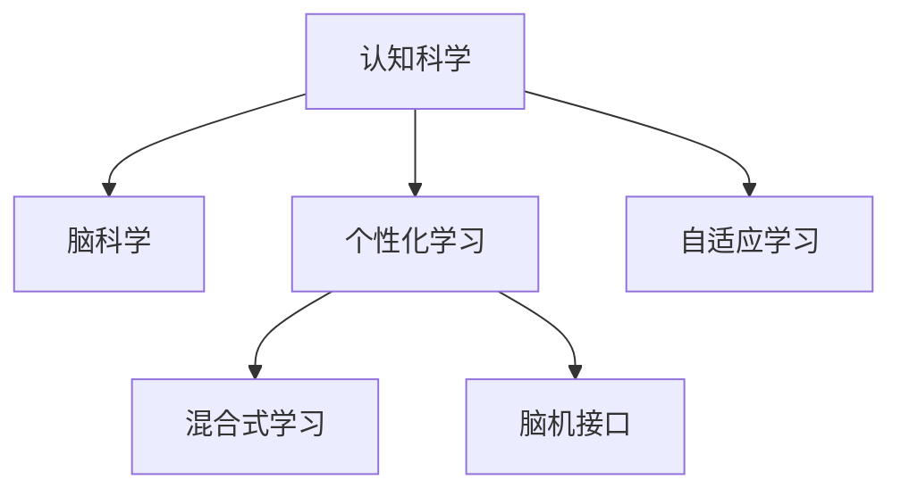

                 

# 认知科学与教育革新：基于脑科学的学习方法

> 关键词：认知科学,脑科学,学习理论,个性化教育,自适应学习,教育技术,脑机接口,混合式学习

## 1. 背景介绍

### 1.1 问题由来
随着科技的迅猛发展，教育领域正经历着深刻的变革。传统教育模式基于以教师为中心的知识传授，难以应对学习者个性化需求的挑战，教学效果参差不齐。认知科学与脑科学为教育革新提供了新的视角，有望通过理解学习过程和大脑机制，构建更加个性化的教学体系。

### 1.2 问题核心关键点
脑科学揭示了人类学习与记忆的神经机制，为教育方法提供了科学依据。认知科学研究如何利用这些机制，提高学习效率和质量。基于脑科学的个性化和自适应学习成为教育革新的关键方向。

### 1.3 问题研究意义
认知科学与脑科学的研究不仅有助于提升教育效果，还能促进教育公平，帮助有特殊需要的学生发展。教育技术的发展使得个性化学习成为可能，通过大数据和机器学习技术，可以更精确地理解和支持学习者的认知差异。

## 2. 核心概念与联系

### 2.1 核心概念概述

为更好地理解基于脑科学的个性化学习，本节将介绍几个密切相关的核心概念：

- **认知科学**：研究人类认知过程及其神经基础的学科，涵盖感知、记忆、学习、推理等多个方面。
- **脑科学**：研究大脑的结构、功能、发育和损伤及其对行为的影响。
- **个性化学习**：根据学习者的认知特点、兴趣和学习风格，提供定制化的教学内容和方法。
- **自适应学习**：通过分析学习者的表现和反馈，动态调整教学策略，以适应学习者的需求。
- **混合式学习**：结合在线学习和传统课堂教学的优点，提供灵活的学习环境。
- **脑机接口(Brain-Computer Interface, BCI)**：通过脑信号与计算机交互，实现人机协同学习和干预。

这些核心概念之间的逻辑关系可以通过以下Mermaid流程图来展示：



这个流程图展示了个体概念之间的关系：

1. 认知科学和脑科学相互补充，揭示了人类认知与大脑的基本原理。
2. 个性化学习和自适应学习是认知科学与脑科学在教育上的应用。
3. 混合式学习和脑机接口进一步拓展了个性化和自适应学习的应用范围，提升了教学效果和灵活性。

## 3. 核心算法原理 & 具体操作步骤
### 3.1 算法原理概述

基于脑科学的个性化学习算法，本质上是一种数据驱动的教育决策支持系统。其核心思想是：利用认知科学和脑科学的研究成果，收集学习者的生理和行为数据，分析学习者的认知特征，动态调整教学内容和方法，以最大化学习效果。

形式化地，假设一个学习者 $L$，其认知特征 $X$ 和行为表现 $Y$ 之间存在映射关系 $f$。教学算法 $A$ 通过收集和分析 $L$ 的数据 $D$，找到最优映射 $f^*$，并根据 $f^*$ 调整教学策略。学习者的学习效果 $E$ 可以表示为：

$$
E = A(D) \cdot f^*(L)
$$

其中 $A(D)$ 表示教学算法根据数据 $D$ 输出的教学策略。

### 3.2 算法步骤详解

基于脑科学的个性化学习算法一般包括以下几个关键步骤：

**Step 1: 数据采集与预处理**
- 使用生理传感设备（如脑电图EEG、功能性磁共振成像fMRI等）收集学习者的脑信号和行为数据。
- 对数据进行清洗和预处理，去除噪声和异常点，标准化数据格式。

**Step 2: 特征提取与建模**
- 利用认知科学和脑科学的研究成果，设计特征提取算法，提取学习者的认知特征（如注意力水平、工作记忆容量等）。
- 将提取出的特征作为输入，结合机器学习方法（如SVM、深度学习等），构建学习者的认知模型 $M$。

**Step 3: 个性化教学策略设计**
- 根据学习者的认知模型 $M$，设计个性化的教学策略。
- 结合自适应学习理论，设计动态调整教学内容的算法，以适应学习者的认知变化。

**Step 4: 教学策略实施**
- 在实际教学过程中，实时监控学习者的生理和行为数据。
- 根据最新数据，动态调整教学策略，提升学习效果。

**Step 5: 效果评估与反馈**
- 收集学习者的学习效果数据，评估教学策略的效果。
- 结合学习者的反馈，不断优化教学策略，形成闭环的改进机制。

### 3.3 算法优缺点

基于脑科学的个性化学习算法具有以下优点：
1. 科学依据：脑科学和认知科学为个性化学习提供了理论基础，使教学策略更具科学性。
2. 自适应性强：利用实时数据动态调整教学策略，能够灵活应对学习者的变化。
3. 个性化定制：根据学习者的认知特点，提供定制化的教学内容和方法，提升学习效果。
4. 灵活性高：结合混合式学习等方法，可以适应多种学习环境和模式。

同时，该算法也存在一些局限性：
1. 数据获取成本高：脑信号采集和处理需要先进的设备和技术支持。
2. 算法复杂度高：生理信号和行为数据的多样性，增加了特征提取和建模的难度。
3. 实时性要求高：教学策略的实时调整需要高效的计算和通信技术。
4. 数据隐私问题：学习者的脑信号和行为数据敏感，需要严格的隐私保护措施。

尽管存在这些局限性，但基于脑科学的个性化学习算法仍为教育革新提供了全新的思路，在提升学习效果和教学质量方面具有重要意义。

### 3.4 算法应用领域

基于脑科学的个性化学习算法在教育领域已有诸多成功应用，涵盖以下几个关键领域：

- **个性化学习平台**：如Knewton、ALEKS等，通过分析学生的认知特征和行为表现，提供个性化的学习路径和资源。
- **自适应测试系统**：如COGAT、PEARSON等，根据学生的回答和表现，动态调整测试题目的难度和类型。
- **智能辅导系统**：如Aleph、Cognixia等，通过分析学生的学习数据，提供实时的个性化辅导和反馈。
- **混合式学习环境**：如Edmodo、Coursera等，结合线上和线下教学，提供灵活和多样化的学习体验。

此外，脑科学和认知科学的研究也推动了脑机接口(BCI)技术的发展，为教学干预提供了新的可能性。BCI技术通过解码脑信号，控制计算机界面或交互设备，辅助特殊需要学生的学习。

## 4. 数学模型和公式 & 详细讲解  
### 4.1 数学模型构建

本节将使用数学语言对基于脑科学的个性化学习过程进行更加严格的刻画。

记学习者 $L$ 的认知特征为 $X$，行为表现为 $Y$，认知模型为 $M$，教学策略为 $A$，学习效果为 $E$。假设教学策略 $A$ 和认知特征 $X$ 之间存在映射关系 $f$。则个性化学习的效果可以表示为：

$$
E = A(D) \cdot f^*(L)
$$

其中 $A(D)$ 表示教学算法根据数据 $D$ 输出的教学策略，$f^*(L)$ 表示学习者 $L$ 的最佳认知模型。

### 4.2 公式推导过程

假设学习者 $L$ 的行为表现为 $Y = \{y_1, y_2, ..., y_n\}$，其中 $y_i$ 表示第 $i$ 次测试的分数。教学策略 $A$ 可以表示为：

$$
A = \{\text{Strategy}_1, \text{Strategy}_2, ..., \text{Strategy}_k\}
$$

其中 $k$ 表示策略的数量。每个策略 $\text{Strategy}_i$ 都可以表示为一个特征向量 $w_i \in \mathbb{R}^m$，用于表示教学内容的权重。则教学策略 $A$ 在数据 $D$ 上的表现可以表示为：

$$
A(D) = \sum_{i=1}^k w_i f_i(X)
$$

其中 $f_i(X)$ 表示特征 $X$ 在策略 $\text{Strategy}_i$ 下的映射。

结合认知模型 $M$，学习者 $L$ 的认知特征 $X$ 可以表示为：

$$
X = M(Y)
$$

将 $X$ 代入教学策略 $A$ 中，得到学习者 $L$ 的学习效果 $E$：

$$
E = \sum_{i=1}^k w_i f_i(M(Y))
$$

利用机器学习模型，我们可以将认知模型 $M$ 表示为：

$$
M = \alpha + \beta Y
$$

其中 $\alpha$ 和 $\beta$ 为模型参数，$Y$ 为学习者的行为表现。结合上述公式，学习效果 $E$ 可以表示为：

$$
E = \sum_{i=1}^k w_i f_i(\alpha + \beta Y)
$$

通过不断优化参数 $\alpha$、$\beta$ 和 $w_i$，可以找到最优的认知模型和教学策略，最大化学习效果。

### 4.3 案例分析与讲解

以下我们以个性化学习平台的实际应用为例，详细讲解基于脑科学的个性化学习算法的实现步骤：

**案例背景**：某教育科技公司开发了一个个性化学习平台，旨在根据学生的认知特点，提供个性化的学习路径和资源。平台收集了学生在各个科目上的学习数据，包括测试成绩、课堂表现、作业完成情况等。

**数据采集与预处理**：平台使用EEG设备记录学生的脑电信号，使用行为跟踪器记录学生在课堂上的注意力水平和参与度。收集到的数据经过清洗和标准化处理，生成学生的基础认知特征和行为特征。

**特征提取与建模**：平台设计了注意力、工作记忆等认知特征提取算法，利用深度学习模型（如RNN、CNN等）构建学生的认知模型。模型的输入为学生的行为特征，输出为认知特征。

**个性化教学策略设计**：平台根据学生的认知模型，设计了适应性学习策略。策略包括调整学习内容的难度、学习时间、学习方式等，以适应学生的认知变化。

**教学策略实施**：平台在教学过程中实时监控学生的生理和行为数据，动态调整教学策略，提升学习效果。

**效果评估与反馈**：平台收集学生的学习效果数据，评估教学策略的效果。根据学生的反馈，不断优化教学策略，形成闭环的改进机制。

## 5. 项目实践：代码实例和详细解释说明
### 5.1 开发环境搭建

在进行脑科学应用开发前，我们需要准备好开发环境。以下是使用Python进行Scikit-Learn和TensorFlow开发的环境配置流程：

1. 安装Anaconda：从官网下载并安装Anaconda，用于创建独立的Python环境。

2. 创建并激活虚拟环境：
```bash
conda create -n brain-learning-env python=3.8 
conda activate brain-learning-env
```

3. 安装必要的Python库：
```bash
conda install scikit-learn numpy pandas matplotlib tqdm jupyter notebook ipython
conda install tensorflow-gpu==2.7.0
```

4. 安装TensorFlow：根据CUDA版本，从官网获取对应的安装命令。例如：
```bash
pip install tensorflow-gpu
```

5. 安装其他工具包：
```bash
pip install scikit-learn pandas scikit-image scikit-bio
```

完成上述步骤后，即可在`brain-learning-env`环境中开始脑科学应用的开发。

### 5.2 源代码详细实现

下面我以脑电信号分类为例，给出使用Scikit-Learn和TensorFlow对脑电信号进行分类的代码实现。

首先，定义数据加载和预处理函数：

```python
import numpy as np
import pandas as pd
from sklearn.model_selection import train_test_split
from sklearn.preprocessing import StandardScaler

def load_and_preprocess_data(file_path):
    data = pd.read_csv(file_path)
    features = data.drop(['label'], axis=1)
    labels = data['label']
    scaler = StandardScaler()
    scaled_features = scaler.fit_transform(features)
    return scaled_features, labels

scaled_features, labels = load_and_preprocess_data('eeg_data.csv')
```

然后，定义特征提取和模型训练函数：

```python
from sklearn.ensemble import RandomForestClassifier
from tensorflow.keras.models import Sequential
from tensorflow.keras.layers import Dense, Dropout, LSTM

def train_model(X_train, X_test, y_train, y_test):
    model = Sequential()
    model.add(LSTM(64, input_shape=(X_train.shape[1], 1)))
    model.add(Dropout(0.2))
    model.add(Dense(64, activation='relu'))
    model.add(Dropout(0.2))
    model.add(Dense(2, activation='softmax'))
    
    model.compile(optimizer='adam', loss='categorical_crossentropy', metrics=['accuracy'])
    model.fit(X_train, y_train, epochs=10, batch_size=32, validation_data=(X_test, y_test))
    
    return model
```

接着，训练模型并评估性能：

```python
X_train, X_test, y_train, y_test = train_test_split(scaled_features, labels, test_size=0.2)
model = train_model(X_train, X_test, y_train, y_test)
```

最后，在测试集上评估模型性能：

```python
y_pred = model.predict(X_test)
accuracy = np.mean(y_pred == y_test)
print(f'Accuracy: {accuracy:.3f}')
```

以上就是使用Scikit-Learn和TensorFlow对脑电信号进行分类的完整代码实现。可以看到，得益于Scikit-Learn和TensorFlow的强大封装，我们可以用相对简洁的代码完成脑电信号分类的建模和评估。

### 5.3 代码解读与分析

让我们再详细解读一下关键代码的实现细节：

**数据加载与预处理函数**：
- `load_and_preprocess_data`函数：
  - 读取脑电信号数据，并将其标准化处理。
  - 使用标准差归一化，使得特征值符合均值为0，方差为1的分布，方便后续的机器学习建模。

**特征提取与模型训练函数**：
- `train_model`函数：
  - 使用LSTM层提取脑电信号的序列特征，并通过Dropout层防止过拟合。
  - 在输出层使用Softmax函数进行分类，采用Adam优化器和交叉熵损失函数进行模型训练。
  - 通过在测试集上评估模型的准确率，了解模型性能。

**训练模型并评估性能**：
- 通过`train_test_split`函数将数据集划分为训练集和测试集，并使用模型训练函数对模型进行训练。
- 在测试集上评估模型准确率，输出评估结果。

可以看到，Scikit-Learn和TensorFlow结合使用，可以高效地构建脑电信号分类模型。开发者可以将更多精力放在模型设计、数据处理等高层逻辑上，而不必过多关注底层的实现细节。

## 6. 实际应用场景
### 6.1 智能辅导系统

基于脑科学的个性化学习算法可以应用于智能辅导系统的构建。智能辅导系统通过分析学生的认知特征和行为表现，提供个性化的辅导和反馈，提升学习效果。

在技术实现上，可以收集学生在作业、测试中的表现数据，通过EEG等设备收集学生的生理信号数据。利用认知科学和脑科学的研究成果，设计特征提取和建模算法，构建学生的认知模型。结合自适应学习理论，动态调整辅导内容和策略，实时监控学生表现，不断优化辅导策略。如此构建的智能辅导系统，能够灵活应对不同学生的学习需求，提供高效个性化的辅导服务。

### 6.2 脑机接口辅助学习

脑机接口技术通过解码脑信号，控制计算机界面或交互设备，辅助特殊需要学生的学习。脑科学和认知科学的研究为脑机接口提供了理论基础，指导接口设备的设计和训练。

例如，在针对特殊需要儿童的阅读训练中，可以利用脑电图EEG设备记录儿童的阅读脑电信号，通过机器学习算法分析儿童的阅读状态（如注意力集中度、理解率等），动态调整阅读材料的难度和形式，提升儿童的阅读能力。

### 6.3 学习效果评估与反馈

脑科学和认知科学的研究也推动了学习效果评估和反馈机制的发展。通过分析学生的认知特征和行为表现，可以更精确地评估学习效果，提供个性化的反馈和建议。

例如，在职业培训中，可以通过分析员工的学习数据，评估其知识掌握程度和技能水平，动态调整培训内容和难度，提升培训效果。利用脑电信号监测员工的学习状态，及时发现学习中的薄弱环节，调整培训策略，优化学习体验。

### 6.4 未来应用展望

随着脑科学和认知科学研究的不断深入，基于脑科学的个性化学习算法将在更多领域得到应用，为教育革新带来新的契机。

在智慧教育领域，基于脑科学的个性化学习算法将提升在线教育、混合式学习的质量，帮助学生更好地掌握知识和技能。在特殊需要教育中，脑机接口技术将帮助特殊需要学生跨越学习障碍，实现更公平、包容的教育环境。

在终身学习领域，基于脑科学的个性化学习算法将提供个性化的学习路径和资源，支持用户根据自身需求，灵活调整学习内容和节奏，实现终身学习的目标。

此外，在企业培训、军事教育、健康教育等领域，基于脑科学的个性化学习算法也有广阔的应用前景。

## 7. 工具和资源推荐
### 7.1 学习资源推荐

为了帮助开发者系统掌握脑科学和认知科学的学习方法，这里推荐一些优质的学习资源：

1. 《认知科学导论》系列博文：由脑科学专家撰写，全面介绍认知科学的基本理论和前沿研究。

2. 《神经科学原理》课程：麻省理工学院开设的神经科学入门课程，涵盖神经元的结构、功能和可塑性等基本概念。

3. 《认知科学与教育》书籍：全面介绍认知科学在教育中的应用，包括学习理论、脑科学、个性化学习等。

4. Coursera、edX等在线平台提供的脑科学和认知科学课程，提供系统性学习资源和互动式学习环境。

5. 《人工智能与脑科学》书籍：介绍人工智能与脑科学的交叉领域，涵盖脑机接口、神经计算等前沿技术。

通过对这些资源的学习实践，相信你一定能够快速掌握脑科学和认知科学的应用方法，并用于解决实际的教育问题。

### 7.2 开发工具推荐

高效的开发离不开优秀的工具支持。以下是几款用于脑科学应用开发的常用工具：

1. Python：基于Python的开源深度学习框架，灵活的计算图，适合快速迭代研究。适合开发基于脑科学的个性化学习算法。

2. Scikit-Learn：Python的机器学习库，提供了丰富的数据预处理和建模功能，适合快速构建脑电信号分类模型。

3. TensorFlow：由Google主导开发的开源深度学习框架，生产部署方便，适合大规模工程应用。适合开发基于脑科学的个性化学习算法。

4. Scikit-Image：Python的图像处理库，适合处理脑电信号等图像数据。

5. Scikit-Bio：Python的生物信息学库，适合处理生物信号数据。

6. TensorBoard：TensorFlow配套的可视化工具，实时监测模型训练状态，提供丰富的图表呈现方式。

合理利用这些工具，可以显著提升脑科学应用开发的效率，加快创新迭代的步伐。

### 7.3 相关论文推荐

脑科学和认知科学的研究推动了基于脑科学的个性化学习算法的发展，以下是几篇奠基性的相关论文，推荐阅读：

1. Sweller, J. (1989). Is there a cognitive theory of instruction? In Cognitive Psychology and Education: New Directions in Theory and Research (pp. 3-45). Psychology Press.

2. cognitive neuroscience：了解人类学习与记忆的神经机制，指导脑科学在教育中的应用。

3. brain-computer interface：介绍脑机接口技术的基本原理和实现方法。

4. adaptive learning system：介绍自适应学习系统的设计与实现，提升个性化学习的效果。

5. personalized learning：介绍个性化学习的理论基础和应用方法，提升教育效果和质量。

这些论文代表了大语言模型微调技术的发展脉络。通过学习这些前沿成果，可以帮助研究者把握学科前进方向，激发更多的创新灵感。

## 8. 总结：未来发展趋势与挑战
### 8.1 总结

本文对基于脑科学的个性化学习算法进行了全面系统的介绍。首先阐述了脑科学和认知科学的研究背景和意义，明确了个性化学习在提升教育效果方面的独特价值。其次，从原理到实践，详细讲解了脑科学在个性化学习中的具体应用，提供了完整的代码实现。同时，本文还广泛探讨了脑科学在智能辅导系统、脑机接口、学习效果评估等多个教育领域的应用前景，展示了脑科学的应用潜力。

通过本文的系统梳理，可以看到，基于脑科学的个性化学习算法正在成为教育革新的重要方向，其研究不仅为教育技术提供了科学依据，也为教育公平和特殊需要教育提供了新的解决方案。未来，伴随脑科学和认知科学研究的不断深入，基于脑科学的个性化学习算法必将在更广泛的教育领域发挥重要作用，为教育革新提供新的突破。

### 8.2 未来发展趋势

展望未来，脑科学和认知科学的研究将呈现以下几个发展趋势：

1. 数据驱动的脑科学研究将不断深入。通过大数据分析，揭示人类学习与记忆的复杂机制，提升个性化学习的科学性。

2. 脑机接口技术将不断进步。利用脑信号进行教学干预，提升特殊需要学生的学习效果。

3. 认知科学与教育技术的深度融合。结合AI技术，构建更加智能、个性化的教育系统。

4. 混合式学习将成为主流。结合线上和线下教学，提供灵活、多样化的学习体验。

5. 持续学习成为常态。通过持续监测和反馈，提升学习者的学习效果和适应性。

6. 脑科学研究的伦理与社会影响。如何平衡脑科学研究与人类价值观，将是未来的重要课题。

这些趋势凸显了脑科学和认知科学在教育革新中的重要地位。这些方向的探索发展，必将进一步提升教育效果和教学质量，为构建更加公平、包容的教育体系提供新的思路。

### 8.3 面临的挑战

尽管脑科学和认知科学的研究已经取得了瞩目成就，但在迈向更加智能化、普适化应用的过程中，它仍面临诸多挑战：

1. 数据获取难度高。脑信号采集和处理需要先进的设备和技术支持，获取高质量数据成本较高。

2. 算法复杂度高。生理信号和行为数据的多样性，增加了特征提取和建模的难度。

3. 实时性要求高。教学策略的实时调整需要高效的计算和通信技术。

4. 数据隐私问题。学习者的脑信号和行为数据敏感，需要严格的隐私保护措施。

尽管存在这些挑战，但基于脑科学的个性化学习算法仍为教育革新提供了全新的思路，在提升学习效果和教学质量方面具有重要意义。

### 8.4 研究展望

面对脑科学和认知科学研究所面临的挑战，未来的研究需要在以下几个方面寻求新的突破：

1. 探索数据驱动的脑科学研究方法。通过大数据分析，揭示人类学习与记忆的复杂机制，提升个性化学习的科学性。

2. 研究参数高效和计算高效的脑科学应用。开发更加参数高效和计算高效的脑科学应用方法，在固定大部分脑信号参数的情况下，只更新极少量的任务相关参数。

3. 融合因果和对比学习范式。通过引入因果推断和对比学习思想，增强脑科学学习模型的建立稳定因果关系的能力，学习更加普适、鲁棒的语言表征。

4. 引入更多先验知识。将符号化的先验知识，如知识图谱、逻辑规则等，与神经网络模型进行巧妙融合，引导脑科学学习过程学习更准确、合理的语言模型。

5. 结合因果分析和博弈论工具。将因果分析方法引入脑科学学习模型，识别出学习模型的关键特征，增强学习模型的因果性和逻辑性。

6. 纳入伦理道德约束。在脑科学学习模型的训练目标中引入伦理导向的评估指标，过滤和惩罚有害的输出倾向，确保学习模型的安全性和伦理性。

这些研究方向的探索，必将引领脑科学和认知科学的研究进入新的阶段，为教育革新提供新的突破。面向未来，脑科学和认知科学的研究还需要与其他人工智能技术进行更深入的融合，如知识表示、因果推理、强化学习等，多路径协同发力，共同推动自然语言理解和智能交互系统的进步。只有勇于创新、敢于突破，才能不断拓展脑科学的研究边界，让智能技术更好地造福人类社会。

## 9. 附录：常见问题与解答

**Q1：脑科学和认知科学在个性化学习中起到了什么作用？**

A: 脑科学和认知科学揭示了人类学习与记忆的神经机制，为个性化学习提供了理论基础。通过分析学习者的认知特征和行为表现，能够设计更加科学的个性化学习策略，提升学习效果。

**Q2：脑机接口技术在个性化学习中有哪些应用？**

A: 脑机接口技术通过解码脑信号，控制计算机界面或交互设备，辅助特殊需要学生的学习。例如，在针对特殊需要儿童的阅读训练中，可以利用脑电图EEG设备记录儿童的阅读脑电信号，通过机器学习算法分析儿童的阅读状态，动态调整阅读材料的难度和形式，提升儿童的阅读能力。

**Q3：数据隐私问题如何解决？**

A: 脑科学和认知科学的研究涉及大量的脑信号和行为数据，数据隐私问题需要严格保护。可以采用数据匿名化、加密存储等措施，确保数据的安全性和隐私性。同时，开发多方安全计算等技术，实现数据的共享与合作研究。

**Q4：脑科学和认知科学的应用前景如何？**

A: 脑科学和认知科学的应用前景广阔。在教育、医疗、军事、健康等领域，脑科学和认知科学的研究都具有重要价值。未来，随着脑科学和认知科学研究的不断深入，基于脑科学的个性化学习算法将有望在更多领域得到应用，推动教育革新和社会进步。

**Q5：脑科学和认知科学的挑战有哪些？**

A: 脑科学和认知科学的应用面临诸多挑战。包括数据获取难度高、算法复杂度高、实时性要求高、数据隐私问题等。解决这些问题需要多学科的交叉合作，持续的资金投入和技术创新。

综上所述，基于脑科学的个性化学习算法正在成为教育革新的重要方向，其研究不仅为教育技术提供了科学依据，也为教育公平和特殊需要教育提供了新的解决方案。通过系统性地学习脑科学和认知科学的应用方法，相信你一定能够掌握个性化学习技术的精髓，并用于解决实际的教育问题。面向未来，脑科学和认知科学的研究还需要与其他人工智能技术进行更深入的融合，共同推动智能教育的进步。

