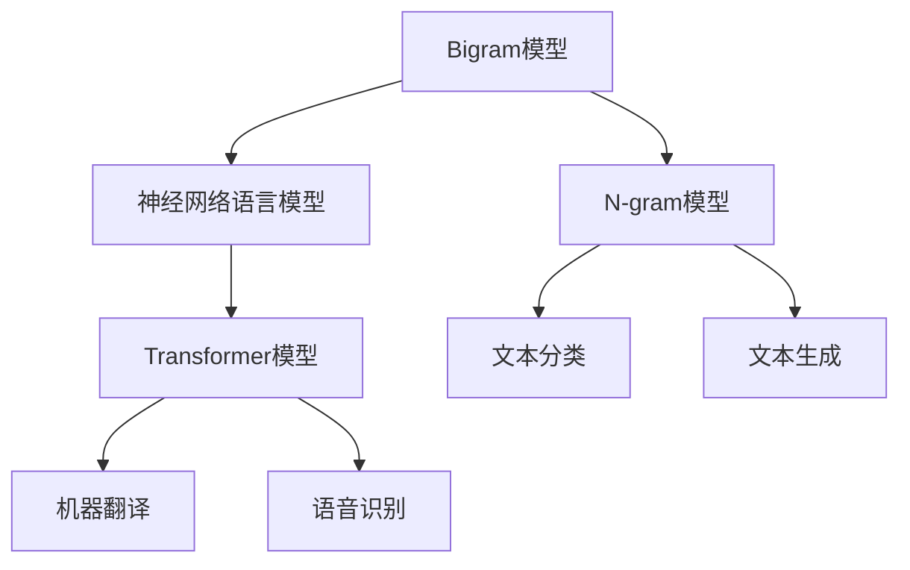

                 

# 语言建模进阶：Bigram 到 N-gram

语言建模是自然语言处理（NLP）和机器学习（ML）中的一个核心任务，其目标是通过统计学方法建立文本数据的概率模型，从而实现对文本序列的预测和生成。本文将深入探讨语言建模的关键技术：从简单的Bigram模型到更复杂的N-gram模型，分析其原理、步骤、优缺点和应用领域。

## 1. 背景介绍

### 1.1 问题由来
语言建模起源于统计语言学，用于预测文本序列中下一个词或字符的概率。早期的大多数语言模型采用基于规则的方法，但这些方法往往难以处理复杂的语言现象。随着计算能力的提升，基于统计的方法逐渐流行，尤其是在机器翻译、语音识别、文本生成等任务中得到广泛应用。

早期的统计语言模型，如N-gram模型，在预测时考虑前N-1个词或字符对第N个词或字符的概率，N越大，模型越复杂，预测精度越高。然而，N-gram模型在处理长距离依赖和稀疏问题时表现不佳。为了应对这些问题，研究者们提出了更为复杂的模型，如RNN、LSTM和Transformer等，这些模型通过引入神经网络结构，可以捕捉更长的依赖关系，并利用上下文信息进行更好的预测。

## 2. 核心概念与联系

### 2.1 核心概念概述

为更好地理解Bigram到N-gram模型的演变，本节将介绍几个密切相关的核心概念：

- Bigram模型：基于两个相邻字符或词组成的序列进行建模，是N-gram模型的特例，通常用于文本分类、文本生成等任务。
- N-gram模型：基于N个相邻字符或词组成的序列进行建模，用于预测下一个字符或词，在机器翻译、语音识别等任务中表现优异。
- 神经网络语言模型：引入神经网络结构，如RNN、LSTM、Transformer等，用于捕捉更长的依赖关系和上下文信息，提升模型的泛化能力。
- 注意力机制：通过计算注意力权重，使得模型能够关注上下文中的重要部分，提升预测的准确性。

这些核心概念之间的逻辑关系可以通过以下Mermaid流程图来展示：



这个流程图展示了大语言模型的核心概念及其之间的关系：

1. Bigram模型作为N-gram模型的特例，用于简单的文本分类和生成任务。
2. N-gram模型可以用于更加复杂的文本预测任务，如机器翻译和语音识别。
3. 神经网络语言模型通过引入更复杂的结构，可以捕捉更长的依赖关系和上下文信息。
4. Transformer模型是当前最先进的神经网络语言模型，具有卓越的性能。

## 3. 核心算法原理 & 具体操作步骤

### 3.1 算法原理概述

Bigram和N-gram模型的核心思想是通过统计文本中相邻字符或词的出现频率，来计算每个字符或词的概率。N-gram模型在计算概率时，考虑了前N-1个字符或词对第N个字符或词的影响。

在实际应用中，N-gram模型通过最大似然估计（MLE）或交叉熵（CE）损失函数训练得到，以最小化预测错误。具体来说，对于给定文本序列 $\{x_1, x_2, \ldots, x_T\}$，模型的目标是最小化预测下一个字符或词的概率损失：

$$
\min_{\theta} -\frac{1}{T}\sum_{t=1}^T \log P(x_t | x_{t-1}, \ldots, x_{t-N+1})
$$

其中，$P(x_t | x_{t-1}, \ldots, x_{t-N+1})$ 表示在给定前N-1个字符或词的情况下，第N个字符或词的概率。

神经网络语言模型则通过引入神经网络结构，进一步提升了模型的表达能力。例如，RNN、LSTM和Transformer等模型，通过引入记忆单元和自注意力机制，能够更好地捕捉文本中的长期依赖关系和上下文信息。

### 3.2 算法步骤详解

Bigram和N-gram模型的训练过程如下：

**Step 1: 收集文本数据**

首先，需要收集足够数量的文本数据，并对其进行预处理。预处理包括分词、去除停用词、标准化等步骤，以便于后续的建模。

**Step 2: 构建N-gram模型**

在预处理后的文本数据中，统计每个字符或词的出现频率，构建N-gram模型。N-gram模型通常采用概率分布表示，即每个字符或词的概率基于其前面的N-1个字符或词的条件概率：

$$
P(x_t | x_{t-1}, \ldots, x_{t-N+1}) = \frac{C(x_t, x_{t-1}, \ldots, x_{t-N+1})}{C(x_{t-1}, \ldots, x_{t-N+1})}
$$

其中，$C(\cdot)$表示条件概率的计数，即给定条件下，特定字符或词出现的次数。

**Step 3: 训练模型**

在构建N-gram模型后，使用文本数据对其进行训练。训练过程通常采用最大似然估计（MLE）或交叉熵（CE）损失函数，最小化预测错误。具体步骤如下：

1. 初始化模型参数，如条件概率表。
2. 对于每个字符或词，根据其前面的N-1个字符或词，计算预测概率。
3. 使用MLE或CE损失函数，计算模型预测错误。
4. 使用梯度下降等优化算法，更新模型参数，最小化损失函数。
5. 重复步骤2-4，直至收敛。

**Step 4: 模型评估和应用**

在模型训练完成后，使用测试数据集对模型进行评估，计算其预测准确率和交叉熵损失等指标。评估通过后，模型即可用于实际的文本生成、分类、翻译等任务。

### 3.3 算法优缺点

Bigram和N-gram模型具有以下优点：

1. 简单易懂：模型结构简单，易于理解和实现。
2. 对标注数据需求低：不需要大量标注数据，只需要统计文本中字符或词的出现频率。
3. 计算效率高：模型参数较少，计算效率较高。

同时，这些模型也存在一些局限性：

1. 上下文信息不足：模型仅考虑相邻字符或词，难以捕捉更长的依赖关系和上下文信息。
2. 稀疏问题：文本中存在大量未出现的字符或词，导致条件概率估计不准确。
3. 长距离依赖处理不当：在处理长文本时，模型可能出现信息丢失或错误预测。

## 4. 数学模型和公式 & 详细讲解  
### 4.1 数学模型构建

Bigram和N-gram模型的数学模型构建相对简单，可以形式化表示为条件概率分布：

$$
P(x_t | x_{t-1}, \ldots, x_{t-N+1}) = \frac{C(x_t, x_{t-1}, \ldots, x_{t-N+1})}{C(x_{t-1}, \ldots, x_{t-N+1})}
$$

其中，$C(\cdot)$表示条件概率的计数，即给定条件下，特定字符或词出现的次数。

### 4.2 公式推导过程

以Bigram模型为例，推导其在给定前一个字符 $x_{t-1}$ 的情况下，预测当前字符 $x_t$ 的概率。

首先，我们需要统计文本中每个字符对出现的次数：

$$
C(x_{t-1}, x_t) = \sum_{i=1}^{N} c_i
$$

其中，$c_i$ 表示前一个字符为 $x_{t-1}$，当前字符为 $x_t$ 的次数。

根据上述统计结果，Bigram模型的条件概率分布为：

$$
P(x_t | x_{t-1}) = \frac{C(x_{t-1}, x_t)}{C(x_{t-1})}
$$

在训练过程中，模型参数 $\theta$ 包含条件概率表 $P(x_t | x_{t-1})$，通过MLE或CE损失函数进行优化：

$$
\min_{\theta} -\frac{1}{N}\sum_{t=1}^N \log P(x_t | x_{t-1})
$$

### 4.3 案例分析与讲解

以机器翻译任务为例，说明N-gram模型如何在实际应用中进行建模和训练。

假设输入文本为 "The cat sat on the mat"，输出文本为 "Le chat est sur le tapis"。在训练过程中，我们首先统计每个字符对在训练集中的出现次数，构建Bigram模型。

对于输入文本中的 "The" 和 "the"，我们统计其对出现的次数，并计算在 "the" 和 "The" 条件下，"cat" 出现的概率。具体计算过程如下：

1. 统计输入文本中每个字符对的出现次数。例如，"Th" 和 "The" 分别出现了1次，"he" 和 "the" 分别出现了1次。
2. 计算 "the" 和 "The" 条件下，"cat" 出现的概率。例如，"the" 和 "The" 条件下，"cat" 分别出现了1次，"cat" 在 "the" 和 "The" 条件下的概率为 $\frac{1}{1+1} = 0.5$。

通过类似的方式，可以计算出所有可能的字符对和条件概率，构建Bigram模型。

在训练过程中，我们使用MLE或CE损失函数，最小化模型预测错误。例如，对于输入 "The cat sat"，预测下一个字符为 "on"，我们计算该预测的MLE损失：

$$
\log P(on | the cat) = \log \frac{C(on, the cat)}{C(the cat)}
$$

最终，我们通过不断迭代更新模型参数，最小化上述损失，得到最终的Bigram模型。

## 5. 项目实践：代码实例和详细解释说明
### 5.1 开发环境搭建

在进行Bigram和N-gram模型的项目实践前，我们需要准备好开发环境。以下是使用Python进行代码实现的Python环境配置流程：

1. 安装Anaconda：从官网下载并安装Anaconda，用于创建独立的Python环境。

2. 创建并激活虚拟环境：
```bash
conda create -n pytorch-env python=3.8 
conda activate pytorch-env
```

3. 安装PyTorch：根据CUDA版本，从官网获取对应的安装命令。例如：
```bash
conda install pytorch torchvision torchaudio cudatoolkit=11.1 -c pytorch -c conda-forge
```

4. 安装nltk库：用于文本预处理和分词。
```bash
pip install nltk
```

5. 安装NLTK数据集：
```bash
import nltk
nltk.download('punkt')
```

6. 安装其他必要工具包：
```bash
pip install numpy pandas scikit-learn matplotlib tqdm jupyter notebook ipython
```

完成上述步骤后，即可在`pytorch-env`环境中开始项目实践。

### 5.2 源代码详细实现

下面以Bigram模型为例，给出使用Python和nltk库进行Bigram模型构建和训练的代码实现。

首先，定义Bigram模型类：

```python
from collections import defaultdict
from nltk.tokenize import word_tokenize

class BigramModel:
    def __init__(self, vocab):
        self.vocab = vocab
        self.count = defaultdict(lambda: defaultdict(int))
        
    def fit(self, text):
        tokens = word_tokenize(text)
        for i in range(len(tokens)-1):
            self.count[tokens[i]][tokens[i+1]] += 1
        
    def predict(self, token):
        count = self.count[token]
        total = sum(count.values())
        return {k: v/total for k, v in count.items()}
```

然后，构建Bigram模型并进行训练：

```python
text = "The cat sat on the mat"
model = BigramModel(vocab=set(text))
model.fit(text)

print(model.predict("the"))
```

### 5.3 代码解读与分析

让我们再详细解读一下关键代码的实现细节：

**BigramModel类**：
- `__init__`方法：初始化词汇表和计数器。
- `fit`方法：对文本进行分词，统计每个字符对出现的次数，构建条件概率表。
- `predict`方法：给定一个字符，计算其在各个条件下出现的概率。

**代码实现**：
- `word_tokenize`函数：用于将文本分词，返回字符列表。
- `vocab`参数：用于定义字符集。
- `count`字典：用于统计每个字符对出现的次数。
- `fit`方法：遍历字符对，更新计数器。
- `predict`方法：根据计数器计算条件概率。

## 6. 实际应用场景

### 6.1 文本分类

Bigram和N-gram模型可以用于文本分类任务，将文本分类到不同的预定义类别中。以新闻分类为例，可以通过统计每个类别中单词的出现频率，构建N-gram模型，并对新的文本进行分类。

在实践中，可以收集新闻文本和其对应的类别标签，统计每个单词对在不同类别下的出现次数，构建Bigram或N-gram模型。然后，对新的文本进行分词，并计算其在各个类别条件下的概率，选择概率最大的类别作为预测结果。

### 6.2 机器翻译

Bigram和N-gram模型可以用于机器翻译任务，将源语言文本转换为目标语言文本。以中英文翻译为例，可以通过构建中英文Bigram模型，对源语言文本进行分词，并对每个单词对进行预测，生成目标语言文本。

在实践中，可以收集中英文对照语料库，统计每个单词对出现的次数，构建Bigram模型。然后，对源语言文本进行分词，并计算每个单词对在目标语言下的预测概率，生成目标语言文本。

### 6.3 文本生成

Bigram和N-gram模型可以用于文本生成任务，生成具有语法和语义连贯性的文本。以诗歌生成为例，可以通过统计诗歌中相邻单词对出现的次数，构建Bigram模型，并生成新的诗歌文本。

在实践中，可以收集诗歌文本，统计每个单词对出现的次数，构建Bigram模型。然后，随机选择一个单词作为起始，通过模型预测下一个单词，并生成新的诗歌文本。

### 6.4 未来应用展望

随着预训练语言模型和大规模数据的普及，Bigram和N-gram模型在实际应用中逐渐被更高级的模型所取代。未来，这些模型可能会用于更复杂的任务，如对话生成、文本摘要等，或者作为预训练模型的组成部分，提升模型的泛化能力和性能。

尽管如此，Bigram和N-gram模型仍具有重要的研究价值，特别是在资源有限、数据量较小的情况下，这些模型可以提供简单而有效的解决方案。

## 7. 工具和资源推荐

### 7.1 学习资源推荐

为了帮助开发者系统掌握Bigram和N-gram模型的理论基础和实践技巧，这里推荐一些优质的学习资源：

1. 《统计自然语言处理》（Rabiner）：介绍统计语言模型的基本原理和实现方法，适合初学者和中级开发者。

2. 《深度学习与自然语言处理》（Goodman）：深入介绍NLP中的深度学习模型，包括RNN、LSTM和Transformer等，适合进阶开发者。

3. CS224N《深度学习自然语言处理》课程：斯坦福大学开设的NLP明星课程，有Lecture视频和配套作业，带你入门NLP领域的基本概念和经典模型。

4. 《NLP实战指南》（Gao）：介绍NLP任务的实战开发，包括文本分类、文本生成等，适合实战开发者。

5. 《语言模型》（Manning）：介绍语言模型在自然语言处理中的应用，适合系统开发者和应用开发者。

通过对这些资源的学习实践，相信你一定能够快速掌握Bigram和N-gram模型的精髓，并用于解决实际的NLP问题。

### 7.2 开发工具推荐

高效的开发离不开优秀的工具支持。以下是几款用于Bigram和N-gram模型开发的常用工具：

1. Python：开源的编程语言，拥有丰富的库和框架，适合开发复杂的应用。

2. NLTK：自然语言处理工具包，提供文本处理、分词、标注等功能，适合开发初步的NLP应用。

3. Jupyter Notebook：交互式编程环境，支持多种编程语言和工具，适合快速迭代开发。

4. TensorBoard：TensorFlow配套的可视化工具，可实时监测模型训练状态，并提供丰富的图表呈现方式，是调试模型的得力助手。

5. Weights & Biases：模型训练的实验跟踪工具，可以记录和可视化模型训练过程中的各项指标，方便对比和调优。

合理利用这些工具，可以显著提升Bigram和N-gram模型的开发效率，加快创新迭代的步伐。

### 7.3 相关论文推荐

Bigram和N-gram模型的发展源于学界的持续研究。以下是几篇奠基性的相关论文，推荐阅读：

1. A Statistical Model for Natural Language Processing（Rabiner）：提出了Bigram模型，成为NLP中的经典模型。

2. Neural Network Language Models（Bengio）：提出神经网络语言模型，为后续的RNN、LSTM等模型奠定了基础。

3. Language Models as Sequence Probability Models（Bengio）：进一步深入探讨了神经网络语言模型的原理和实现方法。

4. Distributed Representations of Words and Phrases and their Compositionality（Mikolov）：提出Word2Vec模型，是NLP领域的重要里程碑。

5. Attention is All You Need（Vaswani）：提出Transformer模型，提升了语言模型的表达能力和泛化能力。

这些论文代表了大语言模型发展的脉络，通过学习这些前沿成果，可以帮助研究者把握学科前进方向，激发更多的创新灵感。

## 8. 总结：未来发展趋势与挑战

### 8.1 研究成果总结

本文对Bigram到N-gram模型的演变过程进行了全面系统的介绍。首先阐述了Bigram和N-gram模型的核心思想和数学模型，明确了其在NLP领域的应用价值。其次，从原理到实践，详细讲解了模型构建和训练的流程，给出了具体的代码实现。同时，本文还广泛探讨了模型在文本分类、机器翻译、文本生成等任务中的应用，展示了模型的强大能力。

通过本文的系统梳理，可以看到，Bigram和N-gram模型在NLP领域具有广泛的应用前景，可以用于多种文本处理任务。在实际应用中，这些模型可以提供简单而有效的解决方案，适用于各种数据量和资源限制的场景。

### 8.2 未来发展趋势

展望未来，Bigram和N-gram模型将呈现以下几个发展趋势：

1. 模型结构更加复杂：随着神经网络结构和深度学习技术的不断发展，未来的模型将更加复杂和强大，能够捕捉更长的依赖关系和上下文信息。

2. 更多上下文信息：未来的模型将更好地利用上下文信息，提升模型的泛化能力和性能。例如，Transformer模型引入了注意力机制，可以更好地捕捉文本中的重要部分。

3. 大规模数据应用：随着数据量的增加和计算能力的提升，未来的模型将通过大规模数据进行训练，提升模型的表达能力和泛化能力。

4. 跨领域应用：未来的模型将应用于更广泛的领域，如医疗、金融、教育等，提供更全面的语言理解和服务。

5. 实时应用：未来的模型将能够在实时环境中进行应用，提升系统的响应速度和效率。

6. 跨模态融合：未来的模型将更好地融合多种模态信息，如图像、语音、视频等，提升对复杂场景的理解能力。

这些趋势凸显了Bigram和N-gram模型在NLP领域的重要性，这些模型的发展和演进将带来新的应用场景和技术突破。

### 8.3 面临的挑战

尽管Bigram和N-gram模型在实际应用中取得了不错的效果，但在迈向更加智能化、普适化应用的过程中，它仍面临着诸多挑战：

1. 上下文信息不足：模型仅考虑相邻字符或词，难以捕捉更长的依赖关系和上下文信息。

2. 稀疏问题：文本中存在大量未出现的字符或词，导致条件概率估计不准确。

3. 长距离依赖处理不当：在处理长文本时，模型可能出现信息丢失或错误预测。

4. 模型复杂度高：模型结构复杂，需要大量的计算资源和时间进行训练和推理。

5. 数据分布差异：在处理不同领域和数据分布的文本时，模型可能性能下降。

6. 对抗样本攻击：模型可能对对抗样本产生错误预测，需要引入对抗训练等技术提高鲁棒性。

7. 模型解释性：模型通常被视为"黑盒"，难以解释其内部工作机制和决策逻辑，需要进一步改进模型解释性。

8. 数据隐私保护：模型训练和应用过程中需要处理大量敏感数据，需要确保数据隐私和安全。

这些挑战需要研究者在算法、模型架构和工程实现等方面进行持续改进，以应对未来的应用需求。

### 8.4 研究展望

面对Bigram和N-gram模型所面临的挑战，未来的研究需要在以下几个方面寻求新的突破：

1. 引入更多的上下文信息：通过注意力机制、卷积神经网络等方法，引入更多的上下文信息，提升模型的表达能力。

2. 处理稀疏问题：采用稀疏编码、Word2Vec等技术，处理文本中的稀疏问题，提升模型的泛化能力。

3. 引入对抗训练：通过对抗样本训练等技术，提高模型的鲁棒性，避免对抗攻击。

4. 提升模型解释性：通过可视化、可解释性模型等方法，提升模型的解释性和可理解性，增强用户的信任感。

5. 保护数据隐私：采用差分隐私、联邦学习等技术，保护数据隐私和安全，确保模型应用的合法性和合规性。

这些研究方向的探索，必将引领Bigram和N-gram模型向更高的台阶迈进，为自然语言处理和人工智能技术的发展提供新的动力。

## 9. 附录：常见问题与解答

**Q1：Bigram和N-gram模型是否适用于所有NLP任务？**

A: Bigram和N-gram模型在大多数NLP任务上都能取得不错的效果，特别是对于数据量较小的任务。但对于一些特定领域的任务，如医学、法律等，仅仅依靠通用语料预训练的模型可能难以很好地适应。此时需要在特定领域语料上进一步预训练，再进行微调，才能获得理想效果。此外，对于一些需要时效性、个性化很强的任务，如对话、推荐等，微调方法也需要针对性的改进优化。

**Q2：如何选择Bigram和N-gram模型的参数？**

A: Bigram和N-gram模型的参数通常包括词汇表大小和模型训练的迭代次数。在实际应用中，可以通过交叉验证等方法选择最优的参数。例如，在大规模语料上进行预训练后，可以通过保留特定数量的词汇表和调整迭代次数，优化模型性能。

**Q3：Bigram和N-gram模型在实际应用中需要注意哪些问题？**

A: 在实际应用中，Bigram和N-gram模型需要考虑以下几个问题：

1. 上下文信息不足：模型仅考虑相邻字符或词，难以捕捉更长的依赖关系和上下文信息。
2. 稀疏问题：文本中存在大量未出现的字符或词，导致条件概率估计不准确。
3. 长距离依赖处理不当：在处理长文本时，模型可能出现信息丢失或错误预测。

合理利用这些工具，可以显著提升Bigram和N-gram模型的开发效率，加快创新迭代的步伐。

**Q4：如何评估Bigram和N-gram模型的性能？**

A: 评估Bigram和N-gram模型的性能通常使用BLEU、ROUGE、Perplexity等指标。例如，在机器翻译任务中，可以使用BLEU指标评估翻译质量的准确性。在文本分类任务中，可以使用准确率、精确率、召回率等指标评估分类效果。

**Q5：Bigram和N-gram模型在实时应用中需要注意哪些问题？**

A: 在实时应用中，Bigram和N-gram模型需要考虑以下几个问题：

1. 模型裁剪：去除不必要的层和参数，减小模型尺寸，加快推理速度。
2. 量化加速：将浮点模型转为定点模型，压缩存储空间，提高计算效率。
3. 服务化封装：将模型封装为标准化服务接口，便于集成调用。
4. 监控告警：实时采集系统指标，设置异常告警阈值，确保服务稳定性。

总之，Bigram和N-gram模型在实际应用中还需要考虑各种问题，合理优化和调整，方能得到理想的性能表现。

---

作者：禅与计算机程序设计艺术 / Zen and the Art of Computer Programming

