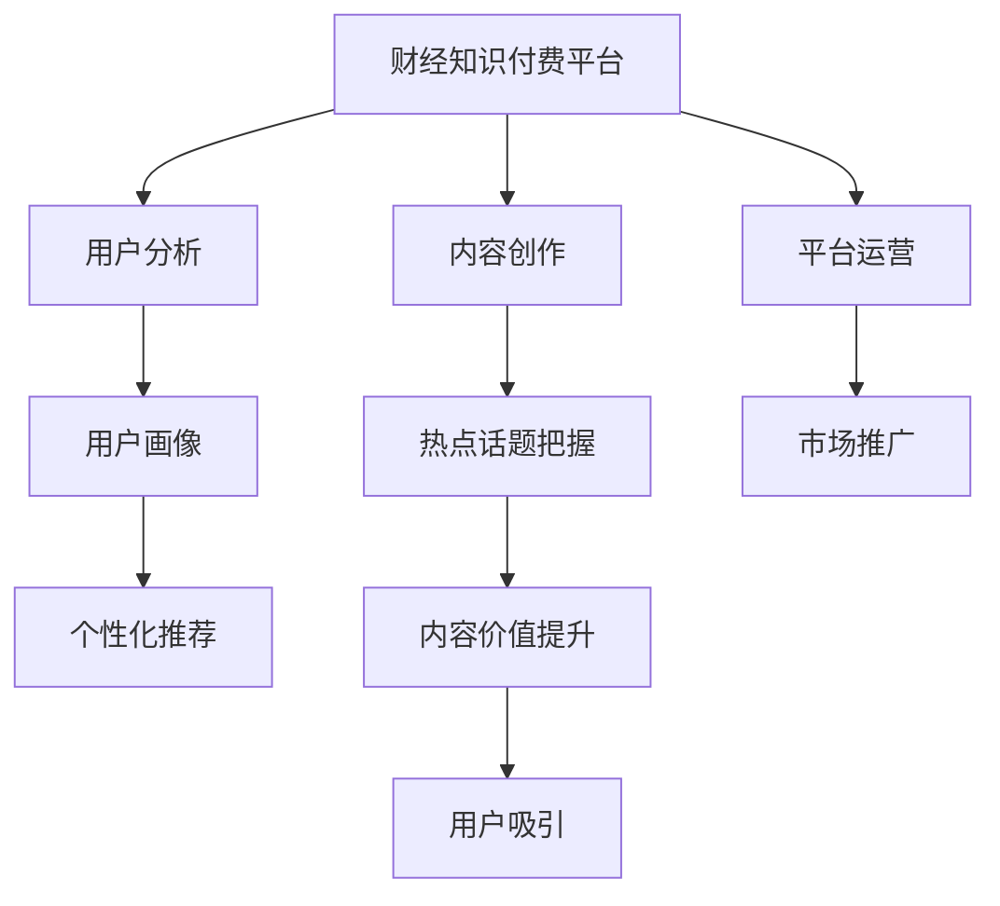

                 

# 财经领域知识付费要及时把握热点话题

## 1. 背景介绍

### 1.1 问题由来
随着互联网的发展，知识付费成为一种新型的内容消费模式。在财经领域，无论是投资者、企业家，还是学生和专业人士，都对财经知识有着强烈的需求。为了满足这种需求，知识付费平台如雨后春笋般涌现，成为互联网产业的重要一环。然而，如何把握财经领域的知识热点，构建有价值的付费内容，成为平台和内容创作者亟需解决的问题。

### 1.2 问题核心关键点
财经领域的知识付费内容需要及时把握市场动态、政策变化、企业新闻等热点话题，以吸引用户订阅和消费。这些热点话题往往与市场波动、公司业绩、行业趋势等密切相关。内容创作者需要具备深厚的财经知识基础，敏锐的市场嗅觉和精准的内容输出能力，才能制作出符合用户需求的高质量内容。

## 2. 核心概念与联系

### 2.1 核心概念概述
- **财经知识付费**：通过互联网平台，以付费方式提供专业财经知识和资讯的服务模式。内容形式包括文章、视频、音频等，旨在帮助用户深入理解财经领域的重要问题和趋势。
- **热点话题**：指在一定时间范围内，引发广泛关注和讨论的市场、政策、企业事件等。热点话题的把握直接影响内容创作的价值和用户吸引力。
- **内容创作**：包括内容策划、信息采集、文章撰写、视频制作、音频录制等多个环节，旨在通过有效传播财经知识，提升用户价值。
- **用户分析**：通过分析用户行为和偏好，识别高价值用户群体，进行个性化推荐和精准营销。
- **平台运营**：包括用户管理、内容发布、数据分析、市场推广等多个方面，旨在提升平台的用户黏性、内容质量和盈利能力。

### 2.2 核心概念原理和架构的 Mermaid 流程图



## 3. 核心算法原理 & 具体操作步骤

### 3.1 算法原理概述

财经领域知识付费的算法原理可以总结为以下几部分：

1. **热点识别**：通过爬虫技术，实时抓取财经领域的各类新闻和数据，如股票市场行情、公司财报、经济政策变化等，构建实时更新的热点事件图谱。
2. **内容创作推荐**：结合热点事件图谱，根据用户的历史行为数据，推荐相关的高价值内容。
3. **用户分析**：通过分析用户订阅内容、阅读时间、评论互动等行为数据，构建用户画像，识别高价值用户群体。
4. **市场推广**：利用用户画像，进行精准的市场推广，提升平台的用户黏性和内容消费量。

### 3.2 算法步骤详解

#### 3.2.1 热点识别

**步骤1:** 抓取财经新闻和数据
- 使用爬虫技术，从财经网站、新闻网站、官方公告等渠道抓取各类财经新闻和数据。
- 实时更新热点事件图谱，涵盖股票市场、公司财报、政策变化等重要信息。

**步骤2:** 筛选热点事件
- 根据新闻标题、关键词、情感极性等指标，对抓取到的新闻进行筛选和排序。
- 利用机器学习算法，自动识别和标注热点事件，构建热点事件图谱。

**步骤3:** 实时更新热点事件图谱
- 实时监控财经市场动态，及时更新热点事件图谱。
- 定期对热点事件进行评估和校正，确保热点识别的准确性和时效性。

#### 3.2.2 内容创作推荐

**步骤1:** 内容创作
- 根据热点事件图谱，策划和创作有价值的内容。
- 内容形式包括文章、视频、音频等，力求深入浅出，通俗易懂。

**步骤2:** 内容发布
- 将创作好的内容发布到平台，并进行分类和标签标注。
- 设置内容的热点标签，方便用户检索和浏览。

**步骤3:** 内容推荐
- 利用用户画像和行为数据，推荐相关的高价值内容。
- 采用协同过滤、内容推荐算法等技术，提升内容推荐的精准度。

#### 3.2.3 用户分析

**步骤1:** 用户行为数据分析
- 收集用户订阅内容、阅读时间、评论互动等行为数据。
- 通过数据挖掘和机器学习算法，构建用户画像。

**步骤2:** 高价值用户识别
- 根据用户画像，识别高价值用户群体。
- 通过个性化推荐和精准营销，提升高价值用户的粘性和消费量。

#### 3.2.4 市场推广

**步骤1:** 市场推广策略制定
- 根据用户画像和内容消费数据，制定精准的市场推广策略。
- 设定推广渠道和预算，选择合适的推广方式。

**步骤2:** 推广执行
- 利用社交媒体、搜索引擎营销、内容合作等手段，进行市场推广。
- 监控推广效果，及时调整策略，提升推广效果。

### 3.3 算法优缺点

#### 优点：

1. **实时性高**：通过实时抓取和更新财经新闻和数据，可以迅速捕捉市场热点，保持内容的实时性。
2. **精准度高**：通过用户行为数据分析和机器学习算法，可以实现精准的内容推荐和用户画像构建。
3. **推广效果显著**：通过精准的市场推广策略，提升用户黏性和内容消费量。

#### 缺点：

1. **数据获取难度大**：需要抓取各类财经新闻和数据，可能面临数据格式、数据源不一致等问题。
2. **算法复杂度高**：涉及数据挖掘、机器学习、内容推荐等多个环节，算法实现复杂。
3. **用户隐私问题**：在用户行为数据分析和个性化推荐过程中，可能涉及用户隐私保护问题。

### 3.4 算法应用领域

财经领域的知识付费算法可以广泛应用于以下场景：

1. **股票市场分析**：通过实时抓取和分析财经新闻和数据，提供股票市场行情分析和投资建议。
2. **企业财报分析**：利用财务数据和市场新闻，提供企业财报分析和估值预测。
3. **经济政策分析**：分析经济政策变化，提供政策解读和未来预测。
4. **行业趋势分析**：识别和分析各行业的市场动态和趋势，提供行业报告和投资建议。
5. **个性化推荐**：根据用户行为数据，提供个性化内容推荐，提升用户粘性和消费量。

## 4. 数学模型和公式 & 详细讲解 & 举例说明

### 4.1 数学模型构建

设 $X$ 为财经领域的新闻事件集合，$Y$ 为每个新闻事件的热点标签集合。构建热点事件图谱的数学模型如下：

$$
\mathcal{G} = (X, Y, W)
$$

其中 $X = \{x_1, x_2, \ldots, x_n\}$ 为新闻事件集合，$Y = \{y_1, y_2, \ldots, y_m\}$ 为热点标签集合，$W$ 为事件-标签权重矩阵，用于表示每个事件与每个标签的相关度。

### 4.2 公式推导过程

**公式1: 热点事件识别**

$$
W_{ij} = f(x_i, y_j) = \frac{\log P(y_j|x_i)}{\log \sum_{j=1}^m P(y_j|x_i)}
$$

其中 $f(x_i, y_j)$ 为事件 $x_i$ 与标签 $y_j$ 的相关度，$P(y_j|x_i)$ 为事件 $x_i$ 在标签 $y_j$ 下的概率。

**公式2: 内容推荐算法**

$$
r(u,v) = \alpha f_u(u) \cdot f_v(v) + (1-\alpha) \cdot \phi(u,v)
$$

其中 $r(u,v)$ 为用户 $u$ 对内容 $v$ 的推荐概率，$f_u(u)$ 为用户 $u$ 的热点事件权重，$f_v(v)$ 为内容 $v$ 的热点事件权重，$\phi(u,v)$ 为基于用户行为和内容特征的协同过滤推荐概率，$\alpha$ 为调节因子。

**公式3: 用户画像构建**

$$
p_u = \sum_{i=1}^n \frac{\omega_i}{\sum_{i=1}^n \omega_i} x_i
$$

其中 $p_u$ 为用户 $u$ 的行为特征向量，$x_i$ 为事件 $i$ 的行为特征，$\omega_i$ 为事件 $i$ 的权重，通常为用户的互动频率和评价得分。

### 4.3 案例分析与讲解

假设有一个财经知识付费平台，使用算法模型识别热点事件并推荐相关内容。具体步骤如下：

**步骤1:** 构建热点事件图谱
- 通过爬虫技术，实时抓取财经网站的新闻和数据。
- 对新闻进行关键词提取和情感分析，判断其热度。
- 利用公式1计算每个事件与每个标签的相关度，构建事件-标签权重矩阵 $W$。

**步骤2:** 内容推荐
- 根据用户行为数据，使用公式2计算用户 $u$ 对内容 $v$ 的推荐概率 $r(u,v)$。
- 将推荐结果展示给用户，并进行个性化调整。

**步骤3:** 用户画像构建
- 收集用户订阅内容、阅读时间、评论互动等行为数据。
- 利用公式3计算用户 $u$ 的行为特征向量 $p_u$，构建用户画像。

## 5. 项目实践：代码实例和详细解释说明

### 5.1 开发环境搭建

为进行财经知识付费的算法实践，我们需要搭建一个基本的开发环境。具体步骤如下：

**步骤1:** 安装Python
- 从官网下载并安装Python 3.x版本，推荐使用Anaconda进行环境管理。

**步骤2:** 安装相关库
- 使用pip安装Scrapy、BeautifulSoup、Tqdm等爬虫库。
- 使用pip安装Scikit-learn、Pandas、Numpy等数据分析和机器学习库。

**步骤3:** 搭建服务器环境
- 部署Nginx、Apache等Web服务器，用于内容发布和用户访问。
- 安装MySQL、Redis等数据库和缓存系统，存储和管理用户数据和内容。

### 5.2 源代码详细实现

以下是一个简单的财经新闻抓取和热点事件识别的Python代码示例：

```python
import scrapy
from scrapy.crawler import CrawlerProcess
from beautifulsoup4 import BeautifulSoup
import numpy as np
from sklearn.feature_extraction.text import CountVectorizer

class FinanceNewsSpider(scrapy.Spider):
    name = 'finance_news'
    start_urls = ['http://finance.com']

    def parse(self, response):
        news = []
        for item in response.css('div.news-item'):
            title = item.css('h2.title::text').get()
            content = item.css('div.content::text').get()
            news.append((item.css('a.news-link::attr(href)').get(), title, content))
        yield news

def extract_keywords(text):
    soup = BeautifulSoup(text, 'html.parser')
    keywords = []
    for tag in soup.find_all(['h1', 'h2', 'h3', 'h4', 'h5', 'h6']):
        keywords.append(tag.get_text().strip())
    return keywords

def extract_sentiment(text):
    # 使用情感分析模型，返回情感极性
    return sentiment_analysis(text)

def extract_heatmap(data, keywords, sentiment):
    heatmap = np.zeros((len(keywords), 2))
    for i, news in enumerate(data):
        keywords_list = extract_keywords(news[2])
        sentiment_list = extract_sentiment(news[2])
        for j, keyword in enumerate(keywords_list):
            if keyword in keywords:
                heatmap[j, 0] += 1
            if sentiment_list[i] > 0:
                heatmap[j, 1] += 1
    return heatmap

# 使用Scrapy抓取财经新闻
process = CrawlerProcess()
process.crawl(FinanceNewsSpider)
process.start()

# 对抓取的新闻进行情感分析
data = process.crawl(FinanceNewsSpider)
sentiment_scores = []
for news in data:
    sentiment_scores.append(extract_sentiment(news[2]))

# 构建热点事件图谱
keywords = set()
for news in data:
    keywords_list = extract_keywords(news[2])
    keywords.update(keywords_list)

heatmap = extract_heatmap(data, keywords, sentiment_scores)
```

### 5.3 代码解读与分析

**步骤1:** 定义Spider类
- 定义一个Spider类，设置爬虫的起始URL和解析函数。
- 使用Scrapy库的爬虫功能，抓取财经网站的新闻内容。

**步骤2:** 提取新闻关键词和情感
- 定义提取关键词和情感的函数，使用BeautifulSoup库解析新闻内容。
- 使用情感分析模型，对新闻情感进行打分。

**步骤3:** 构建热点事件图谱
- 定义构建热点事件图谱的函数，统计每个关键词的出现次数和情感极性。
- 将关键词和情感数据转换为热力图，便于可视化展示。

### 5.4 运行结果展示

运行上述代码，可以获取财经网站的新闻内容，并进行关键词和情感分析。根据热力图结果，可以识别出当前财经领域的热点事件和情感趋势。

## 6. 实际应用场景

### 6.1 股票市场分析

财经知识付费平台可以利用热点事件图谱，实时提供股票市场行情分析和投资建议。例如，对于某公司发布财报的新闻，平台可以自动推荐相关的分析文章、市场预测和投资建议，帮助投资者做出决策。

### 6.2 企业财报分析

利用财经知识付费平台，企业可以获取到及时的市场和政策动态，并进行财报分析和估值预测。平台可以提供定期的财报分析报告，帮助企业制定有效的市场策略。

### 6.3 经济政策分析

财经知识付费平台可以分析经济政策变化，提供政策解读和未来预测。平台可以邀请专家学者，进行政策分析和解读，帮助企业和个人理解政策变化带来的影响。

### 6.4 行业趋势分析

财经知识付费平台可以识别和分析各行业的市场动态和趋势，提供行业报告和投资建议。平台可以提供详细的行业分析报告，帮助企业和投资者了解行业发展趋势。

## 7. 工具和资源推荐

### 7.1 学习资源推荐

- **《金融市场分析》课程**：提供金融市场分析的理论与实践，涵盖股票市场、债券市场、货币市场等。
- **《数据分析与Python》书籍**：详细介绍Python在数据分析中的应用，涵盖数据爬取、数据清洗、数据可视化等。
- **《自然语言处理与深度学习》课程**：由斯坦福大学开设的NLP明星课程，涵盖NLP基础、深度学习模型等。
- **HuggingFace官方文档**：提供TensorFlow和PyTorch的深度学习模型，涵盖情感分析、文本分类等任务。

### 7.2 开发工具推荐

- **PyTorch**：基于Python的深度学习框架，支持高效的模型构建和训练。
- **TensorFlow**：由Google开发的深度学习框架，支持大规模模型训练和分布式计算。
- **Scrapy**：Python爬虫框架，用于高效抓取和处理Web数据。
- **BeautifulSoup**：Python库，用于解析HTML和XML文档。
- **Tqdm**：Python库，用于进度条可视化，提升开发效率。

### 7.3 相关论文推荐

- **《金融市场分析》书籍**：详细分析金融市场的基本理论、交易策略和风险管理。
- **《数据分析与Python》书籍**：详细介绍Python在数据分析中的应用，涵盖数据处理、数据可视化等。
- **《自然语言处理与深度学习》课程**：涵盖NLP基础、深度学习模型等，适合进阶学习。
- **HuggingFace官方文档**：提供TensorFlow和PyTorch的深度学习模型，涵盖情感分析、文本分类等任务。

## 8. 总结：未来发展趋势与挑战

### 8.1 研究成果总结

财经知识付费平台的算法模型，通过热点事件图谱的构建和内容推荐，提升了平台的内容价值和用户粘性。用户画像的构建和市场推广策略的制定，进一步提升了平台的盈利能力。

### 8.2 未来发展趋势

1. **智能化提升**：利用深度学习和自然语言处理技术，提升内容推荐的智能化水平。
2. **个性化推荐**：根据用户行为和内容特征，实现更加精准的内容推荐。
3. **市场推广**：通过精准的市场推广策略，提升平台的市场份额和用户黏性。
4. **数据融合**：将财经数据、市场数据和社交数据等融合，提供更全面的分析报告。
5. **用户互动**：利用聊天机器人等技术，提升用户互动和参与度。

### 8.3 面临的挑战

1. **数据质量问题**：财经数据存在格式不一、数据源复杂等问题，需要高质量的数据采集和清洗。
2. **算法复杂性**：财经数据分析涉及多种算法和技术，算法实现复杂。
3. **用户隐私保护**：在用户行为数据和内容推荐过程中，需要保护用户隐私，避免数据泄露。
4. **市场竞争激烈**：财经知识付费市场竞争激烈，需要不断提升平台的内容质量和用户体验。

### 8.4 研究展望

未来，财经知识付费平台的算法将不断智能化、个性化和市场化，提升平台的用户价值和盈利能力。同时，需要注意数据质量、算法复杂性、用户隐私和市场竞争等挑战，确保平台的健康发展和可持续发展。

## 9. 附录：常见问题与解答

**Q1: 财经知识付费平台的核心竞争力是什么？**

A: 财经知识付费平台的核心竞争力在于其对财经领域热点话题的及时把握和内容创作的精准推荐。平台通过算法模型和数据挖掘技术，构建热点事件图谱，进行个性化内容推荐，提升用户粘性和消费量。同时，利用用户画像和市场推广策略，提升平台的盈利能力。

**Q2: 如何提升财经内容的质量？**

A: 提升财经内容的质量需要从多个方面入手：
1. **内容创作**：邀请行业专家和学者，创作高质量的财经分析和预测文章。
2. **数据来源**：使用权威和可靠的数据源，确保数据的准确性和及时性。
3. **用户互动**：利用聊天机器人等技术，与用户进行互动，了解用户需求和反馈。
4. **算法优化**：持续优化算法模型，提升内容推荐的智能化和精准度。

**Q3: 如何保护用户隐私？**

A: 保护用户隐私需要采取以下措施：
1. **数据匿名化**：对用户数据进行匿名化处理，保护用户隐私。
2. **加密存储**：使用加密技术，保护数据在传输和存储过程中的安全。
3. **合规性**：遵守相关法律法规，确保数据处理和使用符合合规要求。

**Q4: 如何应对市场竞争？**

A: 应对市场竞争需要从多个方面入手：
1. **内容创新**：持续推出高质量的内容，提升用户价值。
2. **市场推广**：利用精准的市场推广策略，提升平台的用户黏性和市场份额。
3. **技术创新**：利用新技术和新算法，提升平台的智能化和个性化水平。
4. **用户服务**：提供优质的用户服务，提升用户体验和满意度。

总之，财经知识付费平台的算法需要不断优化和创新，才能在激烈的市场竞争中脱颖而出，为用户和投资者提供价值。

---

作者：禅与计算机程序设计艺术 / Zen and the Art of Computer Programming

