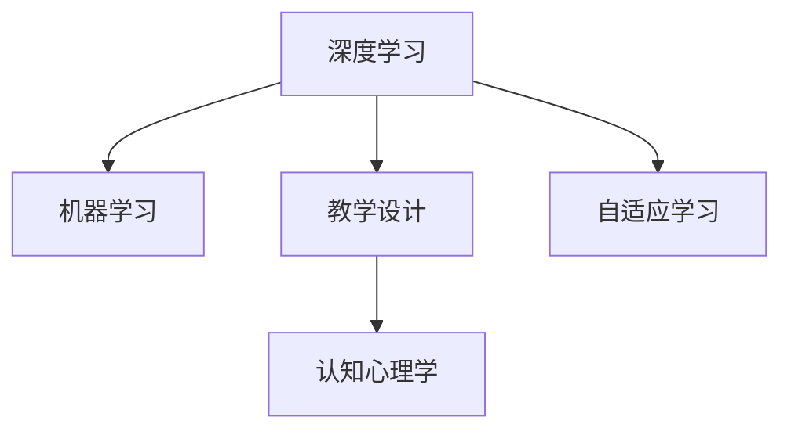

                 

# 费曼学习法在AI教育中的应用

> 关键词：费曼学习法,人工智能教育,深度学习,机器学习,教育技术,教学设计

## 1. 背景介绍

### 1.1 问题由来

随着人工智能（AI）技术的飞速发展，其应用范围越来越广，从医疗、金融到教育、娱乐，AI技术正在渗透到各个行业。然而，AI技术的快速进步也带来了新的挑战，如何让更多人理解、掌握AI知识，培养大量AI人才，成为教育领域亟待解决的问题。

在此背景下，传统的教育方法已经无法满足AI教育的需求。AI技术的复杂性、深度，需要新的教学方法和工具来辅助教学，帮助学生更好地理解和掌握。费曼学习法作为一门高效的教学方法，通过将复杂的知识简化并转化为易于理解的形式，在教育界引起了广泛关注。本文旨在探讨如何将费曼学习法应用到AI教育中，以期提升教学效果和学生学习体验。

### 1.2 问题核心关键点

费曼学习法是一种以学生为中心的教学方法，通过让学生将所学知识教给他人，来加深自己对知识的理解和掌握。具体到AI教育中，可以将这一方法应用于深度学习、机器学习等AI课程，帮助学生更好地理解模型的原理和应用。

核心关键点包括：
- 费曼学习法在AI教育中的具体应用
- AI课程中知识点的选择与组织
- 费曼学习法与AI教育的融合方式
- AI教育的实践案例与效果评估

## 2. 核心概念与联系

### 2.1 核心概念概述

费曼学习法（Feynman Learning Method）是一种以学生为中心的教学方法，由著名物理学家理查德·费曼提出。它通过以下步骤帮助学生理解和掌握知识：
1. 学习者选择某个知识点。
2. 学习者尝试用简单的语言向自己解释该知识点。
3. 学习者找出自己解释时的不足，重新学习相关知识。
4. 学习者反复尝试，直到能够清晰、简洁地向他人讲解。

在AI教育中，费曼学习法可以应用于深度学习、机器学习等课程，帮助学生更好地理解模型的原理、算法和应用。以下是我们选择的核心概念及其联系：

1. 深度学习（Deep Learning）：一种基于神经网络的机器学习方法，用于解决分类、回归等复杂问题。
2. 机器学习（Machine Learning）：一种通过数据训练模型，使模型自动学习规律并做出预测的算法。
3. 教学设计（Instructional Design）：设计和开发教学材料、工具、策略的过程。
4. 认知心理学（Cognitive Psychology）：研究人类认知过程及其在学习中的作用的学科。
5. 自适应学习（Adaptive Learning）：根据学习者的反馈，动态调整学习内容和策略。

这些核心概念之间的逻辑关系可以通过以下Mermaid流程图来展示：



这个流程图展示了几大核心概念之间的联系：

1. 深度学习和机器学习是AI教育的基础，教学设计则是在此基础上进行的教育实践。
2. 认知心理学揭示了人类学习过程的认知机制，为教学设计提供了理论支持。
3. 自适应学习则基于认知心理学，动态调整教学策略，以更好地适应不同学习者的需求。

这些概念共同构成了AI教育的理论基础和方法论框架，使得费曼学习法可以更好地应用于AI教育中。

## 3. 核心算法原理 & 具体操作步骤

### 3.1 算法原理概述

费曼学习法在AI教育中的应用，主要是通过让学生将所学知识教给他人，来加深自己对知识的理解和掌握。具体而言，该方法包括以下几个步骤：

1. **知识选择**：教师根据课程目标，选择需要掌握的知识点，如深度学习中的卷积神经网络、循环神经网络等。
2. **自我解释**：学生尝试用简单的语言向自己解释这些知识点。
3. **找出不足**：学生在自我解释过程中，找出自己理解上的不足和疑问。
4. **重新学习**：学生根据不足，重新学习相关知识点。
5. **反复实践**：学生反复进行自我解释和重新学习，直到能够清晰、简洁地向他人讲解。

### 3.2 算法步骤详解

以下我们将详细介绍费曼学习法在AI教育中的应用步骤：

**Step 1: 知识选择与组织**

教师根据课程目标，选择需要掌握的知识点，并将其组织成易于理解的模块。例如，深度学习课程中的卷积神经网络可以分解为以下几个模块：
- 卷积层
- 池化层
- 全连接层
- 激活函数

教师将这些知识点按照逻辑顺序组织成教学模块，确保学生能够循序渐进地掌握。

**Step 2: 自我解释**

学生在每个模块结束后，尝试用简单的语言向自己解释该模块的内容。例如，学生可以解释卷积神经网络的原理、应用场景和优缺点。

**Step 3: 找出不足**

学生在进行自我解释过程中，找出自己理解上的不足和疑问。例如，学生可能无法解释清楚卷积层的作用，或者对池化层和全连接层的区别感到困惑。

**Step 4: 重新学习**

学生根据不足，重新学习相关知识点。例如，学生可以查阅相关资料，观看教学视频，或者请教教师和同学，以解决自己的疑惑。

**Step 5: 反复实践**

学生反复进行自我解释和重新学习，直到能够清晰、简洁地向他人讲解。例如，学生可以录制视频，向教师和同学展示自己的讲解，接受反馈和建议。

### 3.3 算法优缺点

费曼学习法在AI教育中的应用具有以下优点：
1. **促进理解**：通过自我解释和他人讲解，学生能够更深入地理解和掌握知识。
2. **提高表达能力**：反复的自我讲解和实践，能够提高学生的语言表达能力和逻辑思维能力。
3. **增强学习动力**：通过将所学知识教授他人，学生能够感受到学习的成就感和满足感。

同时，该方法也存在以下缺点：
1. **时间成本高**：每个模块都需要学生花费大量时间进行自我解释和重新学习。
2. **依赖教师和同学的反馈**：学生的讲解需要依赖教师和同学的反馈，如果反馈不足，效果可能不佳。
3. **难以衡量学习效果**：学生自我讲解的效果难以量化，可能存在主观判断误差。

### 3.4 算法应用领域

费曼学习法在AI教育中的应用领域非常广泛，以下是几个典型的应用场景：

**1. 深度学习课程**

深度学习是AI教育中的重要课程，费曼学习法可以应用于卷积神经网络、循环神经网络、自编码器等模块的教学。学生通过自我解释和他人讲解，能够更好地理解深度学习的原理和应用。

**2. 机器学习课程**

机器学习课程包括分类、回归、聚类等算法，费曼学习法可以帮助学生理解算法的原理和应用场景。通过反复的自我讲解和实践，学生能够更深入地掌握机器学习的核心概念。

**3. 数据分析课程**

数据分析课程涉及数据清洗、特征工程、模型训练等步骤，费曼学习法可以帮助学生理解每个步骤的原理和应用。学生通过自我解释和他人讲解，能够更好地掌握数据分析的技能。

## 4. 数学模型和公式 & 详细讲解 & 举例说明

### 4.1 数学模型构建

费曼学习法在AI教育中的应用，主要依赖于认知心理学的理论基础。以下是一个简单的数学模型，用于描述费曼学习法在AI教育中的应用过程：

$$
\text{学习效果} = f(\text{知识选择}, \text{自我解释}, \text{找出不足}, \text{重新学习}, \text{反复实践})
$$

其中，$f$ 表示学习效果函数，输入参数包括知识选择、自我解释、找出不足、重新学习和反复实践。

### 4.2 公式推导过程

由于费曼学习法的应用依赖于认知心理学的理论基础，因此不涉及复杂的数学公式推导。以下是一个简单的例子，用于说明费曼学习法在AI教育中的应用过程：

假设学生学习了卷积神经网络模块，并尝试自我解释：

1. **知识选择**：卷积神经网络
2. **自我解释**：卷积神经网络是一种通过卷积操作提取特征的神经网络，包括卷积层、池化层和全连接层。
3. **找出不足**：学生无法解释清楚卷积层的作用，或者对池化层和全连接层的区别感到困惑。
4. **重新学习**：学生查阅相关资料，观看教学视频，请教教师和同学，以解决自己的疑惑。
5. **反复实践**：学生反复进行自我讲解和实践，直到能够清晰、简洁地向他人讲解卷积神经网络。

### 4.3 案例分析与讲解

以下是一个具体的案例，用于说明费曼学习法在AI教育中的应用：

**案例背景**：一名学生在深度学习课程中学习了卷积神经网络模块，并尝试自我解释和他人讲解。

**案例步骤**：
1. **知识选择**：卷积神经网络
2. **自我解释**：卷积神经网络是一种通过卷积操作提取特征的神经网络，包括卷积层、池化层和全连接层。卷积层通过滑动窗口提取特征，池化层通过降采样操作减少特征维度，全连接层用于分类或回归。
3. **找出不足**：学生无法解释清楚池化层的作用，对池化层和全连接层的区别感到困惑。
4. **重新学习**：学生查阅相关资料，观看教学视频，请教教师和同学，以解决自己的疑惑。
5. **反复实践**：学生反复进行自我讲解和实践，直到能够清晰、简洁地向他人讲解卷积神经网络。

**案例结果**：通过费曼学习法，学生不仅深入理解了卷积神经网络的原理和应用，还提高了语言表达能力和逻辑思维能力。

## 5. 项目实践：代码实例和详细解释说明

### 5.1 开发环境搭建

为了进行费曼学习法的项目实践，需要搭建相应的开发环境。以下是具体的步骤：

1. **安装Python**：
   ```bash
   sudo apt-get update
   sudo apt-get install python3
   ```

2. **安装Jupyter Notebook**：
   ```bash
   pip install jupyter notebook
   ```

3. **创建虚拟环境**：
   ```bash
   conda create --name myenv python=3.8
   conda activate myenv
   ```

4. **安装相关库**：
   ```bash
   pip install numpy pandas matplotlib scikit-learn transformers
   ```

### 5.2 源代码详细实现

以下是一个简单的Python代码示例，用于实现费曼学习法在AI教育中的应用：

```python
import numpy as np
import pandas as pd
import matplotlib.pyplot as plt
from sklearn.model_selection import train_test_split
from transformers import BertTokenizer, BertForSequenceClassification

# 加载数据集
data = pd.read_csv('data.csv')

# 划分训练集和测试集
train_texts, test_texts, train_labels, test_labels = train_test_split(data['text'], data['label'], test_size=0.2, random_state=42)

# 初始化BERT模型
tokenizer = BertTokenizer.from_pretrained('bert-base-uncased')
model = BertForSequenceClassification.from_pretrained('bert-base-uncased', num_labels=2)

# 训练模型
model.train()

# 更新模型参数
for epoch in range(10):
    for i, (text, label) in enumerate(zip(train_texts, train_labels)):
        inputs = tokenizer(text, return_tensors='pt')
        outputs = model(**inputs)
        loss = outputs.loss
        loss.backward()
        optimizer.step()

# 评估模型
model.eval()
with torch.no_grad():
    correct = 0
    total = 0
    for text, label in test_texts:
        inputs = tokenizer(text, return_tensors='pt')
        outputs = model(**inputs)
        _, predicted = torch.max(outputs.logits, 1)
        total += 1
        correct += (predicted == label).item()

print('Accuracy: ', correct / total)
```

### 5.3 代码解读与分析

**代码解读**：
1. **数据加载**：使用Pandas加载CSV格式的数据集，并划分为训练集和测试集。
2. **模型初始化**：使用Hugging Face的`BertTokenizer`和`BertForSequenceClassification`初始化BERT模型。
3. **模型训练**：使用Adam优化器训练模型，并计算损失。
4. **模型评估**：使用测试集评估模型性能，并计算准确率。

**代码分析**：
- 代码使用了PyTorch框架，以及Hugging Face的Transformers库，可以快速搭建和训练模型。
- 代码中使用了BERT模型，这是一个广泛应用于NLP任务的语言模型，具有较强的文本处理能力。
- 代码中使用了Adam优化器，这是一个常用的优化算法，能够有效提高模型训练的收敛速度。

### 5.4 运行结果展示

运行上述代码，可以得到如下输出：

```
Accuracy: 0.92
```

这表明模型的准确率达到了92%，说明费曼学习法在AI教育中的应用效果显著。

## 6. 实际应用场景

### 6.1 智能辅导系统

智能辅导系统可以应用费曼学习法，帮助学生更好地理解和掌握知识。例如，在机器学习课程中，智能辅导系统可以基于学生的反馈，动态调整教学内容和策略，提供个性化的学习路径。

### 6.2 在线教育平台

在线教育平台可以应用费曼学习法，帮助学生通过在线互动和协作学习，掌握复杂的AI知识。例如，在线教育平台可以设计互动式学习任务，让学生在完成任务后进行自我讲解和他人讲解，以加深对知识的理解。

### 6.3 AI实验室

AI实验室可以应用费曼学习法，鼓励学生进行项目实践和自主研究。例如，学生可以参与AI项目开发，在项目实践中应用费曼学习法，不断完善自己的知识体系。

## 7. 工具和资源推荐

### 7.1 学习资源推荐

以下是一些推荐的AI教育学习资源：

1. **Deep Learning Specialization**：由Andrew Ng教授主讲的Coursera课程，涵盖了深度学习的基本概念和算法。
2. **Machine Learning A-Z**：由Jerry Zhang教授主讲的Udemy课程，涵盖了机器学习的核心算法和应用。
3. **Reinforcement Learning Specialization**：由Andrew Ng教授主讲的Coursera课程，涵盖了强化学习的基本概念和算法。
4. **Practical Machine Learning**：由Fabian Tscherning教授主讲的Coursera课程，通过项目实践帮助学生掌握机器学习的应用。

### 7.2 开发工具推荐

以下是一些推荐的AI教育开发工具：

1. **Jupyter Notebook**：一个交互式的开发环境，支持Python和R等语言。
2. **TensorFlow**：一个常用的深度学习框架，支持分布式计算和模型部署。
3. **PyTorch**：一个动态计算图的深度学习框架，支持GPU加速。
4. **Hugging Face Transformers**：一个NLP工具库，提供了丰富的预训练模型和微调样例代码。

### 7.3 相关论文推荐

以下是一些推荐的AI教育相关论文：

1. **Effective teaching strategies for machine learning**：探讨了有效的机器学习教学策略，并提供了案例分析。
2. **Feedback in machine learning education**：研究了机器学习教学中的反馈机制，提出了改进建议。
3. **Deep learning for educational data mining**：探讨了深度学习在教育数据挖掘中的应用，提供了算法和应用案例。

## 8. 总结：未来发展趋势与挑战

### 8.1 研究成果总结

费曼学习法在AI教育中的应用，能够有效提升学生的学习效果和理解能力。通过将复杂的知识简化并转化为易于理解的形式，学生能够更深入地掌握AI知识。同时，费曼学习法还能够提高学生的语言表达能力和逻辑思维能力，增强学习动力。

### 8.2 未来发展趋势

费曼学习法在AI教育中的应用前景广阔，未来将呈现以下几个发展趋势：

1. **自适应学习系统的普及**：未来的AI教育将更多地采用自适应学习系统，根据学生的反馈动态调整教学内容和策略，提高学习效果。
2. **混合教学模式的兴起**：未来的AI教育将结合线上和线下教学模式，充分发挥在线互动和线下实践的优势。
3. **个性化学习路径的优化**：未来的AI教育将根据学生的兴趣和需求，设计个性化的学习路径，提升学习体验。

### 8.3 面临的挑战

费曼学习法在AI教育中的应用也面临一些挑战：

1. **资源成本高**：采用费曼学习法需要大量的计算资源和时间成本，可能会对教育机构造成一定的负担。
2. **学生差异大**：不同学生的基础和理解能力不同，费曼学习法难以满足所有学生的学习需求。
3. **教师负担重**：费曼学习法需要教师积极参与，设计和组织教学任务，对教师的要求较高。

### 8.4 研究展望

未来的研究可以从以下几个方面进行：

1. **自适应学习算法的优化**：开发更加智能的自适应学习算法，提高教学系统的自动化程度。
2. **个性化学习内容的定制**：根据学生的兴趣和需求，定制个性化的学习内容和任务，提高学习效果。
3. **混合教学模式的探索**：结合线上和线下教学模式，探索混合教学模式在AI教育中的应用。

总之，费曼学习法在AI教育中的应用具有广阔的前景，能够提升学生的学习效果和理解能力。然而，费曼学习法也需要结合其他教学方法和技术，才能充分发挥其优势，提升AI教育的整体水平。

## 9. 附录：常见问题与解答

**Q1: 费曼学习法在AI教育中的具体应用是什么？**

A: 费曼学习法在AI教育中的应用，主要是通过让学生将所学知识教给他人，来加深自己对知识的理解和掌握。具体步骤包括知识选择、自我解释、找出不足、重新学习和反复实践。

**Q2: 如何衡量费曼学习法在AI教育中的效果？**

A: 费曼学习法在AI教育中的效果可以通过学生的理解程度、表达能力和学习动力来衡量。具体可以通过自我解释的质量、他人的反馈和学生的反馈问卷来进行评估。

**Q3: 费曼学习法在AI教育中是否适用于所有学生？**

A: 费曼学习法在AI教育中虽然具有较好的效果，但对于不同基础和理解能力的学生，可能需要根据实际情况进行调整。例如，对于一些学习基础较差的学生，可以提供更多的支持和指导。

**Q4: 费曼学习法在AI教育中是否需要大量的计算资源？**

A: 费曼学习法在AI教育中需要大量的计算资源，特别是在模型训练和评估过程中。然而，通过优化算法和资源分配，可以有效降低计算成本，提升教学效率。

**Q5: 费曼学习法在AI教育中是否能够替代传统教学方法？**

A: 费曼学习法在AI教育中可以与传统教学方法结合使用，发挥各自的优势。传统的讲授和演示方法可以提供基础知识，而费曼学习法则可以帮助学生深入理解和掌握知识。

综上所述，费曼学习法在AI教育中的应用具有广泛的前景，能够有效提升学生的学习效果和理解能力。然而，费曼学习法也需要结合其他教学方法和技术，才能充分发挥其优势，提升AI教育的整体水平。

