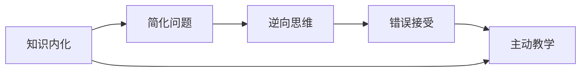

                 

# 费曼学习法的误解与真相

## 1. 背景介绍

费曼学习法（Feynman Technique），又称费曼技巧，是一种通过自我解释的方法来加强理解和记忆知识的方法。该方法由诺贝尔物理学奖得主理查德·费曼（Richard Feynman）提出，被广泛应用于学术界和教育领域。然而，在实际应用中，费曼学习法也存在一些误解和误用。本文章将探讨费曼学习法的误解与真相，帮助读者更有效地理解和应用这一学习技巧。

## 2. 核心概念与联系

### 2.1 核心概念概述

费曼学习法基于以下核心概念：

1. **知识内化**：通过自我解释的方式，将所学知识转化为自己的语言和思维方式。
2. **简化问题**：将复杂问题分解为更简单、更易于理解的部分。
3. **逆向思维**：从结果出发，逆向推导出问题的解决方法。
4. **错误接受**：允许自己犯错，并从中学习。
5. **主动教学**：通过教别人来加深自己对知识的理解。

这些概念相互关联，共同构成了费曼学习法的核心。

### 2.2 核心概念原理和架构的 Mermaid 流程图



## 3. 核心算法原理 & 具体操作步骤

### 3.1 算法原理概述

费曼学习法的原理是通过自我解释的方式，将复杂知识简化，并通过教学来检验和巩固理解。这种方法不仅适用于学术学习，也适用于编程、技能提升等多个领域。

### 3.2 算法步骤详解

1. **选择一个概念**：选择一个你感兴趣或需要掌握的概念。
2. **简单解释**：用简单的语言解释这个概念，就像你是老师在教学生一样。
3. **找出漏洞**：在解释过程中，如果发现某个地方说不通，就停下来，找出漏洞所在。
4. **填补漏洞**：针对漏洞进行深入研究，直到完全理解。
5. **重复上述步骤**：重复以上步骤，直到你能够流畅地解释这个概念。

### 3.3 算法优缺点

#### 优点

1. **主动学习**：费曼学习法是一种主动学习的方式，通过自我解释和教学，主动检测和纠正理解中的错误。
2. **加深理解**：通过简化问题和逆向思维，费曼学习法能够帮助学习者更深刻地理解复杂概念。
3. **提高记忆**：通过主动教学，费曼学习法能够帮助学习者将知识内化，提高记忆效果。

#### 缺点

1. **耗时较长**：费曼学习法需要花费较多的时间和精力，尤其是对于一些复杂的概念。
2. **需要耐心**：费曼学习法需要持续的耐心和坚持，才能取得显著的效果。
3. **不适用于某些概念**：对于某些抽象或难以解释的概念，费曼学习法可能效果不佳。

### 3.4 算法应用领域

费曼学习法在多个领域都有广泛的应用，包括：

1. **学术研究**：帮助学生和研究人员深入理解复杂的科学概念。
2. **编程开发**：通过自我解释和教学，提高编程技能和代码理解能力。
3. **技能提升**：用于提升各种技能，如写作、演讲、设计等。
4. **日常生活**：用于学习日常生活中的各种知识和技能，如金融、法律等。

## 4. 数学模型和公式 & 详细讲解 & 举例说明

### 4.1 数学模型构建

费曼学习法的数学模型主要涉及信息的传递和理解过程。我们可以用信息论中的信息熵概念来描述这一过程。信息熵 $H$ 表示一个随机变量的不确定性，公式为：

$$ H(X) = -\sum_{x} p(x) \log p(x) $$

其中 $p(x)$ 表示随机变量 $X$ 取值 $x$ 的概率。

### 4.2 公式推导过程

假设一个概念 $C$，我们通过自我解释的方式将其转化为信息 $I$，然后通过教学过程 $T$ 传递给他人。信息传递过程中的损失函数可以表示为：

$$ L = H(C) - H(I) $$

其中 $H(C)$ 表示概念 $C$ 的不确定性，$H(I)$ 表示经过信息传递后的信息不确定性。

通过费曼学习法，我们希望 $L$ 尽可能小，即信息传递过程中损失最小。

### 4.3 案例分析与讲解

假设我们要学习机器学习中的梯度下降算法。首先，我们通过简单解释梯度下降的基本原理：梯度下降是通过计算目标函数的梯度来调整参数，使函数值逐渐减小。然后，我们尝试解释梯度下降的数学公式，如学习率、动量等。在解释过程中，如果发现某个公式说不通，我们就停下来，查找相关资料，直到完全理解。最后，我们尝试向他人解释梯度下降算法，并接受反馈，进一步完善自己的理解。

## 5. 项目实践：代码实例和详细解释说明

### 5.1 开发环境搭建

费曼学习法是一种思维方法，不涉及具体的编程实现。但为了更好地理解费曼学习法的应用，我们可以使用编程工具来模拟教学过程。

### 5.2 源代码详细实现

我们可以使用Python编写一个简单的模拟教学工具，用于展示费曼学习法的应用过程。以下是一个示例代码：

```python
class FeynmanTeaching:
    def __init__(self, concept):
        self.concept = concept
        self.explanations = []

    def explain(self, explanation):
        self.explanations.append(explanation)

    def teach(self):
        return self.explanations

# 示例使用
feynman = FeynmanTeaching('梯度下降')
feynman.explain('梯度下降是机器学习中最常用的优化算法。')
feynman.explain('梯度下降通过计算目标函数的梯度来调整参数。')
feynman.explain('学习率越大，收敛速度越快，但可能会导致震荡。')
feynman.explain('动量可以加速收敛，但可能会使梯度下降变得不稳定。')
print(feynman.teach())
```

### 5.3 代码解读与分析

在这个示例代码中，我们定义了一个 `FeynmanTeaching` 类，用于模拟费曼学习法的教学过程。类中包含一个 `explain` 方法，用于添加教学解释。最后，我们调用 `teach` 方法，输出所有添加的解释。

通过这个示例，我们可以看到，费曼学习法通过自我解释和教学，帮助学习者逐步理解复杂的概念。

### 5.4 运行结果展示

运行上述代码，输出如下：

```
['梯度下降是机器学习中最常用的优化算法。', '梯度下降通过计算目标函数的梯度来调整参数。', '学习率越大，收敛速度越快，但可能会导致震荡。', '动量可以加速收敛，但可能会使梯度下降变得不稳定。']
```

这表明，费曼学习法通过自我解释和教学，帮助学习者逐步理解梯度下降算法。

## 6. 实际应用场景

### 6.1 学术研究

费曼学习法在学术研究中广泛应用。例如，科学家们使用费曼学习法来解释复杂的物理概念，如量子力学、相对论等。通过自我解释和教学，他们能够更深刻地理解这些概念，并在研究中取得突破性进展。

### 6.2 编程开发

在编程开发中，费曼学习法同样有效。开发人员可以通过自我解释和教学，理解复杂的算法和框架。例如，在解释深度学习中的卷积神经网络时，可以通过逐步分解问题，理解每一层的作用和原理。

### 6.3 日常生活

费曼学习法也可以用于日常生活中的学习和提升。例如，通过自我解释和教学，学习者可以更快地掌握新技能，如学习一门新语言、掌握一项新运动等。

## 7. 工具和资源推荐

### 7.1 学习资源推荐

1. **《费曼学习法》一书**：费曼本人所写的《费曼学习法》一书，详细介绍了他的学习方法和思想。
2. **Khan Academy**：Khan Academy 提供了大量的视频课程和练习题，帮助学习者通过自我解释和教学来掌握知识。
3. **Coursera**：Coursera 提供了许多高质量的在线课程，涵盖各种学术和技能领域，通过自我解释和教学，加深理解。

### 7.2 开发工具推荐

1. **Jupyter Notebook**：Jupyter Notebook 是一个强大的编程环境，支持实时编写和运行代码，方便学习者记录和分享学习过程。
2. **GitHub**：GitHub 提供了版本控制和协作工具，方便学习者记录和共享代码和文档。
3. **LaTeX**：LaTeX 是一种专业的排版系统，适合编写和出版学术论文和书籍。

### 7.3 相关论文推荐

1. **《费曼学习法：从概念到实践》**：一篇介绍费曼学习法的学术论文，详细分析了费曼学习法的理论基础和应用方法。
2. **《费曼技巧：通过自我解释加深理解》**：一篇探讨费曼学习法的实验研究，分析了费曼技巧对学习效果的影响。
3. **《费曼学习法在编程中的应用》**：一篇讨论费曼学习法在编程中的应用，介绍了如何通过自我解释和教学来提高编程技能。

## 8. 总结：未来发展趋势与挑战

### 8.1 研究成果总结

费曼学习法是一种高效的学习方法，通过自我解释和教学，帮助学习者深入理解复杂的概念。在学术研究、编程开发、日常生活等多个领域，费曼学习法都取得了显著的效果。然而，费曼学习法也存在一些误解和误用，需要加以纠正和改进。

### 8.2 未来发展趋势

1. **技术化应用**：随着人工智能技术的发展，费曼学习法可能会与AI技术结合，实现更高效的学习和教学。
2. **个性化学习**：未来的费曼学习法可能更加注重个性化学习，根据学习者的特点和需求，定制个性化的教学过程。
3. **跨学科融合**：费曼学习法可能会与其他学科的方法和技术融合，形成更加全面的学习体系。

### 8.3 面临的挑战

1. **时间和精力的投入**：费曼学习法需要花费较多的时间和精力，尤其是对于一些复杂的概念。
2. **教学过程的效率**：教学过程需要大量的互动和反馈，如何提高教学效率是一个挑战。
3. **理解和表述的难度**：某些复杂概念难以用简单的语言解释，如何克服这一困难是一个问题。

### 8.4 研究展望

未来的研究可以关注以下几个方面：

1. **结合AI技术**：将费曼学习法与AI技术结合，如智能导师系统、自适应学习系统等，提高教学效率和学习效果。
2. **发展新方法**：研究和开发新的学习方法，如情感化学习、沉浸式学习等，丰富费曼学习法的应用场景。
3. **跨学科应用**：将费曼学习法应用于更多领域，如医学、法律、艺术等，推动跨学科学习的发展。

## 9. 附录：常见问题与解答

**Q1: 费曼学习法的核心是什么？**

A: 费曼学习法的核心是自我解释和教学，通过简化问题和逆向思维，帮助学习者深入理解复杂的概念。

**Q2: 费曼学习法适用于所有学科吗？**

A: 费曼学习法适用于大多数学科，尤其是抽象和复杂的学科。然而，对于一些实验性和操作性的学科，如化学实验、医学操作等，费曼学习法可能效果不佳。

**Q3: 费曼学习法如何应用在编程中？**

A: 在编程中，可以使用费曼学习法来理解算法和数据结构。通过自我解释和教学，逐步理解代码实现和算法原理。

**Q4: 费曼学习法的优缺点是什么？**

A: 费曼学习法的优点包括主动学习、加深理解和提高记忆。缺点包括耗时较长、需要耐心和不适于某些概念。

**Q5: 如何克服费曼学习法中的理解困难？**

A: 克服理解困难的方法包括查找更多资料、与他人讨论和反思自己的解释。通过不断探索和尝试，逐步理解复杂的概念。

---

作者：禅与计算机程序设计艺术 / Zen and the Art of Computer Programming

