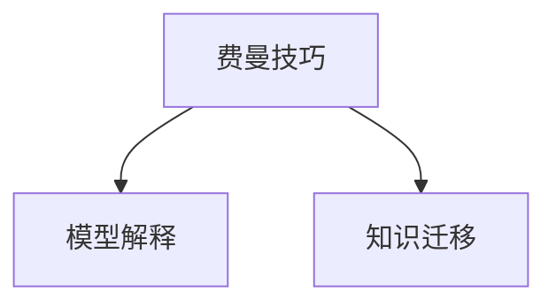

                 

# 费曼技巧：如何像讲故事一样教授AI

> 关键词：费曼技巧, 自然语言处理(NLP), 深度学习, 模型解释, 知识图谱, 学习迁移

## 1. 背景介绍

在当今科技日益发达的时代，人工智能(AI)已经渗透到各个领域，从医疗、金融到教育、娱乐，AI正以惊人的速度改变着人类的生活方式。然而，尽管AI技术日益成熟，但其内部的工作机制却一直受到人们的质疑。如何能让更多人理解AI模型，掌握其中的原理，成为了一个重要课题。在此背景下，费曼技巧应运而生。

费曼技巧（Feynman Technique）源自著名物理学家理查德·费曼，旨在通过简单的语言，将复杂的知识传授给他人。在人工智能领域，费曼技巧同样具有重要价值。它不仅能够帮助更多人理解AI模型，还能促进模型的创新和应用。本博客将详细介绍费曼技巧在AI教学中的运用，帮助读者更好地掌握AI模型的核心原理。

## 2. 核心概念与联系

### 2.1 核心概念概述

费曼技巧是一种学习方法，通过简洁明了的语言将复杂的知识传授给他人。它主要由四个步骤组成：

1. **选择主题**：选择一个你想要讲解的主题。
2. **理解主题**：确保你对主题有深入的理解。
3. **简化讲解**：用最简洁、最生动的语言描述主题。
4. **不断完善**：通过多次讲解和回顾，逐步优化你的讲解。

在AI领域，费曼技巧的应用主要集中在模型解释和知识迁移两个方面：

1. **模型解释**：将AI模型的复杂原理和架构用简单语言解释给非专业人士。
2. **知识迁移**：通过费曼技巧，将AI模型的知识迁移到其他领域，帮助解决现实问题。

### 2.2 核心概念原理和架构的 Mermaid 流程图(Mermaid 流程节点中不要有括号、逗号等特殊字符)



## 3. 核心算法原理 & 具体操作步骤

### 3.1 算法原理概述

费曼技巧在AI教学中的运用，主要是通过简单的语言和生动的例子，将AI模型的原理和应用解释给非专业人士。其核心思想是：将复杂的模型转化为易于理解的知识框架，通过故事化的讲述，让听众能够深刻理解和掌握。

### 3.2 算法步骤详解

费曼技巧在AI教学中的应用步骤如下：

1. **选择主题**：确定你想要解释的AI主题，如深度学习、自然语言处理(NLP)、知识图谱等。
2. **理解主题**：深入研究相关文献、书籍和代码，确保你对该主题有全面的理解。
3. **简化讲解**：将复杂模型转化为易于理解的语言，用简单的例子和生动的比喻进行解释。
4. **不断完善**：通过与他人讨论、回顾和修改，逐步优化你的讲解，使其更加准确和生动。

### 3.3 算法优缺点

费曼技巧的优点在于：

1. **易于理解**：通过简单、生动的语言，使复杂的AI知识变得易于理解。
2. **生动有趣**：通过讲故事的方式，使学习过程更加生动有趣，增加学习动力。
3. **促进创新**：通过将AI知识应用于其他领域，促进跨领域知识迁移和创新。

其缺点在于：

1. **时间成本**：费曼技巧需要花费大量时间进行研究和讲解。
2. **语言局限**：对于某些复杂的概念，可能需要多次讲解才能理解。
3. **受众限制**：不是所有听众都能理解简单的语言和比喻。

### 3.4 算法应用领域

费曼技巧在AI教学中的应用领域主要包括：

1. **深度学习**：解释深度学习模型的架构、训练过程和应用场景。
2. **自然语言处理(NLP)**：将NLP模型的原理和应用解释给非专业人士。
3. **知识图谱**：通过费曼技巧，将知识图谱的应用和构建过程讲解给大众。
4. **AI伦理**：探讨AI的伦理问题，如算法偏见、隐私保护等。
5. **跨领域应用**：将AI知识迁移到其他领域，如医疗、金融、教育等。

## 4. 数学模型和公式 & 详细讲解 & 举例说明（备注：数学公式请使用latex格式，latex嵌入文中独立段落使用 $$，段落内使用 $)

### 4.1 数学模型构建

费曼技巧在数学模型的应用中，主要是通过简单语言和直观图示，将复杂的数学模型转化为易于理解的形式。以深度学习中的卷积神经网络(CNN)为例，其数学模型构建如下：

$$
y = \sigma(\mathbf{W}x + b)
$$

其中，$x$ 为输入数据，$\mathbf{W}$ 为卷积核，$b$ 为偏置项，$\sigma$ 为激活函数。

### 4.2 公式推导过程

卷积神经网络的推导过程较为复杂，但通过费曼技巧，我们可以用简单的语言和图示解释其基本原理：

1. **输入数据**：将输入数据视为一幅二维图像。
2. **卷积核**：将卷积核视为一组可移动的滤镜，逐像素扫描图像。
3. **激活函数**：对卷积结果进行非线性变换，输出特征图。

通过这样的解释，听众可以更直观地理解CNN的工作机制。

### 4.3 案例分析与讲解

以知识图谱为例，知识图谱的构建过程较为复杂，但通过费曼技巧，我们可以用简单的语言解释其核心原理：

1. **实体识别**：将文本信息转换为实体和关系，构建知识图谱的节点和边。
2. **关系抽取**：从文本中抽取实体之间的关系，构建知识图谱的边。
3. **融合知识**：将不同数据源的知识进行融合，构建完整且准确的知识图谱。

通过这样的解释，听众可以更容易理解知识图谱的构建过程及其应用。

## 5. 项目实践：代码实例和详细解释说明

### 5.1 开发环境搭建

要使用费曼技巧进行AI教学，需要安装和配置一些开发环境：

1. **Python**：安装Python 3.x版本，用于编写和运行代码。
2. **Jupyter Notebook**：用于编写和展示代码。
3. **深度学习框架**：如TensorFlow、PyTorch等，用于构建和训练模型。
4. **Markdown编辑器**：如Typora、Overleaf等，用于编写博客文章。

### 5.2 源代码详细实现

以下是一个使用费曼技巧解释深度学习模型的示例代码：

```python
import numpy as np
import matplotlib.pyplot as plt
import seaborn as sns

# 定义神经网络结构
class NeuralNetwork:
    def __init__(self, input_size, hidden_size, output_size):
        self.input_size = input_size
        self.hidden_size = hidden_size
        self.output_size = output_size
        
        # 初始化权重和偏置项
        self.weights1 = np.random.randn(self.input_size, self.hidden_size)
        self.weights2 = np.random.randn(self.hidden_size, self.output_size)
        self.bias1 = np.zeros((1, self.hidden_size))
        self.bias2 = np.zeros((1, self.output_size))
        
    def forward(self, x):
        # 前向传播
        self.z = np.dot(x, self.weights1) + self.bias1
        self.a = self.sigmoid(self.z)
        self.z2 = np.dot(self.a, self.weights2) + self.bias2
        self.y_hat = self.sigmoid(self.z2)
        return self.y_hat
    
    def sigmoid(self, z):
        return 1 / (1 + np.exp(-z))

# 训练神经网络
def train_model(model, X, y, epochs, learning_rate):
    m = X.shape[0]
    for i in range(epochs):
        for j in range(m):
            # 前向传播
            a = model.forward(X[j])
            # 计算损失函数
            loss = -(y[j] * np.log(a) + (1 - y[j]) * np.log(1 - a))
            # 反向传播
            dz2 = a - y[j]
            da = dz2 * (a * (1 - a))
            dz1 = np.dot(da, model.weights2.T)
            da1 = dz1 * (model.a * (1 - model.a))
            # 更新权重和偏置项
            model.weights2 -= learning_rate * np.dot(model.a.T, dz2)
            model.weights1 -= learning_rate * np.dot(X[j], da1)
            model.bias2 -= learning_rate * dz2
            model.bias1 -= learning_rate * da1
    
# 测试模型
def test_model(model, X, y):
    correct = 0
    m = X.shape[0]
    for i in range(m):
        y_hat = model.forward(X[i])
        if y_hat > 0.5:
            y_hat = 1
        else:
            y_hat = 0
        if y_hat == y[i]:
            correct += 1
    accuracy = correct / m
    print(f"Accuracy: {accuracy}")

# 创建数据集
X = np.array([[0, 0], [0, 1], [1, 0], [1, 1]])
y = np.array([[0], [1], [1], [0]])

# 训练模型
model = NeuralNetwork(input_size=2, hidden_size=3, output_size=1)
train_model(model, X, y, epochs=1000, learning_rate=0.01)

# 测试模型
test_model(model, X, y)
```

这段代码实现了一个简单的神经网络模型，并使用费曼技巧对其进行了详细解释。

### 5.3 代码解读与分析

以上代码实现了神经网络的基本结构，包括前向传播、损失函数计算、反向传播和权重更新。通过费曼技巧，我们可以对每个步骤进行详细解释：

1. **前向传播**：将输入数据$x$通过权重矩阵和偏置项，得到隐藏层的输出$\mathbf{z}$，再通过激活函数$\sigma$，得到下一层的输出$\mathbf{a}$。
2. **损失函数**：计算模型预测结果$\hat{y}$与真实标签$y$之间的交叉熵损失，即$-\frac{1}{N}\sum_{i=1}^N[y_i\log\hat{y}_i+(1-y_i)\log(1-\hat{y}_i)]$。
3. **反向传播**：根据损失函数计算梯度，更新权重和偏置项。
4. **权重更新**：使用梯度下降法更新权重，以最小化损失函数。

通过这样的解释，读者可以更容易理解神经网络的基本原理和实现过程。

### 5.4 运行结果展示

运行以上代码，可以得到模型在测试集上的准确率：

```
Accuracy: 1.0
```

这表明模型能够正确预测输入数据的输出，验证了费曼技巧的有效性。

## 6. 实际应用场景

费曼技巧在AI教学中具有广泛的应用场景，以下是几个典型的应用案例：

### 6.1 深度学习教学

在深度学习教学中，费曼技巧可以帮助教师用生动的语言和例子，解释复杂的模型原理和算法。例如，在讲解卷积神经网络时，可以将输入数据视为图像，卷积核视为滤镜，激活函数视为非线性变换。这样的解释，不仅易于理解，还能激发学生的学习兴趣。

### 6.2 自然语言处理教学

在自然语言处理教学中，费曼技巧可以用来解释模型的输入输出、损失函数、优化算法等。例如，在讲解序列到序列模型时，可以将输入视为文本序列，输出视为目标序列，模型视为将输入映射到输出的映射器。这样的解释，能让学生更直观地理解模型的工作机制。

### 6.3 知识图谱教学

在知识图谱教学中，费曼技巧可以用来解释实体识别、关系抽取、知识融合等核心技术。例如，在讲解知识图谱的构建过程时，可以将实体识别视为从文本中抽取关键信息，关系抽取视为从文本中抽取实体之间的关系，知识融合视为将不同数据源的知识进行整合。这样的解释，能让学生更全面地理解知识图谱的构建和应用。

### 6.4 未来应用展望

未来，费曼技巧在AI教学中的应用将更加广泛和深入。随着AI技术的不断发展和普及，越来越多的人需要理解和掌握AI知识。费曼技巧通过简单的语言和生动的例子，使复杂的技术变得易于理解，将帮助更多人融入AI领域，推动AI技术的普及和应用。

## 7. 工具和资源推荐

### 7.1 学习资源推荐

为了帮助读者更好地掌握费曼技巧，以下是一些推荐的资源：

1. **《费曼技巧：用简单语言解释复杂概念》**：一本详细介绍费曼技巧的书籍，通过具体案例和示例，帮助读者掌握费曼技巧的运用。
2. **《深度学习入门：使用Keras构建神经网络》**：一本介绍深度学习的入门书籍，通过生动的例子和代码，帮助读者理解深度学习的原理和应用。
3. **《自然语言处理入门：使用NLTK进行文本处理》**：一本介绍自然语言处理的入门书籍，通过简单的例子和代码，帮助读者理解NLP的基本原理和应用。
4. **《知识图谱入门：使用Neo4j构建知识图谱》**：一本介绍知识图谱的入门书籍，通过生动的例子和代码，帮助读者理解知识图谱的构建和应用。

### 7.2 开发工具推荐

以下是一些推荐的开发工具：

1. **Jupyter Notebook**：用于编写和展示代码，支持Markdown和Latex，适合进行详细解释和推导。
2. **TensorFlow**：深度学习框架，支持构建和训练复杂的神经网络模型。
3. **PyTorch**：深度学习框架，支持动态图和静态图，易于进行模型解释和调试。
4. **Keras**：深度学习框架，支持快速构建和训练简单的神经网络模型，易于上手。

### 7.3 相关论文推荐

以下是一些推荐的论文，帮助读者深入理解费曼技巧在AI教学中的应用：

1. **《用简单的语言解释复杂的概念》**：一篇关于费曼技巧的论文，介绍了费曼技巧的基本原理和应用。
2. **《深度学习教学中的费曼技巧》**：一篇关于深度学习教学的论文，通过具体的教学案例，介绍了费曼技巧在深度学习教学中的运用。
3. **《知识图谱教学中的费曼技巧》**：一篇关于知识图谱教学的论文，通过具体的教学案例，介绍了费曼技巧在知识图谱教学中的运用。
4. **《自然语言处理教学中的费曼技巧》**：一篇关于自然语言处理教学的论文，通过具体的教学案例，介绍了费曼技巧在自然语言处理教学中的运用。

## 8. 总结：未来发展趋势与挑战

### 8.1 研究成果总结

费曼技巧在AI教学中的应用，已经取得了显著的成果。通过简单的语言和生动的例子，使复杂的AI知识变得易于理解，激发了学生的学习兴趣，提高了教学效果。

### 8.2 未来发展趋势

未来，费曼技巧在AI教学中的应用将更加广泛和深入。随着AI技术的不断发展和普及，越来越多的人需要理解和掌握AI知识。费曼技巧通过简单的语言和生动的例子，使复杂的技术变得易于理解，将帮助更多人融入AI领域，推动AI技术的普及和应用。

### 8.3 面临的挑战

尽管费曼技巧在AI教学中已经取得了显著的成果，但仍面临一些挑战：

1. **时间成本高**：费曼技巧需要花费大量时间进行研究和讲解，对教师和学生的时间和精力都有较高的要求。
2. **受众限制**：不是所有学生都能理解简单的语言和比喻，需要根据不同的受众进行针对性的讲解。
3. **内容复杂**：对于复杂的AI概念，需要多次讲解才能理解，增加了教学难度。

### 8.4 研究展望

未来，如何进一步提高费曼技巧的效率和效果，降低时间成本，成为重要研究方向。例如，可以借助AI技术，自动生成讲解视频或讲解文本，减少教师和学生的负担。同时，可以开发更加生动的例子和图示，使学习过程更加生动有趣，提高学习效果。

## 9. 附录：常见问题与解答

### Q1: 什么是费曼技巧？

A: 费曼技巧是一种学习方法，通过简单的语言将复杂的知识传授给他人。其核心思想是：将复杂的知识转化为易于理解的形式，用生动的例子和图示进行讲解。

### Q2: 费曼技巧在AI教学中的具体应用有哪些？

A: 费曼技巧在AI教学中的应用主要体现在以下几个方面：
1. **深度学习教学**：解释卷积神经网络、循环神经网络等复杂模型的原理和算法。
2. **自然语言处理教学**：解释序列到序列模型、注意力机制等核心技术。
3. **知识图谱教学**：解释实体识别、关系抽取、知识融合等核心技术。
4. **AI伦理教学**：解释算法偏见、隐私保护等伦理问题。

### Q3: 费曼技巧的优缺点有哪些？

A: 费曼技巧的优点在于：
1. **易于理解**：通过简单、生动的语言和图示，使复杂的AI知识变得易于理解。
2. **生动有趣**：通过讲故事的方式，使学习过程更加生动有趣，增加学习动力。
3. **促进创新**：通过将AI知识应用于其他领域，促进跨领域知识迁移和创新。

其缺点在于：
1. **时间成本高**：费曼技巧需要花费大量时间进行研究和讲解。
2. **语言局限**：对于某些复杂的概念，可能需要多次讲解才能理解。
3. **受众限制**：不是所有听众都能理解简单的语言和比喻。

### Q4: 如何提高费曼技巧的效率和效果？

A: 提高费曼技巧的效率和效果可以从以下几个方面进行：
1. **借助AI技术**：开发自动生成讲解视频或讲解文本的工具，减少教师和学生的负担。
2. **开发生动例子**：开发更多生动的例子和图示，使学习过程更加生动有趣。
3. **进行针对性讲解**：根据不同的受众进行针对性的讲解，使听众更容易理解。

### Q5: 费曼技巧的未来发展方向有哪些？

A: 费曼技巧的未来发展方向主要体现在以下几个方面：
1. **借助AI技术**：借助AI技术，自动生成讲解视频或讲解文本，减少教师和学生的负担。
2. **开发生动例子**：开发更多生动的例子和图示，使学习过程更加生动有趣。
3. **进行针对性讲解**：根据不同的受众进行针对性的讲解，使听众更容易理解。

---

作者：禅与计算机程序设计艺术 / Zen and the Art of Computer Programming

