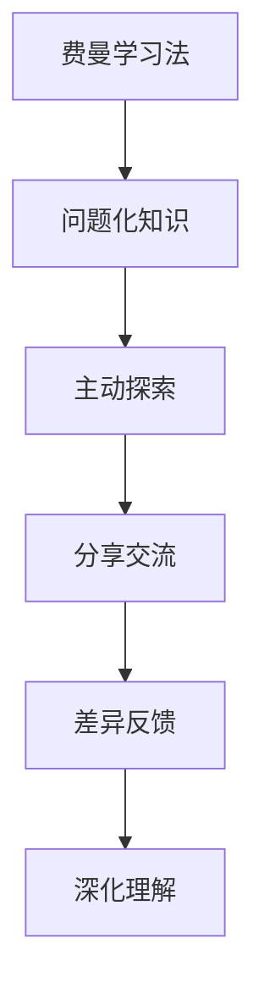

                 

# 费曼提问法促进团队学习与成长

> 关键词：费曼学习法, 知识传播, 问题导向学习, 认知差异, 团队协作

## 1. 背景介绍

### 1.1 问题由来
在现代知识密集型行业中，技术的快速迭代和行业的竞争日益加剧，知识的学习与传播变得至关重要。传统的一对多单向教学模式已无法满足团队成员对知识深度理解和实际应用的需求。为了实现高效的学习效果和快速的知识传递，需要一种更主动、更有互动性的学习方式，这便是费曼提问法的核心所在。

费曼提问法（Feynman Technique），又称为费曼学习法、费曼技巧，由著名物理学家理查德·费曼提出。该方法通过将复杂的知识通过问题化的形式拆解为简单的、易于理解的部分，使得学习者能够在自主探索和讨论交流中高效掌握知识。

### 1.2 问题核心关键点
费曼提问法的核心理念是通过设置问题来驱动学习的内在动机，通过引导思考和交流来促进知识的深入理解和传播。其关键点包括：
- **问题化知识**：将复杂的知识拆解为易于理解的问题，形成问题的逻辑链条。
- **主动探索**：学习者通过提出问题和解答问题，主动探索和验证知识。
- **分享交流**：通过教他人来巩固自己的知识，验证自己的理解。
- **差异反馈**：学习者通过与他人的互动，找到认知差异，进一步巩固和扩展知识。

该方法强调知识的内化和外化，重视主动学习与互动交流，适用于各种团队学习和知识传播场景，如项目开发、技术培训、知识分享会等。

## 2. 核心概念与联系

### 2.1 核心概念概述

为了更好地理解费曼提问法，我们需要对其中的关键概念进行解释，并说明它们之间的联系。

- **费曼学习法**：由物理学家费曼提出，旨在通过构建问题的链条来引导学习者的思维过程，从而加深对知识的理解和记忆。
- **问题化知识**：将复杂知识拆解为一系列简单且相互关联的问题，形成知识链条。
- **主动探索**：学习者通过提出问题并寻找答案，主动探索知识的内在逻辑和关联。
- **分享交流**：通过教他人来检验和巩固自己的理解，同时从他人的反馈中获得新的见解和启发。
- **差异反馈**：通过与他人对比，识别自己的认知误区和知识盲点，进一步深化理解。

这些概念之间的联系通过以下Mermaid流程图展示：

该图展示了费曼提问法的核心流程，从构建问题链条开始，通过主动探索、分享交流和差异反馈，逐步深化学习者的理解和记忆。

## 3. 核心算法原理 & 具体操作步骤
### 3.1 算法原理概述

费曼提问法虽然不涉及具体的算法原理，但其操作过程可以通过类比计算机科学的算法来理解。该方法本质上是一个迭代式的知识内化和外化的过程，类似于循环迭代算法。

### 3.2 算法步骤详解

费曼提问法的具体实施步骤包括：

1. **问题化知识**：将复杂的知识点拆解为一系列简单易懂的问题，形成知识链条。
2. **主动探索**：针对每个问题，学习者进行独立思考和深入研究，查找资料或利用已有知识进行推理。
3. **分享交流**：将探索到的答案以简明的方式向他人解释，并接受他人的反馈和质疑。
4. **差异反馈**：分析反馈中的认知差异和错误，进行修正和补充。
5. **深化理解**：通过反复迭代上述步骤，逐步深化对知识点的理解和记忆。

### 3.3 算法优缺点

费曼提问法的优点在于其互动性和深度性，能够有效促进知识的内化和外化，增强团队成员的知识理解能力和问题解决能力。具体而言，其优点包括：

- **主动学习**：通过问题驱动的方式，激发学习者的自主学习动机。
- **互动交流**：通过教他人，使学习者能够检验和巩固自己的理解，避免单向被动学习。
- **差异反馈**：通过与他人的互动，识别认知误区和知识盲点，深化理解。

然而，该方法也存在一些缺点：

- **需要时间和耐心**：问题链条构建和解答过程耗时较长，对于快速知识传播可能不适用。
- **依赖参与者素质**：需要学习者具备较高的思考和表达能力，对参与者素质要求较高。
- **难以标准化**：不同人提出的问题和解答方式可能差异较大，难以形成统一的标准化流程。

### 3.4 算法应用领域

费曼提问法在各种团队学习和知识传播场景中均有广泛应用，例如：

- **技术培训**：在软件开发、硬件设计等技术培训中，通过构建问题链条，引导学员进行主动探索和交流。
- **项目开发**：在项目开发过程中，通过问题化复杂问题，促进团队成员的深度理解和协同合作。
- **知识分享会**：在知识分享会中，通过构建问题链条，让分享者深入讲解，让听众主动思考和提问。

此外，费曼提问法还可以应用于科研论文的撰写、学术交流、教育培训等多个领域，促进知识的传播和应用。

## 4. 数学模型和公式 & 详细讲解 & 举例说明

费曼提问法虽然不涉及具体的数学模型，但其操作过程可以通过类比计算模型来理解。以下通过一个简化的例子，说明如何通过费曼提问法来深入理解一个知识点。

### 4.1 数学模型构建

假设有这样一个知识点：“如何用SQL进行多表联合查询？”。我们将该知识点拆解为一系列子问题，形成问题链条：

1. SQL是什么？
2. 什么是多表联合查询？
3. 如何构建多表联合查询语句？
4. 多表联合查询的性能优化有哪些技巧？
5. 多表联合查询有哪些常见的错误和陷阱？

### 4.2 公式推导过程

每个子问题的解答都需要查找资料、实际动手实践、或与他人交流探讨。通过问题链条，逐步深入理解知识点，最后形成一个完整的问题解决框架。

### 4.3 案例分析与讲解

假设有两位技术专家A和B，他们需要共同解决“如何用SQL进行多表联合查询？”这个问题。A提出了第一个子问题“SQL是什么？”，并查找资料进行回答。B则通过该回答，理解了SQL的基本概念，并提出了第二个子问题“什么是多表联合查询？”。A和B通过共同探讨，理解了多表联合查询的基本原理，并提出了第三个子问题“如何构建多表联合查询语句？”。最终，通过一系列问题的逐步解答，A和B共同深入理解了多表联合查询的知识，并能够实际应用到项目开发中。

## 5. 项目实践：代码实例和详细解释说明
### 5.1 开发环境搭建

费曼提问法主要依赖人工交互和思考，不涉及具体的编程实践。但在实际应用中，为了提高效率和规范化流程，可以开发一些辅助工具，例如：

- **问题管理工具**：如Trello、Jira等，用于构建问题链条和跟踪进展。
- **知识库管理工具**：如Confluence、Notion等，用于记录和分享解答内容。

### 5.2 源代码详细实现

由于费曼提问法主要依赖人工操作，不涉及具体的代码实现。但在开发辅助工具时，可以借鉴一些通用的开发框架和库，例如：

- **问题管理工具API**：如Trello API、Jira API等，用于获取和修改问题链条数据。
- **知识库管理API**：如Confluence API、Notion API等，用于存储和检索解答内容。

### 5.3 代码解读与分析

由于费曼提问法主要依赖人工操作，不涉及具体的代码实现。但在开发辅助工具时，需要考虑数据结构的设计、API的接口设计、界面展示的友好性等多个方面。

### 5.4 运行结果展示

运行结果展示主要取决于辅助工具的实现效果，例如：

- **问题管理工具**：展示完整的问题链条，跟踪每个问题的解决进度。
- **知识库管理工具**：展示详细的解答内容，供团队成员学习和参考。

## 6. 实际应用场景
### 6.1 技术培训

在技术培训中，费曼提问法可以通过构建问题链条，引导学员进行主动探索和交流。例如，在介绍数据库索引机制时，可以提出以下问题：

1. 什么是索引？
2. 索引有哪些类型？
3. 索引对查询性能的影响是什么？
4. 如何构建索引？
5. 索引有哪些常见的错误和陷阱？

通过这些问题，学员可以逐步深入理解索引机制，并在实际项目中灵活应用。

### 6.2 项目开发

在项目开发中，费曼提问法可以通过问题化复杂问题，促进团队成员的深度理解和协同合作。例如，在开发新功能时，可以提出以下问题：

1. 这个功能的目标是什么？
2. 该功能有哪些关键的技术点？
3. 该功能有哪些潜在的性能瓶颈？
4. 该功能有哪些常见的错误和陷阱？
5. 该功能如何与现有系统集成？

通过这些问题，团队成员可以深入讨论和理解新功能的实现细节，提高项目开发的质量和效率。

### 6.3 知识分享会

在知识分享会中，费曼提问法可以通过构建问题链条，让分享者深入讲解，让听众主动思考和提问。例如，在分享机器学习算法时，可以提出以下问题：

1. 什么是机器学习？
2. 有哪些常见的机器学习算法？
3. 如何评估机器学习算法的性能？
4. 机器学习算法有哪些常见的错误和陷阱？
5. 机器学习算法如何应用于实际问题？

通过这些问题，分享者可以深入讲解，听众可以主动思考和提问，促进知识的传播和应用。

## 7. 工具和资源推荐
### 7.1 学习资源推荐

为了帮助团队成员掌握费曼提问法的精髓，这里推荐一些优质的学习资源：

1. **费曼学习法入门书籍**：如《如何阅读一本书》、《费曼学习法》等，帮助理解费曼提问法的基本概念和应用。
2. **在线课程和视频**：如Coursera上的“Learning How to Learn”课程，通过视频讲解和实际操作，帮助深入理解费曼提问法。
3. **知识分享平台**：如Medium、知乎等，通过阅读和学习他人的分享，了解费曼提问法的实践案例和经验。

### 7.2 开发工具推荐

费曼提问法主要依赖人工操作，不涉及具体的编程实践。但在开发辅助工具时，可以使用以下工具：

- **问题管理工具**：如Trello、Jira等，用于构建问题链条和跟踪进展。
- **知识库管理工具**：如Confluence、Notion等，用于记录和分享解答内容。
- **协作工具**：如Slack、Microsoft Teams等，用于实时交流和讨论。

### 7.3 相关论文推荐

以下是几篇奠基性的相关论文，推荐阅读：

1. **费曼学习法的心理学基础**：了解费曼学习法的心理学原理，帮助更好地理解其适用性和效果。
2. **费曼提问法的实践案例**：通过具体的案例和实践经验，帮助理解费曼提问法在实际应用中的效果和挑战。
3. **费曼学习法的应用研究**：了解费曼学习法在不同领域的应用效果和创新实践，帮助拓展其应用范围和深度。

## 8. 总结：未来发展趋势与挑战
### 8.1 总结

费曼提问法通过问题化的形式，引导学习者主动探索和交流，实现知识的深度理解和传播。其核心在于构建问题链条，通过主动探索、分享交流和差异反馈，逐步深化学习者的理解和记忆。

### 8.2 未来发展趋势

费曼提问法在未来的发展趋势包括：

- **技术工具的辅助**：随着技术工具的不断进步，辅助费曼提问法的工具将越来越丰富，帮助团队成员更高效地进行知识传播和协作。
- **知识图谱的应用**：通过构建知识图谱，帮助学习者快速理解问题的上下文关系，提高知识传播的效率和效果。
- **多模态知识的融合**：结合文字、视频、音频等多模态知识，丰富费曼提问法的表达形式，提高知识传播的互动性和趣味性。
- **在线学习社区的兴起**：在线学习社区将提供更多的知识分享平台，帮助学习者更便捷地进行知识传播和交流。

### 8.3 面临的挑战

费曼提问法在应用过程中也面临一些挑战：

- **问题链条的设计**：构建问题链条需要经验丰富的专家，对于团队成员的素质要求较高。
- **知识传播的复杂性**：有些知识可能难以通过问题链条进行深入理解和传播，需要结合其他教学方法。
- **互动效果的依赖**：依赖团队成员的积极参与和互动，对团队氛围和成员素质要求较高。

### 8.4 研究展望

费曼提问法作为一项有效的学习方式，未来的研究展望包括：

- **结合AI技术**：利用AI技术自动生成问题链条，提供智能化的知识传播和交流工具。
- **多学科融合**：结合不同学科的知识和问题，构建更全面的问题链条，促进跨学科的学习和创新。
- **在线学习平台的集成**：将费曼提问法集成到在线学习平台，提供更加便捷和高效的知识传播和交流方式。

总之，费曼提问法作为一种高效的学习方式，其核心在于构建问题链条，通过主动探索、分享交流和差异反馈，逐步深化学习者的理解和记忆。在未来的发展中，需要结合技术工具、知识图谱、多模态知识等手段，不断提升其应用效果和普及率。

## 9. 附录：常见问题与解答

**Q1: 如何构建问题链条？**

A: 构建问题链条需要专家对知识点进行深度理解和分解。可以从概念、原理、应用、实例等多个维度进行拆解，形成问题链条。例如，在讲解机器学习算法时，可以构建以下问题链条：

1. 什么是机器学习？
2. 机器学习有哪些常见的算法？
3. 如何评估机器学习算法的性能？
4. 机器学习算法有哪些常见的错误和陷阱？
5. 机器学习算法如何应用于实际问题？

**Q2: 费曼提问法是否适用于所有领域？**

A: 费曼提问法适用于知识密集型领域，但对于一些简单的知识或技能，可能无需使用该方法。需要根据实际情况进行判断和选择。

**Q3: 如何提高费曼提问法的效果？**

A: 提高费曼提问法的效果可以从以下几个方面入手：
1. 构建高质量的问题链条，确保问题具有逻辑性和系统性。
2. 促进团队成员的积极参与和互动，营造良好的学习氛围。
3. 利用辅助工具，如问题管理工具和知识库管理工具，提高知识传播和交流的效率。

**Q4: 费曼提问法是否适用于远程团队？**

A: 费曼提问法同样适用于远程团队，但需要借助在线协作工具和平台，如Slack、Microsoft Teams等，确保团队成员的实时交流和互动。

**Q5: 费曼提问法是否适用于跨学科学习？**

A: 费曼提问法可以应用于跨学科学习，但需要结合不同学科的知识和问题，构建更加全面和系统的问题链条。可以通过邀请不同学科的专家参与讨论，促进跨学科的学习和创新。

作者：禅与计算机程序设计艺术 / Zen and the Art of Computer Programming

