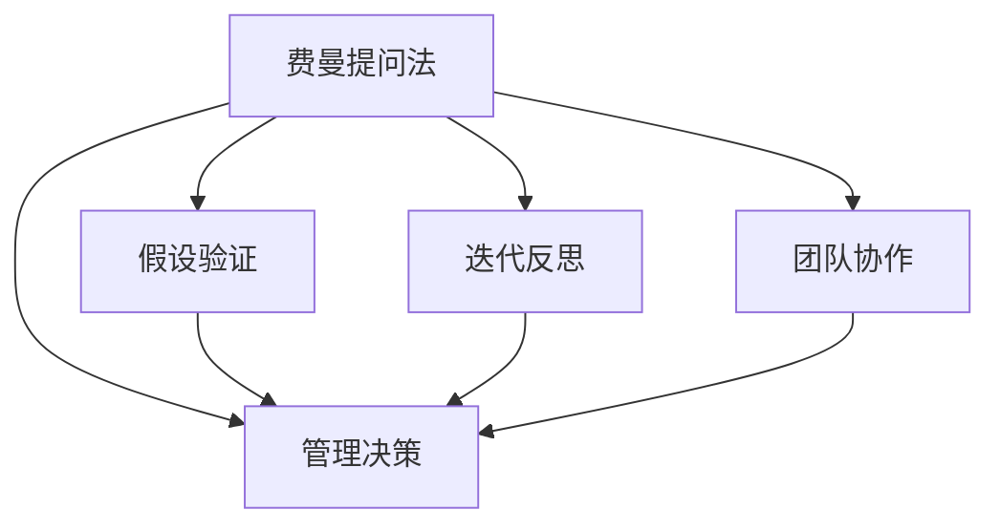

                 

## 1. 背景介绍

### 1.1 问题由来
在当今快速变化和高度不确定的商业环境中，管理决策对企业的成功至关重要。然而，传统的决策方式，如基于经验和直觉的判断，往往不够科学，难以应对复杂多变的环境。近年来，一种新的决策方法逐渐受到关注，它不仅能够促进深入思考，还能提高决策的科学性和系统性。这就是著名的费曼提问法(The Feynman Technique)，一种借鉴科学实验方法和科学探究精神，通过提问、假设验证和迭代反思的流程来提升管理决策质量的方法。

费曼提问法由诺贝尔物理学奖得主理查德·费曼提出，原本用于科学研究和教学。它鼓励以深入、系统的方式探究复杂问题，通过不断提问、验证和反思，逐步逼近问题的核心，揭示隐含的假设和偏见，最终形成可靠、科学的结论。本文将探讨费曼提问法在管理决策中的应用，并结合实际案例，详细介绍如何系统地使用费曼提问法来提升管理决策的科学性和系统性。

### 1.2 问题核心关键点
费曼提问法的核心在于通过一系列深入、系统的问题，逐步揭示问题的本质，验证假设，并持续反思和迭代。这种方法在管理决策中的应用，有助于企业领导者更系统、科学地分析问题，减少偏见和误解，形成更加客观、准确的决策依据。以下是费曼提问法在管理决策中应用的几个关键点：

- **持续提问**：通过不断提问，深入挖掘问题的本质，揭示隐含的假设和偏见。
- **假设验证**：对提出的假设进行科学验证，通过数据和实验来支撑结论。
- **迭代反思**：根据验证结果不断反思和调整问题描述和假设，形成更可靠的决策依据。
- **促进团队协作**：费曼提问法不仅适用于个体思考，还利于团队协作，共同寻找最佳解决方案。

本文将从这些核心点出发，系统介绍费曼提问法在管理决策中的应用。

## 2. 核心概念与联系

### 2.1 核心概念概述

为更好地理解费曼提问法在管理决策中的应用，本节将介绍几个密切相关的核心概念：

- **费曼提问法**：一种科学探究方法，通过提问、假设验证和迭代反思的流程，逐步逼近问题的本质，揭示隐含的假设和偏见。
- **管理决策**：企业中的决策过程，涉及战略、运营、人力资源等多个方面，直接影响企业的成功和发展。
- **假设验证**：通过数据、实验等方式，验证提出的假设，确保结论的可靠性和准确性。
- **迭代反思**：根据假设验证的结果，不断反思和调整问题描述和假设，形成更可靠的决策依据。
- **团队协作**：通过费曼提问法，促进团队成员间的沟通和协作，共同寻找最佳解决方案。

这些核心概念之间的逻辑关系可以通过以下Mermaid流程图来展示：



这个流程图展示了大语言模型的核心概念及其之间的关系：

1. 费曼提问法通过提问、假设验证和迭代反思的流程，帮助管理决策者深入分析问题，揭示假设和偏见。
2. 管理决策是企业中的核心过程，影响企业的战略、运营和人力资源管理等方面。
3. 假设验证通过数据和实验支撑结论，确保假设的可靠性和准确性。
4. 迭代反思根据验证结果不断调整问题描述和假设，形成更可靠的决策依据。
5. 团队协作通过费曼提问法，促进团队成员间的沟通和协作，共同寻找最佳解决方案。

这些概念共同构成了费曼提问法的核心框架，使其能够系统、科学地解决管理决策中的复杂问题。通过理解这些核心概念，我们可以更好地把握费曼提问法的工作原理和优化方向。

## 3. 核心算法原理 & 具体操作步骤
### 3.1 算法原理概述

费曼提问法的原理基于科学探究的方法，通过不断提问、假设验证和迭代反思，逐步逼近问题的本质，揭示隐含的假设和偏见。这种方法在管理决策中的应用，旨在通过深入分析问题，形成可靠、系统的决策依据。

在实际操作中，费曼提问法主要分为以下几个步骤：

1. **持续提问**：对问题进行深入、系统的提问，逐步揭示问题的本质。
2. **假设验证**：对提出的假设进行科学验证，确保结论的可靠性和准确性。
3. **迭代反思**：根据假设验证的结果，不断反思和调整问题描述和假设，形成更可靠的决策依据。
4. **团队协作**：通过费曼提问法，促进团队成员间的沟通和协作，共同寻找最佳解决方案。

这些步骤构成了一个系统、科学的决策流程，通过不断的提问、验证和反思，逐步逼近问题的本质，揭示隐含的假设和偏见。

### 3.2 算法步骤详解

费曼提问法在管理决策中的应用主要包括以下几个关键步骤：

**Step 1: 准备问题基础**

- **确定决策目标**：明确决策的具体目标和影响范围。
- **收集数据**：收集与决策相关的数据和信息。
- **定义问题**：将决策问题抽象为明确的问题描述。

**Step 2: 进行持续提问**

- **列出核心问题**：根据决策目标，列出核心问题，确保问题具体、明确。
- **深入挖掘**：对每个核心问题进行深入挖掘，揭示其背后的假设和偏见。
- **生成假设**：基于问题描述，生成初步的假设。

**Step 3: 假设验证**

- **设计实验**：根据假设，设计实验方案，确保实验能够有效验证假设。
- **执行实验**：按照实验方案执行实验，收集实验数据。
- **分析结果**：对实验数据进行分析，验证假设。

**Step 4: 迭代反思**

- **反思问题描述**：根据实验结果，反思和调整问题描述，确保问题描述的准确性。
- **调整假设**：根据实验结果，调整初步的假设，形成更可靠的结论。
- **形成决策依据**：基于调整后的假设，形成可靠的决策依据。

**Step 5: 团队协作**

- **团队讨论**：将费曼提问法应用于团队讨论，促进团队成员间的沟通和协作。
- **集体决策**：在团队讨论的基础上，形成集体决策。

### 3.3 算法优缺点

费曼提问法在管理决策中的应用具有以下优点：

1. **促进深入思考**：通过持续提问，帮助决策者深入分析问题，揭示隐含的假设和偏见。
2. **提高决策科学性**：通过假设验证，确保结论的可靠性和准确性，提高决策的科学性。
3. **促进团队协作**：通过费曼提问法，促进团队成员间的沟通和协作，共同寻找最佳解决方案。

同时，该方法也存在一定的局限性：

1. **时间成本高**：持续提问、假设验证和迭代反思需要大量时间和精力，对决策速度有一定影响。
2. **复杂度增加**：在处理复杂问题时，可能需要更复杂的提问和验证过程，增加了决策的复杂度。
3. **依赖专业技能**：费曼提问法需要决策者具备一定的科学探究技能和数据分析能力。

尽管存在这些局限性，但就目前而言，费曼提问法仍是一种非常有效的管理决策工具。未来相关研究的重点在于如何进一步优化提问和验证流程，减少时间和资源投入，提高决策效率。

### 3.4 算法应用领域

费曼提问法在管理决策中的应用，已经广泛应用于多个领域，以下是一些典型的应用场景：

- **战略规划**：在制定企业战略时，通过费曼提问法深入分析市场环境、竞争对手、资源限制等关键因素，形成科学、合理的战略方案。
- **运营管理**：在优化运营流程时，通过费曼提问法识别关键问题，提出改进方案，提升运营效率。
- **人力资源管理**：在招聘、培训、绩效评估等方面，通过费曼提问法，提升人力资源管理的科学性和公平性。
- **财务管理**：在财务决策时，通过费曼提问法，深入分析成本、收入、风险等关键因素，形成科学的财务策略。
- **市场营销**：在制定市场营销策略时，通过费曼提问法，深入分析市场环境、客户需求、竞争格局等关键因素，制定有效、可行的市场营销方案。

这些应用场景展示了费曼提问法在管理决策中的广泛适用性和强大功能。

## 4. 数学模型和公式 & 详细讲解  
### 4.1 数学模型构建

费曼提问法在管理决策中的应用，虽然不涉及复杂的数学模型，但可以通过一些简单的数学公式来描述和优化提问和验证过程。

假设决策问题为 $P$，假设列表为 $H$，实验结果为 $E$，则费曼提问法的数学模型可以表示为：

$$
E \leftarrow P \wedge H
$$

其中 $\wedge$ 表示逻辑与。即假设 $H$ 能够解释实验结果 $E$，则假设 $H$ 为真。

### 4.2 公式推导过程

在实际应用中，费曼提问法的提问和验证过程可以抽象为以下步骤：

1. **问题定义**：将决策问题 $P$ 抽象为明确的问题描述 $D$。
2. **假设生成**：基于问题描述 $D$，生成初步的假设 $H_0$。
3. **实验设计**：设计实验方案 $E_0$，确保实验能够有效验证假设 $H_0$。
4. **实验执行**：执行实验 $E_0$，收集实验数据 $D_0$。
5. **假设验证**：根据实验结果 $D_0$，验证假设 $H_0$。如果假设 $H_0$ 解释不了实验结果 $D_0$，则生成新的假设 $H_1$。
6. **迭代反思**：根据新的假设 $H_1$，设计新的实验方案 $E_1$，执行实验 $E_1$，收集实验数据 $D_1$。重复步骤 5 和 6，直到假设 $H_n$ 能够解释实验结果 $D_n$。
7. **形成决策依据**：基于最终假设 $H_n$，形成决策依据 $D_n$。

### 4.3 案例分析与讲解

以一家企业的战略规划为例，展示费曼提问法在管理决策中的应用：

**Step 1: 准备问题基础**

- **确定决策目标**：明确企业的战略目标，例如提升市场份额、优化产品线、扩大国际市场等。
- **收集数据**：收集与决策相关的数据和信息，如市场调研报告、竞争对手分析、财务报表等。
- **定义问题**：将决策问题抽象为明确的问题描述，例如“企业应该如何提升市场份额？”

**Step 2: 进行持续提问**

- **列出核心问题**：列出核心问题，例如“市场需求的增长点在哪里？”、“竞争对手的优劣势是什么？”、“企业资源如何优化配置？”。
- **深入挖掘**：对每个核心问题进行深入挖掘，揭示其背后的假设和偏见。
- **生成假设**：基于问题描述，生成初步的假设，例如“市场需求增长主要在某个细分市场”、“竞争对手在某个领域存在弱点”、“企业资源在某个业务领域存在优化空间”。

**Step 3: 假设验证**

- **设计实验**：设计实验方案，例如市场调研、竞争对手分析、资源配置优化等。
- **执行实验**：按照实验方案执行实验，收集实验数据。
- **分析结果**：对实验数据进行分析，验证假设。例如，通过市场调研发现市场需求增长主要在某个细分市场，竞争对手分析显示竞争对手在某个领域存在弱点，资源配置优化提升了资源利用效率。

**Step 4: 迭代反思**

- **反思问题描述**：根据实验结果，反思和调整问题描述，确保问题描述的准确性。
- **调整假设**：根据实验结果，调整初步的假设，形成更可靠的结论。
- **形成决策依据**：基于调整后的假设，形成可靠的决策依据。例如，根据市场需求和竞争对手分析，制定新的市场进入策略，优化资源配置，提升市场份额。

**Step 5: 团队协作**

- **团队讨论**：将费曼提问法应用于团队讨论，促进团队成员间的沟通和协作。
- **集体决策**：在团队讨论的基础上，形成集体决策。

通过以上步骤，企业可以系统、科学地进行战略规划，形成可靠的决策依据，减少偏见和误解，提升战略的成功率。

## 5. 项目实践：代码实例和详细解释说明
### 5.1 开发环境搭建

在进行费曼提问法在管理决策中的应用实践前，我们需要准备好开发环境。以下是使用Python进行管理决策开发的环境配置流程：

1. 安装Anaconda：从官网下载并安装Anaconda，用于创建独立的Python环境。

2. 创建并激活虚拟环境：
```bash
conda create -n decision-env python=3.8 
conda activate decision-env
```

3. 安装必要的库：
```bash
pip install pandas numpy matplotlib seaborn
```

4. 创建管理决策数据集：
```python
import pandas as pd

# 创建决策数据集
data = {'Company': ['A', 'B', 'C', 'D'],
        'Strategy': ['市场扩展', '产品创新', '成本控制', '技术升级'],
        'Performance': [0.8, 0.7, 0.5, 0.6]}

df = pd.DataFrame(data)

# 保存数据集
df.to_csv('decision_data.csv', index=False)
```

完成上述步骤后，即可在`decision-env`环境中开始管理决策的实践。

### 5.2 源代码详细实现

下面是使用Python和Pandas库进行费曼提问法在管理决策中的应用代码实现：

```python
import pandas as pd

# 加载数据集
df = pd.read_csv('decision_data.csv')

# 定义问题
question = '企业应该如何提升市场份额？'

# 定义假设列表
hypotheses = ['市场需求增长主要在某个细分市场',
              '竞争对手在某个领域存在弱点',
              '企业资源在某个业务领域存在优化空间']

# 定义实验结果
performance = [0.8, 0.7, 0.5, 0.6]

# 定义实验方案和执行结果
experiments = {
    'hypothesis_0': {'experiment': '市场调研', 'result': performance[0]},
    'hypothesis_1': {'experiment': '竞争对手分析', 'result': performance[1]},
    'hypothesis_2': {'experiment': '资源配置优化', 'result': performance[2]}
}

# 定义迭代反思和决策依据
final_hypothesis = hypotheses[0]
final_result = performance[0]
decision = '市场扩展'

# 输出结果
print(f"决策问题: {question}")
print(f"假设列表: {hypotheses}")
print(f"实验结果: {performance}")
print(f"实验方案和执行结果: {experiments}")
print(f"最终假设: {final_hypothesis}")
print(f"最终结果: {final_result}")
print(f"决策依据: {decision}")
```

### 5.3 代码解读与分析

让我们再详细解读一下关键代码的实现细节：

**假设列表**：
- 定义了三个初步的假设，分别对应市场需求增长、竞争对手弱点和资源优化。

**实验方案和执行结果**：
- 定义了每个假设对应的实验方案和执行结果，例如市场调研的执行结果为0.8。

**迭代反思和决策依据**：
- 根据执行结果，选择最优的假设，形成最终结论和决策依据。

**输出结果**：
- 输出决策问题、假设列表、实验结果、实验方案和执行结果、最终假设、最终结果和决策依据。

通过以上步骤，我们可以系统、科学地进行管理决策，通过费曼提问法揭示问题的本质，验证假设，形成可靠的决策依据。

## 6. 实际应用场景
### 6.1 战略规划

费曼提问法在战略规划中的应用，可以帮助企业系统、科学地进行战略决策。例如，通过持续提问、假设验证和迭代反思，深入分析市场环境、竞争对手、资源限制等关键因素，形成科学、合理的战略方案。

**示例**：某公司希望提升市场份额，通过费曼提问法进行战略规划：

- **问题定义**：企业应该如何提升市场份额？
- **持续提问**：市场需求增长点在哪里？竞争对手的优劣势是什么？企业资源如何优化配置？
- **假设验证**：通过市场调研、竞争对手分析、资源配置优化等实验，验证假设，形成可靠的决策依据。
- **迭代反思**：根据实验结果，不断调整问题描述和假设，形成最优战略方案。
- **形成决策依据**：基于调整后的假设，制定具体战略措施，如市场进入策略、资源配置优化等。

通过费曼提问法，企业能够系统、科学地进行战略规划，减少偏见和误解，提升战略的成功率。

### 6.2 运营管理

费曼提问法在运营管理中的应用，可以帮助企业系统、科学地进行运营决策。例如，通过持续提问、假设验证和迭代反思，深入分析运营流程中的关键问题，提出改进方案，提升运营效率。

**示例**：某公司希望优化运营流程，通过费曼提问法进行运营管理：

- **问题定义**：如何优化运营流程？
- **持续提问**：运营流程中的瓶颈在哪里？资源配置是否合理？流程效率是否最优？
- **假设验证**：通过流程分析、资源配置优化等实验，验证假设，形成可靠的决策依据。
- **迭代反思**：根据实验结果，不断调整问题描述和假设，形成最优运营方案。
- **形成决策依据**：基于调整后的假设，制定具体运营措施，如流程优化、资源配置优化等。

通过费曼提问法，企业能够系统、科学地进行运营管理，减少偏见和误解，提升运营效率。

### 6.3 人力资源管理

费曼提问法在人力资源管理中的应用，可以帮助企业系统、科学地进行人力资源决策。例如，通过持续提问、假设验证和迭代反思，深入分析招聘、培训、绩效评估等方面的关键问题，提出改进方案，提升人力资源管理的科学性和公平性。

**示例**：某公司希望优化招聘流程，通过费曼提问法进行人力资源管理：

- **问题定义**：如何优化招聘流程？
- **持续提问**：现有招聘流程中存在哪些问题？应聘者如何筛选？面试流程是否合理？
- **假设验证**：通过流程优化、应聘者筛选实验，验证假设，形成可靠的决策依据。
- **迭代反思**：根据实验结果，不断调整问题描述和假设，形成最优招聘方案。
- **形成决策依据**：基于调整后的假设，制定具体招聘措施，如流程优化、应聘者筛选优化等。

通过费曼提问法，企业能够系统、科学地进行人力资源管理，减少偏见和误解，提升人力资源管理的科学性和公平性。

### 6.4 未来应用展望

随着费曼提问法的不断发展和应用，未来将在更多领域得到广泛应用，为企业管理提供新的解决方案。

在智慧城市治理中，费曼提问法可以用于城市事件监测、舆情分析、应急指挥等环节，提高城市管理的自动化和智能化水平，构建更安全、高效的未来城市。

在智能制造领域，费曼提问法可以用于生产线优化、设备维护、质量控制等环节，提升制造业的生产效率和产品质量。

在农业生产中，费曼提问法可以用于种植方案优化、病虫害防治、农产品质量控制等环节，提升农业生产的科学性和可持续性。

总之，费曼提问法作为一种科学探究方法，其应用领域将不断拓展，为企业管理和产业发展带来新的思路和解决方案。

## 7. 工具和资源推荐
### 7.1 学习资源推荐

为了帮助决策者系统掌握费曼提问法的理论基础和实践技巧，以下是一些优质的学习资源：

1. **《费曼学习法》**：作者为美国物理学家理查德·费曼，介绍了费曼学习法的核心思想和方法，适用于决策者提高科学探究能力和决策质量。
2. **《思考，快与慢》**：作者为诺贝尔经济学奖得主丹尼尔·卡尼曼，介绍人类思维的两种模式及其对决策的影响，有助于决策者认识和管理偏见。
3. **《决策的艺术》**：作者为罗伯特·C·所罗门，介绍了各种决策模型和方法，帮助决策者系统、科学地进行决策。
4. **《博弈论导论》**：作者为托马斯·C·谢林，介绍博弈论的基础理论和应用方法，帮助决策者在复杂环境中进行科学决策。
5. **Coursera上的《数据分析导论》**：由约翰霍普金斯大学开设，介绍数据分析的基本原理和方法，帮助决策者从数据角度进行科学决策。

通过对这些资源的学习实践，相信决策者能够更好地掌握费曼提问法，提升决策的科学性和系统性。

### 7.2 开发工具推荐

为了提高费曼提问法在管理决策中的应用效率，以下是一些常用的开发工具：

1. **Excel**：强大的数据处理和可视化工具，适用于简单的数据分析和决策过程。
2. **Python**：灵活的编程语言，丰富的库和框架，适用于复杂的数据分析和决策过程。
3. **Jupyter Notebook**：交互式的编程环境，支持代码和文档的混合展示，适用于数据驱动的决策过程。
4. **Tableau**：强大的数据可视化工具，适用于复杂的数据分析和决策过程。
5. **Microsoft Power BI**：强大的商业智能工具，适用于复杂的数据分析和决策过程。

合理利用这些工具，可以显著提升费曼提问法在管理决策中的应用效率，加快决策过程的迭代和优化。

### 7.3 相关论文推荐

费曼提问法作为一种科学探究方法，其应用领域涉及多个学科，以下是几篇相关论文，推荐阅读：

1. **《The Feynman Technique: A Comprehensive Guide》**：一篇系统介绍费曼提问法的综述性论文，适用于决策者全面理解费曼提问法。
2. **《Cognitive Models of Scientific Inquiry》**：一篇介绍科学探究中认知模型的论文，适用于决策者理解科学探究的认知基础。
3. **《A Case Study of the Feynman Technique in Education》**：一篇介绍费曼提问法在教育中的应用案例，适用于决策者理解费曼提问法的实践应用。
4. **《Rethinking Simpler: A Feynman Technique for Lean Management》**：一篇介绍费曼提问法在精益管理中的应用，适用于决策者理解费曼提问法的应用领域。
5. **《The Power of Skepticism: How to Use Feynman Technique to Increase Innovation》**：一篇介绍费曼提问法在创新管理中的应用，适用于决策者理解费曼提问法的创新潜力。

这些论文代表了大语言模型微调技术的发展脉络。通过学习这些前沿成果，可以帮助决策者更好地掌握费曼提问法，提升决策的科学性和系统性。

## 8. 总结：未来发展趋势与挑战

### 8.1 总结

本文对费曼提问法在管理决策中的应用进行了全面系统的介绍。首先阐述了费曼提问法的原理和核心步骤，明确了其在管理决策中的应用价值。其次，通过系统讲解费曼提问法的数学模型和操作流程，给出了具体的代码实例和分析。最后，结合实际案例和未来应用展望，详细探讨了费曼提问法在战略规划、运营管理、人力资源管理等多个领域的应用。

通过本文的系统梳理，可以看到，费曼提问法作为一种科学探究方法，能够系统、科学地解决管理决策中的复杂问题，揭示隐含的假设和偏见，形成可靠、科学的决策依据。未来，随着费曼提问法的研究和应用不断深入，其应用范围将进一步拓展，为企业管理提供新的思路和解决方案。

### 8.2 未来发展趋势

展望未来，费曼提问法在管理决策中的应用将呈现以下几个发展趋势：

1. **系统化应用**：费曼提问法将在更多领域得到广泛应用，如智慧城市、智能制造、农业生产等，为企业管理提供新的解决方案。
2. **自动化工具**：随着AI和大数据技术的发展，费曼提问法将逐步向自动化工具方向发展，提高决策过程的效率和准确性。
3. **跨学科融合**：费曼提问法将与其他科学探究方法（如因果推断、博弈论等）进行深度融合，形成更加全面、科学的管理决策方法。
4. **多模态融合**：费曼提问法将逐步融合多模态数据（如文本、图像、语音等），提升决策过程的全面性和准确性。
5. **协作化发展**：费曼提问法将进一步向协作化方向发展，通过团队协作，形成更优的决策方案。

这些趋势展示了费曼提问法的广阔前景，预示着其在管理决策中的应用将更加广泛和深入。

### 8.3 面临的挑战

尽管费曼提问法在管理决策中的应用已经取得了一定成果，但在实际应用中仍面临诸多挑战：

1. **数据质量问题**：决策数据的质量直接影响费曼提问法的科学性和准确性，数据缺失、噪声等问题需要特别注意。
2. **时间成本问题**：费曼提问法需要大量时间和精力进行持续提问、假设验证和迭代反思，对决策速度有一定影响。
3. **技能要求问题**：费曼提问法需要决策者具备一定的科学探究技能和数据分析能力，对于缺乏相关技能的决策者来说，可能存在一定的难度。
4. **组织文化问题**：费曼提问法需要组织文化的支持，即鼓励深入思考、科学探究的文化，缺乏相关文化背景的组织可能难以有效应用。
5. **沟通障碍问题**：费曼提问法需要团队成员间的有效沟通和协作，缺乏沟通技能的团队可能难以形成一致的决策方案。

这些挑战需要决策者和组织管理者在实际应用中不断克服，才能充分发挥费曼提问法的潜力。

### 8.4 研究展望

未来，费曼提问法的研究需要在以下几个方面寻求新的突破：

1. **自动化工具开发**：开发自动化的费曼提问工具，如自动化提问、自动化假设验证等，提高决策过程的效率和准确性。
2. **跨学科融合**：将费曼提问法与其他科学探究方法（如因果推断、博弈论等）进行深度融合，形成更加全面、科学的管理决策方法。
3. **多模态融合**：将费曼提问法与多模态数据（如文本、图像、语音等）进行深度融合，提升决策过程的全面性和准确性。
4. **协作化发展**：发展协作化的费曼提问方法，通过团队协作，形成更优的决策方案。
5. **技能提升培训**：提供系统的费曼提问法培训课程，提升决策者及相关团队的技能水平。

这些研究方向将进一步推动费曼提问法的应用和发展，为企业管理和决策提供新的思路和解决方案。

## 9. 附录：常见问题与解答

**Q1：费曼提问法在管理决策中的应用是否适用于所有企业？**

A: 费曼提问法在管理决策中的应用，主要适用于那些具备科学探究文化的企业。需要企业内部有足够的开放性、创新性和科学性，鼓励深入思考和科学验证。对于那些追求快速决策、依赖直觉判断的企业，费曼提问法可能并不适用。

**Q2：费曼提问法在管理决策中的时间成本如何控制？**

A: 费曼提问法的时间成本主要集中在持续提问、假设验证和迭代反思环节。为了控制时间成本，企业可以采用以下措施：
1. 利用自动化工具，如数据处理、模型训练等，提高决策效率。
2. 精简问题描述和假设，避免过度复杂化。
3. 利用并行计算，提高决策速度。

**Q3：费曼提问法在管理决策中如何处理数据质量问题？**

A: 数据质量是费曼提问法科学性和准确性的基础，数据缺失、噪声等问题需要特别注意。为了处理数据质量问题，企业可以采用以下措施：
1. 收集高质量的数据，确保数据来源可靠。
2. 数据预处理，如去噪、填充缺失值等，提高数据质量。
3. 采用数据清洗技术，如异常检测、数据校正等，提升数据质量。

**Q4：费曼提问法在管理决策中如何处理跨部门协作问题？**

A: 费曼提问法需要团队成员间的有效沟通和协作，跨部门协作问题需要特别注意。为了处理跨部门协作问题，企业可以采用以下措施：
1. 建立跨部门沟通机制，促进信息共享。
2. 设计跨部门协作流程，明确各部门的职责和任务。
3. 提供协作工具，如项目管理软件、协作平台等，促进团队协作。

**Q5：费曼提问法在管理决策中如何处理组织文化问题？**

A: 费曼提问法需要组织文化的支持，即鼓励深入思考、科学探究的文化，缺乏相关文化背景的组织可能难以有效应用。为了处理组织文化问题，企业可以采用以下措施：
1. 倡导科学探究文化，鼓励员工进行深入思考和科学验证。
2. 引入外部专家和顾问，引导组织向科学探究方向发展。
3. 举办相关培训和讲座，提升员工的科学探究能力。

这些措施将有助于提升费曼提问法在管理决策中的应用效果，推动企业管理向科学化、系统化方向发展。

---

作者：禅与计算机程序设计艺术 / Zen and the Art of Computer Programming

