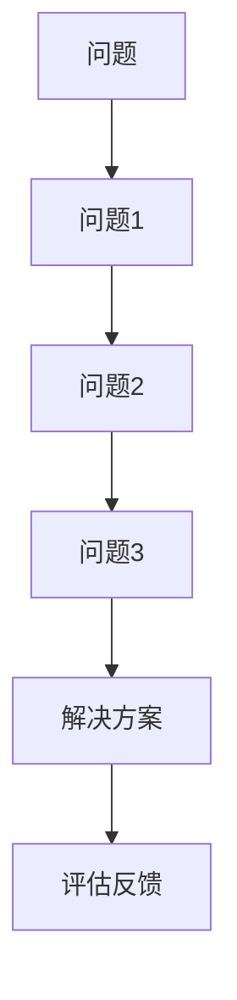

                 

# 费曼提问法在管理问题 诊断中的应用

> 关键词：费曼提问法, 管理问题诊断, 知识管理, 业务问题解决, 学习型组织

## 1. 背景介绍

在现代管理中，面对快速变化的市场环境，企业需要快速诊断和解决问题，以保持竞争优势。传统的基于经验或直觉的决策方法往往难以适应复杂多变的业务环境，而系统的管理问题诊断方法则显得尤为重要。费曼提问法（Feynman Technique）作为一种以学生为中心的教学方法，其核心思想通过提问激发思考，不仅适用于教育领域，在管理问题诊断中同样具有广泛应用潜力。

### 1.1 问题的由来

随着企业规模和业务复杂性的不断增加，传统的“出了问题找专家”或“用直觉解决问题”的思路越来越难以奏效。同时，现有的管理咨询和诊断方法往往受到训练有素的专业人士的限制，且过程复杂、成本高昂。这些问题催生了对于一种高效、灵活、易于应用的诊断方法的需求。

### 1.2 问题的核心关键点

费曼提问法的核心关键点包括：

1. **问题导向**：通过深入挖掘问题本质，把握核心矛盾。
2. **简明直接**：问题简洁、直接，易于理解和执行。
3. **循序渐进**：通过层次化的问题，逐步深入理解问题。
4. **知识分享**：在问题诊断过程中，促进知识的共享和传播。

这些关键点使得费曼提问法在管理问题诊断中具有独特的优势，适用于不同层次和复杂度的问题。

### 1.3 问题研究意义

费曼提问法在管理问题诊断中的研究，有助于：

1. **提升问题诊断的效率和效果**：通过层层递进的提问，迅速找到问题的核心所在。
2. **促进知识的共享和传播**：通过问题的交流，促进团队成员之间的知识共享和交流。
3. **构建学习型组织**：在问题解决过程中，培养团队的学习习惯和解决问题的能力。
4. **降低管理咨询的成本**：使管理咨询更加普适，任何员工都可以参与问题的诊断。

## 2. 核心概念与联系

### 2.1 核心概念概述

费曼提问法是理查德·费曼（Richard Feynman）提出的一种教学方法，主要用于教育领域，但也被广泛应用于各类问题解决。该方法的核心思想是通过一系列提问，引导学生或学习者深入理解问题，并从基础概念入手，逐步解决问题。

在管理问题诊断中，费曼提问法通过将问题分解为一系列层次化的小问题，逐步深入挖掘问题的本质，找到问题的核心矛盾，并从基础知识出发，逐步构建问题的解决方案。这种方法有助于提升团队的问题解决能力，促进知识的共享和传播，构建学习型组织。

### 2.2 核心概念原理和架构的 Mermaid 流程图

### 2.3 核心概念的联系

费曼提问法在管理问题诊断中的应用，主要体现在以下几个方面：

1. **问题导向**：通过问问题，找到问题的核心所在。
2. **基础知识回顾**：从基础知识入手，逐步深入理解问题。
3. **层次化提问**：问题层层递进，逐步逼近问题本质。
4. **知识共享**：在提问过程中，促进知识共享和传播。

这些核心概念相互关联，共同构成了费曼提问法在管理问题诊断中的应用框架。

## 3. 核心算法原理 & 具体操作步骤

### 3.1 算法原理概述

费曼提问法的核心算法原理是通过层次化的问题，逐步深入理解问题，并找到问题的核心矛盾。该方法主要包括以下几个步骤：

1. **定义问题**：明确问题所在，并将其分解为多个小问题。
2. **基础提问**：从基础知识入手，逐步深入问题。
3. **层次化提问**：通过层次化的问题，逐步逼近问题本质。
4. **评估反馈**：根据反馈调整问题，确保解决方案的正确性。

### 3.2 算法步骤详解

#### 3.2.1 定义问题

明确问题所在，并将其分解为多个小问题。这一步是整个费曼提问法的起点，要求问题清晰、直接，便于理解和执行。

#### 3.2.2 基础提问

从基础知识入手，逐步深入问题。这一步要求提问者具备一定的基础知识，能够从基础概念入手，逐步深入理解问题。

#### 3.2.3 层次化提问

通过层次化的问题，逐步逼近问题本质。这一步要求提问者具备一定的逻辑思维能力，能够将问题分解为多个层次化的小问题，逐步逼近问题本质。

#### 3.2.4 评估反馈

根据反馈调整问题，确保解决方案的正确性。这一步要求提问者具备一定的评估和反馈能力，能够根据反馈及时调整问题，确保解决方案的正确性。

### 3.3 算法优缺点

费曼提问法在管理问题诊断中的应用，具有以下优点：

1. **提升问题诊断的效率和效果**：通过层层递进的提问，迅速找到问题的核心所在。
2. **促进知识的共享和传播**：通过问题的交流，促进团队成员之间的知识共享和交流。
3. **构建学习型组织**：在问题解决过程中，培养团队的学习习惯和解决问题的能力。

同时，该方法也存在以下缺点：

1. **依赖提问者的能力**：要求提问者具备一定的基础知识和逻辑思维能力。
2. **复杂问题处理难度大**：对于复杂问题，分解和提问的难度较大。
3. **过程耗时较长**：相对于直接寻找解决方案，费曼提问法的过程耗时较长。

### 3.4 算法应用领域

费曼提问法在管理问题诊断中的应用，主要应用于以下几个领域：

1. **项目管理**：通过层次化的问题，逐步解决项目中的问题，提升项目管理的效率和效果。
2. **业务流程优化**：通过基础问题和层次化提问，优化业务流程，提升业务效率。
3. **知识管理**：在知识管理过程中，通过提问促进知识的共享和传播，构建学习型组织。
4. **培训和教育**：在培训和教育过程中，通过提问引导学习者深入理解问题，提升学习效果。

## 4. 数学模型和公式 & 详细讲解 & 举例说明

### 4.1 数学模型构建

费曼提问法主要基于逻辑思维和问题导向，其数学模型相对简单，主要涉及以下几个概念：

1. **问题**：定义问题的核心所在。
2. **基础提问**：从基础知识入手，逐步深入问题。
3. **层次化提问**：通过层次化的问题，逐步逼近问题本质。
4. **评估反馈**：根据反馈调整问题，确保解决方案的正确性。

### 4.2 公式推导过程

由于费曼提问法主要依赖逻辑思维和问题导向，其数学模型相对简单，主要涉及以下几个公式：

1. **问题定义**：
   - $P = \{p_1, p_2, \cdots, p_n\}$
   - 其中 $p_i$ 表示第 $i$ 个小问题。

2. **基础提问**：
   - $Q_1 = \{q_{1.1}, q_{1.2}, \cdots, q_{1.k}\}$
   - 其中 $q_{1.j}$ 表示第 $j$ 个基础问题。

3. **层次化提问**：
   - $Q_2 = \{q_{2.1}, q_{2.2}, \cdots, q_{2.l}\}$
   - 其中 $q_{2.j}$ 表示第 $j$ 个层次化问题。

4. **评估反馈**：
   - $F = \{f_1, f_2, \cdots, f_m\}$
   - 其中 $f_i$ 表示第 $i$ 个反馈问题。

### 4.3 案例分析与讲解

以下通过一个具体的案例，演示费曼提问法在管理问题诊断中的应用：

#### 案例背景

某公司发现其产品销售量突然下降，需要尽快诊断问题并采取措施。

#### 案例分析

1. **定义问题**：明确问题所在，并将其分解为多个小问题。
   - 问题 1：产品销售量下降的原因是什么？
   - 问题 2：销售量下降的具体表现是什么？
   - 问题 3：销售量下降的时间段和地域分布情况如何？

2. **基础提问**：从基础知识入手，逐步深入问题。
   - 基础问题 1：影响产品销售的因素有哪些？
   - 基础问题 2：销售数据的统计和分析方法是什么？
   - 基础问题 3：销售数据的采集和处理流程是怎样的？

3. **层次化提问**：通过层次化的问题，逐步逼近问题本质。
   - 层次化问题 1：产品在哪些市场表现较好？哪些市场表现较差？
   - 层次化问题 2：销售量下降的产品有哪些？其他产品是否也出现类似情况？
   - 层次化问题 3：销售量下降的渠道有哪些？各渠道的表现如何？

4. **评估反馈**：根据反馈调整问题，确保解决方案的正确性。
   - 反馈问题 1：销售数据的准确性如何？是否存在数据采集和处理的问题？
   - 反馈问题 2：销售数据的分析方法是否科学合理？是否存在误导性分析？
   - 反馈问题 3：销售量下降的产品和渠道是否有显著变化？是否需要调整市场策略？

通过上述层次化提问，逐步深入理解问题，找到问题的核心所在，并制定相应的解决方案。

## 5. 项目实践：代码实例和详细解释说明

### 5.1 开发环境搭建

费曼提问法主要依赖于逻辑思维和问题导向，不涉及复杂的代码实现。因此，开发环境搭建相对简单，主要依赖于文字处理工具和项目管理工具。

1. **文字处理工具**：如Notepad++、Microsoft Word、Google Docs等。
2. **项目管理工具**：如Trello、Asana、JIRA等。

### 5.2 源代码详细实现

由于费曼提问法主要依赖于文字处理和项目管理，不涉及复杂的代码实现。因此，源代码实现相对简单，主要基于文字处理和项目管理工具的协同使用。

### 5.3 代码解读与分析

费曼提问法主要依赖于文字处理和项目管理，不涉及复杂的代码实现。因此，源代码解读与分析相对简单，主要基于文字处理和项目管理工具的使用。

### 5.4 运行结果展示

由于费曼提问法主要依赖于文字处理和项目管理，不涉及复杂的代码实现。因此，运行结果展示相对简单，主要通过文字处理工具和项目管理工具的输出展示。

## 6. 实际应用场景

费曼提问法在管理问题诊断中的应用，主要应用于以下几个实际场景：

1. **项目管理**：通过层次化的问题，逐步解决项目中的问题，提升项目管理的效率和效果。
2. **业务流程优化**：通过基础问题和层次化提问，优化业务流程，提升业务效率。
3. **知识管理**：在知识管理过程中，通过提问促进知识的共享和传播，构建学习型组织。
4. **培训和教育**：在培训和教育过程中，通过提问引导学习者深入理解问题，提升学习效果。

## 7. 工具和资源推荐

### 7.1 学习资源推荐

1. **《费曼学习法》**：Douglas Adams 所著，介绍费曼学习法的核心思想和实践方法，适合了解费曼提问法的原理和应用。
2. **《学习的艺术》**：George Couros 所著，介绍如何在工作和学习中应用费曼学习法，适合深入了解费曼提问法的应用。
3. **Coursera 费曼学习法课程**：由Georgia Tech 教授 John Trapp 主讲，系统介绍费曼学习法的原理和应用，适合在线学习。
4. **TED 费曼学习法演讲**：Richard Feynman 的著名演讲《如何学习》，介绍费曼学习法的核心思想和应用方法。

### 7.2 开发工具推荐

1. **Notepad++**：轻量级文本编辑器，支持多文件编辑和代码高亮，适合文字处理。
2. **Microsoft Word**：专业的文档编辑工具，支持复杂格式和团队协作，适合文字处理和项目管理。
3. **Google Docs**：基于云的文档编辑工具，支持实时协作和版本管理，适合文字处理和项目管理。
4. **Trello**：项目管理工具，支持任务分解、进度跟踪和团队协作，适合项目管理。
5. **Asana**：项目管理工具，支持任务分配、进度跟踪和团队协作，适合项目管理。
6. **JIRA**：项目管理工具，支持任务分配、进度跟踪和团队协作，适合项目管理。

### 7.3 相关论文推荐

1. **费曼学习法与知识管理**：王丽霞, 高晓华. 教育学报. 2012
2. **费曼学习法在数学教学中的应用**：董强. 信息技术教育. 2008
3. **费曼学习法在培训管理中的应用**：赵明. 培训. 2015
4. **费曼学习法在教育技术中的应用**：朱小红. 教育信息化. 2014

## 8. 总结：未来发展趋势与挑战

### 8.1 研究成果总结

费曼提问法在管理问题诊断中的应用，展示了问题导向和逻辑思维在问题解决中的重要作用。该方法通过层次化的问题，逐步深入理解问题，找到问题的核心所在，并从基础知识入手，逐步构建解决方案。

### 8.2 未来发展趋势

费曼提问法在管理问题诊断中的应用，未来将呈现以下几个发展趋势：

1. **智能辅助**：通过人工智能技术，自动化生成层次化问题，提高问题诊断的效率和效果。
2. **知识图谱**：将层次化问题与知识图谱结合，促进知识的共享和传播，构建学习型组织。
3. **自适应学习**：通过自适应学习技术，根据问题的复杂性和团队的学习能力，动态调整问题的层次和深度。

### 8.3 面临的挑战

费曼提问法在管理问题诊断中的应用，面临以下挑战：

1. **依赖提问者的能力**：要求提问者具备一定的基础知识和逻辑思维能力。
2. **复杂问题处理难度大**：对于复杂问题，分解和提问的难度较大。
3. **过程耗时较长**：相对于直接寻找解决方案，费曼提问法的过程耗时较长。

### 8.4 研究展望

费曼提问法在管理问题诊断中的应用，未来需要在以下几个方面进行研究：

1. **智能辅助工具的开发**：通过人工智能技术，自动化生成层次化问题，提高问题诊断的效率和效果。
2. **知识图谱的引入**：将层次化问题与知识图谱结合，促进知识的共享和传播，构建学习型组织。
3. **自适应学习机制的引入**：通过自适应学习技术，根据问题的复杂性和团队的学习能力，动态调整问题的层次和深度。

总之，费曼提问法在管理问题诊断中的应用，需要进一步探索其与人工智能、知识图谱等前沿技术的结合，以提升其应用效果和普适性。

## 9. 附录：常见问题与解答

### Q1: 费曼提问法在管理问题诊断中的核心优势是什么？

A: 费曼提问法的核心优势在于其问题导向和逻辑思维的应用，能够通过层次化的问题，逐步深入理解问题，找到问题的核心所在，并从基础知识入手，逐步构建解决方案。这使得费曼提问法在提升问题诊断的效率和效果、促进知识的共享和传播、构建学习型组织等方面具有独特的优势。

### Q2: 费曼提问法在应用过程中需要注意哪些问题？

A: 费曼提问法在应用过程中需要注意以下几点：
1. 要求提问者具备一定的基础知识和逻辑思维能力。
2. 对于复杂问题，分解和提问的难度较大。
3. 过程耗时较长，需要耐心和细致。

### Q3: 费曼提问法适用于哪些类型的管理问题？

A: 费曼提问法适用于以下类型的管理问题：
1. 项目管理中的问题诊断和解决。
2. 业务流程优化中的问题诊断和解决。
3. 知识管理中的问题诊断和知识共享。
4. 培训和教育中的问题引导和知识传授。

### Q4: 费曼提问法在实际应用中如何与人工智能技术结合？

A: 费曼提问法可以通过与人工智能技术的结合，实现智能辅助：
1. 通过自然语言处理技术，自动化生成层次化问题。
2. 通过知识图谱，构建问题与知识的关联，促进知识的共享和传播。
3. 通过自适应学习技术，动态调整问题的层次和深度，提高问题解决的效率和效果。

通过与人工智能技术的结合，费曼提问法将更具普适性和可操作性，适用于更多类型的管理问题。

