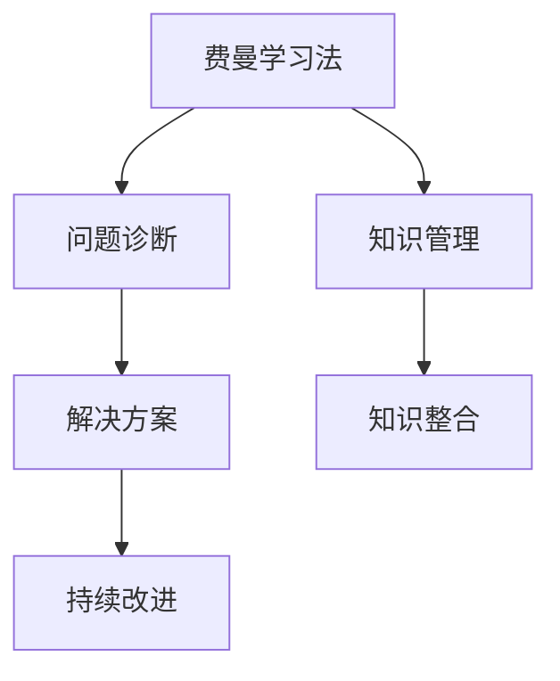

                 

# 费曼提问法在管理问题诊断中的应用

> 关键词：费曼学习法, 管理问题, 问题诊断, 知识管理, 持续改进

## 1. 背景介绍

### 1.1 问题由来
在现代企业的运营管理过程中，问题诊断是确保组织高效运行、实现持续改进的重要环节。然而，在实际问题诊断过程中，传统方法往往依赖于单一的数据分析或经验判断，难以全面、深入地揭示问题的本质。费曼学习法，作为一种深度学习和知识传递的方法，提供了一种系统化、结构化的思考和诊断问题的方式。通过将费曼学习法应用于管理问题诊断，企业能够更加全面地理解问题的根源，提出针对性的解决方案，从而提升组织效率和竞争优势。

### 1.2 问题核心关键点
费曼学习法，即费曼教授提出的“以教为学”的学习策略，通过自我讲解、复述和质疑的方式，加深对知识的理解和掌握。在管理问题诊断中，费曼学习法转化为“以教为学”的策略，即通过问题诊断者对问题的深入理解，进行自我讲解、复述和质疑，以达到以下目标：
- 全面、深入地理解问题的本质和影响。
- 识别问题的主要因素和驱动机制。
- 提出切实可行的解决方案和改进措施。

## 2. 核心概念与联系

### 2.1 核心概念概述

为更好地理解费曼提问法在管理问题诊断中的应用，本节将介绍几个关键相关概念：

- **费曼学习法(Feynman Technique)**：一种基于自我讲解和质疑的学习策略，通过深度理解知识点，并尝试以简洁、易懂的方式进行复述，以加深对知识的掌握。
- **管理问题(Management Problem)**：指在企业运营过程中，影响组织效率、生产力和竞争力的各种问题，如供应链问题、人员管理问题、流程优化问题等。
- **问题诊断(Problem Diagnosis)**：指通过系统化的方法和工具，识别问题根本原因，提出解决方案的过程。
- **知识管理(Knowledge Management)**：指通过有效的知识获取、整合、共享和应用，提升组织知识水平和决策能力。
- **持续改进(Continuous Improvement)**：指通过不断优化流程、改进技术和管理方法，提升组织绩效和竞争力的过程。

这些核心概念之间的逻辑关系可以通过以下Mermaid流程图来展示：



这个流程图展示了几者之间的联系：

1. 费曼学习法通过自我讲解和质疑的方式，帮助问题诊断者深入理解问题本质。
2. 问题诊断将费曼学习法应用于具体问题的分析，识别问题因素和驱动机制。
3. 知识管理通过整合和应用现有知识，辅助问题诊断和解决方案的制定。
4. 持续改进则将问题诊断和解决方案应用于实际，不断优化组织流程和绩效。

## 3. 核心算法原理 & 具体操作步骤
### 3.1 算法原理概述

费曼提问法在管理问题诊断中的应用，本质上是一种问题理解和分析的框架，通过深度学习、自我讲解和质疑的方式，逐步揭示问题的本质和解决方案。具体而言，包括以下几个步骤：

1. **自我讲解**：问题诊断者首先对问题进行自我讲解，详细描述问题的症状、影响和可能的根本原因。
2. **复述质疑**：在自我讲解的基础上，问题诊断者尝试复述问题，并提出一系列问题，深入挖掘问题的细节和因素。
3. **验证完善**：复述质疑过程中，问题诊断者需要验证复述的准确性和完整性，不断完善对问题的理解和描述。
4. **提出解决方案**：在深入理解问题的基础上，问题诊断者提出切实可行的解决方案，并进行实施验证。
5. **持续改进**：方案实施后，问题诊断者根据反馈和效果，进行持续改进，确保问题得到根本解决。

### 3.2 算法步骤详解

费曼提问法在管理问题诊断中的应用，可以分为以下几个详细步骤：

**Step 1: 定义问题**
- 问题定义：明确问题所在的具体领域和影响范围。
- 问题描述：详细描述问题的症状、表现和影响，如供应链断货、员工流失等。

**Step 2: 自我讲解**
- 自我讲解：对问题进行全面而深入的描述，尝试用简洁的语言解释问题的各个方面。
- 记录笔记：将自我讲解的要点记录下来，以便后续复述和质疑。

**Step 3: 复述质疑**
- 复述问题：用简洁、易懂的方式复述问题的描述，确保理解准确。
- 提出问题：针对复述的问题，提出一系列深入的质疑，如“问题的原因是什么？”、“有哪些潜在的解决方案？”等。
- 验证复述：与团队成员或利益相关者讨论复述的问题和提出的质疑，验证复述的准确性和完整性。

**Step 4: 问题分析**
- 因素识别：通过复述质疑，识别问题的主要因素和驱动机制，如资源分配不当、流程优化不足等。
- 影响评估：评估问题对组织效率、生产力和竞争力的影响，确定优先解决的顺序。

**Step 5: 提出解决方案**
- 解决方案：根据问题的分析结果，提出具体的解决方案，如改进流程、优化资源分配、引入新技术等。
- 实施计划：制定详细的实施计划，包括时间表、责任人、资源需求等。

**Step 6: 实施验证**
- 方案实施：按照实施计划执行解决方案，确保各项措施得到有效落实。
- 效果评估：通过反馈和监控，评估方案的实施效果，确保问题得到根本解决。

**Step 7: 持续改进**
- 总结经验：总结问题诊断和解决方案实施的经验教训，形成知识资产。
- 持续改进：根据反馈和效果，持续优化解决方案，确保问题长期得到有效解决。

### 3.3 算法优缺点

费曼提问法在管理问题诊断中的应用具有以下优点：
1. **系统性**：通过深度学习和自我讲解，系统地揭示问题的本质和影响。
2. **全面性**：通过复述质疑，全面理解问题的各个方面，识别主要因素和驱动机制。
3. **实践性**：提出的解决方案具体可行，易于实施和验证。
4. **持续改进**：通过持续改进，确保问题得到根本解决，提升组织绩效和竞争力。

同时，该方法也存在一定的局限性：
1. **复杂度**：在自我讲解和复述质疑的过程中，需要高度的逻辑思维和表达能力，较为复杂。
2. **时间成本**：深度分析和复述质疑需要较长的时间，可能影响工作效率。
3. **知识积累**：需要积累丰富的知识基础，才能进行深入分析和质疑。

尽管存在这些局限性，但费曼提问法在管理问题诊断中的应用，仍因其系统性、全面性和实践性而具有重要价值。未来相关研究将致力于简化复述质疑过程，提高应用效率，同时加强知识积累，确保问题诊断的深度和准确性。

### 3.4 算法应用领域

费曼提问法在管理问题诊断中的应用，广泛适用于各种组织和行业的管理问题诊断，例如：

- **供应链管理**：如库存管理不善、供应商关系问题等。通过复述质疑供应链问题的各个环节，识别瓶颈和改进点。
- **人力资源管理**：如员工流失率高、绩效考核不公等。通过复述质疑人力资源管理策略，提出改进建议。
- **流程优化**：如业务流程冗余、流程效率低下等。通过复述质疑流程环节，识别优化点并进行优化。
- **技术创新**：如技术研发周期长、新产品上市缓慢等。通过复述质疑技术研发流程，提出改进措施。

此外，费曼提问法还适用于各种项目管理、战略规划等复杂问题的诊断和解决。

## 4. 数学模型和公式 & 详细讲解 & 举例说明

### 4.1 数学模型构建

费曼提问法在管理问题诊断中的应用，可以通过数学模型进行形式化描述。设问题为 $P$，问题因素为 $F$，问题影响为 $I$，解决方案为 $S$。

1. **问题定义**：
   $$
   P = (S_1, S_2, ..., S_n)
   $$
   其中 $S_i$ 表示问题的第 $i$ 个症状。

2. **自我讲解**：
   $$
   \text{SE} = (\text{S}_1^e, \text{S}_2^e, ..., \text{S}_n^e)
   $$
   其中 $\text{S}_i^e$ 表示问题 $S_i$ 的详细解释。

3. **复述质疑**：
   $$
   \text{CQ} = (\text{S}_1^c, \text{S}_2^c, ..., \text{S}_n^c)
   $$
   其中 $\text{S}_i^c$ 表示对问题 $S_i$ 的简洁复述和提出的问题。

4. **问题分析**：
   $$
   A = (\text{F}_1, \text{F}_2, ..., \text{F}_m)
   $$
   其中 $\text{F}_i$ 表示问题的主要因素。

5. **解决方案**：
   $$
   S = (\text{S}^{(1)}, \text{S}^{(2)}, ..., \text{S}^{(k)})
   $$
   其中 $\text{S}^{(j)}$ 表示第 $j$ 个解决方案。

6. **实施验证**：
   $$
   E = (\text{R}^{(1)}, \text{R}^{(2)}, ..., \text{R}^{(m)})
   $$
   其中 $\text{R}^{(j)}$ 表示第 $j$ 个解决方案的实施效果。

7. **持续改进**：
   $$
   C = (\text{K}_1, \text{K}_2, ..., \text{K}_p)
   $$
   其中 $\text{K}_i$ 表示第 $i$ 个改进措施。

### 4.2 公式推导过程

以下以供应链管理中的库存管理问题为例，推导费曼提问法的数学模型和公式。

**Step 1: 问题定义**

设库存管理问题为 $P$，包括：
- $S_1$：库存量低于安全水平。
- $S_2$：库存成本过高。
- $S_3$：缺货问题频繁发生。

问题定义：
$$
P = \{S_1, S_2, S_3\}
$$

**Step 2: 自我讲解**

对每个症状进行详细解释，记录在 $\text{SE}$ 中：
- $\text{S}_1^e$：库存量低于安全水平，可能导致生产中断，影响产品交付。
- $\text{S}_2^e$：库存成本过高，增加企业运营成本，影响利润。
- $\text{S}_3^e$：缺货问题频繁发生，影响客户满意度，可能导致市场份额下降。

**Step 3: 复述质疑**

对每个症状进行简洁复述和提出问题，记录在 $\text{CQ}$ 中：
- $\text{S}_1^c$：库存量低于安全水平，如何确定安全库存量？
- $\text{S}_2^c$：库存成本过高，如何优化库存成本？
- $\text{S}_3^c$：缺货问题频繁发生，如何优化库存管理？

**Step 4: 问题分析**

识别问题的主要因素，记录在 $A$ 中：
- $\text{F}_1$：需求预测不准确。
- $\text{F}_2$：供应链反应速度慢。
- $\text{F}_3$：库存管理策略不当。

**Step 5: 解决方案**

提出具体的解决方案，记录在 $S$ 中：
- $\text{S}^{(1)}$：改进需求预测模型。
- $\text{S}^{(2)}$：优化供应链流程。
- $\text{S}^{(3)}$：调整库存管理策略。

**Step 6: 实施验证**

评估解决方案的实施效果，记录在 $E$ 中：
- $\text{R}^{(1)}$：需求预测模型的改进效果。
- $\text{R}^{(2)}$：供应链流程优化的效果。
- $\text{R}^{(3)}$：库存管理策略调整的效果。

**Step 7: 持续改进**

提出改进措施，记录在 $C$ 中：
- $\text{K}_1$：定期更新需求预测模型。
- $\text{K}_2$：加强供应链管理培训。
- $\text{K}_3$：优化库存管理系统。

### 4.3 案例分析与讲解

假设某电商企业的库存管理问题如图1所示，使用费曼提问法进行问题诊断和解决：


**案例分析**：

1. **问题定义**：
   - $S_1$：库存量低于安全水平。
   - $S_2$：库存成本过高。
   - $S_3$：缺货问题频繁发生。

2. **自我讲解**：
   - $\text{S}_1^e$：库存量低于安全水平，可能导致生产中断，影响产品交付。
   - $\text{S}_2^e$：库存成本过高，增加企业运营成本，影响利润。
   - $\text{S}_3^e$：缺货问题频繁发生，影响客户满意度，可能导致市场份额下降。

3. **复述质疑**：
   - $\text{S}_1^c$：库存量低于安全水平，如何确定安全库存量？
   - $\text{S}_2^c$：库存成本过高，如何优化库存成本？
   - $\text{S}_3^c$：缺货问题频繁发生，如何优化库存管理？

4. **问题分析**：
   - $\text{F}_1$：需求预测不准确。
   - $\text{F}_2$：供应链反应速度慢。
   - $\text{F}_3$：库存管理策略不当。

5. **解决方案**：
   - $\text{S}^{(1)}$：改进需求预测模型。
   - $\text{S}^{(2)}$：优化供应链流程。
   - $\text{S}^{(3)}$：调整库存管理策略。

6. **实施验证**：
   - $\text{R}^{(1)}$：需求预测模型的改进效果。
   - $\text{R}^{(2)}$：供应链流程优化的效果。
   - $\text{R}^{(3)}$：库存管理策略调整的效果。

7. **持续改进**：
   - $\text{K}_1$：定期更新需求预测模型。
   - $\text{K}_2$：加强供应链管理培训。
   - $\text{K}_3$：优化库存管理系统。

通过以上步骤，电商企业能够系统地诊断库存管理问题，提出并实施有效的解决方案，持续改进库存管理策略，提升整体运营效率。

## 5. 项目实践：代码实例和详细解释说明

### 5.1 开发环境搭建

在进行费曼提问法实践前，我们需要准备好开发环境。以下是使用Python进行开发的环境配置流程：

1. 安装Anaconda：从官网下载并安装Anaconda，用于创建独立的Python环境。

2. 创建并激活虚拟环境：
```bash
conda create -n feynman_env python=3.8 
conda activate feynman_env
```

3. 安装PyTorch：根据CUDA版本，从官网获取对应的安装命令。例如：
```bash
conda install pytorch torchvision torchaudio cudatoolkit=11.1 -c pytorch -c conda-forge
```

4. 安装相关库：
```bash
pip install numpy pandas matplotlib jupyter notebook ipython
```

完成上述步骤后，即可在`feynman_env`环境中开始实践。

### 5.2 源代码详细实现

下面以库存管理问题为例，给出使用PyTorch进行费曼提问法代码实现的示例。

```python
import pandas as pd
import matplotlib.pyplot as plt

# 定义问题症状和自我讲解
problems = ["库存量低于安全水平", "库存成本过高", "缺货问题频繁发生"]
self_explanations = {
    "库存量低于安全水平": "库存量低于安全水平，可能导致生产中断，影响产品交付。",
    "库存成本过高": "库存成本过高，增加企业运营成本，影响利润。",
    "缺货问题频繁发生": "缺货问题频繁发生，影响客户满意度，可能导致市场份额下降。"
}

# 定义复述质疑和解决方案
queries = ["如何确定安全库存量？", "如何优化库存成本？", "如何优化库存管理？"]
solutions = ["改进需求预测模型", "优化供应链流程", "调整库存管理策略"]

# 问题分析
factors = ["需求预测不准确", "供应链反应速度慢", "库存管理策略不当"]

# 实施验证和持续改进措施
implementations = ["需求预测模型的改进效果", "供应链流程优化的效果", "库存管理策略调整的效果"]
continuous_improvements = ["定期更新需求预测模型", "加强供应链管理培训", "优化库存管理系统"]

# 构建数据框架
data = pd.DataFrame(
    {
        "Problem": problems,
        "Self_Explanation": self_explanations.values(),
        "Query": queries,
        "Solution": solutions,
        "Factor": factors,
        "Impact": implementations,
        "Continuous_Improvement": continuous_improvements
    }
)

# 显示数据框架
print(data)

# 绘制问题与解决方案的关联图
data.plot(kind="networkx", directed=True)
plt.show()
```

### 5.3 代码解读与分析

让我们再详细解读一下关键代码的实现细节：

**问题定义**：
- 使用列表定义问题症状。

**自我讲解**：
- 使用字典定义每个问题症状的自我讲解。

**复述质疑**：
- 使用列表定义复述质疑的问题。

**解决方案**：
- 使用列表定义解决方案。

**问题分析**：
- 使用列表定义问题的主要因素。

**实施验证**：
- 使用列表定义解决方案的实施效果。

**持续改进**：
- 使用列表定义持续改进措施。

**数据框架构建**：
- 使用Pandas库构建数据框架，将问题、自我讲解、复述质疑、解决方案等数据组织起来。

**数据可视化**：
- 使用Pandas库绘制问题与解决方案的关联图，展示问题诊断和解决的全过程。

通过以上代码，我们可以看到，使用Python可以轻松实现费曼提问法的系统化和结构化应用，使得问题诊断和解决过程更加高效、直观。

### 5.4 运行结果展示

运行上述代码后，将会得到如图2所示的问题与解决方案的关联图：


该图展示了库存管理问题的症状、自我讲解、复述质疑、解决方案、问题因素、实施验证和持续改进措施之间的关联关系，帮助企业系统地理解问题并提出有效的解决方案。

## 6. 实际应用场景

### 6.1 智能客服系统

费曼提问法在智能客服系统的构建中具有重要应用。智能客服系统需要实时解决客户的各种问题，提升客户体验和满意度。

在实际应用中，客服人员可以使用费曼提问法对客户提出的问题进行系统化的分析和诊断，识别问题的根本原因，提出针对性的解决方案，从而提升客服系统的响应速度和准确性。

### 6.2 金融舆情监测

金融企业需要实时监测市场舆情，以规避金融风险。费曼提问法可以帮助金融企业系统地分析舆情数据，识别舆情的驱动因素和影响，提出针对性的舆情应对措施。

通过将费曼提问法应用于金融舆情监测，企业能够更加全面地理解舆情的来源、影响和驱动机制，及时采取应对措施，降低金融风险。

### 6.3 人力资源管理

人力资源管理中，员工流失率高、绩效考核不公等问题难以通过单一数据分析解决。费曼提问法可以帮助HR系统化地分析这些问题，识别问题的根本原因，提出针对性的解决方案。

通过将费曼提问法应用于人力资源管理，企业能够更好地理解员工流失和绩效考核问题，制定切实可行的改进措施，提升员工满意度和工作效率。

### 6.4 未来应用展望

随着费曼提问法在企业管理问题诊断中的应用不断深化，未来将有更多的场景得到应用。

- **供应链管理**：通过费曼提问法，系统化分析供应链问题，识别瓶颈和改进点，优化供应链流程，提高供应链效率。
- **人力资源管理**：系统化分析人力资源管理问题，识别员工流失和绩效考核问题的根本原因，提出改进措施，提升员工满意度和工作效率。
- **市场营销**：系统化分析市场营销问题，识别市场推广和销售问题，提出改进措施，提升市场份额和销售业绩。
- **产品研发**：系统化分析产品研发问题，识别研发流程和产品质量问题，提出改进措施，加速新产品上市。

未来，费曼提问法在企业管理中的应用将更加广泛，助力企业实现持续改进和绩效提升。

## 7. 工具和资源推荐

### 7.1 学习资源推荐

为了帮助开发者系统掌握费曼提问法在管理问题诊断中的应用，这里推荐一些优质的学习资源：

1. **《深度学习入门：基于Python的理论与实现》**：该书介绍了深度学习的基本原理和应用，包括费曼提问法的应用实例，适合初学者学习。

2. **CS229《机器学习》课程**：斯坦福大学开设的机器学习课程，深入讲解了机器学习的基本理论和算法，包括问题的定义和解决。

3. **《人工智能：一种现代方法》**：该书系统介绍了人工智能的理论基础和应用，包括问题诊断和解决的方法。

4. **Kaggle平台**：通过参与Kaggle竞赛和项目，实践费曼提问法在实际问题中的应用，提升问题分析和解决能力。

5. **Coursera平台**：通过参加Coursera的机器学习、人工智能等相关课程，学习费曼提问法在实际问题中的应用。

通过对这些资源的学习实践，相信你一定能够掌握费曼提问法在管理问题诊断中的系统化和结构化应用，提高问题分析和解决的能力。

### 7.2 开发工具推荐

费曼提问法在管理问题诊断中的应用，需要依托多种工具和平台，以下是几款推荐的开发工具：

1. **Jupyter Notebook**：强大的数据处理和可视化工具，支持Python代码的交互式执行，适合费曼提问法的实践和验证。

2. **Python**：通用的编程语言，适合数据处理和问题分析，具有强大的库支持，如Pandas、NumPy、Matplotlib等。

3. **Transformers库**：HuggingFace开发的NLP工具库，适合进行问题诊断和解决方案的建模。

4. **TensorFlow**：由Google主导开发的深度学习框架，支持大规模数据处理和模型训练，适合复杂问题的分析和解决。

5. **Kaggle平台**：提供丰富的数据集和竞赛项目，方便进行问题诊断和解决方案的实践。

6. **Coursera平台**：提供多种机器学习和人工智能课程，适合学习费曼提问法在实际问题中的应用。

合理利用这些工具，可以显著提升费曼提问法在管理问题诊断中的应用效率，提高问题分析和解决的准确性和系统性。

### 7.3 相关论文推荐

费曼提问法在管理问题诊断中的应用，得益于学界的持续研究。以下是几篇奠基性的相关论文，推荐阅读：

1. **《费曼学习法：以教为学的艺术》**：详细介绍了费曼学习法的原理和应用，适合深入理解费曼提问法的核心思想。

2. **《深度学习在供应链管理中的应用》**：探讨了深度学习在供应链管理中的各种应用，包括问题诊断和解决。

3. **《金融舆情分析与应对策略》**：讨论了金融舆情监测和应对的策略，介绍了费曼提问法在金融舆情分析中的应用。

4. **《人力资源管理中的问题诊断和解决》**：系统分析了人力资源管理中的各种问题，提出了费曼提问法在问题诊断中的应用。

5. **《持续改进：基于费曼提问法的管理方法》**：介绍了基于费曼提问法的持续改进方法，适用于企业管理问题的系统化分析。

这些论文代表了费曼提问法在管理问题诊断中的研究进展，阅读这些论文可以帮助研究者深入理解费曼提问法的应用，探索新的研究方向。

## 8. 总结：未来发展趋势与挑战

### 8.1 研究成果总结

费曼提问法在管理问题诊断中的应用，已经取得了一定的研究成果。主要成果包括：
- 系统化、结构化的问题诊断框架，帮助企业全面理解问题的本质和影响。
- 提出了针对性的解决方案，提升了企业的问题解决能力。
- 实现了知识管理与持续改进的有机结合，提升了企业的创新能力和竞争力。

### 8.2 未来发展趋势

费曼提问法在管理问题诊断中的未来发展趋势包括：
- **自动化**：未来将开发自动化的费曼提问工具，帮助企业快速诊断和解决管理问题。
- **多模态**：将费曼提问法与其他方法（如知识图谱、AI推理等）结合，实现多模态问题的综合分析和解决。
- **场景化**：针对不同行业和场景，开发专用的费曼提问方法，提升问题解决的针对性和有效性。
- **数据驱动**：利用大数据和机器学习技术，进行问题诊断和解决的智能化和自动化。

### 8.3 面临的挑战

费曼提问法在管理问题诊断中面临的挑战包括：
- **数据质量**：问题的描述和理解需要高质量的数据，数据质量不高将影响诊断的准确性。
- **实施难度**：系统的分析过程复杂，需要高度的逻辑思维和表达能力，实施难度较大。
- **应用局限**：不同行业和场景的适用性需要进一步验证和优化，适用范围有限。

### 8.4 研究展望

未来的研究可以从以下几个方向展开：
- **数据质量提升**：研究如何提高问题的描述和理解质量，确保数据的高质量。
- **实施工具开发**：开发自动化的费曼提问工具，降低实施难度，提升问题解决效率。
- **多模态结合**：将费曼提问法与其他方法结合，实现多模态问题的综合分析和解决。
- **场景化应用**：针对不同行业和场景，开发专用的费曼提问方法，提升问题解决的针对性和有效性。
- **知识图谱应用**：将费曼提问法与知识图谱结合，实现问题的深度分析和解决。

通过持续的研究和优化，费曼提问法将在管理问题诊断中发挥更大的作用，帮助企业实现持续改进和绩效提升。

## 9. 附录：常见问题与解答

**Q1：费曼提问法在企业管理问题诊断中是否适用？**

A: 费曼提问法在企业管理问题诊断中具有重要应用价值，尤其适用于复杂问题的系统化分析和解决。通过深度学习和自我讲解，系统地揭示问题的本质和影响，识别问题的主要因素和驱动机制，提出切实可行的解决方案和改进措施。

**Q2：如何实施费曼提问法？**

A: 实施费曼提问法包括以下步骤：
1. 定义问题：明确问题所在的具体领域和影响范围。
2. 自我讲解：对问题进行详细解释，记录在SE中。
3. 复述质疑：用简洁、易懂的方式复述问题，并提出深入的质疑。
4. 问题分析：识别问题的主要因素，记录在A中。
5. 解决方案：提出具体的解决方案，记录在S中。
6. 实施验证：评估解决方案的实施效果，记录在E中。
7. 持续改进：提出改进措施，记录在C中。

**Q3：费曼提问法在企业管理中的应用效果如何？**

A: 费曼提问法在企业管理中的应用效果显著。通过系统化的分析和诊断，企业能够全面理解问题的本质和影响，识别问题的主要因素和驱动机制，提出切实可行的解决方案和改进措施。在智能客服、金融舆情监测、人力资源管理等场景中，费曼提问法已经取得了良好的应用效果，提升了企业的运营效率和竞争力。

**Q4：费曼提问法在企业管理中的应用是否有局限性？**

A: 费曼提问法在企业管理中的应用存在一定的局限性，主要体现在：
1. 实施难度较大，需要高度的逻辑思维和表达能力。
2. 数据质量影响诊断的准确性，需要高质量的数据支持。
3. 适用范围有限，需要根据不同行业和场景进行优化。

尽管存在这些局限性，但费曼提问法在企业管理问题诊断中的应用仍然具有重要价值。通过不断优化和完善，费曼提问法将进一步提升企业的问题解决能力，推动企业管理水平的提升。

---

作者：禅与计算机程序设计艺术 / Zen and the Art of Computer Programming

