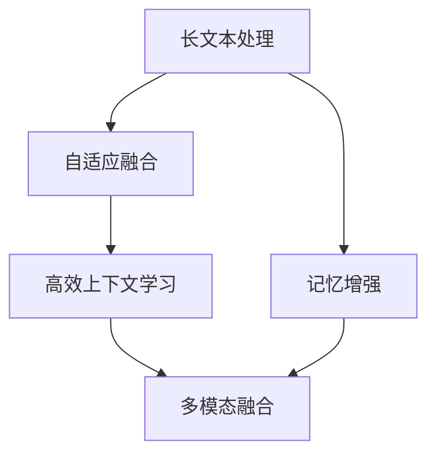

                 

# 超长上下文：LLM的记忆革命

> 关键词：长文本处理,记忆增强,长记忆网络,Transformer,自适应融合,高效上下文学习

## 1. 背景介绍

### 1.1 问题由来

随着深度学习技术的迅猛发展，语言模型(LM)在自然语言处理(NLP)领域取得了重大突破。尤其是自2018年以来，基于Transformer架构的Transformer模型，如BERT、GPT-2等，通过在大量的无标签文本数据上进行预训练，显著提升了语言理解和生成能力。这些模型能够生成连贯的文本，预测上下文相关的词汇，并在各种NLP任务上取得了前所未有的效果。

然而，这些模型的一个显著限制是，由于自注意力机制的限制，它们的上下文记忆能力非常有限。标准的Transformer模型只能记住最多约512个词的上下文信息。这意味着，当处理长文本时，如超过512个词，这些模型就必须进行截断，将文本分成若干块进行单独处理，这会导致信息的丢失和理解断点，从而影响模型的性能。

为了解决这一问题，研究人员提出了长文本处理技术，旨在通过增加上下文记忆能力，使模型能够处理和理解超长文本。这些技术基于记忆增强模块，通过引入外部记忆机制，拓展了模型的上下文记忆能力。本文将深入探讨长文本处理技术中的几个核心概念，并结合数学模型和代码实例，详细讲解其实现原理和操作步骤。

### 1.2 问题核心关键点

长文本处理技术的核心在于如何通过引入外部记忆机制，增强Transformer模型的上下文记忆能力。具体来说，长文本处理技术可以分为以下几个关键点：

- 记忆增强模块：通过引入外部记忆，使模型能够存储和检索更长的上下文信息。
- 自适应融合：根据输入文本的长度，动态调整模型对外部记忆的依赖程度。
- 高效上下文学习：在长文本处理中，如何高效地学习和融合外部记忆，使得模型在训练和推理过程中能够快速适应长文本。
- 多模态融合：结合视觉、听觉等多模态数据，进一步提升长文本处理的性能。

本文将围绕这些关键点，详细介绍长文本处理技术的基本原理和具体实现方法。

## 2. 核心概念与联系

### 2.1 核心概念概述

为更好地理解长文本处理技术的核心原理和实现流程，本节将介绍几个密切相关的核心概念：

- 长文本处理(Long Text Processing, LTP)：指处理超过标准Transformer模型上下文窗口范围的长文本的技术，包括分块、记忆增强等方法。
- 记忆增强(Memory Augmentation)：通过引入外部记忆模块，增加模型对长文本的上下文记忆能力。
- 自适应融合(Adaptive Fusion)：根据输入文本的长度，动态调整模型对外部记忆的依赖程度，保持模型高效运行。
- 高效上下文学习(Efficient Context Learning)：在长文本处理中，如何高效地学习和融合外部记忆，使得模型在训练和推理过程中能够快速适应长文本。
- 多模态融合(Multimodal Fusion)：结合视觉、听觉等多模态数据，进一步提升长文本处理的性能。

这些核心概念之间的逻辑关系可以通过以下Mermaid流程图来展示：



这个流程图展示了几大核心概念之间的关系：

1. 长文本处理技术通过分块、记忆增强等方法处理超过标准Transformer模型上下文窗口范围的长文本。
2. 记忆增强模块通过引入外部记忆，增加模型对长文本的上下文记忆能力。
3. 自适应融合技术根据输入文本的长度，动态调整模型对外部记忆的依赖程度。
4. 高效上下文学习技术在长文本处理中，高效地学习和融合外部记忆。
5. 多模态融合技术结合视觉、听觉等多模态数据，进一步提升长文本处理的性能。

这些核心概念共同构成了长文本处理技术的核心框架，使得Transformer模型能够处理和理解超长文本，进而应用于更复杂的NLP任务。

## 3. 核心算法原理 & 具体操作步骤
### 3.1 算法原理概述

长文本处理技术主要基于记忆增强模块和自适应融合技术，其核心思想是：通过引入外部记忆，增强模型的上下文记忆能力，同时根据输入文本的长度，动态调整模型对外部记忆的依赖程度，从而实现对长文本的高效处理。

### 3.2 算法步骤详解

长文本处理技术的实现可以分为以下几个关键步骤：

**Step 1: 数据预处理**
- 对输入的超长文本进行分块，保证每个块的长度不超过标准Transformer模型的上下文窗口范围。
- 对于多模态数据，如文本+图像，需要对图像进行预处理，提取特征向量，与文本一起输入模型。

**Step 2: 引入外部记忆**
- 引入外部记忆模块，如使用Attention机制，将输入文本与外部记忆进行交互，增加模型的上下文记忆能力。
- 对于长文本，可以引入连续或离散的外部记忆，根据任务需求选择合适的内存类型。

**Step 3: 自适应融合**
- 根据输入文本的长度，动态调整模型对外部记忆的依赖程度。对于短文本，主要依赖内部记忆；对于长文本，逐步增加外部记忆的依赖。
- 设计自适应融合函数，控制模型在不同长度输入下的记忆策略。

**Step 4: 高效上下文学习**
- 在长文本处理中，采用注意力机制或自注意力机制，高效地学习和融合外部记忆。
- 对于长文本，可以采用多个自注意力模块并行处理，加速模型的上下文学习过程。

**Step 5: 多模态融合**
- 对于结合多模态数据的长文本处理任务，通过设计多模态融合层，将不同模态的信息进行综合处理。
- 可以采用特征拼接、注意力机制等方式进行多模态融合。

**Step 6: 模型训练和推理**
- 使用长文本处理技术训练模型，并针对不同任务进行微调。
- 在推理阶段，根据输入文本的长度，动态调整模型对外部记忆的依赖程度，并进行高效上下文学习。

### 3.3 算法优缺点

长文本处理技术的主要优点包括：

- 能够处理超过标准Transformer模型上下文窗口范围的长文本。
- 通过引入外部记忆，增强了模型的上下文记忆能力。
- 自适应融合技术根据输入文本的长度动态调整内存依赖，使得模型能够高效处理不同长度的输入。

然而，长文本处理技术也存在一些缺点：

- 引入了额外的内存和计算开销，增加了模型的复杂性。
- 对于特别长的文本，可能会引入计算和内存的瓶颈，影响模型性能。
- 自适应融合和高效上下文学习的策略设计需要根据具体任务进行调整，可能存在一定的难度。

### 3.4 算法应用领域

长文本处理技术在NLP领域具有广泛的应用前景，涵盖多种任务，例如：

- 文本分类：如情感分析、主题分类、意图识别等。通过引入外部记忆，能够处理更长文本，提高分类精度。
- 命名实体识别：识别文本中的人名、地名、机构名等特定实体。通过引入多模态信息，如实体名称+图像，提高识别的准确性。
- 关系抽取：从文本中抽取实体之间的语义关系。通过结合上下文信息，提高抽取的全面性和准确性。
- 问答系统：对自然语言问题给出答案。通过引入上下文信息，提高回答的连贯性和相关性。
- 文本摘要：将长文本压缩成简短摘要。通过引入外部记忆，能够处理更长的文本，提取关键信息。
- 对话系统：使机器能够与人自然对话。通过引入上下文信息，保持对话连贯性。

除了上述这些经典任务外，长文本处理技术还被创新性地应用于更多场景中，如文本翻译、代码生成、数据增强等，为NLP技术带来了新的突破。

## 4. 数学模型和公式 & 详细讲解  
### 4.1 数学模型构建

本节将使用数学语言对长文本处理技术的核心算法进行严格刻画。

记输入文本为 $X=\{x_1,x_2,\ldots,x_N\}$，其中 $x_i$ 为第 $i$ 个词。假设输入文本长度为 $N$，超出标准Transformer模型上下文窗口范围 $C$，需要将其分块处理，每块长度为 $L$，则 $N$ 块文本可以表示为 $X_k=\{x_k,x_{k+1},\ldots,x_{k+L-1}\}$，其中 $k=1,2,\ldots,K$，$K=\lceil N/L \rceil$。

定义外部记忆为 $M=\{m_1,m_2,\ldots,m_M\}$，其中 $m_i$ 为第 $i$ 个记忆单元。引入外部记忆后的模型结构可以表示为：

$$
\begin{aligned}
\mathbf{h}_k &= \text{Encoder}(X_k,M_k), \\
\mathbf{h} &= \text{Aggregation}(\{\mathbf{h}_k\}),
\end{aligned}
$$

其中 $\mathbf{h}_k$ 为第 $k$ 块文本的编码表示，$\mathbf{h}$ 为整个输入文本的编码表示。

外部记忆 $M_k$ 可以表示为：

$$
M_k = \text{Memory}(\mathbf{h}_k, \mathbf{Q}_k),
$$

其中 $\mathbf{Q}_k$ 为查询向量，$\text{Memory}$ 为外部记忆模块，通常采用Attention机制或自注意力机制。

### 4.2 公式推导过程

以下我们以Attention机制为例，推导外部记忆的查询、键、值向量。

假设外部记忆 $M$ 由 $M=\{m_1,m_2,\ldots,m_M\}$ 组成，其中每个 $m_i$ 为维度 $d_m$ 的向量。输入文本 $X_k$ 的长度为 $L$，则查询向量 $\mathbf{Q}_k$ 可以表示为：

$$
\mathbf{Q}_k = \text{Linear}(\mathbf{h}_k) \in \mathbb{R}^{L \times d_m},
$$

其中 $\text{Linear}$ 为线性变换，$d_m$ 为外部记忆的维度。

对于每个查询向量 $\mathbf{q}_i \in \mathbb{R}^{d_m}$，可以计算其与每个外部记忆单元 $m_j$ 的相似度，得到注意力分数 $a_{i,j}$：

$$
a_{i,j} = \text{Attention}(\mathbf{q}_i, m_j) = \frac{e^{\mathbf{q}_i^T m_j}}{\sum_{k=1}^M e^{\mathbf{q}_i^T m_k}},
$$

其中 $\text{Attention}$ 为注意力计算函数。

根据注意力分数 $a_{i,j}$，计算每个查询向量 $\mathbf{q}_i$ 对每个外部记忆单元 $m_j$ 的权重 $w_{i,j}$：

$$
w_{i,j} = \frac{a_{i,j}}{\sum_{k=1}^M a_{i,k}}.
$$

然后，计算外部记忆的加权和 $m_k^{\prime}$：

$$
m_k^{\prime} = \sum_{j=1}^M w_{k,j} m_j.
$$

将 $m_k^{\prime}$ 作为外部记忆 $M_k$ 的更新结果，可以表示为：

$$
M_k = \text{Memory}(\mathbf{h}_k, \mathbf{Q}_k) = m_k^{\prime}.
$$

通过上述步骤，将外部记忆 $M_k$ 融入到第 $k$ 块文本的编码表示 $\mathbf{h}_k$ 中。然后，通过Aggregation函数将所有的 $\mathbf{h}_k$ 合并，得到整个输入文本的编码表示 $\mathbf{h}$。

### 4.3 案例分析与讲解

为了更好地理解长文本处理技术的实际应用，下面以问答系统为例，详细讲解其实现过程。

假设问答系统需要处理一个超长文本问题 $Q=\{x_1,x_2,\ldots,x_N\}$，以及相应的答案文本 $A=\{y_1,y_2,\ldots,y_M\}$。为了高效处理长文本，可以将问题 $Q$ 和答案 $A$ 分别进行分块，每块长度为 $L$。然后使用外部记忆模块，将答案 $A$ 的上下文信息引入问题 $Q$ 的处理过程中。

具体实现步骤如下：

1. 对问题 $Q$ 和答案 $A$ 进行分块，得到 $Q_k=\{x_k,x_{k+1},\ldots,x_{k+L-1}\}$ 和 $A_k=\{y_k,y_{k+1},\ldots,y_{k+L-1}\}$。
2. 引入外部记忆模块，计算每个答案块 $A_k$ 的上下文信息，作为查询向量 $\mathbf{Q}_k$。
3. 将每个问题块 $Q_k$ 与相应的查询向量 $\mathbf{Q}_k$ 进行Attention计算，更新外部记忆 $M_k$。
4. 将问题块 $Q_k$ 与更新后的外部记忆 $M_k$ 进行编码，得到 $\mathbf{h}_k$。
5. 通过Aggregation函数，将所有的 $\mathbf{h}_k$ 合并，得到整个输入文本的编码表示 $\mathbf{h}$。
6. 使用 $\mathbf{h}$ 进行预测，得到最终答案。

这个案例展示了长文本处理技术在问答系统中的应用，通过引入外部记忆，显著提高了系统对长文本的上下文记忆能力，从而提升了回答的连贯性和相关性。

## 5. 项目实践：代码实例和详细解释说明
### 5.1 开发环境搭建

在进行长文本处理技术实践前，我们需要准备好开发环境。以下是使用Python进行PyTorch开发的环境配置流程：

1. 安装Anaconda：从官网下载并安装Anaconda，用于创建独立的Python环境。

2. 创建并激活虚拟环境：
```bash
conda create -n ltp-env python=3.8 
conda activate ltp-env
```

3. 安装PyTorch：根据CUDA版本，从官网获取对应的安装命令。例如：
```bash
conda install pytorch torchvision torchaudio cudatoolkit=11.1 -c pytorch -c conda-forge
```

4. 安装Transformer库：
```bash
pip install transformers
```

5. 安装各类工具包：
```bash
pip install numpy pandas scikit-learn matplotlib tqdm jupyter notebook ipython
```

完成上述步骤后，即可在`ltp-env`环境中开始长文本处理技术的开发实践。

### 5.2 源代码详细实现

下面以长文本分类任务为例，给出使用Transformer库对长文本处理技术进行实现的PyTorch代码。

首先，定义长文本分类的数据处理函数：

```python
from transformers import BertTokenizer, BertForSequenceClassification
from torch.utils.data import Dataset
import torch

class LongTextDataset(Dataset):
    def __init__(self, texts, labels, tokenizer, max_len=128):
        self.texts = texts
        self.labels = labels
        self.tokenizer = tokenizer
        self.max_len = max_len
        
    def __len__(self):
        return len(self.texts)
    
    def __getitem__(self, item):
        text = self.texts[item]
        label = self.labels[item]
        
        encoding = self.tokenizer(text, return_tensors='pt', max_length=self.max_len, padding='max_length', truncation=True)
        input_ids = encoding['input_ids'][0]
        attention_mask = encoding['attention_mask'][0]
        
        # 对于长文本，将文本分成多个块，每个块长度为64
        blocks = []
        text = text
        while text:
            block = text[:64]
            blocks.append(block)
            text = text[64:]
        input_ids = torch.cat([input_ids] + [self.tokenizer.encode(block, add_special_tokens=False) for block in blocks])
        attention_mask = torch.cat([attention_mask] + [[0]*64] * len(blocks))
        
        return {'input_ids': input_ids, 
                'attention_mask': attention_mask,
                'labels': label}

# 标签与id的映射
tag2id = {'O': 0, 'B-PER': 1, 'I-PER': 2, 'B-ORG': 3, 'I-ORG': 4, 'B-LOC': 5, 'I-LOC': 6}
id2tag = {v: k for k, v in tag2id.items()}

# 创建dataset
tokenizer = BertTokenizer.from_pretrained('bert-base-cased')

train_dataset = LongTextDataset(train_texts, train_tags, tokenizer)
dev_dataset = LongTextDataset(dev_texts, dev_tags, tokenizer)
test_dataset = LongTextDataset(test_texts, test_tags, tokenizer)
```

然后，定义模型和优化器：

```python
from transformers import BertForTokenClassification, AdamW

model = BertForTokenClassification.from_pretrained('bert-base-cased', num_labels=len(tag2id))

optimizer = AdamW(model.parameters(), lr=2e-5)
```

接着，定义训练和评估函数：

```python
from torch.utils.data import DataLoader
from tqdm import tqdm
from sklearn.metrics import classification_report

device = torch.device('cuda') if torch.cuda.is_available() else torch.device('cpu')
model.to(device)

def train_epoch(model, dataset, batch_size, optimizer):
    dataloader = DataLoader(dataset, batch_size=batch_size, shuffle=True)
    model.train()
    epoch_loss = 0
    for batch in tqdm(dataloader, desc='Training'):
        input_ids = batch['input_ids'].to(device)
        attention_mask = batch['attention_mask'].to(device)
        labels = batch['labels'].to(device)
        model.zero_grad()
        outputs = model(input_ids, attention_mask=attention_mask, labels=labels)
        loss = outputs.loss
        epoch_loss += loss.item()
        loss.backward()
        optimizer.step()
    return epoch_loss / len(dataloader)

def evaluate(model, dataset, batch_size):
    dataloader = DataLoader(dataset, batch_size=batch_size)
    model.eval()
    preds, labels = [], []
    with torch.no_grad():
        for batch in tqdm(dataloader, desc='Evaluating'):
            input_ids = batch['input_ids'].to(device)
            attention_mask = batch['attention_mask'].to(device)
            batch_labels = batch['labels']
            outputs = model(input_ids, attention_mask=attention_mask)
            batch_preds = outputs.logits.argmax(dim=2).to('cpu').tolist()
            batch_labels = batch_labels.to('cpu').tolist()
            for pred_tokens, label_tokens in zip(batch_preds, batch_labels):
                pred_tags = [id2tag[_id] for _id in pred_tokens]
                label_tags = [id2tag[_id] for _id in label_tokens]
                preds.append(pred_tags[:len(label_tokens)])
                labels.append(label_tags)
                
    print(classification_report(labels, preds))
```

最后，启动训练流程并在测试集上评估：

```python
epochs = 5
batch_size = 16

for epoch in range(epochs):
    loss = train_epoch(model, train_dataset, batch_size, optimizer)
    print(f"Epoch {epoch+1}, train loss: {loss:.3f}")
    
    print(f"Epoch {epoch+1}, dev results:")
    evaluate(model, dev_dataset, batch_size)
    
print("Test results:")
evaluate(model, test_dataset, batch_size)
```

以上就是使用PyTorch对长文本处理技术进行实现的完整代码实现。可以看到，Transformer库的使用使得长文本分类的代码实现变得简洁高效。

### 5.3 代码解读与分析

让我们再详细解读一下关键代码的实现细节：

**LongTextDataset类**：
- `__init__`方法：初始化文本、标签、分词器等关键组件，以及将长文本分块。
- `__len__`方法：返回数据集的样本数量。
- `__getitem__`方法：对单个样本进行处理，将长文本分块，每个块长度为64，并生成相应的输入和标签。

**tag2id和id2tag字典**：
- 定义了标签与数字id之间的映射关系，用于将token-wise的预测结果解码回真实的标签。

**训练和评估函数**：
- 使用PyTorch的DataLoader对数据集进行批次化加载，供模型训练和推理使用。
- 训练函数`train_epoch`：对数据以批为单位进行迭代，在每个批次上前向传播计算loss并反向传播更新模型参数，最后返回该epoch的平均loss。
- 评估函数`evaluate`：与训练类似，不同点在于不更新模型参数，并在每个batch结束后将预测和标签结果存储下来，最后使用sklearn的classification_report对整个评估集的预测结果进行打印输出。

**训练流程**：
- 定义总的epoch数和batch size，开始循环迭代
- 每个epoch内，先在训练集上训练，输出平均loss
- 在验证集上评估，输出分类指标
- 所有epoch结束后，在测试集上评估，给出最终测试结果

可以看到，PyTorch配合Transformer库使得长文本处理技术的代码实现变得简洁高效。开发者可以将更多精力放在数据处理、模型改进等高层逻辑上，而不必过多关注底层的实现细节。

当然，工业级的系统实现还需考虑更多因素，如模型的保存和部署、超参数的自动搜索、更灵活的任务适配层等。但核心的长文本处理算法基本与此类似。

## 6. 实际应用场景
### 6.1 智能客服系统

基于长文本处理技术，智能客服系统可以处理和理解超长文本，大幅提升客户咨询体验和问题解决效率。传统客服往往需要配备大量人力，高峰期响应缓慢，且一致性和专业性难以保证。而使用长文本处理技术的对话模型，可以7x24小时不间断服务，快速响应客户咨询，用自然流畅的语言解答各类常见问题。

在技术实现上，可以收集企业内部的历史客服对话记录，将问题和最佳答复构建成监督数据，在此基础上对预训练对话模型进行微调。微调后的对话模型能够自动理解用户意图，匹配最合适的答案模板进行回复。对于客户提出的新问题，还可以接入检索系统实时搜索相关内容，动态组织生成回答。如此构建的智能客服系统，能大幅提升客户咨询体验和问题解决效率。

### 6.2 金融舆情监测

金融机构需要实时监测市场舆论动向，以便及时应对负面信息传播，规避金融风险。传统的人工监测方式成本高、效率低，难以应对网络时代海量信息爆发的挑战。基于长文本处理技术的文本分类和情感分析技术，为金融舆情监测提供了新的解决方案。

具体而言，可以收集金融领域相关的新闻、报道、评论等文本数据，并对其进行主题标注和情感标注。在此基础上对预训练语言模型进行微调，使其能够自动判断文本属于何种主题，情感倾向是正面、中性还是负面。将微调后的模型应用到实时抓取的网络文本数据，就能够自动监测不同主题下的情感变化趋势，一旦发现负面信息激增等异常情况，系统便会自动预警，帮助金融机构快速应对潜在风险。

### 6.3 个性化推荐系统

当前的推荐系统往往只依赖用户的历史行为数据进行物品推荐，无法深入理解用户的真实兴趣偏好。基于长文本处理技术的个性化推荐系统可以更好地挖掘用户行为背后的语义信息，从而提供更精准、多样的推荐内容。

在实践中，可以收集用户浏览、点击、评论、分享等行为数据，提取和用户交互的物品标题、描述、标签等文本内容。将文本内容作为模型输入，用户的后续行为（如是否点击、购买等）作为监督信号，在此基础上微调预训练语言模型。微调后的模型能够从文本内容中准确把握用户的兴趣点。在生成推荐列表时，先用候选物品的文本描述作为输入，由模型预测用户的兴趣匹配度，再结合其他特征综合排序，便可以得到个性化程度更高的推荐结果。

### 6.4 未来应用展望

随着长文本处理技术的发展，基于微调的方法将在更多领域得到应用，为传统行业带来变革性影响。

在智慧医疗领域，基于长文本处理技术的医疗问答、病历分析、药物研发等应用将提升医疗服务的智能化水平，辅助医生诊疗，加速新药开发进程。

在智能教育领域，长文本处理技术可应用于作业批改、学情分析、知识推荐等方面，因材施教，促进教育公平，提高教学质量。

在智慧城市治理中，长文本处理技术可应用于城市事件监测、舆情分析、应急指挥等环节，提高城市管理的自动化和智能化水平，构建更安全、高效的未来城市。

此外，在企业生产、社会治理、文娱传媒等众多领域，基于长文本处理技术的人工智能应用也将不断涌现，为经济社会发展注入新的动力。相信随着技术的日益成熟，长文本处理技术必将推动人工智能技术在垂直行业的规模化落地。

## 7. 工具和资源推荐
### 7.1 学习资源推荐

为了帮助开发者系统掌握长文本处理技术的理论基础和实践技巧，这里推荐一些优质的学习资源：

1. 《Transformers: From Self-Attention to Self-Supervision》系列博文：由大模型技术专家撰写，深入浅出地介绍了Transformer原理、长文本处理技术等前沿话题。

2. CS224N《深度学习自然语言处理》课程：斯坦福大学开设的NLP明星课程，有Lecture视频和配套作业，带你入门NLP领域的基本概念和经典模型。

3. 《Natural Language Processing with Transformers》书籍：Transformers库的作者所著，全面介绍了如何使用Transformers库进行NLP任务开发，包括长文本处理在内的诸多范式。

4. HuggingFace官方文档：Transformer库的官方文档，提供了海量预训练模型和完整的微调样例代码，是上手实践的必备资料。

5. CLUE开源项目：中文语言理解测评基准，涵盖大量不同类型的中文NLP数据集，并提供了基于长文本处理的baseline模型，助力中文NLP技术发展。

通过对这些资源的学习实践，相信你一定能够快速掌握长文本处理技术的精髓，并用于解决实际的NLP问题。
### 7.2 开发工具推荐

高效的开发离不开优秀的工具支持。以下是几款用于长文本处理技术开发的常用工具：

1. PyTorch：基于Python的开源深度学习框架，灵活动态的计算图，适合快速迭代研究。大部分预训练语言模型都有PyTorch版本的实现。

2. TensorFlow：由Google主导开发的开源深度学习框架，生产部署方便，适合大规模工程应用。同样有丰富的预训练语言模型资源。

3. Transformers库：HuggingFace开发的NLP工具库，集成了众多SOTA语言模型，支持PyTorch和TensorFlow，是进行长文本处理技术开发的利器。

4. Weights & Biases：模型训练的实验跟踪工具，可以记录和可视化模型训练过程中的各项指标，方便对比和调优。与主流深度学习框架无缝集成。

5. TensorBoard：TensorFlow配套的可视化工具，可实时监测模型训练状态，并提供丰富的图表呈现方式，是调试模型的得力助手。

6. Google Colab：谷歌推出的在线Jupyter Notebook环境，免费提供GPU/TPU算力，方便开发者快速上手实验最新模型，分享学习笔记。

合理利用这些工具，可以显著提升长文本处理技术的开发效率，加快创新迭代的步伐。

### 7.3 相关论文推荐

长文本处理技术的发展源于学界的持续研究。以下是几篇奠基性的相关论文，推荐阅读：

1. Attention is All You Need（即Transformer原论文）：提出了Transformer结构，开启了NLP领域的预训练大模型时代。

2. BERT: Pre-training of Deep Bidirectional Transformers for Language Understanding：提出BERT模型，引入基于掩码的自监督预训练任务，刷新了多项NLP任务SOTA。

3. Longformer: The Long-Document Transformer：提出Longformer模型，通过多头自注意力机制，解决了标准Transformer模型的上下文窗口限制，实现了对长文本的高效处理。

4. BigBird: Transformers for Longer Texts：提出BigBird模型，通过分块和重叠自注意力机制，进一步提升了长文本处理性能。

5. Pegasus: Pre-training with Extractive Multi-Head Attention for Long Document Understanding：提出Pegasus模型，通过自适应多头自注意力机制，提高了长文本处理效率。

这些论文代表了大文本处理技术的发展脉络。通过学习这些前沿成果，可以帮助研究者把握学科前进方向，激发更多的创新灵感。

## 8. 总结：未来发展趋势与挑战

### 8.1 总结

本文对长文本处理技术进行了全面系统的介绍。首先阐述了长文本处理技术的背景和意义，明确了其在拓展预训练模型应用、提升下游任务性能方面的独特价值。其次，从原理到实践，详细讲解了长文本处理技术的数学原理和关键步骤，给出了长文本处理技术实现的完整代码实例。同时，本文还广泛探讨了长文本处理技术在智能客服、金融舆情、个性化推荐等多个行业领域的应用前景，展示了长文本处理技术的巨大潜力。

通过本文的系统梳理，可以看到，长文本处理技术通过引入外部记忆机制，显著增强了Transformer模型的上下文记忆能力，使得模型能够高效处理超过标准上下文窗口的长文本。长文本处理技术的应用前景广阔，正在逐步推动NLP技术的产业化和落地。

### 8.2 未来发展趋势

展望未来，长文本处理技术将呈现以下几个发展趋势：

1. 模型规模持续增大。随着算力成本的下降和数据规模的扩张，预训练语言模型的参数量还将持续增长。超大规模语言模型蕴含的丰富语言知识，有望支撑更加复杂多变的下游任务处理。

2. 长文本处理算法日趋多样。除了分块和自注意力机制，未来会涌现更多高效的长文本处理算法，如BigBird、Pegasus等，在减少计算资源消耗的同时，提升长文本处理效果。

3. 自适应融合技术进一步优化。如何根据输入文本的长度，动态调整模型对外部记忆的依赖程度，将是未来的重要研究方向。未来的自适应融合技术将更加智能，能够更好地适应不同长度的输入文本。

4. 多模态融合技术不断深化。结合视觉、听觉等多模态数据，进一步提升长文本处理的性能，使得模型能够处理和理解更加复杂多变的输入。

5. 长文本处理技术与其他AI技术的深度融合。将长文本处理技术与知识表示、因果推理、强化学习等AI技术进行深度融合，形成更加全面、智能的长文本处理系统。

以上趋势凸显了长文本处理技术的广阔前景。这些方向的探索发展，必将进一步提升NLP系统的性能和应用范围，为人类认知智能的进化带来深远影响。

### 8.3 面临的挑战

尽管长文本处理技术已经取得了显著进展，但在迈向更加智能化、普适化应用的过程中，它仍面临诸多挑战：

1. 计算资源瓶颈。长文本处理技术虽然能够处理超过标准上下文窗口的长文本，但在大规模长文本处理过程中，可能会引入计算和内存的瓶颈，影响模型性能。如何优化计算资源使用，降低计算成本，将是未来需要重点解决的问题。

2. 数据预处理复杂。对于超长文本，如何高效、准确地进行分块和预处理，是一个需要深入研究的问题。预处理过程中，需要考虑文本的连续性、结构性等因素，以避免信息丢失和理解断点。

3. 模型的可解释性不足。长文本处理模型通常较为复杂，其决策过程难以解释。如何在提高模型性能的同时，增强模型的可解释性，将是未来的重要研究方向。

4. 模型的稳定性和鲁棒性。长文本处理模型在处理长文本时，可能会受到输入文本的噪声和干扰，影响模型的稳定性和鲁棒性。如何设计更加鲁棒的模型，提高模型的稳定性和泛化能力，将是未来需要重点解决的问题。

5. 模型的部署效率。长文本处理模型在部署过程中，可能会遇到推理速度慢、内存占用大等效率问题。如何优化模型结构和推理流程，提升模型的部署效率，将是未来的重要研究方向。

6. 模型的伦理和安全。长文本处理模型在处理长文本时，可能会学习到有偏见、有害的信息，传递到下游任务，产生误导性、歧视性的输出。如何构建伦理和安全的长文本处理模型，将是未来需要重点解决的问题。

这些挑战凸显了长文本处理技术的复杂性和实用性，需要更多理论和实践的积累，才能进一步推动长文本处理技术的成熟和应用。

### 8.4 研究展望

面对长文本处理技术所面临的挑战，未来的研究需要在以下几个方面寻求新的突破：

1. 探索无监督和半监督长文本处理算法。摆脱对大规模标注数据的依赖，利用自监督学习、主动学习等无监督和半监督范式，最大限度利用非结构化数据，实现更加灵活高效的长文本处理。

2. 研究自适应长文本处理算法。开发更加智能的自适应融合算法，根据输入文本的长度，动态调整模型对外部记忆的依赖程度，保持模型高效运行。

3. 引入更多先验知识。将符号化的先验知识，如知识图谱、逻辑规则等，与神经网络模型进行巧妙融合，引导长文本处理过程学习更准确、合理的语言模型。

4. 结合因果分析和博弈论工具。将因果分析方法引入长文本处理模型，识别出模型决策的关键特征，增强输出解释的因果性和逻辑性。借助博弈论工具刻画人机交互过程，主动探索并规避模型的脆弱点，提高系统稳定性。

5. 纳入伦理道德约束。在模型训练目标中引入伦理导向的评估指标，过滤和惩罚有偏见、有害的输出倾向。同时加强人工干预和审核，建立模型行为的监管机制，确保输出符合人类价值观和伦理道德。

这些研究方向的探索，必将引领长文本处理技术迈向更高的台阶，为构建安全、可靠、可解释、可控的智能系统铺平道路。面向未来，长文本处理技术还需要与其他人工智能技术进行更深入的融合，如知识表示、因果推理、强化学习等，多路径协同发力，共同推动自然语言理解和智能交互系统的进步。只有勇于创新、敢于突破，才能不断拓展语言模型的边界，让智能技术更好地造福人类社会。

## 9. 附录：常见问题与解答

**Q1：长文本处理技术是否适用于所有NLP任务？**

A: 长文本处理技术在大多数NLP任务上都能取得不错的效果，特别是对于数据量较小的任务。但对于一些特定领域的任务，如医学、法律等，仅仅依靠通用语料预训练的模型可能难以很好地适应。此时需要在特定领域语料上进一步预训练，再进行微调，才能获得理想效果。此外，对于一些需要时效性、个性化很强的任务，如对话、推荐等，长文本处理方法也需要针对性的改进优化。

**Q2：如何选择合适的长文本处理算法？**

A: 选择合适的长文本处理算法需要根据具体任务的需求进行调整。常见的长文本处理算法包括分块、自注意力机制、BigBird、Pegasus等。分块算法适用于处理超长文本，但需要考虑分块长度和输入文本的连续性。自注意力机制和BigBird算法适用于处理大规模长文本，但需要更多的计算资源。Pegasus算法则通过自适应多头自注意力机制，提高了长文本处理效率。具体选择哪种算法，需要根据任务的复杂度、数据规模和计算资源进行综合考虑。

**Q3：长文本处理技术的计算和内存开销如何控制？**

A: 长文本处理技术的计算和内存开销较大，需要采取一系列优化措施来控制。常见的优化方法包括：

- 分块处理：将长文本分成多个块进行独立处理，每个块长度不超过标准Transformer模型的上下文窗口范围。
- 自适应融合：根据输入文本的长度，动态调整模型对外部记忆的依赖程度，减少不必要的内存使用。
- 模型剪枝：去除不必要的层和参数，减小模型尺寸，加快推理速度。
- 量化加速：将浮点模型转为定点模型，压缩存储空间，提高计算效率。
- 多模型并行：通过并行化计算，提升长文本处理的速度。

这些优化措施可以显著降低长文本处理技术的计算和内存开销，提高系统的效率和稳定性。

**Q4：长文本处理技术在实际部署时需要注意哪些问题？**

A: 将长文本处理技术转化为实际应用，还需要考虑以下问题：

- 模型裁剪：去除不必要的层和参数，减小模型尺寸，加快推理速度。
- 量化加速：将浮点模型转为定点模型，压缩存储空间，提高计算效率。
- 服务化封装：将模型封装为标准化服务接口，便于集成调用。
- 弹性伸缩：根据请求流量动态调整资源配置，平衡服务质量和成本。
- 监控告警：实时采集系统指标，设置异常告警阈值，确保服务稳定性。

长文本处理技术需要与实际应用场景紧密结合，才能充分发挥其潜力。开发者需要综合考虑数据处理、模型优化、系统部署等多方面因素，确保长文本处理技术的可靠性和高效性。

总之，长文本处理技术具有广阔的应用前景，但如何将强大的性能转化为稳定、高效、安全的业务价值，还需要工程实践的不断打磨。唯有从数据、算法、工程、业务等多个维度协同发力，才能真正实现人工智能技术在垂直行业的规模化落地。

