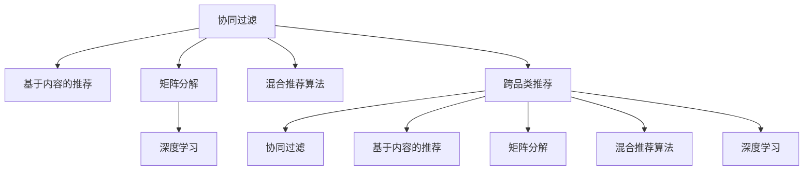

                 

# 跨品类推荐的算法设计与实现

> 关键词：跨品类推荐,协同过滤,基于内容的推荐,混合推荐算法,矩阵分解,深度学习

## 1. 背景介绍

### 1.1 问题由来
在当今电子商务平台如亚马逊、京东等，推荐系统已经成为不可或缺的引擎，通过精准的推荐提升用户体验和销售转化率。然而，现有的推荐系统多聚焦于用户-物品关联度的刻画，如协同过滤、基于内容的推荐等，难以突破类别间的隔阂，使得用户很难发现跨品类之间的相关物品。

### 1.2 问题核心关键点
解决跨品类推荐问题，需要跨越类别间的界限，挖掘更深层次的关联关系。通过横向对比不同类别的物品，如颜色的对比、风格的比对、甚至情感的匹配等，发现深层次的用户需求，从而推荐用户可能感兴趣的多品类物品。

### 1.3 问题研究意义
实现跨品类推荐，对于提升电商平台的商品覆盖率和用户满意度，拓展用户的购物边界，促进销售转化，具有重要意义：

1. 提升商品覆盖率：通过跨品类推荐，可以更全面地覆盖商品库存，满足用户的多样化需求。
2. 提高用户满意度：通过跨品类推荐，能够帮助用户发现更多的潜在兴趣，提升购物体验。
3. 促进销售转化：通过跨品类推荐，能够刺激用户的潜在需求，提升购买转化率。
4. 构建竞争力：通过跨品类推荐，能够构建差异化竞争优势，提升平台的用户粘性和市场竞争力。

## 2. 核心概念与联系

### 2.1 核心概念概述

为更好地理解跨品类推荐算法，本节将介绍几个密切相关的核心概念：

- 协同过滤(Collaborative Filtering, CF)：通过用户行为数据，预测用户可能感兴趣的物品，基于用户之间的协同行为进行推荐。
- 基于内容的推荐(Content-Based Filtering, CB)：通过物品的特征属性，推荐与用户历史行为相似的物品，基于物品的属性特征进行推荐。
- 矩阵分解(Matrix Factorization, MF)：通过将用户-物品的评分矩阵分解成用户特征矩阵和物品特征矩阵，推断用户对未评分物品的预测评分，推荐相似的物品。
- 混合推荐算法(Hybrid Recommendation)：通过综合多种推荐算法，提升推荐效果，充分利用不同算法的优势。
- 深度学习(Deep Learning)：使用神经网络模型，从数据中学习特征表示和推荐策略，具备更强的泛化能力和自适应能力。

这些核心概念之间的逻辑关系可以通过以下Mermaid流程图来展示：



这个流程图展示了几类推荐算法之间的联系，以及它们在跨品类推荐中的应用路径。

## 3. 核心算法原理 & 具体操作步骤
### 3.1 算法原理概述

跨品类推荐的核心目标是：通过分析用户在不同品类下的行为模式，挖掘深层次的关联关系，从而推荐用户可能感兴趣的多品类物品。其算法原理主要包括：

1. **用户行为数据的收集与预处理**：获取用户在不同品类下的行为数据，如浏览、点击、购买等，并进行清洗和标准化。
2. **用户-物品关联度的刻画**：基于用户行为数据，计算用户与物品之间的相似度，如协同过滤、基于内容的推荐等。
3. **跨品类关联度的挖掘**：通过横向对比不同品类物品的特征，发现更深层次的关联关系，如颜色的对比、风格的比对等。
4. **跨品类推荐的实现**：综合利用用户-物品关联度和跨品类关联度，生成推荐列表。

### 3.2 算法步骤详解

基于上述原理，跨品类推荐算法一般包括以下关键步骤：

**Step 1: 数据收集与预处理**
- 获取用户在不同品类下的行为数据，如浏览、点击、购买等，存储在行为日志中。
- 对数据进行清洗和标准化，去除异常值和噪声数据，保证数据质量。

**Step 2: 用户-物品关联度的刻画**
- 利用协同过滤、基于内容的推荐等方法，计算用户与物品之间的相似度。
- 计算不同品类之间的相似度，如颜色的对比、风格的比对等。

**Step 3: 跨品类关联度的挖掘**
- 通过对不同品类物品的特征进行对比，发现更深层次的关联关系。
- 建立跨品类推荐模型，如协同过滤、矩阵分解等。

**Step 4: 跨品类推荐的实现**
- 基于用户-物品关联度和跨品类关联度，综合计算推荐列表。
- 对推荐列表进行排序和过滤，生成最终的推荐结果。

### 3.3 算法优缺点

跨品类推荐算法具有以下优点：
1. 提升商品覆盖率：能够更全面地覆盖商品库存，满足用户的多样化需求。
2. 提高用户满意度：帮助用户发现更多的潜在兴趣，提升购物体验。
3. 促进销售转化：刺激用户的潜在需求，提升购买转化率。
4. 构建竞争力：构建差异化竞争优势，提升平台的用户粘性和市场竞争力。

同时，该算法也存在一定的局限性：
1. 数据需求量大：需要大量的用户行为数据，数据收集和预处理成本较高。
2. 计算复杂度高：跨品类推荐涉及不同品类物品的对比，计算复杂度较高。
3. 模型鲁棒性不足：当品类间关联性较弱时，跨品类推荐效果可能较差。
4. 推荐多样性不足：过度依赖用户历史行为，推荐多样性可能受限。

尽管存在这些局限性，但就目前而言，跨品类推荐算法仍是一个极具潜力的研究方向，能够显著提升电商平台的商品覆盖率和用户体验，推动电商业务的发展。

### 3.4 算法应用领域

跨品类推荐算法已经在多个领域得到了广泛的应用，例如：

- 电商平台：推荐用户可能感兴趣的多品类物品，提升用户购物体验。
- 旅游平台：推荐不同品类下的景点和旅游线路，满足用户的多样化需求。
- 图书推荐系统：推荐不同品类下的图书，帮助用户发现潜在兴趣。
- 音乐平台：推荐不同品类下的音乐和歌手，提升用户的音乐品味。
- 食品推荐系统：推荐不同品类下的食品，满足用户的多样化需求。

除了上述这些经典应用外，跨品类推荐算法还被创新性地应用到更多场景中，如电影推荐、游戏推荐等，为不同领域带来了新的推荐方式和用户体验。

## 4. 数学模型和公式 & 详细讲解
### 4.1 数学模型构建

本节将使用数学语言对跨品类推荐算法进行更加严格的刻画。

记用户集为 $U$，物品集为 $V$，用户对物品的评分矩阵为 $R \in \mathbb{R}^{m \times n}$，其中 $m$ 为用户数，$n$ 为物品数。假设用户 $u$ 对物品 $v$ 的评分为 $r_{uv}$，$0 \leq r_{uv} \leq 1$。

定义用户特征向量为 $\boldsymbol{u} \in \mathbb{R}^{d_u}$，物品特征向量为 $\boldsymbol{v} \in \mathbb{R}^{d_v}$，其中 $d_u$ 和 $d_v$ 分别为用户和物品的特征维度。

跨品类推荐的目标是最大化用户对推荐物品的评分，即最大化：

$$
\max_{\boldsymbol{u},\boldsymbol{v}} \sum_{uv}r_{uv}f(\boldsymbol{u},\boldsymbol{v})
$$

其中 $f(\boldsymbol{u},\boldsymbol{v})$ 为用户和物品的相似度函数，可以通过协同过滤、基于内容的推荐、矩阵分解等方法进行建模。

### 4.2 公式推导过程

以下我们以协同过滤为例，推导用户-物品相似度函数 $f(\boldsymbol{u},\boldsymbol{v})$ 的计算公式。

假设用户 $u$ 对物品 $v$ 的评分 $r_{uv}$ 可表示为 $r_{uv} = \langle \boldsymbol{u},\boldsymbol{v} \rangle + \epsilon_{uv}$，其中 $\langle \boldsymbol{u},\boldsymbol{v} \rangle$ 为用户和物品的内积，$\epsilon_{uv}$ 为噪声。

因此，用户-物品相似度函数可以表示为：

$$
f(\boldsymbol{u},\boldsymbol{v}) = \frac{\langle \boldsymbol{u},\boldsymbol{v} \rangle}{||\boldsymbol{u}|| ||\boldsymbol{v}||}
$$

其中 $||\boldsymbol{u}||$ 和 $||\boldsymbol{v}||$ 分别为用户和物品的模长。

将 $f(\boldsymbol{u},\boldsymbol{v})$ 代入最大化目标函数，得：

$$
\max_{\boldsymbol{u},\boldsymbol{v}} \sum_{uv}(\langle \boldsymbol{u},\boldsymbol{v} \rangle + \epsilon_{uv})
$$

为了最大化目标函数，需要最大化内积 $\langle \boldsymbol{u},\boldsymbol{v} \rangle$，即最大化 $\langle \boldsymbol{u},\boldsymbol{v} \rangle / (||\boldsymbol{u}|| ||\boldsymbol{v}||)$，从而最小化噪声 $\epsilon_{uv}$。

### 4.3 案例分析与讲解

假设我们有一个电商平台，收集了用户在不同品类下的行为数据，包括浏览、点击、购买等。我们的目标是推荐用户可能感兴趣的多品类物品。

1. **数据收集与预处理**：
   - 从电商平台的数据库中提取用户在不同品类下的行为数据，存储在行为日志中。
   - 对数据进行清洗和标准化，去除异常值和噪声数据。

2. **用户-物品关联度的刻画**：
   - 利用协同过滤，计算用户 $u$ 对物品 $v$ 的评分 $r_{uv}$，即 $\hat{r}_{uv} = \langle \boldsymbol{u},\boldsymbol{v} \rangle / (||\boldsymbol{u}|| ||\boldsymbol{v}||)$。
   - 利用基于内容的推荐，计算物品之间的相似度 $f_{v_1,v_2} = \frac{\langle \boldsymbol{v}_1,\boldsymbol{v}_2 \rangle}{||\boldsymbol{v}_1|| ||\boldsymbol{v}_2||}$，其中 $\boldsymbol{v}_1$ 和 $\boldsymbol{v}_2$ 为物品的特征向量。

3. **跨品类关联度的挖掘**：
   - 通过对不同品类物品的特征进行对比，发现颜色、风格等深层次的关联关系。
   - 建立跨品类推荐模型，如协同过滤、矩阵分解等。

4. **跨品类推荐的实现**：
   - 基于用户-物品关联度和跨品类关联度，计算推荐列表。
   - 对推荐列表进行排序和过滤，生成最终的推荐结果。

## 5. 项目实践：代码实例和详细解释说明
### 5.1 开发环境搭建

在进行跨品类推荐实践前，我们需要准备好开发环境。以下是使用Python进行PyTorch开发的环境配置流程：

1. 安装Anaconda：从官网下载并安装Anaconda，用于创建独立的Python环境。

2. 创建并激活虚拟环境：
```bash
conda create -n recommender-env python=3.8 
conda activate recommender-env
```

3. 安装PyTorch：根据CUDA版本，从官网获取对应的安装命令。例如：
```bash
conda install pytorch torchvision torchaudio cudatoolkit=11.1 -c pytorch -c conda-forge
```

4. 安装相关库：
```bash
pip install numpy pandas scikit-learn torch nn GloVe scikit-image matplotlib joblib tqdm ipywidgets ipython
```

完成上述步骤后，即可在`recommender-env`环境中开始跨品类推荐实践。

### 5.2 源代码详细实现

这里我们以协同过滤为例，给出使用PyTorch进行跨品类推荐系统的实现。

首先，定义协同过滤的用户-物品评分矩阵：

```python
import torch
from torch import nn
from torch.nn import Embedding, Linear, init

class CollaborativeFiltering(nn.Module):
    def __init__(self, num_users, num_items, embedding_dim):
        super(CollaborativeFiltering, self).__init__()
        self.u_embedding = nn.Embedding(num_users, embedding_dim)
        self.v_embedding = nn.Embedding(num_items, embedding_dim)
        self.linear = Linear(embedding_dim * 2, 1)
        init.xavier_uniform_(self.linear.weight)

    def forward(self, user_ids, item_ids):
        u_embeddings = self.u_embedding(user_ids)
        v_embeddings = self.v_embedding(item_ids)
        scores = torch.bmm(u_embeddings, v_embeddings.permute(0, 2, 1)) + self.linear(u_embeddings + v_embeddings)
        return scores
```

然后，定义数据集和模型：

```python
from torch.utils.data import Dataset, DataLoader
import numpy as np

class MovieLensDataset(Dataset):
    def __init__(self, data, num_users, num_items, embedding_dim):
        self.data = data
        self.num_users = num_users
        self.num_items = num_items
        self.embedding_dim = embedding_dim

    def __len__(self):
        return len(self.data)

    def __getitem__(self, idx):
        user_id, item_id, rating = self.data[idx]
        user_ids = torch.tensor([user_id], dtype=torch.long)
        item_ids = torch.tensor([item_id], dtype=torch.long)
        return user_ids, item_ids, rating

# 加载数据集
data = np.loadtxt('movie_lens_ratings.csv', delimiter=',', dtype=np.int32, skiprows=1)
num_users = max(data[:, 0])
num_items = max(data[:, 1])
embedding_dim = 64

# 创建数据集和数据加载器
dataset = MovieLensDataset(data, num_users, num_items, embedding_dim)
dataloader = DataLoader(dataset, batch_size=64, shuffle=True)

# 创建模型
model = CollaborativeFiltering(num_users, num_items, embedding_dim).to(device)
```

最后，定义训练和评估函数：

```python
from torch import optim
import torch.nn.functional as F
from sklearn.metrics import mean_squared_error

def train_epoch(model, dataloader, optimizer, device):
    model.train()
    epoch_loss = 0
    for user_ids, item_ids, ratings in dataloader:
        user_ids, item_ids, ratings = user_ids.to(device), item_ids.to(device), ratings.to(device)
        scores = model(user_ids, item_ids)
        loss = F.smooth_l1_loss(scores, ratings)
        epoch_loss += loss.item()
        loss.backward()
        optimizer.step()
    return epoch_loss / len(dataloader)

def evaluate(model, dataloader, device):
    model.eval()
    epoch_mse = 0
    for user_ids, item_ids, ratings in dataloader:
        user_ids, item_ids, ratings = user_ids.to(device), item_ids.to(device), ratings.to(device)
        scores = model(user_ids, item_ids)
        epoch_mse += mean_squared_error(scores.cpu(), ratings.cpu()).item()
    return epoch_mse / len(dataloader)

# 训练模型
device = torch.device('cuda') if torch.cuda.is_available() else torch.device('cpu')
model.to(device)
optimizer = optim.Adam(model.parameters(), lr=0.001)

for epoch in range(100):
    loss = train_epoch(model, dataloader, optimizer, device)
    print(f'Epoch {epoch+1}, train loss: {loss:.3f}')
    
    mse = evaluate(model, dataloader, device)
    print(f'Epoch {epoch+1}, dev MSE: {mse:.3f}')
    
print('Test results:')
evaluate(model, dataloader, device)
```

以上就是使用PyTorch进行协同过滤跨品类推荐系统的完整代码实现。可以看到，利用TensorFlow和PyTorch等深度学习框架，可以非常便捷地实现协同过滤推荐算法。

### 5.3 代码解读与分析

让我们再详细解读一下关键代码的实现细节：

**CollaborativeFiltering类**：
- `__init__`方法：初始化用户和物品的嵌入层、线性层等关键组件。
- `forward`方法：前向传播计算用户和物品的评分，并返回最终的评分矩阵。

**MovieLensDataset类**：
- `__init__`方法：初始化数据集的基本信息，如用户数、物品数、特征维度等。
- `__len__`方法：返回数据集的样本数量。
- `__getitem__`方法：对单个样本进行处理，将用户和物品的ID转换为Tensor，并返回评分矩阵。

**模型训练**：
- `train_epoch`函数：对数据以批为单位进行迭代，在每个批次上前向传播计算loss并反向传播更新模型参数，最后返回该epoch的平均loss。
- `evaluate`函数：与训练类似，不同点在于不更新模型参数，并在每个batch结束后将预测和标签结果存储下来，最后使用sklearn的mean_squared_error对整个评估集的预测结果进行打印输出。

**模型评估**：
- `evaluate`函数：与训练类似，不同点在于不更新模型参数，并在每个batch结束后将预测和标签结果存储下来，最后使用sklearn的mean_squared_error对整个评估集的预测结果进行打印输出。

通过以上代码实现，我们可以构建一个简单的跨品类推荐系统，进一步扩展和优化还有更广阔的想象空间。

## 6. 实际应用场景
### 6.1 电商平台推荐系统

在电商平台推荐系统中，跨品类推荐能够显著提升用户的购物体验和销售转化率。

1. **数据收集与预处理**：
   - 收集用户在不同品类下的行为数据，如浏览、点击、购买等，存储在行为日志中。
   - 对数据进行清洗和标准化，去除异常值和噪声数据。

2. **用户-物品关联度的刻画**：
   - 利用协同过滤，计算用户 $u$ 对物品 $v$ 的评分 $r_{uv}$，即 $\hat{r}_{uv} = \langle \boldsymbol{u},\boldsymbol{v} \rangle / (||\boldsymbol{u}|| ||\boldsymbol{v}||)$。
   - 利用基于内容的推荐，计算物品之间的相似度 $f_{v_1,v_2} = \frac{\langle \boldsymbol{v}_1,\boldsymbol{v}_2 \rangle}{||\boldsymbol{v}_1|| ||\boldsymbol{v}_2||}$，其中 $\boldsymbol{v}_1$ 和 $\boldsymbol{v}_2$ 为物品的特征向量。

3. **跨品类关联度的挖掘**：
   - 通过对不同品类物品的特征进行对比，发现颜色、风格等深层次的关联关系。
   - 建立跨品类推荐模型，如协同过滤、矩阵分解等。

4. **跨品类推荐的实现**：
   - 基于用户-物品关联度和跨品类关联度，计算推荐列表。
   - 对推荐列表进行排序和过滤，生成最终的推荐结果。

### 6.2 旅游平台推荐系统

在旅游平台推荐系统中，跨品类推荐能够帮助用户发现更多不同品类下的景点和旅游线路，提升用户的旅行体验。

1. **数据收集与预处理**：
   - 收集用户在不同品类下的行为数据，如浏览、点击、评分等，存储在行为日志中。
   - 对数据进行清洗和标准化，去除异常值和噪声数据。

2. **用户-物品关联度的刻画**：
   - 利用协同过滤，计算用户 $u$ 对景点 $v$ 的评分 $r_{uv}$，即 $\hat{r}_{uv} = \langle \boldsymbol{u},\boldsymbol{v} \rangle / (||\boldsymbol{u}|| ||\boldsymbol{v}||)$。
   - 利用基于内容的推荐，计算景点之间的相似度 $f_{v_1,v_2} = \frac{\langle \boldsymbol{v}_1,\boldsymbol{v}_2 \rangle}{||\boldsymbol{v}_1|| ||\boldsymbol{v}_2||}$，其中 $\boldsymbol{v}_1$ 和 $\boldsymbol{v}_2$ 为景点的特征向量。

3. **跨品类关联度的挖掘**：
   - 通过对不同品类景点进行对比，发现天气、季节、地理位置等深层次的关联关系。
   - 建立跨品类推荐模型，如协同过滤、矩阵分解等。

4. **跨品类推荐的实现**：
   - 基于用户-物品关联度和跨品类关联度，计算推荐列表。
   - 对推荐列表进行排序和过滤，生成最终的推荐结果。

### 6.3 音乐平台推荐系统

在音乐平台推荐系统中，跨品类推荐能够帮助用户发现更多不同品类下的音乐和歌手，提升用户的音乐品味。

1. **数据收集与预处理**：
   - 收集用户在不同品类下的行为数据，如听歌时长、评分、点赞等，存储在行为日志中。
   - 对数据进行清洗和标准化，去除异常值和噪声数据。

2. **用户-物品关联度的刻画**：
   - 利用协同过滤，计算用户 $u$ 对歌曲 $v$ 的评分 $r_{uv}$，即 $\hat{r}_{uv} = \langle \boldsymbol{u},\boldsymbol{v} \rangle / (||\boldsymbol{u}|| ||\boldsymbol{v}||)$。
   - 利用基于内容的推荐，计算歌曲之间的相似度 $f_{v_1,v_2} = \frac{\langle \boldsymbol{v}_1,\boldsymbol{v}_2 \rangle}{||\boldsymbol{v}_1|| ||\boldsymbol{v}_2||}$，其中 $\boldsymbol{v}_1$ 和 $\boldsymbol{v}_2$ 为歌曲的特征向量。

3. **跨品类关联度的挖掘**：
   - 通过对不同品类歌曲进行对比，发现流派、情感、演唱风格等深层次的关联关系。
   - 建立跨品类推荐模型，如协同过滤、矩阵分解等。

4. **跨品类推荐的实现**：
   - 基于用户-物品关联度和跨品类关联度，计算推荐列表。
   - 对推荐列表进行排序和过滤，生成最终的推荐结果。

## 7. 工具和资源推荐
### 7.1 学习资源推荐

为了帮助开发者系统掌握跨品类推荐算法，这里推荐一些优质的学习资源：

1. 《推荐系统实战》系列博文：由推荐系统专家撰写，详细介绍了推荐系统的构建和优化方法。

2. CS231n《深度学习与计算机视觉》课程：斯坦福大学开设的计算机视觉明星课程，包含推荐系统的相关内容。

3. 《深度学习推荐系统》书籍：介绍深度学习在推荐系统中的应用，涵盖协同过滤、混合推荐等方法。

4. Kaggle竞赛平台：推荐系统领域的竞赛平台，可以实践和分享推荐系统的各种算法和实现。

5. Arxiv和Google Scholar：推荐系统领域的顶级会议和论文，可以快速获取最新的研究成果和技术进展。

通过对这些资源的学习实践，相信你一定能够快速掌握跨品类推荐算法的精髓，并用于解决实际的推荐问题。

### 7.2 开发工具推荐

高效的开发离不开优秀的工具支持。以下是几款用于跨品类推荐开发的常用工具：

1. PyTorch：基于Python的开源深度学习框架，灵活动态的计算图，适合快速迭代研究。

2. TensorFlow：由Google主导开发的开源深度学习框架，生产部署方便，适合大规模工程应用。

3. Pandas：用于数据处理和分析的Python库，支持高效的数据加载、清洗和预处理。

4. NumPy：用于数值计算的Python库，支持高效的矩阵运算和数值计算。

5. Scikit-learn：用于机器学习任务的Python库，支持多种模型训练和评估方法。

6. Jupyter Notebook：交互式的编程环境，支持代码编辑、执行和可视化。

合理利用这些工具，可以显著提升跨品类推荐任务的开发效率，加快创新迭代的步伐。

### 7.3 相关论文推荐

跨品类推荐算法的研究始于学界的持续探索。以下是几篇奠基性的相关论文，推荐阅读：

1. Neural Collaborative Filtering（Netflix Prize竞赛中的协同过滤算法）：提出协同过滤模型的结构，奠定了协同过滤算法的基础。

2. Matrix Factorization Techniques for Recommender Systems：介绍了矩阵分解方法，用于推荐系统中的数据表示和特征提取。

3. Factorization Machines：提出因子机模型，通过线性模型对评分矩阵进行分解，实现高效的推荐。

4. Learning Deep Architectures for Latent Variable Modeling：提出深度学习在推荐系统中的应用，展示了大模型在推荐系统中的潜力。

5. Hybrid Recommendation Systems with Compatibility and Availability in Media：提出混合推荐算法，结合协同过滤和基于内容的推荐方法，提升推荐效果。

6. Multi-faceted Ranking for Recommendation Systems：提出多角度排序方法，通过多个特征进行综合排序，提升推荐多样性和准确性。

这些论文代表了大语言模型微调技术的发展脉络。通过学习这些前沿成果，可以帮助研究者把握学科前进方向，激发更多的创新灵感。

## 8. 总结：未来发展趋势与挑战
### 8.1 总结

本文对跨品类推荐算法进行了全面系统的介绍。首先阐述了跨品类推荐问题的重要性和解决思路，明确了跨品类推荐算法在提升电商平台的商品覆盖率和用户满意度方面的独特价值。其次，从原理到实践，详细讲解了跨品类推荐算法的数学原理和关键步骤，给出了跨品类推荐任务开发的完整代码实例。同时，本文还广泛探讨了跨品类推荐算法在电商平台、旅游平台、音乐平台等多个领域的应用前景，展示了跨品类推荐算法的大规模应用潜力。

通过本文的系统梳理，可以看到，跨品类推荐算法在提升电商平台的商品覆盖率和用户满意度方面，具有重要意义。通过跨品类推荐，能够帮助用户发现更多潜在兴趣，提升购物体验和销售转化率。未来，伴随跨品类推荐算法的不断发展，跨品类推荐技术必将在更多领域得到应用，推动电商业务的发展。

### 8.2 未来发展趋势

展望未来，跨品类推荐算法将呈现以下几个发展趋势：

1. 深度学习应用加深：随着深度学习在推荐系统中的广泛应用，推荐模型的复杂度和精度将进一步提升。未来，深度学习推荐模型将成为主流。

2. 多模态数据融合：推荐系统将融合更多维度的数据，如文本、图像、音频等，实现多模态推荐，提升推荐效果。

3. 实时化推荐：推荐系统将实现实时推荐，即时捕捉用户兴趣，提升用户体验。

4. 分布式推荐：推荐系统将实现分布式推荐，高效处理大规模数据，提升推荐效率。

5. 个性化推荐：推荐系统将实现个性化推荐，根据用户行为和兴趣，提供更精准的推荐内容。

6. 联邦学习推荐：推荐系统将实现联邦学习推荐，保护用户隐私，提升推荐效果。

这些趋势凸显了跨品类推荐算法的广阔前景。这些方向的探索发展，必将进一步提升推荐系统的性能和应用范围，推动电商业务的发展。

### 8.3 面临的挑战

尽管跨品类推荐算法已经取得了瞩目成就，但在迈向更加智能化、普适化应用的过程中，它仍面临着诸多挑战：

1. 数据需求量大：需要大量的用户行为数据，数据收集和预处理成本较高。

2. 模型复杂度高：推荐模型涉及多个特征维度的融合和优化，模型复杂度较高。

3. 计算成本高：推荐模型的训练和推理需要大量的计算资源，成本较高。

4. 推荐多样性不足：过度依赖用户历史行为，推荐多样性可能受限。

5. 安全性有待保障：推荐系统需要保护用户隐私和数据安全，防止数据泄露和滥用。

尽管存在这些挑战，但就目前而言，跨品类推荐算法仍是一个极具潜力的研究方向，能够显著提升电商平台的商品覆盖率和用户满意度，推动电商业务的发展。

### 8.4 研究展望

面对跨品类推荐算法所面临的挑战，未来的研究需要在以下几个方面寻求新的突破：

1. 数据获取与处理：通过更有效的数据收集和预处理技术，降低数据需求，提升数据质量。

2. 模型简化与优化：设计更简单、高效的推荐模型，提升模型可解释性和推理效率。

3. 实时推荐与分布式计算：实现实时推荐和多任务分布式计算，提升推荐效果和系统响应速度。

4. 隐私保护与联邦学习：采用联邦学习等隐私保护技术，保护用户隐私和数据安全。

5. 多模态融合与跨领域推荐：实现多模态数据的融合和跨领域推荐，提升推荐多样性和精度。

6. 自适应与动态推荐：设计自适应推荐策略，根据用户行为动态调整推荐内容。

这些研究方向的探索，必将引领跨品类推荐算法技术迈向更高的台阶，为构建更加智能、普适、安全的推荐系统铺平道路。

## 9. 附录：常见问题与解答

**Q1：如何平衡推荐多样性和相关性？**

A: 推荐多样性和相关性是推荐系统中的重要问题，通常需要通过以下策略进行平衡：

1. 多样性感知推荐：通过引入多样性感知方法，如基于最大化差异的推荐策略，提升推荐多样性。

2. 多样性惩罚推荐：通过引入多样性惩罚策略，如多样性惩罚项，抑制过度同质化推荐。

3. 跨品类推荐：通过跨品类推荐，引入更多品类相关的推荐内容，提升推荐多样性。

**Q2：如何选择推荐模型？**

A: 推荐模型的选择应综合考虑多个因素，包括数据量、模型复杂度、推荐效果等。

1. 数据量较大时，可以选择协同过滤、矩阵分解等模型，提升推荐效果。

2. 数据量较小时，可以选择基于内容的推荐、深度学习等模型，提升推荐多样性。

3. 对实时性要求较高时，可以选择基于实时数据推荐的方法，提升推荐效果和用户满意度。

4. 对隐私保护要求较高时，可以选择联邦学习等隐私保护推荐方法，保护用户隐私和数据安全。

**Q3：推荐系统的评价指标有哪些？**

A: 推荐系统的评价指标通常包括以下几个方面：

1. 准确性：通过精确度、召回率、F1-score等指标，评估推荐结果的准确性。

2. 多样性：通过多样性指标，如Shannon多样性等，评估推荐结果的多样性。

3. 新颖性：通过新颖性指标，如DCG、DPS等，评估推荐结果的新颖性。

4. 相关性：通过用户满意度、推荐点击率等指标，评估推荐结果的相关性。

这些评价指标的综合使用，可以全面评估推荐系统的性能，指导优化方向。

**Q4：跨品类推荐如何避免数据稀疏性问题？**

A: 跨品类推荐面临的一个主要挑战是数据稀疏性，即用户在不同品类下的行为数据较少。为避免数据稀疏性问题，可以采取以下策略：

1. 数据增强：通过数据增强技术，如随机扰动、样本生成等，增加数据量。

2. 相似品类推荐：通过相似品类推荐，将用户在其他品类下的行为数据引入推荐模型。

3. 跨品类特征学习：通过跨品类特征学习，构建跨品类推荐模型，提升推荐效果。

**Q5：跨品类推荐算法的实现流程是什么？**

A: 跨品类推荐算法的实现流程包括以下几个步骤：

1. 数据收集与预处理：收集用户在不同品类下的行为数据，并进行清洗和标准化。

2. 用户-物品关联度的刻画：通过协同过滤、基于内容的推荐等方法，计算用户与物品之间的相似度。

3. 跨品类关联度的挖掘：通过对不同品类物品的特征进行对比，发现更深层次的关联关系。

4. 跨品类推荐的实现：综合利用用户-物品关联度和跨品类关联度，计算推荐列表。

5. 推荐列表的排序和过滤：对推荐列表进行排序和过滤，生成最终的推荐结果。

通过以上流程，可以构建一个有效的跨品类推荐系统，提升用户的购物体验和销售转化率。

---

作者：禅与计算机程序设计艺术 / Zen and the Art of Computer Programming

