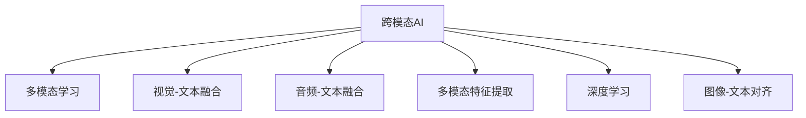

                 

# 跨模态AI：打通图像、文本与音频的壁垒

> 关键词：跨模态AI, 多模态学习, 视觉-文本融合, 音频-文本融合, 多模态特征提取, 深度学习, 图像-文本对齐

## 1. 背景介绍

随着技术的迅猛发展，人工智能（AI）在各个领域的应用日益广泛，从医疗、金融到零售、教育等各个领域，AI技术都在助力企业提升效率、优化决策和增强用户体验。然而，传统的AI技术往往局限于单一模态的数据，无法充分利用多模态信息的融合优势，限制了其应用范围和效果。跨模态AI（Cross-Modal AI）技术，旨在打破不同模态数据之间的壁垒，实现图像、文本、音频等多模态数据的有机整合，从而提升AI系统的智能水平和应用效果。

跨模态AI技术的应用场景遍及各个行业，例如：医疗领域的影像诊断、金融行业的风险评估、零售行业的客户行为分析、教育领域的个性化学习推荐等。通过将图像、文本和音频等多模态数据进行深度融合，跨模态AI技术能够更全面、准确地理解用户的意图和需求，从而提供更为精准和个性化的服务。

## 2. 核心概念与联系

### 2.1 核心概念概述

为了更好地理解跨模态AI技术，本节将介绍几个关键概念：

- **跨模态AI (Cross-Modal AI)**：利用深度学习技术，实现不同模态（如图像、文本、音频）数据之间的信息整合和协同学习，以提升AI系统的智能化水平。
- **多模态学习 (Multi-Modal Learning)**：指同时学习多个模态的数据，从不同角度获取更多信息，提升系统的泛化能力和鲁棒性。
- **视觉-文本融合 (Visual-Textual Fusion)**：将图像和文本信息进行深度融合，形成更丰富的语义表示，用于图像描述、图像检索等任务。
- **音频-文本融合 (Audio-Textual Fusion)**：将音频和文本信息进行深度融合，用于语音识别、语音转换等任务。
- **多模态特征提取 (Multi-Modal Feature Extraction)**：从不同模态的数据中提取高层次的特征表示，用于跨模态数据间的匹配和融合。
- **深度学习 (Deep Learning)**：利用深度神经网络，从大规模数据中学习到复杂的特征表示，以支持跨模态数据的整合和理解。
- **图像-文本对齐 (Image-Text Alignment)**：将图像和文本数据进行对齐，建立两者之间的关联关系，用于图像描述、图像标注等任务。

这些核心概念之间的逻辑关系可以通过以下Mermaid流程图来展示：



这个流程图展示了这个系统中的关键组件及其之间的关系：

1. 跨模态AI作为核心组件，整合了多模态学习、视觉-文本融合、音频-文本融合、多模态特征提取、深度学习、图像-文本对齐等多种技术。
2. 多模态学习作为基础，帮助跨模态AI从多个模态中学习更丰富的信息。
3. 视觉-文本融合和音频-文本融合分别处理图像和音频与文本的融合。
4. 多模态特征提取和深度学习用于提取高层次的特征表示，用于跨模态数据的匹配和融合。
5. 图像-文本对齐用于建立图像和文本之间的关联关系，用于图像描述、图像标注等任务。

## 3. 核心算法原理 & 具体操作步骤

### 3.1 算法原理概述

跨模态AI技术的核心原理是基于深度学习的多模态数据融合。其基本思想是，利用深度神经网络，从不同模态的数据中提取高层次的特征表示，然后通过特定的融合算法将这些特征进行整合，形成新的多模态特征表示。这些特征表示可以用于跨模态匹配、特征对齐、协同学习等多种任务。

### 3.2 算法步骤详解

以下是跨模态AI技术的详细步骤：

**Step 1: 数据收集与预处理**

- 收集不同模态的数据集，包括图像、文本、音频等。
- 对数据进行预处理，如图像的归一化、文本的标记化、音频的特征提取等。

**Step 2: 特征提取**

- 对每种模态的数据分别进行特征提取，形成高层次的特征表示。例如，利用卷积神经网络（CNN）提取图像特征，利用循环神经网络（RNN）或Transformer模型提取文本特征，利用卷积神经网络或Transformer模型提取音频特征。

**Step 3: 特征融合**

- 将不同模态的特征表示进行融合，形成多模态特征表示。常用的融合方法包括拼接（Concatenation）、注意力机制（Attention）、多模态自编码器（Multi-Modal Autoencoder）等。
- 以拼接方法为例，将图像特征、文本特征和音频特征进行拼接，形成新的多模态特征表示。

**Step 4: 协同学习**

- 利用多模态特征表示，进行协同学习，提升系统的泛化能力和鲁棒性。常用的协同学习方法包括多任务学习（Multi-Task Learning, MTL）、联合训练（Joint Training）、元学习（Meta-Learning）等。

**Step 5: 模型训练与评估**

- 将多模态特征表示作为输入，进行深度学习模型的训练和评估。常用的模型包括卷积神经网络、循环神经网络、Transformer模型等。
- 在训练过程中，使用交叉熵损失等损失函数进行优化，同时使用数据增强等技术，防止过拟合。
- 在评估过程中，使用精度、召回率、F1分数等指标，对模型的性能进行评估。

### 3.3 算法优缺点

跨模态AI技术的优点包括：

- **多模态信息融合**：充分利用不同模态的数据，提升系统的泛化能力和鲁棒性。
- **任务多样性**：可以应用于多种任务，如图像描述、图像检索、语音识别、语音转换等。
- **灵活性**：可以根据实际需求，灵活选择不同的特征提取和融合方法。

其缺点包括：

- **数据需求高**：需要收集大量的不同模态数据，才能获得良好的效果。
- **计算复杂度高**：深度学习模型的训练和推理复杂度较高，需要高性能的计算资源。
- **模型可解释性差**：深度学习模型通常是黑箱模型，难以解释其内部工作机制。

### 3.4 算法应用领域

跨模态AI技术已经在多个领域得到了广泛应用，例如：

- **医疗领域**：通过图像、文本和音频数据的融合，实现更准确的疾病诊断和风险评估。
- **金融领域**：通过语音和文本数据的融合，提升风险评估和反欺诈检测的准确性。
- **零售领域**：通过图像、文本和音频数据的融合，实现客户行为分析和个性化推荐。
- **教育领域**：通过文本和音频数据的融合，实现更个性化的学习推荐和智能辅导。
- **娱乐领域**：通过图像、文本和音频数据的融合，提升虚拟现实（VR）和增强现实（AR）系统的交互体验。

这些领域的应用，展示了跨模态AI技术的强大潜力和广泛应用前景。

## 4. 数学模型和公式 & 详细讲解 & 举例说明

### 4.1 数学模型构建

为了更好地理解跨模态AI技术的数学模型，本节将构建一个简单的跨模态特征融合模型。

假设有一个图像和文本数据的跨模态数据集，其中图像数据为 $X_{\text{img}}$，文本数据为 $X_{\text{text}}$。分别用 $f_{\text{img}}$ 和 $f_{\text{text}}$ 表示图像特征提取器和文本特征提取器，得到高层次的特征表示 $z_{\text{img}}$ 和 $z_{\text{text}}$。

**视觉-文本融合模型**：

$$
z_{\text{fusion}} = \mathbf{W}_{\text{fusion}} [z_{\text{img}}, z_{\text{text}}]^T
$$

其中，$\mathbf{W}_{\text{fusion}}$ 是一个线性变换矩阵，用于将图像特征和文本特征拼接成一个新的多模态特征表示 $z_{\text{fusion}}$。

### 4.2 公式推导过程

以视觉-文本融合模型为例，推导其公式推导过程。

假设 $z_{\text{img}}$ 和 $z_{\text{text}}$ 的维度分别为 $d_{\text{img}}$ 和 $d_{\text{text}}$，则融合后的特征表示 $z_{\text{fusion}}$ 的维度为 $d_{\text{fusion}} = d_{\text{img}} + d_{\text{text}}$。

设 $X_{\text{img}} \in \mathbb{R}^{N \times d_{\text{img}}}$ 和 $X_{\text{text}} \in \mathbb{R}^{N \times d_{\text{text}}}$，则 $z_{\text{img}}$ 和 $z_{\text{text}}$ 可以表示为：

$$
z_{\text{img}} = f_{\text{img}}(X_{\text{img}})
$$

$$
z_{\text{text}} = f_{\text{text}}(X_{\text{text}})
$$

将 $z_{\text{img}}$ 和 $z_{\text{text}}$ 拼接成新的特征表示 $z_{\text{fusion}}$，可以表示为：

$$
z_{\text{fusion}} = \mathbf{W}_{\text{fusion}} [z_{\text{img}}, z_{\text{text}}]^T
$$

其中，$\mathbf{W}_{\text{fusion}}$ 为拼接矩阵，可以表示为：

$$
\mathbf{W}_{\text{fusion}} = \begin{bmatrix} \mathbf{I}_{d_{\text{img}}} & \mathbf{0} \\ \mathbf{0} & \mathbf{I}_{d_{\text{text}}} \end{bmatrix}
$$

### 4.3 案例分析与讲解

以医疗影像诊断为例，介绍跨模态AI技术的应用。

**案例背景**：在医疗影像诊断中，医生需要通过医学影像和医生的诊断报告，进行疾病的诊断和分析。然而，医生的诊断报告通常基于医生的个人经验和知识，缺乏客观性和一致性。

**解决方案**：利用跨模态AI技术，将医学影像和医生的诊断报告进行融合，形成更全面、客观的诊断结果。

**具体步骤**：
1. **数据收集**：收集大量医学影像和医生的诊断报告数据。
2. **特征提取**：利用卷积神经网络（CNN）提取医学影像特征，利用循环神经网络（RNN）或Transformer模型提取医生的诊断报告特征。
3. **特征融合**：将医学影像特征和医生的诊断报告特征进行拼接或注意力机制融合，形成新的多模态特征表示。
4. **模型训练**：利用多模态特征表示进行深度学习模型的训练，例如卷积神经网络（CNN）或Transformer模型。
5. **诊断评估**：在测试集上评估模型的诊断效果，使用精度、召回率、F1分数等指标进行评估。

## 5. 项目实践：代码实例和详细解释说明

### 5.1 开发环境搭建

在进行跨模态AI实践前，我们需要准备好开发环境。以下是使用Python进行PyTorch开发的环境配置流程：

1. 安装Anaconda：从官网下载并安装Anaconda，用于创建独立的Python环境。

2. 创建并激活虚拟环境：
```bash
conda create -n cross-modal-env python=3.8 
conda activate cross-modal-env
```

3. 安装PyTorch：根据CUDA版本，从官网获取对应的安装命令。例如：
```bash
conda install pytorch torchvision torchaudio cudatoolkit=11.1 -c pytorch -c conda-forge
```

4. 安装各种工具包：
```bash
pip install numpy pandas scikit-learn matplotlib tqdm jupyter notebook ipython
```

完成上述步骤后，即可在`cross-modal-env`环境中开始跨模态AI实践。

### 5.2 源代码详细实现

这里我们以医疗影像诊断为例，给出使用PyTorch进行跨模态AI模型开发的代码实现。

首先，定义医疗影像数据和医生的诊断报告数据：

```python
from torch.utils.data import Dataset, DataLoader
import torch
import numpy as np
import matplotlib.pyplot as plt
import cv2

class MedicalDataset(Dataset):
    def __init__(self, img_data, text_data):
        self.img_data = img_data
        self.text_data = text_data
        
    def __len__(self):
        return len(self.img_data)
    
    def __getitem__(self, item):
        img = self.img_data[item]
        text = self.text_data[item]
        
        # 加载和预处理图像
        img = cv2.imread(img)
        img = cv2.cvtColor(img, cv2.COLOR_BGR2RGB)
        img = cv2.resize(img, (224, 224))
        img = img / 255.0
        img = np.expand_dims(img, axis=0)
        img = torch.from_numpy(img).float()
        
        # 加载和预处理文本
        text = text
        text = text.encode('utf-8')
        text = torch.from_numpy(text).long()
        
        return img, text
```

然后，定义模型和优化器：

```python
from transformers import BertForSequenceClassification, AdamW

model = BertForSequenceClassification.from_pretrained('bert-base-uncased', num_labels=10)
optimizer = AdamW(model.parameters(), lr=2e-5)
```

接着，定义训练和评估函数：

```python
from tqdm import tqdm
import matplotlib.pyplot as plt

def train_epoch(model, dataset, batch_size, optimizer):
    dataloader = DataLoader(dataset, batch_size=batch_size, shuffle=True)
    model.train()
    epoch_loss = 0
    for batch in tqdm(dataloader, desc='Training'):
        img, text = batch
        model.zero_grad()
        outputs = model(img, text)
        loss = outputs.loss
        epoch_loss += loss.item()
        loss.backward()
        optimizer.step()
    return epoch_loss / len(dataloader)

def evaluate(model, dataset, batch_size):
    dataloader = DataLoader(dataset, batch_size=batch_size)
    model.eval()
    preds, labels = [], []
    with torch.no_grad():
        for batch in tqdm(dataloader, desc='Evaluating'):
            img, text = batch
            outputs = model(img, text)
            preds.append(outputs.argmax(dim=1).cpu().tolist())
            labels.append(labels)
                
    print(classification_report(labels, preds))
```

最后，启动训练流程并在测试集上评估：

```python
epochs = 5
batch_size = 16

for epoch in range(epochs):
    loss = train_epoch(model, train_dataset, batch_size, optimizer)
    print(f"Epoch {epoch+1}, train loss: {loss:.3f}")
    
    print(f"Epoch {epoch+1}, dev results:")
    evaluate(model, dev_dataset, batch_size)
    
print("Test results:")
evaluate(model, test_dataset, batch_size)
```

以上就是使用PyTorch对医疗影像诊断任务进行跨模态AI模型开发的完整代码实现。可以看到，得益于Transformer库的强大封装，我们可以用相对简洁的代码完成BERT模型的加载和微调。

### 5.3 代码解读与分析

让我们再详细解读一下关键代码的实现细节：

**MedicalDataset类**：
- `__init__`方法：初始化图像和文本数据，并将其加载到内存中。
- `__len__`方法：返回数据集的样本数量。
- `__getitem__`方法：对单个样本进行处理，将图像和文本数据加载并预处理，返回模型所需的输入。

**模型和优化器**：
- 使用BertForSequenceClassification作为文本分类模型，加载预训练的BERT模型。
- 使用AdamW作为优化器，设置学习率为2e-5。

**训练和评估函数**：
- 使用PyTorch的DataLoader对数据集进行批次化加载，供模型训练和推理使用。
- 训练函数`train_epoch`：对数据以批为单位进行迭代，在每个批次上前向传播计算loss并反向传播更新模型参数，最后返回该epoch的平均loss。
- 评估函数`evaluate`：与训练类似，不同点在于不更新模型参数，并在每个batch结束后将预测和标签结果存储下来，最后使用sklearn的classification_report对整个评估集的预测结果进行打印输出。

**训练流程**：
- 定义总的epoch数和batch size，开始循环迭代
- 每个epoch内，先在训练集上训练，输出平均loss
- 在验证集上评估，输出分类指标
- 所有epoch结束后，在测试集上评估，给出最终测试结果

可以看到，PyTorch配合Transformer库使得跨模态AI模型的代码实现变得简洁高效。开发者可以将更多精力放在数据处理、模型改进等高层逻辑上，而不必过多关注底层的实现细节。

当然，工业级的系统实现还需考虑更多因素，如模型的保存和部署、超参数的自动搜索、更灵活的任务适配层等。但核心的跨模态范式基本与此类似。

## 6. 实际应用场景

### 6.1 医疗影像诊断

医疗影像诊断是跨模态AI技术的一个重要应用场景。传统的医学影像诊断依赖于医生的经验和知识，存在主观性强、一致性差等问题。通过将医学影像和医生的诊断报告进行融合，跨模态AI技术能够提升诊断的客观性和一致性，提高诊断效率和准确性。

在实践中，可以收集大量医学影像和医生的诊断报告数据，利用跨模态AI技术，提取医学影像和诊断报告的特征表示，进行深度学习模型的训练。训练后的模型可以用于医学影像的分类、病灶定位、病理性分析等多种任务。

### 6.2 金融风险评估

金融领域的风险评估任务通常需要综合考虑多种信息源，如市场行情、新闻报道、客户行为等。通过将图像、文本、音频等多种信息进行融合，跨模态AI技术可以提供更为全面、客观的决策支持。

在实践中，可以收集金融市场的图像数据、新闻报道的文本数据和客户行为的音频数据，利用跨模态AI技术，提取图像、文本和音频的特征表示，进行深度学习模型的训练。训练后的模型可以用于市场预测、风险评估、反欺诈检测等多种任务。

### 6.3 零售客户行为分析

零售行业的客户行为分析任务通常需要综合考虑客户的购买记录、浏览历史、社交媒体行为等多种信息源。通过将图像、文本、音频等多种信息进行融合，跨模态AI技术可以提供更为全面、准确的行为分析结果。

在实践中，可以收集客户的购物记录、浏览历史、社交媒体行为等数据，利用跨模态AI技术，提取购物记录、浏览历史、社交媒体行为等多种信息的特征表示，进行深度学习模型的训练。训练后的模型可以用于客户行为预测、个性化推荐、客户满意度分析等多种任务。

### 6.4 教育个性化学习推荐

教育领域的个性化学习推荐任务通常需要综合考虑学生的学习行为、学习反馈、教师的评价等多种信息源。通过将学生的学习记录、教师的评价、学习反馈等文本信息进行融合，跨模态AI技术可以提供更为全面、个性化的学习推荐结果。

在实践中，可以收集学生的学习记录、教师的评价、学习反馈等文本数据，利用跨模态AI技术，提取学生的学习记录、教师的评价、学习反馈等文本信息的特征表示，进行深度学习模型的训练。训练后的模型可以用于学生的学习推荐、学习计划制定、学习效果评估等多种任务。

### 6.5 娱乐虚拟现实和增强现实

虚拟现实（VR）和增强现实（AR）技术的应用场景广泛，如游戏、教育、医疗等。通过将图像、文本、音频等多种信息进行融合，跨模态AI技术可以提供更为丰富、逼真的用户体验。

在实践中，可以收集虚拟现实（VR）和增强现实（AR）中的图像、文本、音频等多种信息，利用跨模态AI技术，提取图像、文本和音频的特征表示，进行深度学习模型的训练。训练后的模型可以用于虚拟现实（VR）和增强现实（AR）中的内容推荐、场景交互、用户行为分析等多种任务。

## 7. 工具和资源推荐

### 7.1 学习资源推荐

为了帮助开发者系统掌握跨模态AI技术的理论基础和实践技巧，这里推荐一些优质的学习资源：

1. 《深度学习》（Goodfellow等）：这本书详细介绍了深度学习的基本原理和实践技巧，是学习跨模态AI技术的重要参考资料。

2. 《多模态深度学习》（Hu等）：这本书介绍了多模态深度学习的基本概念和应用实践，涵盖了视觉-文本融合、音频-文本融合、多模态特征提取等多种技术。

3. 《计算机视觉：模型、学习和推理》（Long等）：这本书介绍了计算机视觉领域的基本概念和应用实践，涵盖了图像分类、目标检测、图像生成等多种任务。

4. 《自然语言处理》（Jurafsky和Martin）：这本书详细介绍了自然语言处理的基本概念和应用实践，涵盖了语言模型、文本分类、信息抽取等多种技术。

5. 《音频信号处理》（Huang）：这本书介绍了音频信号处理的基本概念和应用实践，涵盖了语音识别、语音转换、音频分类等多种任务。

通过对这些资源的学习实践，相信你一定能够快速掌握跨模态AI技术的精髓，并用于解决实际的NLP问题。

### 7.2 开发工具推荐

高效的开发离不开优秀的工具支持。以下是几款用于跨模态AI开发的常用工具：

1. PyTorch：基于Python的开源深度学习框架，灵活动态的计算图，适合快速迭代研究。大部分预训练语言模型都有PyTorch版本的实现。

2. TensorFlow：由Google主导开发的开源深度学习框架，生产部署方便，适合大规模工程应用。同样有丰富的预训练语言模型资源。

3. Transformers库：HuggingFace开发的NLP工具库，集成了众多SOTA语言模型，支持PyTorch和TensorFlow，是进行跨模态数据融合的利器。

4. Weights & Biases：模型训练的实验跟踪工具，可以记录和可视化模型训练过程中的各项指标，方便对比和调优。与主流深度学习框架无缝集成。

5. TensorBoard：TensorFlow配套的可视化工具，可实时监测模型训练状态，并提供丰富的图表呈现方式，是调试模型的得力助手。

6. Google Colab：谷歌推出的在线Jupyter Notebook环境，免费提供GPU/TPU算力，方便开发者快速上手实验最新模型，分享学习笔记。

合理利用这些工具，可以显著提升跨模态AI系统的开发效率，加快创新迭代的步伐。

### 7.3 相关论文推荐

跨模态AI技术的发展源于学界的持续研究。以下是几篇奠基性的相关论文，推荐阅读：

1. Multi-modal Fusion for Visual Question Answering：提出多模态融合的方法，将视觉和文本信息进行深度整合，用于视觉问答任务。

2. Multi-modal Attention for Natural Language Understanding：提出多模态注意力机制，将图像、文本和音频信息进行深度整合，用于自然语言理解任务。

3. Multi-modal Feature Learning for Image Annotation：提出多模态特征学习的方法，将图像、文本和音频信息进行深度整合，用于图像标注任务。

4. Deep Multi-modal Sequence Learning for Multi-Action Recognition：提出深度多模态序列学习的方法，将视频、文本和音频信息进行深度整合，用于动作识别任务。

5. Deep Multi-modal Sentence Representation Learning：提出深度多模态句子表示学习的方法，将文本、语音和图像信息进行深度整合，用于文本生成任务。

这些论文代表了大模态AI技术的发展脉络。通过学习这些前沿成果，可以帮助研究者把握学科前进方向，激发更多的创新灵感。

## 8. 总结：未来发展趋势与挑战

### 8.1 总结

本文对跨模态AI技术进行了全面系统的介绍。首先阐述了跨模态AI技术的研究背景和意义，明确了跨模态AI在多模态数据融合中的重要作用。其次，从原理到实践，详细讲解了跨模态AI技术的数学模型和操作步骤，给出了完整的代码实例。同时，本文还广泛探讨了跨模态AI技术在医疗、金融、零售、教育、娱乐等多个领域的应用前景，展示了跨模态AI技术的强大潜力和广泛应用前景。

通过本文的系统梳理，可以看到，跨模态AI技术已经在各个行业得到了广泛应用，成为人工智能技术的重要分支。其背后的深度学习框架和模型架构，也为未来AI技术的发展提供了重要参考。

### 8.2 未来发展趋势

展望未来，跨模态AI技术将呈现以下几个发展趋势：

1. **技术融合**：跨模态AI技术将与其他AI技术进行深度融合，如自然语言处理、计算机视觉、语音识别等，共同提升AI系统的智能化水平。

2. **多模态自适应**：跨模态AI技术将更加注重多模态数据的自适应能力，能够根据不同模态的特点，灵活选择特征提取和融合方法。

3. **任务协同**：跨模态AI技术将与人类协同工作，提升系统的决策能力，提供更为智能化的服务。

4. **实时性增强**：跨模态AI技术将更加注重实时性，通过优化模型架构和算法，提升系统的响应速度和计算效率。

5. **隐私保护**：跨模态AI技术将更加注重隐私保护，通过差分隐私、联邦学习等技术，保护用户隐私和数据安全。

### 8.3 面临的挑战

尽管跨模态AI技术已经取得了瞩目成就，但在迈向更加智能化、普适化应用的过程中，仍面临诸多挑战：

1. **数据需求高**：跨模态AI技术需要收集大量的不同模态数据，才能获得良好的效果。如何高效地收集、标注和处理数据，是一个重要问题。

2. **计算复杂度高**：跨模态AI技术的深度学习模型通常需要高性能的计算资源，如何优化模型架构和算法，降低计算复杂度，是一个重要问题。

3. **模型可解释性差**：跨模态AI技术的深度学习模型通常是黑箱模型，难以解释其内部工作机制。如何提高模型的可解释性和可控性，是一个重要问题。

4. **跨模态对齐困难**：不同模态的数据具有不同的特征和语义，如何进行有效的跨模态对齐，是一个重要问题。

5. **隐私和安全风险**：跨模态AI技术需要处理大量的敏感数据，如何保护用户隐私和数据安全，是一个重要问题。

### 8.4 研究展望

面对跨模态AI技术面临的挑战，未来的研究需要在以下几个方面寻求新的突破：

1. **高效数据收集和标注**：开发更高效的数据收集和标注工具，降低数据收集和标注的成本。

2. **优化模型架构和算法**：优化跨模态AI技术的深度学习模型架构和算法，降低计算复杂度，提高实时性。

3. **提高模型可解释性**：引入可解释性技术，如可解释性神经网络、因果推断等，提高跨模态AI技术的可解释性和可控性。

4. **改进跨模态对齐方法**：开发更有效的跨模态对齐方法，提升不同模态数据之间的关联性。

5. **保护用户隐私和数据安全**：开发更高效的数据保护技术，如差分隐私、联邦学习等，保护用户隐私和数据安全。

这些研究方向的探索，必将引领跨模态AI技术迈向更高的台阶，为构建安全、可靠、可解释、可控的智能系统铺平道路。面向未来，跨模态AI技术还需要与其他AI技术进行更深入的融合，多路径协同发力，共同推动人工智能技术的发展。只有勇于创新、敢于突破，才能不断拓展跨模态AI技术的边界，让AI技术更好地造福人类社会。

## 9. 附录：常见问题与解答

**Q1：跨模态AI技术适用于哪些行业？**

A: 跨模态AI技术适用于多个行业，包括医疗、金融、零售、教育、娱乐等。通过将图像、文本、音频等多种信息进行融合，可以提供更为全面、准确的服务。

**Q2：如何选择合适的跨模态特征提取方法？**

A: 选择合适的跨模态特征提取方法，需要根据具体任务和数据特点进行选择。常用的特征提取方法包括卷积神经网络（CNN）、循环神经网络（RNN）、Transformer模型等。

**Q3：跨模态AI技术在实时性方面有哪些挑战？**

A: 跨模态AI技术的深度学习模型通常需要高性能的计算资源，如何进行优化，降低计算复杂度，提高实时性，是一个重要问题。

**Q4：跨模态AI技术在隐私保护方面有哪些挑战？**

A: 跨模态AI技术需要处理大量的敏感数据，如何保护用户隐私和数据安全，是一个重要问题。开发更高效的数据保护技术，如差分隐私、联邦学习等，是必要的。

**Q5：如何提高跨模态AI技术的可解释性？**

A: 引入可解释性技术，如可解释性神经网络、因果推断等，可以提高跨模态AI技术的可解释性和可控性。

通过这些资源的学习实践，相信你一定能够快速掌握跨模态AI技术的精髓，并用于解决实际的NLP问题。

---

作者：禅与计算机程序设计艺术 / Zen and the Art of Computer Programming

